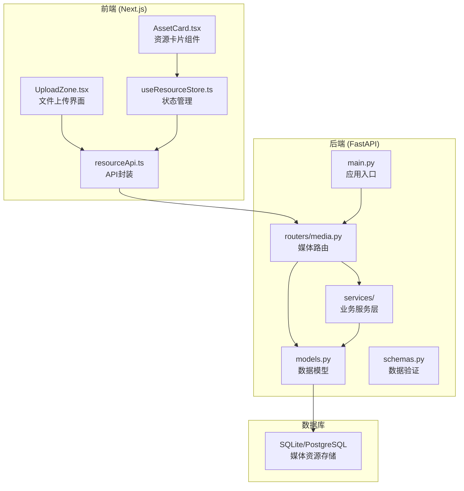
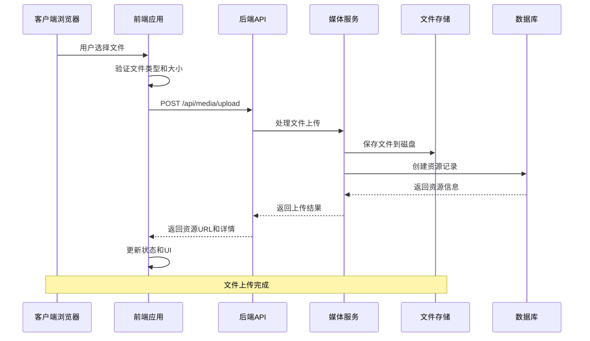
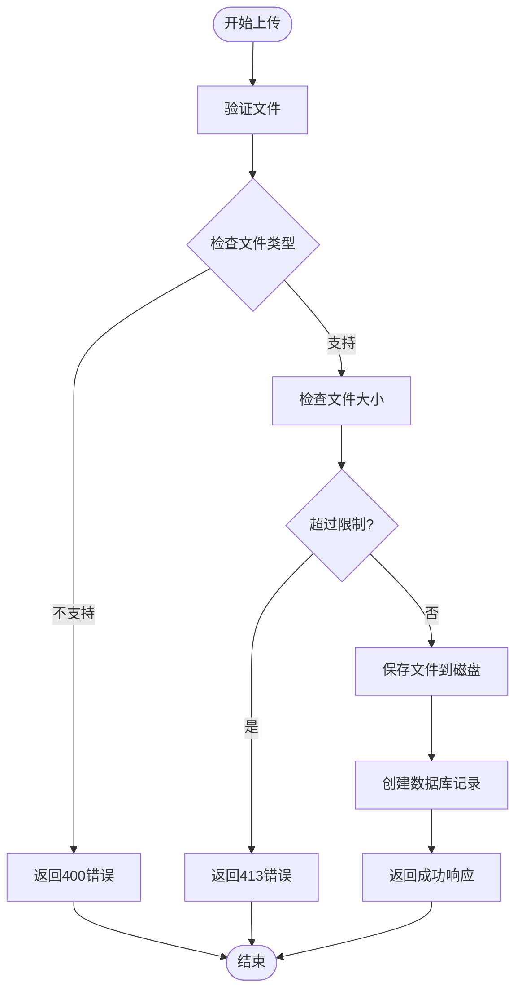
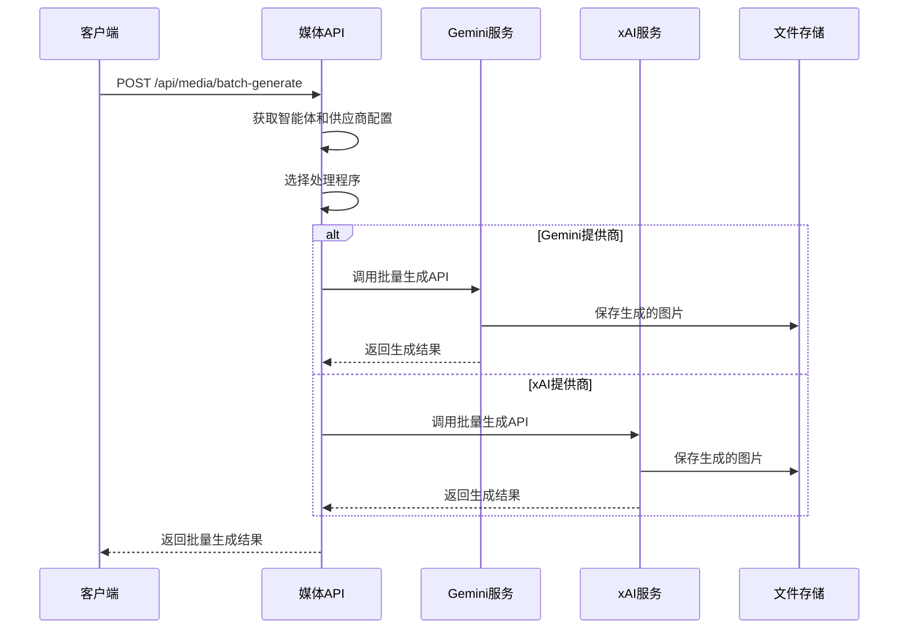
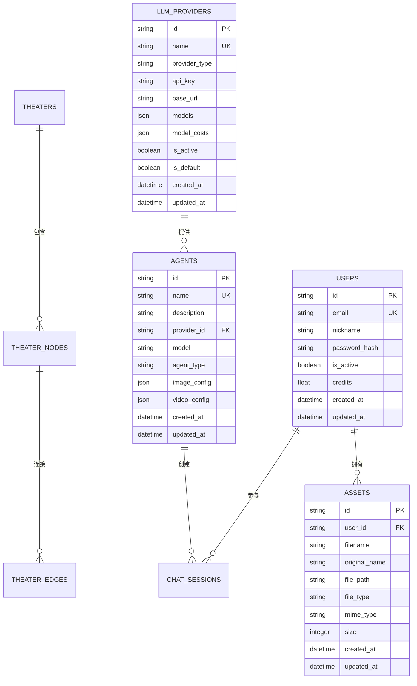
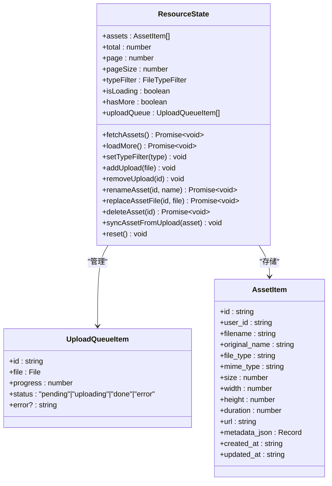
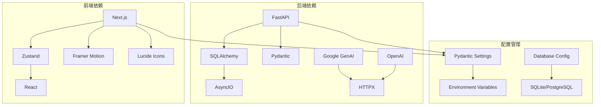

# 多模态文件上传系统

<cite>
**本文档引用的文件**
- [backend/main.py](file://backend/main.py)
- [backend/routers/media.py](file://backend/routers/media.py)
- [backend/services/media_utils.py](file://backend/services/media_utils.py)
- [backend/services/batch_image_gen.py](file://backend/services/batch_image_gen.py)
- [backend/services/xai_image_gen.py](file://backend/services/xai_image_gen.py)
- [backend/services/image_config_adapter.py](file://backend/services/image_config_adapter.py)
- [backend/models.py](file://backend/models.py)
- [backend/schemas.py](file://backend/schemas.py)
- [backend/config.py](file://backend/config.py)
- [frontend/src/components/resources/UploadZone.tsx](file://frontend/src/components/resources/UploadZone.tsx)
- [frontend/src/components/resources/AssetCard.tsx](file://frontend/src/components/resources/AssetCard.tsx)
- [frontend/src/store/useResourceStore.ts](file://frontend/src/store/useResourceStore.ts)
- [frontend/src/lib/resourceApi.ts](file://frontend/src/lib/resourceApi.ts)
</cite>

## 目录
1. [简介](#简介)
2. [项目结构](#项目结构)
3. [核心组件](#核心组件)
4. [架构概览](#架构概览)
5. [详细组件分析](#详细组件分析)
6. [依赖关系分析](#依赖关系分析)
7. [性能考虑](#性能考虑)
8. [故障排除指南](#故障排除指南)
9. [结论](#结论)

## 简介

多模态文件上传系统是一个基于FastAPI和React构建的现代化媒体资源管理系统，支持图片、视频、音频等多种媒体格式的上传、管理和生成。系统采用前后端分离架构，后端提供RESTful API接口，前端提供直观的用户界面，支持批量文件上传、资源管理、AI图片生成等功能。

该系统的核心特色包括：
- 多媒体格式支持：图片（PNG、JPG、WEBP、GIF）、视频（MP4、WEBM、MOV）、音频（MP3、WAV）
- 智能文件上传：拖拽上传、进度显示、大小限制
- 资源管理：分页浏览、类型筛选、重命名、替换、删除
- AI图片生成：支持Gemini和xAI两种AI提供商
- 统一配置管理：供应商无关的图像生成配置

## 项目结构

系统采用清晰的分层架构，前后端分离设计：

**图表来源**
- [backend/main.py:110-180](file://backend/main.py#L110-L180)
- [frontend/src/components/resources/UploadZone.tsx:33-129](file://frontend/src/components/resources/UploadZone.tsx#L33-L129)

**章节来源**
- [backend/main.py:1-180](file://backend/main.py#L1-180)
- [frontend/src/components/resources/UploadZone.tsx:1-129](file://frontend/src/components/resources/UploadZone.tsx#L1-L129)

## 核心组件

### 后端核心组件

#### 媒体路由模块
媒体路由模块提供完整的媒体文件管理功能，包括上传、下载、列表查询、批量生成等操作。

#### 业务服务层
- **文件保存工具**：提供内联图片保存、远程URL下载等功能
- **批量图片生成**：支持Gemini和xAI两种AI提供商的批量图片生成
- **配置适配器**：将统一的图像配置转换为不同供应商的特定格式

#### 数据模型层
系统包含完整的数据模型定义，支持用户、资源、智能体、会话等核心业务实体。

**章节来源**
- [backend/routers/media.py:1-444](file://backend/routers/media.py#L1-L444)
- [backend/services/media_utils.py:1-79](file://backend/services/media_utils.py#L1-L79)
- [backend/services/batch_image_gen.py:1-187](file://backend/services/batch_image_gen.py#L1-L187)
- [backend/services/xai_image_gen.py:1-191](file://backend/services/xai_image_gen.py#L1-L191)
- [backend/models.py:131-150](file://backend/models.py#L131-L150)

### 前端核心组件

#### 上传区域组件
提供拖拽上传、文件选择、进度显示、错误处理等功能的用户界面组件。

#### 资源卡片组件
展示媒体资源的预览、元数据、操作菜单等信息的UI组件。

#### 状态管理
使用Zustand实现的状态管理，负责资源列表、上传队列、过滤条件等状态的管理。

**章节来源**
- [frontend/src/components/resources/UploadZone.tsx:33-129](file://frontend/src/components/resources/UploadZone.tsx#L33-L129)
- [frontend/src/components/resources/AssetCard.tsx:89-216](file://frontend/src/components/resources/AssetCard.tsx#L89-L216)
- [frontend/src/store/useResourceStore.ts:51-182](file://frontend/src/store/useResourceStore.ts#L51-L182)

## 架构概览

系统采用现代Web应用架构，实现了前后端的清晰分离：

**图表来源**
- [backend/routers/media.py:95-149](file://backend/routers/media.py#L95-L149)
- [frontend/src/lib/resourceApi.ts:53-87](file://frontend/src/lib/resourceApi.ts#L53-L87)

系统架构特点：
- **RESTful API设计**：清晰的HTTP方法和状态码使用
- **异步处理**：支持并发上传和批量处理
- **配置驱动**：统一的图像生成配置支持多供应商
- **安全考虑**：文件名安全验证、大小限制、权限控制

## 详细组件分析

### 媒体上传流程

#### 文件上传处理流程

**图表来源**
- [backend/routers/media.py:95-149](file://backend/routers/media.py#L95-L149)

#### 批量图片生成流程

系统支持两种AI提供商的批量图片生成：

**图表来源**
- [backend/routers/media.py:301-444](file://backend/routers/media.py#L301-L444)
- [backend/services/batch_image_gen.py:113-187](file://backend/services/batch_image_gen.py#L113-L187)
- [backend/services/xai_image_gen.py:125-191](file://backend/services/xai_image_gen.py#L125-L191)

**章节来源**
- [backend/routers/media.py:301-444](file://backend/routers/media.py#L301-L444)
- [backend/services/batch_image_gen.py:113-187](file://backend/services/batch_image_gen.py#L113-L187)
- [backend/services/xai_image_gen.py:125-191](file://backend/services/xai_image_gen.py#L125-L191)

### 数据模型设计

系统采用SQLAlchemy ORM定义了完整的数据模型：

**图表来源**
- [backend/models.py:131-176](file://backend/models.py#L131-L176)
- [backend/models.py:35-73](file://backend/models.py#L35-L73)

**章节来源**
- [backend/models.py:131-176](file://backend/models.py#L131-L176)
- [backend/models.py:35-73](file://backend/models.py#L35-L73)

### 前端组件架构

#### 状态管理模式

**图表来源**
- [frontend/src/store/useResourceStore.ts:18-43](file://frontend/src/store/useResourceStore.ts#L18-L43)
- [frontend/src/store/useResourceStore.ts:10-16](file://frontend/src/store/useResourceStore.ts#L10-L16)

**章节来源**
- [frontend/src/store/useResourceStore.ts:18-43](file://frontend/src/store/useResourceStore.ts#L18-L43)
- [frontend/src/store/useResourceStore.ts:10-16](file://frontend/src/store/useResourceStore.ts#L10-L16)

## 依赖关系分析

系统采用模块化的依赖设计，各组件之间保持低耦合：

**图表来源**
- [backend/config.py:7-43](file://backend/config.py#L7-L43)
- [frontend/src/store/useResourceStore.ts:1-3](file://frontend/src/store/useResourceStore.ts#L1-L3)

主要依赖关系：
- **后端**：FastAPI作为核心框架，SQLAlchemy进行数据库操作，Google GenAI和OpenAI提供AI服务
- **前端**：Next.js提供React框架，Zustand管理状态，Lucide图标库提供UI组件
- **配置**：Pydantic Settings统一管理环境配置

**章节来源**
- [backend/config.py:7-43](file://backend/config.py#L7-L43)
- [frontend/src/store/useResourceStore.ts:1-3](file://frontend/src/store/useResourceStore.ts#L1-L3)

## 性能考虑

### 并发处理
系统采用异步编程模型，支持高并发的文件上传和批量处理：

- **批量生成并发**：支持1-8个并发任务，避免API限流
- **文件上传并发**：使用XMLHttpRequest的onprogress事件实现实时进度反馈
- **数据库连接池**：使用异步SQLAlchemy连接池提高数据库访问效率

### 缓存策略
- **静态文件缓存**：媒体文件使用长期缓存策略（Cache-Control: 31536000）
- **API响应缓存**：合理使用HTTP缓存头减少重复请求
- **状态缓存**：前端使用Zustand状态管理，避免不必要的重新渲染

### 资源优化
- **文件大小限制**：防止恶意文件上传和资源滥用
- **内存管理**：大文件采用流式处理，避免内存溢出
- **数据库索引**：为常用查询字段建立索引提高查询性能

## 故障排除指南

### 常见问题及解决方案

#### 文件上传失败
**问题症状**：上传过程中出现错误或文件无法保存
**可能原因**：
- 文件类型不支持
- 文件大小超过限制
- 磁盘空间不足
- 权限问题

**解决步骤**：
1. 检查文件扩展名是否在支持列表中
2. 验证文件大小是否超过限制（图片50MB，视频500MB，音频100MB）
3. 确认服务器磁盘空间充足
4. 检查文件写入权限

#### AI图片生成失败
**问题症状**：批量生成图片时出现错误
**可能原因**：
- API密钥无效或过期
- 网络连接问题
- 供应商API限流
- 配置参数不正确

**解决步骤**：
1. 验证API密钥的有效性
2. 检查网络连接状态
3. 确认供应商API可用性
4. 检查配置参数的正确性

#### 数据库连接问题
**问题症状**：应用启动时数据库连接失败
**可能原因**：
- 数据库服务未启动
- 连接字符串配置错误
- 权限不足
- 数据库版本不兼容

**解决步骤**：
1. 检查数据库服务状态
2. 验证连接字符串配置
3. 确认数据库用户权限
4. 检查数据库版本兼容性

**章节来源**
- [backend/routers/media.py:117-131](file://backend/routers/media.py#L117-L131)
- [backend/routers/media.py:325-329](file://backend/routers/media.py#L325-L329)

## 结论

多模态文件上传系统是一个功能完整、架构清晰的现代化媒体资源管理平台。系统的主要优势包括：

### 技术优势
- **模块化设计**：前后端分离，组件职责明确
- **异步处理**：支持高并发和良好的用户体验
- **配置驱动**：统一的图像生成配置支持多供应商
- **安全性**：完善的文件验证和权限控制机制

### 功能特色
- **多格式支持**：全面支持图片、视频、音频等多媒体格式
- **智能上传**：拖拽上传、进度显示、错误处理
- **AI集成**：内置Gemini和xAI图片生成能力
- **资源管理**：完整的资源生命周期管理

### 扩展性
系统具有良好的扩展性，可以轻松添加新的媒体格式、AI提供商或功能模块。统一的配置管理和清晰的架构设计为未来的功能扩展提供了坚实的基础。

该系统适合用于需要多媒体资源管理的各类应用场景，为用户提供高效、便捷的媒体资源处理体验。