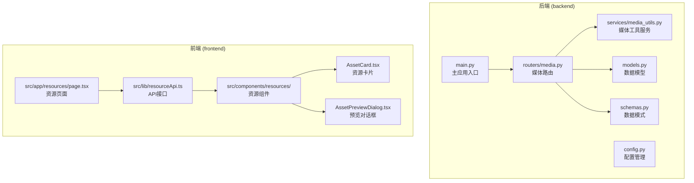
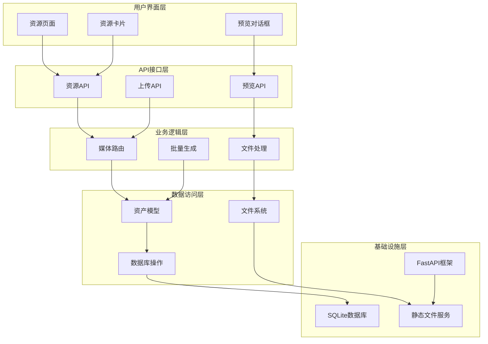
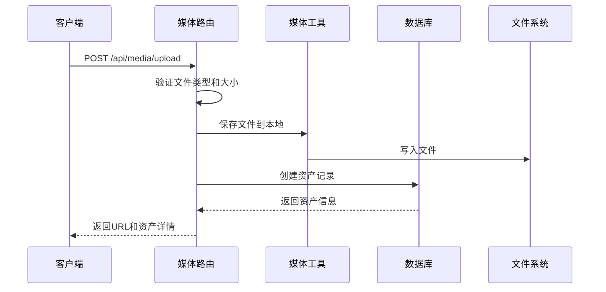
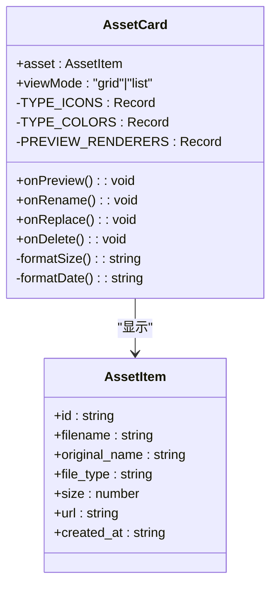
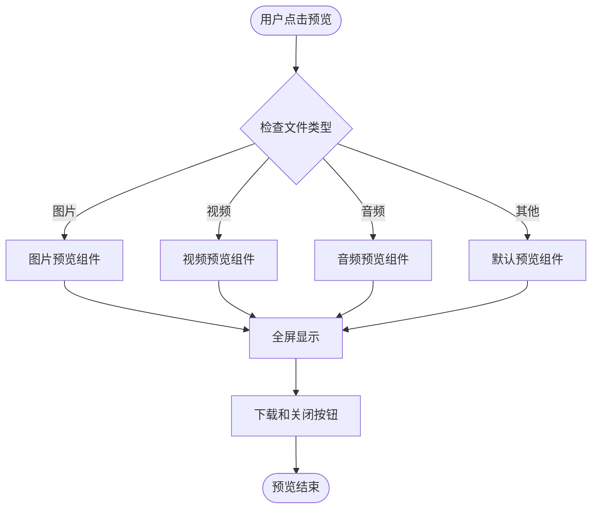
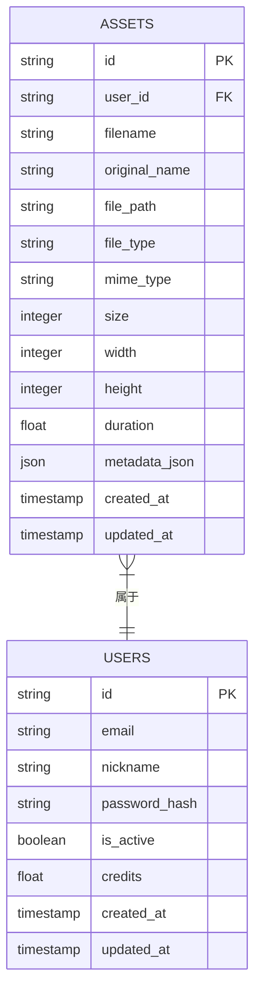
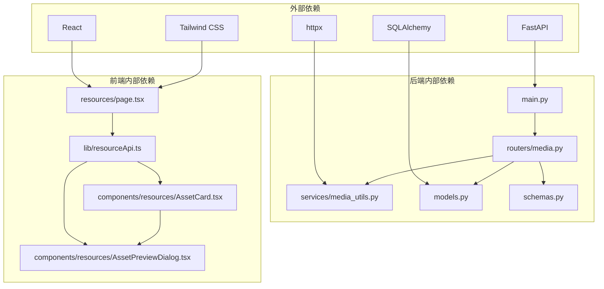

# 文件预览系统

<cite>
**本文档引用的文件**
- [main.py](file://backend/main.py)
- [media.py](file://backend/routers/media.py)
- [media_utils.py](file://backend/services/media_utils.py)
- [models.py](file://backend/models.py)
- [schemas.py](file://backend/schemas.py)
- [config.py](file://backend/config.py)
- [AssetPreviewDialog.tsx](file://frontend/src/components/resources/AssetPreviewDialog.tsx)
- [AssetCard.tsx](file://frontend/src/components/resources/AssetCard.tsx)
- [resourceApi.ts](file://frontend/src/lib/resourceApi.ts)
- [page.tsx](file://frontend/src/app/resources/page.tsx)
- [README.md](file://README.md)
</cite>

## 目录
1. [简介](#简介)
2. [项目结构](#项目结构)
3. [核心组件](#核心组件)
4. [架构概览](#架构概览)
5. [详细组件分析](#详细组件分析)
6. [依赖关系分析](#依赖关系分析)
7. [性能考虑](#性能考虑)
8. [故障排除指南](#故障排除指南)
9. [结论](#结论)

## 简介

文件预览系统是KunFlix平台的核心功能模块，负责管理用户上传的媒体资源（图片、视频、音频），提供完整的资源生命周期管理，包括上传、存储、预览、编辑和删除等功能。该系统采用前后端分离架构，后端使用FastAPI提供RESTful API，前端使用React构建用户界面。

## 项目结构

文件预览系统主要分布在以下目录结构中：

**图表来源**
- [main.py:110-180](file://backend/main.py#L110-L180)
- [media.py:30-444](file://backend/routers/media.py#L30-L444)
- [page.tsx:71-672](file://frontend/src/app/resources/page.tsx#L71-L672)

**章节来源**
- [README.md:266-278](file://README.md#L266-L278)

## 核心组件

文件预览系统包含以下核心组件：

### 后端组件

1. **媒体路由层** - 处理文件上传、下载、CRUD操作
2. **媒体工具服务** - 提供文件保存、下载功能
3. **数据模型层** - 定义Asset实体和相关关系
4. **API接口层** - 提供RESTful API端点

### 前端组件

1. **资源页面** - 主界面，包含文件上传、过滤、视图切换
2. **资源卡片** - 显示单个资源的缩略图和基本信息
3. **预览对话框** - 支持图片、视频、音频的全屏预览
4. **API封装** - 统一的HTTP请求处理

**章节来源**
- [media.py:95-266](file://backend/routers/media.py#L95-L266)
- [AssetCard.tsx:89-216](file://frontend/src/components/resources/AssetCard.tsx#L89-L216)
- [AssetPreviewDialog.tsx:64-102](file://frontend/src/components/resources/AssetPreviewDialog.tsx#L64-L102)

## 架构概览

文件预览系统采用分层架构设计，确保了良好的可维护性和扩展性：

**图表来源**
- [main.py:143-158](file://backend/main.py#L143-L158)
- [media.py:30-444](file://backend/routers/media.py#L30-L444)
- [models.py:131-150](file://backend/models.py#L131-L150)

## 详细组件分析

### 后端媒体路由系统

媒体路由系统提供了完整的文件管理功能：

#### 文件上传处理

**图表来源**
- [media.py:95-149](file://backend/routers/media.py#L95-L149)
- [media_utils.py:20-28](file://backend/services/media_utils.py#L20-L28)

#### 资源管理功能

系统支持以下资源管理操作：

1. **列表查询** - 支持分页、类型筛选、排序
2. **更新操作** - 重命名和替换文件
3. **删除操作** - 硬删除数据库记录和文件
4. **预览服务** - 安全的文件提供机制

**章节来源**
- [media.py:155-266](file://backend/routers/media.py#L155-L266)

### 前端资源展示系统

前端资源展示系统提供了丰富的用户交互体验：

#### 资源卡片组件

**图表来源**
- [AssetCard.tsx:89-216](file://frontend/src/components/resources/AssetCard.tsx#L89-L216)

#### 预览对话框系统

预览对话框支持多种媒体类型的渲染：

**图表来源**
- [AssetPreviewDialog.tsx:12-53](file://frontend/src/components/resources/AssetPreviewDialog.tsx#L12-L53)

**章节来源**
- [AssetPreviewDialog.tsx:64-102](file://frontend/src/components/resources/AssetPreviewDialog.tsx#L64-L102)

### 数据模型设计

系统采用清晰的数据模型设计：

**图表来源**
- [models.py:131-150](file://backend/models.py#L131-L150)

**章节来源**
- [models.py:131-150](file://backend/models.py#L131-L150)

## 依赖关系分析

文件预览系统的依赖关系呈现清晰的层次结构：

**图表来源**
- [main.py:32-45](file://backend/main.py#L32-L45)
- [media.py:1-28](file://backend/routers/media.py#L1-L28)
- [page.tsx:1-22](file://frontend/src/app/resources/page.tsx#L1-L22)

**章节来源**
- [config.py:1-43](file://backend/config.py#L1-L43)

## 性能考虑

文件预览系统在设计时充分考虑了性能优化：

### 文件上传优化

1. **异步处理** - 使用异步IO避免阻塞
2. **内存管理** - 大文件直接写入磁盘而非内存
3. **并发控制** - 支持批量文件上传和处理

### 缓存策略

1. **静态文件缓存** - 设置合理的Cache-Control头
2. **数据库查询优化** - 使用分页和索引
3. **前端状态管理** - 使用Zustand进行状态缓存

### 性能监控

系统实现了多层次的性能监控：
- 请求耗时统计
- 数据库查询性能
- 文件传输速度监控

## 故障排除指南

### 常见问题及解决方案

#### 文件上传失败

**问题症状**：上传过程中出现错误提示

**可能原因**：
1. 文件大小超过限制
2. 文件类型不受支持
3. 磁盘空间不足
4. 权限问题

**解决步骤**：
1. 检查文件大小是否超过限制（图片50MB，视频500MB，音频100MB）
2. 验证文件扩展名是否在支持列表中
3. 确认服务器磁盘空间充足
4. 检查文件权限设置

#### 预览无法显示

**问题症状**：点击预览后无法显示媒体内容

**可能原因**：
1. 文件路径错误
2. MIME类型识别失败
3. 浏览器兼容性问题

**解决步骤**：
1. 验证文件是否正确保存到媒体目录
2. 检查文件扩展名是否正确
3. 确认浏览器支持该媒体格式

#### 数据库连接问题

**问题症状**：系统启动时数据库连接失败

**解决步骤**：
1. 检查DATABASE_URL配置
2. 验证数据库服务状态
3. 确认数据库凭据正确性

**章节来源**
- [media.py:117-123](file://backend/routers/media.py#L117-L123)
- [media_utils.py:31-50](file://backend/services/media_utils.py#L31-L50)

## 结论

文件预览系统是一个功能完整、架构清晰的媒体资源管理解决方案。系统采用了现代化的技术栈和最佳实践，提供了优秀的用户体验和可靠的性能表现。

### 主要优势

1. **模块化设计** - 清晰的分层架构便于维护和扩展
2. **安全性考虑** - 文件名安全验证和权限控制
3. **用户体验** - 流畅的拖拽上传和预览体验
4. **性能优化** - 异步处理和缓存策略

### 技术亮点

1. **前后端分离** - 使用React和FastAPI实现现代化架构
2. **类型安全** - TypeScript和Pydantic提供运行时类型检查
3. **国际化支持** - 多语言界面支持
4. **主题切换** - 深色/浅色主题自由切换

该系统为KunFlix平台的影视创作提供了坚实的基础，支持从简单的图片管理到复杂的视频资产管理需求。通过持续的优化和扩展，该系统能够满足不断增长的业务需求。