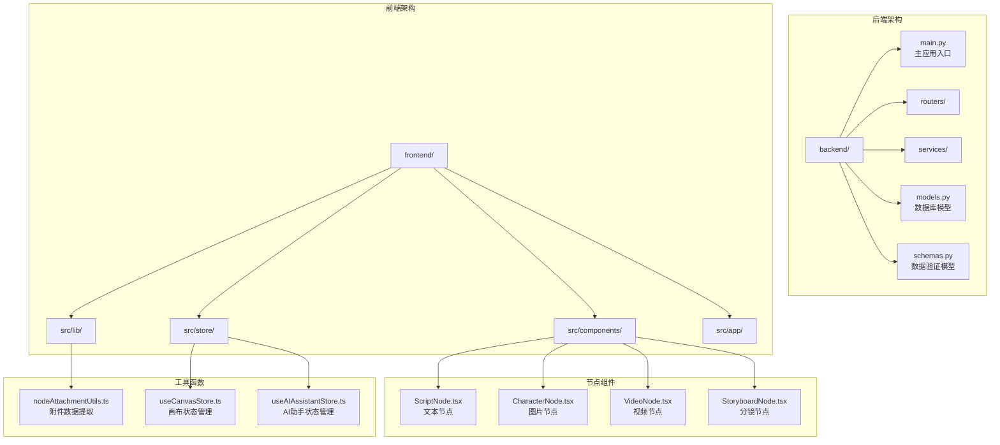
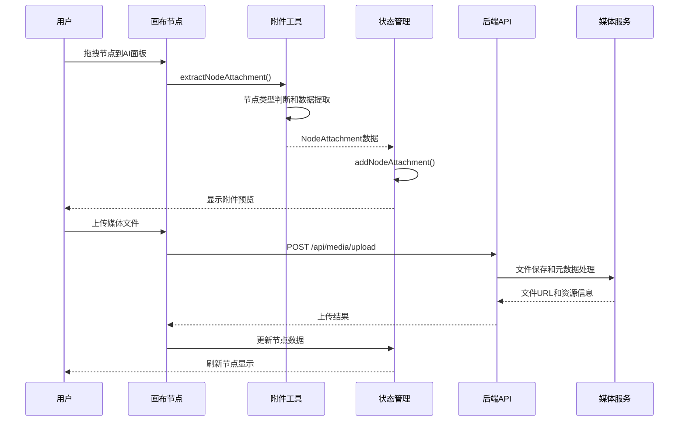
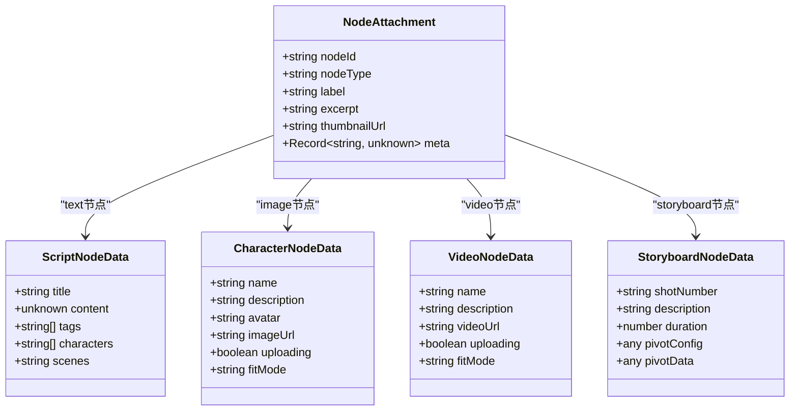
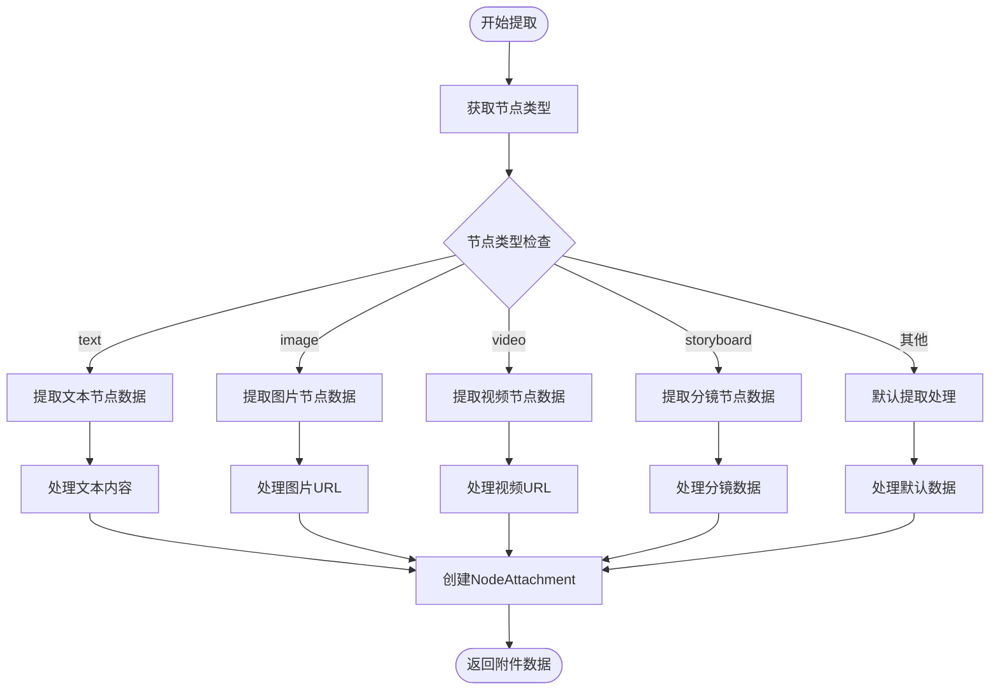
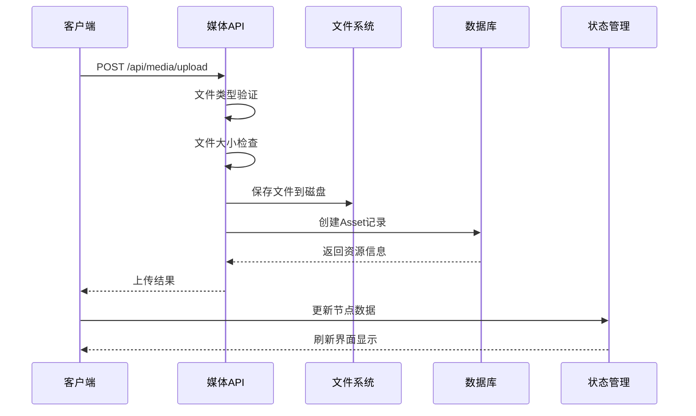
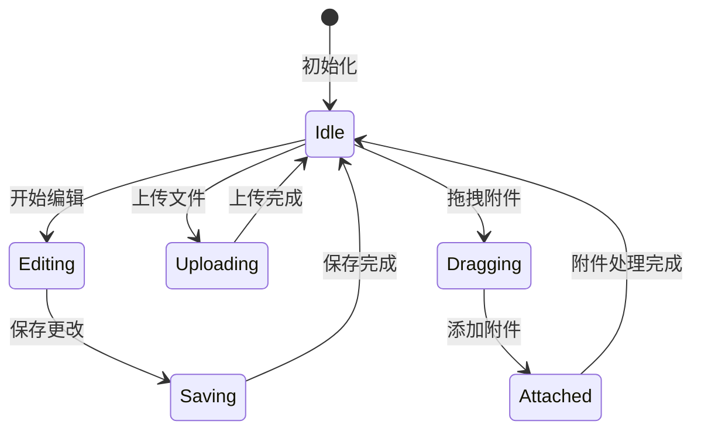
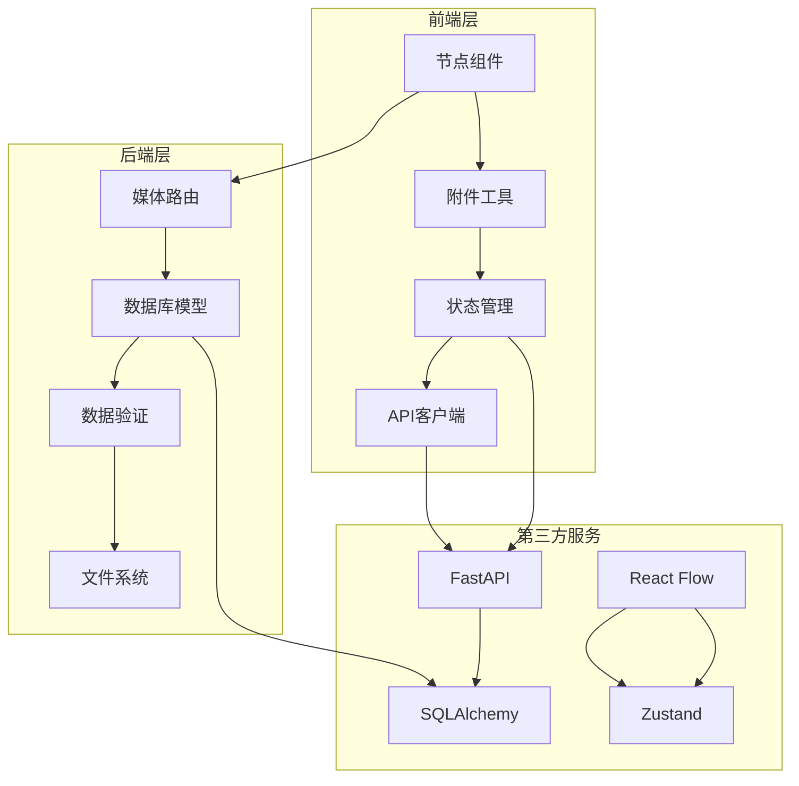

# 节点附件系统

<cite>
**本文档引用的文件**
- [main.py](file://backend/main.py)
- [models.py](file://backend/models.py)
- [schemas.py](file://backend/schemas.py)
- [media.py](file://backend/routers/media.py)
- [nodeAttachmentUtils.ts](file://frontend/src/lib/nodeAttachmentUtils.ts)
- [CharacterNode.tsx](file://frontend/src/components/canvas/CharacterNode.tsx)
- [VideoNode.tsx](file://frontend/src/components/canvas/VideoNode.tsx)
- [ScriptNode.tsx](file://frontend/src/components/canvas/ScriptNode.tsx)
- [StoryboardNode.tsx](file://frontend/src/components/canvas/StoryboardNode.tsx)
- [useCanvasStore.ts](file://frontend/src/store/useCanvasStore.ts)
- [useAIAssistantStore.ts](file://frontend/src/store/useAIAssistantStore.ts)
- [README.md](file://README.md)
</cite>

## 目录
1. [简介](#简介)
2. [项目结构](#项目结构)
3. [核心组件](#核心组件)
4. [架构概览](#架构概览)
5. [详细组件分析](#详细组件分析)
6. [依赖关系分析](#依赖关系分析)
7. [性能考虑](#性能考虑)
8. [故障排除指南](#故障排除指南)
9. [结论](#结论)

## 简介

节点附件系统是KunFlix平台中一个关键的功能模块，它实现了画布节点与AI助手面板之间的媒体资源交互机制。该系统允许用户通过拖拽操作将画布上的文本、图片、视频和分镜节点转换为AI助手可以理解和使用的附件数据，从而实现更丰富的多模态创作体验。

系统采用前后端分离架构，后端使用FastAPI提供RESTful API接口，前端使用React和TypeScript构建交互界面。核心功能包括节点数据提取、媒体资源上传、附件数据转换和多模态内容处理。

## 项目结构

KunFlix平台采用模块化的项目结构，节点附件系统主要分布在以下目录中：

**图表来源**
- [main.py:1-180](file://backend/main.py#L1-L180)
- [models.py:1-506](file://backend/models.py#L1-L506)
- [schemas.py:1-800](file://backend/schemas.py#L1-L800)

**章节来源**
- [README.md:266-278](file://README.md#L266-L278)

## 核心组件

节点附件系统包含多个核心组件，每个组件都有特定的职责和功能：

### 后端组件

1. **媒体路由模块** (`backend/routers/media.py`)
   - 提供文件上传、下载和管理功能
   - 支持多种媒体格式（图片、视频、音频）
   - 实现安全的文件访问控制

2. **数据库模型** (`backend/models.py`)
   - 定义Asset资源表结构
   - 支持用户级别的媒体资源共享
   - 提供文件元数据存储

3. **数据验证模型** (`backend/schemas.py`)
   - 定义API请求和响应的数据结构
   - 提供数据验证和序列化功能

### 前端组件

1. **附件数据提取工具** (`frontend/src/lib/nodeAttachmentUtils.ts`)
   - 将画布节点转换为AI助手可识别的附件格式
   - 支持不同节点类型的差异化处理
   - 实现文本内容的智能提取和截取

2. **节点组件** (`frontend/src/components/canvas/`)
   - **ScriptNode**: 文本节点，支持富文本编辑
   - **CharacterNode**: 图片节点，支持图片上传和编辑
   - **VideoNode**: 视频节点，支持视频上传和播放
   - **StoryboardNode**: 分镜节点，支持数据透视表编辑

3. **状态管理** (`frontend/src/store/`)
   - **useCanvasStore**: 画布状态管理，维护节点和边的关系
   - **useAIAssistantStore**: AI助手状态管理，处理附件和消息

**章节来源**
- [media.py:1-444](file://backend/routers/media.py#L1-L444)
- [models.py:131-150](file://backend/models.py#L131-L150)
- [schemas.py:88-92](file://backend/schemas.py#L88-L92)

## 架构概览

节点附件系统采用分层架构设计，确保了良好的可维护性和扩展性：

**图表来源**
- [nodeAttachmentUtils.ts:86-97](file://frontend/src/lib/nodeAttachmentUtils.ts#L86-L97)
- [CharacterNode.tsx:137-215](file://frontend/src/components/canvas/CharacterNode.tsx#L137-L215)
- [media.py:95-149](file://backend/routers/media.py#L95-L149)

系统架构的关键特点：

1. **前后端分离**: 前端负责用户交互和状态管理，后端提供数据服务
2. **模块化设计**: 每个组件职责明确，便于独立开发和测试
3. **类型安全**: 使用TypeScript确保类型安全，减少运行时错误
4. **状态持久化**: 使用Zustand实现状态持久化，提升用户体验

## 详细组件分析

### 附件数据提取系统

附件数据提取是节点附件系统的核心功能，负责将不同类型的画布节点转换为AI助手可以理解的统一格式。

#### 数据结构设计

**图表来源**
- [useAIAssistantStore.ts:89-96](file://frontend/src/store/useAIAssistantStore.ts#L89-L96)
- [useCanvasStore.ts:27-58](file://frontend/src/store/useCanvasStore.ts#L27-L58)

#### 提取算法流程

**图表来源**
- [nodeAttachmentUtils.ts:24-81](file://frontend/src/lib/nodeAttachmentUtils.ts#L24-L81)

#### 文本内容提取

文本节点的处理相对简单，主要涉及富文本内容的提取和截取：

1. **富文本遍历**: 递归遍历Tiptap JSON结构，提取纯文本内容
2. **长度控制**: 限制提取内容的最大长度，避免过长文本影响性能
3. **格式保留**: 保持文本的基本格式信息

#### 媒体资源处理

图片和视频节点需要特殊的URL处理逻辑：

1. **URL标准化**: 将相对路径转换为完整的API路径
2. **格式验证**: 确保媒体URL符合预期格式
3. **预览支持**: 为不同媒体类型提供合适的预览方式

**章节来源**
- [nodeAttachmentUtils.ts:7-19](file://frontend/src/lib/nodeAttachmentUtils.ts#L7-L19)
- [nodeAttachmentUtils.ts:36-52](file://frontend/src/lib/nodeAttachmentUtils.ts#L36-L52)
- [nodeAttachmentUtils.ts:53-69](file://frontend/src/lib/nodeAttachmentUtils.ts#L53-L69)

### 媒体上传和管理

媒体上传功能是节点附件系统的重要组成部分，提供了完整的文件上传、存储和管理能力。

#### 上传流程

**图表来源**
- [CharacterNode.tsx:137-215](file://frontend/src/components/canvas/CharacterNode.tsx#L137-L215)
- [VideoNode.tsx:109-190](file://frontend/src/components/canvas/VideoNode.tsx#L109-L190)
- [media.py:95-149](file://backend/routers/media.py#L95-L149)

#### 文件类型和大小限制

系统支持多种媒体格式，每种格式都有相应的大小限制：

| 文件类型 | 支持格式 | 大小限制 |
|---------|---------|---------|
| 图片 | PNG, JPEG, WEBP, GIF | 50MB |
| 视频 | MP4, WEBM, OGG | 500MB |
| 音频 | MP3, WAV | 100MB |

#### 安全验证机制

1. **文件扩展名验证**: 确保上传文件具有合法的扩展名
2. **MIME类型检查**: 验证文件的实际类型
3. **路径安全**: 防止路径遍历攻击
4. **权限控制**: 确保用户只能访问自己的文件

**章节来源**
- [media.py:32-69](file://backend/routers/media.py#L32-L69)
- [media.py:106-123](file://backend/routers/media.py#L106-L123)

### 状态管理系统

状态管理是节点附件系统的基础，负责协调前后端的状态同步和数据流转。

#### 画布状态管理

**图表来源**
- [useCanvasStore.ts:185-540](file://frontend/src/store/useCanvasStore.ts#L185-L540)
- [useAIAssistantStore.ts:247-449](file://frontend/src/store/useAIAssistantStore.ts#L247-L449)

#### 附件状态管理

AI助手的状态管理特别关注附件的生命周期：

1. **多附件支持**: 支持同时管理多个附件（最多5个）
2. **状态同步**: 确保附件状态与画布节点保持同步
3. **内存管理**: 合理管理附件数据的内存使用
4. **持久化存储**: 使用localStorage持久化用户偏好设置

**章节来源**
- [useCanvasStore.ts:67-114](file://frontend/src/store/useCanvasStore.ts#L67-L114)
- [useAIAssistantStore.ts:123-238](file://frontend/src/store/useAIAssistantStore.ts#L123-L238)

## 依赖关系分析

节点附件系统的依赖关系体现了清晰的分层架构设计：

**图表来源**
- [main.py:32-45](file://backend/main.py#L32-L45)
- [CharacterNode.tsx:1-10](file://frontend/src/components/canvas/CharacterNode.tsx#L1-L10)
- [useCanvasStore.ts:17-24](file://frontend/src/store/useCanvasStore.ts#L17-L24)

### 核心依赖关系

1. **前端依赖**:
   - React和TypeScript提供类型安全的UI开发
   - Zustand实现轻量级状态管理
   - React Flow提供画布交互功能
   - Tailwind CSS实现响应式设计

2. **后端依赖**:
   - FastAPI提供高性能的Web服务
   - SQLAlchemy实现ORM数据访问
   - UUID库确保唯一标识符生成
   - Pydantic提供数据验证和序列化

3. **工具库依赖**:
   - UUID: 确保节点和资源的唯一性
   - Pathlib: 处理文件路径和目录操作
   - JSON: 处理富文本内容和配置数据
   - Logging: 提供系统日志记录

**章节来源**
- [main.py:1-50](file://backend/main.py#L1-L50)
- [useCanvasStore.ts:1-25](file://frontend/src/store/useCanvasStore.ts#L1-L25)

## 性能考虑

节点附件系统在设计时充分考虑了性能优化，采用了多种策略来提升用户体验：

### 前端性能优化

1. **虚拟滚动**: 使用虚拟滚动技术处理大量消息和附件
2. **懒加载**: 图片和视频采用懒加载策略，减少初始加载时间
3. **状态缓存**: 使用localStorage缓存用户偏好设置
4. **事件防抖**: 对频繁触发的操作进行防抖处理

### 后端性能优化

1. **异步处理**: 使用async/await模式处理I/O密集型操作
2. **数据库连接池**: 配置合理的数据库连接池大小
3. **文件缓存**: 对常用文件进行缓存以减少磁盘I/O
4. **并发控制**: 限制同时进行的文件上传数量

### 内存管理

1. **对象URL清理**: 及时释放临时的文件对象URL
2. **附件数量限制**: 限制同时处理的附件数量（最多5个）
3. **状态清理**: 定期清理过期的状态数据
4. **垃圾回收**: 合理使用JavaScript垃圾回收机制

## 故障排除指南

### 常见问题及解决方案

#### 上传失败问题

**问题症状**:
- 文件上传过程中出现错误提示
- 上传进度条卡住不动
- 节点状态停留在上传中

**可能原因**:
1. 文件格式不支持
2. 文件大小超出限制
3. 网络连接不稳定
4. 服务器存储空间不足

**解决步骤**:
1. 检查文件格式是否在支持列表内
2. 确认文件大小不超过限制
3. 验证网络连接稳定性
4. 查看服务器磁盘空间使用情况

#### 附件显示异常

**问题症状**:
- 附件无法正常显示
- 预览图片模糊或变形
- 缩略图不显示

**可能原因**:
1. URL路径格式不正确
2. 文件权限设置问题
3. 浏览器缓存问题
4. CORS跨域问题

**解决步骤**:
1. 验证文件URL格式是否正确
2. 检查文件权限设置
3. 清除浏览器缓存
4. 配置正确的CORS头

#### 状态同步问题

**问题症状**:
- 画布节点状态与AI面板不一致
- 附件数据丢失或重复
- 撤销/重做功能异常

**可能原因**:
1. 状态管理冲突
2. 数据持久化失败
3. 并发访问问题
4. 缓存数据过期

**解决步骤**:
1. 检查状态管理器的初始化
2. 验证localStorage的可用性
3. 处理并发访问的竞争条件
4. 清理过期的缓存数据

**章节来源**
- [CharacterNode.tsx:199-215](file://frontend/src/components/canvas/CharacterNode.tsx#L199-L215)
- [VideoNode.tsx:180-190](file://frontend/src/components/canvas/VideoNode.tsx#L180-L190)
- [media.py:125-131](file://backend/routers/media.py#L125-L131)

## 结论

节点附件系统作为KunFlix平台的核心功能模块，成功实现了画布节点与AI助手之间的无缝交互。系统采用现代化的技术栈和架构设计，提供了稳定、高效的媒体资源管理能力。

### 主要成就

1. **功能完整性**: 支持多种节点类型和媒体格式，满足多样化的创作需求
2. **用户体验**: 提供直观的拖拽操作和实时预览功能
3. **性能表现**: 通过多种优化策略确保系统的响应速度
4. **可扩展性**: 模块化设计便于功能扩展和维护

### 技术亮点

1. **类型安全**: 使用TypeScript确保代码质量和开发效率
2. **状态管理**: 采用Zustand实现轻量级但强大的状态管理
3. **异步处理**: 后端采用异步编程模式提升并发处理能力
4. **安全设计**: 实现多层次的安全验证和权限控制

### 未来发展方向

1. **性能优化**: 进一步优化大文件处理和并发访问能力
2. **功能扩展**: 支持更多媒体格式和高级编辑功能
3. **用户体验**: 改进界面设计和交互流程
4. **集成能力**: 增强与其他系统的集成和互操作性

节点附件系统为KunFlix平台奠定了坚实的技术基础，为用户提供了强大而便捷的创作工具，是整个平台生态系统中不可或缺的重要组成部分。