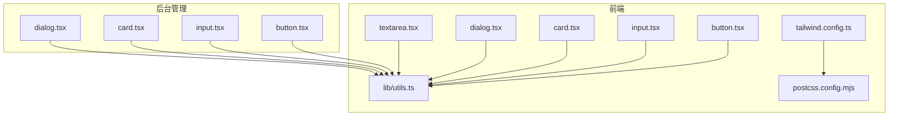
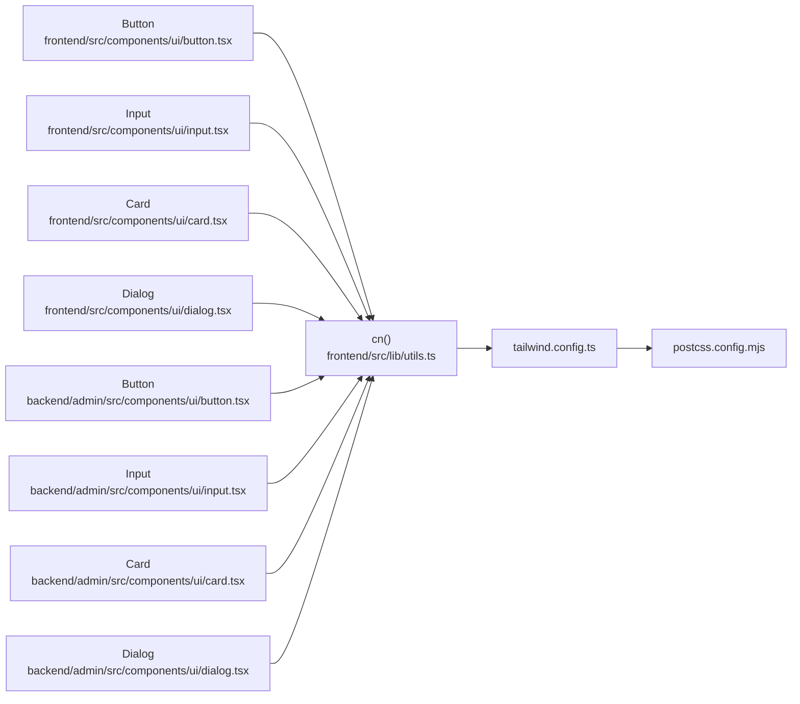
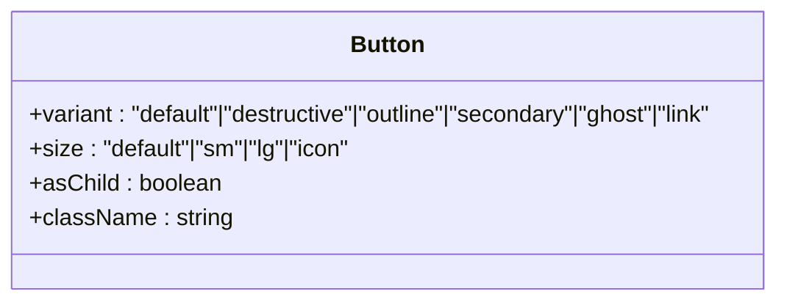
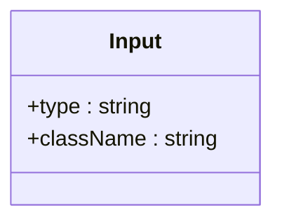
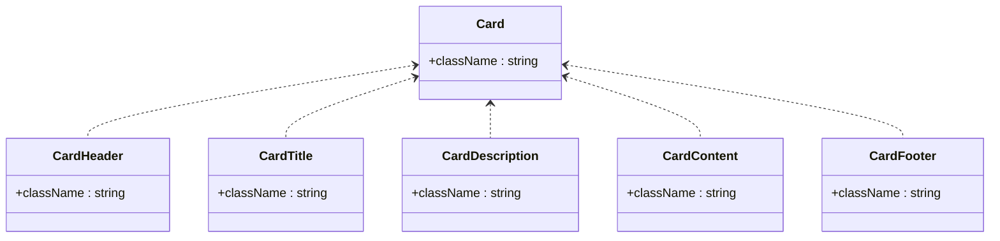
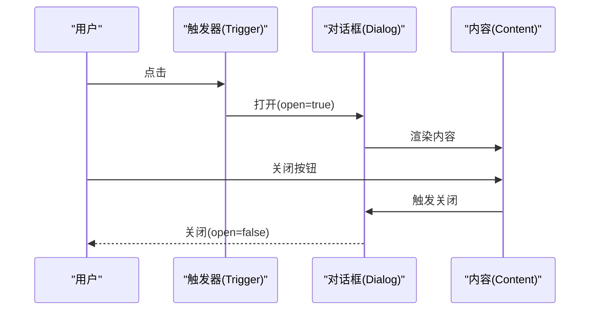
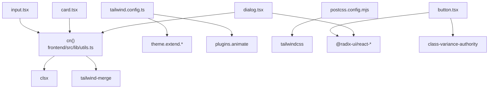

# UI组件库

<cite>
**本文引用的文件**
- [frontend/src/components/ui/button.tsx](file://frontend/src/components/ui/button.tsx)
- [frontend/src/components/ui/input.tsx](file://frontend/src/components/ui/input.tsx)
- [frontend/src/components/ui/card.tsx](file://frontend/src/components/ui/card.tsx)
- [frontend/src/components/ui/dialog.tsx](file://frontend/src/components/ui/dialog.tsx)
- [frontend/src/components/ui/textarea.tsx](file://frontend/src/components/ui/textarea.tsx)
- [frontend/src/lib/utils.ts](file://frontend/src/lib/utils.ts)
- [frontend/tailwind.config.ts](file://frontend/tailwind.config.ts)
- [frontend/postcss.config.mjs](file://frontend/postcss.config.mjs)
- [frontend/package.json](file://frontend/package.json)
- [backend/admin/src/components/ui/button.tsx](file://backend/admin/src/components/ui/button.tsx)
- [backend/admin/src/components/ui/input.tsx](file://backend/admin/src/components/ui/input.tsx)
- [backend/admin/src/components/ui/card.tsx](file://backend/admin/src/components/ui/card.tsx)
- [backend/admin/src/components/ui/dialog.tsx](file://backend/admin/src/components/ui/dialog.tsx)
- [backend/admin/package.json](file://backend/admin/package.json)
</cite>

## 目录
1. [简介](#简介)
2. [项目结构](#项目结构)
3. [核心组件](#核心组件)
4. [架构总览](#架构总览)
5. [组件详解](#组件详解)
6. [依赖关系分析](#依赖关系分析)
7. [性能与可访问性](#性能与可访问性)
8. [使用示例与最佳实践](#使用示例与最佳实践)
9. [故障排查指南](#故障排查指南)
10. [结论](#结论)

## 简介
本文件系统性梳理 Infinite Game 前端与后台管理系统的 UI 组件库，重点覆盖以下内容：
- 基于 Radix UI 与 Ant Design 集成的组件体系（按钮、输入框、卡片、对话框等）
- Tailwind CSS 的实用优先理念：原子化类名、响应式设计与主题定制
- 组件 Props 接口设计、事件处理模式与状态管理思路
- 可访问性支持、性能优化与浏览器兼容性建议
- 使用示例、最佳实践与常见问题解决方案

## 项目结构
前端与后台管理分别维护独立的 UI 组件集合，均采用“按功能分层”的组织方式：
- 前端 UI 组件位于 frontend/src/components/ui
- 后台管理 UI 组件位于 backend/admin/src/components/ui
- 共同依赖 Tailwind CSS 与工具函数进行样式合并与主题扩展

图表来源
- [frontend/src/components/ui/button.tsx:1-57](file://frontend/src/components/ui/button.tsx#L1-L57)
- [frontend/src/components/ui/input.tsx:1-23](file://frontend/src/components/ui/input.tsx#L1-L23)
- [frontend/src/components/ui/card.tsx:1-80](file://frontend/src/components/ui/card.tsx#L1-L80)
- [frontend/src/components/ui/dialog.tsx:1-121](file://frontend/src/components/ui/dialog.tsx#L1-L121)
- [frontend/src/components/ui/textarea.tsx:1-24](file://frontend/src/components/ui/textarea.tsx#L1-L24)
- [frontend/src/lib/utils.ts:1-7](file://frontend/src/lib/utils.ts#L1-L7)
- [frontend/tailwind.config.ts:1-64](file://frontend/tailwind.config.ts#L1-L64)
- [frontend/postcss.config.mjs:1-8](file://frontend/postcss.config.mjs#L1-L8)
- [backend/admin/src/components/ui/button.tsx:1-57](file://backend/admin/src/components/ui/button.tsx#L1-L57)
- [backend/admin/src/components/ui/input.tsx:1-26](file://backend/admin/src/components/ui/input.tsx#L1-L26)
- [backend/admin/src/components/ui/card.tsx:1-80](file://backend/admin/src/components/ui/card.tsx#L1-L80)
- [backend/admin/src/components/ui/dialog.tsx:1-121](file://backend/admin/src/components/ui/dialog.tsx#L1-L121)

章节来源
- [frontend/src/components/ui/button.tsx:1-57](file://frontend/src/components/ui/button.tsx#L1-L57)
- [frontend/src/components/ui/input.tsx:1-23](file://frontend/src/components/ui/input.tsx#L1-L23)
- [frontend/src/components/ui/card.tsx:1-80](file://frontend/src/components/ui/card.tsx#L1-L80)
- [frontend/src/components/ui/dialog.tsx:1-121](file://frontend/src/components/ui/dialog.tsx#L1-L121)
- [frontend/src/components/ui/textarea.tsx:1-24](file://frontend/src/components/ui/textarea.tsx#L1-L24)
- [frontend/src/lib/utils.ts:1-7](file://frontend/src/lib/utils.ts#L1-L7)
- [frontend/tailwind.config.ts:1-64](file://frontend/tailwind.config.ts#L1-L64)
- [frontend/postcss.config.mjs:1-8](file://frontend/postcss.config.mjs#L1-L8)
- [backend/admin/src/components/ui/button.tsx:1-57](file://backend/admin/src/components/ui/button.tsx#L1-L57)
- [backend/admin/src/components/ui/input.tsx:1-26](file://backend/admin/src/components/ui/input.tsx#L1-L26)
- [backend/admin/src/components/ui/card.tsx:1-80](file://backend/admin/src/components/ui/card.tsx#L1-L80)
- [backend/admin/src/components/ui/dialog.tsx:1-121](file://backend/admin/src/components/ui/dialog.tsx#L1-L121)

## 核心组件
本节概述四个基础 UI 组件的设计与实现要点，并给出统一的使用路径与参考。

- 按钮 Button
  - 支持变体与尺寸的变体系统，通过 Slot 组件实现语义标签透传
  - Props 包含原生按钮属性与变体/尺寸类型
  - 参考路径：[frontend/src/components/ui/button.tsx:36-54](file://frontend/src/components/ui/button.tsx#L36-L54)，[backend/admin/src/components/ui/button.tsx:36-54](file://backend/admin/src/components/ui/button.tsx#L36-L54)

- 输入框 Input
  - 统一的边框、背景、占位符与焦点态样式，支持类型与自定义类名
  - 参考路径：[frontend/src/components/ui/input.tsx:5-20](file://frontend/src/components/ui/input.tsx#L5-L20)，[backend/admin/src/components/ui/input.tsx:8-23](file://backend/admin/src/components/ui/input.tsx#L8-L23)

- 卡片 Card
  - 提供 Card、CardHeader、CardTitle、CardDescription、CardContent、CardFooter 分块组合
  - 参考路径：[frontend/src/components/ui/card.tsx:5-79](file://frontend/src/components/ui/card.tsx#L5-L79)，[backend/admin/src/components/ui/card.tsx:5-79](file://backend/admin/src/components/ui/card.tsx#L5-L79)

- 对话框 Dialog
  - 基于 Radix UI，包含 Root、Trigger、Portal、Overlay、Content、Header/Footer、Title/Description 等
  - 参考路径：[frontend/src/components/ui/dialog.tsx:7-120](file://frontend/src/components/ui/dialog.tsx#L7-L120)，[backend/admin/src/components/ui/dialog.tsx:7-120](file://backend/admin/src/components/ui/dialog.tsx#L7-L120)

- 文本域 Textarea
  - 与 Input 类似的通用样式与焦点态行为
  - 参考路径：[frontend/src/components/ui/textarea.tsx:6-21](file://frontend/src/components/ui/textarea.tsx#L6-L21)

章节来源
- [frontend/src/components/ui/button.tsx:36-54](file://frontend/src/components/ui/button.tsx#L36-L54)
- [frontend/src/components/ui/input.tsx:5-20](file://frontend/src/components/ui/input.tsx#L5-L20)
- [frontend/src/components/ui/card.tsx:5-79](file://frontend/src/components/ui/card.tsx#L5-L79)
- [frontend/src/components/ui/dialog.tsx:7-120](file://frontend/src/components/ui/dialog.tsx#L7-L120)
- [frontend/src/components/ui/textarea.tsx:6-21](file://frontend/src/components/ui/textarea.tsx#L6-L21)
- [backend/admin/src/components/ui/button.tsx:36-54](file://backend/admin/src/components/ui/button.tsx#L36-L54)
- [backend/admin/src/components/ui/input.tsx:8-23](file://backend/admin/src/components/ui/input.tsx#L8-L23)
- [backend/admin/src/components/ui/card.tsx:5-79](file://backend/admin/src/components/ui/card.tsx#L5-L79)
- [backend/admin/src/components/ui/dialog.tsx:7-120](file://backend/admin/src/components/ui/dialog.tsx#L7-L120)

## 架构总览
下图展示 UI 组件与样式工具、主题配置之间的关系：

图表来源
- [frontend/src/components/ui/button.tsx:1-57](file://frontend/src/components/ui/button.tsx#L1-L57)
- [frontend/src/components/ui/input.tsx:1-23](file://frontend/src/components/ui/input.tsx#L1-L23)
- [frontend/src/components/ui/card.tsx:1-80](file://frontend/src/components/ui/card.tsx#L1-L80)
- [frontend/src/components/ui/dialog.tsx:1-121](file://frontend/src/components/ui/dialog.tsx#L1-L121)
- [frontend/src/lib/utils.ts:1-7](file://frontend/src/lib/utils.ts#L1-L7)
- [frontend/tailwind.config.ts:1-64](file://frontend/tailwind.config.ts#L1-L64)
- [frontend/postcss.config.mjs:1-8](file://frontend/postcss.config.mjs#L1-L8)
- [backend/admin/src/components/ui/button.tsx:1-57](file://backend/admin/src/components/ui/button.tsx#L1-L57)
- [backend/admin/src/components/ui/input.tsx:1-26](file://backend/admin/src/components/ui/input.tsx#L1-L26)
- [backend/admin/src/components/ui/card.tsx:1-80](file://backend/admin/src/components/ui/card.tsx#L1-L80)
- [backend/admin/src/components/ui/dialog.tsx:1-121](file://backend/admin/src/components/ui/dialog.tsx#L1-L121)

## 组件详解

### 按钮 Button
- 设计要点
  - 使用变体系统控制外观（默认、破坏性、描边、次要、幽灵、链接），尺寸控制高宽与内边距
  - 通过 Slot 支持将渲染节点替换为任意元素（如链接或图标按钮）
  - 聚焦可见轮廓、禁用态透明度与指针事件控制
- Props 接口
  - 继承原生按钮属性，新增变体、尺寸与 asChild
- 事件与状态
  - 作为基础交互组件，通常由上层容器管理状态与回调
- 参考路径
  - [frontend/src/components/ui/button.tsx:36-54](file://frontend/src/components/ui/button.tsx#L36-L54)
  - [backend/admin/src/components/ui/button.tsx:36-54](file://backend/admin/src/components/ui/button.tsx#L36-L54)

图表来源
- [frontend/src/components/ui/button.tsx:36-54](file://frontend/src/components/ui/button.tsx#L36-L54)
- [backend/admin/src/components/ui/button.tsx:36-54](file://backend/admin/src/components/ui/button.tsx#L36-L54)

章节来源
- [frontend/src/components/ui/button.tsx:7-54](file://frontend/src/components/ui/button.tsx#L7-L54)
- [backend/admin/src/components/ui/button.tsx:7-54](file://backend/admin/src/components/ui/button.tsx#L7-L54)

### 输入框 Input
- 设计要点
  - 统一圆角、边框、背景色与占位符颜色；聚焦时显示环形轮廓
  - 支持文件上传类样式与移动端文本大小适配
- Props 接口
  - 继承原生 input 属性，新增 className
- 事件与状态
  - 通常配合受控组件（如 useState）使用，处理 onChange/onBlur 等
- 参考路径
  - [frontend/src/components/ui/input.tsx:5-20](file://frontend/src/components/ui/input.tsx#L5-L20)
  - [backend/admin/src/components/ui/input.tsx:8-23](file://backend/admin/src/components/ui/input.tsx#L8-L23)

图表来源
- [frontend/src/components/ui/input.tsx:5-20](file://frontend/src/components/ui/input.tsx#L5-L20)
- [backend/admin/src/components/ui/input.tsx:8-23](file://backend/admin/src/components/ui/input.tsx#L8-L23)

章节来源
- [frontend/src/components/ui/input.tsx:5-20](file://frontend/src/components/ui/input.tsx#L5-L20)
- [backend/admin/src/components/ui/input.tsx:8-23](file://backend/admin/src/components/ui/input.tsx#L8-L23)

### 卡片 Card
- 设计要点
  - 将卡片拆分为头部、标题、描述、内容与底部，便于组合与复用
  - 默认阴影与圆角，遵循语义化 HTML 结构
- Props 接口
  - 所有子组件均继承 div 的通用属性，支持 className 扩展
- 事件与状态
  - 作为布局与展示组件，通常不直接绑定交互事件
- 参考路径
  - [frontend/src/components/ui/card.tsx:5-79](file://frontend/src/components/ui/card.tsx#L5-L79)
  - [backend/admin/src/components/ui/card.tsx:5-79](file://backend/admin/src/components/ui/card.tsx#L5-L79)

图表来源
- [frontend/src/components/ui/card.tsx:5-79](file://frontend/src/components/ui/card.tsx#L5-L79)
- [backend/admin/src/components/ui/card.tsx:5-79](file://backend/admin/src/components/ui/card.tsx#L5-L79)

章节来源
- [frontend/src/components/ui/card.tsx:5-79](file://frontend/src/components/ui/card.tsx#L5-L79)
- [backend/admin/src/components/ui/card.tsx:5-79](file://backend/admin/src/components/ui/card.tsx#L5-L79)

### 对话框 Dialog
- 设计要点
  - 基于 Radix UI，提供遮罩层、居中内容区、关闭按钮与标题/描述
  - 内置开合动画与无障碍标签（隐藏文本）
- Props 接口
  - Root/Trigger/Portal/Overlay/Content 等均支持 className 扩展
- 事件与状态
  - 通过 open 控制显隐；关闭按钮用于手动收起
- 参考路径
  - [frontend/src/components/ui/dialog.tsx:7-120](file://frontend/src/components/ui/dialog.tsx#L7-L120)
  - [backend/admin/src/components/ui/dialog.tsx:7-120](file://backend/admin/src/components/ui/dialog.tsx#L7-L120)

图表来源
- [frontend/src/components/ui/dialog.tsx:7-120](file://frontend/src/components/ui/dialog.tsx#L7-L120)
- [backend/admin/src/components/ui/dialog.tsx:7-120](file://backend/admin/src/components/ui/dialog.tsx#L7-L120)

章节来源
- [frontend/src/components/ui/dialog.tsx:15-107](file://frontend/src/components/ui/dialog.tsx#L15-L107)
- [backend/admin/src/components/ui/dialog.tsx:15-107](file://backend/admin/src/components/ui/dialog.tsx#L15-L107)

### 文本域 Textarea
- 设计要点
  - 统一样式与 Input 一致，支持最小高度与移动端文本大小
- Props 接口
  - 继承原生 textarea 属性，新增 className
- 参考路径
  - [frontend/src/components/ui/textarea.tsx:6-21](file://frontend/src/components/ui/textarea.tsx#L6-L21)

章节来源
- [frontend/src/components/ui/textarea.tsx:6-21](file://frontend/src/components/ui/textarea.tsx#L6-L21)

## 依赖关系分析
- 样式工具
  - 工具函数 cn 负责合并与去重类名，确保原子化类名正确叠加
- 主题与样式
  - Tailwind 配置以 CSS 变量为主题源，darkMode 采用 class 模式
  - PostCSS 插件负责编译与注入
- 外部依赖
  - 组件依赖 Radix UI（对话框等）、Lucide React（图标）、class-variance-authority（变体系统）、tailwind-merge（类名合并）

图表来源
- [frontend/src/lib/utils.ts:1-7](file://frontend/src/lib/utils.ts#L1-L7)
- [frontend/tailwind.config.ts:1-64](file://frontend/tailwind.config.ts#L1-L64)
- [frontend/postcss.config.mjs:1-8](file://frontend/postcss.config.mjs#L1-L8)
- [frontend/src/components/ui/button.tsx:1-57](file://frontend/src/components/ui/button.tsx#L1-L57)
- [frontend/src/components/ui/dialog.tsx:1-121](file://frontend/src/components/ui/dialog.tsx#L1-L121)
- [frontend/src/components/ui/input.tsx:1-23](file://frontend/src/components/ui/input.tsx#L1-L23)
- [frontend/src/components/ui/card.tsx:1-80](file://frontend/src/components/ui/card.tsx#L1-L80)

章节来源
- [frontend/src/lib/utils.ts:1-7](file://frontend/src/lib/utils.ts#L1-L7)
- [frontend/tailwind.config.ts:10-61](file://frontend/tailwind.config.ts#L10-L61)
- [frontend/postcss.config.mjs:1-8](file://frontend/postcss.config.mjs#L1-L8)
- [frontend/src/components/ui/button.tsx:1-57](file://frontend/src/components/ui/button.tsx#L1-L57)
- [frontend/src/components/ui/dialog.tsx:1-121](file://frontend/src/components/ui/dialog.tsx#L1-L121)
- [frontend/src/components/ui/input.tsx:1-23](file://frontend/src/components/ui/input.tsx#L1-L23)
- [frontend/src/components/ui/card.tsx:1-80](file://frontend/src/components/ui/card.tsx#L1-L80)

## 性能与可访问性
- 性能
  - 原子化类名减少重复样式，提升构建效率
  - cn 合并与去重避免冗余类名导致的样式冲突
  - 动画插件仅在需要时启用，避免全局动画开销
- 可访问性
  - 对话框包含隐藏的“关闭”标签，辅助技术可读取
  - 焦点可见轮廓与键盘可达性由原生表单控件与 Radix UI 保障
- 浏览器兼容性
  - Tailwind v4 与 PostCSS 配置面向现代浏览器
  - 如需兼容旧版浏览器，可在 PostCSS 中引入 autoprefixer 并调整目标环境

[本节为通用指导，无需列出具体文件来源]

## 使用示例与最佳实践
- 按钮 Button
  - 使用变体表达语义（如 destructive 表示危险操作）
  - 使用 asChild 将按钮渲染为链接或图标按钮
  - 参考路径：[frontend/src/components/ui/button.tsx:42-53](file://frontend/src/components/ui/button.tsx#L42-L53)
- 输入框 Input
  - 受控组件模式：onChange 同步到状态，onBlur 校验
  - 与表单库结合时，保持 className 叠加顺序正确
  - 参考路径：[frontend/src/components/ui/input.tsx:5-20](file://frontend/src/components/ui/input.tsx#L5-L20)
- 卡片 Card
  - 通过 CardHeader/CardTitle/CardDescription/CardContent/CardFooter 组合内容
  - 在复杂页面中使用 CardFooter 进行操作按钮对齐
  - 参考路径：[frontend/src/components/ui/card.tsx:20-77](file://frontend/src/components/ui/card.tsx#L20-L77)
- 对话框 Dialog
  - 通过 Trigger 打开，Close 或外部状态控制关闭
  - 内容区尽量保持简洁，避免深层嵌套
  - 参考路径：[frontend/src/components/ui/dialog.tsx:30-52](file://frontend/src/components/ui/dialog.tsx#L30-L52)
- 文本域 Textarea
  - 与 Input 一致的样式与交互，适合长文本输入场景
  - 参考路径：[frontend/src/components/ui/textarea.tsx:6-21](file://frontend/src/components/ui/textarea.tsx#L6-L21)

章节来源
- [frontend/src/components/ui/button.tsx:42-53](file://frontend/src/components/ui/button.tsx#L42-L53)
- [frontend/src/components/ui/input.tsx:5-20](file://frontend/src/components/ui/input.tsx#L5-L20)
- [frontend/src/components/ui/card.tsx:20-77](file://frontend/src/components/ui/card.tsx#L20-L77)
- [frontend/src/components/ui/dialog.tsx:30-52](file://frontend/src/components/ui/dialog.tsx#L30-L52)
- [frontend/src/components/ui/textarea.tsx:6-21](file://frontend/src/components/ui/textarea.tsx#L6-L21)

## 故障排查指南
- 类名未生效
  - 检查 cn 合并顺序与 Tailwind 配置 content 路径是否包含组件目录
  - 参考路径：[frontend/src/lib/utils.ts:4-6](file://frontend/src/lib/utils.ts#L4-L6)，[frontend/tailwind.config.ts:5-9](file://frontend/tailwind.config.ts#L5-L9)
- 动画异常
  - 确认 tailwindcss-animate 插件已启用且版本兼容
  - 参考路径：[frontend/tailwind.config.ts](file://frontend/tailwind.config.ts#L61)
- 对话框无法关闭或焦点丢失
  - 确保 Close 按钮存在且未被覆盖；检查 Portal 渲染位置
  - 参考路径：[frontend/src/components/ui/dialog.tsx:45-48](file://frontend/src/components/ui/dialog.tsx#L45-L48)
- 深色模式不生效
  - 检查 darkMode 设置与根元素 class 标记
  - 参考路径：[frontend/tailwind.config.ts](file://frontend/tailwind.config.ts#L4)

章节来源
- [frontend/src/lib/utils.ts:4-6](file://frontend/src/lib/utils.ts#L4-L6)
- [frontend/tailwind.config.ts:4-9](file://frontend/tailwind.config.ts#L4-L9)
- [frontend/src/components/ui/dialog.tsx:45-48](file://frontend/src/components/ui/dialog.tsx#L45-L48)

## 结论
本 UI 组件库以 Radix UI 为基础，结合 Ant Design 的实用理念与 Tailwind CSS 的原子化设计，提供了统一、可扩展且可访问的组件体系。通过变体系统、工具函数与主题配置，开发者可以高效地构建一致性的界面，并在性能与可维护性之间取得平衡。