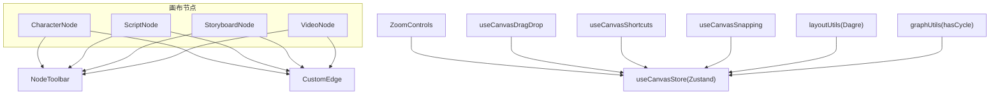
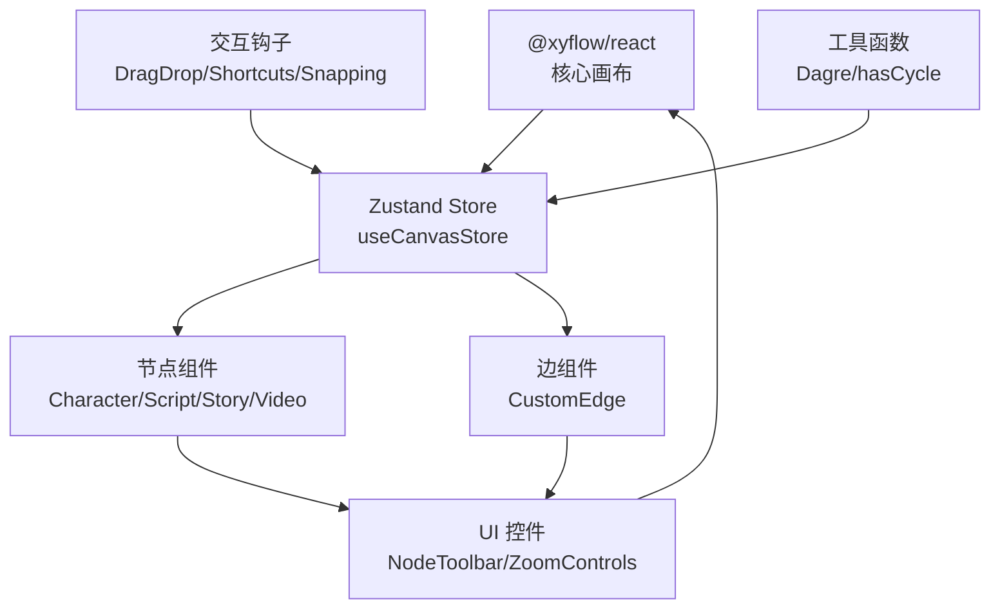
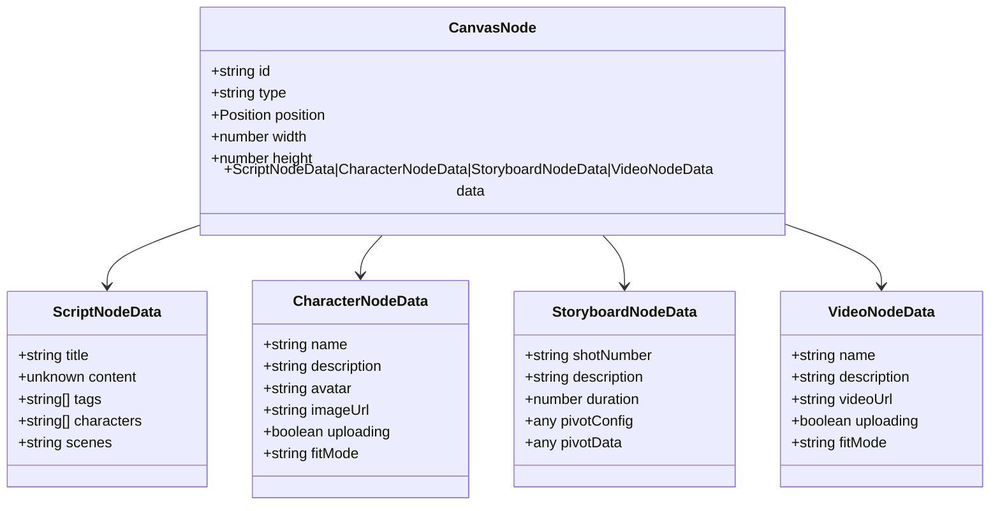
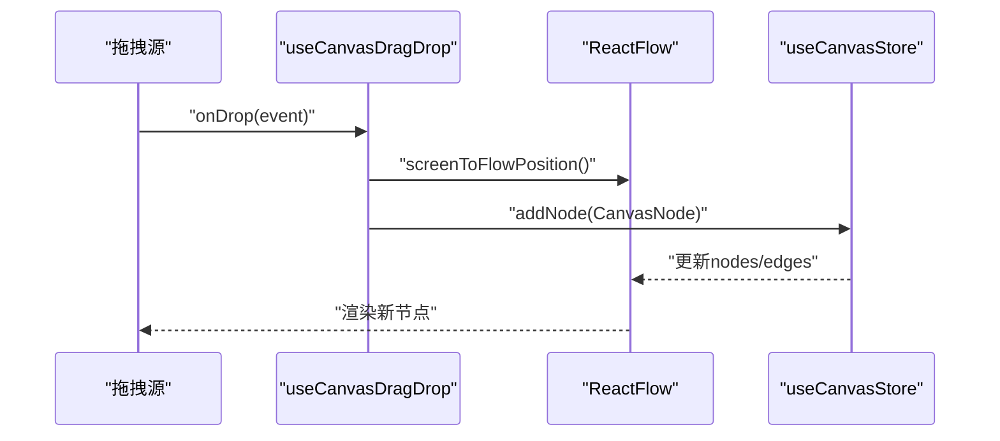
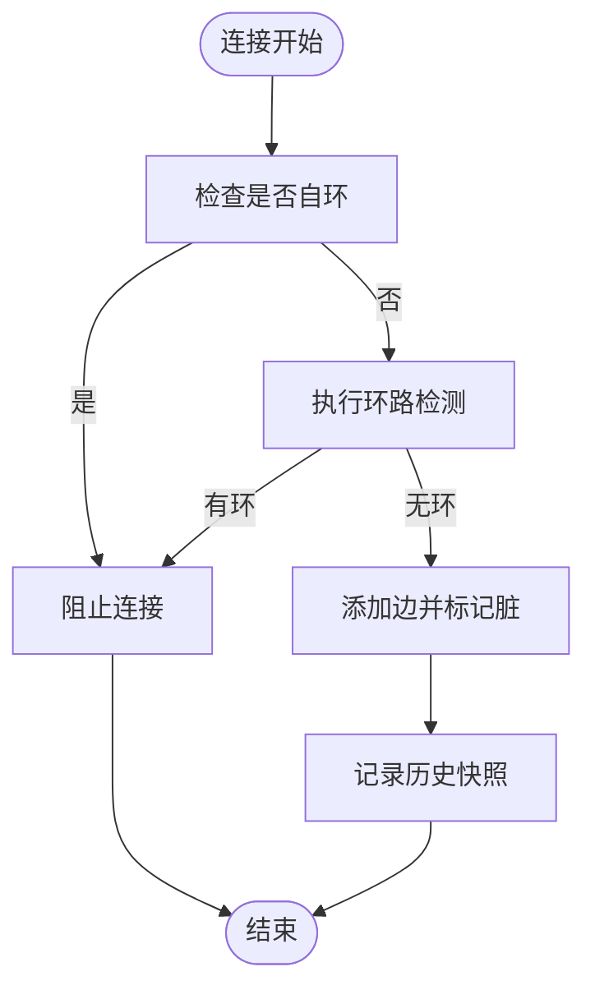
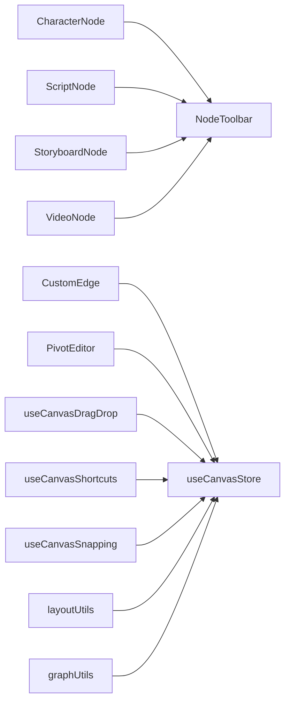

# 画布组件系统

<cite>
**本文档引用的文件**
- [frontend/src/components/canvas/CharacterNode.tsx](file://frontend/src/components/canvas/CharacterNode.tsx)
- [frontend/src/components/canvas/ScriptNode.tsx](file://frontend/src/components/canvas/ScriptNode.tsx)
- [frontend/src/components/canvas/StoryboardNode.tsx](file://frontend/src/components/canvas/StoryboardNode.tsx)
- [frontend/src/components/canvas/VideoNode.tsx](file://frontend/src/components/canvas/VideoNode.tsx)
- [frontend/src/components/canvas/CustomEdge.tsx](file://frontend/src/components/canvas/CustomEdge.tsx)
- [frontend/src/store/useCanvasStore.ts](file://frontend/src/store/useCanvasStore.ts)
- [frontend/src/components/canvas/NodeToolbar.tsx](file://frontend/src/components/canvas/NodeToolbar.tsx)
- [frontend/src/lib/graphUtils.ts](file://frontend/src/lib/graphUtils.ts)
- [frontend/src/lib/layoutUtils.ts](file://frontend/src/lib/layoutUtils.ts)
- [frontend/src/app/theater/[id]/hooks/useCanvasDragDrop.ts](file://frontend/src/app/theater/[id]/hooks/useCanvasDragDrop.ts)
- [frontend/src/app/theater/[id]/hooks/useCanvasShortcuts.ts](file://frontend/src/app/theater/[id]/hooks/useCanvasShortcuts.ts)
- [frontend/src/app/theater/[id]/hooks/useCanvasSnapping.ts](file://frontend/src/app/theater/[id]/hooks/useCanvasSnapping.ts)
- [frontend/src/components/canvas/ZoomControls.tsx](file://frontend/src/components/canvas/ZoomControls.tsx)
- [frontend/src/components/canvas/pivot/PivotEditor.tsx](file://frontend/src/components/canvas/pivot/PivotEditor.tsx)
- [frontend/src/components/TheaterCanvas.tsx](file://frontend/src/components/TheaterCanvas.tsx)
</cite>

## 目录
1. [简介](#简介)
2. [项目结构](#项目结构)
3. [核心组件](#核心组件)
4. [架构总览](#架构总览)
5. [详细组件分析](#详细组件分析)
6. [依赖关系分析](#依赖关系分析)
7. [性能考虑](#性能考虑)
8. [故障排查指南](#故障排查指南)
9. [结论](#结论)
10. [附录](#附录)

## 简介
本文件面向Infinite Game的“画布组件系统”，围绕基于React Flow的可视化编辑器展开，系统性阐述节点类型体系（CharacterNode、ScriptNode、StoryboardNode、VideoNode）、画布交互机制（拖拽、缩放、连接线、节点工具栏）、画布状态管理、节点数据模型与边连接逻辑，并提供使用示例、自定义节点开发指南与画布操作API。同时给出性能优化、内存管理与用户体验改进建议。

## 项目结构
画布系统主要位于前端工程的画布组件目录，采用“按功能分层 + 按组件拆分”的组织方式：
- 节点组件：CharacterNode、ScriptNode、StoryboardNode、VideoNode
- 边组件：CustomEdge
- 工具条：NodeToolbar
- 状态管理：useCanvasStore（Zustand）
- 交互钩子：拖拽/快捷键/吸附
- 布局工具：Dagre自动布局
- 其他：ZoomControls、PivotEditor、TheaterCanvas

**图表来源**
- [frontend/src/components/canvas/CharacterNode.tsx:1-588](file://frontend/src/components/canvas/CharacterNode.tsx#L1-L588)
- [frontend/src/components/canvas/ScriptNode.tsx:1-253](file://frontend/src/components/canvas/ScriptNode.tsx#L1-L253)
- [frontend/src/components/canvas/StoryboardNode.tsx:1-229](file://frontend/src/components/canvas/StoryboardNode.tsx#L1-L229)
- [frontend/src/components/canvas/VideoNode.tsx:1-429](file://frontend/src/components/canvas/VideoNode.tsx#L1-L429)
- [frontend/src/components/canvas/CustomEdge.tsx:1-100](file://frontend/src/components/canvas/CustomEdge.tsx#L1-L100)
- [frontend/src/components/canvas/NodeToolbar.tsx:1-95](file://frontend/src/components/canvas/NodeToolbar.tsx#L1-L95)
- [frontend/src/components/canvas/ZoomControls.tsx:1-117](file://frontend/src/components/canvas/ZoomControls.tsx#L1-L117)
- [frontend/src/lib/layoutUtils.ts:1-127](file://frontend/src/lib/layoutUtils.ts#L1-L127)
- [frontend/src/lib/graphUtils.ts:1-39](file://frontend/src/lib/graphUtils.ts#L1-L39)
- [frontend/src/app/theater/[id]/hooks/useCanvasDragDrop.ts](file://frontend/src/app/theater/[id]/hooks/useCanvasDragDrop.ts#L1-L74)
- [frontend/src/app/theater/[id]/hooks/useCanvasShortcuts.ts](file://frontend/src/app/theater/[id]/hooks/useCanvasShortcuts.ts#L1-L26)
- [frontend/src/app/theater/[id]/hooks/useCanvasSnapping.ts](file://frontend/src/app/theater/[id]/hooks/useCanvasSnapping.ts#L1-L98)
- [frontend/src/store/useCanvasStore.ts:1-540](file://frontend/src/store/useCanvasStore.ts#L1-L540)

**章节来源**
- [frontend/src/store/useCanvasStore.ts:1-540](file://frontend/src/store/useCanvasStore.ts#L1-L540)
- [frontend/src/lib/layoutUtils.ts:1-127](file://frontend/src/lib/layoutUtils.ts#L1-L127)
- [frontend/src/lib/graphUtils.ts:1-39](file://frontend/src/lib/graphUtils.ts#L1-L39)

## 核心组件
- 节点类型系统
  - CharacterNode：图片/头像节点，支持上传、预览、裁剪/适应模式切换、AI编辑入口、复制/删除、尺寸自适应。
  - ScriptNode：文本脚本节点，内嵌富文本编辑器，支持标题编辑、字数统计、AI辅助占位、复制/删除。
  - StoryboardNode：多维表格卡节点，内置透视编辑器入口，支持双击全屏编辑、复制/删除。
  - VideoNode：视频节点，支持上传、进度反馈、元数据驱动尺寸调整、裁剪/适应模式切换、复制/删除。
- 边组件：CustomEdge，贝塞尔曲线路径、悬停增宽感应区、删除按钮、可选动画。
- 工具条：NodeToolbar，统一的节点操作工具条，支持主操作/次操作分组与分隔线。
- 状态管理：useCanvasStore，集中管理节点、边、视口、历史快照、脏标记、后端同步、吸附设置等。
- 交互钩子：拖拽投放、键盘撤销/重做、对齐参考线吸附。
- 布局与校验：Dagre自动布局、环路检测。

**章节来源**
- [frontend/src/components/canvas/CharacterNode.tsx:1-588](file://frontend/src/components/canvas/CharacterNode.tsx#L1-L588)
- [frontend/src/components/canvas/ScriptNode.tsx:1-253](file://frontend/src/components/canvas/ScriptNode.tsx#L1-L253)
- [frontend/src/components/canvas/StoryboardNode.tsx:1-229](file://frontend/src/components/canvas/StoryboardNode.tsx#L1-L229)
- [frontend/src/components/canvas/VideoNode.tsx:1-429](file://frontend/src/components/canvas/VideoNode.tsx#L1-L429)
- [frontend/src/components/canvas/CustomEdge.tsx:1-100](file://frontend/src/components/canvas/CustomEdge.tsx#L1-L100)
- [frontend/src/components/canvas/NodeToolbar.tsx:1-95](file://frontend/src/components/canvas/NodeToolbar.tsx#L1-L95)
- [frontend/src/store/useCanvasStore.ts:1-540](file://frontend/src/store/useCanvasStore.ts#L1-L540)
- [frontend/src/lib/layoutUtils.ts:1-127](file://frontend/src/lib/layoutUtils.ts#L1-L127)
- [frontend/src/lib/graphUtils.ts:1-39](file://frontend/src/lib/graphUtils.ts#L1-L39)
- [frontend/src/app/theater/[id]/hooks/useCanvasDragDrop.ts](file://frontend/src/app/theater/[id]/hooks/useCanvasDragDrop.ts#L1-L74)
- [frontend/src/app/theater/[id]/hooks/useCanvasShortcuts.ts](file://frontend/src/app/theater/[id]/hooks/useCanvasShortcuts.ts#L1-L26)
- [frontend/src/app/theater/[id]/hooks/useCanvasSnapping.ts](file://frontend/src/app/theater/[id]/hooks/useCanvasSnapping.ts#L1-L98)

## 架构总览
画布系统以React Flow为核心，通过Zustand状态管理实现节点/边/视口/历史的统一存储；节点组件负责UI与用户交互，工具条提供统一操作入口；钩子模块封装拖拽、快捷键、吸附等行为；布局与校验工具保障自动布局与连通性约束。

**图表来源**
- [frontend/src/store/useCanvasStore.ts:1-540](file://frontend/src/store/useCanvasStore.ts#L1-L540)
- [frontend/src/components/canvas/CharacterNode.tsx:1-588](file://frontend/src/components/canvas/CharacterNode.tsx#L1-L588)
- [frontend/src/components/canvas/ScriptNode.tsx:1-253](file://frontend/src/components/canvas/ScriptNode.tsx#L1-L253)
- [frontend/src/components/canvas/StoryboardNode.tsx:1-229](file://frontend/src/components/canvas/StoryboardNode.tsx#L1-L229)
- [frontend/src/components/canvas/VideoNode.tsx:1-429](file://frontend/src/components/canvas/VideoNode.tsx#L1-L429)
- [frontend/src/components/canvas/CustomEdge.tsx:1-100](file://frontend/src/components/canvas/CustomEdge.tsx#L1-L100)
- [frontend/src/components/canvas/NodeToolbar.tsx:1-95](file://frontend/src/components/canvas/NodeToolbar.tsx#L1-L95)
- [frontend/src/components/canvas/ZoomControls.tsx:1-117](file://frontend/src/components/canvas/ZoomControls.tsx#L1-L117)
- [frontend/src/lib/layoutUtils.ts:1-127](file://frontend/src/lib/layoutUtils.ts#L1-L127)
- [frontend/src/lib/graphUtils.ts:1-39](file://frontend/src/lib/graphUtils.ts#L1-L39)
- [frontend/src/app/theater/[id]/hooks/useCanvasDragDrop.ts](file://frontend/src/app/theater/[id]/hooks/useCanvasDragDrop.ts#L1-L74)
- [frontend/src/app/theater/[id]/hooks/useCanvasShortcuts.ts](file://frontend/src/app/theater/[id]/hooks/useCanvasShortcuts.ts#L1-L26)
- [frontend/src/app/theater/[id]/hooks/useCanvasSnapping.ts](file://frontend/src/app/theater/[id]/hooks/useCanvasSnapping.ts#L1-L98)

## 详细组件分析

### 节点类型系统与数据模型
- 数据模型
  - ScriptNodeData：标题、内容（Tiptap JSON）、标签、角色、场景等。
  - CharacterNodeData：名称、描述、头像、图片URL、上传中状态、适配模式。
  - StoryboardNodeData：镜头号、描述、时长、透视配置与缓存数据。
  - VideoNodeData：名称、描述、视频URL、上传中状态、适配模式。
  - CanvasNode：统一节点类型，联合上述数据类型。
- 节点职责
  - CharacterNode：图片上传与本地预览、尺寸自适应、全屏预览、fit模式切换、AI编辑入口、复制/删除。
  - ScriptNode：标题编辑、富文本编辑、字数统计、AI辅助占位、复制/删除。
  - StoryboardNode：透视编辑器入口、双击全屏、复制/删除。
  - VideoNode：视频上传与本地预览、尺寸自适应、fit模式切换、复制/删除。

**图表来源**
- [frontend/src/store/useCanvasStore.ts:27-60](file://frontend/src/store/useCanvasStore.ts#L27-L60)

**章节来源**
- [frontend/src/store/useCanvasStore.ts:27-60](file://frontend/src/store/useCanvasStore.ts#L27-L60)

### 画布交互机制
- 拖拽投放
  - 通过Drag-and-Drop事件从面板拖入节点，自动计算位置与默认尺寸，支持网格吸附。
- 缩放与视口
  - 提供缩放滑块、放大/缩小、适应屏幕、自动布局、网格吸附、对齐参考线开关。
- 连接线
  - 自定义贝塞尔曲线边，悬停增宽感应区，带删除按钮；连接时执行自环与环路检测。
- 节点工具栏
  - 统一的工具条，支持主操作/危险操作分组与分隔线，悬停出现并带缩放动效。

**图表来源**
- [frontend/src/app/theater/[id]/hooks/useCanvasDragDrop.ts](file://frontend/src/app/theater/[id]/hooks/useCanvasDragDrop.ts#L15-L74)
- [frontend/src/store/useCanvasStore.ts:256-264](file://frontend/src/store/useCanvasStore.ts#L256-L264)

**章节来源**
- [frontend/src/app/theater/[id]/hooks/useCanvasDragDrop.ts](file://frontend/src/app/theater/[id]/hooks/useCanvasDragDrop.ts#L1-L74)
- [frontend/src/components/canvas/ZoomControls.tsx:1-117](file://frontend/src/components/canvas/ZoomControls.tsx#L1-L117)
- [frontend/src/components/canvas/CustomEdge.tsx:1-100](file://frontend/src/components/canvas/CustomEdge.tsx#L1-L100)
- [frontend/src/components/canvas/NodeToolbar.tsx:1-95](file://frontend/src/components/canvas/NodeToolbar.tsx#L1-L95)

### 画布状态管理与边连接逻辑
- 状态管理
  - 节点/边/视口/历史快照/脏标记/后端同步/吸附设置。
  - 支持撤销/重做、保存至后端、加载剧场、同步剧场。
- 边连接逻辑
  - 阻止自环与环路（基于DFS），添加边后触发快照与脏标记。
- 历史与持久化
  - 最大历史深度限制，本地持久化，合并去重。

**图表来源**
- [frontend/src/store/useCanvasStore.ts:238-254](file://frontend/src/store/useCanvasStore.ts#L238-L254)
- [frontend/src/lib/graphUtils.ts:4-38](file://frontend/src/lib/graphUtils.ts#L4-L38)

**章节来源**
- [frontend/src/store/useCanvasStore.ts:62-114](file://frontend/src/store/useCanvasStore.ts#L62-L114)
- [frontend/src/store/useCanvasStore.ts:238-254](file://frontend/src/store/useCanvasStore.ts#L238-L254)
- [frontend/src/lib/graphUtils.ts:1-39](file://frontend/src/lib/graphUtils.ts#L1-L39)

### 节点组件详解

#### CharacterNode
- 功能要点
  - 图片上传（XHR、进度、错误提示）、本地URL预览、尺寸自适应、全屏预览（拖拽/滚轮缩放/拖拽平移）。
  - 工具条：AI编辑、fit模式切换、复制、删除。
  - 标题双击编辑、点击外部保存。
- 性能与体验
  - 上传完成后回收Object URL，避免内存泄漏。
  - 预览窗口禁用滚动穿透，ESC关闭。

**章节来源**
- [frontend/src/components/canvas/CharacterNode.tsx:1-588](file://frontend/src/components/canvas/CharacterNode.tsx#L1-L588)

#### ScriptNode
- 功能要点
  - 富文本编辑器集成，标题编辑、字数统计、完成编辑、AI辅助占位。
  - 工具条：复制、删除。
- 交互细节
  - 点击外部/ESC退出编辑并保存；双击进入编辑模式。

**章节来源**
- [frontend/src/components/canvas/ScriptNode.tsx:1-253](file://frontend/src/components/canvas/ScriptNode.tsx#L1-L253)

#### StoryboardNode
- 功能要点
  - 双击或工具条进入透视编辑器（PivotEditor），支持行/列/值字段配置与聚合方式设置。
  - 工具条：全屏编辑、复制、删除。
- 数据流
  - 配置变更通过useCanvasStore同步回节点数据。

**章节来源**
- [frontend/src/components/canvas/StoryboardNode.tsx:1-229](file://frontend/src/components/canvas/StoryboardNode.tsx#L1-L229)
- [frontend/src/components/canvas/pivot/PivotEditor.tsx:1-229](file://frontend/src/components/canvas/pivot/PivotEditor.tsx#L1-L229)

#### VideoNode
- 功能要点
  - 视频上传（XHR、进度、错误提示）、本地URL预览、尺寸自适应、全屏预览（拖拽/滚轮缩放/拖拽平移）。
  - 工具条：fit模式切换、复制、删除。
- 同步资源
  - 上传成功后同步资产到资源库，使侧边栏实时显示。

**章节来源**
- [frontend/src/components/canvas/VideoNode.tsx:1-429](file://frontend/src/components/canvas/VideoNode.tsx#L1-L429)

### 自定义节点开发指南
- 新增节点步骤
  - 定义数据模型类型并加入CanvasNode联合类型。
  - 创建节点组件，使用Handle声明连接点，实现工具条动作。
  - 在画布中注册节点类型，确保拖拽投放时能正确生成CanvasNode。
  - 如需自动布局，确保节点具备默认尺寸或在布局阶段提供测量尺寸。
- 最佳实践
  - 尽量使用NodeResizer控制最小尺寸，避免过小导致UI异常。
  - 工具条动作与节点状态解耦，通过useCanvasStore统一更新。
  - 对上传/下载等异步流程提供明确的loading/error状态与清理逻辑。

**章节来源**
- [frontend/src/store/useCanvasStore.ts:27-60](file://frontend/src/store/useCanvasStore.ts#L27-L60)
- [frontend/src/app/theater/[id]/hooks/useCanvasDragDrop.ts](file://frontend/src/app/theater/[id]/hooks/useCanvasDragDrop.ts#L37-L43)

### 画布操作API
- 节点操作
  - addNode(node)：新增节点
  - deleteNode(id)：删除节点及关联边
  - updateNodeData(id, dataPartial)：部分更新节点数据
  - updateNodeDimensions(id, width, height)：更新节点尺寸
- 边操作
  - onConnect(connection)：建立连接（含环路检测）
  - deleteEdge(id)：删除边并触发自定义事件
- 历史与同步
  - takeSnapshot()/undo()/redo()：历史快照与撤销/重做
  - loadTheater(id)/syncTheater(id)/saveToBackend()：剧场加载/同步/保存
- 设置
  - setSnapToGrid(bool)/setSnapToGuides(bool)：吸附设置
  - setViewport(viewport)：设置视口

**章节来源**
- [frontend/src/store/useCanvasStore.ts:84-114](file://frontend/src/store/useCanvasStore.ts#L84-L114)
- [frontend/src/store/useCanvasStore.ts:238-288](file://frontend/src/store/useCanvasStore.ts#L238-L288)
- [frontend/src/store/useCanvasStore.ts:335-376](file://frontend/src/store/useCanvasStore.ts#L335-L376)
- [frontend/src/store/useCanvasStore.ts:388-505](file://frontend/src/store/useCanvasStore.ts#L388-L505)

## 依赖关系分析
- 组件耦合
  - 节点组件强依赖NodeToolbar与React Flow Handles，弱依赖useCanvasStore。
  - CustomEdge依赖useCanvasStore进行删除操作。
  - PivotEditor依赖useCanvasStore写回节点数据。
- 外部依赖
  - @xyflow/react：画布核心、节点/边渲染、连接、视口控制。
  - dagre：自动布局。
  - Zustand：状态持久化与历史管理。
- 循环依赖
  - 未发现直接循环依赖；工具函数与状态管理通过单向调用链传递。

**图表来源**
- [frontend/src/components/canvas/CharacterNode.tsx:1-588](file://frontend/src/components/canvas/CharacterNode.tsx#L1-L588)
- [frontend/src/components/canvas/ScriptNode.tsx:1-253](file://frontend/src/components/canvas/ScriptNode.tsx#L1-L253)
- [frontend/src/components/canvas/StoryboardNode.tsx:1-229](file://frontend/src/components/canvas/StoryboardNode.tsx#L1-L229)
- [frontend/src/components/canvas/VideoNode.tsx:1-429](file://frontend/src/components/canvas/VideoNode.tsx#L1-L429)
- [frontend/src/components/canvas/CustomEdge.tsx:1-100](file://frontend/src/components/canvas/CustomEdge.tsx#L1-L100)
- [frontend/src/components/canvas/pivot/PivotEditor.tsx:1-229](file://frontend/src/components/canvas/pivot/PivotEditor.tsx#L1-L229)
- [frontend/src/app/theater/[id]/hooks/useCanvasDragDrop.ts](file://frontend/src/app/theater/[id]/hooks/useCanvasDragDrop.ts#L1-L74)
- [frontend/src/app/theater/[id]/hooks/useCanvasShortcuts.ts](file://frontend/src/app/theater/[id]/hooks/useCanvasShortcuts.ts#L1-L26)
- [frontend/src/app/theater/[id]/hooks/useCanvasSnapping.ts](file://frontend/src/app/theater/[id]/hooks/useCanvasSnapping.ts#L1-L98)
- [frontend/src/lib/layoutUtils.ts:1-127](file://frontend/src/lib/layoutUtils.ts#L1-L127)
- [frontend/src/lib/graphUtils.ts:1-39](file://frontend/src/lib/graphUtils.ts#L1-L39)
- [frontend/src/store/useCanvasStore.ts:1-540](file://frontend/src/store/useCanvasStore.ts#L1-L540)

**章节来源**
- [frontend/src/store/useCanvasStore.ts:1-540](file://frontend/src/store/useCanvasStore.ts#L1-L540)
- [frontend/src/lib/layoutUtils.ts:1-127](file://frontend/src/lib/layoutUtils.ts#L1-L127)
- [frontend/src/lib/graphUtils.ts:1-39](file://frontend/src/lib/graphUtils.ts#L1-L39)

## 性能考虑
- 渲染优化
  - 节点组件使用memo包裹，减少重复渲染。
  - NodeResizer仅在选中时显示，降低非必要DOM。
  - 预览窗口使用createPortal，避免层级影响。
- 上传与媒体
  - 上传完成后及时revokeObjectURL，防止内存泄漏。
  - 上传进度与错误状态分离，避免不必要的重渲染。
- 布局与拓扑
  - 自动布局使用Dagre，隔离孤立节点，避免大规模重排。
  - 连接前执行环路检测，避免无效边导致的复杂度上升。
- 状态与持久化
  - 历史快照限制数量，避免内存膨胀。
  - 本地持久化仅保存必要字段，合并去重。

[本节为通用指导，无需特定文件引用]

## 故障排查指南
- 无法连接边
  - 检查是否自环或环路，确认hasCycle检测逻辑。
  - 查看onConnect日志与阻止原因。
- 上传失败
  - 检查文件类型与大小限制，确认XHR响应与错误信息。
  - 确认Authorization头是否正确注入。
- 预览无法拖拽/缩放
  - 确认预览容器事件监听是否绑定，wheel事件是否禁用默认行为。
  - 检查ESC关闭逻辑与body overflow控制。
- 快捷键无效
  - 确认Ctrl/Cmd+Z/Y组合键未被浏览器扩展拦截。
  - 检查useCanvasShortcuts是否挂载到window。

**章节来源**
- [frontend/src/lib/graphUtils.ts:4-38](file://frontend/src/lib/graphUtils.ts#L4-L38)
- [frontend/src/components/canvas/CharacterNode.tsx:137-215](file://frontend/src/components/canvas/CharacterNode.tsx#L137-L215)
- [frontend/src/components/canvas/VideoNode.tsx:109-190](file://frontend/src/components/canvas/VideoNode.tsx#L109-L190)
- [frontend/src/app/theater/[id]/hooks/useCanvasShortcuts.ts](file://frontend/src/app/theater/[id]/hooks/useCanvasShortcuts.ts#L7-L24)

## 结论
Infinite Game的画布组件系统以React Flow为基础，结合Zustand状态管理与丰富的交互钩子，构建了高可扩展的可视化编辑器。节点类型体系清晰，工具条与边组件统一了交互语言；状态管理与布局/校验工具保证了复杂场景下的稳定性与性能。通过本文档提供的架构、API与最佳实践，开发者可以高效地扩展节点类型、优化性能并提升用户体验。

[本节为总结性内容，无需特定文件引用]

## 附录
- 其他画布相关组件
  - TheaterCanvas：基于PIXI的实验性画布容器（当前主要用于演示）。
- 常用操作清单
  - 新增节点：拖拽投放或调用addNode
  - 连接节点：拖拽Handle或调用onConnect
  - 删除节点/边：deleteNode/deleteEdge
  - 撤销/重做：undo/redo
  - 保存剧场：saveToBackend

**章节来源**
- [frontend/src/components/TheaterCanvas.tsx:1-50](file://frontend/src/components/TheaterCanvas.tsx#L1-L50)