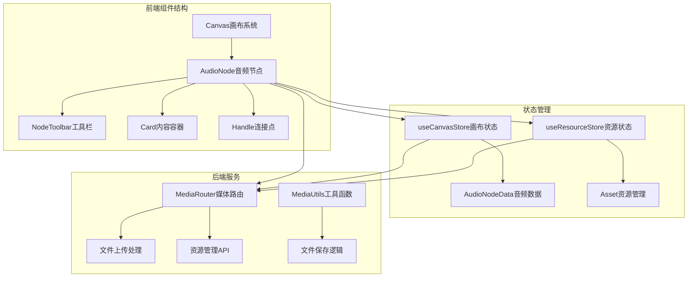
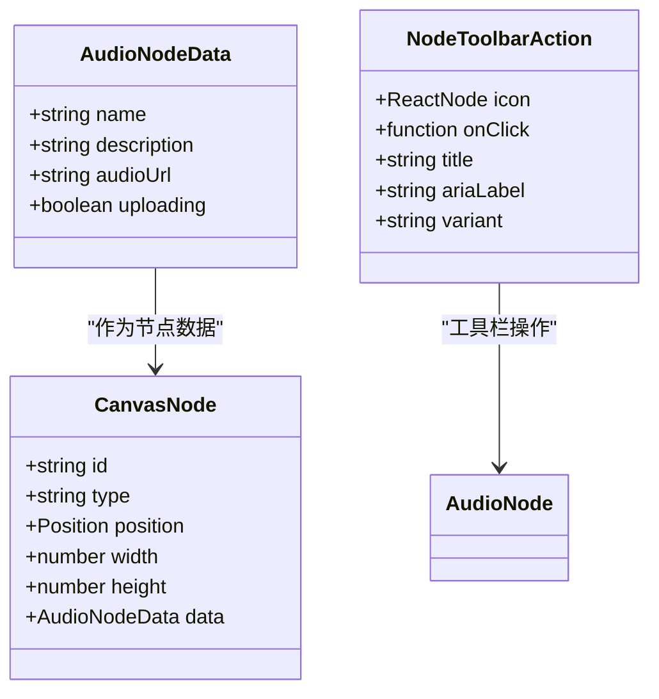
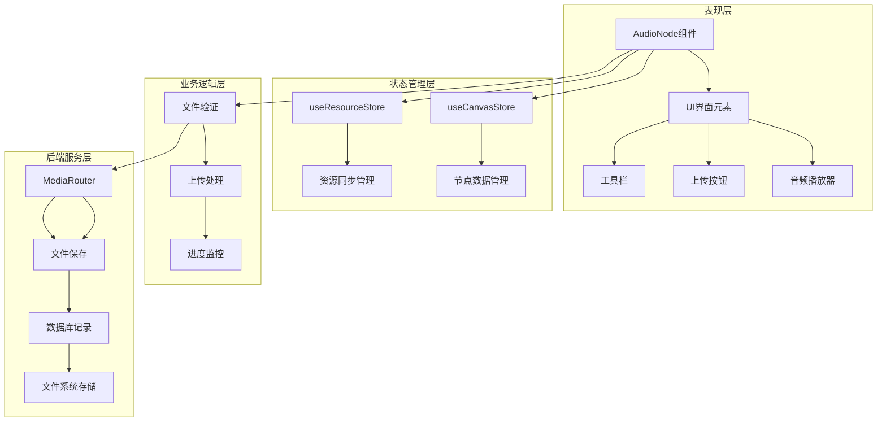
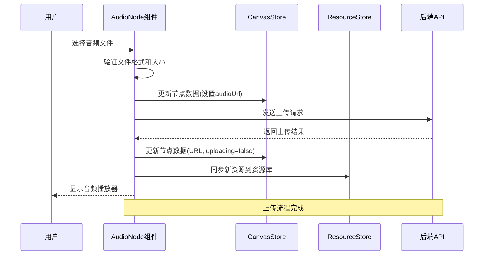
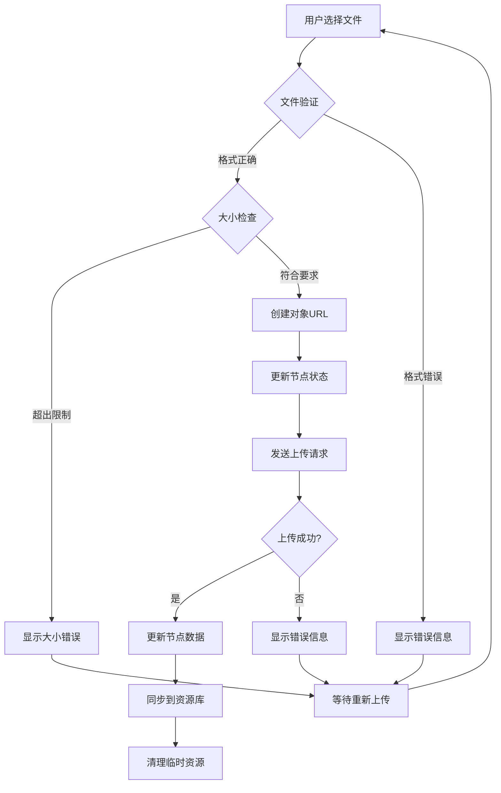
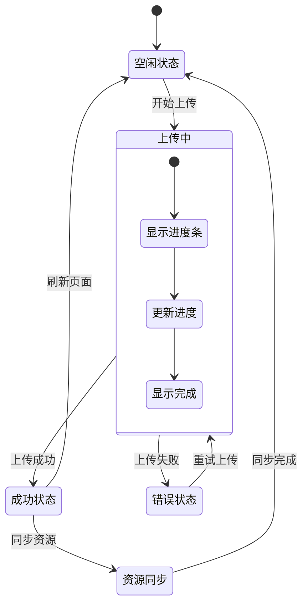

# 音频节点组件

<cite>
**本文档引用的文件**
- [AudioNode.tsx](file://frontend/src/components/canvas/AudioNode.tsx)
- [useCanvasStore.ts](file://frontend/src/store/useCanvasStore.ts)
- [useResourceStore.ts](file://frontend/src/store/useResourceStore.ts)
- [NodeToolbar.tsx](file://frontend/src/components/canvas/NodeToolbar.tsx)
- [resourceApi.ts](file://frontend/src/lib/resourceApi.ts)
- [media.py](file://backend/routers/media.py)
- [media_utils.py](file://backend/services/media_utils.py)
</cite>

## 目录
1. [简介](#简介)
2. [项目结构](#项目结构)
3. [核心组件](#核心组件)
4. [架构概览](#架构概览)
5. [详细组件分析](#详细组件分析)
6. [依赖关系分析](#依赖关系分析)
7. [性能考虑](#性能考虑)
8. [故障排除指南](#故障排除指南)
9. [结论](#结论)

## 简介

音频节点组件是无限剧场（Infinite Theater）项目中的一个核心可视化编辑组件，允许用户在画布上创建、编辑和管理音频资源。该组件提供了完整的音频上传、预览、复制和删除功能，并与后端媒体管理系统无缝集成。

音频节点基于React和@xyflow/react构建，采用现代化的状态管理模式和组件化设计原则。它支持多种音频格式（MP3、WAV、OGG、FLAC、AAC、M4A），具有100MB的文件大小限制，并提供了直观的用户界面和流畅的用户体验。

## 项目结构

音频节点组件位于前端项目的组件层次结构中，与画布系统紧密集成：



**图表来源**
- [AudioNode.tsx:1-376](file://frontend/src/components/canvas/AudioNode.tsx#L1-L376)
- [useCanvasStore.ts:195-554](file://frontend/src/store/useCanvasStore.ts#L195-L554)
- [media.py:30-444](file://backend/routers/media.py#L30-L444)

**章节来源**
- [AudioNode.tsx:1-376](file://frontend/src/components/canvas/AudioNode.tsx#L1-L376)
- [useCanvasStore.ts:62-67](file://frontend/src/store/useCanvasStore.ts#L62-L67)

## 核心组件

### 音频节点数据结构

音频节点使用专门的数据接口来管理音频资源的所有相关信息：



**图表来源**
- [useCanvasStore.ts:62-67](file://frontend/src/store/useCanvasStore.ts#L62-L67)
- [NodeToolbar.tsx:4-10](file://frontend/src/components/canvas/NodeToolbar.tsx#L4-L10)

### 主要功能特性

音频节点组件具备以下核心功能：

1. **音频上传管理**：支持多种音频格式的上传和验证
2. **实时预览**：提供音频播放器进行实时预览
3. **进度跟踪**：显示上传进度和状态反馈
4. **工具栏操作**：提供复制、删除等便捷操作
5. **响应式设计**：自适应不同屏幕尺寸和布局

**章节来源**
- [AudioNode.tsx:102-182](file://frontend/src/components/canvas/AudioNode.tsx#L102-L182)
- [AudioNode.tsx:334-349](file://frontend/src/components/canvas/AudioNode.tsx#L334-L349)

## 架构概览

音频节点组件采用分层架构设计，确保了良好的可维护性和扩展性：



**图表来源**
- [AudioNode.tsx:12-376](file://frontend/src/components/canvas/AudioNode.tsx#L12-L376)
- [useCanvasStore.ts:321-329](file://frontend/src/store/useCanvasStore.ts#L321-L329)
- [media.py:95-149](file://backend/routers/media.py#L95-L149)

## 详细组件分析

### AudioNode组件实现

AudioNode组件是整个音频节点系统的核心，负责处理用户交互和状态管理：



**图表来源**
- [AudioNode.tsx:102-182](file://frontend/src/components/canvas/AudioNode.tsx#L102-L182)
- [useCanvasStore.ts:321-329](file://frontend/src/store/useCanvasStore.ts#L321-L329)

### 文件上传处理流程

音频文件上传过程包含多个验证步骤和错误处理机制：



**图表来源**
- [AudioNode.tsx:106-182](file://frontend/src/components/canvas/AudioNode.tsx#L106-L182)
- [resourceApi.ts:54-87](file://frontend/src/lib/resourceApi.ts#L54-L87)

### 状态管理机制

音频节点的状态管理采用Zustand状态库，实现了高效的状态同步和持久化：



**图表来源**
- [useCanvasStore.ts:321-329](file://frontend/src/store/useCanvasStore.ts#L321-L329)
- [useResourceStore.ts:159-168](file://frontend/src/store/useResourceStore.ts#L159-L168)

**章节来源**
- [AudioNode.tsx:12-376](file://frontend/src/components/canvas/AudioNode.tsx#L12-L376)
- [useCanvasStore.ts:195-554](file://frontend/src/store/useCanvasStore.ts#L195-L554)

### 工具栏功能实现

NodeToolbar组件提供了统一的节点操作界面，支持多种操作变体：

| 操作类型 | 图标 | 功能描述 | 触发事件 |
|---------|------|----------|----------|
| 复制 | 📋 | 创建节点副本 | handleDuplicate |
| 删除 | 🗑️ | 删除当前节点 | handleDelete |
| 重命名 | ✏️ | 编辑节点标题 | 双击标题 |

**章节来源**
- [NodeToolbar.tsx:21-95](file://frontend/src/components/canvas/NodeToolbar.tsx#L21-L95)
- [AudioNode.tsx:74-95](file://frontend/src/components/canvas/AudioNode.tsx#L74-L95)

## 依赖关系分析

音频节点组件的依赖关系体现了清晰的分层架构：

```mermaid
graph TB
subgraph "外部依赖"
A[@xyflow/react] --> B[节点渲染]
C[lucide-react] --> D[图标组件]
E[uuid] --> F[唯一标识符]
end
subgraph "内部依赖"
G[useCanvasStore] --> H[节点状态管理]
I[useResourceStore] --> J[资源同步]
K[NodeToolbar] --> L[工具栏组件]
M[resourceApi] --> N[API调用封装]
end
subgraph "后端依赖"
O[FastAPI] --> P[路由处理]
Q[SQLAlchemy] --> R[数据库操作]
S[httpx] --> T[HTTP客户端]
end
AudioNode --> A
AudioNode --> G
AudioNode --> I
AudioNode --> K
AudioNode --> M
G --> O
I --> O
M --> O
O --> Q
O --> S
```

**图表来源**
- [AudioNode.tsx:1-11](file://frontend/src/components/canvas/AudioNode.tsx#L1-L11)
- [media.py:1-28](file://backend/routers/media.py#L1-L28)

**章节来源**
- [AudioNode.tsx:1-11](file://frontend/src/components/canvas/AudioNode.tsx#L1-L11)
- [media.py:1-28](file://backend/routers/media.py#L1-L28)

## 性能考虑

音频节点组件在设计时充分考虑了性能优化：

### 上传性能优化
- **进度实时反馈**：使用XMLHttpRequest的onprogress事件提供精确的上传进度
- **内存管理**：及时释放ObjectURL和清理文件输入元素
- **并发控制**：单个节点的上传操作不会阻塞其他操作

### 渲染性能优化
- **懒加载**：音频播放器仅在有有效URL时渲染
- **条件渲染**：根据状态动态显示不同的UI元素
- **防抖处理**：标题编辑的点击外部保存事件使用防抖机制

### 存储性能优化
- **本地持久化**：使用localStorage存储画布状态
- **增量同步**：后端只同步必要的节点和边数据
- **缓存策略**：媒体文件提供适当的缓存头

## 故障排除指南

### 常见问题及解决方案

| 问题类型 | 症状 | 可能原因 | 解决方案 |
|---------|------|----------|----------|
| 上传失败 | 显示错误信息 | 网络连接问题 | 检查网络连接，重试上传 |
| 格式不支持 | 文件类型验证失败 | 不支持的音频格式 | 使用MP3、WAV、OGG、FLAC、AAC、M4A格式 |
| 大小超限 | 显示100MB限制错误 | 文件超过100MB | 压缩音频文件或分割文件 |
| 进度停滞 | 上传进度长时间不变 | 服务器响应慢 | 检查服务器状态，稍后重试 |
| 播放失败 | 音频无法播放 | 浏览器兼容性问题 | 更换浏览器或更新版本 |

### 调试技巧

1. **开发者工具**：使用浏览器开发者工具监控网络请求和状态变化
2. **控制台日志**：查看上传过程中的详细日志信息
3. **状态检查**：通过React DevTools检查组件状态
4. **后端日志**：查看服务器端的上传处理日志

**章节来源**
- [AudioNode.tsx:172-182](file://frontend/src/components/canvas/AudioNode.tsx#L172-L182)
- [media.py:117-123](file://backend/routers/media.py#L117-L123)

## 结论

音频节点组件是一个功能完整、设计合理的可视化音频管理工具。它成功地将复杂的音频处理逻辑封装在简洁易用的界面背后，为用户提供了流畅的音频创作体验。

组件的主要优势包括：
- **完整的功能覆盖**：从上传到播放的全流程支持
- **优秀的用户体验**：直观的界面设计和实时反馈
- **可靠的错误处理**：完善的错误提示和恢复机制
- **良好的性能表现**：优化的上传流程和状态管理

未来可以考虑的功能增强：
- 支持更多音频格式和编解码器
- 添加音频编辑和效果处理功能
- 实现云端同步和协作功能
- 增强音频质量检测和优化建议