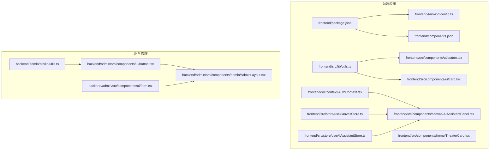
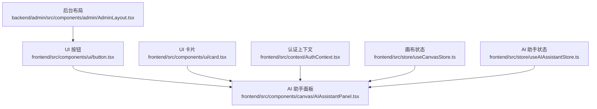
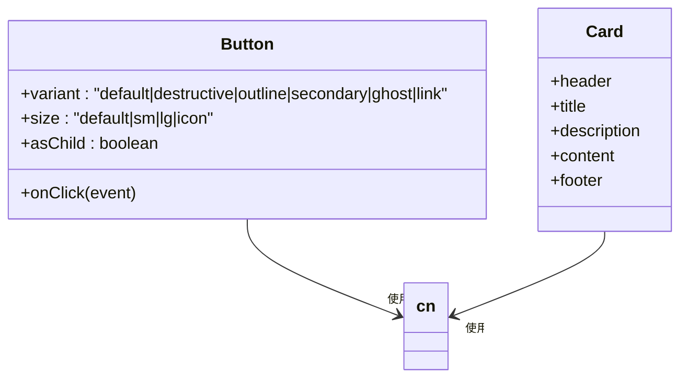
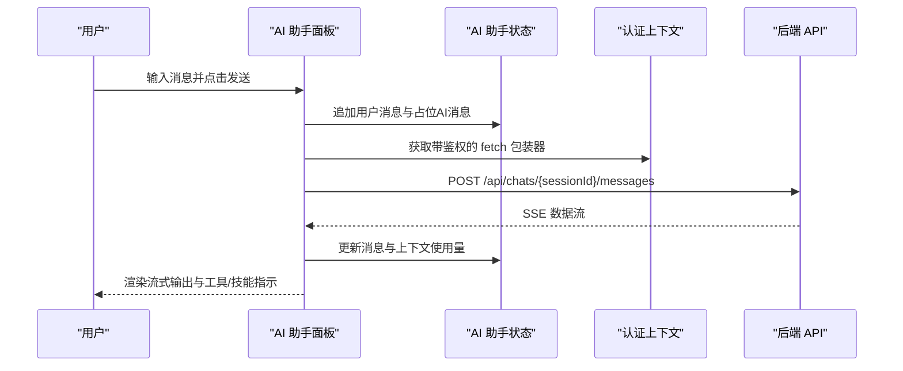
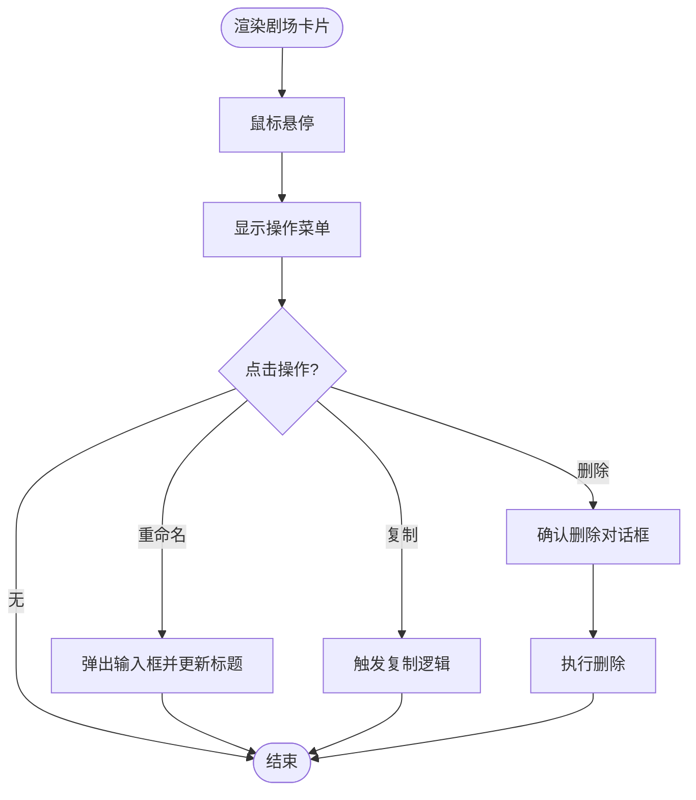
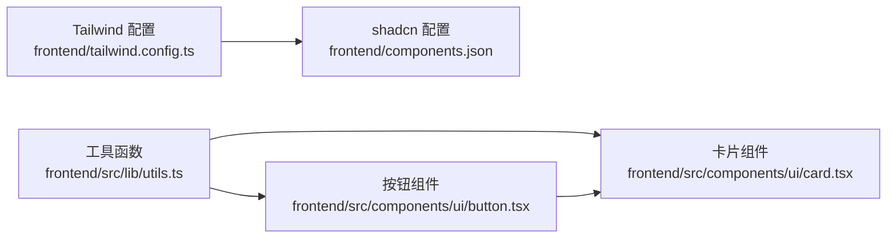

# 组件架构

<cite>
**本文引用的文件**
- [frontend/package.json](file://frontend/package.json)
- [frontend/tailwind.config.ts](file://frontend/tailwind.config.ts)
- [frontend/components.json](file://frontend/components.json)
- [frontend/src/lib/utils.ts](file://frontend/src/lib/utils.ts)
- [backend/admin/src/lib/utils.ts](file://backend/admin/src/lib/utils.ts)
- [frontend/src/components/ui/button.tsx](file://frontend/src/components/ui/button.tsx)
- [backend/admin/src/components/ui/button.tsx](file://backend/admin/src/components/ui/button.tsx)
- [frontend/src/components/ui/card.tsx](file://frontend/src/components/ui/card.tsx)
- [frontend/src/context/AuthContext.tsx](file://frontend/src/context/AuthContext.tsx)
- [frontend/src/store/useCanvasStore.ts](file://frontend/src/store/useCanvasStore.ts)
- [frontend/src/store/useAIAssistantStore.ts](file://frontend/src/store/useAIAssistantStore.ts)
- [frontend/src/components/canvas/AIAssistantPanel.tsx](file://frontend/src/components/canvas/AIAssistantPanel.tsx)
- [frontend/src/components/home/TheaterCard.tsx](file://frontend/src/components/home/TheaterCard.tsx)
- [backend/admin/src/components/admin/AdminLayout.tsx](file://backend/admin/src/components/admin/AdminLayout.tsx)
- [backend/admin/src/components/ui/form.tsx](file://backend/admin/src/components/ui/form.tsx)
</cite>

## 目录
1. [引言](#引言)
2. [项目结构](#项目结构)
3. [核心组件](#核心组件)
4. [架构总览](#架构总览)
5. [详细组件分析](#详细组件分析)
6. [依赖分析](#依赖分析)
7. [性能考虑](#性能考虑)
8. [故障排查指南](#故障排查指南)
9. [结论](#结论)
10. [附录](#附录)

## 引言
本文件面向 Infinite Game 的前端与后台管理系统，系统性梳理组件架构与实现细节，重点覆盖：
- 组件层次结构：UI 基础组件、业务组件与复合组件的分类与职责边界
- Ant Design 组件库的集成与定制化配置
- Tailwind CSS 的实用优先理念与样式系统
- 组件设计原则、Props 接口设计与事件处理模式
- 组件复用策略、性能优化技巧与可访问性支持
- 组件测试方法与文档编写规范

## 项目结构
前端采用 Next.js 应用程序，按功能域组织组件与存储层；后台管理基于 Next.js 的 admin 子项目，共享部分通用 UI 组件与工具函数。

**图表来源**
- [frontend/package.json:1-94](file://frontend/package.json#L1-L94)
- [frontend/tailwind.config.ts:1-64](file://frontend/tailwind.config.ts#L1-L64)
- [frontend/components.json:1-21](file://frontend/components.json#L1-L21)
- [frontend/src/lib/utils.ts:1-7](file://frontend/src/lib/utils.ts#L1-L7)
- [backend/admin/src/lib/utils.ts:1-7](file://backend/admin/src/lib/utils.ts#L1-L7)
- [frontend/src/components/ui/button.tsx:1-57](file://frontend/src/components/ui/button.tsx#L1-L57)
- [frontend/src/components/ui/card.tsx:1-80](file://frontend/src/components/ui/card.tsx#L1-L80)
- [frontend/src/context/AuthContext.tsx:1-207](file://frontend/src/context/AuthContext.tsx#L1-L207)
- [frontend/src/store/useCanvasStore.ts:1-540](file://frontend/src/store/useCanvasStore.ts#L1-L540)
- [frontend/src/store/useAIAssistantStore.ts:1-381](file://frontend/src/store/useAIAssistantStore.ts#L1-L381)
- [frontend/src/components/canvas/AIAssistantPanel.tsx:1-613](file://frontend/src/components/canvas/AIAssistantPanel.tsx#L1-L613)
- [frontend/src/components/home/TheaterCard.tsx:1-173](file://frontend/src/components/home/TheaterCard.tsx#L1-L173)
- [backend/admin/src/components/ui/button.tsx:1-57](file://backend/admin/src/components/ui/button.tsx#L1-L57)
- [backend/admin/src/components/ui/form.tsx:1-167](file://backend/admin/src/components/ui/form.tsx#L1-L167)
- [backend/admin/src/components/admin/AdminLayout.tsx:1-204](file://backend/admin/src/components/admin/AdminLayout.tsx#L1-L204)

**章节来源**
- [frontend/package.json:1-94](file://frontend/package.json#L1-L94)
- [frontend/tailwind.config.ts:1-64](file://frontend/tailwind.config.ts#L1-L64)
- [frontend/components.json:1-21](file://frontend/components.json#L1-L21)

## 核心组件
- UI 基础组件：按钮、卡片等，通过变体与尺寸系统统一风格，结合 Tailwind 与 class-variance-authority 实现一致的视觉与交互体验。
- 业务组件：画布与 AI 助手面板、剧场卡片等，承载具体业务逻辑与状态管理。
- 复合组件：AdminLayout、AIAssistantPanel 等，组合多个基础与业务组件，形成完整的页面或功能模块。

**章节来源**
- [frontend/src/components/ui/button.tsx:1-57](file://frontend/src/components/ui/button.tsx#L1-L57)
- [frontend/src/components/ui/card.tsx:1-80](file://frontend/src/components/ui/card.tsx#L1-L80)
- [frontend/src/components/canvas/AIAssistantPanel.tsx:1-613](file://frontend/src/components/canvas/AIAssistantPanel.tsx#L1-L613)
- [frontend/src/components/home/TheaterCard.tsx:1-173](file://frontend/src/components/home/TheaterCard.tsx#L1-L173)
- [backend/admin/src/components/admin/AdminLayout.tsx:1-204](file://backend/admin/src/components/admin/AdminLayout.tsx#L1-L204)

## 架构总览
整体采用“组件 + 存储 + 上下文”的分层架构：
- 组件层：基础 UI 组件与业务组件，遵循 Props 设计与事件处理模式
- 存储层：Zustand 状态管理，分别维护画布与 AI 助手的状态
- 上下文层：认证上下文提供鉴权与自动刷新能力
- 样式层：Tailwind CSS 与 shadcn/ui 配置，统一主题变量与变体

**图表来源**
- [frontend/src/components/ui/button.tsx:1-57](file://frontend/src/components/ui/button.tsx#L1-L57)
- [frontend/src/components/ui/card.tsx:1-80](file://frontend/src/components/ui/card.tsx#L1-L80)
- [frontend/src/context/AuthContext.tsx:1-207](file://frontend/src/context/AuthContext.tsx#L1-L207)
- [frontend/src/store/useCanvasStore.ts:1-540](file://frontend/src/store/useCanvasStore.ts#L1-L540)
- [frontend/src/store/useAIAssistantStore.ts:1-381](file://frontend/src/store/useAIAssistantStore.ts#L1-L381)
- [frontend/src/components/canvas/AIAssistantPanel.tsx:1-613](file://frontend/src/components/canvas/AIAssistantPanel.tsx#L1-L613)
- [backend/admin/src/components/admin/AdminLayout.tsx:1-204](file://backend/admin/src/components/admin/AdminLayout.tsx#L1-L204)

## 详细组件分析

### UI 基础组件：按钮与卡片
- 设计原则：通过变体与尺寸系统统一风格，支持 asChild 与语义化标签，提升可访问性
- Props 接口：继承原生 HTML 属性并扩展变体与尺寸枚举
- 事件处理：透传原生事件，支持受控与非受控场景
- 样式系统：使用 class-variance-authority 与 cn 合并工具类，保证样式一致性

**图表来源**
- [frontend/src/components/ui/button.tsx:1-57](file://frontend/src/components/ui/button.tsx#L1-L57)
- [frontend/src/components/ui/card.tsx:1-80](file://frontend/src/components/ui/card.tsx#L1-L80)
- [frontend/src/lib/utils.ts:1-7](file://frontend/src/lib/utils.ts#L1-L7)

**章节来源**
- [frontend/src/components/ui/button.tsx:1-57](file://frontend/src/components/ui/button.tsx#L1-L57)
- [backend/admin/src/components/ui/button.tsx:1-57](file://backend/admin/src/components/ui/button.tsx#L1-L57)
- [frontend/src/components/ui/card.tsx:1-80](file://frontend/src/components/ui/card.tsx#L1-L80)
- [frontend/src/lib/utils.ts:1-7](file://frontend/src/lib/utils.ts#L1-L7)
- [backend/admin/src/lib/utils.ts:1-7](file://backend/admin/src/lib/utils.ts#L1-L7)

### 业务组件：AI 助手面板
- 职责边界：负责消息流式传输、面板交互、附件拖拽、会话管理与性能监控
- 状态管理：通过 useAIAssistantStore 管理消息、会话、面板尺寸与附件
- 事件处理：键盘事件（ESC）、拖拽事件、指针事件与滚动事件
- 性能优化：虚拟滚动、节流与防抖、长任务检测、SSE 流式处理

**图表来源**
- [frontend/src/components/canvas/AIAssistantPanel.tsx:1-613](file://frontend/src/components/canvas/AIAssistantPanel.tsx#L1-L613)
- [frontend/src/store/useAIAssistantStore.ts:1-381](file://frontend/src/store/useAIAssistantStore.ts#L1-L381)
- [frontend/src/context/AuthContext.tsx:1-207](file://frontend/src/context/AuthContext.tsx#L1-L207)

**章节来源**
- [frontend/src/components/canvas/AIAssistantPanel.tsx:1-613](file://frontend/src/components/canvas/AIAssistantPanel.tsx#L1-L613)
- [frontend/src/store/useAIAssistantStore.ts:1-381](file://frontend/src/store/useAIAssistantStore.ts#L1-L381)
- [frontend/src/context/AuthContext.tsx:1-207](file://frontend/src/context/AuthContext.tsx#L1-L207)

### 业务组件：剧场卡片
- 职责边界：展示剧场信息、状态徽标、操作菜单与交互反馈
- 事件处理：点击、重命名、复制、删除等动作回调
- 动画与可访问性：Framer Motion 动画、无障碍图标与隐藏文本

**图表来源**
- [frontend/src/components/home/TheaterCard.tsx:1-173](file://frontend/src/components/home/TheaterCard.tsx#L1-L173)

**章节来源**
- [frontend/src/components/home/TheaterCard.tsx:1-173](file://frontend/src/components/home/TheaterCard.tsx#L1-L173)

### 复合组件：后台布局
- 职责边界：侧边导航、用户信息、权限控制与页面容器
- 事件处理：菜单折叠/展开、登出操作
- 可访问性：屏幕阅读器友好的标题与图标替代文本

**章节来源**
- [backend/admin/src/components/admin/AdminLayout.tsx:1-204](file://backend/admin/src/components/admin/AdminLayout.tsx#L1-L204)

### 表单组件：后台管理表单体系
- 职责边界：表单上下文、字段校验、标签与描述、错误提示
- 设计模式：React Hook Form 控制器模式、上下文传递字段状态
- 可访问性：aria-describedby、aria-invalid 与语义化标签

**章节来源**
- [backend/admin/src/components/ui/form.tsx:1-167](file://backend/admin/src/components/ui/form.tsx#L1-L167)

## 依赖分析
- 样式与主题：Tailwind CSS 与 shadcn/ui 配置，统一颜色与圆角变量；class-variance-authority 提供变体系统；clsx 与 tailwind-merge 合并类名
- 状态管理：Zustand 提供轻量级全局状态，持久化中间件与局部序列化
- 认证与网络：自定义 createAuthFetch 包装 fetch，统一处理 401 与令牌刷新队列
- 组件生态：Ant Design 与 Radix UI 组合，Ant Design 用于业务组件，Radix UI 用于基础 UI 与无障碍

**图表来源**
- [frontend/tailwind.config.ts:1-64](file://frontend/tailwind.config.ts#L1-L64)
- [frontend/components.json:1-21](file://frontend/components.json#L1-L21)
- [frontend/src/lib/utils.ts:1-7](file://frontend/src/lib/utils.ts#L1-L7)
- [frontend/src/components/ui/button.tsx:1-57](file://frontend/src/components/ui/button.tsx#L1-L57)
- [frontend/src/components/ui/card.tsx:1-80](file://frontend/src/components/ui/card.tsx#L1-L80)

**章节来源**
- [frontend/package.json:1-94](file://frontend/package.json#L1-L94)
- [frontend/tailwind.config.ts:1-64](file://frontend/tailwind.config.ts#L1-L64)
- [frontend/components.json:1-21](file://frontend/components.json#L1-L21)
- [frontend/src/lib/utils.ts:1-7](file://frontend/src/lib/utils.ts#L1-L7)

## 性能考虑
- 虚拟滚动：在消息列表中使用虚拟化减少 DOM 节点数量，提升滚动性能
- 状态持久化：Zustand 持久化中间件仅保存必要字段，降低存储开销
- 流式处理：SSE 流式数据解析与缓冲，避免一次性渲染大段文本
- 长任务检测：性能监控钩子检测长任务并记录告警，便于定位性能瓶颈
- 事件节流：拖拽与滚动事件使用节流/防抖，减少重绘频率

**章节来源**
- [frontend/src/components/canvas/AIAssistantPanel.tsx:1-613](file://frontend/src/components/canvas/AIAssistantPanel.tsx#L1-L613)
- [frontend/src/store/useAIAssistantStore.ts:1-381](file://frontend/src/store/useAIAssistantStore.ts#L1-L381)

## 故障排查指南
- 登录过期与令牌刷新
  - 现象：401 响应触发重新登录弹窗
  - 处理：createAuthFetch 自动排队并发请求，刷新成功后重试
  - 参考路径：[frontend/src/context/AuthContext.tsx:52-114](file://frontend/src/context/AuthContext.tsx#L52-L114)
- SSE 流异常
  - 现象：流中断或解析错误
  - 处理：捕获 AbortError 与登录过期错误，避免显示重复错误消息
  - 参考路径：[frontend/src/components/canvas/AIAssistantPanel.tsx:280-293](file://frontend/src/components/canvas/AIAssistantPanel.tsx#L280-L293)
- 画布连接循环与自环
  - 现象：连接导致循环或自环
  - 处理：连接前检测循环并阻止，同时防止自环
  - 参考路径：[frontend/src/store/useCanvasStore.ts:244-248](file://frontend/src/store/useCanvasStore.ts#L244-L248)

**章节来源**
- [frontend/src/context/AuthContext.tsx:1-207](file://frontend/src/context/AuthContext.tsx#L1-L207)
- [frontend/src/components/canvas/AIAssistantPanel.tsx:1-613](file://frontend/src/components/canvas/AIAssistantPanel.tsx#L1-L613)
- [frontend/src/store/useCanvasStore.ts:1-540](file://frontend/src/store/useCanvasStore.ts#L1-L540)

## 结论
本项目通过清晰的组件层次、统一的样式系统与完善的上下文/状态管理，实现了高可复用、高性能与可维护的前端架构。Ant Design 与 Radix UI 的组合满足了业务与基础 UI 的双重需求，Tailwind CSS 的实用优先理念进一步提升了开发效率与一致性。建议持续完善组件文档与测试覆盖率，强化可访问性与国际化支持。

## 附录
- 组件设计原则
  - 单一职责：每个组件聚焦单一功能
  - 可组合性：通过 asChild 与 slot 提升组合能力
  - 可访问性：语义化标签、aria-* 属性与键盘导航
- Props 接口设计
  - 透传原生属性，扩展业务枚举（如变体、尺寸）
  - 必填与可选分离，提供默认值与类型约束
- 事件处理模式
  - 受控与非受控结合，回调函数透传参数
  - 事件冒泡与默认行为的显式控制
- 复用策略
  - 基础组件抽象为可变体与尺寸，业务组件组合使用
  - 状态抽离至 Zustand，跨组件共享与持久化
- 性能优化技巧
  - 虚拟滚动、节流/防抖、长任务检测、SSE 分块解析
- 可访问性支持
  - 语义化标签、屏幕阅读器文本、键盘可达性与对比度
- 组件测试方法
  - 单元测试：Jest + React Testing Library，覆盖 Props 与交互
  - 快照测试：UI 快照验证渲染稳定性
  - 端到端测试：Cypress 或 Playwright（建议）
- 文档编写规范
  - 组件 README：用途、Props、事件、示例与注意事项
  - Storybook：交互演示与变体展示（建议）