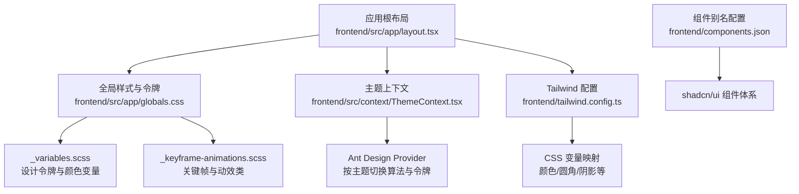
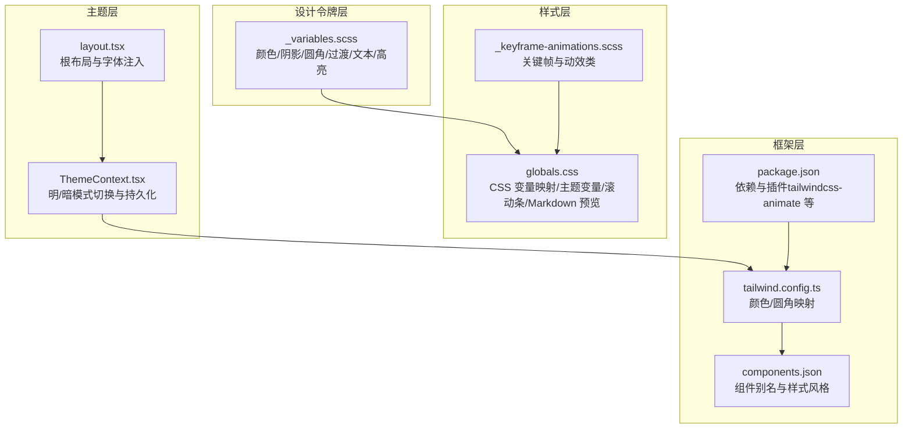
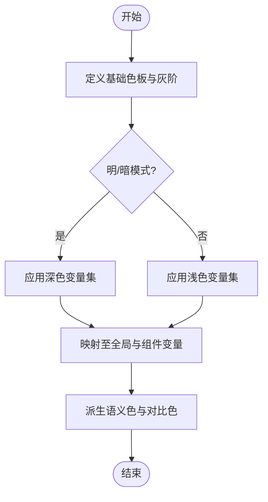
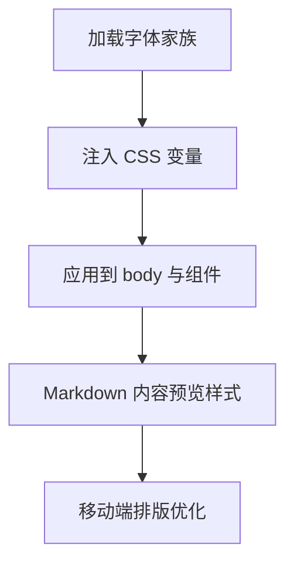
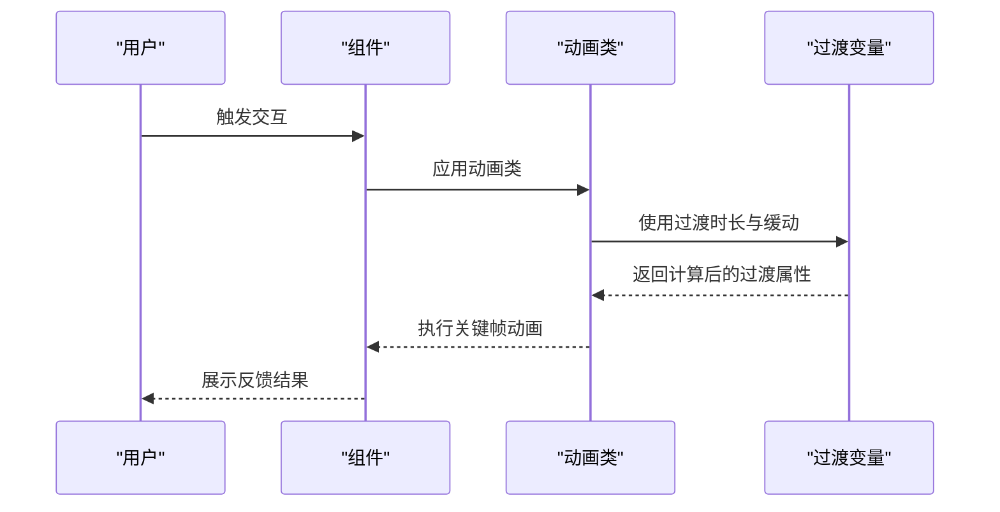
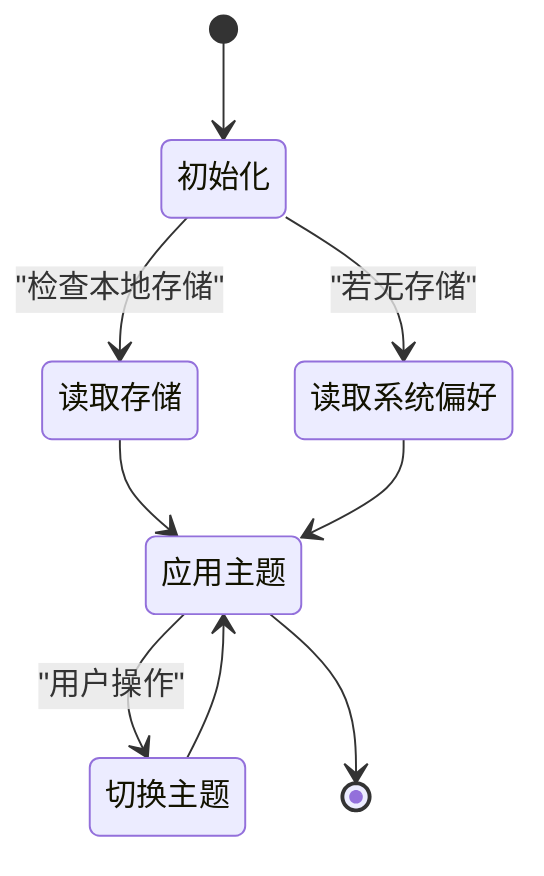
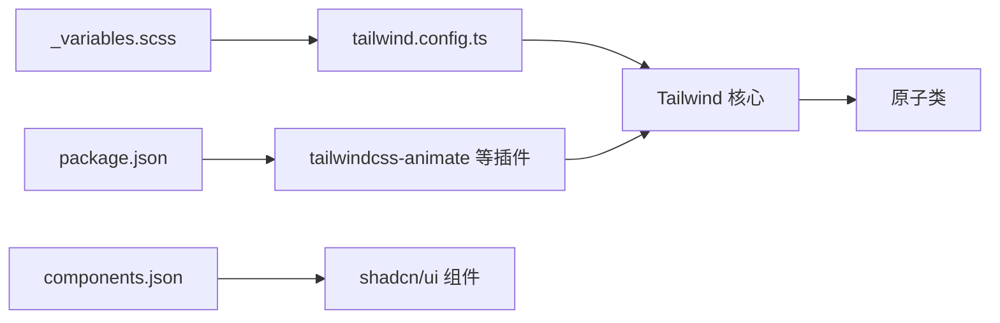

# 设计系统原则

<cite>
**本文引用的文件**
- [frontend/src/styles/_variables.scss](file://frontend/src/styles/_variables.scss)
- [frontend/src/styles/_keyframe-animations.scss](file://frontend/src/styles/_keyframe-animations.scss)
- [frontend/tailwind.config.ts](file://frontend/tailwind.config.ts)
- [frontend/package.json](file://frontend/package.json)
- [frontend/src/app/layout.tsx](file://frontend/src/app/layout.tsx)
- [frontend/src/app/globals.css](file://frontend/src/app/globals.css)
- [frontend/components.json](file://frontend/components.json)
- [frontend/src/context/ThemeContext.tsx](file://frontend/src/context/ThemeContext.tsx)
</cite>

## 目录
1. [引言](#引言)
2. [项目结构](#项目结构)
3. [核心组件](#核心组件)
4. [架构总览](#架构总览)
5. [详细组件分析](#详细组件分析)
6. [依赖关系分析](#依赖关系分析)
7. [性能考量](#性能考量)
8. [故障排查指南](#故障排查指南)
9. [结论](#结论)
10. [附录](#附录)

## 引言
本文件面向 KunFlix 的设计系统原则，聚焦前端侧的设计令牌、色彩系统、字体排版、间距与动效、响应式与无障碍等实践，帮助开发者与设计师在保持品牌一致性的前提下，高效构建可维护的用户界面。

## 项目结构
前端采用 Next.js 应用程序与 TailwindCSS 集成方案，通过全局样式与设计令牌统一管理视觉变量，并以主题上下文控制明暗模式切换。关键文件分布如下：
- 样式与令牌：frontend/src/styles/_variables.scss、frontend/src/app/globals.css
- 动画与关键帧：frontend/src/styles/_keyframe-animations.scss
- 主题与上下文：frontend/src/context/ThemeContext.tsx、frontend/src/app/layout.tsx
- Tailwind 配置：frontend/tailwind.config.ts
- 组件库与工具：frontend/package.json、frontend/components.json

图表来源
- [frontend/src/app/layout.tsx:1-42](file://frontend/src/app/layout.tsx#L1-L42)
- [frontend/src/app/globals.css:1-247](file://frontend/src/app/globals.css#L1-L247)
- [frontend/src/styles/_variables.scss:1-297](file://frontend/src/styles/_variables.scss#L1-L297)
- [frontend/src/styles/_keyframe-animations.scss:1-176](file://frontend/src/styles/_keyframe-animations.scss#L1-L176)
- [frontend/src/context/ThemeContext.tsx:1-75](file://frontend/src/context/ThemeContext.tsx#L1-L75)
- [frontend/tailwind.config.ts:1-64](file://frontend/tailwind.config.ts#L1-L64)
- [frontend/components.json:1-21](file://frontend/components.json#L1-L21)

章节来源
- [frontend/src/app/layout.tsx:1-42](file://frontend/src/app/layout.tsx#L1-L42)
- [frontend/src/app/globals.css:1-247](file://frontend/src/app/globals.css#L1-L247)
- [frontend/src/context/ThemeContext.tsx:1-75](file://frontend/src/context/ThemeContext.tsx#L1-L75)
- [frontend/tailwind.config.ts:1-64](file://frontend/tailwind.config.ts#L1-L64)
- [frontend/components.json:1-21](file://frontend/components.json#L1-L21)

## 核心组件
- 设计令牌（Design Tokens）
  - 通过 CSS 变量集中定义基础颜色、阴影、圆角、过渡时长与缓动曲线，确保跨组件一致性与主题扩展能力。
  - 支持明/暗两套全局颜色与文本高亮色，以及 Canvas 节点专用颜色。
- 字体排版（Typography）
  - 采用 Geist Sans 与 Geist Mono 字体族，通过 CSS 变量注入，确保正文与代码字体的一致性与可读性。
- 动画与过渡（Animation & Transitions）
  - 提供通用关键帧（淡入淡出、缩放、滑入、旋转、脉冲等）与实用类，结合 Tailwind animate 插件实现流畅交互。
- 响应式与无障碍（Responsive & Accessibility）
  - 在全局样式中对小屏设备进行排版优化；尊重用户的“减少动态”偏好，降低动画时长与次数。
- 主题系统（Theme）
  - 通过 ThemeProvider 控制明/暗模式，持久化到本地存储，并与 Ant Design 的算法与令牌联动。

章节来源
- [frontend/src/styles/_variables.scss:1-297](file://frontend/src/styles/_variables.scss#L1-L297)
- [frontend/src/app/globals.css:1-247](file://frontend/src/app/globals.css#L1-L247)
- [frontend/src/styles/_keyframe-animations.scss:1-176](file://frontend/src/styles/_keyframe-animations.scss#L1-L176)
- [frontend/src/context/ThemeContext.tsx:1-75](file://frontend/src/context/ThemeContext.tsx#L1-L75)
- [frontend/src/app/layout.tsx:1-42](file://frontend/src/app/layout.tsx#L1-L42)

## 架构总览
设计系统围绕“变量—样式—主题—组件”的分层组织，形成从底层令牌到上层组件的稳定映射关系。

图表来源
- [frontend/src/styles/_variables.scss:1-297](file://frontend/src/styles/_variables.scss#L1-L297)
- [frontend/src/app/globals.css:1-247](file://frontend/src/app/globals.css#L1-L247)
- [frontend/src/styles/_keyframe-animations.scss:1-176](file://frontend/src/styles/_keyframe-animations.scss#L1-L176)
- [frontend/src/app/layout.tsx:1-42](file://frontend/src/app/layout.tsx#L1-L42)
- [frontend/src/context/ThemeContext.tsx:1-75](file://frontend/src/context/ThemeContext.tsx#L1-L75)
- [frontend/tailwind.config.ts:1-64](file://frontend/tailwind.config.ts#L1-L64)
- [frontend/components.json:1-21](file://frontend/components.json#L1-L21)
- [frontend/package.json:1-94](file://frontend/package.json#L1-L94)

## 详细组件分析

### 色彩系统与设计令牌
- 分层与命名
  - 基础灰阶与透明度变体：提供多级 alpha 与不透明灰阶，覆盖浅色与深色模式。
  - 品牌色与基础色：品牌色提供多级递增/递减，基础色包含白、黑、透明。
  - 文本与高亮：为多种语义颜色提供文本与对比色，便于在不同背景上保持可读性。
- 主题映射
  - 全局背景、边框、卡片、滚动条、选择色等在明/暗模式下分别定义，确保一致的对比度与层次感。
  - Canvas 节点颜色与 AI 助手主题变量独立维护，便于在画布场景中清晰区分节点类型与状态。
- 使用建议
  - 优先使用 CSS 变量而非硬编码值，避免重复与不一致。
  - 通过设计令牌派生语义色（如成功/错误/执行中），统一状态反馈。

图表来源
- [frontend/src/styles/_variables.scss:174-297](file://frontend/src/styles/_variables.scss#L174-L297)
- [frontend/src/app/globals.css:34-214](file://frontend/src/app/globals.css#L34-L214)

章节来源
- [frontend/src/styles/_variables.scss:1-297](file://frontend/src/styles/_variables.scss#L1-L297)
- [frontend/src/app/globals.css:34-214](file://frontend/src/app/globals.css#L34-L214)

### 字体排版与可读性
- 字体家族
  - 使用 Geist Sans 作为无衬线字体，Geist Mono 作为等宽字体，均通过 CSS 变量注入，确保全局一致。
- Markdown 内容预览
  - 对标题、段落、列表、块引用、代码、链接、图片、分割线等元素提供完整的样式规范，保证内容在不同组件中的呈现一致性。
- 移动端优化
  - 针对小屏设备调整字号与行高，确保阅读体验。

图表来源
- [frontend/src/app/layout.tsx:8-16](file://frontend/src/app/layout.tsx#L8-L16)
- [frontend/src/app/globals.css:249-493](file://frontend/src/app/globals.css#L249-L493)

章节来源
- [frontend/src/app/layout.tsx:1-42](file://frontend/src/app/layout.tsx#L1-L42)
- [frontend/src/app/globals.css:249-493](file://frontend/src/app/globals.css#L249-L493)

### 间距规范与圆角体系
- 间距与圆角
  - 通过 CSS 变量定义多级半径（xxs 到 xl），配合组件库的圆角映射，确保 UI 层级的一致性。
- 边框与分割
  - 全局边框色随主题变化，用于卡片、输入框、对话框等组件的边界表现。

章节来源
- [frontend/src/styles/_variables.scss:135-142](file://frontend/src/styles/_variables.scss#L135-L142)
- [frontend/src/app/globals.css:256-258](file://frontend/src/app/globals.css#L256-L258)
- [frontend/tailwind.config.ts:54-58](file://frontend/tailwind.config.ts#L54-L58)

### 动画系统与交互反馈
- 关键帧与动效类
  - 提供淡入淡出、缩放、滑入、旋转、脉冲、打字机光标闪烁、思考波纹等关键帧，并封装为可复用的动画类。
- 与 UI 的结合
  - 动效类可直接应用于组件或容器，结合过渡时长与缓动曲线，营造自然的交互反馈。
- 性能与偏好
  - 尊重“减少动态”偏好，自动降低动画时长与次数，保障无障碍体验。

图表来源
- [frontend/src/styles/_keyframe-animations.scss:1-176](file://frontend/src/styles/_keyframe-animations.scss#L1-L176)
- [frontend/src/styles/_variables.scss:147-154](file://frontend/src/styles/_variables.scss#L147-L154)

章节来源
- [frontend/src/styles/_keyframe-animations.scss:1-176](file://frontend/src/styles/_keyframe-animations.scss#L1-L176)
- [frontend/src/styles/_variables.scss:147-154](file://frontend/src/styles/_variables.scss#L147-L154)

### 响应式设计与断点策略
- 移动优先
  - 在全局样式中针对小屏设备（如 640px）进行排版优化，确保内容在移动端的可读性与可用性。
- 无障碍偏好
  - 通过媒体查询尊重“减少动态”偏好，降低动画与过渡的持续时间，提升可访问性。

章节来源
- [frontend/src/app/globals.css:471-502](file://frontend/src/app/globals.css#L471-L502)

### 主题定制与品牌一致性
- 明/暗模式
  - 通过 ThemeProvider 读取本地存储或系统偏好，切换 HTML 类与 data-theme 属性，驱动 CSS 变量与 Ant Design 算法。
- Ant Design 集成
  - 使用 Ant Design 的 darkAlgorithm/defaultAlgorithm 与自定义 token，确保第三方组件与业务组件风格一致。
- 品牌一致性
  - 通过品牌色与语义色的统一派生，确保品牌在不同组件与状态下的一致表达。

图表来源
- [frontend/src/context/ThemeContext.tsx:16-41](file://frontend/src/context/ThemeContext.tsx#L16-L41)
- [frontend/src/app/globals.css:64-138](file://frontend/src/app/globals.css#L64-L138)

章节来源
- [frontend/src/context/ThemeContext.tsx:1-75](file://frontend/src/context/ThemeContext.tsx#L1-L75)
- [frontend/src/app/globals.css:64-138](file://frontend/src/app/globals.css#L64-L138)

### 国际化与无障碍支持
- 国际化
  - Ant Design 的 ConfigProvider 已配置中文语言包，确保组件文案符合中文用户的使用习惯。
- 无障碍
  - 通过“减少动态”媒体查询降低动画强度；为滚动条提供自定义样式，改善可感知性；为链接与按钮提供明确的焦点与悬停反馈。

章节来源
- [frontend/src/context/ThemeContext.tsx:4-6](file://frontend/src/context/ThemeContext.tsx#L4-L6)
- [frontend/src/app/globals.css:277-302](file://frontend/src/app/globals.css#L277-L302)
- [frontend/src/app/globals.css:495-502](file://frontend/src/app/globals.css#L495-L502)

## 依赖关系分析
- Tailwind 与设计令牌
  - tailwind.config.ts 将 CSS 变量映射为 Tailwind 颜色与圆角，使原子类与设计令牌解耦但保持一致。
- 动画插件
  - tailwindcss-animate 插件启用后，可直接使用 animate-* 类名，简化动画类的编写。
- 组件库与别名
  - components.json 定义了 shadcn/ui 的别名与样式风格，便于在项目中统一引入与定制。

图表来源
- [frontend/src/styles/_variables.scss:1-297](file://frontend/src/styles/_variables.scss#L1-L297)
- [frontend/tailwind.config.ts:1-64](file://frontend/tailwind.config.ts#L1-L64)
- [frontend/package.json:61-61](file://frontend/package.json#L61-L61)
- [frontend/components.json:1-21](file://frontend/components.json#L1-L21)

章节来源
- [frontend/tailwind.config.ts:1-64](file://frontend/tailwind.config.ts#L1-L64)
- [frontend/package.json:61-61](file://frontend/package.json#L61-L61)
- [frontend/components.json:1-21](file://frontend/components.json#L1-L21)

## 性能考量
- CSS 变量与原子类
  - 使用 CSS 变量减少重复样式，结合 Tailwind 原子类降低打包体积与运行时开销。
- 动画与过渡
  - 合理设置过渡时长与缓动曲线，避免过度复杂的动画导致渲染压力；尊重“减少动态”偏好。
- 字体加载
  - 字体变量注入于根节点，确保首屏渲染时字体可用，避免布局抖动。

## 故障排查指南
- 主题不生效
  - 检查 ThemeProvider 是否包裹应用根节点；确认本地存储与 data-theme 属性是否正确写入。
- 动画异常
  - 确认已引入 tailwindcss-animate 插件；检查动画类与过渡变量是否正确应用。
- 字体显示问题
  - 确认 layout.tsx 中字体变量已注入；检查全局 CSS 是否正确加载。
- 组件样式冲突
  - 检查 components.json 的别名与样式风格配置；避免直接覆盖原子类。

章节来源
- [frontend/src/context/ThemeContext.tsx:31-41](file://frontend/src/context/ThemeContext.tsx#L31-L41)
- [frontend/package.json:61-61](file://frontend/package.json#L61-L61)
- [frontend/src/app/layout.tsx:30-32](file://frontend/src/app/layout.tsx#L30-L32)
- [frontend/components.json:13-19](file://frontend/components.json#L13-L19)

## 结论
本设计系统以 CSS 变量为核心，结合 Tailwind 原子类与 Ant Design 组件库，实现了从色彩、字体、间距到动画与主题的全链路统一。通过明/暗模式与无障碍偏好的内置支持，确保品牌一致性与用户体验的稳定性。建议在后续迭代中持续沉淀语义色与动效规范，完善组件库的可访问性测试与国际化校验。

## 附录
- 设计令牌使用清单
  - 颜色：使用基础灰阶与品牌色变量，避免硬编码；通过语义色派生状态反馈。
  - 圆角：优先使用变量定义的半径等级，保持层级一致性。
  - 过渡：统一使用过渡时长与缓动变量，确保交互节奏一致。
- 主题定制步骤
  - 在 ThemeProvider 中调整 Ant Design 算法与 token；在 globals.css 中同步更新主题变量。
- 品牌一致性检查
  - 对照品牌色与语义色清单核验各组件；确保在明/暗模式下的对比度满足可访问性要求。