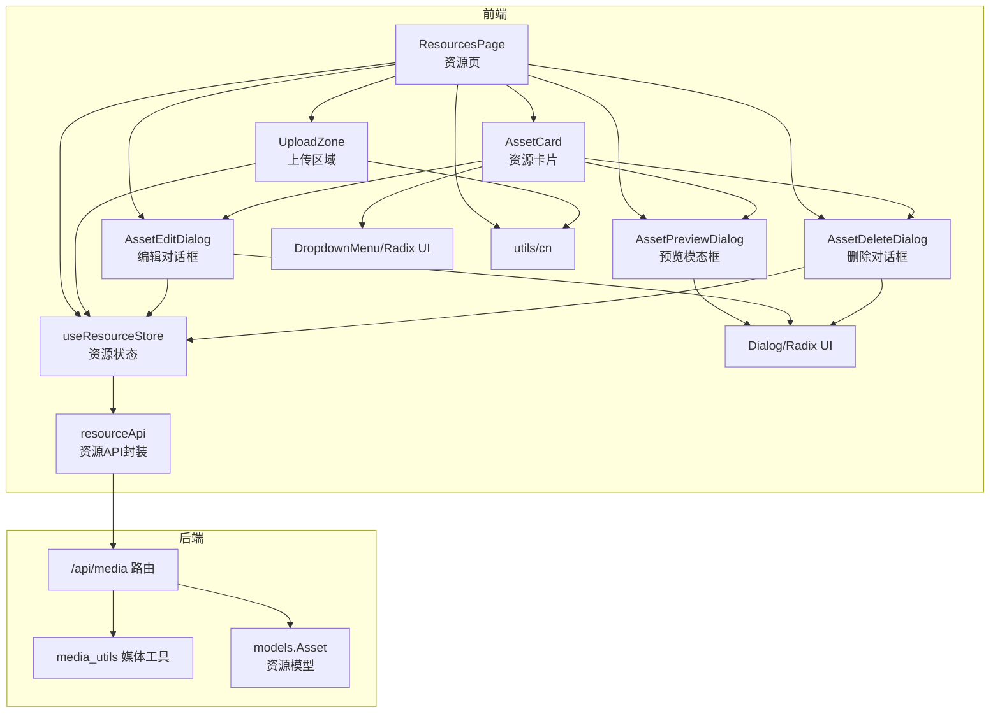
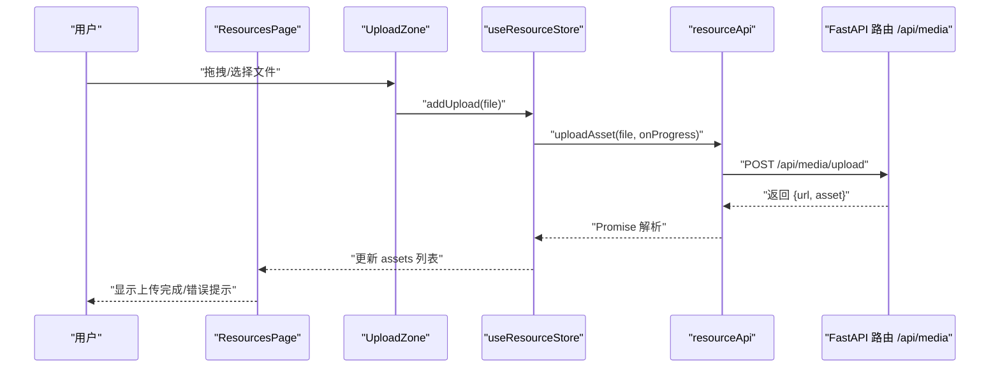
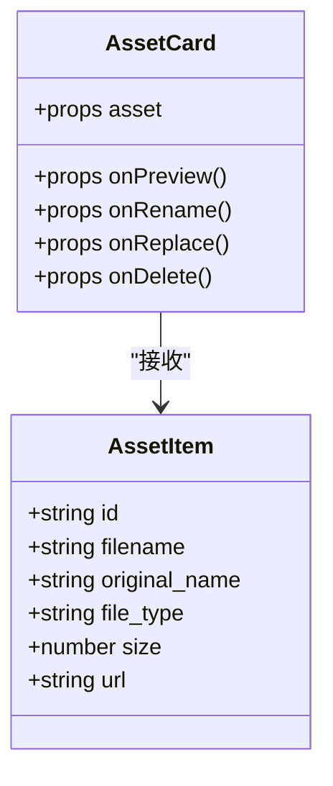
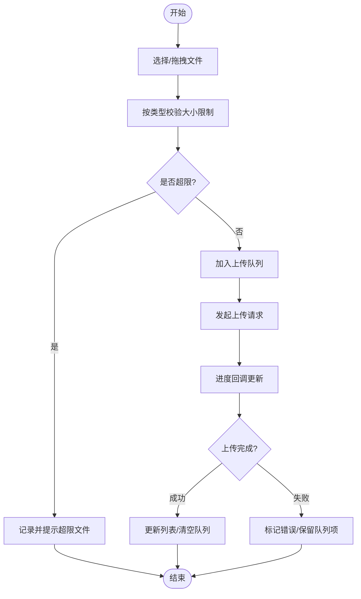
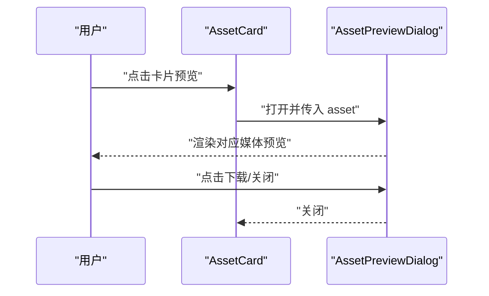
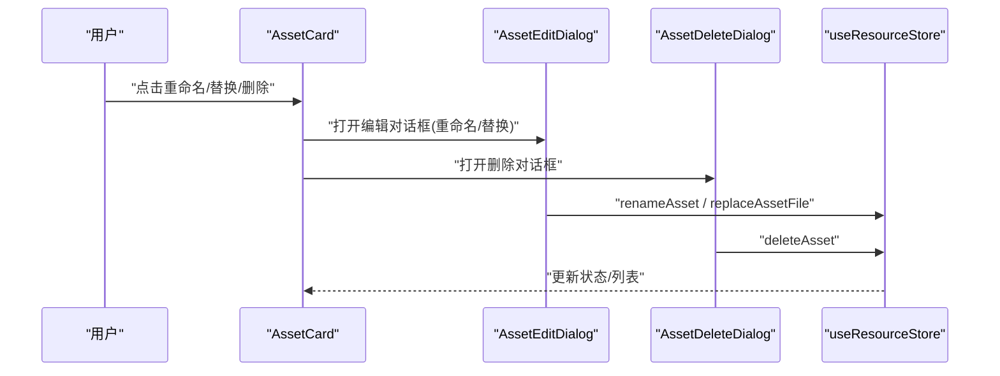
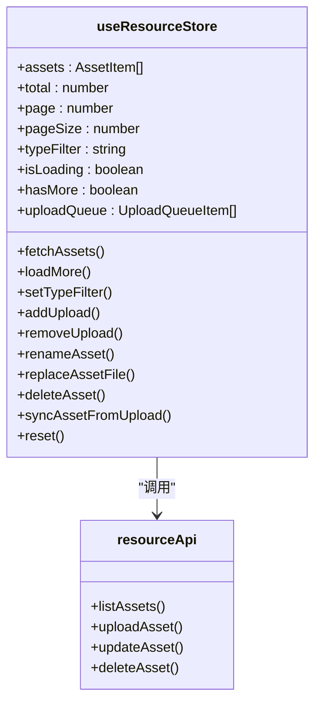
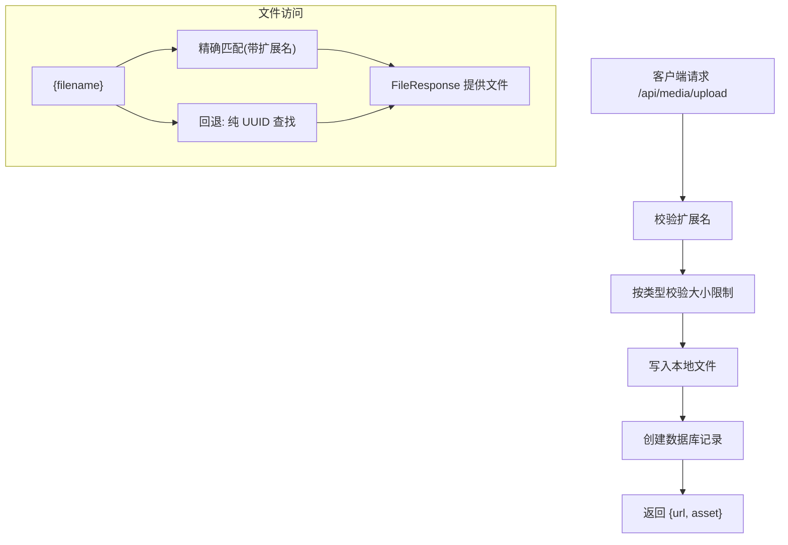
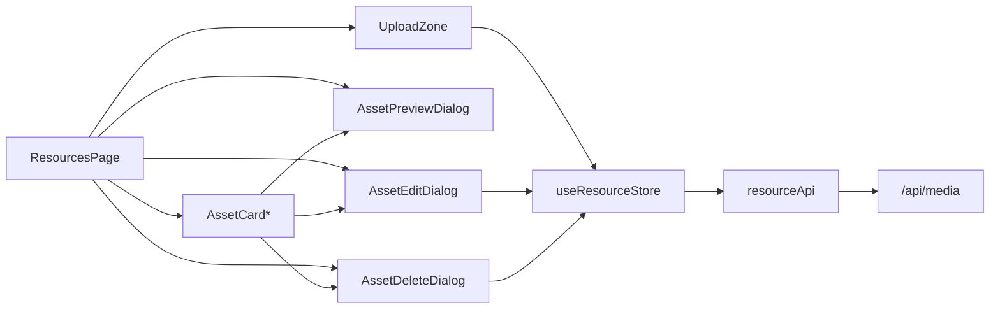

# 资源管理组件

<cite>
**本文引用的文件**
- [frontend/src/app/resources/page.tsx](file://frontend/src/app/resources/page.tsx)
- [frontend/src/components/resources/AssetCard.tsx](file://frontend/src/components/resources/AssetCard.tsx)
- [frontend/src/components/resources/UploadZone.tsx](file://frontend/src/components/resources/UploadZone.tsx)
- [frontend/src/components/resources/AssetPreviewDialog.tsx](file://frontend/src/components/resources/AssetPreviewDialog.tsx)
- [frontend/src/components/resources/AssetEditDialog.tsx](file://frontend/src/components/resources/AssetEditDialog.tsx)
- [frontend/src/components/resources/AssetDeleteDialog.tsx](file://frontend/src/components/resources/AssetDeleteDialog.tsx)
- [frontend/src/store/useResourceStore.ts](file://frontend/src/store/useResourceStore.ts)
- [frontend/src/lib/resourceApi.ts](file://frontend/src/lib/resourceApi.ts)
- [frontend/src/components/ui/dialog.tsx](file://frontend/src/components/ui/dialog.tsx)
- [frontend/src/components/ui/dropdown-menu.tsx](file://frontend/src/components/ui/dropdown-menu.tsx)
- [frontend/src/lib/utils.ts](file://frontend/src/lib/utils.ts)
- [backend/routers/media.py](file://backend/routers/media.py)
- [backend/services/media_utils.py](file://backend/services/media_utils.py)
- [backend/models.py](file://backend/models.py)
</cite>

## 目录
1. [简介](#简介)
2. [项目结构](#项目结构)
3. [核心组件](#核心组件)
4. [架构总览](#架构总览)
5. [详细组件分析](#详细组件分析)
6. [依赖关系分析](#依赖关系分析)
7. [性能考量](#性能考量)
8. [故障排查指南](#故障排查指南)
9. [结论](#结论)
10. [附录](#附录)

## 简介
本文件为 Infinite Game 的“资源管理组件”提供系统化技术文档，聚焦媒体资产管理的前端 UI 组件与后端服务端点协同工作方式。内容涵盖：
- 资源卡片、上传区域与预览模态框的设计与实现
- 文件上传流程、进度跟踪与错误处理机制
- 资源分类、搜索过滤与无限滚动加载
- 资源编辑（重命名/替换）、删除与对话框交互
- 使用示例、文件类型支持与存储策略
- 资源预览优化、缩略图生成与跨剧场资源共享

## 项目结构
资源管理功能由前端页面与组件、状态管理、API 封装以及后端路由与模型共同组成。前端采用 Next.js App Router，使用 Zustand 管理资源状态，Radix UI 构建对话框与下拉菜单；后端基于 FastAPI 提供媒体上传、列表、更新与删除接口，并持久化到本地文件系统。

图表来源
- [frontend/src/app/resources/page.tsx:1-189](file://frontend/src/app/resources/page.tsx#L1-L189)
- [frontend/src/components/resources/AssetCard.tsx:1-132](file://frontend/src/components/resources/AssetCard.tsx#L1-L132)
- [frontend/src/components/resources/UploadZone.tsx:1-129](file://frontend/src/components/resources/UploadZone.tsx#L1-L129)
- [frontend/src/components/resources/AssetPreviewDialog.tsx:1-102](file://frontend/src/components/resources/AssetPreviewDialog.tsx#L1-L102)
- [frontend/src/components/resources/AssetEditDialog.tsx:1-98](file://frontend/src/components/resources/AssetEditDialog.tsx#L1-L98)
- [frontend/src/components/resources/AssetDeleteDialog.tsx:1-72](file://frontend/src/components/resources/AssetDeleteDialog.tsx#L1-L72)
- [frontend/src/store/useResourceStore.ts:1-182](file://frontend/src/store/useResourceStore.ts#L1-L182)
- [frontend/src/lib/resourceApi.ts:1-109](file://frontend/src/lib/resourceApi.ts#L1-L109)
- [backend/routers/media.py:1-444](file://backend/routers/media.py#L1-L444)
- [backend/services/media_utils.py:1-79](file://backend/services/media_utils.py#L1-L79)
- [backend/models.py:131-150](file://backend/models.py#L131-L150)

章节来源
- [frontend/src/app/resources/page.tsx:1-189](file://frontend/src/app/resources/page.tsx#L1-L189)
- [backend/routers/media.py:1-444](file://backend/routers/media.py#L1-L444)

## 核心组件
- 资源卡片 AssetCard：展示资源缩略图与元信息，提供重命名、替换、删除等操作入口。
- 上传区域 UploadZone：拖拽/点击上传，按类型限制大小，显示上传队列与进度。
- 预览模态框 AssetPreviewDialog：根据资源类型渲染图片、视频或音频的全屏预览。
- 编辑对话框 AssetEditDialog：支持重命名与替换文件两种模式。
- 删除对话框 AssetDeleteDialog：确认删除并执行硬删除。
- 资源状态 useResourceStore：集中管理资源列表、分页、类型筛选、上传队列与 CRUD 操作。
- 资源 API resourceApi：封装列表、上传、更新、删除等网络请求。
- UI 基础：Dialog 与 DropdownMenu 由 Radix UI 提供，工具函数 cn 用于类名合并。

章节来源
- [frontend/src/components/resources/AssetCard.tsx:1-132](file://frontend/src/components/resources/AssetCard.tsx#L1-L132)
- [frontend/src/components/resources/UploadZone.tsx:1-129](file://frontend/src/components/resources/UploadZone.tsx#L1-L129)
- [frontend/src/components/resources/AssetPreviewDialog.tsx:1-102](file://frontend/src/components/resources/AssetPreviewDialog.tsx#L1-L102)
- [frontend/src/components/resources/AssetEditDialog.tsx:1-98](file://frontend/src/components/resources/AssetEditDialog.tsx#L1-L98)
- [frontend/src/components/resources/AssetDeleteDialog.tsx:1-72](file://frontend/src/components/resources/AssetDeleteDialog.tsx#L1-L72)
- [frontend/src/store/useResourceStore.ts:1-182](file://frontend/src/store/useResourceStore.ts#L1-L182)
- [frontend/src/lib/resourceApi.ts:1-109](file://frontend/src/lib/resourceApi.ts#L1-L109)
- [frontend/src/components/ui/dialog.tsx:1-121](file://frontend/src/components/ui/dialog.tsx#L1-L121)
- [frontend/src/components/ui/dropdown-menu.tsx:1-201](file://frontend/src/components/ui/dropdown-menu.tsx#L1-L201)
- [frontend/src/lib/utils.ts:1-7](file://frontend/src/lib/utils.ts#L1-L7)

## 架构总览
前端通过资源页聚合各子组件，状态通过 Zustand 管理，网络请求通过 resourceApi 发起。后端提供统一的 /api/media 前缀路由，负责文件上传、资源列表、更新与删除，并将文件保存至本地目录，同时维护数据库中的资源记录。

图表来源
- [frontend/src/components/resources/UploadZone.tsx:33-56](file://frontend/src/components/resources/UploadZone.tsx#L33-L56)
- [frontend/src/store/useResourceStore.ts:103-131](file://frontend/src/store/useResourceStore.ts#L103-L131)
- [frontend/src/lib/resourceApi.ts:53-87](file://frontend/src/lib/resourceApi.ts#L53-L87)
- [backend/routers/media.py:95-149](file://backend/routers/media.py#L95-L149)

## 详细组件分析

### 资源卡片 AssetCard
- 功能要点
  - 根据 file_type 渲染不同预览组件（图片、视频、音频或默认图标）
  - 底部信息遮罩展示文件名与大小
  - 右上角下拉菜单提供重命名、替换、删除操作
- 设计模式
  - 组件映射表：通过类型到渲染器的映射避免 if-else
  - 事件透传：将预览、重命名、替换、删除回调传递给父组件处理
- 性能与可用性
  - 图片懒加载、视频首帧预览、音频控件内嵌
  - 悬停显示操作菜单，提升空间利用率

图表来源
- [frontend/src/components/resources/AssetCard.tsx:75-132](file://frontend/src/components/resources/AssetCard.tsx#L75-L132)
- [frontend/src/lib/resourceApi.ts:7-22](file://frontend/src/lib/resourceApi.ts#L7-L22)

章节来源
- [frontend/src/components/resources/AssetCard.tsx:1-132](file://frontend/src/components/resources/AssetCard.tsx#L1-L132)
- [frontend/src/lib/resourceApi.ts:1-109](file://frontend/src/lib/resourceApi.ts#L1-L109)

### 上传区域 UploadZone
- 功能要点
  - 支持拖拽与点击选择文件
  - 按类型进行大小限制检查（图片 50MB、视频 500MB、音频 100MB）
  - 显示上传队列与进度条，支持取消上传
- 错误处理
  - 超出限制的文件以错误提示形式反馈
- 进度跟踪
  - 通过 resourceApi 的 onProgress 回调更新状态

图表来源
- [frontend/src/components/resources/UploadZone.tsx:39-56](file://frontend/src/components/resources/UploadZone.tsx#L39-L56)
- [frontend/src/store/useResourceStore.ts:103-131](file://frontend/src/store/useResourceStore.ts#L103-L131)
- [frontend/src/lib/resourceApi.ts:53-87](file://frontend/src/lib/resourceApi.ts#L53-L87)

章节来源
- [frontend/src/components/resources/UploadZone.tsx:1-129](file://frontend/src/components/resources/UploadZone.tsx#L1-L129)
- [frontend/src/store/useResourceStore.ts:1-182](file://frontend/src/store/useResourceStore.ts#L1-L182)
- [frontend/src/lib/resourceApi.ts:1-109](file://frontend/src/lib/resourceApi.ts#L1-L109)

### 预览模态框 AssetPreviewDialog
- 功能要点
  - 根据资源类型渲染图片、视频或音频的全屏预览
  - 提供下载按钮与关闭按钮
- 交互设计
  - ESC 或点击遮罩关闭
  - 保持焦点与键盘可达性

图表来源
- [frontend/src/components/resources/AssetCard.tsx:83-92](file://frontend/src/components/resources/AssetCard.tsx#L83-L92)
- [frontend/src/components/resources/AssetPreviewDialog.tsx:64-101](file://frontend/src/components/resources/AssetPreviewDialog.tsx#L64-L101)

章节来源
- [frontend/src/components/resources/AssetPreviewDialog.tsx:1-102](file://frontend/src/components/resources/AssetPreviewDialog.tsx#L1-L102)

### 编辑与删除对话框
- AssetEditDialog
  - 支持重命名与替换文件两种模式
  - 表单校验与禁用提交逻辑
- AssetDeleteDialog
  - 确认删除并执行硬删除
  - 展示目标资源名称作为二次确认

图表来源
- [frontend/src/components/resources/AssetCard.tsx:108-128](file://frontend/src/components/resources/AssetCard.tsx#L108-L128)
- [frontend/src/components/resources/AssetEditDialog.tsx:16-41](file://frontend/src/components/resources/AssetEditDialog.tsx#L16-L41)
- [frontend/src/components/resources/AssetDeleteDialog.tsx:16-32](file://frontend/src/components/resources/AssetDeleteDialog.tsx#L16-L32)
- [frontend/src/store/useResourceStore.ts:137-157](file://frontend/src/store/useResourceStore.ts#L137-L157)

章节来源
- [frontend/src/components/resources/AssetEditDialog.tsx:1-98](file://frontend/src/components/resources/AssetEditDialog.tsx#L1-L98)
- [frontend/src/components/resources/AssetDeleteDialog.tsx:1-72](file://frontend/src/components/resources/AssetDeleteDialog.tsx#L1-L72)
- [frontend/src/store/useResourceStore.ts:1-182](file://frontend/src/store/useResourceStore.ts#L1-L182)

### 资源状态与 API 封装
- useResourceStore
  - 管理 assets、total、page、pageSize、typeFilter、isLoading、hasMore、uploadQueue
  - 提供 fetchAssets、loadMore、setTypeFilter、addUpload/removeUpload、renameAsset、replaceAssetFile、deleteAsset、syncAssetFromUpload、reset
- resourceApi
  - listAssets：分页与类型筛选
  - uploadAsset：支持进度回调
  - updateAsset：重命名与替换文件
  - deleteAsset：硬删除

图表来源
- [frontend/src/store/useResourceStore.ts:18-43](file://frontend/src/store/useResourceStore.ts#L18-L43)
- [frontend/src/lib/resourceApi.ts:40-108](file://frontend/src/lib/resourceApi.ts#L40-L108)

章节来源
- [frontend/src/store/useResourceStore.ts:1-182](file://frontend/src/store/useResourceStore.ts#L1-L182)
- [frontend/src/lib/resourceApi.ts:1-109](file://frontend/src/lib/resourceApi.ts#L1-L109)

### 后端路由与存储策略
- /api/media/upload：校验扩展名与大小限制，保存文件到本地目录，创建数据库记录
- /api/media/assets：按用户与类型筛选分页列出资源
- /api/media/assets/{id}：PUT 更新（重命名/替换文件），DELETE 硬删除
- /api/media/{filename}：提供媒体文件，支持带扩展名与纯 UUID 回退查找
- 媒体工具：支持从 URL 保存图片/视频，生成安全文件名（UUID+扩展名）

图表来源
- [backend/routers/media.py:95-149](file://backend/routers/media.py#L95-L149)
- [backend/routers/media.py:155-184](file://backend/routers/media.py#L155-L184)
- [backend/routers/media.py:187-240](file://backend/routers/media.py#L187-L240)
- [backend/routers/media.py:242-266](file://backend/routers/media.py#L242-L266)
- [backend/routers/media.py:272-299](file://backend/routers/media.py#L272-L299)
- [backend/services/media_utils.py:20-79](file://backend/services/media_utils.py#L20-L79)
- [backend/models.py:131-150](file://backend/models.py#L131-L150)

章节来源
- [backend/routers/media.py:1-444](file://backend/routers/media.py#L1-L444)
- [backend/services/media_utils.py:1-79](file://backend/services/media_utils.py#L1-L79)
- [backend/models.py:131-150](file://backend/models.py#L131-L150)

## 依赖关系分析
- 组件耦合
  - ResourcesPage 作为容器组件，协调 UploadZone、AssetCard、对话框与状态
  - AssetCard 仅依赖 AssetItem 类型与回调，低耦合高内聚
- 状态与网络
  - useResourceStore 与 resourceApi 单向依赖，便于测试与替换
- UI 基础
  - Dialog 与 DropdownMenu 作为通用组件被多个对话框复用
- 后端依赖
  - 路由依赖数据库会话与认证上下文，文件系统依赖 MEDIA_DIR

图表来源
- [frontend/src/app/resources/page.tsx:33-188](file://frontend/src/app/resources/page.tsx#L33-L188)
- [frontend/src/store/useResourceStore.ts:51-181](file://frontend/src/store/useResourceStore.ts#L51-L181)
- [frontend/src/lib/resourceApi.ts:40-108](file://frontend/src/lib/resourceApi.ts#L40-L108)
- [backend/routers/media.py:30-30](file://backend/routers/media.py#L30-L30)

章节来源
- [frontend/src/app/resources/page.tsx:1-189](file://frontend/src/app/resources/page.tsx#L1-L189)
- [frontend/src/store/useResourceStore.ts:1-182](file://frontend/src/store/useResourceStore.ts#L1-L182)
- [frontend/src/lib/resourceApi.ts:1-109](file://frontend/src/lib/resourceApi.ts#L1-L109)
- [backend/routers/media.py:1-444](file://backend/routers/media.py#L1-L444)

## 性能考量
- 无限滚动与分页
  - 使用 IntersectionObserver 触发 loadMore，减少不必要的请求
  - 分页参数 page_size 控制每次加载数量，建议结合虚拟列表进一步优化
- 上传进度
  - 基于 XMLHttpRequest 的进度事件，避免阻塞主线程
- 预览优化
  - 图片懒加载、视频首帧预览、音频内嵌控件，降低初始渲染压力
- 文件存储
  - 本地文件系统直存，配合缓存控制头；建议后续引入 CDN 与缩略图生成服务

## 故障排查指南
- 上传失败
  - 检查文件类型与大小限制是否满足要求
  - 查看浏览器网络面板与后端日志，确认 HTTP 状态码与错误详情
- 进度不更新
  - 确认 onProgress 回调是否正确绑定与触发
- 预览异常
  - 确认 file_type 与 url 是否正确，浏览器对某些视频格式的支持差异
- 删除后仍可见
  - 确认数据库记录与文件系统文件均已清理
- 跨剧场资源共享
  - 当前资源属于用户级共享，可在不同剧场引用同一资源链接

章节来源
- [frontend/src/components/resources/UploadZone.tsx:96-105](file://frontend/src/components/resources/UploadZone.tsx#L96-L105)
- [frontend/src/lib/resourceApi.ts:73-86](file://frontend/src/lib/resourceApi.ts#L73-L86)
- [backend/routers/media.py:117-123](file://backend/routers/media.py#L117-L123)
- [backend/routers/media.py:242-266](file://backend/routers/media.py#L242-L266)

## 结论
资源管理组件通过清晰的职责划分与稳定的前后端协作，实现了媒体资产的高效管理。前端以卡片网格与对话框为核心交互，后端提供安全可靠的文件存储与资源管理能力。建议后续引入缩略图生成、CDN 加速与更丰富的搜索过滤能力，以进一步提升用户体验与系统性能。

## 附录

### 使用示例
- 在资源页中拖拽或点击上传文件，观察上传队列与进度条
- 点击资源卡片进入预览，支持下载与关闭
- 通过下拉菜单进行重命名或替换文件
- 使用类型筛选与视图切换（网格/列表）浏览资源

章节来源
- [frontend/src/app/resources/page.tsx:33-188](file://frontend/src/app/resources/page.tsx#L33-L188)
- [frontend/src/components/resources/UploadZone.tsx:33-129](file://frontend/src/components/resources/UploadZone.tsx#L33-L129)
- [frontend/src/components/resources/AssetCard.tsx:83-132](file://frontend/src/components/resources/AssetCard.tsx#L83-L132)
- [frontend/src/components/resources/AssetPreviewDialog.tsx:64-102](file://frontend/src/components/resources/AssetPreviewDialog.tsx#L64-L102)

### 文件类型支持与大小限制
- 支持类型：图片（jpg、png、webp、gif）、视频（mp4、webm、mov）、音频（mp3、wav）
- 大小限制：图片 ≤ 50MB、视频 ≤ 500MB、音频 ≤ 100MB

章节来源
- [frontend/src/components/resources/UploadZone.tsx:15-22](file://frontend/src/components/resources/UploadZone.tsx#L15-L22)
- [backend/routers/media.py:32-38](file://backend/routers/media.py#L32-L38)

### 存储策略
- 服务器端将文件保存在本地目录，文件名为 UUID+扩展名
- 资源记录包含用户 ID、文件名、原始名称、MIME 类型、尺寸与元数据
- 提供 /api/media/{filename} 作为安全访问入口，支持扩展名精确匹配与纯 UUID 回退

章节来源
- [backend/routers/media.py:40-46](file://backend/routers/media.py#L40-L46)
- [backend/routers/media.py:272-299](file://backend/routers/media.py#L272-L299)
- [backend/models.py:131-150](file://backend/models.py#L131-L150)

### 跨剧场资源共享
- 资源属于用户级共享，可在不同剧场节点中引用同一资源链接
- 建议在节点数据中仅保存资源 ID 与引用信息，避免重复存储

章节来源
- [backend/models.py:131-150](file://backend/models.py#L131-L150)