# 资源管理组件

<cite>
**本文档引用的文件**
- [frontend/src/app/resources/page.tsx](file://frontend/src/app/resources/page.tsx)
- [frontend/src/context/ThemeContext.tsx](file://frontend/src/context/ThemeContext.tsx)
- [frontend/src/context/AuthContext.tsx](file://frontend/src/context/AuthContext.tsx)
- [frontend/src/store/useResourceStore.ts](file://frontend/src/store/useResourceStore.ts)
- [frontend/src/lib/resourceApi.ts](file://frontend/src/lib/resourceApi.ts)
- [frontend/src/lib/utils.ts](file://frontend/src/lib/utils.ts)
- [frontend/src/components/resources/AssetCard.tsx](file://frontend/src/components/resources/AssetCard.tsx)
- [frontend/src/components/resources/UploadZone.tsx](file://frontend/src/components/resources/UploadZone.tsx)
- [frontend/src/components/resources/AssetPreviewDialog.tsx](file://frontend/src/components/resources/AssetPreviewDialog.tsx)
- [frontend/src/components/resources/AssetEditDialog.tsx](file://frontend/src/components/resources/AssetEditDialog.tsx)
- [frontend/src/components/resources/AssetDeleteDialog.tsx](file://frontend/src/components/resources/AssetDeleteDialog.tsx)
- [backend/routers/media.py](file://backend/routers/media.py)
- [backend/services/media_utils.py](file://backend/services/media_utils.py)
- [backend/models.py](file://backend/models.py)
</cite>

## 更新摘要
**所做更改**
- 新增现代化导航栏设计，包含品牌标识、导航链接和响应式布局
- 集成搜索功能，支持实时资源检索和搜索状态管理
- 实现主题切换系统，支持明暗主题自动切换和持久化
- 添加用户菜单系统，提供个人资料、设置和登出功能
- 引入固定定位导航元素，优化移动端体验
- 增强拖拽上传功能，支持拖放区域高亮和文件验证
- 优化视图模式切换，支持网格和列表两种显示模式
- 完善上传队列管理，提供进度跟踪和错误处理

## 目录
1. [简介](#简介)
2. [项目结构](#项目结构)
3. [核心组件](#核心组件)
4. [架构总览](#架构总览)
5. [详细组件分析](#详细组件分析)
6. [依赖关系分析](#依赖关系分析)
7. [性能考量](#性能考量)
8. [故障排查指南](#故障排查指南)
9. [结论](#结论)
10. [附录](#附录)

## 简介
本文档为 KunFlix 的"资源管理组件"提供系统化技术文档，聚焦媒体资产管理的前端 UI 组件与后端服务端点协同工作方式。经过重大重构后，系统现已具备现代化界面设计、增强的用户交互体验和完整的资源管理功能。内容涵盖：

- 现代化导航栏、搜索功能、主题切换和用户菜单系统
- 固定定位导航元素、响应式设计和拖拽上传功能
- 资源卡片、上传区域与预览模态框的设计与实现
- 文件上传流程、进度跟踪与错误处理机制
- 资源分类、搜索过滤与无限滚动加载
- 资源编辑（重命名/替换）、删除与对话框交互
- 使用示例、文件类型支持与存储策略
- 资源预览优化、缩略图生成与跨剧场资源共享

## 项目结构
资源管理功能由现代化前端页面与组件、状态管理、API 封装以及后端路由与模型共同组成。前端采用 Next.js App Router，使用 Zustand 管理资源状态，集成 Framer Motion 提供流畅动画效果，使用 Radix UI 构建对话框与下拉菜单；后端基于 FastAPI 提供媒体上传、列表、更新与删除接口，并持久化到本地文件系统。

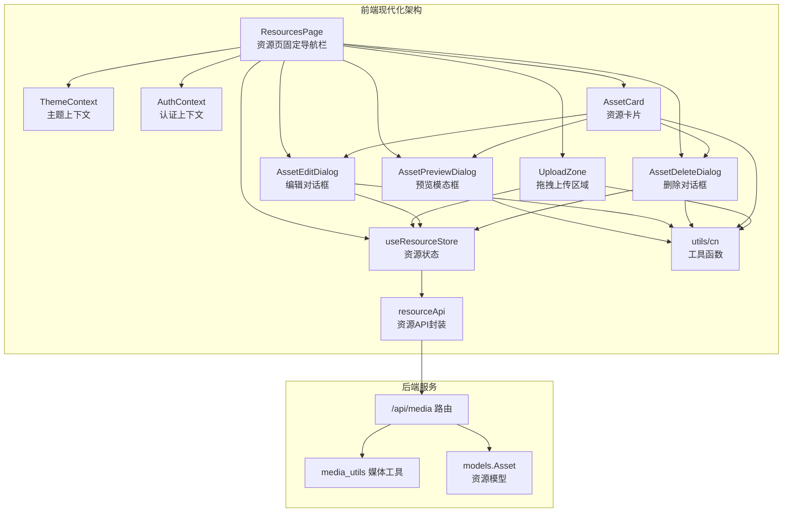

**图表来源**
- [frontend/src/app/resources/page.tsx:63-658](file://frontend/src/app/resources/page.tsx#L63-L658)
- [frontend/src/context/ThemeContext.tsx:16-75](file://frontend/src/context/ThemeContext.tsx#L16-L75)
- [frontend/src/context/AuthContext.tsx:119-207](file://frontend/src/context/AuthContext.tsx#L119-L207)
- [frontend/src/store/useResourceStore.ts:51-182](file://frontend/src/store/useResourceStore.ts#L51-L182)
- [frontend/src/lib/resourceApi.ts:40-109](file://frontend/src/lib/resourceApi.ts#L40-L109)

**章节来源**
- [frontend/src/app/resources/page.tsx:63-658](file://frontend/src/app/resources/page.tsx#L63-L658)
- [frontend/src/context/ThemeContext.tsx:16-75](file://frontend/src/context/ThemeContext.tsx#L16-L75)
- [frontend/src/context/AuthContext.tsx:119-207](file://frontend/src/context/AuthContext.tsx#L119-L207)
- [backend/routers/media.py:1-444](file://backend/routers/media.py#L1-L444)

## 核心组件
- **现代化资源页 ResourcesPage**：采用固定定位导航栏设计，集成搜索、主题切换、用户菜单和响应式布局
- **资源卡片 AssetCard**：展示资源缩略图与元信息，提供重命名、替换、删除等操作入口
- **拖拽上传 UploadZone**：支持拖拽/点击上传，按类型限制大小，显示上传队列与进度
- **预览模态框 AssetPreviewDialog**：根据资源类型渲染图片、视频或音频的全屏预览
- **编辑对话框 AssetEditDialog**：支持重命名与替换文件两种模式
- **删除对话框 AssetDeleteDialog**：确认删除并执行硬删除
- **主题上下文 ThemeContext**：提供明暗主题切换和持久化存储
- **认证上下文 AuthContext**：管理用户认证状态和令牌刷新
- **资源状态 useResourceStore**：集中管理资源列表、分页、类型筛选、上传队列与 CRUD 操作
- **资源 API resourceApi**：封装列表、上传、更新、删除等网络请求
- **工具函数 utils**：提供类名合并和样式工具函数

**章节来源**
- [frontend/src/app/resources/page.tsx:21-46](file://frontend/src/app/resources/page.tsx#L21-L46)
- [frontend/src/components/resources/AssetCard.tsx:89-216](file://frontend/src/components/resources/AssetCard.tsx#L89-L216)
- [frontend/src/components/resources/UploadZone.tsx:33-129](file://frontend/src/components/resources/UploadZone.tsx#L33-L129)
- [frontend/src/components/resources/AssetPreviewDialog.tsx:59-102](file://frontend/src/components/resources/AssetPreviewDialog.tsx#L59-L102)
- [frontend/src/components/resources/AssetEditDialog.tsx:16-98](file://frontend/src/components/resources/AssetEditDialog.tsx#L16-L98)
- [frontend/src/components/resources/AssetDeleteDialog.tsx:16-72](file://frontend/src/components/resources/AssetDeleteDialog.tsx#L16-L72)
- [frontend/src/context/ThemeContext.tsx:9-75](file://frontend/src/context/ThemeContext.tsx#L9-L75)
- [frontend/src/context/AuthContext.tsx:31-207](file://frontend/src/context/AuthContext.tsx#L31-L207)
- [frontend/src/store/useResourceStore.ts:18-182](file://frontend/src/store/useResourceStore.ts#L18-L182)
- [frontend/src/lib/resourceApi.ts:7-109](file://frontend/src/lib/resourceApi.ts#L7-L109)
- [frontend/src/lib/utils.ts:4-7](file://frontend/src/lib/utils.ts#L4-L7)

## 架构总览
前端通过现代化资源页聚合各子组件，采用固定定位导航栏提供一致的用户体验。状态通过 Zustand 管理，网络请求通过 resourceApi 发起。后端提供统一的 /api/media 前缀路由，负责文件上传、资源列表、更新与删除，并将文件保存至本地目录，同时维护数据库中的资源记录。

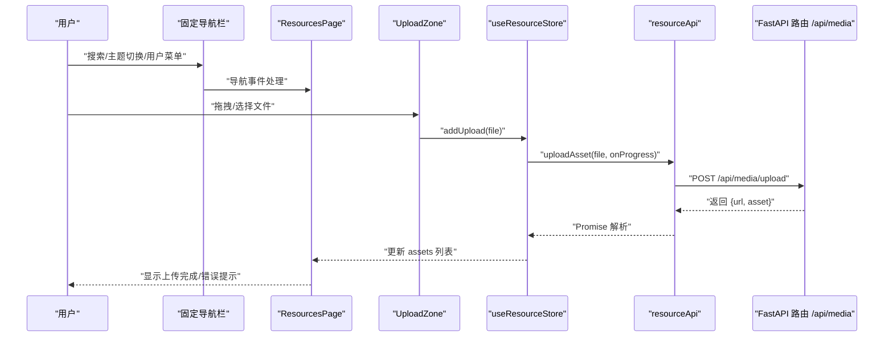

**图表来源**
- [frontend/src/app/resources/page.tsx:154-158](file://frontend/src/app/resources/page.tsx#L154-L158)
- [frontend/src/store/useResourceStore.ts:103-131](file://frontend/src/store/useResourceStore.ts#L103-L131)
- [frontend/src/lib/resourceApi.ts:53-87](file://frontend/src/lib/resourceApi.ts#L53-L87)
- [backend/routers/media.py:95-149](file://backend/routers/media.py#L95-L149)

## 详细组件分析

### 现代化导航栏系统
**更新** 新增固定定位导航栏，提供品牌标识、导航链接、搜索功能、主题切换和用户菜单

- **导航链接配置**：包含首页、资源库、社区三个主要导航项，支持活动状态指示
- **搜索功能**：集成弹簧动画的搜索框，支持实时资源检索和搜索状态管理
- **主题切换**：支持明暗主题自动切换，基于系统偏好和用户选择
- **用户菜单**：提供个人资料、设置选项和登出功能
- **响应式设计**：移动端适配，导航项在小屏幕设备上自动调整

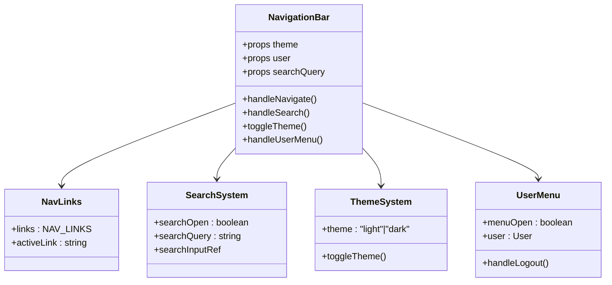

**图表来源**
- [frontend/src/app/resources/page.tsx:21-32](file://frontend/src/app/resources/page.tsx#L21-L32)
- [frontend/src/app/resources/page.tsx:244-368](file://frontend/src/app/resources/page.tsx#L244-L368)
- [frontend/src/context/ThemeContext.tsx:39-41](file://frontend/src/context/ThemeContext.tsx#L39-L41)
- [frontend/src/context/AuthContext.tsx:142-161](file://frontend/src/context/AuthContext.tsx#L142-L161)

**章节来源**
- [frontend/src/app/resources/page.tsx:196-368](file://frontend/src/app/resources/page.tsx#L196-L368)
- [frontend/src/context/ThemeContext.tsx:16-75](file://frontend/src/context/ThemeContext.tsx#L16-L75)
- [frontend/src/context/AuthContext.tsx:119-207](file://frontend/src/context/AuthContext.tsx#L119-L207)

### 资源卡片 AssetCard
**更新** 增强了网格和列表两种视图模式，优化了悬停效果和操作菜单

- **视图模式支持**：支持网格（grid）和列表（list）两种显示模式
- **响应式设计**：根据屏幕尺寸自动调整布局和间距
- **悬停效果**：增强的动画过渡效果，提升用户体验
- **操作菜单**：下拉菜单提供重命名、替换、删除等操作
- **预览渲染器**：支持图片、视频、音频的专用预览组件

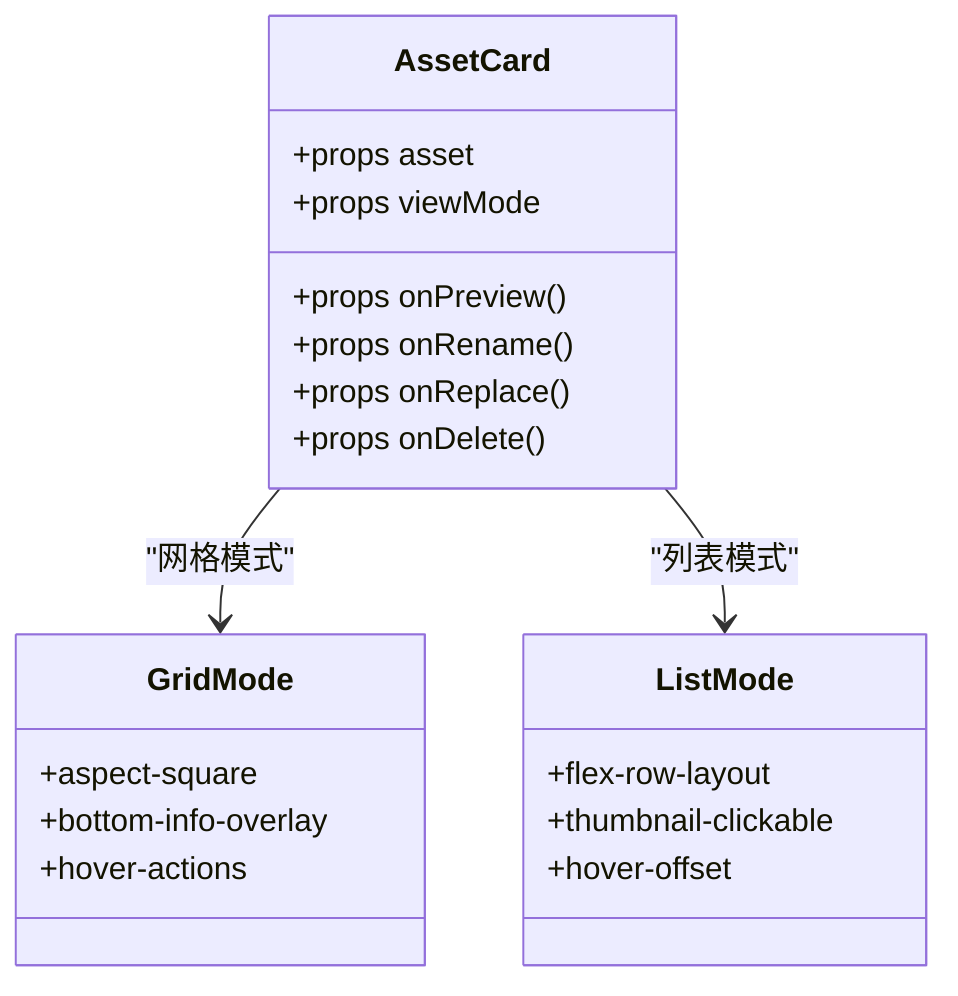

**图表来源**
- [frontend/src/components/resources/AssetCard.tsx:89-216](file://frontend/src/components/resources/AssetCard.tsx#L89-L216)
- [frontend/src/components/resources/AssetCard.tsx:104-168](file://frontend/src/components/resources/AssetCard.tsx#L104-L168)
- [frontend/src/components/resources/AssetCard.tsx:171-214](file://frontend/src/components/resources/AssetCard.tsx#L171-L214)

**章节来源**
- [frontend/src/components/resources/AssetCard.tsx:1-216](file://frontend/src/components/resources/AssetCard.tsx#L1-L216)

### 拖拽上传 UploadZone
**更新** 完全重构的拖拽上传功能，支持拖放区域高亮和文件验证

- **拖拽检测**：实时检测拖拽状态，提供视觉反馈
- **文件验证**：按类型进行大小限制检查（图片 50MB、视频 500MB、音频 100MB）
- **上传队列**：支持多文件上传，显示进度条和状态
- **错误处理**：超限文件以错误提示形式反馈
- **进度跟踪**：通过 resourceApi 的 onProgress 回调更新状态

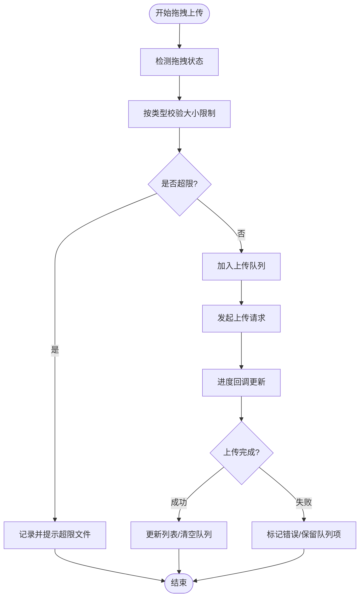

**图表来源**
- [frontend/src/components/resources/UploadZone.tsx:39-62](file://frontend/src/components/resources/UploadZone.tsx#L39-L62)
- [frontend/src/components/resources/UploadZone.tsx:108-125](file://frontend/src/components/resources/UploadZone.tsx#L108-L125)

**章节来源**
- [frontend/src/components/resources/UploadZone.tsx:1-129](file://frontend/src/components/resources/UploadZone.tsx#L1-L129)
- [frontend/src/store/useResourceStore.ts:103-131](file://frontend/src/store/useResourceStore.ts#L103-L131)
- [frontend/src/lib/resourceApi.ts:53-87](file://frontend/src/lib/resourceApi.ts#L53-L87)

### 预览模态框 AssetPreviewDialog
**更新** 增强的全屏预览功能，支持多种媒体类型的专用渲染器

- **媒体类型支持**：根据资源类型渲染图片、视频或音频的全屏预览
- **下载功能**：提供直接下载按钮和文件信息显示
- **动画效果**：使用 Framer Motion 提供流畅的打开/关闭动画
- **键盘导航**：支持 ESC 键关闭和键盘可达性

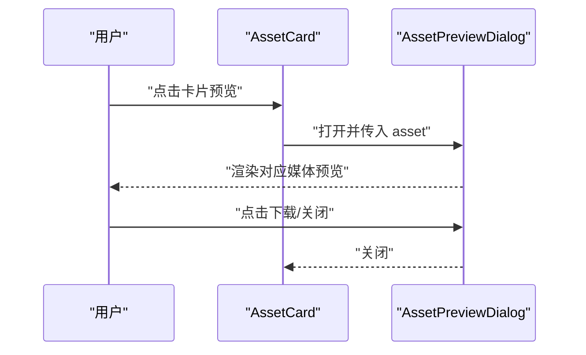

**图表来源**
- [frontend/src/components/resources/AssetCard.tsx:184-187](file://frontend/src/components/resources/AssetCard.tsx#L184-L187)
- [frontend/src/components/resources/AssetPreviewDialog.tsx:64-101](file://frontend/src/components/resources/AssetPreviewDialog.tsx#L64-L101)

**章节来源**
- [frontend/src/components/resources/AssetPreviewDialog.tsx:1-102](file://frontend/src/components/resources/AssetPreviewDialog.tsx#L1-L102)

### 编辑与删除对话框
**更新** 增强的对话框交互，提供更好的用户反馈和状态管理

- **AssetEditDialog**：支持重命名与替换文件两种模式，提供表单验证
- **AssetDeleteDialog**：确认删除并执行硬删除，展示目标资源名称
- **状态管理**：集成加载状态和错误处理
- **表单验证**：确保用户输入的有效性和完整性

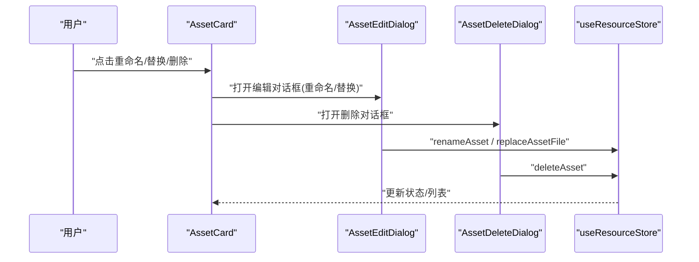

**图表来源**
- [frontend/src/components/resources/AssetCard.tsx:185-187](file://frontend/src/components/resources/AssetCard.tsx#L185-L187)
- [frontend/src/components/resources/AssetEditDialog.tsx:28-41](file://frontend/src/components/resources/AssetEditDialog.tsx#L28-L41)
- [frontend/src/components/resources/AssetDeleteDialog.tsx:20-32](file://frontend/src/components/resources/AssetDeleteDialog.tsx#L20-L32)

**章节来源**
- [frontend/src/components/resources/AssetEditDialog.tsx:1-98](file://frontend/src/components/resources/AssetEditDialog.tsx#L1-L98)
- [frontend/src/components/resources/AssetDeleteDialog.tsx:1-72](file://frontend/src/components/resources/AssetDeleteDialog.tsx#L1-L72)
- [frontend/src/store/useResourceStore.ts:137-157](file://frontend/src/store/useResourceStore.ts#L137-L157)

### 资源状态与 API 封装
**更新** 增强的状态管理，支持搜索过滤和上传队列管理

- **useResourceStore**：管理 assets、total、page、pageSize、typeFilter、isLoading、hasMore、uploadQueue
- **搜索过滤**：支持按资源名称和类型进行组合过滤
- **上传队列**：提供完整的上传状态管理和进度跟踪
- **资源同步**：支持从外部上传同步新资源到 store

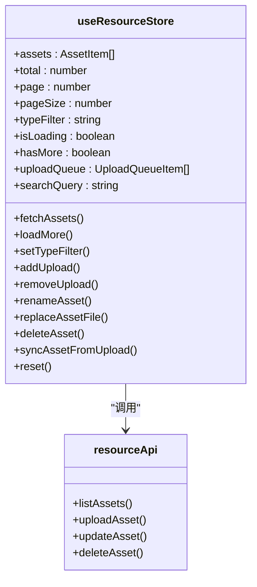

**图表来源**
- [frontend/src/store/useResourceStore.ts:18-43](file://frontend/src/store/useResourceStore.ts#L18-L43)
- [frontend/src/lib/resourceApi.ts:40-108](file://frontend/src/lib/resourceApi.ts#L40-L108)

**章节来源**
- [frontend/src/store/useResourceStore.ts:1-182](file://frontend/src/store/useResourceStore.ts#L1-L182)
- [frontend/src/lib/resourceApi.ts:1-109](file://frontend/src/lib/resourceApi.ts#L1-L109)

### 主题切换系统
**更新** 完整的主题切换功能，支持明暗主题自动切换和持久化

- **主题上下文**：提供主题状态管理和切换功能
- **自动检测**：基于系统偏好和用户选择自动切换主题
- **持久化存储**：使用 localStorage 保存用户主题偏好
- **CSS 类管理**：动态管理 HTML 元素的 CSS 类名
- **Ant Design 集成**：支持 Ant Design 组件的主题适配

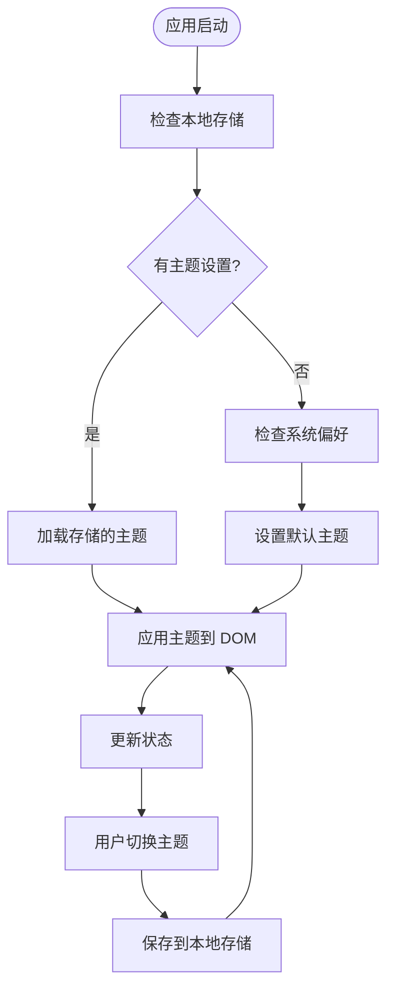

**图表来源**
- [frontend/src/context/ThemeContext.tsx:20-41](file://frontend/src/context/ThemeContext.tsx#L20-L41)

**章节来源**
- [frontend/src/context/ThemeContext.tsx:1-75](file://frontend/src/context/ThemeContext.tsx#L1-L75)

### 认证管理系统
**更新** 增强的认证上下文，提供完整的用户状态管理和令牌刷新

- **用户状态**：管理用户登录状态和用户信息
- **令牌刷新**：实现自动令牌刷新机制，避免频繁重新登录
- **请求拦截**：创建带认证的 fetch 包装器，自动处理 401 错误
- **路由保护**：保护受限制的路由，自动重定向到登录页面
- **会话管理**：使用 localStorage 管理会话状态

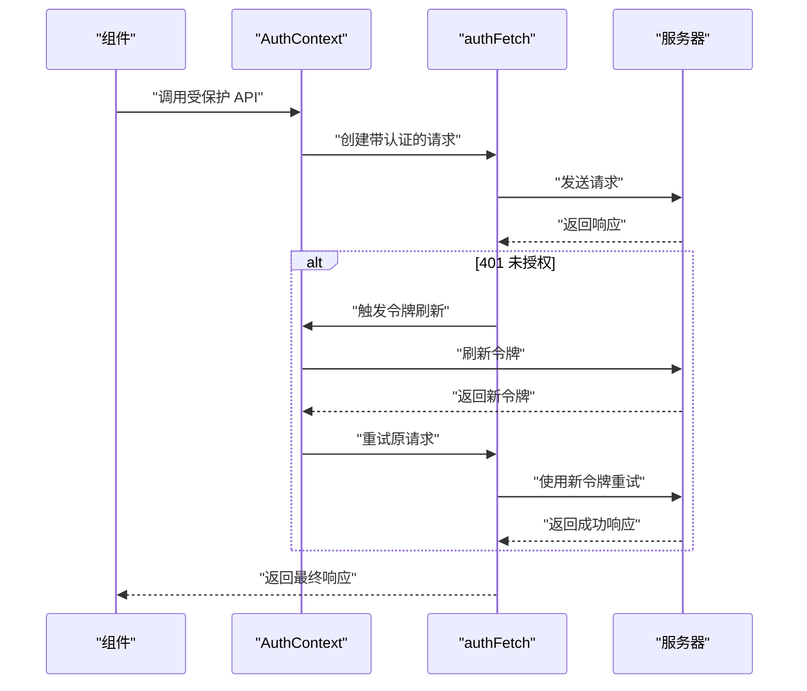

**图表来源**
- [frontend/src/context/AuthContext.tsx:52-114](file://frontend/src/context/AuthContext.tsx#L52-L114)

**章节来源**
- [frontend/src/context/AuthContext.tsx:1-207](file://frontend/src/context/AuthContext.tsx#L1-L207)

### 后端路由与存储策略
**更新** 后端路由保持稳定，继续提供安全可靠的文件存储与资源管理能力

- **/api/media/upload**：校验扩展名与大小限制，保存文件到本地目录，创建数据库记录
- **/api/media/assets**：按用户与类型筛选分页列出资源
- **/api/media/assets/{id}**：PUT 更新（重命名/替换文件），DELETE 硬删除
- **/api/media/{filename}**：提供媒体文件，支持带扩展名与纯 UUID 回退查找
- **媒体工具**：支持从 URL 保存图片/视频，生成安全文件名（UUID+扩展名）

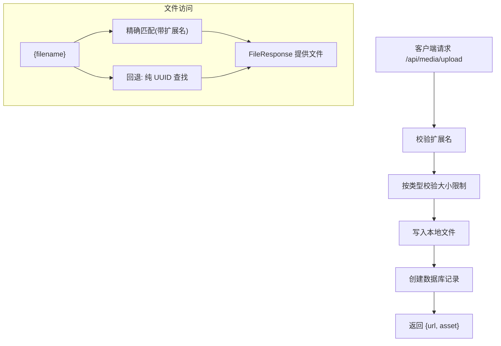

**图表来源**
- [backend/routers/media.py:95-149](file://backend/routers/media.py#L95-L149)
- [backend/routers/media.py:155-184](file://backend/routers/media.py#L155-L184)
- [backend/routers/media.py:187-240](file://backend/routers/media.py#L187-L240)
- [backend/routers/media.py:242-266](file://backend/routers/media.py#L242-L266)
- [backend/routers/media.py:272-299](file://backend/routers/media.py#L272-L299)
- [backend/services/media_utils.py:20-79](file://backend/services/media_utils.py#L20-L79)
- [backend/models.py:131-150](file://backend/models.py#L131-L150)

**章节来源**
- [backend/routers/media.py:1-444](file://backend/routers/media.py#L1-L444)
- [backend/services/media_utils.py:1-79](file://backend/services/media_utils.py#L1-L79)
- [backend/models.py:131-150](file://backend/models.py#L131-L150)

## 依赖关系分析
**更新** 重构后的依赖关系更加清晰，模块间耦合度降低

- **组件解耦**：ResourcesPage 作为容器组件，协调导航栏、上传区域、资源卡片与对话框
- **状态独立**：useResourceStore 与 resourceApi 单向依赖，便于测试与替换
- **上下文分离**：ThemeContext 和 AuthContext 独立管理各自的功能域
- **UI 基础**：Dialog 与 DropdownMenu 作为通用组件被多个对话框复用
- **后端依赖**：路由依赖数据库会话与认证上下文，文件系统依赖 MEDIA_DIR

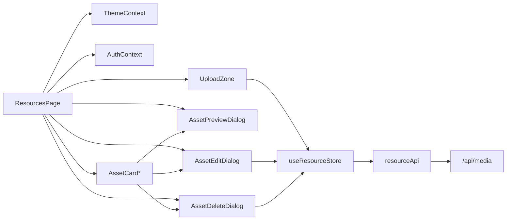

**图表来源**
- [frontend/src/app/resources/page.tsx:63-658](file://frontend/src/app/resources/page.tsx#L63-L658)
- [frontend/src/store/useResourceStore.ts:51-181](file://frontend/src/store/useResourceStore.ts#L51-L181)
- [frontend/src/lib/resourceApi.ts:40-108](file://frontend/src/lib/resourceApi.ts#L40-L108)
- [backend/routers/media.py:30-30](file://backend/routers/media.py#L30-L30)

**章节来源**
- [frontend/src/app/resources/page.tsx:1-658](file://frontend/src/app/resources/page.tsx#L1-L658)
- [frontend/src/store/useResourceStore.ts:1-182](file://frontend/src/store/useResourceStore.ts#L1-L182)
- [frontend/src/lib/resourceApi.ts:1-109](file://frontend/src/lib/resourceApi.ts#L1-L109)
- [backend/routers/media.py:1-444](file://backend/routers/media.py#L1-L444)

## 性能考量
**更新** 重构后的性能优化措施更加完善

- **无限滚动与分页**：使用 IntersectionObserver 触发 loadMore，减少不必要的请求
- **上传进度**：基于 XMLHttpRequest 的进度事件，避免阻塞主线程
- **预览优化**：图片懒加载、视频首帧预览、音频内嵌控件，降低初始渲染压力
- **动画性能**：使用 Framer Motion 提供硬件加速的流畅动画
- **主题切换**：CSS 类切换比样式重计算更高效
- **文件存储**：本地文件系统直存，配合缓存控制头；建议后续引入 CDN 与缩略图生成服务
- **内存管理**：及时清理事件监听器和 IntersectionObserver 实例

## 故障排查指南
**更新** 增强的故障排查指导

- **上传失败**
  - 检查文件类型与大小限制是否满足要求
  - 查看浏览器网络面板与后端日志，确认 HTTP 状态码与错误详情
  - 验证主题切换是否正常工作
- **进度不更新**
  - 确认 onProgress 回调是否正确绑定与触发
  - 检查上传队列状态是否正确更新
- **预览异常**
  - 确认 file_type 与 url 是否正确，浏览器对某些视频格式的支持差异
  - 验证主题切换是否影响了预览样式
- **导航问题**
  - 检查固定导航栏是否正确定位
  - 验证响应式断点是否按预期工作
- **搜索功能异常**
  - 确认搜索查询是否正确传递到过滤逻辑
  - 检查搜索状态管理是否正常
- **删除后仍可见**
  - 确认数据库记录与文件系统文件均已清理
- **跨剧场资源共享**
  - 当前资源属于用户级共享，可在不同剧场引用同一资源链接

**章节来源**
- [frontend/src/components/resources/UploadZone.tsx:96-105](file://frontend/src/components/resources/UploadZone.tsx#L96-L105)
- [frontend/src/lib/resourceApi.ts:73-86](file://frontend/src/lib/resourceApi.ts#L73-L86)
- [frontend/src/app/resources/page.tsx:98-110](file://frontend/src/app/resources/page.tsx#L98-L110)
- [backend/routers/media.py:117-123](file://backend/routers/media.py#L117-L123)
- [backend/routers/media.py:242-266](file://backend/routers/media.py#L242-L266)

## 结论
经过重大重构的资源管理组件通过现代化的界面设计与稳定的前后端协作，实现了媒体资产的高效管理。系统新增的固定导航栏、搜索功能、主题切换、用户菜单和拖拽上传等功能，显著提升了用户体验。前端采用 Framer Motion 提供流畅动画效果，使用 Zustand 管理复杂状态，后端继续提供安全可靠的文件存储与资源管理能力。建议后续引入缩略图生成、CDN 加速与更丰富的搜索过滤能力，以进一步提升用户体验与系统性能。

## 附录

### 使用示例
**更新** 增加新的交互功能示例

- **导航操作**：使用顶部导航栏在不同页面间切换，查看活动状态指示
- **搜索功能**：点击搜索图标展开搜索框，输入关键词实时过滤资源
- **主题切换**：点击太阳/月亮图标在明暗主题间切换，设置会自动保存
- **用户菜单**：点击用户头像打开下拉菜单，访问个人资料和设置
- **拖拽上传**：将文件拖拽到上传区域或点击上传按钮进行文件上传
- **资源管理**：通过下拉菜单进行重命名、替换文件或删除操作
- **视图切换**：使用网格/列表切换按钮在不同视图模式间切换

**章节来源**
- [frontend/src/app/resources/page.tsx:160-173](file://frontend/src/app/resources/page.tsx#L160-L173)
- [frontend/src/app/resources/page.tsx:284-294](file://frontend/src/app/resources/page.tsx#L284-L294)
- [frontend/src/app/resources/page.tsx:308-364](file://frontend/src/app/resources/page.tsx#L308-L364)
- [frontend/src/app/resources/page.tsx:434-440](file://frontend/src/app/resources/page.tsx#L434-L440)
- [frontend/src/app/resources/page.tsx:542-575](file://frontend/src/app/resources/page.tsx#L542-L575)
- [frontend/src/app/resources/page.tsx:597-604](file://frontend/src/app/resources/page.tsx#L597-L604)
- [frontend/src/app/resources/page.tsx:411-431](file://frontend/src/app/resources/page.tsx#L411-L431)

### 文件类型支持与大小限制
**更新** 保持现有文件类型支持，增加新的大小限制

- **支持类型**：图片（jpg、png、webp、gif）、视频（mp4、webm、mov）、音频（mp3、wav）
- **大小限制**：图片 ≤ 50MB、视频 ≤ 500MB、音频 ≤ 100MB
- **拖拽区域**：支持拖放上传，提供视觉反馈和文件验证

**章节来源**
- [frontend/src/components/resources/UploadZone.tsx:15-22](file://frontend/src/components/resources/UploadZone.tsx#L15-L22)
- [frontend/src/components/resources/UploadZone.tsx:16-22](file://frontend/src/components/resources/UploadZone.tsx#L16-L22)
- [backend/routers/media.py:32-38](file://backend/routers/media.py#L32-L38)

### 存储策略
**更新** 后端存储策略保持稳定

- **服务器端**：将文件保存在本地目录，文件名为 UUID+扩展名
- **资源记录**：包含用户 ID、文件名、原始名称、MIME 类型、尺寸与元数据
- **提供访问**：/api/media/{filename} 作为安全访问入口，支持扩展名精确匹配与纯 UUID 回退

**章节来源**
- [backend/routers/media.py:40-46](file://backend/routers/media.py#L40-L46)
- [backend/routers/media.py:272-299](file://backend/routers/media.py#L272-L299)
- [backend/models.py:131-150](file://backend/models.py#L131-L150)

### 跨剧场资源共享
**更新** 资源共享策略保持不变

- **资源共享**：资源属于用户级共享，可在不同剧场节点中引用同一资源链接
- **最佳实践**：建议在节点数据中仅保存资源 ID 与引用信息，避免重复存储

**章节来源**
- [backend/models.py:131-150](file://backend/models.py#L131-L150)