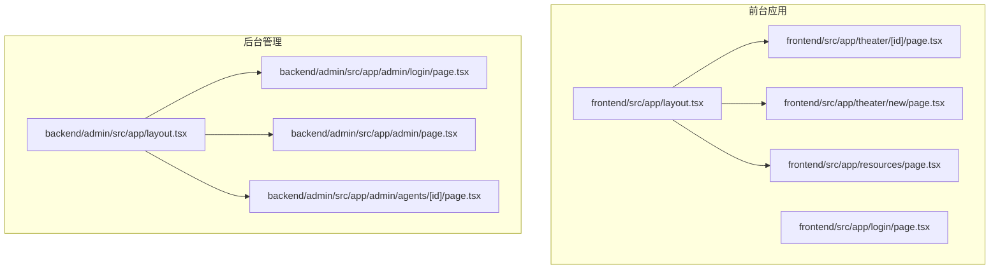
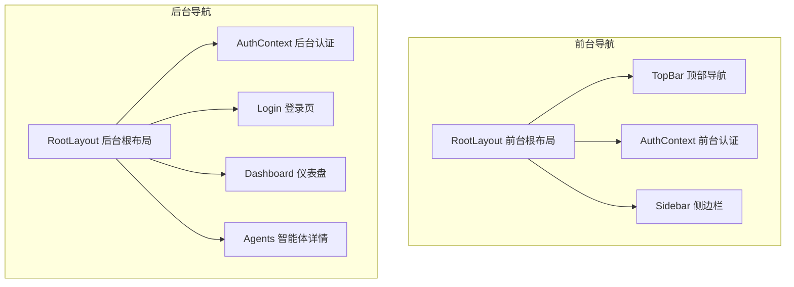
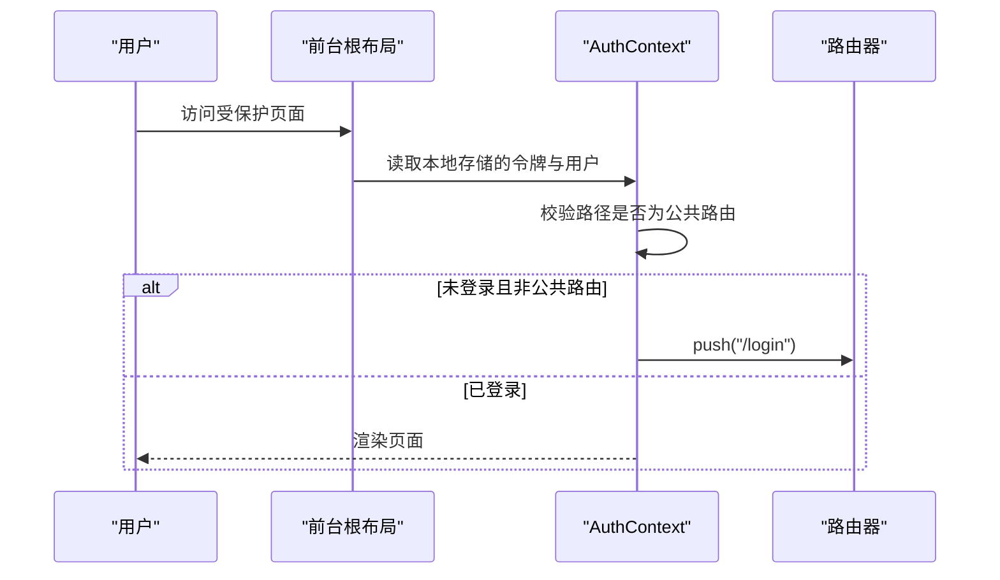
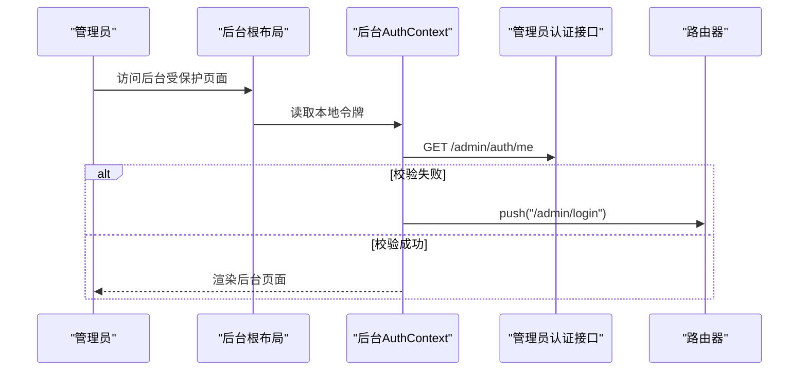
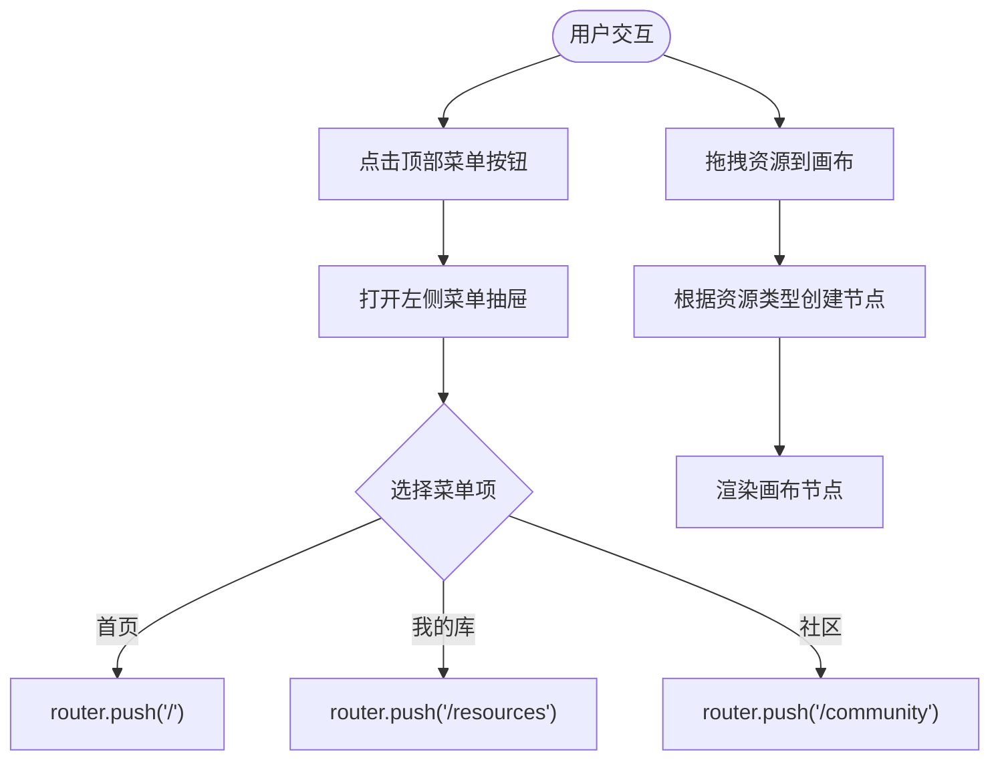
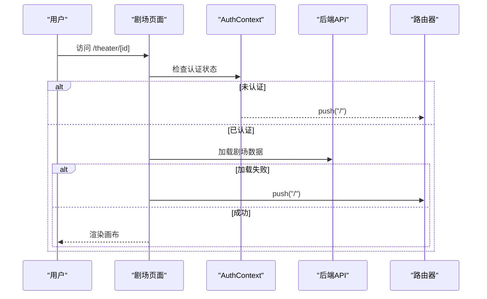
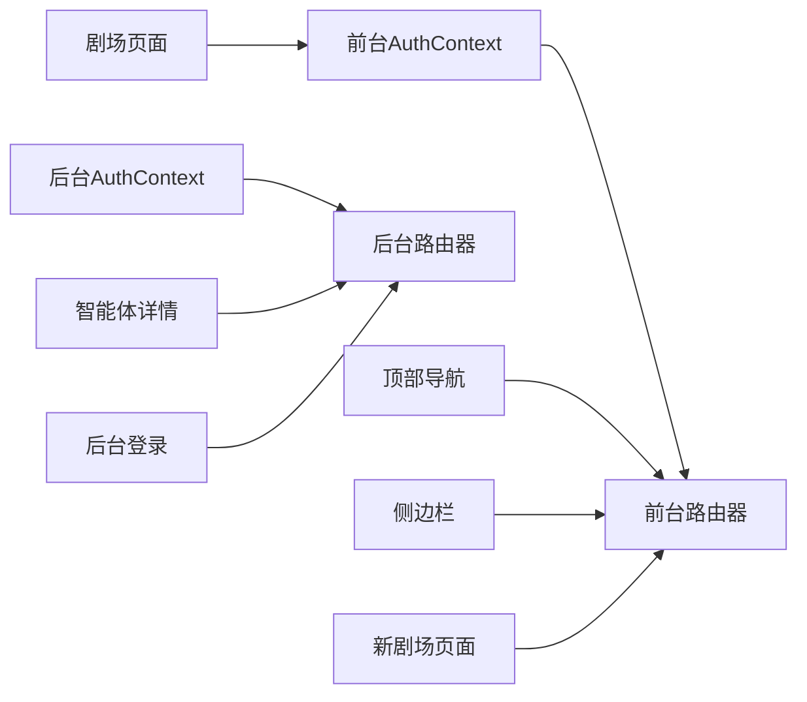

# 路由与导航

<cite>
**本文引用的文件**
- [frontend/src/app/layout.tsx](file://frontend/src/app/layout.tsx)
- [backend/admin/src/app/layout.tsx](file://backend/admin/src/app/layout.tsx)
- [frontend/src/context/AuthContext.tsx](file://frontend/src/context/AuthContext.tsx)
- [backend/admin/src/context/AuthContext.tsx](file://backend/admin/src/context/AuthContext.tsx)
- [frontend/src/components/home/TopBar.tsx](file://frontend/src/components/home/TopBar.tsx)
- [frontend/src/components/canvas/Sidebar.tsx](file://frontend/src/components/canvas/Sidebar.tsx)
- [frontend/src/app/theater/[id]/page.tsx](file://frontend/src/app/theater/[id]/page.tsx)
- [frontend/src/app/theater/new/page.tsx](file://frontend/src/app/theater/new/page.tsx)
- [frontend/src/components/home/RecentTheaters.tsx](file://frontend/src/components/home/RecentTheaters.tsx)
- [backend/admin/src/app/admin/page.tsx](file://backend/admin/src/app/admin/page.tsx)
- [backend/admin/src/app/admin/agents/[id]/page.tsx](file://backend/admin/src/app/admin/agents/[id]/page.tsx)
- [backend/admin/src/app/admin/login/page.tsx](file://backend/admin/src/app/admin/login/page.tsx)
</cite>

## 目录
1. [简介](#简介)
2. [项目结构](#项目结构)
3. [核心组件](#核心组件)
4. [架构总览](#架构总览)
5. [详细组件分析](#详细组件分析)
6. [依赖关系分析](#依赖关系分析)
7. [性能考量](#性能考量)
8. [故障排查指南](#故障排查指南)
9. [结论](#结论)
10. [附录](#附录)

## 简介
本文件面向Infinite Game的前端与后台管理系统的路由与导航体系，基于Next.js App Router的约定式路由与页面组织，系统性梳理以下主题：
- Next.js App Router的路由约定与页面组织结构
- 动态路由参数处理与页面级逻辑
- 路由守卫与权限控制（前台与后台）
- 客户端导航、程序化跳转与路由状态管理
- 面包屑导航、侧边栏菜单与顶部导航的设计模式
- 路由性能优化、预加载策略与错误边界处理
- 导航组件实现与路由配置示例

## 项目结构
Infinite Game采用前后端分离的App Router目录结构：
- 前台应用位于 frontend/src/app，包含登录、剧场画布、资源库等页面
- 后台管理位于 backend/admin/src/app，包含仪表盘、智能体管理、LLM配置、用户与订阅等页面
- 公共布局与上下文分别在各应用根目录下定义，提供全局样式、主题与认证能力

图表来源
- [frontend/src/app/layout.tsx:1-42](file://frontend/src/app/layout.tsx#L1-L42)
- [backend/admin/src/app/layout.tsx:1-25](file://backend/admin/src/app/layout.tsx#L1-L25)
- [frontend/src/app/theater/[id]/page.tsx](file://frontend/src/app/theater/[id]/page.tsx#L1-L800)
- [frontend/src/app/theater/new/page.tsx:1-40](file://frontend/src/app/theater/new/page.tsx#L1-L40)
- [backend/admin/src/app/admin/page.tsx:1-109](file://backend/admin/src/app/admin/page.tsx#L1-L109)
- [backend/admin/src/app/admin/agents/[id]/page.tsx](file://backend/admin/src/app/admin/agents/[id]/page.tsx#L1-L149)
- [backend/admin/src/app/admin/login/page.tsx:1-254](file://backend/admin/src/app/admin/login/page.tsx#L1-L254)

章节来源
- [frontend/src/app/layout.tsx:1-42](file://frontend/src/app/layout.tsx#L1-L42)
- [backend/admin/src/app/layout.tsx:1-25](file://backend/admin/src/app/layout.tsx#L1-L25)

## 核心组件
- 前台根布局与上下文：提供字体、主题注册、认证上下文与全局样式
- 后台根布局与上下文：提供后台专用Provider与认证上下文
- 顶部导航与侧边栏：提供菜单、搜索、主题切换、用户信息与资源库入口
- 剧场画布页面：动态路由参数处理、鉴权守卫、自动保存、拖拽导入与节点连接
- 新剧场页面：程序化创建剧场并跳转至画布
- 后台仪表盘与智能体详情：动态路由参数、表单提交与聊天预览

章节来源
- [frontend/src/context/AuthContext.tsx:1-207](file://frontend/src/context/AuthContext.tsx#L1-L207)
- [backend/admin/src/context/AuthContext.tsx:1-117](file://backend/admin/src/context/AuthContext.tsx#L1-L117)
- [frontend/src/components/home/TopBar.tsx:1-122](file://frontend/src/components/home/TopBar.tsx#L1-L122)
- [frontend/src/components/canvas/Sidebar.tsx:1-341](file://frontend/src/components/canvas/Sidebar.tsx#L1-L341)
- [frontend/src/app/theater/[id]/page.tsx](file://frontend/src/app/theater/[id]/page.tsx#L1-L800)
- [frontend/src/app/theater/new/page.tsx:1-40](file://frontend/src/app/theater/new/page.tsx#L1-L40)
- [backend/admin/src/app/admin/page.tsx:1-109](file://backend/admin/src/app/admin/page.tsx#L1-L109)
- [backend/admin/src/app/admin/agents/[id]/page.tsx](file://backend/admin/src/app/admin/agents/[id]/page.tsx#L1-L149)

## 架构总览
前台与后台通过独立的根布局与上下文隔离，分别承载不同的导航与权限体系。前台采用基于路径的认证守卫，后台采用基于访问令牌的即时校验与保护路由。

图表来源
- [frontend/src/app/layout.tsx:1-42](file://frontend/src/app/layout.tsx#L1-L42)
- [backend/admin/src/app/layout.tsx:1-25](file://backend/admin/src/app/layout.tsx#L1-L25)
- [frontend/src/context/AuthContext.tsx:1-207](file://frontend/src/context/AuthContext.tsx#L1-L207)
- [backend/admin/src/context/AuthContext.tsx:1-117](file://backend/admin/src/context/AuthContext.tsx#L1-L117)
- [frontend/src/components/home/TopBar.tsx:1-122](file://frontend/src/components/home/TopBar.tsx#L1-L122)
- [frontend/src/components/canvas/Sidebar.tsx:1-341](file://frontend/src/components/canvas/Sidebar.tsx#L1-L341)
- [backend/admin/src/app/admin/login/page.tsx:1-254](file://backend/admin/src/app/admin/login/page.tsx#L1-L254)
- [backend/admin/src/app/admin/page.tsx:1-109](file://backend/admin/src/app/admin/page.tsx#L1-L109)
- [backend/admin/src/app/admin/agents/[id]/page.tsx](file://backend/admin/src/app/admin/agents/[id]/page.tsx#L1-L149)

## 详细组件分析

### 前台根布局与上下文
- 根布局负责注入Ant Design的Next.js注册器、字体变量与全局样式
- 认证上下文负责：
  - 初始化与持久化用户会话
  - 在受保护路由访问前进行重定向
  - 提供登录、登出与令牌刷新能力
  - 包装fetch实现统一的401处理与队列重试

图表来源
- [frontend/src/app/layout.tsx:1-42](file://frontend/src/app/layout.tsx#L1-L42)
- [frontend/src/context/AuthContext.tsx:116-140](file://frontend/src/context/AuthContext.tsx#L116-L140)

章节来源
- [frontend/src/app/layout.tsx:1-42](file://frontend/src/app/layout.tsx#L1-L42)
- [frontend/src/context/AuthContext.tsx:116-140](file://frontend/src/context/AuthContext.tsx#L116-L140)

### 后台根布局与上下文
- 后台根布局提供后台专用Provider与全局样式
- 后台认证上下文：
  - 首次挂载时校验访问令牌并调用“获取当前管理员”接口
  - 对受保护路由进行守卫，未通过则重定向至登录页
  - 登录成功后持久化令牌并跳转至后台首页

图表来源
- [backend/admin/src/app/layout.tsx:1-25](file://backend/admin/src/app/layout.tsx#L1-L25)
- [backend/admin/src/context/AuthContext.tsx:37-83](file://backend/admin/src/context/AuthContext.tsx#L37-L83)
- [backend/admin/src/app/admin/login/page.tsx:76-118](file://backend/admin/src/app/admin/login/page.tsx#L76-L118)

章节来源
- [backend/admin/src/app/layout.tsx:1-25](file://backend/admin/src/app/layout.tsx#L1-L25)
- [backend/admin/src/context/AuthContext.tsx:37-83](file://backend/admin/src/context/AuthContext.tsx#L37-L83)

### 顶部导航与侧边栏设计模式
- 顶部导航提供菜单抽屉、搜索、主题切换与用户信息下拉菜单
- 侧边栏提供节点库与资源库面板，支持标签页切换与拖拽导入
- 两者均通过客户端路由进行程序化跳转，提升交互效率

图表来源
- [frontend/src/components/home/TopBar.tsx:96-118](file://frontend/src/components/home/TopBar.tsx#L96-L118)
- [frontend/src/components/canvas/Sidebar.tsx:113-118](file://frontend/src/components/canvas/Sidebar.tsx#L113-L118)

章节来源
- [frontend/src/components/home/TopBar.tsx:1-122](file://frontend/src/components/home/TopBar.tsx#L1-L122)
- [frontend/src/components/canvas/Sidebar.tsx:1-341](file://frontend/src/components/canvas/Sidebar.tsx#L1-L341)

### 动态路由参数处理与鉴权守卫
- 剧场画布页面通过动态路由参数[id]获取剧场ID，并在认证完成后加载剧场数据；若加载失败则回退至首页
- 新剧场页面在认证就绪后创建剧场并使用replace跳转至对应画布，避免历史栈污染

图表来源
- [frontend/src/app/theater/[id]/page.tsx](file://frontend/src/app/theater/[id]/page.tsx#L135-L143)
- [frontend/src/context/AuthContext.tsx:135-140](file://frontend/src/context/AuthContext.tsx#L135-L140)

章节来源
- [frontend/src/app/theater/[id]/page.tsx](file://frontend/src/app/theater/[id]/page.tsx#L135-L143)
- [frontend/src/app/theater/new/page.tsx:14-29](file://frontend/src/app/theater/new/page.tsx#L14-L29)

### 程序化路由跳转与路由状态管理
- 顶部导航与侧边栏通过useRouter进行push/replace跳转
- 剧场页面在创建新剧场时使用replace避免历史栈冗余
- 后台智能体详情页在新建成功后使用router.replace更新URL并保持历史栈一致性

章节来源
- [frontend/src/components/home/TopBar.tsx:107-113](file://frontend/src/components/home/TopBar.tsx#L107-L113)
- [frontend/src/components/canvas/Sidebar.tsx:326-334](file://frontend/src/components/canvas/Sidebar.tsx#L326-L334)
- [frontend/src/app/theater/new/page.tsx:20-23](file://frontend/src/app/theater/new/page.tsx#L20-L23)
- [backend/admin/src/app/admin/agents/[id]/page.tsx](file://backend/admin/src/app/admin/agents/[id]/page.tsx#L36-L40)

### 面包屑导航、侧边栏菜单与顶部导航
- 面包屑：当前实现以顶部导航与侧边栏为主，未见显式面包屑组件
- 侧边栏菜单：节点库与资源库双面板，支持标签页切换与资源懒加载
- 顶部导航：菜单抽屉、搜索、主题切换、用户信息下拉

章节来源
- [frontend/src/components/home/TopBar.tsx:36-120](file://frontend/src/components/home/TopBar.tsx#L36-L120)
- [frontend/src/components/canvas/Sidebar.tsx:59-341](file://frontend/src/components/canvas/Sidebar.tsx#L59-L341)

### 后台仪表盘与智能体详情
- 仪表盘页面使用SWR加载统计数据并渲染图表
- 智能体详情页面支持新建与编辑两种模式，动态路由参数[id]用于区分
- 登录页提供表单校验与错误提示，登录成功后持久化令牌并跳转

章节来源
- [backend/admin/src/app/admin/page.tsx:12-108](file://backend/admin/src/app/admin/page.tsx#L12-L108)
- [backend/admin/src/app/admin/agents/[id]/page.tsx](file://backend/admin/src/app/admin/agents/[id]/page.tsx#L19-L117)
- [backend/admin/src/app/admin/login/page.tsx:76-118](file://backend/admin/src/app/admin/login/page.tsx#L76-L118)

## 依赖关系分析
- 前台与后台共享Next.js App Router的约定式路由，但各自拥有独立的根布局与认证上下文
- 前台通过AuthContext守卫受保护路由；后台通过后台AuthContext在挂载时校验并保护路由
- 顶部导航与侧边栏依赖useRouter进行程序化跳转，减少服务端渲染负担

图表来源
- [frontend/src/context/AuthContext.tsx:135-140](file://frontend/src/context/AuthContext.tsx#L135-L140)
- [backend/admin/src/context/AuthContext.tsx:77-83](file://backend/admin/src/context/AuthContext.tsx#L77-L83)
- [frontend/src/components/home/TopBar.tsx:107-113](file://frontend/src/components/home/TopBar.tsx#L107-L113)
- [frontend/src/components/canvas/Sidebar.tsx:326-334](file://frontend/src/components/canvas/Sidebar.tsx#L326-L334)
- [frontend/src/app/theater/[id]/page.tsx](file://frontend/src/app/theater/[id]/page.tsx#L135-L143)
- [frontend/src/app/theater/new/page.tsx:20-23](file://frontend/src/app/theater/new/page.tsx#L20-L23)
- [backend/admin/src/app/admin/agents/[id]/page.tsx](file://backend/admin/src/app/admin/agents/[id]/page.tsx#L36-L40)
- [backend/admin/src/app/admin/login/page.tsx:94-95](file://backend/admin/src/app/admin/login/page.tsx#L94-L95)

章节来源
- [frontend/src/context/AuthContext.tsx:135-140](file://frontend/src/context/AuthContext.tsx#L135-L140)
- [backend/admin/src/context/AuthContext.tsx:77-83](file://backend/admin/src/context/AuthContext.tsx#L77-L83)

## 性能考量
- 路由守卫与鉴权：
  - 前台在挂载时检查本地存储并进行一次性重定向，避免重复跳转
  - 后台在挂载时仅进行一次令牌校验，校验失败立即重定向
- 客户端导航：
  - 使用useRouter进行push/replace，减少全页刷新
  - 侧边栏资源库按需懒加载，避免初始渲染压力
- 自动保存与防抖：
  - 剧场画布在数据变更后进行2秒防抖保存，降低后端压力
- 拖拽与导入：
  - 文件拖拽导入采用串行上传，避免并发写入冲突
  - 支持批量限制与类型分组，提升稳定性

章节来源
- [frontend/src/context/AuthContext.tsx:135-140](file://frontend/src/context/AuthContext.tsx#L135-L140)
- [backend/admin/src/context/AuthContext.tsx:47-75](file://backend/admin/src/context/AuthContext.tsx#L47-L75)
- [frontend/src/app/theater/[id]/page.tsx](file://frontend/src/app/theater/[id]/page.tsx#L124-L133)
- [frontend/src/components/canvas/Sidebar.tsx:67-70](file://frontend/src/components/canvas/Sidebar.tsx#L67-L70)

## 故障排查指南
- 登录失败与错误提示：
  - 后台登录页根据HTTP状态码与响应内容输出具体错误信息
  - 前台认证上下文对401响应进行统一处理与队列重试
- 受保护路由访问：
  - 前台未登录访问受保护路由将被重定向至登录页
  - 后台未登录访问后台路由将被重定向至后台登录页
- 剧场加载失败：
  - 剧场页面在加载失败时回退至首页，避免白屏

章节来源
- [backend/admin/src/app/admin/login/page.tsx:96-118](file://backend/admin/src/app/admin/login/page.tsx#L96-L118)
- [frontend/src/context/AuthContext.tsx:51-114](file://frontend/src/context/AuthContext.tsx#L51-L114)
- [frontend/src/app/theater/[id]/page.tsx](file://frontend/src/app/theater/[id]/page.tsx#L140-L143)

## 结论
Infinite Game的路由与导航体系遵循Next.js App Router约定，前台与后台分别构建独立的认证与导航上下文，结合客户端导航与动态路由参数，实现了高效、可维护的用户体验。通过守卫机制、程序化跳转与性能优化策略，系统在易用性与稳定性之间取得良好平衡。

## 附录
- 路由配置示例（概念性说明）：
  - 前台动态路由：/theater/[id]、/theater/new
  - 后台动态路由：/admin/agents/[id]、/admin/login
  - 公共路由：/login、/admin/login
- 导航组件清单：
  - 顶部导航：TopBar
  - 侧边栏：Sidebar
  - 剧场页面：/theater/[id]
  - 新剧场页面：/theater/new
  - 后台仪表盘：/admin
  - 后台智能体详情：/admin/agents/[id]