# 剧院系统概览

<cite>
**本文档引用的文件**
- [README.md](file://README.md)
- [main.py](file://backend/main.py)
- [models.py](file://backend/models.py)
- [theaters.py](file://backend/routers/theaters.py)
- [theater.py](file://backend/services/theater.py)
- [agents.py](file://backend/agents.py)
- [page.tsx](file://frontend/src/app/theater/[id]/page.tsx)
- [useCanvasStore.ts](file://frontend/src/store/useCanvasStore.ts)
- [theaterApi.ts](file://frontend/src/lib/theaterApi.ts)
- [ScriptNode.tsx](file://frontend/src/components/canvas/ScriptNode.tsx)
- [CharacterNode.tsx](file://frontend/src/components/canvas/CharacterNode.tsx)
- [StoryboardNode.tsx](file://frontend/src/components/canvas/StoryboardNode.tsx)
- [VideoNode.tsx](file://frontend/src/components/canvas/VideoNode.tsx)
- [useSocket.ts](file://frontend/src/hooks/useSocket.ts)
- [useCanvasStore.test.ts](file://frontend/src/store/__tests__/useCanvasStore.test.ts)
- [useTheaterLoading.ts](file://frontend/src/app/theater/[id]/hooks/useTheaterLoading.ts)
- [TheaterCanvas.tsx](file://frontend/src/components/TheaterCanvas.tsx)
- [useCanvasDragDrop.ts](file://frontend/src/app/theater/[id]/hooks/useCanvasDragDrop.ts)
- [useQuickAddMenu.ts](file://frontend/src/app/theater/[id]/hooks/useQuickAddMenu.ts)
- [AIAssistantPanel.tsx](file://frontend/src/components/canvas/AIAssistantPanel.tsx)
- [useAIAssistantStore.ts](file://frontend/src/store/useAIAssistantStore.ts)
- [chats.py](file://backend/routers/chats.py)
- [canvas_tools.py](file://backend/services/canvas_tools.py)
- [2733ee5c4fd0_add_theater_id_to_chat_sessions.py](file://backend/migrations/versions/2733ee5c4fd0_add_theater_id_to_chat_sessions.py)
- [m9n0o1p2q3r4_add_theater_system.py](file://backend/migrations/versions/m9n0o1p2q3r4_add_theater_system.py)
</cite>

## 更新摘要
**所做更改**
- 新增剧院系统数据库架构，包括剧院、剧院节点和剧院边表
- 新增剧院ID到聊天会话的数据库迁移，支持多画布聊天会话管理
- 增强AI助手面板的剧院切换功能，实现多智能体协作和画布集成
- 完善画布工具系统，支持智能体直接操作剧院节点
- 新增剧院API路由和相关服务，支持完整的剧院生命周期管理

## 目录
1. [简介](#简介)
2. [项目结构](#项目结构)
3. [核心组件](#核心组件)
4. [架构概览](#架构概览)
5. [详细组件分析](#详细组件分析)
6. [依赖关系分析](#依赖关系分析)
7. [性能考虑](#性能考虑)
8. [故障排除指南](#故障排除指南)
9. [结论](#结论)

## 简介

无限剧情剧场系统是一个基于多智能体框架、现代前端技术和AI驱动的沉浸式剧场创作平台。该系统允许用户创建、编辑和分享动态的剧情体验，集成了多种AI生成能力，包括文本、图片和视频内容的生成。

### 核心特性

- **动态剧情生成**：基于AgentScope多智能体协作，实现剧情的无限延伸与逻辑自洽
- **多模态内容生成**：集成多种AI模型进行图片、音频和视频生成
- **实时交互体验**：通过WebSocket实现实时的剧情推送与玩家互动
- **可视化编辑器**：基于React Flow的图形化剧场编辑界面
- **智能体编排**：支持复杂的多智能体协作和任务调度
- **画布存储架构**：支持本地持久化和云端同步的混合存储方案
- **实时协作功能**：提供多用户同时编辑和实时同步能力
- **节点类型权限管理**：支持智能体对特定节点类型的控制权限
- **画布事件通知**：提供完整的画布操作事件通知机制
- **剧院系统**：支持多画布管理和智能体协作的剧院架构
- **聊天会话关联**：每个剧院可关联多个聊天会话，支持多智能体对话

## 项目结构

系统采用前后端分离的架构设计，主要分为三个核心部分：

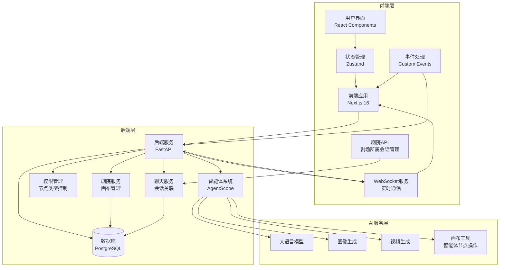

**图表来源**
- [main.py:110-148](file://backend/main.py#L110-L148)
- [models.py:75-126](file://backend/models.py#L75-L126)
- [useSocket.ts:1-43](file://frontend/src/hooks/useSocket.ts#L1-L43)
- [models.py:240-242](file://backend/models.py#L240-L242)

**章节来源**
- [README.md:1-139](file://README.md#L1-L139)

## 核心组件

### 后端核心组件

#### FastAPI 应用程序
后端使用FastAPI构建，提供了完整的REST API接口和WebSocket支持：

- **路由管理**：统一的路由注册机制，支持多个模块化路由
- **数据库连接**：异步SQLAlchemy连接池管理
- **中间件系统**：CORS支持和认证中间件
- **生命周期管理**：应用启动时的数据库迁移和配置初始化
- **WebSocket支持**：实时通信服务，支持用户间消息传递

#### 智能体系统
基于AgentScope框架构建的多智能体协作系统：

- **叙事引擎**：负责剧情的生成和管理
- **对话智能体**：处理用户交互和对话生成
- **工具管理**：支持各种AI工具和服务的集成
- **节点类型权限**：支持target_node_types权限控制
- **画布工具集成**：支持智能体直接操作剧院节点

#### 数据模型
使用SQLAlchemy定义的完整数据模型：

- **剧场模型**：存储用户创建的剧场信息，支持画布视口和设置
- **剧院节点模型**：支持多种类型的节点（文本、图片、视频等），支持智能体创建
- **剧院边模型**：连接不同节点的关系定义，支持动画和样式
- **聊天会话模型**：新增theater_id字段，支持剧院关联
- **智能体模型**：包含target_node_types权限字段

**章节来源**
- [main.py:1-170](file://backend/main.py#L1-170)
- [agents.py:1-376](file://backend/agents.py#L1-L376)
- [models.py:1-408](file://backend/models.py#L1-L408)

### 前端核心组件

#### React Flow 编辑器
基于React Flow构建的可视化编辑器：

- **节点系统**：支持四种不同类型的节点
- **连接管理**：智能的节点连接和断开机制
- **状态同步**：与后端的实时数据同步
- **事件处理**：支持自定义画布事件

#### 状态管理
使用Zustand实现的状态管理：

- **历史记录**：支持撤销和重做功能
- **本地存储**：持久化的用户偏好设置
- **数据同步**：与后端API的双向数据同步
- **自动保存**：防抖机制和离线重试队列
- **去重机制**：防止重复节点存储
- **剧院会话管理**：支持多剧院的会话缓存

#### WebSocket 客户端
实时通信客户端：

- **连接管理**：自动重连和错误处理
- **消息处理**：实时消息接收和显示
- **状态同步**：与其他用户的编辑状态同步

#### AI助手面板
增强的AI助手面板功能：

- **剧院切换**：支持在不同剧院间切换会话
- **多智能体支持**：支持智能体切换和会话管理
- **会话缓存**：缓存每个剧院的会话状态
- **画布集成**：与画布编辑器深度集成

**章节来源**
- [page.tsx:1-438](file://frontend/src/app/theater/[id]/page.tsx#L1-L438)
- [useCanvasStore.ts:1-421](file://frontend/src/store/useCanvasStore.ts#L1-L421)
- [useSocket.ts:1-43](file://frontend/src/hooks/useSocket.ts#L1-L43)
- [AIAssistantPanel.tsx:1-598](file://frontend/src/components/canvas/AIAssistantPanel.tsx#L1-L598)
- [useAIAssistantStore.ts:1-210](file://frontend/src/store/useAIAssistantStore.ts#L1-L210)

## 架构概览

系统采用分层架构设计，确保各组件间的松耦合和高内聚：

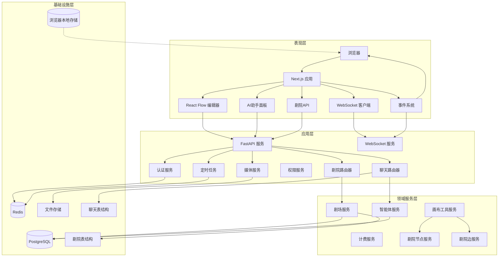

**图表来源**
- [main.py:135-147](file://backend/main.py#L135-L147)
- [theaters.py:1-110](file://backend/routers/theaters.py#L1-L110)
- [useSocket.ts:1-43](file://frontend/src/hooks/useSocket.ts#L1-L43)
- [models.py:240-242](file://backend/models.py#L240-L242)

## 详细组件分析

### 剧场编辑器组件

#### React Flow 编辑器架构

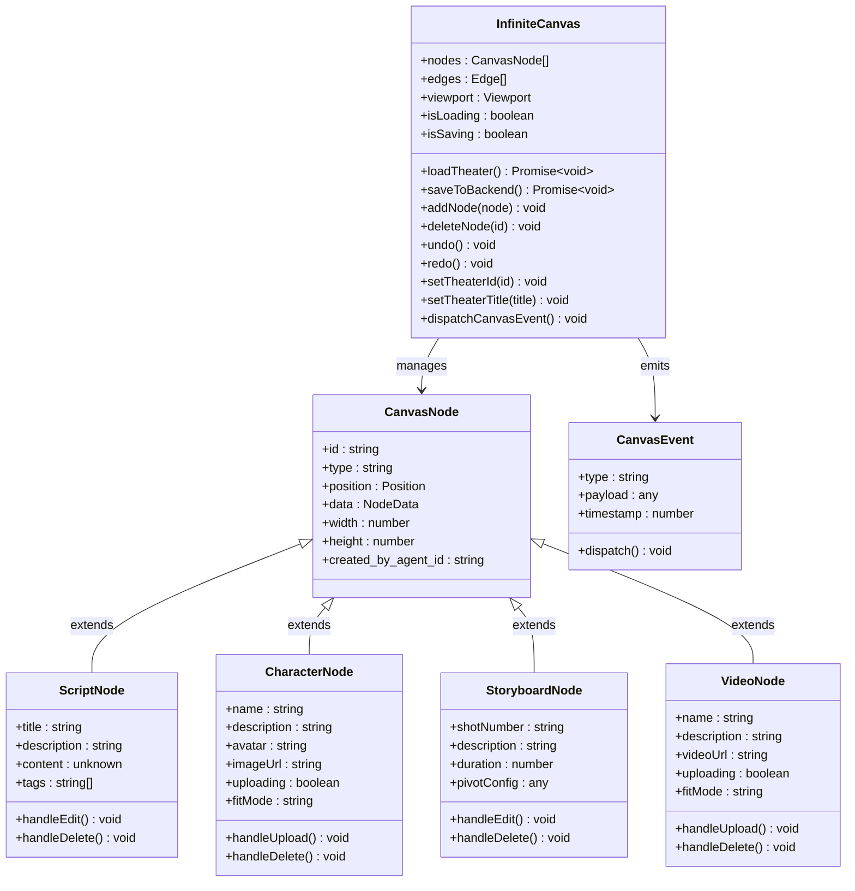

**图表来源**
- [page.tsx:52-429](file://frontend/src/app/theater/[id]/page.tsx#L52-L429)
- [useCanvasStore.ts:61-107](file://frontend/src/store/useCanvasStore.ts#L61-L107)
- [useCanvasStore.ts:283-288](file://frontend/src/store/useCanvasStore.ts#L283-L288)

#### 节点类型系统

系统支持四种不同类型的节点，每种节点都有其特定的功能和用途：

**文本节点 (ScriptNode)**
- 支持富文本编辑和字数统计
- 可以添加标签和关联角色
- 提供AI辅助功能（开发中）

**图片节点 (CharacterNode)**
- 支持图片上传和预览
- 提供两种适配模式（填充/适应）
- 支持图片放大预览功能

**多维表格节点 (StoryboardNode)**
- 基于数据透视表的可视化编辑
- 支持复杂的场景规划和制作流程
- 提供全屏编辑模式

**视频节点 (VideoNode)**
- 支持视频文件上传和播放
- 提供视频适配模式设置
- 支持进度条显示和错误处理

**章节来源**
- [ScriptNode.tsx:1-341](file://frontend/src/components/canvas/ScriptNode.tsx#L1-L341)
- [CharacterNode.tsx:1-660](file://frontend/src/components/canvas/CharacterNode.tsx#L1-L660)
- [StoryboardNode.tsx:1-308](file://frontend/src/components/canvas/StoryboardNode.tsx#L1-L308)
- [VideoNode.tsx:1-524](file://frontend/src/components/canvas/VideoNode.tsx#L1-L524)

### 后端服务架构

#### 剧场服务层

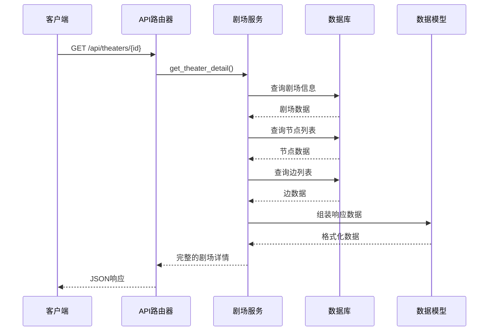

**图表来源**
- [theaters.py:44-57](file://backend/routers/theaters.py#L44-L57)
- [theater.py:46-60](file://backend/services/theater.py#L46-L60)

#### 智能体系统

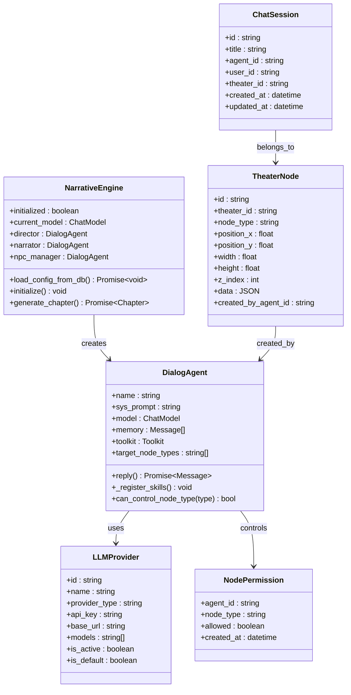

**图表来源**
- [agents.py:164-376](file://backend/agents.py#L164-L376)
- [agents.py:40-162](file://backend/agents.py#L40-L162)
- [models.py:240-242](file://backend/models.py#L240-L242)
- [models.py:93-130](file://backend/models.py#L93-L130)
- [models.py:172-183](file://backend/models.py#L172-L183)

**章节来源**
- [theater.py:1-285](file://backend/services/theater.py#L1-L285)
- [agents.py:1-376](file://backend/agents.py#L1-L376)

### 数据流管理

#### 前端状态管理流程

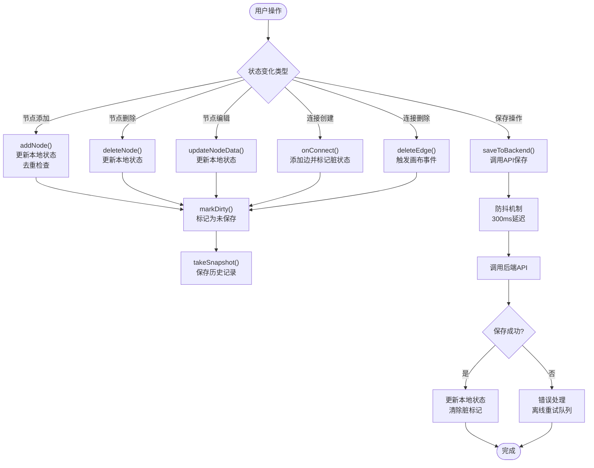

**图表来源**
- [useCanvasStore.ts:226-386](file://frontend/src/store/useCanvasStore.ts#L226-L386)
- [useCanvasStore.test.ts:29-83](file://frontend/src/store/__tests__/useCanvasStore.test.ts#L29-L83)
- [useCanvasStore.ts:283-288](file://frontend/src/store/useCanvasStore.ts#L283-L288)

**章节来源**
- [useCanvasStore.ts:1-421](file://frontend/src/store/useCanvasStore.ts#L1-L421)
- [useCanvasStore.test.ts:1-124](file://frontend/src/store/__tests__/useCanvasStore.test.ts#L1-L124)

### 实时协作功能

#### WebSocket 通信架构

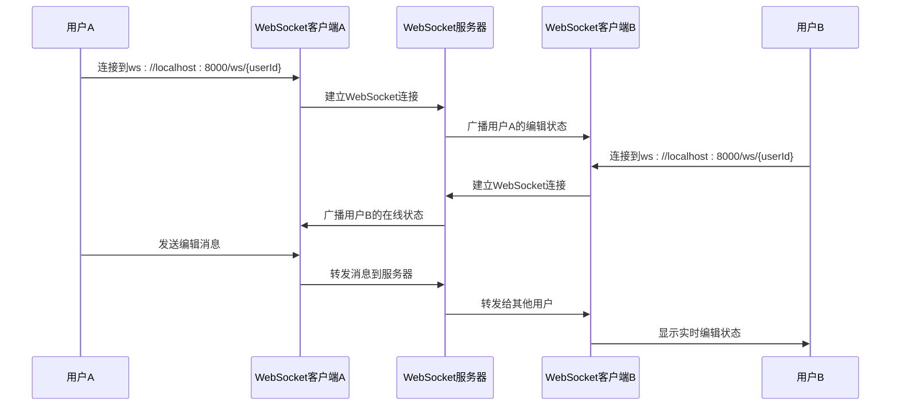

**图表来源**
- [useSocket.ts:8-33](file://frontend/src/hooks/useSocket.ts#L8-L33)
- [main.py:156-166](file://backend/main.py#L156-L166)

**章节来源**
- [useSocket.ts:1-43](file://frontend/src/hooks/useSocket.ts#L1-L43)
- [main.py:156-166](file://backend/main.py#L156-L166)

### 画布事件通知系统

#### 事件处理架构

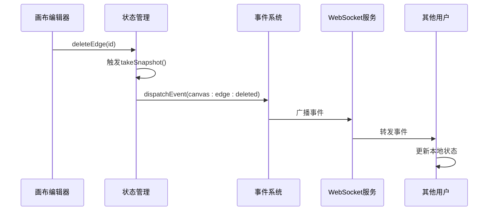

**图表来源**
- [useCanvasStore.ts:283-288](file://frontend/src/store/useCanvasStore.ts#L283-L288)

**章节来源**
- [useCanvasStore.ts:283-288](file://frontend/src/store/useCanvasStore.ts#L283-L288)

### 节点类型权限管理系统

#### 权限控制架构

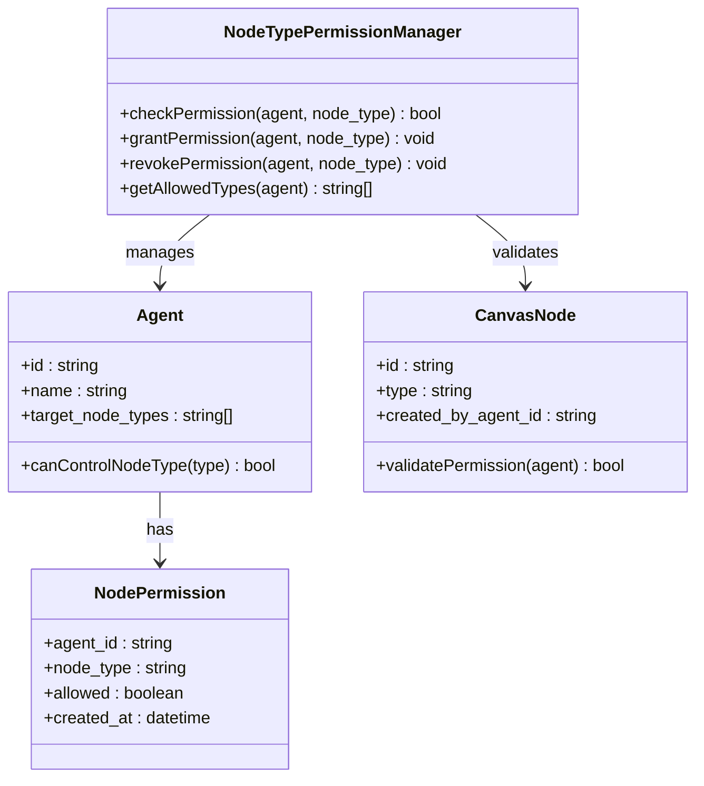

**图表来源**
- [models.py:240-242](file://backend/models.py#L240-L242)
- [agents.py:164-376](file://backend/agents.py#L164-L376)

**章节来源**
- [models.py:240-242](file://backend/models.py#L240-L242)
- [agents.py:164-376](file://backend/agents.py#L164-L376)

### 剧院系统架构

#### 剧院数据库架构

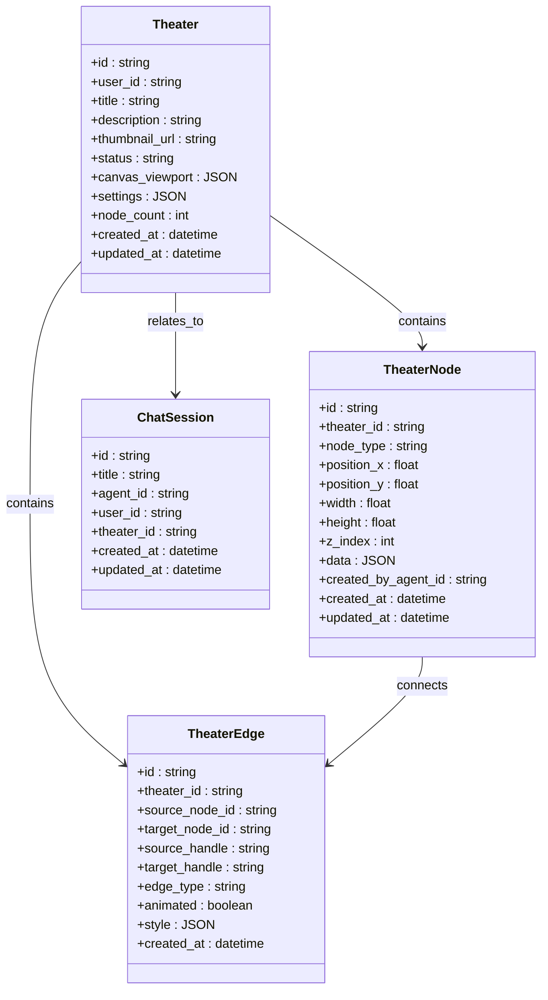

**图表来源**
- [models.py:75-130](file://backend/models.py#L75-L130)
- [models.py:172-183](file://backend/models.py#L172-L183)

**章节来源**
- [models.py:75-130](file://backend/models.py#L75-L130)
- [models.py:172-183](file://backend/models.py#L172-L183)

### AI助手面板剧院集成

#### 多剧院会话管理

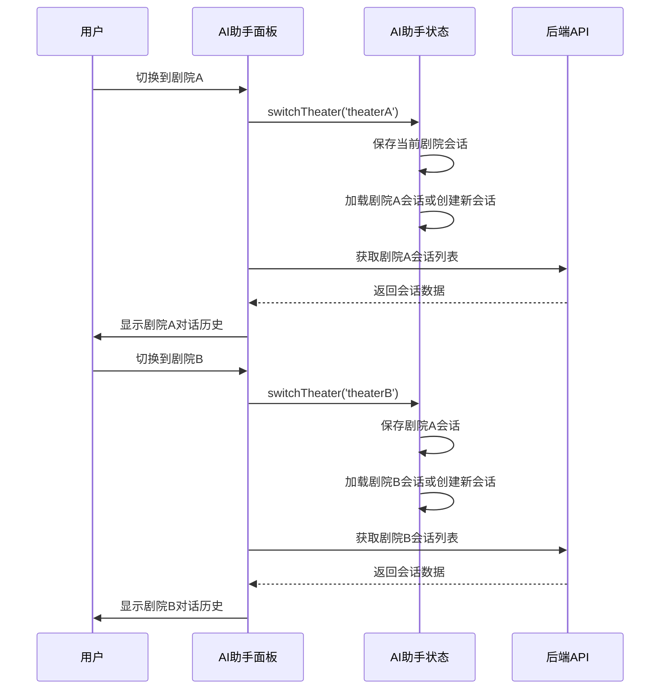

**图表来源**
- [AIAssistantPanel.tsx:87-105](file://frontend/src/components/canvas/AIAssistantPanel.tsx#L87-L105)
- [useAIAssistantStore.ts:110-149](file://frontend/src/store/useAIAssistantStore.ts#L110-L149)

**章节来源**
- [AIAssistantPanel.tsx:87-105](file://frontend/src/components/canvas/AIAssistantPanel.tsx#L87-L105)
- [useAIAssistantStore.ts:110-149](file://frontend/src/store/useAIAssistantStore.ts#L110-L149)

## 依赖关系分析

系统的主要依赖关系如下：

```mermaid
graph LR
subgraph "前端依赖"
React[React 18+]
NextJS[Next.js 16]
Zustand[Zustand]
XYFlow[@xyflow/react]
Lucide[Lucide Icons]
WebSocket[WebSocket API]
LocalStorage[浏览器存储]
CustomEvents[自定义事件]
TheaterAPI[剧院API]
AIAssistant[AI助手面板]
end
subgraph "后端依赖"
FastAPI[FastAPI]
SQLA[SQLAlchemy]
AgentScope[AgentScope]
Uvicorn[Uvicorn]
AsyncPG[asyncpg]
WebSocket[WebSocket支持]
Permissions[权限管理]
TheaterRouter[剧院路由器]
ChatRouter[聊天路由器]
CanvasTools[画布工具]
end
subgraph "AI服务"
OpenAI[OpenAI API]
Gemini[Gemini API]
DashScope[DashScope]
Ollama[Ollama]
end
React --> Zustand
React --> XYFlow
NextJS --> React
Zustand --> XYFlow
FastAPI --> SQLA
FastAPI --> AgentScope
FastAPI --> WebSocket
FastAPI --> Permissions
FastAPI --> TheaterRouter
FastAPI --> ChatRouter
AgentScope --> OpenAI
AgentScope --> Gemini
AgentScope --> DashScope
AgentScope --> Ollama
AgentScope --> CanvasTools
TheaterRouter --> SQLA
ChatRouter --> SQLA
CanvasTools --> TheaterNode
CanvasTools --> TheaterEdge
CustomEvents --> React
Permissions --> SQLA
TheaterAPI --> ChatRouter
AIAssistant --> TheaterAPI
```

**图表来源**
- [package.json](file://frontend/package.json)
- [requirements.txt](file://backend/requirements.txt)

**章节来源**
- [README.md:14-32](file://README.md#L14-L32)

## 性能考虑

### 前端性能优化

1. **虚拟滚动**：对于大量节点的情况，考虑实现虚拟滚动以提高渲染性能
2. **懒加载组件**：将大型组件（如视频编辑器）实现为懒加载组件
3. **状态分割**：将大型状态对象分割为更小的独立状态块
4. **事件防抖**：对频繁触发的事件（如缩放、拖拽）实施防抖机制
5. **本地存储优化**：使用去重机制避免重复节点存储
6. **WebSocket连接池**：复用WebSocket连接减少资源消耗
7. **事件系统优化**：优化自定义事件的处理和传播机制
8. **权限检查缓存**：缓存智能体的节点类型权限检查结果
9. **剧院会话缓存**：优化多剧院会话的缓存和切换性能
10. **AI助手状态持久化**：使用Zustand持久化优化状态管理

### 后端性能优化

1. **数据库连接池**：合理配置连接池大小以平衡性能和资源使用
2. **异步操作**：确保所有I/O密集型操作都使用异步模式
3. **缓存策略**：实现多级缓存（内存缓存、Redis缓存）
4. **批量操作**：对批量数据操作实施批量处理以减少数据库往返
5. **WebSocket广播优化**：使用房间概念限制消息广播范围
6. **权限查询优化**：优化智能体节点类型权限的查询和缓存
7. **事件处理优化**：优化画布事件的处理和广播机制
8. **剧院数据优化**：优化剧院节点和边的查询和缓存策略
9. **聊天会话关联优化**：优化剧院ID关联查询的性能
10. **画布工具执行优化**：优化智能体画布操作的执行效率

### AI服务性能

1. **模型选择**：根据使用场景选择合适的模型大小和类型
2. **并发限制**：实施合理的并发请求限制以避免AI服务过载
3. **结果缓存**：对重复的AI生成请求实施结果缓存
4. **流式处理**：对于长文本生成，实施流式响应以改善用户体验
5. **画布工具批处理**：优化画布工具的批量操作性能

## 故障排除指南

### 常见问题及解决方案

#### 数据库连接问题
- **症状**：应用启动时无法连接数据库
- **原因**：数据库服务未启动或连接参数错误
- **解决**：检查数据库服务状态和连接字符串配置

#### WebSocket 连接问题
- **症状**：实时功能无法正常工作
- **原因**：网络防火墙阻止或服务器配置错误
- **解决**：检查防火墙设置和WebSocket服务器配置

#### 智能体初始化失败
- **症状**：AI功能不可用或报错
- **原因**：AI API密钥配置错误或网络连接问题
- **解决**：验证API密钥配置和网络连通性

#### 前端状态同步问题
- **症状**：编辑器中的更改无法保存或丢失
- **原因**：网络请求失败或状态管理错误
- **解决**：检查网络连接和浏览器控制台错误信息

#### 自动保存失败
- **症状**：编辑内容丢失或保存不生效
- **原因**：防抖机制导致的延迟保存或离线重试失败
- **解决**：检查网络连接状态和浏览器存储权限

#### 节点类型权限问题
- **症状**：智能体无法控制某些节点类型
- **原因**：权限配置错误或权限检查失败
- **解决**：检查智能体的target_node_types配置和权限管理

#### 画布事件通知问题
- **症状**：画布事件无法正确传播
- **原因**：事件处理函数未正确注册或事件格式错误
- **解决**：检查事件监听器的注册和事件数据格式

#### 剧院系统问题
- **症状**：剧院创建或编辑失败
- **原因**：数据库迁移未完成或权限不足
- **解决**：运行数据库迁移并检查用户权限

#### 聊天会话关联问题
- **症状**：聊天会话无法关联到剧院
- **原因**：theater_id字段缺失或外键约束错误
- **解决**：检查数据库迁移和外键约束配置

#### AI助手剧院切换问题
- **症状**：AI助手无法在剧院间切换或会话丢失
- **原因**：状态管理错误或API调用失败
- **解决**：检查AI助手状态管理和API响应

**章节来源**
- [main.py:49-108](file://backend/main.py#L49-L108)
- [useCanvasStore.ts:359-386](file://frontend/src/store/useCanvasStore.ts#L359-L386)
- [useCanvasStore.test.ts:85-104](file://frontend/src/store/__tests__/useCanvasStore.test.ts#L85-L104)
- [models.py:240-242](file://backend/models.py#L240-L242)

## 结论

无限剧情剧场系统是一个功能完整、架构清晰的现代化Web应用。系统成功地将AI技术与可视化编辑器相结合，为用户提供了一个创新的剧场创作平台。

### 主要优势

1. **技术架构先进**：采用最新的前端和后端技术栈
2. **功能丰富**：支持多种媒体类型的创作和编辑
3. **扩展性强**：模块化的架构设计便于功能扩展
4. **用户体验优秀**：直观的可视化编辑界面和流畅的交互体验
5. **实时协作能力**：支持多用户同时编辑和实时同步
6. **数据持久化**：提供本地存储和云端同步的混合方案
7. **权限管理完善**：支持智能体对特定节点类型的精确控制
8. **事件通知机制**：提供完整的画布操作事件通知体系
9. **剧院系统完整**：支持多画布管理和智能体协作的剧院架构
10. **AI助手深度集成**：支持多剧院会话管理和智能体切换

### 新增功能亮点

1. **剧院数据库架构**：完整的剧院、节点和边的数据模型
2. **聊天会话剧院关联**：每个剧院可关联多个聊天会话
3. **AI助手剧院切换**：支持在不同剧院间无缝切换会话
4. **画布工具智能体集成**：智能体可直接操作剧院节点
5. **多剧院会话缓存**：优化多剧院环境下的会话管理
6. **剧院生命周期管理**：完整的剧院创建、编辑、删除功能

### 发展方向

1. **AI能力增强**：持续集成新的AI模型和功能
2. **性能优化**：针对大规模数据和高并发场景进行优化
3. **协作功能**：增强多人协作和实时编辑功能
4. **移动端支持**：开发移动端应用以扩大用户覆盖面
5. **实时同步优化**：改进WebSocket通信和冲突解决机制
6. **离线功能增强**：完善离线编辑和同步恢复机制
7. **权限系统扩展**：进一步细化节点类型的权限控制
8. **事件系统完善**：扩展更多类型的画布事件通知
9. **剧院功能扩展**：支持更多剧院特性和协作模式
10. **AI助手智能化**：提升AI助手在剧院环境中的智能水平

该系统为未来的AI驱动内容创作平台奠定了坚实的基础，具有广阔的发展前景和应用价值。