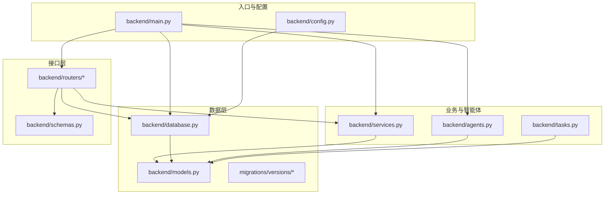
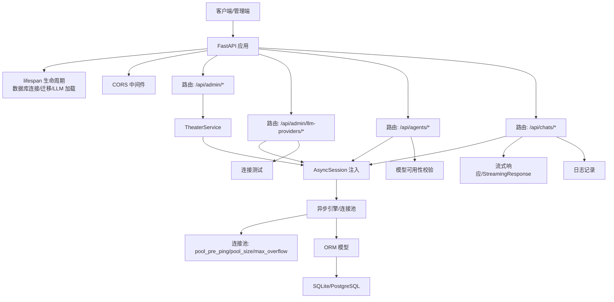
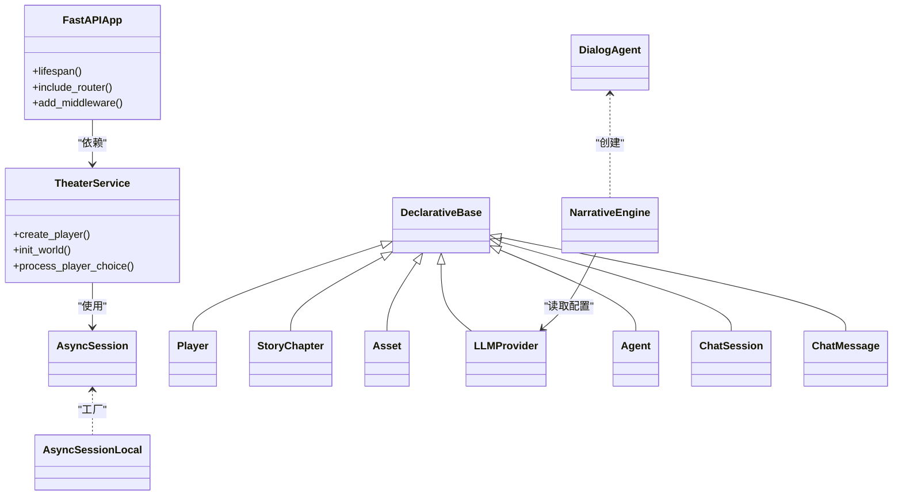
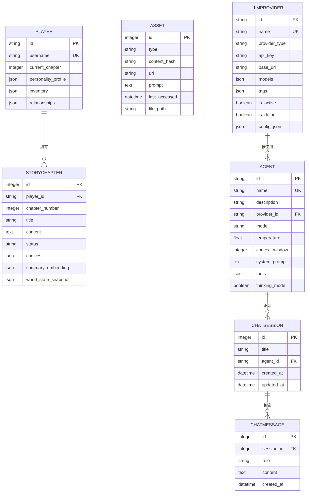
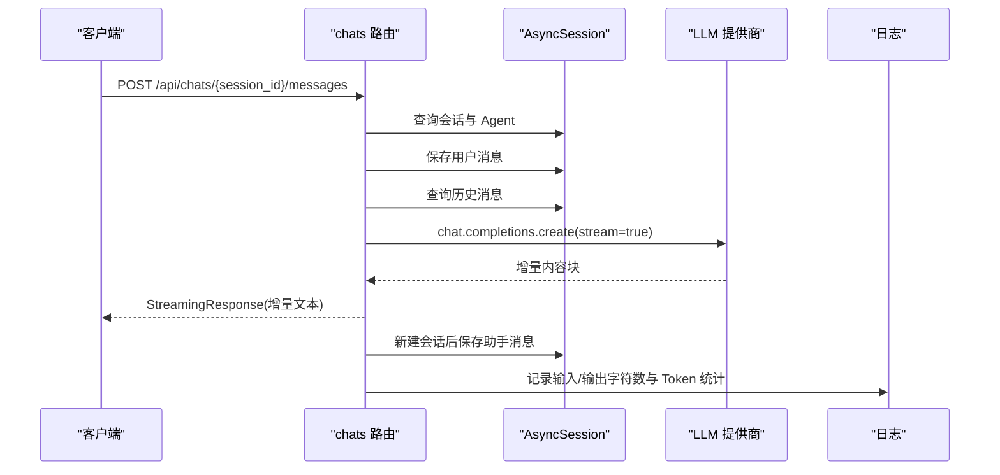
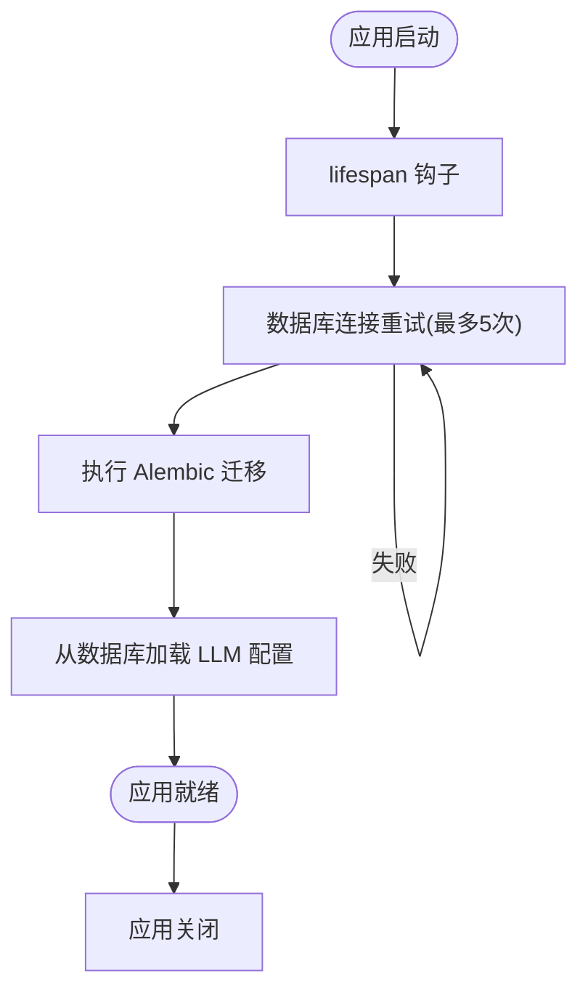

# 后端架构

<cite>
**本文引用的文件**
- [backend/main.py](file://backend/main.py)
- [backend/config.py](file://backend/config.py)
- [backend/database.py](file://backend/database.py)
- [backend/models.py](file://backend/models.py)
- [backend/services.py](file://backend/services.py)
- [backend/schemas.py](file://backend/schemas.py)
- [backend/routers/admin.py](file://backend/routers/admin.py)
- [backend/routers/agents.py](file://backend/routers/agents.py)
- [backend/routers/chats.py](file://backend/routers/chats.py)
- [backend/routers/llm_config.py](file://backend/routers/llm_config.py)
- [backend/tasks.py](file://backend/tasks.py)
- [backend/agents.py](file://backend/agents.py)
- [backend/migrations/versions/14746eaf1c81_initial.py](file://backend/migrations/versions/14746eaf1c81_initial.py)
- [backend/migrations/versions/82e927e1cf80_add_agent_model.py](file://backend/migrations/versions/82e927e1cf80_add_agent_model.py)
- [backend/requirements.txt](file://backend/requirements.txt)
- [docs/wiki/Backend-Guide.md](file://docs/wiki/Backend-Guide.md)
- [docs/wiki/Database-Migration.md](file://docs/wiki/Database-Migration.md)
</cite>

## 目录
1. [简介](#简介)
2. [项目结构](#项目结构)
3. [核心组件](#核心组件)
4. [架构总览](#架构总览)
5. [组件详解](#组件详解)
6. [依赖关系分析](#依赖关系分析)
7. [性能考量](#性能考量)
8. [故障排查指南](#故障排查指南)
9. [结论](#结论)
10. [附录](#附录)

## 简介
本文件系统化梳理无限剧情剧场后端架构，围绕 FastAPI 异步应用、依赖注入与生命周期管理、数据库连接池与 SQLAlchemy ORM 映射、业务服务层设计、路由组织与中间件/CORS、数据库模型与索引策略、错误处理与日志、以及性能监控方案展开。目标是帮助开发者快速理解并高效扩展系统。

## 项目结构
后端采用“路由-服务-模型-配置-迁移”分层组织，配合异步依赖注入与生命周期钩子，形成清晰的职责边界与可维护性。

图表来源
- [backend/main.py](file://backend/main.py#L83-L98)
- [backend/config.py](file://backend/config.py#L1-L34)
- [backend/database.py](file://backend/database.py#L1-L31)
- [backend/models.py](file://backend/models.py#L1-L122)
- [backend/services.py](file://backend/services.py#L1-L66)
- [backend/agents.py](file://backend/agents.py#L1-L196)
- [backend/tasks.py](file://backend/tasks.py#L1-L62)
- [backend/routers/admin.py](file://backend/routers/admin.py#L1-L112)
- [backend/routers/agents.py](file://backend/routers/agents.py#L1-L141)
- [backend/routers/chats.py](file://backend/routers/chats.py#L1-L275)
- [backend/routers/llm_config.py](file://backend/routers/llm_config.py#L1-L203)
- [backend/schemas.py](file://backend/schemas.py#L1-L102)

章节来源
- [docs/wiki/Backend-Guide.md](file://docs/wiki/Backend-Guide.md#L3-L21)

## 核心组件
- FastAPI 应用与生命周期：通过 lifespan 钩子完成数据库连接与 Alembic 迁移，启动时加载 LLM 配置。
- 异步依赖注入：数据库会话通过依赖函数注入，确保每个请求拥有独立的异步会话。
- 数据库层：异步引擎、连接池、异步会话工厂与 DeclarativeBase 基类。
- ORM 模型：玩家、章节、资产、LLM 供应商、聊天会话与消息等。
- 业务服务层：TheaterService 封装玩家创建、世界初始化、选择处理等业务流程。
- 智能体与叙事引擎：基于 AgentScope 的多智能体编排，负责章节生成与 NPC 状态管理。
- 路由与校验：Admin、LLM 配置、Agent、Chats 等路由，配套 Pydantic 模型进行输入校验。
- 后台任务：章节预生成与资源生成的异步任务。

章节来源
- [backend/main.py](file://backend/main.py#L45-L82)
- [backend/database.py](file://backend/database.py#L1-L31)
- [backend/models.py](file://backend/models.py#L1-L122)
- [backend/services.py](file://backend/services.py#L1-L66)
- [backend/agents.py](file://backend/agents.py#L1-L196)
- [backend/routers/admin.py](file://backend/routers/admin.py#L1-L112)
- [backend/routers/llm_config.py](file://backend/routers/llm_config.py#L1-L203)
- [backend/routers/agents.py](file://backend/routers/agents.py#L1-L141)
- [backend/routers/chats.py](file://backend/routers/chats.py#L1-L275)
- [backend/schemas.py](file://backend/schemas.py#L1-L102)
- [backend/tasks.py](file://backend/tasks.py#L1-L62)

## 架构总览
后端以 FastAPI 为核心，采用异步编程模型与依赖注入，结合 SQLAlchemy 异步 ORM 与 Alembic 迁移，实现从路由到业务再到数据层的完整闭环；同时通过 AgentScope 智能体实现故事生成与 NPC 管理。

图表来源
- [backend/main.py](file://backend/main.py#L83-L98)
- [backend/main.py](file://backend/main.py#L14-L28)
- [backend/database.py](file://backend/database.py#L8-L23)
- [backend/routers/chats.py](file://backend/routers/chats.py#L14-L258)
- [backend/routers/llm_config.py](file://backend/routers/llm_config.py#L20-L111)
- [backend/routers/agents.py](file://backend/routers/agents.py#L15-L55)

## 组件详解

### FastAPI 应用与生命周期管理
- 异步事件循环与 Windows 兼容：在 Windows 平台设置事件循环策略，并修正 UTF-8 输出。
- 日志精细化：关闭 SQLAlchemy 与 Uvicorn 访问日志，保留应用日志。
- 生命周期（lifespan）：启动阶段执行数据库连接重试、运行 Alembic 迁移、从数据库加载 LLM 配置；结束阶段释放资源。
- 中间件与 CORS：允许本地开发域名跨域访问。
- 路由注册：统一注册 admin、llm_config、agents、chats 路由。
- 根路径与示例接口：提供根路径与玩家创建示例，演示依赖注入与异常处理。
- WebSocket：占位实现，用于后续剧情推送与交互。

章节来源
- [backend/main.py](file://backend/main.py#L1-L28)
- [backend/main.py](file://backend/main.py#L45-L82)
- [backend/main.py](file://backend/main.py#L83-L98)
- [backend/main.py](file://backend/main.py#L128-L170)

### 依赖注入与异步会话管理
- 异步引擎与连接池：启用 pool_pre_ping、设定 pool_size 与 max_overflow，SQLite 使用线程安全配置。
- 异步会话工厂：AsyncSessionLocal，expire_on_commit=False 降低刷新成本。
- 依赖函数 get_db：每个请求注入独立 AsyncSession，确保事务隔离。
- 另一套会话使用：部分场景（如保存助手消息）使用 AsyncSessionLocal 直接创建临时会话，保证写入一致性。

章节来源
- [backend/database.py](file://backend/database.py#L1-L31)
- [backend/main.py](file://backend/main.py#L28-L30)
- [backend/routers/chats.py](file://backend/routers/chats.py#L237-L254)

### 数据库模型与索引策略
- Player：UUID 主键、用户名唯一索引、当前章节与 JSON 字段存储偏好与关系。
- StoryChapter：整数主键、外键关联玩家、章节号与状态、choices 与摘要向量、世界快照。
- Asset：整数主键、类型与内容哈希索引、URL 与提示词、LRU 访问时间。
- LLMProvider：UUID 主键、名称唯一索引、供应商类型、模型列表、标签、激活/默认标记、额外配置。
- ChatSession/ChatMessage：会话与消息，消息按时间升序查询，外键关联会话。
- Agent：UUID 主键、名称唯一索引、关联 LLMProvider、温度、上下文窗口、系统提示、工具与思考模式。
- 索引策略：主键索引 + 唯一索引 + 常用过滤字段索引（如 players.username、agents.name、assets.content_hash）。

章节来源
- [backend/models.py](file://backend/models.py#L1-L122)

### 业务逻辑层设计：TheaterService
- 职责划分：
  - 玩家创建：持久化 Player，返回带 id 的对象。
  - 世界初始化：通过 NarrativeEngine 生成世界观与前两章内容，持久化到 StoryChapter。
  - 玩家选择处理：预留接口，后续实现状态更新、一致性校验与下一章生成。
- 与数据层交互：通过传入的 AsyncSession 执行增删改查，保证事务一致性。

章节来源
- [backend/services.py](file://backend/services.py#L1-L66)
- [backend/agents.py](file://backend/agents.py#L43-L196)

### 路由组织与中间件/CORS
- 路由分组：
  - /api/admin：统计、玩家与故事管理。
  - /api/admin/llm-providers：LLM 供应商的 CRUD 与连接测试。
  - /api/agents：Agent 的创建、查询、更新、删除。
  - /api/chats：会话创建、列表、详情、消息读取与发送（流式响应）。
- 中间件：CORS 允许本地开发域名访问。
- 校验模型：schemas 定义 Pydantic 模型，统一输入输出格式与约束。

章节来源
- [backend/routers/admin.py](file://backend/routers/admin.py#L1-L112)
- [backend/routers/llm_config.py](file://backend/routers/llm_config.py#L1-L203)
- [backend/routers/agents.py](file://backend/routers/agents.py#L1-L141)
- [backend/routers/chats.py](file://backend/routers/chats.py#L1-L275)
- [backend/schemas.py](file://backend/schemas.py#L1-L102)

### 智能体与叙事引擎（AgentScope 集成）
- DialogAgent：继承 AgentBase，维护记忆，组装 messages，调用模型生成回复。
- NarrativeEngine：
  - 从数据库加载活动 LLMProvider，解析模型列表，初始化 AgentScope 模型实例。
  - 动态创建 Director、Narrator、NPC_Manager 三个智能体。
  - generate_chapter：协调三智能体生成大纲、正文与 NPC 更新。
  - reload_config：在配置变更时重新加载。
- 启动加载：应用启动时尝试从数据库加载配置，若无则回退到环境配置。

章节来源
- [backend/agents.py](file://backend/agents.py#L1-L196)
- [backend/main.py](file://backend/main.py#L75-L80)

### 聊天流式响应与日志
- 流式生成：根据供应商类型（OpenAI/Azure、DashScope 等）调用对应 SDK，逐块返回增量内容。
- 日志记录：记录会话、历史条数、输入/输出字符数、Token 统计与上下文占比。
- 保存助手消息：使用独立会话写入 ChatMessage，并更新会话更新时间。

章节来源
- [backend/routers/chats.py](file://backend/routers/chats.py#L113-L258)

### 后台任务与预生成策略
- N+2 预生成：在当前章节完成后，预生成下一章节（status=ready），提升体验。
- 资源生成：章节生成后触发资源（图像等）生成任务（占位）。

章节来源
- [backend/tasks.py](file://backend/tasks.py#L1-L62)

## 依赖关系分析

图表来源
- [backend/main.py](file://backend/main.py#L83-L98)
- [backend/services.py](file://backend/services.py#L1-L66)
- [backend/database.py](file://backend/database.py#L1-L31)
- [backend/models.py](file://backend/models.py#L1-L122)
- [backend/agents.py](file://backend/agents.py#L1-L196)

### 数据库模型关系图

图表来源
- [backend/models.py](file://backend/models.py#L1-L122)

### API 工作流（聊天流式生成）

图表来源
- [backend/routers/chats.py](file://backend/routers/chats.py#L72-L258)

### 生命周期与迁移流程

图表来源
- [backend/main.py](file://backend/main.py#L45-L82)

## 性能考量
- 异步 I/O：所有数据库与外部 API 调用均为异步，避免阻塞事件循环。
- 连接池优化：合理设置 pool_size 与 max_overflow，结合 pool_pre_ping 提高稳定性。
- 流式响应：聊天接口采用 StreamingResponse，降低首字节延迟，改善用户体验。
- 日志降噪：关闭 SQLAlchemy 与 Uvicorn 访问日志，仅保留应用日志，减少 I/O 干扰。
- 预生成策略：N+2 预生成下一章，减少用户等待时间。
- 索引策略：对常用过滤字段建立索引，降低查询成本。

## 故障排查指南
- 数据库连接失败：检查 DATABASE_URL、网络与权限；查看 lifespan 重试日志。
- Alembic 迁移未应用：确认迁移脚本存在且版本正确；可通过 manage_db.py 手动升级/回滚。
- LLM 连接测试失败：核对 provider_type、api_key、base_url、模型名与 config_json；查看 test-connection 返回信息。
- 聊天流式响应异常：检查供应商类型分支与 SDK 版本；关注日志中的错误信息与 Token 统计。
- WebSocket 错误：确认路径与接受流程，捕获异常并关闭连接。
- 日志定位：利用路由内 logger 与应用级日志，定位输入输出字符数、上下文占比与 Token 使用情况。

章节来源
- [backend/main.py](file://backend/main.py#L14-L28)
- [backend/routers/chats.py](file://backend/routers/chats.py#L133-L234)
- [backend/routers/llm_config.py](file://backend/routers/llm_config.py#L20-L111)
- [docs/wiki/Database-Migration.md](file://docs/wiki/Database-Migration.md#L1-L85)

## 结论
本后端以 FastAPI 为核心，结合 SQLAlchemy 异步 ORM、AgentScope 智能体与 Alembic 迁移，构建了可扩展、可观测、易维护的无限剧情剧场后端。通过清晰的分层与依赖注入，实现了从路由到业务再到数据层的高内聚低耦合；通过生命周期管理与连接池配置，保障了运行时稳定性与性能。

## 附录

### 数据库迁移流程
- 初始化 Alembic（首次）与启动时自动迁移。
- 修改 models.py 后生成迁移脚本并应用。
- 常见问题：目标数据库非最新、SQLite 限制、多人协作冲突。

章节来源
- [docs/wiki/Database-Migration.md](file://docs/wiki/Database-Migration.md#L1-L85)
- [backend/migrations/versions/14746eaf1c81_initial.py](file://backend/migrations/versions/14746eaf1c81_initial.py#L1-L43)
- [backend/migrations/versions/82e927e1cf80_add_agent_model.py](file://backend/migrations/versions/82e927e1cf80_add_agent_model.py#L1-L54)

### 依赖与运行环境
- Python 包含 FastAPI、Uvicorn、SQLAlchemy、Pydantic、AgentScope、OpenAI、Alembic 等。
- 建议使用虚拟环境安装依赖，确保版本兼容。

章节来源
- [backend/requirements.txt](file://backend/requirements.txt#L1-L20)