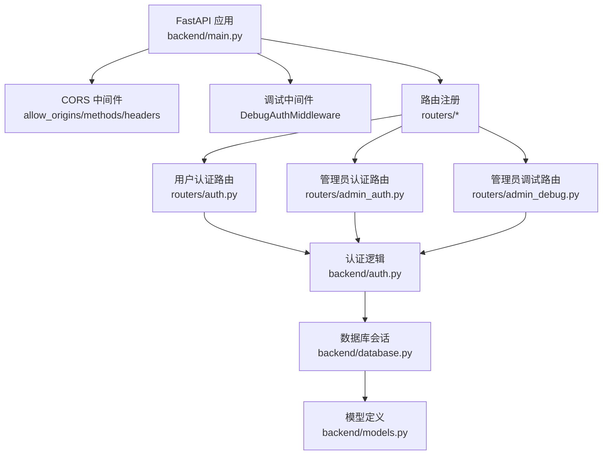
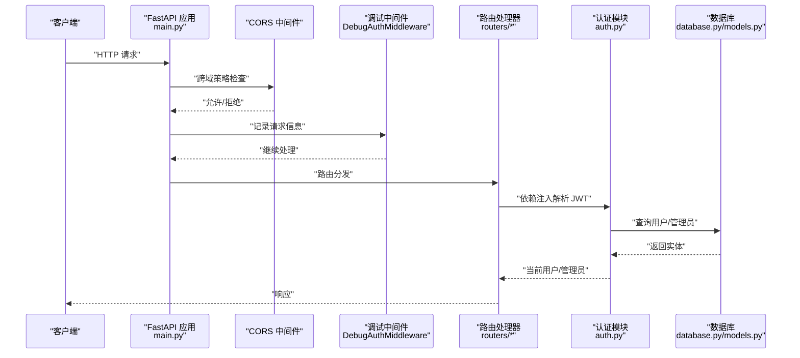
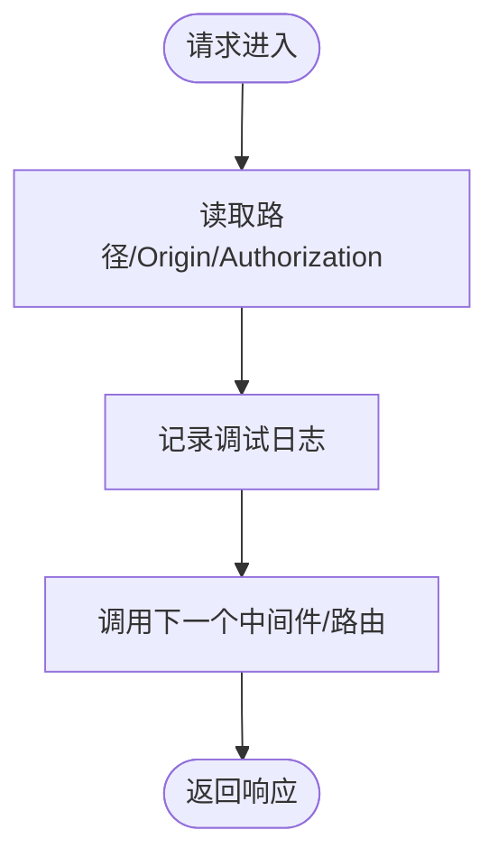
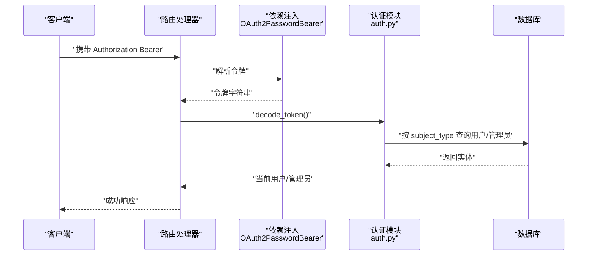
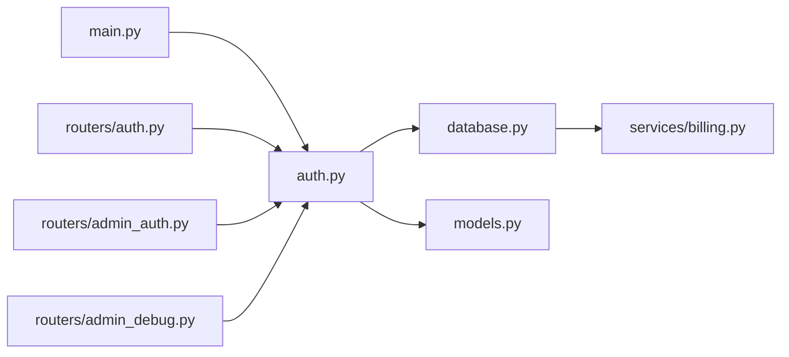

# 中间件与安全

<cite>
**本文档引用的文件**
- [main.py](file://backend/main.py)
- [auth.py](file://backend/auth.py)
- [config.py](file://backend/config.py)
- [models.py](file://backend/models.py)
- [database.py](file://backend/database.py)
- [routers/auth.py](file://backend/routers/auth.py)
- [routers/admin_auth.py](file://backend/routers/admin_auth.py)
- [routers/admin_debug.py](file://backend/routers/admin_debug.py)
- [schemas.py](file://backend/schemas.py)
- [services/billing.py](file://backend/services/billing.py)
</cite>

## 目录
1. [简介](#简介)
2. [项目结构](#项目结构)
3. [核心组件](#核心组件)
4. [架构总览](#架构总览)
5. [详细组件分析](#详细组件分析)
6. [依赖关系分析](#依赖关系分析)
7. [性能考虑](#性能考虑)
8. [故障排查指南](#故障排查指南)
9. [结论](#结论)
10. [附录](#附录)

## 简介
本文件聚焦于 KunFlix 后端的中间件与安全机制，涵盖以下主题：
- CORS 中间件的配置与跨域处理策略（允许的源、方法与头部）
- 认证中间件（JWT 令牌验证、权限检查、用户身份识别）
- 调试中间件（DebugAuthMiddleware）的作用与实现原理
- 错误处理与日志记录中间件的职责
- 安全最佳实践（CSRF 防护、XSS 防护、SQL 注入防护）
- 中间件扩展与自定义安全策略的实现方法

## 项目结构
后端采用 FastAPI 应用入口集中配置中间件与路由注册，认证与授权逻辑集中在 auth 模块，数据库与模型定义位于 database 与 models，路由层负责对外暴露 API。

图表来源
- [main.py:110-153](file://backend/main.py#L110-L153)
- [routers/auth.py:30-33](file://backend/routers/auth.py#L30-L33)
- [routers/admin_auth.py:29-33](file://backend/routers/admin_auth.py#L29-L33)
- [routers/admin_debug.py:43-47](file://backend/routers/admin_debug.py#L43-L47)

章节来源
- [main.py:110-153](file://backend/main.py#L110-L153)

## 核心组件
- CORS 中间件：统一配置允许的源、凭证、方法与头部，满足前端开发环境跨域需求。
- 调试中间件 DebugAuthMiddleware：在请求进入时记录路径、Origin 与 Authorization 头部，便于调试与审计。
- 认证与授权：基于 JWT 的用户与管理员双通道认证，结合 FastAPI 依赖注入实现自动解码与身份校验。
- 数据库与模型：异步 SQLAlchemy 引擎与模型定义，支撑用户、管理员、会话与计费等数据安全隔离。
- 路由与权限：各路由通过依赖注入获取当前用户或管理员，实现细粒度权限控制。

章节来源
- [main.py:119-136](file://backend/main.py#L119-L136)
- [auth.py:80-229](file://backend/auth.py#L80-L229)
- [database.py:7-45](file://backend/database.py#L7-L45)
- [models.py:10-73](file://backend/models.py#L10-L73)

## 架构总览
下图展示了中间件与安全相关的关键交互流程：

图表来源
- [main.py:119-136](file://backend/main.py#L119-L136)
- [routers/auth.py:63-99](file://backend/routers/auth.py#L63-L99)
- [routers/admin_auth.py:36-90](file://backend/routers/admin_auth.py#L36-L90)
- [auth.py:83-114](file://backend/auth.py#L83-L114)

## 详细组件分析

### CORS 中间件
- 配置要点
  - 允许源：开发环境常用本地前端地址（如 3000/3001 端口）
  - 凭证：允许携带 Cookie/Authorization
  - 方法：通配符允许常见 HTTP 方法
  - 头部：通配符允许常见请求头
- 影响范围：全局生效，影响所有路由与 WebSocket（若需要）
- 安全建议
  - 生产环境应将 allow_origins 限定为具体域名
  - 明确 allow_methods 与 allow_headers，避免过度宽松
  - 若涉及敏感操作，建议关闭 allow_credentials 或配合更严格的策略

章节来源
- [main.py:130-136](file://backend/main.py#L130-L136)

### 调试中间件 DebugAuthMiddleware
- 作用
  - 在请求进入时记录路径、Origin 与 Authorization 头部片段，便于定位鉴权问题
  - 仅在开发/调试阶段启用，避免生产环境泄露敏感信息
- 实现原理
  - 继承 BaseHTTPMiddleware，重写 dispatch 方法
  - 通过日志输出请求元信息，随后调用下一个中间件/路由
- 使用建议
  - 仅在开发环境开启，生产环境移除
  - 注意日志级别，避免在高并发下产生过多输出

图表来源
- [main.py:119-128](file://backend/main.py#L119-L128)

章节来源
- [main.py:119-128](file://backend/main.py#L119-L128)

### 认证中间件与 JWT 机制
- JWT 结构与签发
  - 访问令牌包含 sub（主体 ID）、role（角色）、subject_type（用户/管理员）、type（access）、过期时间
  - 刷新令牌包含 sub、subject_type、type（refresh）、过期时间
- 解析与校验
  - 通过 OAuth2PasswordBearer 提取令牌
  - 使用 decode_token 校验签名与过期，异常时抛出 401
- 身份提取
  - get_current_user：校验访问令牌并查询用户表
  - get_current_admin：校验访问令牌并查询管理员表
  - get_current_user_or_admin：根据 subject_type 决定查询用户或管理员
- 活跃状态检查
  - get_current_active_user/admin：确保账户未被禁用
- 权限控制
  - require_admin：管理员专用端点的权限装饰器
- 安全要点
  - 严格区分用户与管理员令牌类型与主体类型
  - 令牌过期时间合理设置，刷新流程安全可靠
  - 密钥与算法在配置中集中管理，生产环境务必更换默认密钥

图表来源
- [auth.py:80-114](file://backend/auth.py#L80-L114)
- [auth.py:119-156](file://backend/auth.py#L119-L156)
- [auth.py:162-210](file://backend/auth.py#L162-L210)

章节来源
- [auth.py:30-75](file://backend/auth.py#L30-L75)
- [auth.py:83-114](file://backend/auth.py#L83-L114)
- [auth.py:119-156](file://backend/auth.py#L119-L156)
- [auth.py:162-210](file://backend/auth.py#L162-L210)

### 管理员认证与调试
- 管理员登录
  - 从 admins 表查询管理员，校验密码与活跃状态
  - 生成访问与刷新令牌，subject_type 设为 "admin"
- 管理员刷新
  - 校验刷新令牌类型与主体类型，重新签发访问令牌
- 管理员调试会话
  - 独立的调试会话与消息表，避免与普通用户数据混淆
  - 支持多智能体编排与工具链路的流式响应

章节来源
- [routers/admin_auth.py:36-90](file://backend/routers/admin_auth.py#L36-L90)
- [routers/admin_auth.py:93-127](file://backend/routers/admin_auth.py#L93-L127)
- [routers/admin_debug.py:50-70](file://backend/routers/admin_debug.py#L50-L70)
- [routers/admin_debug.py:156-198](file://backend/routers/admin_debug.py#L156-L198)

### 数据模型与安全隔离
- 用户与管理员分离
  - users 与 admins 表独立，subject_type 用于区分令牌主体类型
- 行级隔离
  - scoped_query 根据实体类型决定是否添加 user_id 过滤，确保数据可见性隔离
- 计费与冻结
  - 余额冻结与不足检测，防止透支导致的不一致

章节来源
- [models.py:10-73](file://backend/models.py#L10-L73)
- [auth.py:221-229](file://backend/auth.py#L221-L229)
- [services/billing.py:258-285](file://backend/services/billing.py#L258-L285)

### 错误处理与日志记录
- 日志配置
  - 应用日志、SQLAlchemy 日志、Uvicorn 访问日志分级控制
- 路由层错误
  - 登录/刷新失败、账户禁用、会话不存在等场景抛出明确 HTTP 异常
- 中间件层调试
  - DebugAuthMiddleware 记录请求元信息，辅助定位鉴权问题

章节来源
- [main.py:15-30](file://backend/main.py#L15-L30)
- [routers/auth.py:72-83](file://backend/routers/auth.py#L72-L83)
- [routers/admin_auth.py:50-71](file://backend/routers/admin_auth.py#L50-L71)

## 依赖关系分析
- 应用层依赖
  - main.py 依赖 auth.py 进行 JWT 解析与身份提取
  - 路由层依赖 auth.py 的依赖注入函数实现权限控制
  - 服务层（如计费）依赖 models 与 database 进行数据一致性校验
- 数据层依赖
  - database.py 提供异步引擎与会话工厂
  - models.py 定义用户/管理员/会话等模型，支撑安全策略

图表来源
- [main.py:41-43](file://backend/main.py#L41-L43)
- [auth.py:80-114](file://backend/auth.py#L80-L114)
- [database.py:42-45](file://backend/database.py#L42-L45)
- [models.py:10-73](file://backend/models.py#L10-L73)
- [services/billing.py:258-285](file://backend/services/billing.py#L258-L285)

章节来源
- [main.py:41-43](file://backend/main.py#L41-L43)
- [auth.py:80-114](file://backend/auth.py#L80-L114)
- [database.py:42-45](file://backend/database.py#L42-L45)

## 性能考虑
- CORS 与调试中间件开销极低，通常可忽略
- JWT 解析与数据库查询为 O(1)，性能瓶颈主要在数据库与外部服务调用
- 建议
  - 缓存热点用户/管理员信息（谨慎使用）
  - 控制日志级别，避免在高并发下产生大量 IO
  - 对外部 LLM/工具调用增加超时与重试策略

## 故障排查指南
- 401 未授权
  - 检查 Authorization 头是否正确传递
  - 核对令牌类型与 subject_type 是否匹配预期
  - 确认密钥与算法一致，避免跨环境差异
- 403 禁止访问
  - 账户被禁用或余额不足
  - 管理员权限不足
- 跨域失败
  - 检查 allow_origins 是否包含当前前端域名
  - 确认是否携带凭据以及预检请求处理
- 调试定位
  - 启用 DebugAuthMiddleware 查看请求头与路径
  - 检查应用日志与数据库日志级别

章节来源
- [main.py:119-128](file://backend/main.py#L119-L128)
- [routers/auth.py:72-83](file://backend/routers/auth.py#L72-L83)
- [routers/admin_auth.py:50-71](file://backend/routers/admin_auth.py#L50-L71)

## 结论
本项目通过 CORS 中间件与调试中间件构建了基础的跨域与可观测性能力；借助 JWT 与依赖注入实现了清晰的用户/管理员双通道认证与权限控制；数据库与模型层面提供了行级隔离与计费保障。建议在生产环境中收紧 CORS 策略、强化密钥管理，并完善 CSRF/XSS/SQL 注入等纵深防御措施。

## 附录

### 安全最佳实践清单
- CSRF 防护
  - 启用 SameSite Cookie、CSRF Token 校验（前端/后端配合）
  - 重要操作要求二次确认与验证码
- XSS 防护
  - 输入输出严格转义与白名单过滤
  - 使用 Content-Security-Policy 限制脚本来源
- SQL 注入防护
  - 使用 ORM 查询与参数化绑定
  - 避免动态拼接 SQL
- 令牌安全
  - 使用强随机密钥与安全算法
  - 设置合理过期时间与刷新流程
  - 传输层使用 HTTPS

### 中间件扩展与自定义安全策略
- 新增中间件
  - 继承 BaseHTTPMiddleware，实现 dispatch 方法
  - 在应用启动时通过 add_middleware 注册
- 自定义鉴权策略
  - 基于依赖注入扩展 get_current_user_or_admin
  - 引入角色/权限映射表，结合装饰器实现细粒度授权
- 审计与风控
  - 在调试中间件基础上扩展请求/响应体记录
  - 集成速率限制与黑名单机制

章节来源
- [main.py:119-136](file://backend/main.py#L119-L136)
- [auth.py:162-210](file://backend/auth.py#L162-L210)