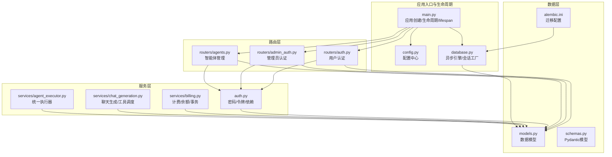
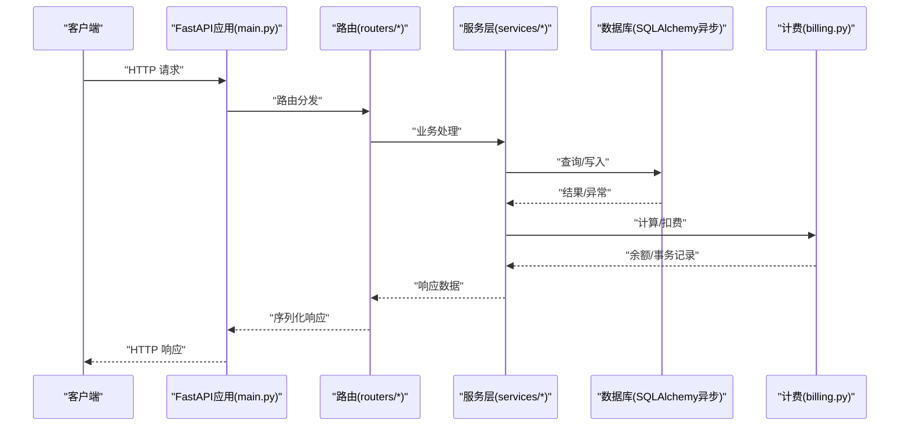
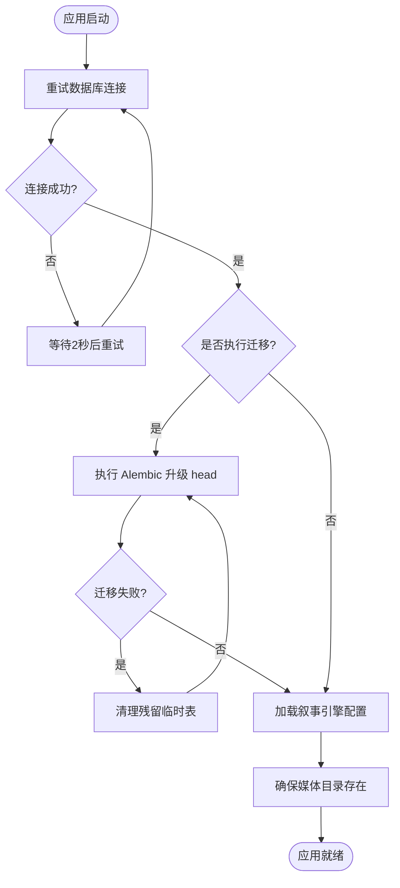
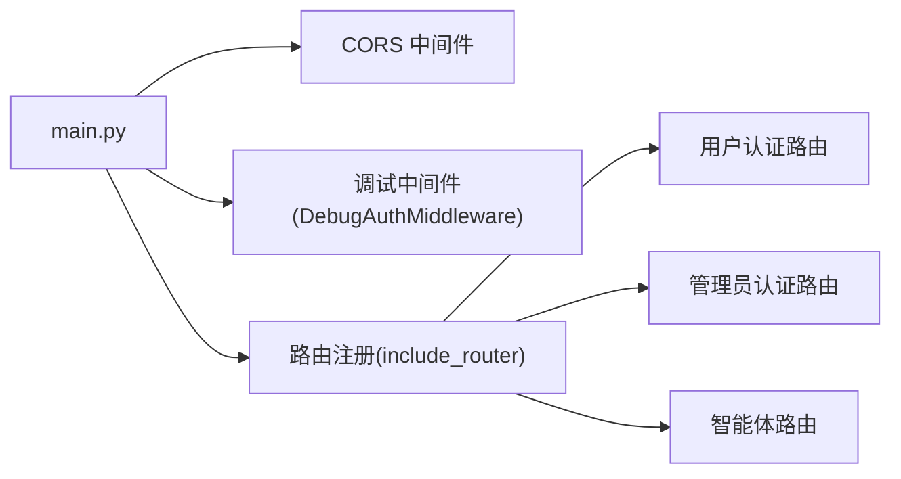
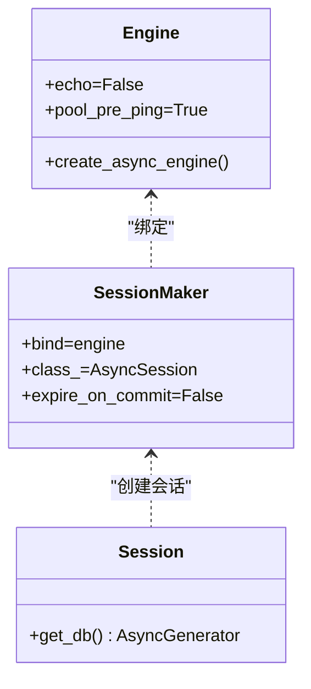
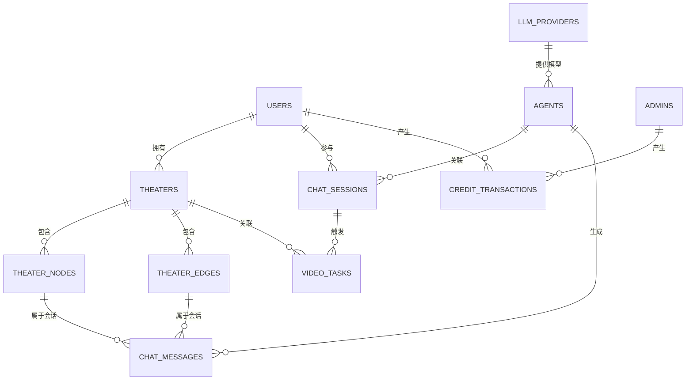
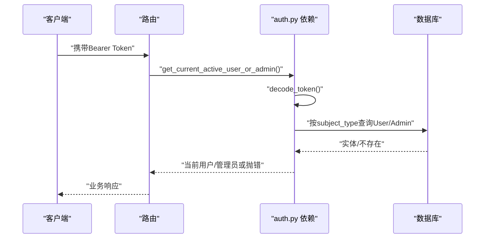
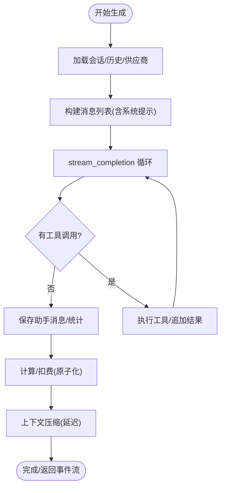
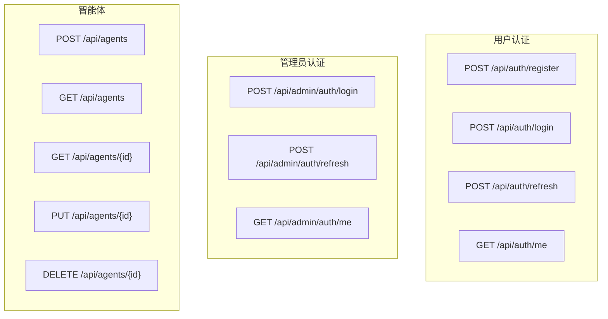
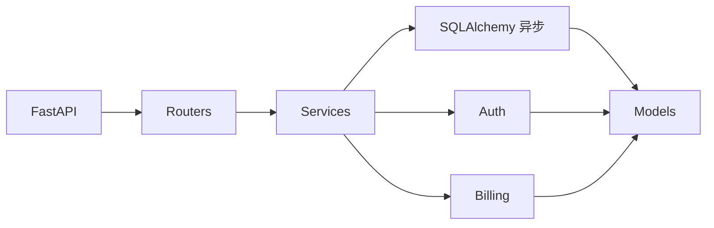

# 后端架构

<cite>
**本文引用的文件**
- [main.py](file://backend/main.py)
- [config.py](file://backend/config.py)
- [database.py](file://backend/database.py)
- [models.py](file://backend/models.py)
- [schemas.py](file://backend/schemas.py)
- [auth.py](file://backend/auth.py)
- [routers/auth.py](file://backend/routers/auth.py)
- [routers/admin_auth.py](file://backend/routers/admin_auth.py)
- [routers/agents.py](file://backend/routers/agents.py)
- [services/billing.py](file://backend/services/billing.py)
- [services/chat_generation.py](file://backend/services/chat_generation.py)
- [services/agent_executor.py](file://backend/services/agent_executor.py)
- [requirements.txt](file://backend/requirements.txt)
- [alembic.ini](file://backend/alembic.ini)
</cite>

## 目录
1. [简介](#简介)
2. [项目结构](#项目结构)
3. [核心组件](#核心组件)
4. [架构总览](#架构总览)
5. [详细组件分析](#详细组件分析)
6. [依赖分析](#依赖分析)
7. [性能考量](#性能考量)
8. [故障排查指南](#故障排查指南)
9. [结论](#结论)
10. [附录](#附录)

## 简介
本文件面向Infinite Game后端，围绕基于FastAPI的异步Web服务进行系统化架构说明，涵盖应用入口与生命周期、中间件与路由体系、数据库连接池与SQLAlchemy异步ORM、数据模型与迁移策略、服务层与业务封装、依赖注入与认证授权、CORS与日志策略、以及性能优化与扩展性设计。文档同时提供可视化图示帮助理解模块间交互与数据流。

## 项目结构
后端采用“应用入口 + 路由层 + 服务层 + 数据层”的分层组织方式，配合Pydantic模型与SQLAlchemy异步ORM实现数据持久化与校验；通过Alembic进行数据库迁移；通过FastAPI中间件与路由装饰器实现CORS、认证与审计。

图表来源
- [main.py:110-175](file://backend/main.py#L110-L175)
- [config.py:1-43](file://backend/config.py#L1-L43)
- [database.py:1-45](file://backend/database.py#L1-L45)
- [routers/auth.py:1-136](file://backend/routers/auth.py#L1-L136)
- [routers/admin_auth.py:1-136](file://backend/routers/admin_auth.py#L1-L136)
- [routers/agents.py:1-151](file://backend/routers/agents.py#L1-L151)
- [auth.py:1-229](file://backend/auth.py#L1-L229)
- [services/billing.py:1-388](file://backend/services/billing.py#L1-L388)
- [services/chat_generation.py:1-449](file://backend/services/chat_generation.py#L1-L449)
- [services/agent_executor.py:1-287](file://backend/services/agent_executor.py#L1-L287)
- [models.py:1-503](file://backend/models.py#L1-L503)
- [schemas.py:1-800](file://backend/schemas.py#L1-L800)
- [alembic.ini:1-115](file://backend/alembic.ini#L1-L115)

章节来源
- [main.py:110-175](file://backend/main.py#L110-L175)
- [config.py:1-43](file://backend/config.py#L1-L43)
- [database.py:1-45](file://backend/database.py#L1-L45)
- [models.py:1-503](file://backend/models.py#L1-L503)
- [schemas.py:1-800](file://backend/schemas.py#L1-L800)
- [alembic.ini:1-115](file://backend/alembic.ini#L1-L115)

## 核心组件
- 应用入口与生命周期：通过FastAPI lifespan钩子在启动阶段完成数据库连接重试、迁移执行、叙事引擎初始化与媒体目录准备。
- 中间件与路由：注册CORS与调试中间件，集中注册各模块路由。
- 数据库与ORM：异步引擎、连接池参数、SQLite WAL优化、会话工厂与依赖注入。
- 认证与授权：用户/管理员双轨JWT认证，依赖注入获取当前用户/管理员，支持通用主体判定。
- 服务层：计费与余额原子化操作、聊天生成与工具调度、统一Agent执行器。
- 迁移与配置：Alembic迁移脚本与配置，环境变量驱动的运行时配置。

章节来源
- [main.py:49-109](file://backend/main.py#L49-L109)
- [main.py:130-153](file://backend/main.py#L130-L153)
- [database.py:9-37](file://backend/database.py#L9-L37)
- [auth.py:30-229](file://backend/auth.py#L30-L229)
- [services/billing.py:45-308](file://backend/services/billing.py#L45-L308)
- [services/chat_generation.py:29-449](file://backend/services/chat_generation.py#L29-L449)
- [services/agent_executor.py:63-287](file://backend/services/agent_executor.py#L63-L287)
- [alembic.ini:61-115](file://backend/alembic.ini#L61-L115)

## 架构总览
下图展示了从客户端请求到服务层处理、数据库交互与计费结算的整体流程。

图表来源
- [main.py:138-153](file://backend/main.py#L138-L153)
- [routers/auth.py:36-136](file://backend/routers/auth.py#L36-L136)
- [routers/admin_auth.py:36-136](file://backend/routers/admin_auth.py#L36-L136)
- [routers/agents.py:16-151](file://backend/routers/agents.py#L16-L151)
- [services/chat_generation.py:29-449](file://backend/services/chat_generation.py#L29-L449)
- [services/billing.py:178-308](file://backend/services/billing.py#L178-L308)
- [database.py:42-45](file://backend/database.py#L42-L45)

## 详细组件分析

### 应用入口与生命周期
- 生命周期管理：在lifespan中执行数据库连接重试、条件性迁移（可配置）、叙事引擎配置加载、媒体目录创建。
- 日志策略：精细化控制SQLAlchemy与Uvicorn日志级别，保留应用日志。
- WebSocket：提供基础WS端点用于测试。

图表来源
- [main.py:49-109](file://backend/main.py#L49-L109)

章节来源
- [main.py:15-30](file://backend/main.py#L15-L30)
- [main.py:49-109](file://backend/main.py#L49-L109)

### 中间件与路由系统
- CORS：允许开发环境的本地前端域名，支持凭据、通配方法与头。
- 调试中间件：记录Authorization头与Origin，便于调试。
- 路由注册：集中include多个业务路由，形成清晰的API命名空间。

图表来源
- [main.py:130-153](file://backend/main.py#L130-L153)
- [routers/auth.py:30-33](file://backend/routers/auth.py#L30-L33)
- [routers/admin_auth.py:29-33](file://backend/routers/admin_auth.py#L29-L33)
- [routers/agents.py:10-14](file://backend/routers/agents.py#L10-L14)

章节来源
- [main.py:130-153](file://backend/main.py#L130-L153)

### 数据库与ORM（SQLAlchemy 异步）
- 引擎与连接池：异步引擎、pool_pre_ping、SQLite WAL优化、连接超时与线程策略。
- 会话工厂：async_sessionmaker绑定engine，expire_on_commit=False提升性能。
- 依赖注入：get_db提供异步会话依赖，贯穿各路由与服务层。
- 迁移：Alembic配置位于独立文件，通过主程序条件执行。

图表来源
- [database.py:9-37](file://backend/database.py#L9-L37)
- [database.py:42-45](file://backend/database.py#L42-L45)

章节来源
- [database.py:1-45](file://backend/database.py#L1-L45)
- [alembic.ini:61-115](file://backend/alembic.ini#L61-L115)

### 数据模型与迁移策略
- 模型设计：用户/管理员、剧场/节点/边、资产、LLM提供商、聊天会话/消息、智能体、计费事务、任务执行/子任务、提示词模板、订阅计划、视频任务、管理员调试会话/消息、工具配置与执行日志等。
- 迁移策略：通过主程序条件执行Alembic升级；SQLite使用WAL模式与超时参数降低锁冲突；迁移失败时尝试清理残留临时表后重试。

图表来源
- [models.py:10-503](file://backend/models.py#L10-L503)

章节来源
- [models.py:1-503](file://backend/models.py#L1-L503)
- [main.py:59-88](file://backend/main.py#L59-L88)

### 认证与授权（JWT）
- 密码：bcrypt哈希与校验。
- 令牌：Access/Refresh双令牌，支持用户与管理员主体类型区分。
- 依赖：OAuth2PasswordBearer，提供获取当前用户/管理员与活动状态校验的依赖。
- 通用主体：支持根据subject_type在User/Admin间切换查询。

图表来源
- [auth.py:83-229](file://backend/auth.py#L83-L229)
- [routers/auth.py:132-136](file://backend/routers/auth.py#L132-L136)
- [routers/admin_auth.py:130-136](file://backend/routers/admin_auth.py#L130-L136)

章节来源
- [auth.py:19-75](file://backend/auth.py#L19-L75)
- [auth.py:83-229](file://backend/auth.py#L83-L229)

### 服务层与业务逻辑
- 计费与余额：原子化扣费/退款，余额冻结与不足检测，映射表驱动的多维度计费。
- 聊天生成：单智能体流式生成，工具调用循环，上下文压缩，计费与画布桥接。
- 统一执行器：AgentExecutor封装对话代理与流式调用，提供缓存与模型创建。

图表来源
- [services/chat_generation.py:29-449](file://backend/services/chat_generation.py#L29-L449)
- [services/billing.py:178-308](file://backend/services/billing.py#L178-L308)

章节来源
- [services/billing.py:45-388](file://backend/services/billing.py#L45-L388)
- [services/chat_generation.py:29-449](file://backend/services/chat_generation.py#L29-L449)
- [services/agent_executor.py:63-287](file://backend/services/agent_executor.py#L63-L287)

### 路由与控制器
- 用户认证：注册、登录、刷新、个人信息。
- 管理员认证：登录、刷新、个人信息。
- 智能体管理：创建、查询、更新、删除，管理员权限。

图表来源
- [routers/auth.py:36-136](file://backend/routers/auth.py#L36-L136)
- [routers/admin_auth.py:36-136](file://backend/routers/admin_auth.py#L36-L136)
- [routers/agents.py:16-151](file://backend/routers/agents.py#L16-L151)

章节来源
- [routers/auth.py:1-136](file://backend/routers/auth.py#L1-L136)
- [routers/admin_auth.py:1-136](file://backend/routers/admin_auth.py#L1-L136)
- [routers/agents.py:1-151](file://backend/routers/agents.py#L1-L151)

## 依赖分析
- 外部依赖：FastAPI、Uvicorn、SQLAlchemy 2、Pydantic、aiosqlite/asyncpg、Redis、Alembic、Agentscope/OpenAI/Google SDK等。
- 内部耦合：路由依赖服务层；服务层依赖数据库与配置；认证依赖模型与配置；计费依赖模型与服务工具。

图表来源
- [requirements.txt:1-29](file://backend/requirements.txt#L1-L29)
- [routers/auth.py:16-26](file://backend/routers/auth.py#L16-L26)
- [services/chat_generation.py:11-24](file://backend/services/chat_generation.py#L11-L24)
- [services/billing.py:5-8](file://backend/services/billing.py#L5-L8)

章节来源
- [requirements.txt:1-29](file://backend/requirements.txt#L1-L29)

## 性能考量
- 连接池与并发：合理设置pool_size与max_overflow，开启pool_pre_ping；SQLite启用WAL与busy_timeout降低锁竞争。
- 会话策略：expire_on_commit=False减少过期检查开销；按需使用AsyncSessionLocal保证事务边界。
- 计费原子化：UPDATE ... WHERE ... 条件更新，避免重复查询；失败分支明确抛错，便于上层回滚。
- 流式生成：服务层采用异步生成器与SSE事件，前端可渐进接收；工具调用循环限制轮次，避免无限循环。
- 缓存与复用：AgentExecutor对模型与代理实例做缓存，减少重复初始化成本。

章节来源
- [database.py:9-37](file://backend/database.py#L9-L37)
- [services/billing.py:214-287](file://backend/services/billing.py#L214-L287)
- [services/chat_generation.py:175-295](file://backend/services/chat_generation.py#L175-L295)
- [services/agent_executor.py:273-277](file://backend/services/agent_executor.py#L273-L277)

## 故障排查指南
- 数据库连接失败：检查DATABASE_URL、SQLite路径、WAL参数；确认lifespan重试逻辑与迁移执行。
- 迁移失败：查看残留临时表清理与重试逻辑；必要时手动清理后重试。
- 认证失败：核对JWT密钥、算法与过期时间；检查subject_type与实体状态。
- 余额不足/冻结：计费服务会抛出对应异常；前端应提示并引导充值。
- WebSocket错误：检查WS端点与异常处理逻辑。

章节来源
- [main.py:59-88](file://backend/main.py#L59-L88)
- [auth.py:65-75](file://backend/auth.py#L65-L75)
- [services/billing.py:37-43](file://backend/services/billing.py#L37-L43)
- [main.py:161-171](file://backend/main.py#L161-L171)

## 结论
本架构以FastAPI为核心，结合SQLAlchemy异步ORM、Pydantic模型与Alembic迁移，构建了高内聚、低耦合的后端服务。通过严格的依赖注入、原子化计费与流式生成，满足多模态与多智能体协作场景下的性能与可靠性需求。建议在生产环境中进一步完善错误监控、限流与缓存策略，并持续演进迁移与配置管理。

## 附录
- 配置项概览：数据库URL、Redis、AI模型密钥、JWT参数、生成参数、迁移开关等。
- 运行依赖：Python包版本与功能范围。

章节来源
- [config.py:7-42](file://backend/config.py#L7-L42)
- [requirements.txt:1-29](file://backend/requirements.txt#L1-L29)