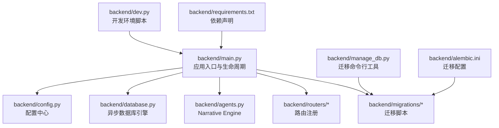
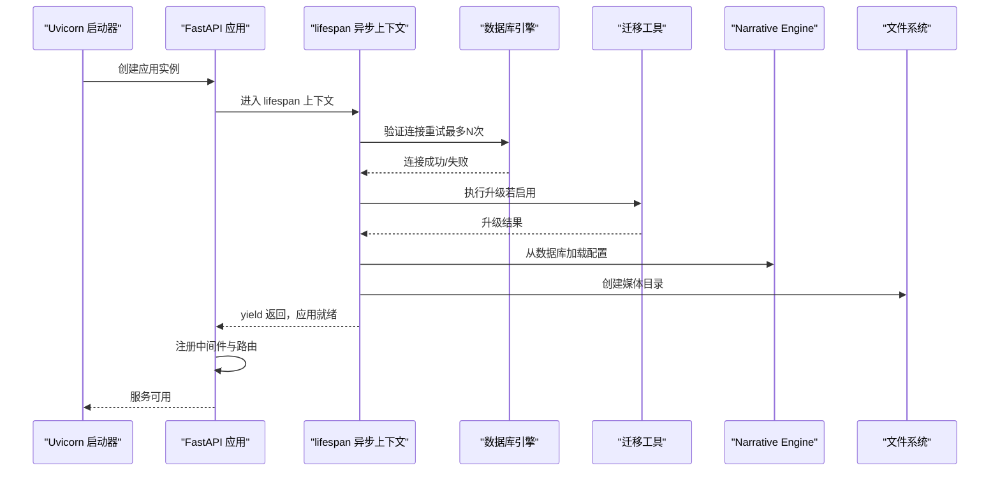
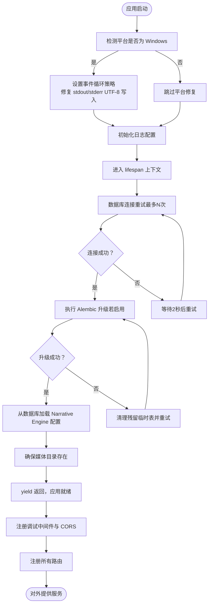
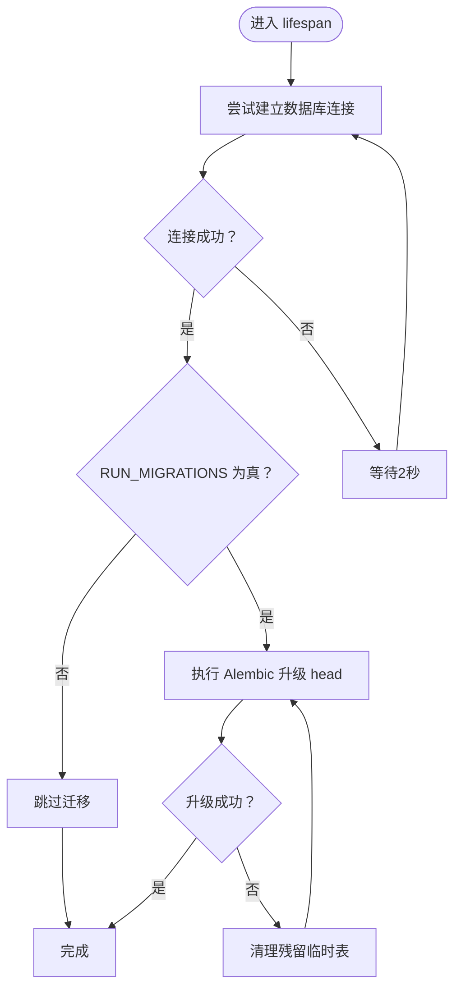
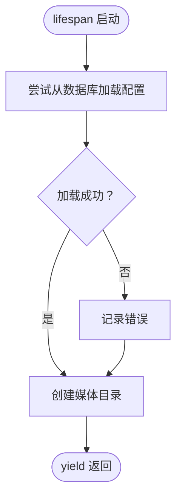
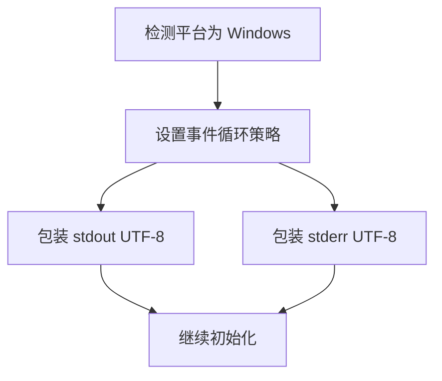
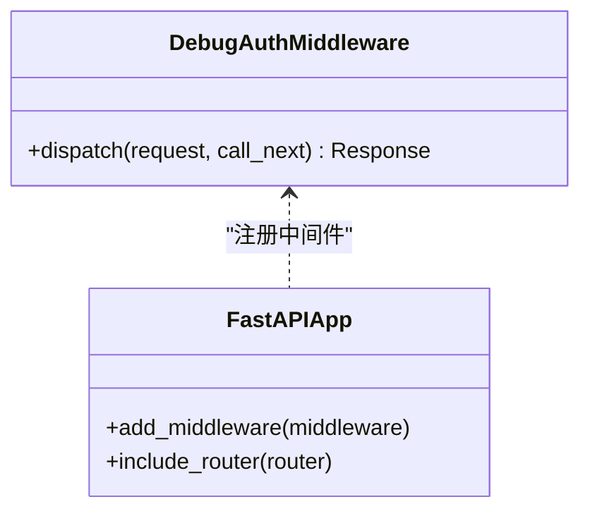
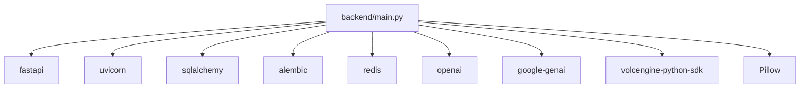

# 应用入口与生命周期

<cite>
**本文引用的文件**
- [backend/main.py](file://backend/main.py)
- [backend/database.py](file://backend/database.py)
- [backend/config.py](file://backend/config.py)
- [backend/manage_db.py](file://backend/manage_db.py)
- [backend/alembic.ini](file://backend/alembic.ini)
- [backend/dev.py](file://backend/dev.py)
- [backend/requirements.txt](file://backend/requirements.txt)
</cite>

## 目录
1. [简介](#简介)
2. [项目结构](#项目结构)
3. [核心组件](#核心组件)
4. [架构总览](#架构总览)
5. [详细组件分析](#详细组件分析)
6. [依赖分析](#依赖分析)
7. [性能考虑](#性能考虑)
8. [故障排查指南](#故障排查指南)
9. [结论](#结论)
10. [附录](#附录)

## 简介
本文件聚焦于 Infinite Game 后端的 FastAPI 应用入口与生命周期管理，系统性解析以下主题：
- FastAPI 应用实例初始化与异步上下文管理器 lifespan 的工作机制
- 数据库连接重试逻辑与 Alembic 迁移策略
- 应用启动时的初始化流程：数据库连接验证、迁移执行、Narrative Engine 配置加载、媒体目录创建
- Windows 平台特定的异步事件循环配置与 UTF-8 编码修复机制
- 调试中间件的实现原理与 CORS 跨域配置策略
- 应用生命周期钩子的使用方法与最佳实践

## 项目结构
后端采用“入口文件 + 配置 + 数据库引擎 + 迁移工具”的清晰分层：
- 入口与生命周期：backend/main.py
- 配置中心：backend/config.py
- 异步数据库引擎：backend/database.py
- 迁移工具：backend/manage_db.py 与 backend/alembic.ini
- 开发脚本：backend/dev.py
- 依赖声明：backend/requirements.txt

**图表来源**
- [backend/main.py:110-175](file://backend/main.py#L110-L175)
- [backend/config.py:1-43](file://backend/config.py#L1-L43)
- [backend/database.py:1-45](file://backend/database.py#L1-L45)
- [backend/manage_db.py:1-80](file://backend/manage_db.py#L1-L80)
- [backend/alembic.ini:1-115](file://backend/alembic.ini#L1-L115)
- [backend/dev.py:110-137](file://backend/dev.py#L110-L137)
- [backend/requirements.txt:1-29](file://backend/requirements.txt#L1-L29)

**章节来源**
- [backend/main.py:110-175](file://backend/main.py#L110-L175)
- [backend/config.py:1-43](file://backend/config.py#L1-L43)
- [backend/database.py:1-45](file://backend/database.py#L1-L45)
- [backend/manage_db.py:1-80](file://backend/manage_db.py#L1-L80)
- [backend/alembic.ini:1-115](file://backend/alembic.ini#L1-L115)
- [backend/dev.py:110-137](file://backend/dev.py#L110-L137)
- [backend/requirements.txt:1-29](file://backend/requirements.txt#L1-L29)

## 核心组件
- 应用入口与生命周期：定义 FastAPI 实例、注册中间件、注册路由、实现 lifespan 异步上下文管理器
- 配置中心：集中管理数据库、Redis、JWT、AI 模型等配置项
- 异步数据库引擎：基于 SQLAlchemy 2.x 异步引擎，支持连接池与 SQLite 优化
- 迁移工具：封装 Alembic 命令行，支持迁移、升级、降级与种子数据
- 开发脚本：统一启动后端、前端与管理后台，处理 Windows 平台兼容性

**章节来源**
- [backend/main.py:110-175](file://backend/main.py#L110-L175)
- [backend/config.py:1-43](file://backend/config.py#L1-L43)
- [backend/database.py:1-45](file://backend/database.py#L1-L45)
- [backend/manage_db.py:1-80](file://backend/manage_db.py#L1-L80)
- [backend/dev.py:110-137](file://backend/dev.py#L110-L137)

## 架构总览
下图展示应用启动时的关键交互：lifespan 在应用启动前完成数据库连接与迁移、Narrative Engine 配置加载与媒体目录创建；随后注册中间件与路由，进入服务阶段。

**图表来源**
- [backend/main.py:49-108](file://backend/main.py#L49-L108)
- [backend/database.py:9-37](file://backend/database.py#L9-L37)
- [backend/config.py:37](file://backend/config.py#L37)
- [backend/manage_db.py:30-38](file://backend/manage_db.py#L30-L38)

## 详细组件分析

### FastAPI 应用实例与生命周期（lifespan）
- 应用实例创建：通过 FastAPI 构造函数传入标题与 lifespan 回调，实现启动与关闭阶段的自定义逻辑
- 异步上下文管理器：在 lifespan 中完成数据库连接重试、迁移执行、Narrative Engine 配置加载与媒体目录创建
- 中间件注册：调试中间件与 CORS 中间件在应用实例上注册，贯穿请求生命周期
- 路由注册：集中注册认证、管理员、代理、聊天、编排、媒体、订阅、提示模板、视频、剧院、技能、调试与工具等路由模块

**图表来源**
- [backend/main.py:6-13](file://backend/main.py#L6-L13)
- [backend/main.py:15-30](file://backend/main.py#L15-L30)
- [backend/main.py:49-108](file://backend/main.py#L49-L108)
- [backend/main.py:110-153](file://backend/main.py#L110-L153)

**章节来源**
- [backend/main.py:49-108](file://backend/main.py#L49-L108)
- [backend/main.py:110-153](file://backend/main.py#L110-L153)

### 数据库连接重试与迁移策略
- 连接重试：lifespan 中以固定次数上限进行数据库连接尝试，每次失败等待 2 秒，避免瞬时异常导致启动失败
- 迁移执行：当配置开关启用时，通过子进程调用 Alembic 升级到最新版本；若失败则尝试清理 SQLite 临时表后重试
- SQLite 优化：在连接事件中设置 WAL 模式、忙碌超时与同步级别，提升并发与稳定性
- 连接池参数：设置预 ping、连接池大小与溢出数量，并在 SQLite 场景下设置超时参数

**图表来源**
- [backend/main.py:49-108](file://backend/main.py#L49-L108)
- [backend/database.py:23-31](file://backend/database.py#L23-L31)
- [backend/config.py:37](file://backend/config.py#L37)

**章节来源**
- [backend/main.py:49-108](file://backend/main.py#L49-L108)
- [backend/database.py:9-37](file://backend/database.py#L9-L37)
- [backend/config.py:37](file://backend/config.py#L37)

### Narrative Engine 配置加载与媒体目录创建
- 配置加载：在应用启动时尝试从数据库加载 Narrative Engine 的配置，失败时记录错误但不影响应用继续启动
- 媒体目录：确保 media 目录存在，避免后续上传与生成资源时报错

**图表来源**
- [backend/main.py:98-106](file://backend/main.py#L98-L106)

**章节来源**
- [backend/main.py:98-106](file://backend/main.py#L98-L106)

### Windows 平台特定的异步事件循环与 UTF-8 编码修复
- 事件循环策略：在 Windows 平台上设置 selector 事件循环策略，解决某些异步驱动（如 asyncpg）的兼容性问题
- UTF-8 编码修复：对 stdout/stderr 的 buffer 进行 UTF-8 包装，避免终端输出乱码

**图表来源**
- [backend/main.py:6-13](file://backend/main.py#L6-L13)

**章节来源**
- [backend/main.py:6-13](file://backend/main.py#L6-L13)

### 调试中间件与 CORS 跨域配置
- 调试中间件：拦截请求，记录方法、路径、Origin 与 Authorization 头部片段，便于调试与审计
- CORS 配置：允许本地开发源、凭据传递、任意方法与头，满足前端与管理后台的跨域访问需求

**图表来源**
- [backend/main.py:119-128](file://backend/main.py#L119-L128)
- [backend/main.py:130-136](file://backend/main.py#L130-L136)

**章节来源**
- [backend/main.py:119-128](file://backend/main.py#L119-L128)
- [backend/main.py:130-136](file://backend/main.py#L130-L136)

### 应用生命周期钩子与最佳实践
- 启动阶段：在 lifespan 中完成数据库连接、迁移、配置加载与目录准备，避免业务路由依赖未就绪状态
- 关闭阶段：yield 之后的清理逻辑可在此处扩展（当前未实现），建议用于释放连接池、关闭外部服务等
- 最佳实践：
  - 将耗时操作（如迁移）放在启动阶段，避免首次请求延迟
  - 对数据库异常进行指数退避或固定间隔重试，提升鲁棒性
  - 严格区分开发与生产环境的 CORS 与日志级别
  - 在 Windows 平台显式设置事件循环策略，避免异步驱动问题

**章节来源**
- [backend/main.py:49-108](file://backend/main.py#L49-L108)

## 依赖分析
- FastAPI 与 Uvicorn：提供 ASGI 服务器与 Web 框架能力
- SQLAlchemy 2.x 与异步驱动：提供 ORM 与异步连接池
- Alembic：提供数据库迁移能力
- 其他：Redis、OpenAI、Google GenAI、火山方舟 SDK、Pillow 等按需使用

**图表来源**
- [backend/requirements.txt:1-29](file://backend/requirements.txt#L1-L29)
- [backend/main.py:32-44](file://backend/main.py#L32-L44)

**章节来源**
- [backend/requirements.txt:1-29](file://backend/requirements.txt#L1-L29)
- [backend/main.py:32-44](file://backend/main.py#L32-L44)

## 性能考虑
- 连接池与预热：合理设置连接池大小与溢出数量，结合 pool_pre_ping 提升连接稳定性
- SQLite 优化：WAL 模式、busy_timeout 与同步级别平衡性能与一致性
- 日志级别：降低 SQLAlchemy 与 Uvicorn 访问日志级别，减少 IO 干扰
- 迁移时机：在启动阶段完成迁移，避免首次请求触发迁移带来的抖动

**章节来源**
- [backend/database.py:9-31](file://backend/database.py#L9-L31)
- [backend/main.py:15-30](file://backend/main.py#L15-L30)

## 故障排查指南
- 数据库连接失败
  - 现象：启动时报连接异常并重试
  - 排查：确认 DATABASE_URL 正确、数据库服务可用、SQLite 文件权限与路径正确
  - 参考：连接重试逻辑与 SQLite PRAGMA 设置
- 迁移失败
  - 现象：Alembic 升级失败，提示残留临时表
  - 排查：查看迁移日志，清理残留临时表后重试
  - 参考：迁移失败后的清理与重试逻辑
- CORS 问题
  - 现象：浏览器跨域报错
  - 排查：确认请求来源在允许列表内，检查凭据与方法/头配置
  - 参考：CORS 中间件配置
- Windows 平台异常
  - 现象：异步驱动报错或终端输出乱码
  - 排查：确认事件循环策略已设置，stdout/stderr 已包装 UTF-8
  - 参考：平台修复逻辑

**章节来源**
- [backend/main.py:49-108](file://backend/main.py#L49-L108)
- [backend/main.py:130-136](file://backend/main.py#L130-L136)
- [backend/database.py:23-31](file://backend/database.py#L23-L31)

## 结论
本文系统梳理了 Infinite Game 后端的入口与生命周期管理，重点覆盖了：
- FastAPI 应用实例的初始化与 lifespan 生命周期
- 数据库连接重试与 Alembic 迁移策略
- 启动阶段的多项初始化任务与平台适配
- 调试中间件与 CORS 配置
- 生命周期钩子的使用方法与最佳实践

这些设计确保了应用在开发与生产环境中的稳定启动与良好可观测性。

## 附录
- 开发环境启动：dev.py 统一安装依赖并并行启动后端、前端与管理后台，Windows 平台使用 asyncio 循环策略与 reload 排除规则
- 迁移工具：manage_db.py 提供 migrate、upgrade、downgrade、seed 子命令，便于本地与 CI/CD 使用

**章节来源**
- [backend/dev.py:110-137](file://backend/dev.py#L110-L137)
- [backend/manage_db.py:40-77](file://backend/manage_db.py#L40-L77)