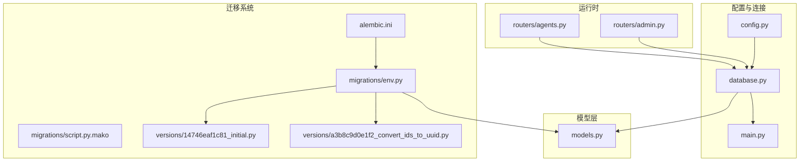
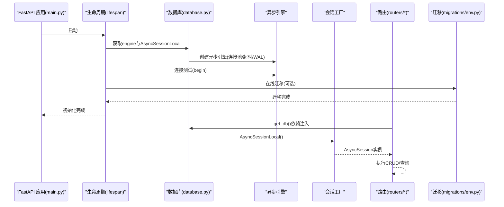
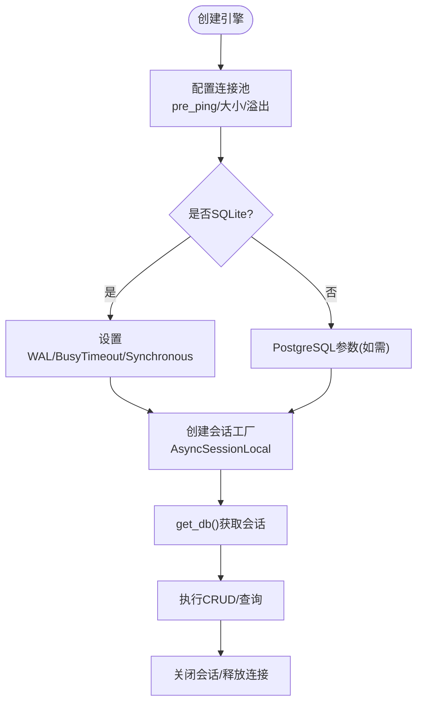
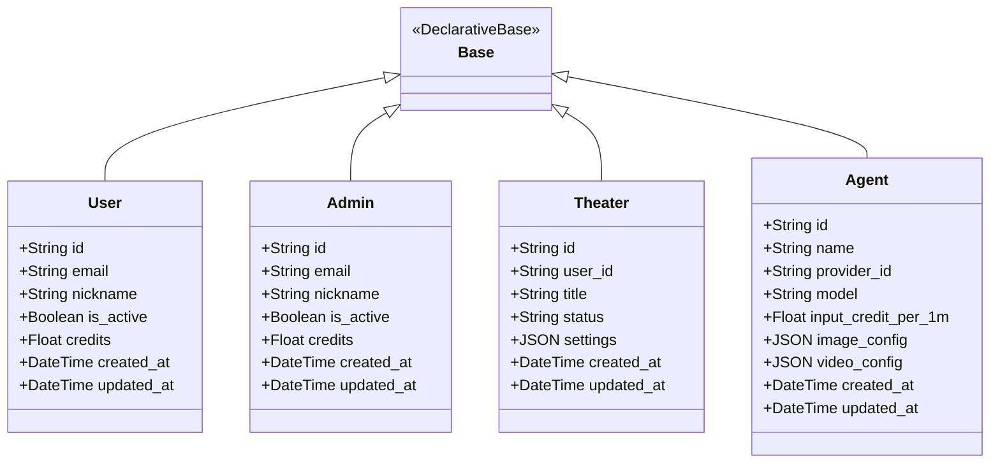
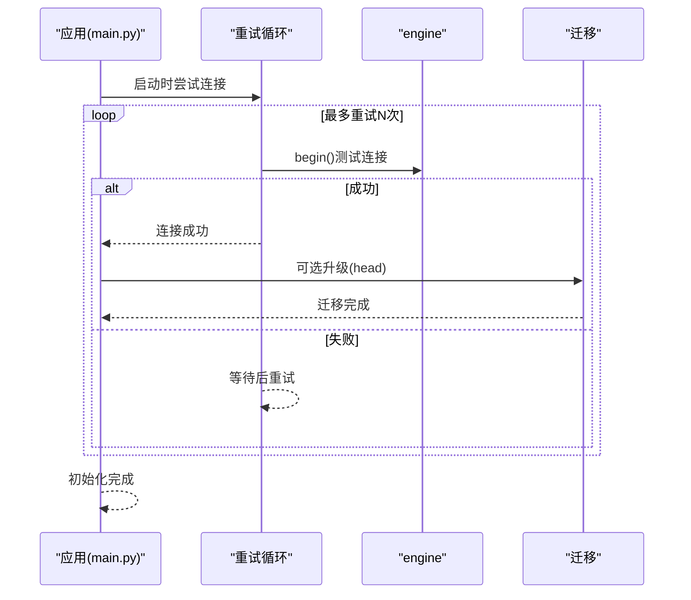
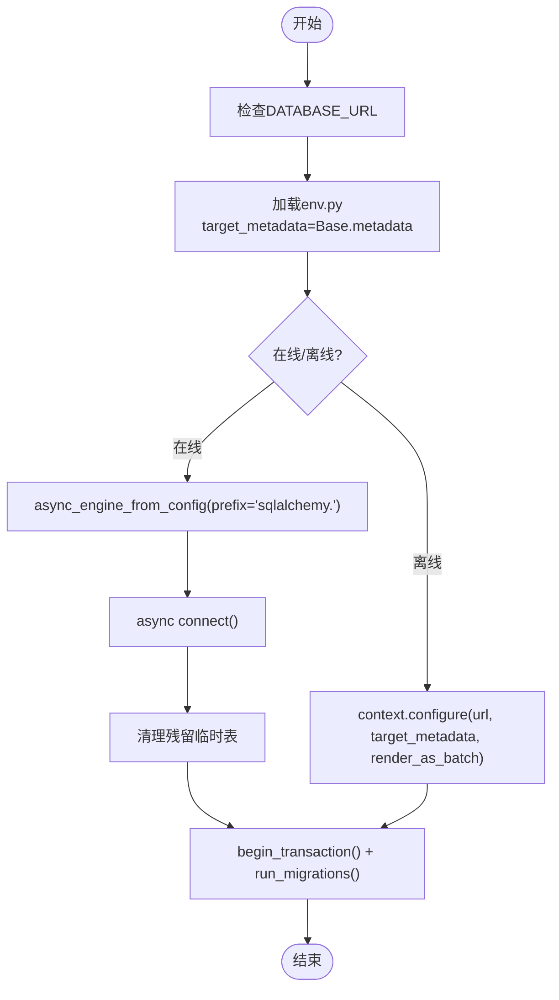
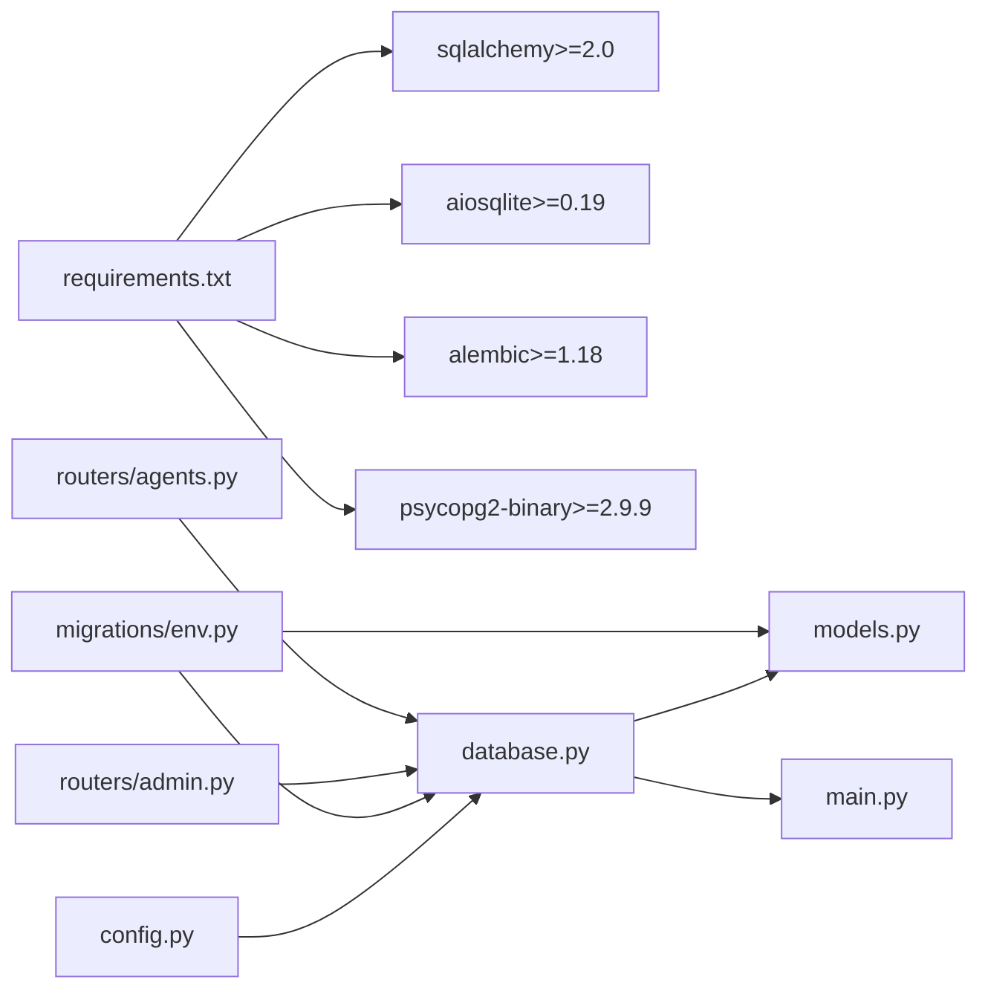

# 数据库配置与连接

<cite>
**本文引用的文件**
- [database.py](file://backend/database.py)
- [models.py](file://backend/models.py)
- [config.py](file://backend/config.py)
- [main.py](file://backend/main.py)
- [manage_db.py](file://backend/manage_db.py)
- [alembic.ini](file://backend/alembic.ini)
- [env.py](file://backend/migrations/env.py)
- [script.py.mako](file://backend/migrations/script.py.mako)
- [14746eaf1c81_initial.py](file://backend/migrations/versions/14746eaf1c81_initial.py)
- [a3b8c9d0e1f2_convert_ids_to_uuid.py](file://backend/migrations/versions/a3b8c9d0e1f2_convert_ids_to_uuid.py)
- [requirements.txt](file://backend/requirements.txt)
- [admin.py](file://backend/routers/admin.py)
- [agents.py](file://backend/routers/agents.py)
</cite>

## 目录
1. [简介](#简介)
2. [项目结构](#项目结构)
3. [核心组件](#核心组件)
4. [架构总览](#架构总览)
5. [详细组件分析](#详细组件分析)
6. [依赖关系分析](#依赖关系分析)
7. [性能考虑](#性能考虑)
8. [故障排查指南](#故障排查指南)
9. [结论](#结论)
10. [附录](#附录)

## 简介
本文件面向KunFlix项目的数据库配置与连接管理，系统性阐述基于SQLAlchemy异步ORM的工程实践，包括：
- 异步引擎与会话工厂的配置与连接池管理
- Base模型基类设计与数据模型规范
- 数据库连接建立、维护与销毁机制（超时、重连、异常处理）
- Alembic迁移系统使用、版本管理与演进策略
- 性能优化建议与并发访问控制方案

目标是帮助开发者在理解现有实现的基础上，安全地进行扩展与维护。

## 项目结构
数据库相关的核心文件分布于backend目录，主要包含：
- 配置与连接：database.py、config.py、main.py
- 数据模型：models.py
- 迁移系统：alembic.ini、migrations/env.py、migrations/script.py.mako、migrations/versions/*
- 迁移管理脚本：manage_db.py
- 依赖声明：requirements.txt
- 路由层使用示例：routers/admin.py、routers/agents.py

图表来源
- [config.py:1-43](file://backend/config.py#L1-L43)
- [database.py:1-45](file://backend/database.py#L1-L45)
- [main.py:1-175](file://backend/main.py#L1-L175)
- [models.py:1-503](file://backend/models.py#L1-L503)
- [alembic.ini:1-115](file://backend/alembic.ini#L1-L115)
- [env.py:1-120](file://backend/migrations/env.py#L1-L120)
- [script.py.mako:1-27](file://backend/migrations/script.py.mako#L1-L27)
- [14746eaf1c81_initial.py:1-56](file://backend/migrations/versions/14746eaf1c81_initial.py#L1-L56)
- [a3b8c9d0e1f2_convert_ids_to_uuid.py:1-335](file://backend/migrations/versions/a3b8c9d0e1f2_convert_ids_to_uuid.py#L1-L335)
- [admin.py:1-200](file://backend/routers/admin.py#L1-L200)
- [agents.py:1-151](file://backend/routers/agents.py#L1-L151)

章节来源
- [config.py:1-43](file://backend/config.py#L1-L43)
- [database.py:1-45](file://backend/database.py#L1-L45)
- [main.py:1-175](file://backend/main.py#L1-L175)
- [models.py:1-503](file://backend/models.py#L1-L503)
- [alembic.ini:1-115](file://backend/alembic.ini#L1-L115)
- [env.py:1-120](file://backend/migrations/env.py#L1-L120)
- [script.py.mako:1-27](file://backend/migrations/script.py.mako#L1-L27)
- [14746eaf1c81_initial.py:1-56](file://backend/migrations/versions/14746eaf1c81_initial.py#L1-L56)
- [a3b8c9d0e1f2_convert_ids_to_uuid.py:1-335](file://backend/migrations/versions/a3b8c9d0e1f2_convert_ids_to_uuid.py#L1-L335)
- [admin.py:1-200](file://backend/routers/admin.py#L1-L200)
- [agents.py:1-151](file://backend/routers/agents.py#L1-L151)

## 核心组件
- 异步引擎与会话工厂
  - 引擎通过异步驱动创建，启用连接池预检查、SQLite WAL模式优化、超时控制等。
  - 会话工厂使用异步会话类，关闭提交后过期行为以避免脏读。
- Base模型基类
  - 统一的DeclarativeBase子类，所有模型继承自它，确保元数据注册与迁移扫描一致。
- 数据模型
  - 定义了用户、管理员、剧场、节点、资产、聊天会话与消息、智能体、订阅计划、视频任务、工具配置与执行日志等实体及关系。
- 配置与环境
  - 通过Pydantic Settings加载环境变量，支持SQLite与PostgreSQL两种数据库URL，默认SQLite便于本地开发。
- 迁移系统
  - Alembic配置与环境脚本，支持在线/离线迁移、批处理渲染、残留临时表清理。
- 运行时生命周期
  - 应用启动时进行数据库连接重试、可选自动迁移、媒体目录初始化等。

章节来源
- [database.py:1-45](file://backend/database.py#L1-L45)
- [models.py:1-503](file://backend/models.py#L1-L503)
- [config.py:1-43](file://backend/config.py#L1-L43)
- [main.py:49-108](file://backend/main.py#L49-L108)
- [env.py:1-120](file://backend/migrations/env.py#L1-L120)

## 架构总览
下图展示了从FastAPI应用到数据库的连接流，以及迁移与模型的关系。

图表来源
- [main.py:49-108](file://backend/main.py#L49-L108)
- [database.py:1-45](file://backend/database.py#L1-L45)
- [env.py:89-120](file://backend/migrations/env.py#L89-L120)

## 详细组件分析

### 异步引擎与会话工厂（AsyncSessionLocal）
- 引擎配置要点
  - 使用异步驱动创建引擎，关闭SQL日志以减少噪声。
  - 启用连接池预检查，提升连接可用性。
  - 设置连接池大小与溢出数量，平衡吞吐与资源占用。
  - SQLite特化：启用WAL模式、busy超时、同步级别，降低锁冲突。
  - SQLite连接超时参数，避免长时间阻塞。
- 会话工厂
  - 绑定引擎，使用异步会话类，关闭提交后过期行为，避免脏读。
- 连接获取
  - 提供异步上下文管理器，确保会话正确释放。

图表来源
- [database.py:9-37](file://backend/database.py#L9-L37)

章节来源
- [database.py:1-45](file://backend/database.py#L1-L45)

### Base模型基类与数据模型设计
- Base基类
  - 统一继承DeclarativeBase，确保所有模型被纳入元数据，供迁移扫描。
- 数据模型设计原则
  - 主键统一使用字符串UUID，长度36，带索引；外键使用相同类型，保持一致性。
  - 时间戳字段使用带时区的DateTime，统一server_default与onupdate。
  - JSON字段用于灵活配置与扩展，如模型成本、配置JSON、元数据等。
  - 大字段使用Text，避免VARCHAR限制。
  - 布尔字段用于状态开关，如is_active、is_leader、is_enabled等。
  - 数值字段采用BigInteger/Float，满足计费与统计需求。
  - 关系映射遵循外键约束，CASCADE删除策略用于级联清理。
- 典型实体
  - 用户与管理员：身份、状态、积分、订阅、登录信息。
  - 剧场与节点/边：画布结构与关系。
  - 资产：媒体资源与元数据。
  - 聊天会话与消息：对话上下文与统计。
  - 智能体：提供商关联、定价、多模态能力、上下文压缩配置。
  - 订阅计划：套餐与价格。
  - 视频任务：异步生成任务追踪。
  - 工具配置与执行日志：工具级别的全局配置与调用记录。

图表来源
- [models.py:10-273](file://backend/models.py#L10-L273)

章节来源
- [models.py:1-503](file://backend/models.py#L1-L503)

### 数据库连接建立、维护与销毁
- 建立
  - 应用启动时进行多次连接重试，确保数据库可用。
  - 可选自动迁移，按配置决定是否在启动时执行。
- 维护
  - 引擎启用pre_ping，自动检测并重连失效连接。
  - SQLite使用WAL模式与超时参数，降低锁竞争。
- 销毁
  - 会话通过上下文管理器自动关闭，连接归还连接池。
  - 应用退出时引擎dispose，释放底层资源。

图表来源
- [main.py:49-108](file://backend/main.py#L49-L108)
- [database.py:9-19](file://backend/database.py#L9-L19)

章节来源
- [main.py:49-108](file://backend/main.py#L49-L108)
- [database.py:1-45](file://backend/database.py#L1-L45)

### Alembic迁移系统使用与演进策略
- 配置与环境
  - alembic.ini定义脚本位置、日志级别、路径前缀等。
  - migrations/env.py导入settings与Base.metadata，支持在线/离线迁移。
  - script.py.mako为模板，生成迁移脚本骨架。
- 版本管理
  - versions目录存放具体迁移脚本，每个脚本包含upgrade与downgrade。
  - 示例：初始版本创建基础表；UUID转换版本对多表进行重建与数据迁移。
- 演进策略
  - 自动迁移：通过manage_db.py或直接调用python -m alembic命令。
  - 批处理渲染：在线迁移使用render_as_batch，兼容SQLite等方言限制。
  - 清理残留临时表：env.py中提供清理逻辑，避免迁移失败后的残留表影响后续操作。

图表来源
- [alembic.ini:1-115](file://backend/alembic.ini#L1-L115)
- [env.py:1-120](file://backend/migrations/env.py#L1-L120)
- [script.py.mako:1-27](file://backend/migrations/script.py.mako#L1-L27)

章节来源
- [alembic.ini:1-115](file://backend/alembic.ini#L1-L115)
- [env.py:1-120](file://backend/migrations/env.py#L1-L120)
- [script.py.mako:1-27](file://backend/migrations/script.py.mako#L1-L27)
- [14746eaf1c81_initial.py:1-56](file://backend/migrations/versions/14746eaf1c81_initial.py#L1-L56)
- [a3b8c9d0e1f2_convert_ids_to_uuid.py:1-335](file://backend/migrations/versions/a3b8c9d0e1f2_convert_ids_to_uuid.py#L1-L335)

### 迁移管理脚本（manage_db.py）
- 功能
  - migrate：基于模型变更生成新版本迁移。
  - upgrade：应用所有待定迁移。
  - downgrade：回退一个版本。
  - seed：执行种子脚本初始化数据。
- 使用
  - 建议在开发环境使用migrate与upgrade，在生产环境谨慎使用downgrade。

章节来源
- [manage_db.py:1-80](file://backend/manage_db.py#L1-L80)

### 路由层中的数据库使用示例
- 依赖注入
  - 路由函数通过Depends(get_db)获取AsyncSession，保证每个请求独立会话。
- 典型操作
  - 查询统计、分页列表、条件过滤、级联删除、事务提交与刷新。

章节来源
- [admin.py:1-200](file://backend/routers/admin.py#L1-L200)
- [agents.py:1-151](file://backend/routers/agents.py#L1-L151)

## 依赖关系分析
- 外部依赖
  - SQLAlchemy 2.x、aiosqlite、asyncpg、alembic、psycopg2-binary等。
- 内部依赖
  - config.settings提供DATABASE_URL；database.py创建engine与AsyncSessionLocal；main.py在生命周期中使用engine与Alembic；routers通过get_db依赖注入会话。

图表来源
- [requirements.txt:1-29](file://backend/requirements.txt#L1-L29)
- [config.py:1-43](file://backend/config.py#L1-L43)
- [database.py:1-45](file://backend/database.py#L1-L45)
- [models.py:1-503](file://backend/models.py#L1-L503)
- [main.py:1-175](file://backend/main.py#L1-L175)
- [env.py:1-120](file://backend/migrations/env.py#L1-L120)
- [admin.py:1-200](file://backend/routers/admin.py#L1-L200)
- [agents.py:1-151](file://backend/routers/agents.py#L1-L151)

章节来源
- [requirements.txt:1-29](file://backend/requirements.txt#L1-L29)
- [config.py:1-43](file://backend/config.py#L1-L43)
- [database.py:1-45](file://backend/database.py#L1-L45)
- [models.py:1-503](file://backend/models.py#L1-L503)
- [main.py:1-175](file://backend/main.py#L1-L175)
- [env.py:1-120](file://backend/migrations/env.py#L1-L120)
- [admin.py:1-200](file://backend/routers/admin.py#L1-L200)
- [agents.py:1-151](file://backend/routers/agents.py#L1-L151)

## 性能考虑
- 连接池与并发
  - 合理设置pool_size与max_overflow，避免过度占用资源。
  - 使用pre_ping提升连接可用性，减少无效连接导致的失败。
- SQLite优化
  - WAL模式提升并发读写能力，减少“database is locked”错误。
  - 适当增大busy_timeout，给其他事务更多等待机会。
- 查询与索引
  - 对常用过滤字段（如email、id、created_at）建立索引，提升查询效率。
  - 分页查询使用offset/limit，避免一次性加载大量数据。
- 事务与批量
  - 批量插入/更新时尽量合并为一次事务，减少往返开销。
- 日志与监控
  - 生产环境建议开启SQL日志但控制级别，便于定位慢查询。
  - 结合数据库性能分析工具，识别热点表与慢语句。

## 故障排查指南
- 连接失败与重试
  - 启动阶段进行多次重试，若仍失败，检查DATABASE_URL与网络连通性。
  - SQLite文件权限与路径问题，确保绝对路径与写入权限。
- 迁移失败
  - 在线迁移可能因方言限制失败，尝试离线迁移或使用批处理渲染。
  - 残留临时表导致迁移卡住，使用env.py中的清理逻辑或手动DROP。
- 会话泄漏
  - 确保每个请求都通过Depends(get_db)获取会话，并在路由处理完成后提交/回滚。
- 超时与锁
  - SQLite busy_timeout不足时，适当提高超时值。
  - 避免长时间持有事务，及时commit/refresh。

章节来源
- [main.py:49-108](file://backend/main.py#L49-L108)
- [env.py:67-87](file://backend/migrations/env.py#L67-L87)
- [database.py:21-31](file://backend/database.py#L21-L31)

## 结论
本项目采用SQLAlchemy异步ORM构建数据库层，结合合理的连接池配置、SQLite优化与Alembic迁移系统，实现了从开发到生产的数据库演进路径。通过统一的Base模型与依赖注入的会话管理，确保了代码的一致性与可维护性。建议在生产环境中进一步完善监控与日志策略，并持续评估连接池参数与查询性能，以支撑更高的并发与更复杂的业务场景。

## 附录
- 常用命令
  - 生成迁移：python manage_db.py migrate "描述"
  - 应用迁移：python manage_db.py upgrade
  - 回退迁移：python manage_db.py downgrade
  - 种子数据：python manage_db.py seed
- 推荐实践
  - 开发环境使用SQLite，生产环境使用PostgreSQL。
  - 迁移前备份数据库，迁移后验证数据完整性。
  - 对高频查询建立索引，定期分析慢查询日志。