# 服务层架构

<cite>
**本文档引用的文件**
- [backend/services/__init__.py](file://backend/services/__init__.py)
- [backend/services/agent_executor.py](file://backend/services/agent_executor.py)
- [backend/services/theater.py](file://backend/services/theater.py)
- [backend/services/chat_generation.py](file://backend/services/chat_generation.py)
- [backend/services/skill_tools.py](file://backend/services/skill_tools.py)
- [backend/services/video_generation.py](file://backend/services/video_generation.py)
- [backend/services/orchestrator.py](file://backend/services/orchestrator.py)
- [backend/services/tool_manager/manager.py](file://backend/services/tool_manager/manager.py)
- [backend/services/billing.py](file://backend/services/billing.py)
- [backend/services/chat_multi_agent.py](file://backend/services/chat_multi_agent.py)
- [backend/services/chat_tool_dispatch.py](file://backend/services/chat_tool_dispatch.py)
- [backend/services/context_compaction.py](file://backend/services/context_compaction.py)
- [backend/routers/chats.py](file://backend/routers/chats.py)
- [backend/routers/agents.py](file://backend/routers/agents.py)
- [backend/main.py](file://backend/main.py)
- [backend/models.py](file://backend/models.py)
</cite>

## 目录
1. [简介](#简介)
2. [项目结构](#项目结构)
3. [核心组件](#核心组件)
4. [架构总览](#架构总览)
5. [详细组件分析](#详细组件分析)
6. [依赖分析](#依赖分析)
7. [性能考虑](#性能考虑)
8. [故障排查指南](#故障排查指南)
9. [结论](#结论)

## 简介
本文件面向KunFlix服务层，系统化梳理业务逻辑层的设计与实现，重点覆盖以下方面：
- 服务类的组织结构与职责边界
- 依赖注入与数据库会话管理
- 业务流程封装与异步处理模式
- 核心服务模块功能与协作关系：AI代理执行服务、剧院管理服务、聊天生成服务、技能管理服务、视频生成服务
- 错误传播与事务管理策略
- 服务扩展点与第三方集成方案
- 性能监控与调试技巧

## 项目结构
服务层位于backend/services目录，采用“按功能域划分”的模块化组织方式，结合工具管理器、计费与上下文压缩等横切关注点，形成清晰的层次化架构。

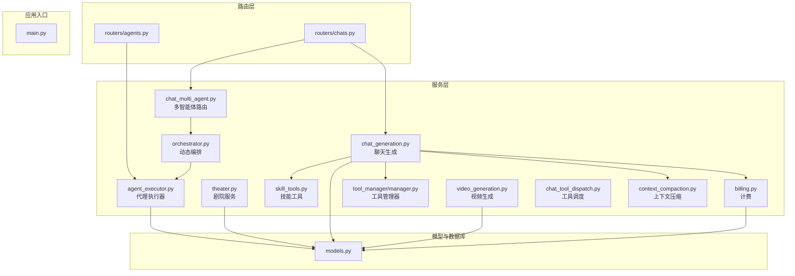

图表来源
- [backend/services/chat_generation.py:1-449](file://backend/services/chat_generation.py#L1-L449)
- [backend/services/chat_multi_agent.py:1-190](file://backend/services/chat_multi_agent.py#L1-L190)
- [backend/services/orchestrator.py:1-914](file://backend/services/orchestrator.py#L1-L914)
- [backend/services/agent_executor.py:1-287](file://backend/services/agent_executor.py#L1-L287)
- [backend/services/theater.py:1-285](file://backend/services/theater.py#L1-L285)
- [backend/services/billing.py:1-388](file://backend/services/billing.py#L1-L388)
- [backend/services/context_compaction.py:1-348](file://backend/services/context_compaction.py#L1-L348)
- [backend/services/tool_manager/manager.py:1-108](file://backend/services/tool_manager/manager.py#L1-L108)
- [backend/services/skill_tools.py:1-130](file://backend/services/skill_tools.py#L1-L130)
- [backend/services/video_generation.py:1-180](file://backend/services/video_generation.py#L1-L180)
- [backend/routers/chats.py:1-232](file://backend/routers/chats.py#L1-L232)
- [backend/routers/agents.py:1-151](file://backend/routers/agents.py#L1-L151)
- [backend/main.py:1-175](file://backend/main.py#L1-L175)
- [backend/models.py:1-503](file://backend/models.py#L1-L503)

章节来源
- [backend/main.py:1-175](file://backend/main.py#L1-L175)
- [backend/routers/chats.py:1-232](file://backend/routers/chats.py#L1-L232)
- [backend/routers/agents.py:1-151](file://backend/routers/agents.py#L1-L151)

## 核心组件
- 代理执行服务（AgentExecutor）：统一对话式LLM调用与流式输出，内置缓存与令牌统计，支持系统提示覆写与直连流式接口。
- 动态编排服务（DynamicOrchestrator）：基于领导智能体的任务分析与子任务编排，支持简单任务直通与复杂任务并行/串行执行。
- 剧院服务（TheaterService）：剧场、节点与边的增删改查与全量同步，支持复制与视口管理。
- 聊天生成服务（generate_single_agent/generate_multi_agent）：单智能体与多智能体对话生成，含工具调用循环、计费、上下文压缩与画布桥接。
- 技能工具服务（skill_tools）：技能索引注入与按需加载，与工具系统并列编排。
- 工具管理器（ToolManager）：集中式工具注册、定义构建与执行分发，支持按轮次增量重建。
- 视频生成服务（video_generation）：多供应商适配器工厂，统一提交与轮询接口。
- 计费服务（billing）：多维度计费与原子扣费，支持退款与余额冻结检测。
- 上下文压缩（context_compaction）：基于阈值的自动摘要压缩，保留系统提示与近期消息。

章节来源
- [backend/services/agent_executor.py:1-287](file://backend/services/agent_executor.py#L1-L287)
- [backend/services/orchestrator.py:1-914](file://backend/services/orchestrator.py#L1-L914)
- [backend/services/theater.py:1-285](file://backend/services/theater.py#L1-L285)
- [backend/services/chat_generation.py:1-449](file://backend/services/chat_generation.py#L1-L449)
- [backend/services/skill_tools.py:1-130](file://backend/services/skill_tools.py#L1-L130)
- [backend/services/tool_manager/manager.py:1-108](file://backend/services/tool_manager/manager.py#L1-L108)
- [backend/services/video_generation.py:1-180](file://backend/services/video_generation.py#L1-L180)
- [backend/services/billing.py:1-388](file://backend/services/billing.py#L1-L388)
- [backend/services/context_compaction.py:1-348](file://backend/services/context_compaction.py#L1-L348)

## 架构总览
服务层围绕“路由层-服务层-模型层”三层展开，路由层负责请求接入与参数校验，服务层封装业务流程与跨域协作，模型层提供数据持久化与关系映射。

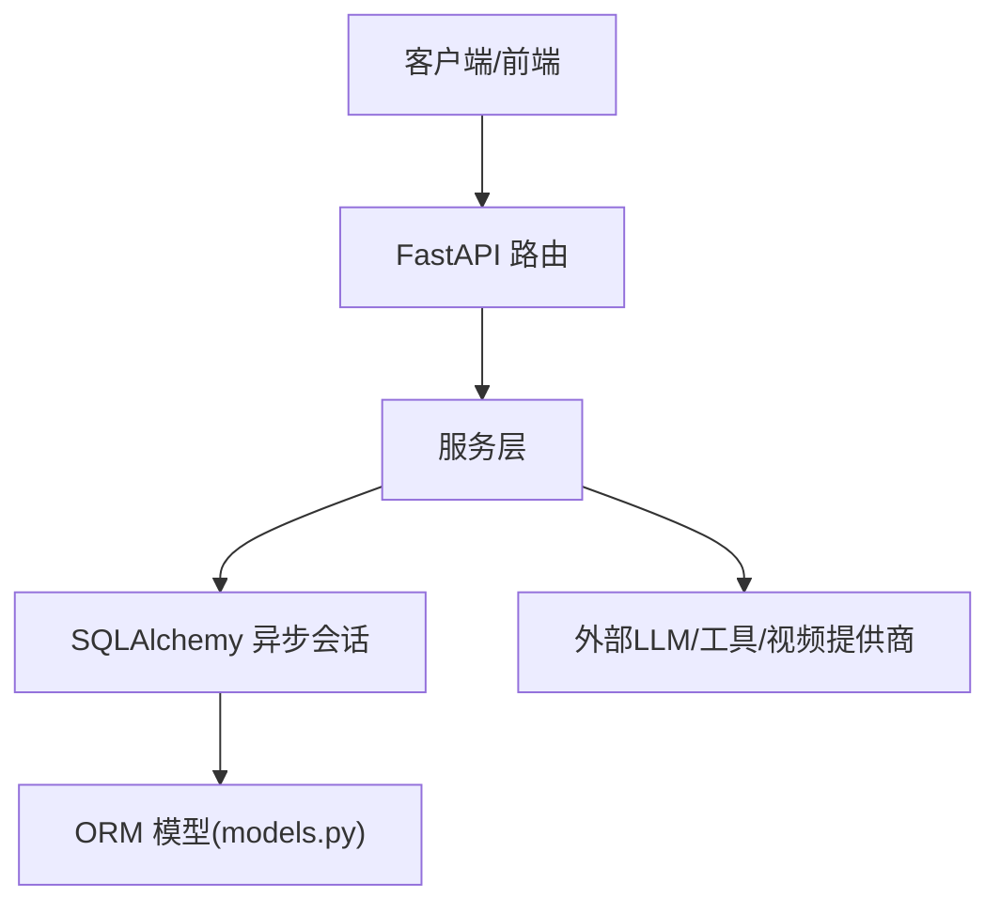

图表来源
- [backend/main.py:1-175](file://backend/main.py#L1-L175)
- [backend/routers/chats.py:1-232](file://backend/routers/chats.py#L1-L232)
- [backend/models.py:1-503](file://backend/models.py#L1-L503)

## 详细组件分析

### 代理执行服务（AgentExecutor）
- 设计要点
  - 统一执行入口：execute与execute_streaming，前者封装对话式调用，后者直连流式接口以获得实时分块。
  - 缓存策略：对模型与对话代理进行缓存，降低重复初始化开销。
  - 令牌统计：从响应元数据提取输入/输出令牌，汇总字符数，便于计费与监控。
  - 系统提示覆写：支持在特定场景（如任务分解）临时替换系统提示。
  - 供应商适配：根据LLMProvider类型选择对应模型类，兼容多种厂商与自建网关。
- 关键流程（非流式执行）

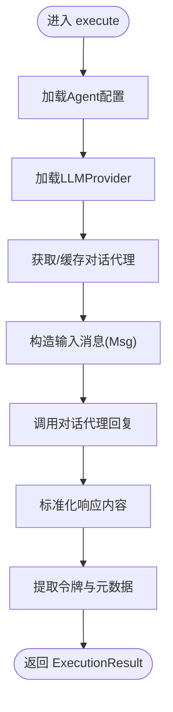

图表来源
- [backend/services/agent_executor.py:74-125](file://backend/services/agent_executor.py#L74-L125)

- 关键流程（流式执行）

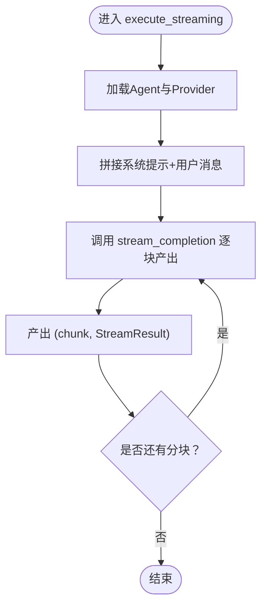

图表来源
- [backend/services/agent_executor.py:127-162](file://backend/services/agent_executor.py#L127-L162)

章节来源
- [backend/services/agent_executor.py:1-287](file://backend/services/agent_executor.py#L1-L287)

### 动态编排服务（DynamicOrchestrator）
- 设计要点
  - 任务分析：领导智能体一次性判断简单/复杂任务，复杂任务生成子任务规格与依赖图。
  - 统一策略：UnifiedStrategy按依赖层级调度，同层并发、串行任务实时流式输出。
  - 事件驱动：通过OrchestrationEvent与SSE向客户端推送进度，包含子任务开始/完成、文本分块、最终结果等。
  - 计费与统计：子任务完成后计算信用消耗并写入数据库。
  - 可选复核：领导智能体对子任务结果进行整合复核。
- 关键流程（多智能体执行）

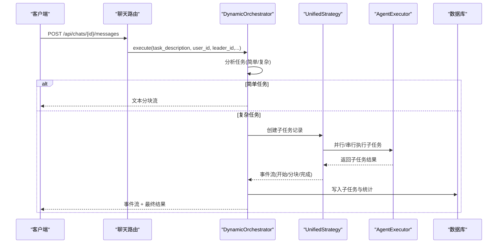

图表来源
- [backend/services/orchestrator.py:418-534](file://backend/services/orchestrator.py#L418-L534)
- [backend/services/orchestrator.py:558-596](file://backend/services/orchestrator.py#L558-L596)
- [backend/services/agent_executor.py:110-135](file://backend/services/agent_executor.py#L110-L135)

章节来源
- [backend/services/orchestrator.py:1-914](file://backend/services/orchestrator.py#L1-L914)

### 剧院服务（TheaterService）
- 设计要点
  - 增删改查：提供剧场、节点、边的CRUD与详情查询。
  - 全量同步：save_canvas使用集合运算识别新增/更新/删除，批量操作提升一致性与性能。
  - 复制剧场：复制包含节点与边，维护源ID到新ID映射以正确重映射边的端点。
  - 权限约束：私有剧场校验归属用户，防止越权访问。
- 关键流程（画布全量同步）

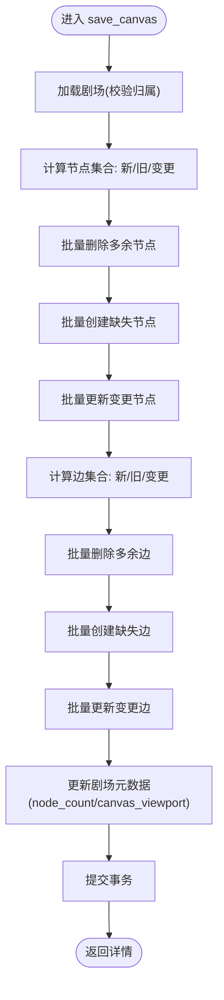

图表来源
- [backend/services/theater.py:108-228](file://backend/services/theater.py#L108-L228)

章节来源
- [backend/services/theater.py:1-285](file://backend/services/theater.py#L1-L285)

### 聊天生成服务（generate_single_agent / generate_multi_agent）
- 设计要点
  - 单智能体：构建消息列表（含系统提示与历史），注入图片上下文，工具定义构建与技能索引注入，工具调用循环，延迟上下文压缩，计费与余额检查，画布图像桥接。
  - 多智能体：根据领导智能体分析结果路由至单智能体或动态编排；支持图片编辑上下文注入与最终消息保存。
  - SSE事件：文本分块、工具调用开始/完成、画布更新、视频任务创建、上下文压缩、计费与完成事件。
- 关键流程（单智能体工具调用循环）

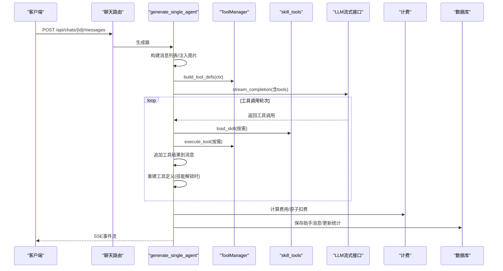

图表来源
- [backend/services/chat_generation.py:29-449](file://backend/services/chat_generation.py#L29-L449)
- [backend/services/chat_tool_dispatch.py:1-120](file://backend/services/chat_tool_dispatch.py#L1-L120)
- [backend/services/skill_tools.py:1-130](file://backend/services/skill_tools.py#L1-L130)
- [backend/services/billing.py:1-388](file://backend/services/billing.py#L1-L388)

章节来源
- [backend/services/chat_generation.py:1-449](file://backend/services/chat_generation.py#L1-L449)
- [backend/services/chat_multi_agent.py:1-190](file://backend/services/chat_multi_agent.py#L1-L190)
- [backend/services/chat_tool_dispatch.py:1-120](file://backend/services/chat_tool_dispatch.py#L1-L120)
- [backend/services/skill_tools.py:1-130](file://backend/services/skill_tools.py#L1-L130)

### 技能工具服务（skill_tools）
- 设计要点
  - 轻量索引：系统提示仅注入技能名称与简述，避免大体积内容。
  - 按需加载：通过load_skill工具在需要时拉取完整技能内容，降低token成本。
  - 枚举约束：工具定义中的技能枚举仅包含当前智能体配置的技能，避免无关技能干扰。
- 关键流程（技能加载）

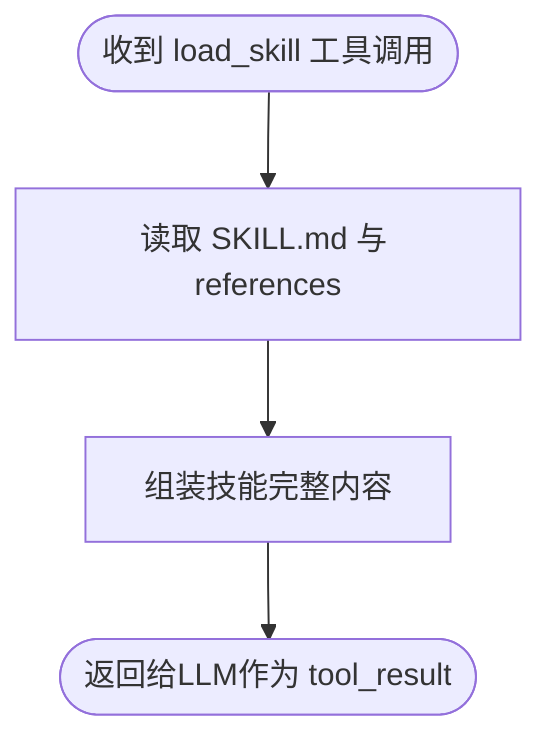

图表来源
- [backend/services/skill_tools.py:73-96](file://backend/services/skill_tools.py#L73-L96)
- [backend/services/skill_tools.py:103-129](file://backend/services/skill_tools.py#L103-L129)

章节来源
- [backend/services/skill_tools.py:1-130](file://backend/services/skill_tools.py#L1-L130)

### 工具管理器（ToolManager）
- 设计要点
  - 注册表：集中管理工具提供者，建立工具名到提供者的O(1)映射。
  - 定义构建：首次构建所有工具定义并缓存；按轮次增量重建受影响片段，减少重复计算。
  - 执行分发：按名称派发到对应提供者，统一记录执行日志。
- 关键流程（工具定义增量重建）

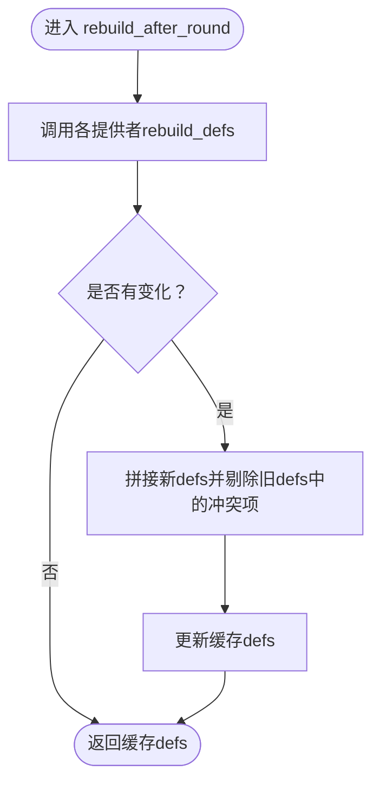

图表来源
- [backend/services/tool_manager/manager.py:54-81](file://backend/services/tool_manager/manager.py#L54-L81)

章节来源
- [backend/services/tool_manager/manager.py:1-108](file://backend/services/tool_manager/manager.py#L1-L108)

### 视频生成服务（video_generation）
- 设计要点
  - 适配器工厂：根据供应商类型选择适配器（xAI、MiniMax、Gemini、Ark）。
  - 统一入口：submit_video_task/poll_video_task封装提交与轮询，MiniMax额外获取视频URL。
  - 类型兼容：保留旧类型别名，提供模型名推断与供应商类型推断辅助函数。
- 关键流程（视频任务提交与轮询）

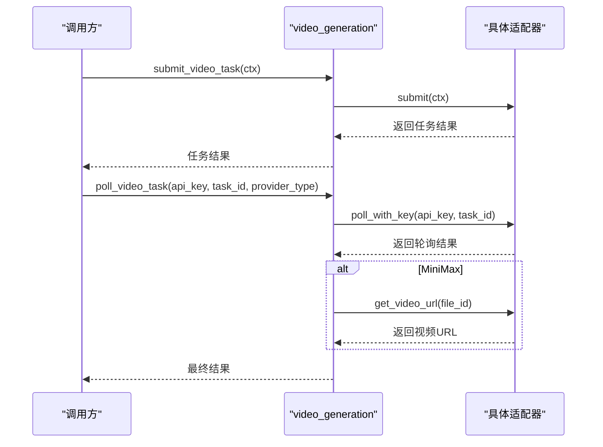

图表来源
- [backend/services/video_generation.py:90-125](file://backend/services/video_generation.py#L90-L125)
- [backend/services/video_generation.py:163-179](file://backend/services/video_generation.py#L163-L179)

章节来源
- [backend/services/video_generation.py:1-180](file://backend/services/video_generation.py#L1-L180)

### 计费服务（billing）
- 设计要点
  - 多维度计费：输入token、文本输出token、图像输出token、搜索次数、图像生成数量等。
  - 原子扣费：使用UPDATE ... WHERE ...确保并发安全，支持余额冻结与不足异常。
  - 退款：原子增加余额并记录交易流水。
- 关键流程（原子扣费）

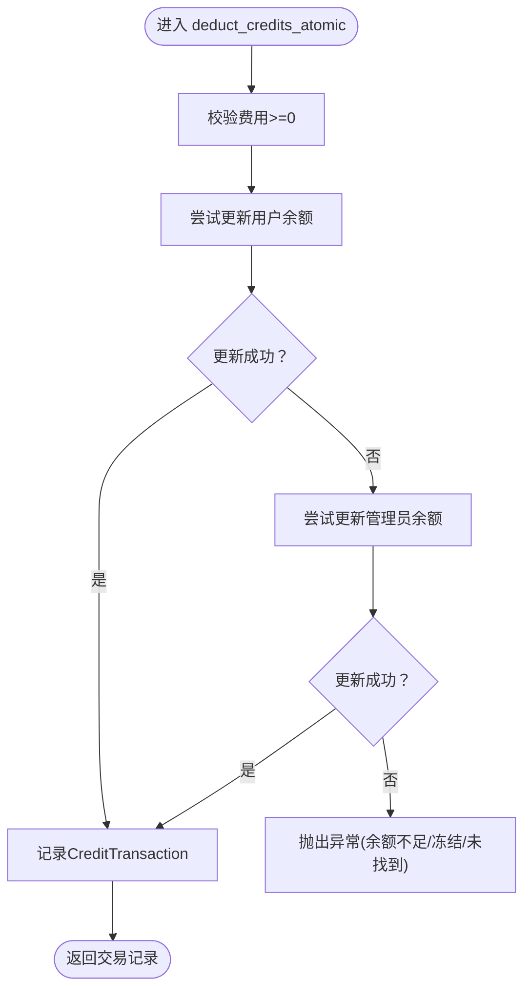

图表来源
- [backend/services/billing.py:178-308](file://backend/services/billing.py#L178-L308)

章节来源
- [backend/services/billing.py:1-388](file://backend/services/billing.py#L1-L388)

### 上下文压缩服务（context_compaction）
- 设计要点
  - 阈值判定：基于上下文窗口与压缩比例估算当前token使用量，决定是否触发压缩。
  - 分割策略：保留系统提示与近期消息，其余消息压缩为摘要。
  - 摘要生成：调用摘要LLM生成高质量总结，支持上次摘要续写。
- 关键流程（上下文压缩主流程）

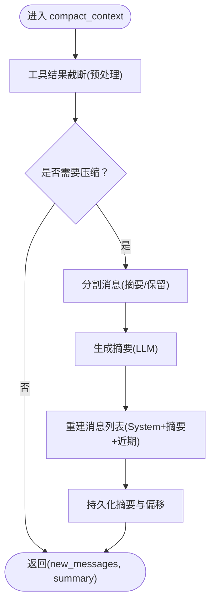

图表来源
- [backend/services/context_compaction.py:239-347](file://backend/services/context_compaction.py#L239-L347)

章节来源
- [backend/services/context_compaction.py:1-348](file://backend/services/context_compaction.py#L1-L348)

## 依赖分析
- 低耦合高内聚：服务间通过明确的接口与事件交互，避免深层依赖链。
- 依赖注入：路由层通过依赖注入获取数据库会话与认证主体，服务层接收AsyncSession作为构造参数，保证测试与可替换性。
- 外部集成：通过LLMProvider与工具/视频适配器实现对多家供应商的解耦。
- 循环依赖规避：服务层内部通过事件与SSE解耦，避免直接互相调用。

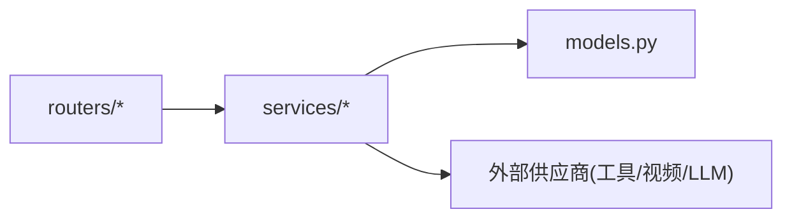

图表来源
- [backend/routers/chats.py:1-232](file://backend/routers/chats.py#L1-L232)
- [backend/services/chat_generation.py:1-449](file://backend/services/chat_generation.py#L1-L449)
- [backend/models.py:1-503](file://backend/models.py#L1-L503)

章节来源
- [backend/routers/chats.py:1-232](file://backend/routers/chats.py#L1-L232)
- [backend/services/__init__.py:1-16](file://backend/services/__init__.py#L1-L16)

## 性能考虑
- 缓存与复用
  - AgentExecutor缓存对话代理与模型实例，减少初始化开销。
  - ToolManager缓存工具定义，按轮次增量重建，避免全量重算。
- 异步与并发
  - 路由层使用异步数据库会话与SSE流式输出，提升吞吐与用户体验。
  - 编排策略在同层并发执行子任务，串行任务采用流式输出。
- 上下文优化
  - 上下文压缩在接近阈值前主动压缩，避免超限导致的失败重试。
- 计费与统计
  - 原子扣费减少锁竞争，计费元数据便于审计与成本分析。

## 故障排查指南
- 余额不足/冻结
  - 现象：扣费阶段抛出InsufficientCreditsError或BalanceFrozenError。
  - 排查：确认用户/管理员余额与冻结状态，检查费率配置与计费维度。
  - 参考
    - [backend/services/billing.py:37-43](file://backend/services/billing.py#L37-L43)
    - [backend/services/billing.py:258-287](file://backend/services/billing.py#L258-L287)
- 供应商不可用
  - 现象：聊天生成器提示供应商不可用。
  - 排查：检查LLMProvider状态与模型可用性，确认base_url与api_key。
  - 参考
    - [backend/services/chat_generation.py:53-55](file://backend/services/chat_generation.py#L53-L55)
- 工具执行异常
  - 现象：工具调用报错或无响应。
  - 排查：查看工具执行日志记录，确认工具名与参数，检查提供者实现。
  - 参考
    - [backend/services/chat_tool_dispatch.py:25-43](file://backend/services/chat_tool_dispatch.py#L25-L43)
- 编排失败
  - 现象：子任务状态异常或事件丢失。
  - 排查：检查子任务依赖图与并行度，确认数据库事务提交顺序。
  - 参考
    - [backend/services/orchestrator.py:521-533](file://backend/services/orchestrator.py#L521-L533)
- 上下文溢出
  - 现象：消息过多导致超限。
  - 排查：调整压缩阈值与保留比例，确认摘要生成是否成功。
  - 参考
    - [backend/services/context_compaction.py:272-284](file://backend/services/context_compaction.py#L272-L284)

章节来源
- [backend/services/billing.py:1-388](file://backend/services/billing.py#L1-L388)
- [backend/services/chat_generation.py:1-449](file://backend/services/chat_generation.py#L1-L449)
- [backend/services/chat_tool_dispatch.py:1-120](file://backend/services/chat_tool_dispatch.py#L1-L120)
- [backend/services/orchestrator.py:1-914](file://backend/services/orchestrator.py#L1-L914)
- [backend/services/context_compaction.py:1-348](file://backend/services/context_compaction.py#L1-L348)

## 结论
KunFlix服务层通过清晰的模块划分与事件驱动的异步架构，实现了从单智能体到多智能体协作的完整对话生成链路。代理执行、动态编排、工具管理、计费与上下文压缩等核心能力相互配合，既保证了业务灵活性，也兼顾了性能与可观测性。建议在生产环境中进一步完善监控指标与告警策略，持续优化上下文压缩阈值与工具定义重建策略，以应对更复杂的业务场景。