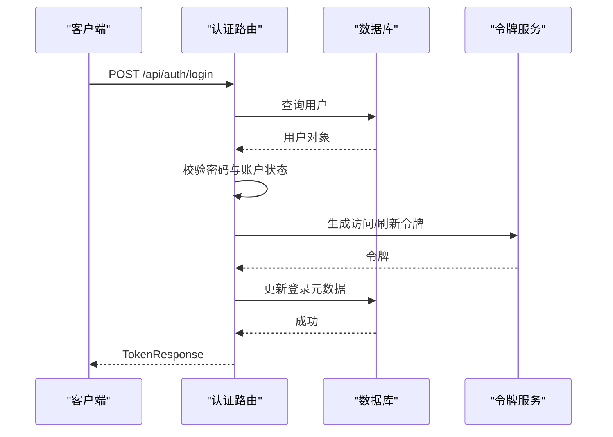
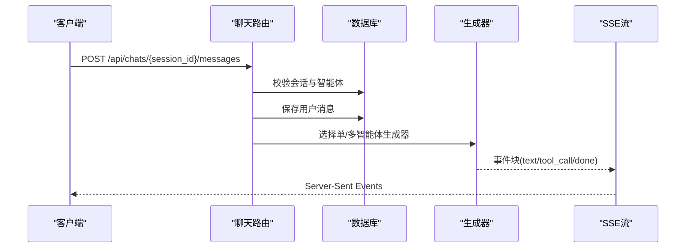
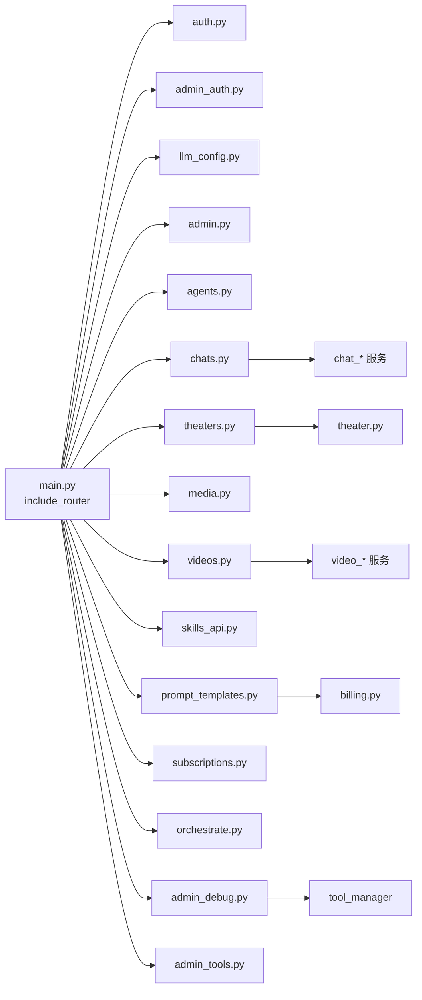

# 路由系统设计

<cite>
**本文档引用的文件**
- [backend/main.py](file://backend/main.py)
- [backend/routers/auth.py](file://backend/routers/auth.py)
- [backend/routers/admin.py](file://backend/routers/admin.py)
- [backend/routers/admin_auth.py](file://backend/routers/admin_auth.py)
- [backend/routers/agents.py](file://backend/routers/agents.py)
- [backend/routers/chats.py](file://backend/routers/chats.py)
- [backend/routers/theaters.py](file://backend/routers/theaters.py)
- [backend/routers/media.py](file://backend/routers/media.py)
- [backend/routers/videos.py](file://backend/routers/videos.py)
- [backend/routers/skills_api.py](file://backend/routers/skills_api.py)
- [backend/routers/prompt_templates.py](file://backend/routers/prompt_templates.py)
- [backend/routers/subscriptions.py](file://backend/routers/subscriptions.py)
- [backend/routers/orchestrate.py](file://backend/routers/orchestrate.py)
- [backend/routers/admin_debug.py](file://backend/routers/admin_debug.py)
- [backend/routers/admin_tools.py](file://backend/routers/admin_tools.py)
- [backend/routers/llm_config.py](file://backend/routers/llm_config.py)
</cite>

## 目录
1. [简介](#简介)
2. [项目结构](#项目结构)
3. [核心组件](#核心组件)
4. [架构总览](#架构总览)
5. [详细组件分析](#详细组件分析)
6. [依赖分析](#依赖分析)
7. [性能考虑](#性能考虑)
8. [故障排除指南](#故障排除指南)
9. [结论](#结论)

## 简介
本文件面向Infinite Game的FastAPI路由系统，系统性梳理各router模块的职责边界、注册机制、参数处理、请求验证、响应格式化与错误处理策略，并补充WebSocket实时通信实现与最佳实践。重点覆盖认证路由(auth_router)、管理路由(admin_router)、AI代理路由(agents_router)、聊天路由(chats_router)、剧院路由(theaters_router)、媒体路由(media_router)、视频路由(videos_router)、技能路由(skills_api_router)、提示词模板路由(prompt_templates_router)、订阅路由(subscriptions_router)、编排路由(orchestrate_router)、管理员调试路由(admin_debug_router)、管理员工具路由(admin_tools_router)、LLM提供商配置路由(llm_config_router)等。

## 项目结构
后端采用FastAPI框架，路由注册集中在入口文件中，按功能域拆分为多个router模块，每个模块负责特定业务域的REST接口与部分WebSocket/SSE能力。整体结构清晰，遵循“按功能域分层”的组织方式。

```mermaid
graph TB
A["应用入口<br/>backend/main.py"] --> B["认证路由<br/>routers/auth.py"]
A --> C["管理员认证路由<br/>routers/admin_auth.py"]
A --> D["LLM提供商配置路由<br/>routers/llm_config.py"]
A --> E["管理路由<br/>routers/admin.py"]
A --> F["AI代理路由<br/>routers/agents.py"]
A --> G["聊天路由<br/>routers/chats.py"]
A --> H["剧院路由<br/>routers/theaters.py"]
A --> I["媒体路由<br/>routers/media.py"]
A --> J["视频路由<br/>routers/videos.py"]
A --> K["技能路由<br/>routers/skills_api.py"]
A --> L["提示词模板路由<br/>routers/prompt_templates.py"]
A --> M["订阅路由<br/>routers/subscriptions.py"]
A --> N["编排路由<br/>routers/orchestrate.py"]
A --> O["管理员调试路由<br/>routers/admin_debug.py"]
A --> P["管理员工具路由<br/>routers/admin_tools.py"]
A --> Q["WebSocket端点<br/>backend/main.py:/ws/{user_id}"]
```

图表来源
- [backend/main.py:138-153](file://backend/main.py#L138-L153)
- [backend/main.py:161-171](file://backend/main.py#L161-L171)

章节来源
- [backend/main.py:138-153](file://backend/main.py#L138-L153)
- [backend/main.py:161-171](file://backend/main.py#L161-L171)

## 核心组件
- 应用生命周期与中间件
  - 数据库连接重试与迁移：启动时自动连接数据库并执行迁移，失败重试最多5次；若迁移失败尝试清理临时表后重试。
  - CORS中间件：允许前端localhost:3000/3001访问。
  - 调试中间件：记录Authorization头与Origin，便于调试鉴权问题。
- 路由注册
  - 通过include_router集中注册全部业务路由，形成统一的API前缀与标签体系。
- WebSocket端点
  - 提供/ws/{user_id}，用于实时双向通信，接收文本消息并回显，异常处理与连接关闭在finally中保证资源释放。

章节来源
- [backend/main.py:49-108](file://backend/main.py#L49-L108)
- [backend/main.py:130-136](file://backend/main.py#L130-L136)
- [backend/main.py:119-128](file://backend/main.py#L119-L128)
- [backend/main.py:138-153](file://backend/main.py#L138-L153)
- [backend/main.py:161-171](file://backend/main.py#L161-L171)

## 架构总览
FastAPI路由系统采用“模块化router + 中间件 + 生命周期钩子”的架构，结合数据库事务与服务层解耦，实现高内聚低耦合的REST API与实时通信能力。

```mermaid
graph TB
subgraph "应用层"
APP["FastAPI应用<br/>backend/main.py"]
WS["WebSocket端点<br/>/ws/{user_id}"]
end
subgraph "路由层"
AUTH["认证路由<br/>/api/auth"]
ADMIN_AUTH["管理员认证路由<br/>/api/admin/auth"]
LLMCFG["LLM提供商配置路由<br/>/api/admin/llm-providers"]
ADMIN["管理路由<br/>/api/admin"]
AGENTS["AI代理路由<br/>/api/agents"]
CHATS["聊天路由<br/>/api/chats"]
THEATERS["剧院路由<br/>/api/theaters"]
MEDIA["媒体路由<br/>/api/media"]
VIDEOS["视频路由<br/>/api/videos"]
SKILLS["技能路由<br/>/api/admin/skills"]
PROMPT["提示词模板路由<br/>/api/prompt-templates"]
SUBS["订阅路由<br/>/api/admin/subscriptions"]
ORCH["编排路由<br/>/api/orchestrate"]
ADBG["管理员调试路由<br/>/api/admin/debug"]
ATLS["管理员工具路由<br/>/api/admin/tools"]
end
subgraph "服务层"
SVC1["聊天服务<br/>chat_generation, chat_multi_agent"]
SVC2["剧院服务<br/>theater.py"]
SVC3["视频服务<br/>video_generation, video_providers"]
SVC4["工具管理<br/>tool_manager"]
SVC5["账单计费<br/>billing.py"]
end
subgraph "数据层"
DB["数据库会话<br/>SQLAlchemy AsyncSession"]
MODELS["ORM模型<br/>models.py"]
end
APP --> AUTH
APP --> ADMIN_AUTH
APP --> LLMCFG
APP --> ADMIN
APP --> AGENTS
APP --> CHATS
APP --> THEATERS
APP --> MEDIA
APP --> VIDEOS
APP --> SKILLS
APP --> PROMPT
APP --> SUBS
APP --> ORCH
APP --> ADBG
APP --> ATLS
APP --> WS
AUTH --> DB
ADMIN_AUTH --> DB
LLMCFG --> DB
ADMIN --> DB
AGENTS --> DB
CHATS --> DB
THEATERS --> DB
MEDIA --> DB
VIDEOS --> DB
SKILLS --> DB
PROMPT --> DB
SUBS --> DB
ORCH --> DB
ADBG --> DB
ATLS --> DB
CHATS --> SVC1
THEATERS --> SVC2
VIDEOS --> SVC3
ADBG --> SVC4
VIDEOS --> SVC5
PROMPT --> SVC5
```

图表来源
- [backend/main.py:138-153](file://backend/main.py#L138-L153)
- [backend/routers/chats.py:13-15](file://backend/routers/chats.py#L13-L15)
- [backend/routers/theaters.py:8](file://backend/routers/theaters.py#L8)
- [backend/routers/videos.py:16-20](file://backend/routers/videos.py#L16-L20)
- [backend/routers/admin_debug.py:26-37](file://backend/routers/admin_debug.py#L26-L37)
- [backend/routers/prompt_templates.py:21](file://backend/routers/prompt_templates.py#L21)

## 详细组件分析

### 认证路由(auth_router) - 用户认证与令牌刷新
- 路由前缀：/api/auth
- 主要端点
  - POST /register：注册新用户，校验邮箱唯一性，哈希密码，写入数据库并返回用户信息。
  - POST /login：邮箱+密码登录，校验凭据与账户状态，更新登录元数据，签发访问/刷新令牌。
  - POST /refresh：使用刷新令牌换取新的访问令牌，校验令牌类型与管理员有效性。
  - GET /me：返回当前认证用户信息。
- 参数处理与验证
  - 使用Pydantic模型进行请求体与响应体的自动验证与序列化。
  - 登录时对密码进行哈希比对，账户禁用时拒绝访问。
- 错误处理
  - 使用HTTPException返回标准错误码与错误信息，如409冲突、401未授权、403禁止访问、404未找到等。
- 响应格式化
  - 使用response_model统一响应结构，确保前后端契约一致。

图表来源
- [backend/routers/auth.py:63-99](file://backend/routers/auth.py#L63-L99)

章节来源
- [backend/routers/auth.py:36-60](file://backend/routers/auth.py#L36-L60)
- [backend/routers/auth.py:63-99](file://backend/routers/auth.py#L63-L99)
- [backend/routers/auth.py:102-129](file://backend/routers/auth.py#L102-L129)
- [backend/routers/auth.py:132-135](file://backend/routers/auth.py#L132-L135)

### 管理员认证路由(admin_auth_router) - 管理员独立认证
- 路由前缀：/api/admin/auth
- 主要端点
  - POST /login：管理员登录，记录IP与时间，签发管理员专属令牌。
  - POST /refresh：管理员刷新令牌，校验令牌类型与管理员有效性。
  - GET /me：返回当前登录管理员信息。
- 特殊点
  - 与用户认证分离，使用独立的Admin模型与令牌主题(subject_type)。

章节来源
- [backend/routers/admin_auth.py:36-90](file://backend/routers/admin_auth.py#L36-L90)
- [backend/routers/admin_auth.py:93-127](file://backend/routers/admin_auth.py#L93-L127)
- [backend/routers/admin_auth.py:130-135](file://backend/routers/admin_auth.py#L130-L135)

### LLM提供商配置路由(llm_config_router) - 供应商管理与连通性测试
- 路由前缀：/api/admin/llm-providers
- 主要端点
  - POST /test-connection：连通性测试，区分视频模型与通用模型，使用不同测试策略。
  - POST/GET/GET/{id}/PUT/{id}/DELETE/{id}：CRUD管理LLM提供商，支持默认供应商切换与激活状态变更。
- 参数处理与验证
  - 使用TestConnectionRequest等模型进行请求体验证。
  - 默认base_url映射与客户端类型选择。
- 错误处理
  - 服务器内部错误捕获并返回友好提示。

章节来源
- [backend/routers/llm_config.py:103-137](file://backend/routers/llm_config.py#L103-L137)
- [backend/routers/llm_config.py:139-166](file://backend/routers/llm_config.py#L139-L166)
- [backend/routers/llm_config.py:168-176](file://backend/routers/llm_config.py#L168-L176)
- [backend/routers/llm_config.py:178-188](file://backend/routers/llm_config.py#L178-L188)
- [backend/routers/llm_config.py:190-219](file://backend/routers/llm_config.py#L190-L219)
- [backend/routers/llm_config.py:221-234](file://backend/routers/llm_config.py#L221-L234)

### 管理路由(admin_router) - 平台运营与审计
- 路由前缀：/api/admin
- 主要功能
  - 仪表盘统计：用户、剧场、资产、供应商、管理员数量。
  - 用户管理：分页列表、详情、删除（级联删除相关数据）。
  - 积分管理：手动调整用户/管理员积分，记录交易流水。
  - 订阅管理：分配/取消用户订阅，自动发放积分。
  - 管理员管理：创建、更新、删除管理员。
  - 剧场管理：分页列出剧场（可按用户过滤）。
- 参数处理与验证
  - 分页参数skip/limit，可选过滤参数。
  - 删除用户时执行级联删除，确保数据一致性。
- 错误处理
  - 未找到实体返回404，删除自身/无效操作返回400。

章节来源
- [backend/routers/admin.py:29-47](file://backend/routers/admin.py#L29-L47)
- [backend/routers/admin.py:53-83](file://backend/routers/admin.py#L53-L83)
- [backend/routers/admin.py:86-113](file://backend/routers/admin.py#L86-L113)
- [backend/routers/admin.py:116-135](file://backend/routers/admin.py#L116-L135)
- [backend/routers/admin.py:141-187](file://backend/routers/admin.py#L141-L187)
- [backend/routers/admin.py:190-214](file://backend/routers/admin.py#L190-L214)
- [backend/routers/admin.py:220-301](file://backend/routers/admin.py#L220-L301)
- [backend/routers/admin.py:307-393](file://backend/routers/admin.py#L307-L393)
- [backend/routers/admin.py:396-415](file://backend/routers/admin.py#L396-L415)
- [backend/routers/admin.py:421-464](file://backend/routers/admin.py#L421-L464)
- [backend/routers/admin.py:470-500](file://backend/routers/admin.py#L470-L500)

### AI代理路由(agents_router) - 智能体生命周期管理
- 路由前缀：/api/agents
- 主要端点
  - POST：创建智能体，校验名称唯一性与供应商/模型可用性。
  - GET：分页列出智能体，支持搜索。
  - GET/{agent_id}：获取智能体详情。
  - PUT/{agent_id}：更新智能体，校验名称唯一性与供应商/模型可用性。
  - DELETE/{agent_id}：删除智能体。
- 参数处理与验证
  - 供应商模型列表兼容JSON数组/字符串，严格校验模型是否在供应商可用列表中。
  - 更新时对名称与供应商/模型变更进行二次校验。
- 错误处理
  - 提供明确的400/404错误与异常栈追踪。

章节来源
- [backend/routers/agents.py:16-64](file://backend/routers/agents.py#L16-L64)
- [backend/routers/agents.py:66-81](file://backend/routers/agents.py#L66-L81)
- [backend/routers/agents.py:83-89](file://backend/routers/agents.py#L83-L89)
- [backend/routers/agents.py:91-136](file://backend/routers/agents.py#L91-L136)
- [backend/routers/agents.py:138-150](file://backend/routers/agents.py#L138-L150)

### 聊天路由(chats_router) - 单智能体与多智能体对话
- 路由前缀：/api/chats
- 主要端点
  - POST：创建会话，校验智能体存在性。
  - GET：分页列出会话，支持agent_id与theater_id过滤。
  - GET/{session_id}：获取会话详情。
  - GET/{session_id}/messages：获取消息列表，反序列化多模态内容与技能/工具调用。
  - POST/{session_id}/messages：发送消息，支持Leader多智能体协作与单智能体模式，返回SSE流。
  - DELETE/{session_id}/messages：清空会话消息并重置累计token。
  - DELETE/{session_id}：删除会话及其消息。
- 参数处理与验证
  - 使用scoped_query进行行级权限隔离，确保用户只能访问自身会话。
  - 多模态消息内容序列化/反序列化，支持技能/工具调用展示。
  - 付费智能体进行积分预检查，余额不足返回402。
- 实时通信
  - 使用StreamingResponse与SSE，逐块推送生成内容，保持长连接。

图表来源
- [backend/routers/chats.py:127-183](file://backend/routers/chats.py#L127-L183)

章节来源
- [backend/routers/chats.py:25-45](file://backend/routers/chats.py#L25-L45)
- [backend/routers/chats.py:48-68](file://backend/routers/chats.py#L48-L68)
- [backend/routers/chats.py:71-82](file://backend/routers/chats.py#L71-L82)
- [backend/routers/chats.py:85-124](file://backend/routers/chats.py#L85-L124)
- [backend/routers/chats.py:127-183](file://backend/routers/chats.py#L127-L183)
- [backend/routers/chats.py:186-211](file://backend/routers/chats.py#L186-L211)
- [backend/routers/chats.py:214-231](file://backend/routers/chats.py#L214-L231)

### 剧院路由(theaters_router) - 剧场画布与场景管理
- 路由前缀：/api/theaters
- 主要端点
  - POST：创建剧场。
  - GET：分页列出当前用户的剧场，支持状态过滤。
  - GET/{theater_id}：获取剧场详情（含节点与边）。
  - PUT/{theater_id}：更新剧场元信息。
  - DELETE/{theater_id}：删除剧场（级联删除节点与边）。
  - PUT/{theater_id}/canvas：保存画布状态（全量同步节点与边）。
  - POST/{theater_id}/duplicate：复制剧场（含所有节点与边）。
- 参数处理与验证
  - 使用TheaterService封装业务逻辑，统一响应模型。
  - 分页参数page/page_size约束范围。
- 错误处理
  - 未找到实体返回404，删除时级联清理。

章节来源
- [backend/routers/theaters.py:20-28](file://backend/routers/theaters.py#L20-L28)
- [backend/routers/theaters.py:31-41](file://backend/routers/theaters.py#L31-L41)
- [backend/routers/theaters.py:44-57](file://backend/routers/theaters.py#L44-L57)
- [backend/routers/theaters.py:60-69](file://backend/routers/theaters.py#L60-L69)
- [backend/routers/theaters.py:72-81](file://backend/routers/theaters.py#L72-L81)
- [backend/routers/theaters.py:84-98](file://backend/routers/theaters.py#L84-L98)
- [backend/routers/theaters.py:101-109](file://backend/routers/theaters.py#L101-L109)

### 媒体路由(media_router) - 文件上传、资源管理与批量图片生成
- 路由前缀：/api/media
- 主要端点
  - POST /upload：上传媒体文件，校验类型与大小，保存至本地并创建Asset记录。
  - GET /assets：分页列出当前用户资源，支持类型筛选。
  - PUT /assets/{asset_id}：更新资源（重命名与/或替换文件）。
  - DELETE /assets/{asset_id}：硬删除资源（数据库记录+文件系统文件）。
  - GET /{filename}：安全提供媒体文件，支持无扩展名回退查找。
  - POST /batch-generate：批量图片生成，支持Gemini与xAI供应商。
- 参数处理与验证
  - 文件类型与大小限制映射表，避免if-else分支。
  - MIME分类与扩展名映射，统一响应URL。
  - 批量生成处理器映射表，按供应商类型分发。
- 错误处理
  - 400/404/413等错误码与详细错误信息。

章节来源
- [backend/routers/media.py:95-148](file://backend/routers/media.py#L95-L148)
- [backend/routers/media.py:155-184](file://backend/routers/media.py#L155-L184)
- [backend/routers/media.py:187-239](file://backend/routers/media.py#L187-L239)
- [backend/routers/media.py:242-265](file://backend/routers/media.py#L242-L265)
- [backend/routers/media.py:272-298](file://backend/routers/media.py#L272-L298)
- [backend/routers/media.py:301-331](file://backend/routers/media.py#L301-L331)
- [backend/routers/media.py:338-437](file://backend/routers/media.py#L338-L437)

### 视频路由(videos_router) - 视频生成任务与状态轮询
- 路由前缀：/api/videos
- 主要端点
  - GET：分页查询视频任务列表，支持多维度过滤。
  - POST：提交视频生成任务，创建VideoTask记录并提交到供应商。
  - GET/{task_id}/status：轮询任务状态，超时保护与失败判定，完成后下载视频并计费。
  - GET /session/{session_id}：获取会话的视频任务列表。
  - GET /model-capabilities/{model_name}：获取指定视频模型的能力配置。
  - DELETE/{task_id}：删除已完成/失败的任务及其本地视频文件。
- 参数处理与验证
  - 行级隔离scoped_query，防止越权访问。
  - 供应商类型推断与适配器路由。
  - 本地视频保存与URL回写。
- 错误处理
  - 404/400/502等错误码，超时判定与失败归因。

章节来源
- [backend/routers/videos.py:27-72](file://backend/routers/videos.py#L27-L72)
- [backend/routers/videos.py:75-147](file://backend/routers/videos.py#L75-L147)
- [backend/routers/videos.py:150-233](file://backend/routers/videos.py#L150-L233)
- [backend/routers/videos.py:236-249](file://backend/routers/videos.py#L236-L249)
- [backend/routers/videos.py:252-260](file://backend/routers/videos.py#L252-L260)
- [backend/routers/videos.py:267-298](file://backend/routers/videos.py#L267-L298)

### 技能路由(skills_api_router) - 技能管理与启用/禁用
- 路由前缀：/api/admin/skills
- 主要端点
  - GET：列出所有技能与状态。
  - GET/{skill_name}：获取技能详情（含原始markdown内容）。
  - POST：创建自定义技能，可自动启用。
  - PUT/{skill_name}：更新技能内容，必要时重新启用。
  - DELETE/{skill_name}：删除自定义技能（内置技能不可删除）。
  - POST/{skill_name}/toggle：切换技能启用状态。
- 参数处理与验证
  - 使用frontmatter解析与组装SKILL.md。
  - 名称正则校验与版本提取。
- 错误处理
  - 404/400/403等错误码与详细提示。

章节来源
- [backend/routers/skills_api.py:123-128](file://backend/routers/skills_api.py#L123-L128)
- [backend/routers/skills_api.py:131-137](file://backend/routers/skills_api.py#L131-L137)
- [backend/routers/skills_api.py:140-152](file://backend/routers/skills_api.py#L140-L152)
- [backend/routers/skills_api.py:155-169](file://backend/routers/skills_api.py#L155-L169)
- [backend/routers/skills_api.py:172-186](file://backend/routers/skills_api.py#L172-L186)
- [backend/routers/skills_api.py:190-206](file://backend/routers/skills_api.py#L190-L206)

### 提示词模板路由(prompt_templates_router) - 模板渲染与AI生成
- 路由前缀：/api/prompt-templates
- 主要端点
  - POST/GET/GET/{id}/PUT/{id}/DELETE/{id}：模板CRUD，支持默认模板切换。
  - POST/{id}/generate：使用模板渲染提示词，选择智能体，调用LLM生成并返回JSON结果，执行积分扣减。
- 参数处理与验证
  - Jinja2模板渲染变量替换，错误捕获与提示。
  - 默认智能体选择与可用性校验。
- 错误处理
  - 404/400/500等错误码，JSON解析失败与计费异常处理。

章节来源
- [backend/routers/prompt_templates.py:32-58](file://backend/routers/prompt_templates.py#L32-L58)
- [backend/routers/prompt_templates.py:61-83](file://backend/routers/prompt_templates.py#L61-L83)
- [backend/routers/prompt_templates.py:86-96](file://backend/routers/prompt_templates.py#L86-L96)
- [backend/routers/prompt_templates.py:99-138](file://backend/routers/prompt_templates.py#L99-L138)
- [backend/routers/prompt_templates.py:141-154](file://backend/routers/prompt_templates.py#L141-L154)
- [backend/routers/prompt_templates.py:157-292](file://backend/routers/prompt_templates.py#L157-L292)

### 订阅路由(subscriptions_router) - 订阅套餐管理
- 路由前缀：/api/admin/subscriptions
- 主要端点
  - POST/GET/GET/{id}/PUT/{id}/DELETE/{id}：订阅套餐CRUD，名称唯一性校验。
- 参数处理与验证
  - 排序字段sort_order与创建时间组合排序。
- 错误处理
  - 404/400等错误码。

章节来源
- [backend/routers/subscriptions.py:21-37](file://backend/routers/subscriptions.py#L21-L37)
- [backend/routers/subscriptions.py:40-51](file://backend/routers/subscriptions.py#L40-L51)
- [backend/routers/subscriptions.py:54-66](file://backend/routers/subscriptions.py#L54-L66)
- [backend/routers/subscriptions.py:69-100](file://backend/routers/subscriptions.py#L69-L100)
- [backend/routers/subscriptions.py:103-118](file://backend/routers/subscriptions.py#L103-L118)

### 编排路由(orchestrate_router) - 多智能体协作编排
- 路由前缀：/api/orchestrate
- 主要端点
  - POST：执行多智能体编排任务，返回SSE流，实时进度事件。
  - GET/{task_execution_id}：获取任务执行详情与子任务列表。
  - GET：分页列出当前用户任务执行记录。
  - DELETE/{task_execution_id}：取消运行中的任务。
- 参数处理与验证
  - 信用额度检查，余额不足返回402。
  - 任务状态校验与取消逻辑。
- 实时通信
  - 使用StreamingResponse与SSE事件流，事件类型与数据结构标准化。

章节来源
- [backend/routers/orchestrate.py:26-70](file://backend/routers/orchestrate.py#L26-L70)
- [backend/routers/orchestrate.py:73-106](file://backend/routers/orchestrate.py#L73-L106)
- [backend/routers/orchestrate.py:109-144](file://backend/routers/orchestrate.py#L109-L144)
- [backend/routers/orchestrate.py:148-182](file://backend/routers/orchestrate.py#L148-L182)

### 管理员调试路由(admin_debug_router) - 独立调试会话与工具链路
- 路由前缀：/api/admin/debug
- 主要端点
  - 会话管理：POST/GET/GET/{id}/DELETE/{id}。
  - 消息管理：GET/{id}/messages，POST/{id}/messages（SSE流）。
  - 多智能体与单智能体两种调试模式，支持上下文压缩、工具调用、技能加载、计费统计。
- 参数处理与验证
  - scoped_query隔离管理员调试会话。
  - 工具配置与技能系统注入到system prompt。
- 实时通信
  - SSE事件流，包含tool_call/skill_call/done/error等事件类型。

章节来源
- [backend/routers/admin_debug.py:50-70](file://backend/routers/admin_debug.py#L50-L70)
- [backend/routers/admin_debug.py:73-91](file://backend/routers/admin_debug.py#L73-L91)
- [backend/routers/admin_debug.py:94-108](file://backend/routers/admin_debug.py#L94-L108)
- [backend/routers/admin_debug.py:111-153](file://backend/routers/admin_debug.py#L111-L153)
- [backend/routers/admin_debug.py:156-198](file://backend/routers/admin_debug.py#L156-L198)
- [backend/routers/admin_debug.py:201-276](file://backend/routers/admin_debug.py#L201-L276)
- [backend/routers/admin_debug.py:278-510](file://backend/routers/admin_debug.py#L278-L510)
- [backend/routers/admin_debug.py:573-593](file://backend/routers/admin_debug.py#L573-L593)

### 管理员工具路由(admin_tools_router) - 工具注册表与统计
- 路由前缀：/api/admin/tools
- 主要端点
  - GET /registry：返回系统工具注册表。
  - GET /agent-usage：返回每个Agent的工具配置概览。
  - GET /stats：返回工具执行统计数据（总数、错误数、平均耗时、按工具/供应商分组）。
  - GET /executions：分页查询工具执行日志，支持多维度过滤。
  - GET /image-capabilities /video-capabilities：返回图像/视频供应商能力描述。
  - GET/GET/{tool_name} /PUT/{tool_name}：工具配置管理（全局级别）。
- 参数处理与验证
  - 动态过滤映射表消除if链，提升可维护性。
  - 分页参数限制最大值。
- 错误处理
  - 未找到配置返回404。

章节来源
- [backend/routers/admin_tools.py:29-35](file://backend/routers/admin_tools.py#L29-L35)
- [backend/routers/admin_tools.py:42-67](file://backend/routers/admin_tools.py#L42-L67)
- [backend/routers/admin_tools.py:74-128](file://backend/routers/admin_tools.py#L74-L128)
- [backend/routers/admin_tools.py:135-187](file://backend/routers/admin_tools.py#L135-L187)
- [backend/routers/admin_tools.py:194-211](file://backend/routers/admin_tools.py#L194-L211)
- [backend/routers/admin_tools.py:218-272](file://backend/routers/admin_tools.py#L218-L272)

## 依赖分析
- 路由注册依赖
  - main.py集中include_router，确保路由前缀与标签一致，避免重复与冲突。
- 服务层依赖
  - 聊天路由依赖chat_generation与chat_multi_agent服务，剧院路由依赖theater服务，视频路由依赖video_generation与video_providers，管理员调试路由依赖tool_manager与orchestrator，提示词模板路由依赖llm_stream与billing。
- 数据层依赖
  - 所有路由均通过Depends(get_db)获取AsyncSession，确保事务一致性与行级权限隔离。

图表来源
- [backend/main.py:138-153](file://backend/main.py#L138-L153)
- [backend/routers/chats.py:13-15](file://backend/routers/chats.py#L13-L15)
- [backend/routers/theaters.py:8](file://backend/routers/theaters.py#L8)
- [backend/routers/videos.py:16-20](file://backend/routers/videos.py#L16-L20)
- [backend/routers/admin_debug.py:26-37](file://backend/routers/admin_debug.py#L26-L37)
- [backend/routers/prompt_templates.py:21](file://backend/routers/prompt_templates.py#L21)

章节来源
- [backend/main.py:138-153](file://backend/main.py#L138-L153)
- [backend/routers/chats.py:13-15](file://backend/routers/chats.py#L13-L15)
- [backend/routers/theaters.py:8](file://backend/routers/theaters.py#L8)
- [backend/routers/videos.py:16-20](file://backend/routers/videos.py#L16-L20)
- [backend/routers/admin_debug.py:26-37](file://backend/routers/admin_debug.py#L26-L37)
- [backend/routers/prompt_templates.py:21](file://backend/routers/prompt_templates.py#L21)

## 性能考虑
- 数据库连接与迁移
  - 启动阶段重试与迁移失败清理，减少冷启动失败风险。
- 路由注册与中间件
  - CORS与调试中间件仅在开发/调试场景启用，生产环境建议收紧CORS白名单。
- SSE与流式响应
  - 聊天与编排均使用SSE，注意浏览器与代理的缓冲与keep-alive配置，避免Nginx/CDN缓存SSE。
- 文件上传与存储
  - 媒体路由对文件类型与大小进行严格限制，避免过大文件占用磁盘与带宽。
- 供应商调用
  - 视频路由对供应商类型进行推断与适配，批量生成路由映射表降低分支判断成本。
- 计费与积分
  - 提示词模板与视频路由均进行原子扣费，避免并发导致的余额不一致。

## 故障排除指南
- 认证与权限
  - 401/403：检查Authorization头与令牌类型，确认用户/管理员状态有效。
  - 404：检查实体ID是否存在，确认行级权限隔离是否正确。
- 数据库连接
  - 启动失败：查看重试日志与迁移错误，必要时清理残留临时表后重试。
- SSE与WebSocket
  - 无法接收事件：检查代理配置与网络延迟，确认客户端SSE/WS连接状态。
- 文件上传
  - 413：检查文件类型与大小限制，确认前端上传控件与后端配置一致。
- 供应商连通性
  - 测试失败：核对API Key、Base URL与模型名称，区分视频模型与通用模型的测试策略。

章节来源
- [backend/main.py:49-108](file://backend/main.py#L49-L108)
- [backend/routers/media.py:117-123](file://backend/routers/media.py#L117-L123)
- [backend/routers/llm_config.py:103-137](file://backend/routers/llm_config.py#L103-L137)

## 结论
Infinite Game的路由系统以FastAPI为核心，采用模块化设计与严格的参数/验证/错误处理机制，结合SSE与WebSocket实现实时交互。通过服务层解耦与数据库事务管理，系统在可维护性、可扩展性与性能方面达到良好平衡。建议在生产环境中进一步完善CORS策略、SSE代理配置与监控告警，持续优化供应商调用与计费流程。