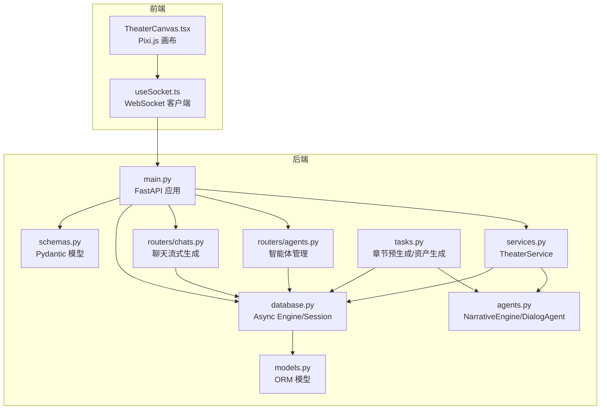
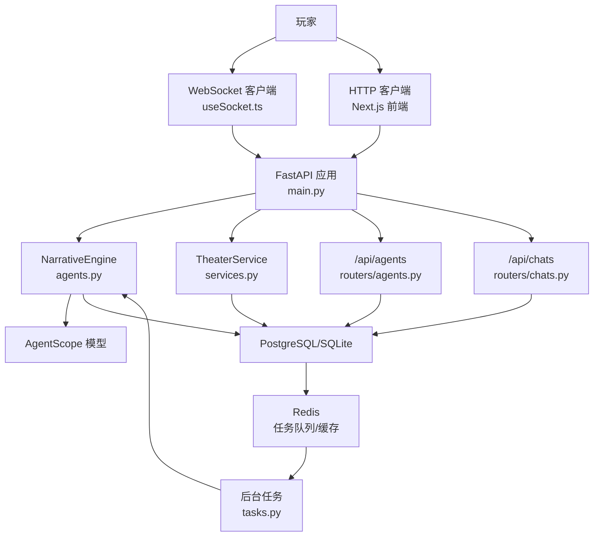
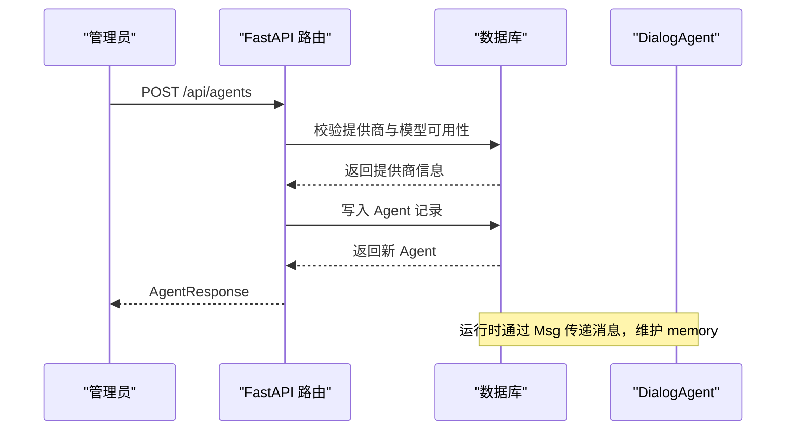
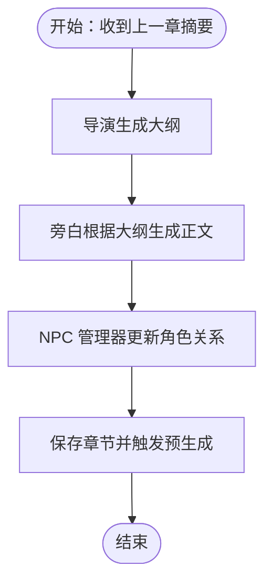
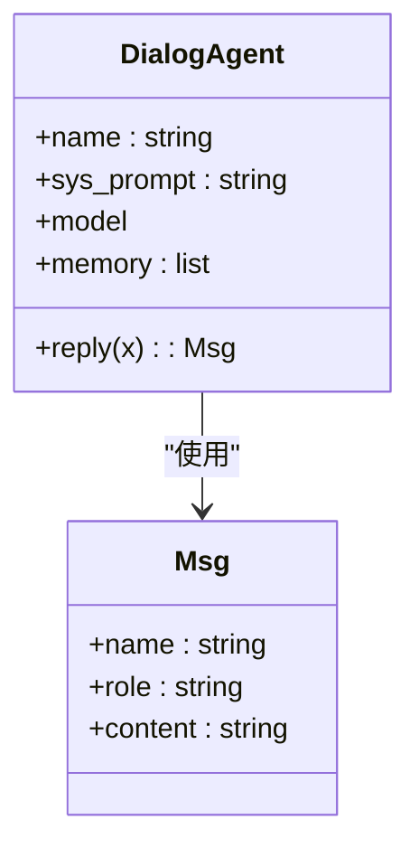
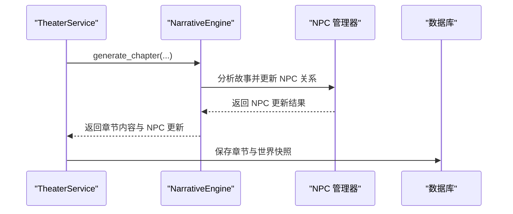
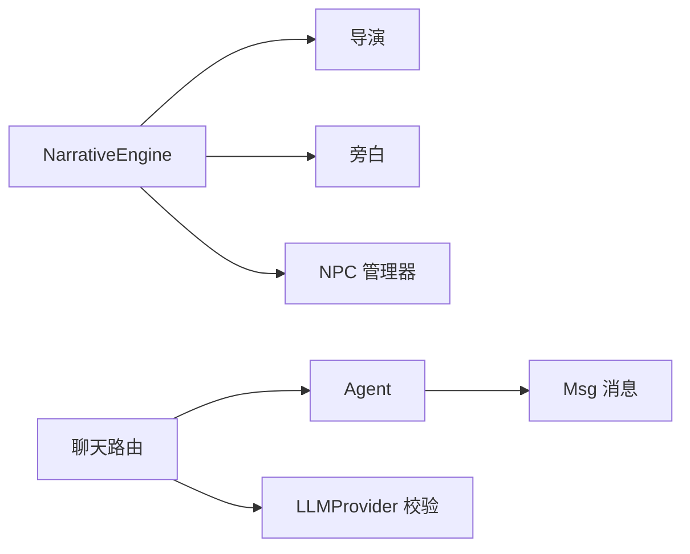
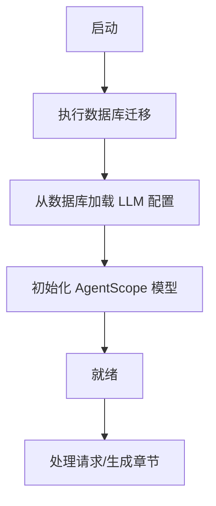
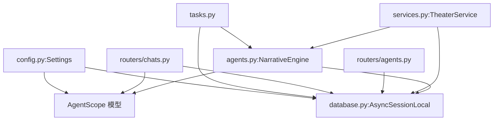

# 多智能体叙事引擎架构

<cite>
**本文引用的文件**
- [backend/main.py](file://backend/main.py)
- [backend/agents.py](file://backend/agents.py)
- [backend/models.py](file://backend/models.py)
- [backend/services.py](file://backend/services.py)
- [backend/config.py](file://backend/config.py)
- [backend/database.py](file://backend/database.py)
- [backend/schemas.py](file://backend/schemas.py)
- [backend/routers/agents.py](file://backend/routers/agents.py)
- [backend/routers/chats.py](file://backend/routers/chats.py)
- [backend/tasks.py](file://backend/tasks.py)
- [frontend/src/hooks/useSocket.ts](file://frontend/src/hooks/useSocket.ts)
- [frontend/src/components/TheaterCanvas.tsx](file://frontend/src/components/TheaterCanvas.tsx)
- [docs/wiki/Architecture.md](file://docs/wiki/Architecture.md)
- [README.md](file://README.md)
</cite>

## 目录
1. [引言](#引言)
2. [项目结构](#项目结构)
3. [核心组件](#核心组件)
4. [架构总览](#架构总览)
5. [详细组件分析](#详细组件分析)
6. [依赖关系分析](#依赖关系分析)
7. [性能考量](#性能考量)
8. [故障排查指南](#故障排查指南)
9. [结论](#结论)
10. [附录](#附录)

## 引言
本文件面向“无限剧情剧场多智能体叙事引擎”的架构与实现，围绕以下目标展开：  
- 深入解释基于 AgentScope 的智能体集成架构，包括智能体注册机制、消息传递协议与状态同步策略；  
- 详细描述导演Agent的核心职责（故事线规划、场景调度、冲突解决）；  
- 分析叙述Agent的文本生成能力（上下文理解、风格控制、质量评估）；  
- 解释NPC管理Agent的行为树设计、对话系统与情感建模；  
- 总结智能体间的协作机制、资源共享策略与冲突避免算法；  
- 提供智能体配置管理、动态加载机制与性能优化方案。

该系统采用前后端分离架构：后端以 FastAPI + AgentScope + PostgreSQL/Redis 为核心，前端以 Next.js/Pixi.js 提供实时交互与可视化；同时提供独立的后台管理面板用于 LLM 提供商与智能体配置管理。

**章节来源**
- [README.md](file://README.md#L1-L141)
- [docs/wiki/Architecture.md](file://docs/wiki/Architecture.md#L1-L62)

## 项目结构
后端采用分层与按功能模块组织：  
- 入口与生命周期：FastAPI 应用、CORS、路由注册、数据库迁移与启动事件  
- 核心引擎：NarrativeEngine（导演/旁白/NPC管理器）  
- 业务服务：TheaterService（玩家初始化、世界设定、章节生成）  
- 数据访问：SQLAlchemy 异步 ORM、模型与路由  
- 配置与连接：数据库引擎、设置、会话管理  
- 路由与接口：智能体管理、聊天会话流式生成  
- 任务与资产：章节预生成、异步资产生成  
- 前端：WebSocket 客户端钩子、2D 渲染画布

**图表来源**
- [backend/main.py](file://backend/main.py#L83-L173)
- [backend/agents.py](file://backend/agents.py#L43-L196)
- [backend/services.py](file://backend/services.py#L8-L66)
- [backend/database.py](file://backend/database.py#L1-L31)
- [backend/models.py](file://backend/models.py#L1-L122)
- [backend/schemas.py](file://backend/schemas.py#L1-L102)
- [backend/routers/agents.py](file://backend/routers/agents.py#L1-L141)
- [backend/routers/chats.py](file://backend/routers/chats.py#L1-L275)
- [backend/tasks.py](file://backend/tasks.py#L1-L62)
- [frontend/src/hooks/useSocket.ts](file://frontend/src/hooks/useSocket.ts#L1-L43)
- [frontend/src/components/TheaterCanvas.tsx](file://frontend/src/components/TheaterCanvas.tsx#L1-L50)

**章节来源**
- [backend/main.py](file://backend/main.py#L1-L173)
- [backend/agents.py](file://backend/agents.py#L1-L196)
- [backend/services.py](file://backend/services.py#L1-L66)
- [backend/database.py](file://backend/database.py#L1-L31)
- [backend/models.py](file://backend/models.py#L1-L122)
- [backend/schemas.py](file://backend/schemas.py#L1-L102)
- [backend/routers/agents.py](file://backend/routers/agents.py#L1-L141)
- [backend/routers/chats.py](file://backend/routers/chats.py#L1-L275)
- [backend/tasks.py](file://backend/tasks.py#L1-L62)
- [frontend/src/hooks/useSocket.ts](file://frontend/src/hooks/useSocket.ts#L1-L43)
- [frontend/src/components/TheaterCanvas.tsx](file://frontend/src/components/TheaterCanvas.tsx#L1-L50)

## 核心组件
- NarrativeEngine：负责从数据库加载 LLM 提供商配置，初始化 AgentScope 模型，创建导演、旁白、NPC 管理器等智能体，并协调章节生成流程。  
- DialogAgent：封装 AgentScope 的对话智能体，维护系统提示词与对话记忆，统一消息格式与回复结构。  
- TheaterService：封装业务逻辑，负责玩家初始化、世界设定生成、章节生成与保存、玩家选择处理占位。  
- 数据模型：Player、StoryChapter、LLMProvider、Agent、ChatSession、ChatMessage 等，支撑玩家状态、剧情分支、提供商配置与聊天历史。  
- 路由与接口：智能体 CRUD、聊天会话与消息流式生成、WebSocket 推送入口。  
- 任务与资产：章节预生成与异步资产生成，提升响应速度与用户体验。  

**章节来源**
- [backend/agents.py](file://backend/agents.py#L43-L196)
- [backend/services.py](file://backend/services.py#L8-L66)
- [backend/models.py](file://backend/models.py#L9-L122)
- [backend/routers/agents.py](file://backend/routers/agents.py#L1-L141)
- [backend/routers/chats.py](file://backend/routers/chats.py#L1-L275)
- [backend/tasks.py](file://backend/tasks.py#L1-L62)

## 架构总览
系统采用“前端-后端-外部服务”三层协作：  
- 前端通过 WebSocket 与 HTTP 与后端交互；  
- 后端通过 AgentScope 调用 LLM 提供商（OpenAI、DashScope 等），并结合 PostgreSQL/Redis 进行数据持久化与任务队列；  
- 后台管理面板用于配置 LLM 提供商与智能体参数，支持动态切换与测试。

**图表来源**
- [docs/wiki/Architecture.md](file://docs/wiki/Architecture.md#L1-L62)
- [backend/main.py](file://backend/main.py#L83-L173)
- [backend/agents.py](file://backend/agents.py#L43-L196)
- [backend/services.py](file://backend/services.py#L8-L66)
- [backend/routers/agents.py](file://backend/routers/agents.py#L1-L141)
- [backend/routers/chats.py](file://backend/routers/chats.py#L1-L275)
- [backend/tasks.py](file://backend/tasks.py#L1-L62)

## 详细组件分析

### 智能体注册与消息传递协议
- 注册机制：通过 /api/agents 路由实现智能体的创建、查询、更新与删除。创建时对提供商与模型可用性进行校验，避免不兼容配置进入运行时。  
- 消息传递：所有智能体均基于 Msg 结构进行消息传递，包含 name、role、content 等字段，保持统一的消息契约。  
- 状态同步：智能体内部维护 memory 列表，记录系统、用户与助手消息；NarrativeEngine 在章节生成中串联导演、旁白、NPC 管理器，形成“大纲-正文-NPC 更新”的流水线。

**图表来源**
- [backend/routers/agents.py](file://backend/routers/agents.py#L15-L55)
- [backend/models.py](file://backend/models.py#L100-L122)
- [backend/schemas.py](file://backend/schemas.py#L43-L73)

**章节来源**
- [backend/routers/agents.py](file://backend/routers/agents.py#L1-L141)
- [backend/schemas.py](file://backend/schemas.py#L43-L73)
- [backend/models.py](file://backend/models.py#L100-L122)

### 导演Agent：故事线规划、场景调度与冲突解决
- 角色定位：导演负责章节大纲生成，确保情节推进与逻辑一致性；在章节生成流程中首先产出大纲。  
- 协作模式：与旁白、NPC 管理器顺序协作，先大纲再正文，最后 NPC 关系更新，形成闭环。  
- 冲突解决：通过系统提示词约束与上下文记忆，降低剧情偏差；后续可扩展为“偏离检测 + 修正建议”的机制。

**图表来源**
- [backend/agents.py](file://backend/agents.py#L154-L191)

**章节来源**
- [backend/agents.py](file://backend/agents.py#L132-L148)
- [backend/agents.py](file://backend/agents.py#L154-L191)

### 叙述Agent：文本生成能力（上下文理解、风格控制、质量评估）
- 上下文理解：通过 memory 与系统提示词共同构建上下文，保证叙述与前文一致；聊天路由中亦复用相同思路。  
- 风格控制：系统提示词与温度参数共同决定风格；聊天路由支持 per-agent 的 temperature 与 context_window 控制。  
- 质量评估：当前实现侧重日志输出与字符/Token 统计；可扩展为基于 Embedding 的一致性评分或 LLM-as-Judge 的质量打分。

**图表来源**
- [backend/agents.py](file://backend/agents.py#L11-L42)
- [backend/routers/chats.py](file://backend/routers/chats.py#L113-L258)

**章节来源**
- [backend/agents.py](file://backend/agents.py#L11-L42)
- [backend/routers/chats.py](file://backend/routers/chats.py#L113-L258)

### NPC管理Agent：行为树设计、对话系统与情感建模
- 行为树设计：当前以“关系矩阵 + 系统提示词”驱动 NPC 反应，可扩展为基于 Affinity/Trust/Hidden 的状态机与决策节点。  
- 对话系统：与聊天路由共享消息结构与流式生成能力，支持 per-session 的上下文累积与流式输出。  
- 情感建模：通过 relationships 字段与 NPC 管理器的更新逻辑，实现情感与关系的双向反馈。

**图表来源**
- [backend/services.py](file://backend/services.py#L19-L59)
- [backend/agents.py](file://backend/agents.py#L180-L186)
- [backend/models.py](file://backend/models.py#L21-L22)

**章节来源**
- [backend/agents.py](file://backend/agents.py#L144-L148)
- [backend/services.py](file://backend/services.py#L19-L59)
- [backend/models.py](file://backend/models.py#L21-L22)

### 智能体间协作、资源共享与冲突避免
- 协作机制：NarrativeEngine 串行调用导演、旁白、NPC 管理器，形成稳定的流水线；聊天路由中每个会话独立生成，互不影响。  
- 资源共享：LLM 提供商配置集中存储于数据库，支持运行时切换；Agent 与提供商绑定，避免跨提供商误用。  
- 冲突避免：路由层对提供商与模型进行严格校验；聊天路由对历史消息进行规范化处理，避免非法角色污染上下文。

**图表来源**
- [backend/agents.py](file://backend/agents.py#L132-L148)
- [backend/routers/agents.py](file://backend/routers/agents.py#L22-L50)
- [backend/routers/chats.py](file://backend/routers/chats.py#L106-L128)

**章节来源**
- [backend/agents.py](file://backend/agents.py#L132-L148)
- [backend/routers/agents.py](file://backend/routers/agents.py#L22-L50)
- [backend/routers/chats.py](file://backend/routers/chats.py#L106-L128)

### 智能体配置管理、动态加载与性能优化
- 配置管理：LLMProvider 模型支持多种提供商类型与模型列表，Agent 与之绑定；支持默认与活动标记，便于快速切换。  
- 动态加载：NarrativeEngine 支持从数据库加载配置并初始化模型，启动阶段尝试迁移与初始化；支持 API 触发的 reload。  
- 性能优化：  
  - 异步数据库连接池与预连接检查；  
  - 聊天路由支持流式输出与 Token 统计；  
  - 章节预生成与异步资产生成，降低前端等待时间；  
  - WebSocket 与 HTTP 并行接入，满足实时推送与常规请求。

**图表来源**
- [backend/main.py](file://backend/main.py#L45-L82)
- [backend/agents.py](file://backend/agents.py#L49-L99)
- [backend/database.py](file://backend/database.py#L8-L23)

**章节来源**
- [backend/config.py](file://backend/config.py#L1-L34)
- [backend/agents.py](file://backend/agents.py#L49-L99)
- [backend/main.py](file://backend/main.py#L45-L82)
- [backend/database.py](file://backend/database.py#L8-L23)

## 依赖关系分析
- 组件耦合：NarrativeEngine 与 AgentScope 紧密耦合，但通过统一的 Msg 接口与系统提示词解耦具体实现；  
- 数据依赖：所有业务逻辑依赖数据库模型与会话管理；聊天路由与章节生成共享消息结构；  
- 外部依赖：OpenAI、Azure OpenAI、DashScope 等 LLM 提供商；Redis 用于任务队列；前端 WebSocket 与 Pixi.js。  

**图表来源**
- [backend/agents.py](file://backend/agents.py#L1-L196)
- [backend/services.py](file://backend/services.py#L1-L66)
- [backend/routers/agents.py](file://backend/routers/agents.py#L1-L141)
- [backend/routers/chats.py](file://backend/routers/chats.py#L1-L275)
- [backend/tasks.py](file://backend/tasks.py#L1-L62)
- [backend/database.py](file://backend/database.py#L1-L31)
- [backend/config.py](file://backend/config.py#L1-L34)

**章节来源**
- [backend/agents.py](file://backend/agents.py#L1-L196)
- [backend/services.py](file://backend/services.py#L1-L66)
- [backend/routers/agents.py](file://backend/routers/agents.py#L1-L141)
- [backend/routers/chats.py](file://backend/routers/chats.py#L1-L275)
- [backend/tasks.py](file://backend/tasks.py#L1-L62)
- [backend/database.py](file://backend/database.py#L1-L31)
- [backend/config.py](file://backend/config.py#L1-L34)

## 性能考量
- 数据库层：启用连接池与 pool_pre_ping，减少连接失败与重建开销；异步会话避免阻塞。  
- 生成层：聊天路由支持流式输出，显著降低首字延迟；Token 统计帮助容量规划。  
- 预生成与缓存：章节预生成与资产生成异步执行，结合 Redis 缓存与去重策略，提升吞吐与一致性。  
- 前端渲染：Pixi.js 2D 渲染引擎适合高频场景切换与动画，配合 WebSocket 实现实时更新。

[本节为通用指导，无需特定文件引用]

## 故障排查指南
- WebSocket 连接失败：确认后端 WebSocket 路由与 CORS 配置，检查前端连接地址与玩家 ID。  
- LLM 配置缺失：启动时尝试加载数据库配置，若无有效提供商则返回错误提示；检查 .env 与数据库提供商记录。  
- 聊天流式输出异常：检查提供商类型与 API Key，确认消息角色合法性与上下文长度限制。  
- 章节生成卡顿：关注数据库写入与异步任务队列，必要时增加连接池大小与并发度。  

**章节来源**
- [backend/main.py](file://backend/main.py#L157-L169)
- [backend/agents.py](file://backend/agents.py#L49-L75)
- [backend/routers/chats.py](file://backend/routers/chats.py#L145-L209)

## 结论
本多智能体叙事引擎以 AgentScope 为核心，结合 FastAPI 的异步能力与 PostgreSQL/Redis 的数据与任务管理，实现了从“世界设定—章节生成—NPC关系—资产产出”的完整闭环。通过严格的提供商与模型校验、统一的消息协议与状态同步、以及章节预生成与流式输出等优化手段，系统在可扩展性与实时性之间取得平衡。未来可在“一致性校验、冲突修复、行为树与情感建模增强、资源调度与负载均衡”等方面持续演进。

[本节为总结，无需特定文件引用]

## 附录
- 快速开始与环境准备：参考项目根目录 README 的后端/前端/后台管理设置步骤。  
- 架构与技术栈：详见 Wiki 架构文档与 README 技术栈说明。  

**章节来源**
- [README.md](file://README.md#L53-L127)
- [docs/wiki/Architecture.md](file://docs/wiki/Architecture.md#L1-L62)