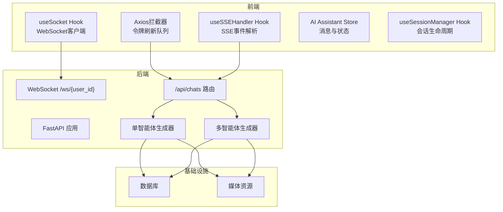
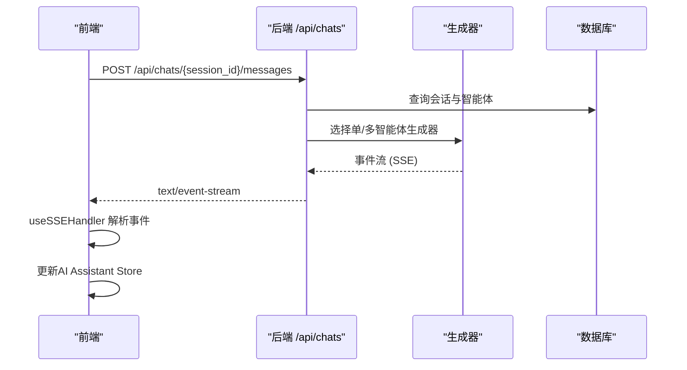
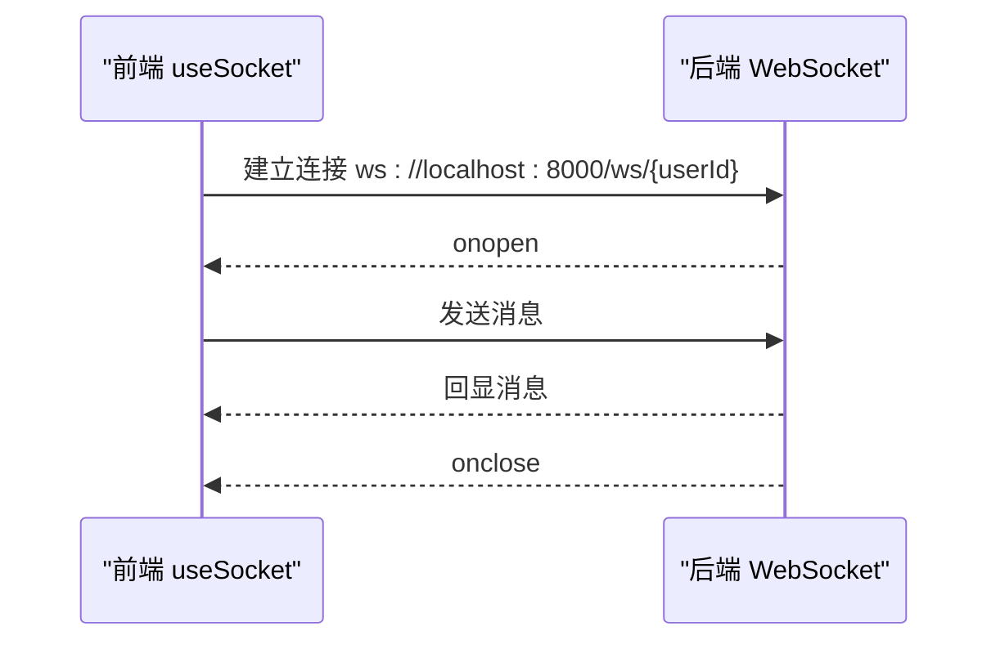
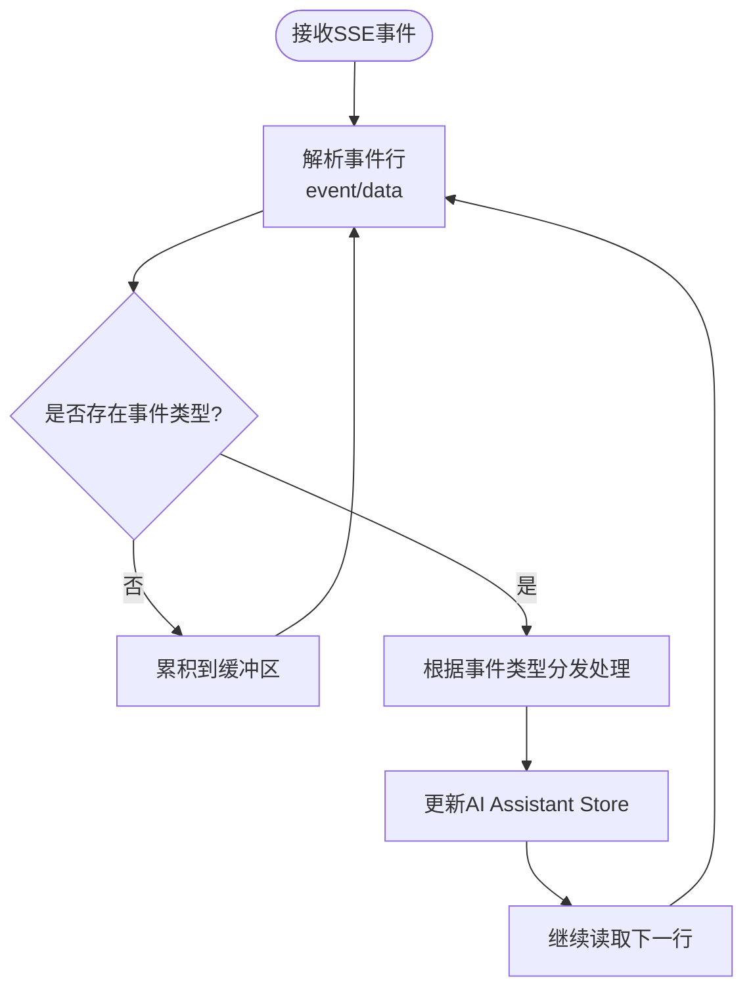
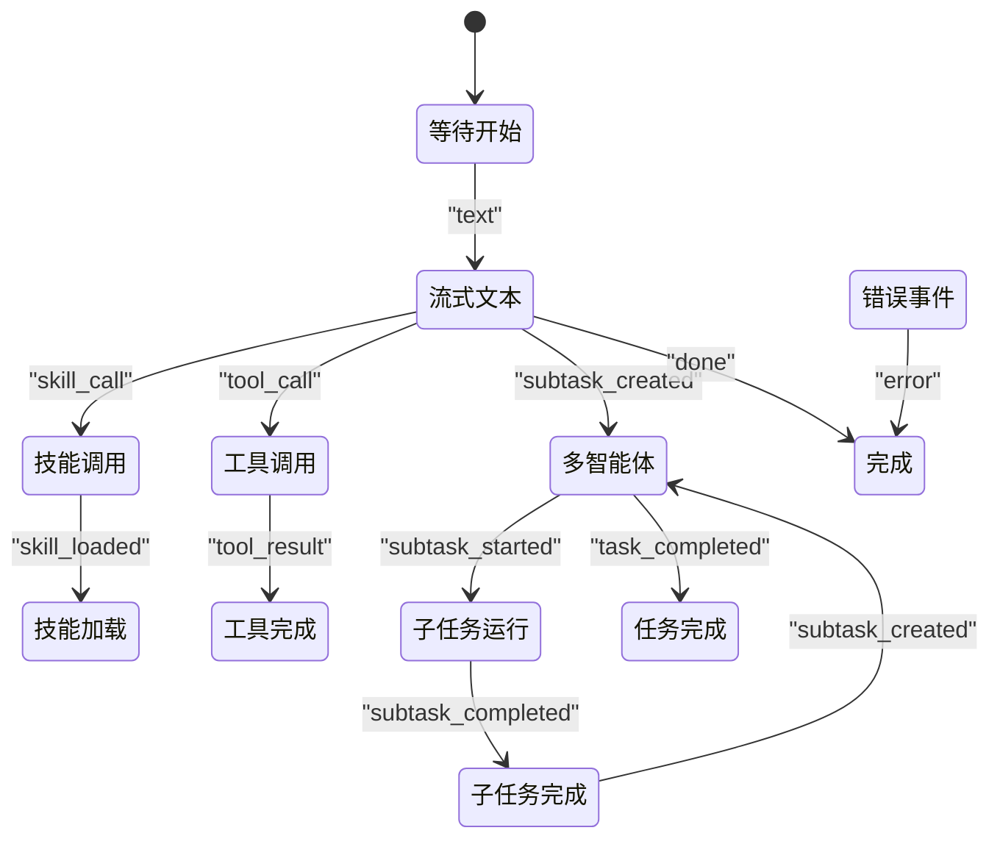
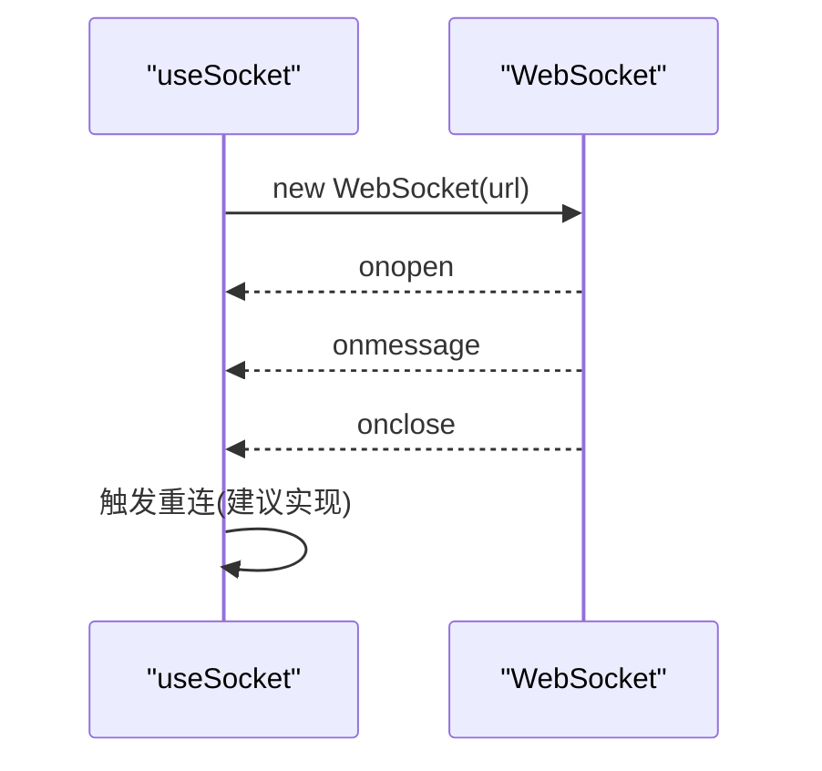
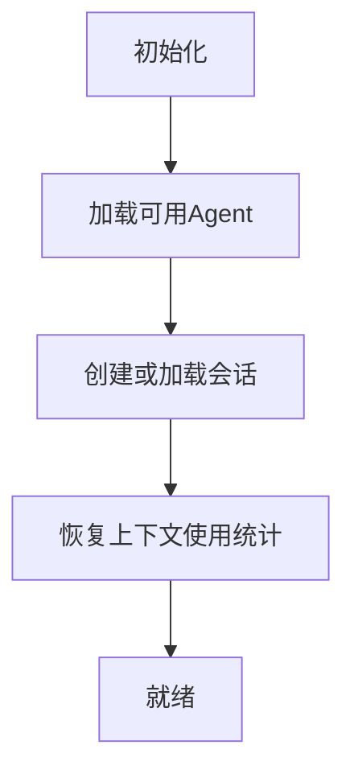
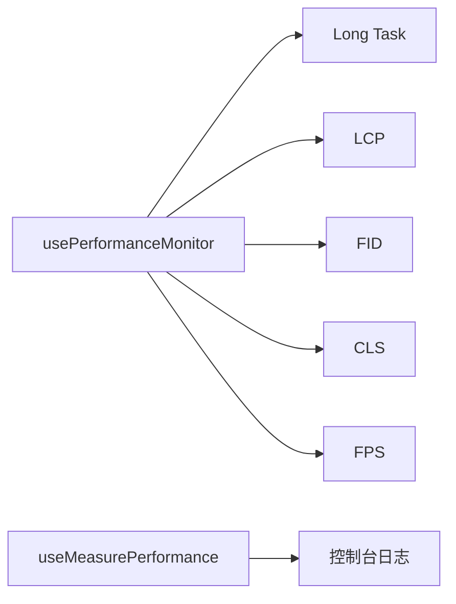
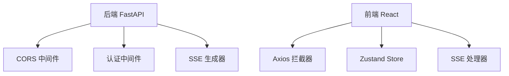

# 实时通信架构

<cite>
**本文档引用的文件**
- [backend/main.py](file://backend/main.py)
- [backend/routers/chats.py](file://backend/routers/chats.py)
- [backend/services/chat_generation.py](file://backend/services/chat_generation.py)
- [backend/services/chat_multi_agent.py](file://backend/services/chat_multi_agent.py)
- [backend/auth.py](file://backend/auth.py)
- [backend/admin/src/components/admin/agents/ChatInterface.tsx](file://backend/admin/src/components/admin/agents/ChatInterface.tsx)
- [frontend/src/hooks/useSocket.ts](file://frontend/src/hooks/useSocket.ts)
- [frontend/src/lib/api.ts](file://frontend/src/lib/api.ts)
- [frontend/src/components/ai-assistant/hooks/useSSEHandler.ts](file://frontend/src/components/ai-assistant/hooks/useSSEHandler.ts)
- [frontend/src/components/ai-assistant/hooks/useSessionManager.ts](file://frontend/src/components/ai-assistant/hooks/useSessionManager.ts)
- [frontend/src/store/useAIAssistantStore.ts](file://frontend/src/store/useAIAssistantStore.ts)
- [frontend/src/components/ai-assistant/hooks/usePerformanceMonitor.ts](file://frontend/src/components/ai-assistant/hooks/usePerformanceMonitor.ts)
</cite>

## 目录
1. [简介](#简介)
2. [项目结构](#项目结构)
3. [核心组件](#核心组件)
4. [架构概览](#架构概览)
5. [详细组件分析](#详细组件分析)
6. [依赖关系分析](#依赖关系分析)
7. [性能考量](#性能考量)
8. [故障排查指南](#故障排查指南)
9. [结论](#结论)
10. [附录](#附录)

## 简介
本文件面向Infinite Game实时通信系统的后端与前端实现，聚焦以下目标：
- WebSocket连接管理与Server-Sent Events (SSE)实现机制
- 实时状态同步策略、消息队列处理与连接池管理
- 前端Socket连接封装、自动重连机制与错误处理策略
- 实时数据流设计、消息格式规范与性能监控方案
- 实时通信最佳实践、安全考虑与扩展性设计

## 项目结构
系统采用前后端分离架构：
- 后端基于FastAPI，提供REST API与WebSocket端点，以及SSE流式响应
- 前端基于React，通过Axios进行HTTP请求，使用原生WebSocket与SSE处理实时事件
- 会话与消息持久化通过数据库完成，支持多智能体协作与工具调用追踪

**图表来源**
- [backend/main.py:161-171](file://backend/main.py#L161-L171)
- [backend/routers/chats.py:127-183](file://backend/routers/chats.py#L127-L183)
- [frontend/src/hooks/useSocket.ts:1-42](file://frontend/src/hooks/useSocket.ts#L1-L42)
- [frontend/src/lib/api.ts:1-84](file://frontend/src/lib/api.ts#L1-L84)

**章节来源**
- [backend/main.py:110-175](file://backend/main.py#L110-L175)
- [backend/routers/chats.py:1-232](file://backend/routers/chats.py#L1-L232)

## 核心组件
- WebSocket端点：提供基础双向通信能力，当前实现为回显示例
- SSE流式接口：/api/chats/{session_id}/messages 返回text/event-stream，承载多智能体与工具调用的增量事件
- 前端Socket封装：useSocket Hook负责连接建立、消息收发与关闭
- 前端SSE处理器：useSSEHandler Hook解析SSE事件，驱动AI Assistant Store状态更新
- 会话管理：useSessionManager Hook负责会话创建、切换与上下文恢复
- 性能监控：usePerformanceMonitor Hook采集长任务、LCP/FID/CLS与FPS指标

**章节来源**
- [backend/main.py:161-171](file://backend/main.py#L161-L171)
- [backend/routers/chats.py:127-183](file://backend/routers/chats.py#L127-L183)
- [frontend/src/hooks/useSocket.ts:1-42](file://frontend/src/hooks/useSocket.ts#L1-L42)
- [frontend/src/components/ai-assistant/hooks/useSSEHandler.ts:1-391](file://frontend/src/components/ai-assistant/hooks/useSSEHandler.ts#L1-L391)
- [frontend/src/components/ai-assistant/hooks/useSessionManager.ts:1-226](file://frontend/src/components/ai-assistant/hooks/useSessionManager.ts#L1-L226)
- [frontend/src/components/ai-assistant/hooks/usePerformanceMonitor.ts:1-235](file://frontend/src/components/ai-assistant/hooks/usePerformanceMonitor.ts#L1-L235)

## 架构概览
后端通过FastAPI统一入口，注册认证中间件与CORS策略；WebSocket端点用于演示连接；SSE端点通过StreamingResponse返回事件流。前端通过Axios拦截器统一处理鉴权与令牌刷新，SSE与WebSocket分别用于不同场景的实时交互。

**图表来源**
- [backend/routers/chats.py:127-183](file://backend/routers/chats.py#L127-L183)
- [backend/services/chat_generation.py:29-200](file://backend/services/chat_generation.py#L29-L200)
- [backend/services/chat_multi_agent.py:22-190](file://backend/services/chat_multi_agent.py#L22-L190)
- [frontend/src/components/ai-assistant/hooks/useSSEHandler.ts:67-383](file://frontend/src/components/ai-assistant/hooks/useSSEHandler.ts#L67-L383)

## 详细组件分析

### WebSocket连接管理
- 连接端点：/ws/{user_id}
- 当前行为：接受连接后循环读取文本消息并回显，异常时打印错误并关闭连接
- 建议增强：增加鉴权校验、心跳检测、消息路由与广播机制

**图表来源**
- [backend/main.py:161-171](file://backend/main.py#L161-L171)
- [frontend/src/hooks/useSocket.ts:8-33](file://frontend/src/hooks/useSocket.ts#L8-L33)

**章节来源**
- [backend/main.py:161-171](file://backend/main.py#L161-L171)
- [frontend/src/hooks/useSocket.ts:1-42](file://frontend/src/hooks/useSocket.ts#L1-L42)

### Server-Sent Events (SSE) 实现
- 端点：/api/chats/{session_id}/messages
- 响应类型：text/event-stream，设置缓存控制与连接保持头
- 事件类型：text、skill_call、skill_loaded、tool_call、tool_result、video_task_created、subtask_*、task_completed、billing、canvas_updated、context_compacted、done、error等
- 事件解析：前端使用parseSSELine按行解析event与data，再根据事件类型更新消息与UI状态

**图表来源**
- [frontend/src/components/ai-assistant/hooks/useSSEHandler.ts:56-65](file://frontend/src/components/ai-assistant/hooks/useSSEHandler.ts#L56-L65)
- [frontend/src/components/ai-assistant/hooks/useSSEHandler.ts:67-383](file://frontend/src/components/ai-assistant/hooks/useSSEHandler.ts#L67-L383)

**章节来源**
- [backend/routers/chats.py:175-183](file://backend/routers/chats.py#L175-L183)
- [frontend/src/components/ai-assistant/hooks/useSSEHandler.ts:1-391](file://frontend/src/components/ai-assistant/hooks/useSSEHandler.ts#L1-L391)

### 实时状态同步策略
- 单智能体：通过text事件增量推送文本，配合skill_call/tool_call等事件同步工具/技能状态
- 多智能体：通过subtask_created/started/completed/failed等事件构建协作步骤树，最终task_completed汇总结果
- 画布联动：canvas_updated事件触发画布同步
- 上下文压缩：context_compacted事件携带摘要，辅助UI展示

**图表来源**
- [frontend/src/components/ai-assistant/hooks/useSSEHandler.ts:70-312](file://frontend/src/components/ai-assistant/hooks/useSSEHandler.ts#L70-L312)

**章节来源**
- [frontend/src/components/ai-assistant/hooks/useSSEHandler.ts:67-383](file://frontend/src/components/ai-assistant/hooks/useSSEHandler.ts#L67-L383)

### 消息队列处理与连接池管理
- 后端：当前未实现专用消息队列与连接池；SSE通过异步生成器逐事件yield，WebSocket在单连接内串行处理
- 建议：引入消息队列（如Redis Streams）解耦生产者与消费者；对WebSocket维护连接池与心跳保活

**章节来源**
- [backend/services/chat_generation.py:175-200](file://backend/services/chat_generation.py#L175-L200)
- [backend/services/chat_multi_agent.py:144-168](file://backend/services/chat_multi_agent.py#L144-L168)

### 前端Socket连接封装与自动重连
- useSocket Hook：基于原生WebSocket，连接成功/失败/消息回调均暴露给上层
- 自动重连：当前实现未包含重连逻辑，建议在onclose时按指数退避重连，并区分网络异常与业务错误

**图表来源**
- [frontend/src/hooks/useSocket.ts:8-33](file://frontend/src/hooks/useSocket.ts#L8-L33)

**章节来源**
- [frontend/src/hooks/useSocket.ts:1-42](file://frontend/src/hooks/useSocket.ts#L1-L42)

### 会话管理与上下文恢复
- useSessionManager：负责加载可用Agent、创建/切换会话、清空消息与从后端恢复上下文使用统计
- 与后端配合：通过/api/chats/*接口获取历史消息与会话详情，驱动AI Assistant Store初始化

**图表来源**
- [frontend/src/components/ai-assistant/hooks/useSessionManager.ts:36-123](file://frontend/src/components/ai-assistant/hooks/useSessionManager.ts#L36-L123)
- [frontend/src/components/ai-assistant/hooks/useSessionManager.ts:165-189](file://frontend/src/components/ai-assistant/hooks/useSessionManager.ts#L165-L189)

**章节来源**
- [frontend/src/components/ai-assistant/hooks/useSessionManager.ts:1-226](file://frontend/src/components/ai-assistant/hooks/useSessionManager.ts#L1-L226)

### 实时数据流设计与消息格式规范
- SSE事件格式：每条事件由若干行组成，以event:data形式标识事件类型与数据
- 事件类型与数据结构：
  - text: { chunk: string }
  - skill_call/skill_loaded: { skill_name: string }
  - tool_call/tool_result: { tool_name: string, arguments?: object }
  - video_task_created: { task_id: string, video_mode: string, model: string }
  - subtask_*: { subtask_id: string, agent?: string, description?: string, result?: string, error?: string, tokens?: { input: number, output: number } }
  - task_completed: { result?: string, total_input_tokens?: number, total_output_tokens?: number, total_credit_cost?: number, billing_status?: string, context_usage?: { used_tokens: number, context_window: number } }
  - billing: { credit_cost?: number, remaining_credits?: number, insufficient?: boolean, frozen?: boolean, context_usage?: { used_tokens: number, context_window: number } }
  - canvas_updated: { theater_id: string }
  - context_compacted: { summary?: string }
  - done/error: 无额外数据

**章节来源**
- [frontend/src/components/ai-assistant/hooks/useSSEHandler.ts:70-383](file://frontend/src/components/ai-assistant/hooks/useSSEHandler.ts#L70-L383)

### 性能监控方案
- usePerformanceMonitor：采集Long Task、LCP、FID、CLS与FPS，支持自定义阈值与回调
- useMeasurePerformance：对特定操作进行耗时测量

**图表来源**
- [frontend/src/components/ai-assistant/hooks/usePerformanceMonitor.ts:50-73](file://frontend/src/components/ai-assistant/hooks/usePerformanceMonitor.ts#L50-L73)

**章节来源**
- [frontend/src/components/ai-assistant/hooks/usePerformanceMonitor.ts:1-235](file://frontend/src/components/ai-assistant/hooks/usePerformanceMonitor.ts#L1-L235)

## 依赖关系分析
- 后端依赖：FastAPI、SQLAlchemy异步、CORS中间件、调试认证中间件
- SSE依赖：StreamingResponse与自定义SSE事件生成
- 前端依赖：Axios拦截器、React Hooks、Zustand状态管理

**图表来源**
- [backend/main.py:128-136](file://backend/main.py#L128-L136)
- [backend/routers/chats.py:175-183](file://backend/routers/chats.py#L175-L183)
- [frontend/src/lib/api.ts:1-84](file://frontend/src/lib/api.ts#L1-L84)
- [frontend/src/store/useAIAssistantStore.ts:1-381](file://frontend/src/store/useAIAssistantStore.ts#L1-L381)

**章节来源**
- [backend/main.py:110-175](file://backend/main.py#L110-L175)
- [frontend/src/lib/api.ts:1-84](file://frontend/src/lib/api.ts#L1-L84)

## 性能考量
- SSE流式传输：避免一次性大响应，提升首包速度与用户体验
- 前端渲染优化：结合虚拟滚动与状态最小化更新，减少重绘
- 后端并发：多智能体任务可并行执行，注意数据库事务与锁竞争
- 网络稳定性：WebSocket建议实现心跳与自动重连；SSE断线后需具备重连与断点续传能力

## 故障排查指南
- WebSocket连接失败：检查端点可达性、CORS配置与鉴权头
- SSE无法接收事件：确认响应头设置、事件格式正确性与前端解析逻辑
- 令牌失效：Axios拦截器已实现刷新队列，确保刷新接口可用与本地存储键一致
- 多智能体异常：关注subtask_failed事件与task_failed事件，定位具体子任务错误

**章节来源**
- [frontend/src/lib/api.ts:19-81](file://frontend/src/lib/api.ts#L19-L81)
- [frontend/src/components/ai-assistant/hooks/useSSEHandler.ts:374-379](file://frontend/src/components/ai-assistant/hooks/useSSEHandler.ts#L374-L379)

## 结论
当前实现提供了WebSocket与SSE的基础能力，SSE在多智能体与工具调用场景下具备良好的事件粒度与前端可扩展性。建议后续完善鉴权、心跳、自动重连、消息队列与连接池等机制，以满足高并发与高可用需求。

## 附录

### 安全考虑
- 认证与授权：后端使用JWT Bearer令牌，前端通过Axios拦截器附加Authorization头
- CORS策略：严格限制允许源，避免跨域风险
- 令牌刷新：实现请求排队与失败回退，防止重复刷新

**章节来源**
- [backend/auth.py:83-110](file://backend/auth.py#L83-L110)
- [backend/main.py:128-136](file://backend/main.py#L128-L136)
- [frontend/src/lib/api.ts:19-81](file://frontend/src/lib/api.ts#L19-L81)

### 扩展性设计
- 事件扩展：新增事件类型需前后端同步更新解析与UI映射
- 连接池：WebSocket连接池与SSE连接池分离，支持多会话并发
- 消息队列：引入队列解耦生成器与前端消费者，支持失败重试与幂等处理