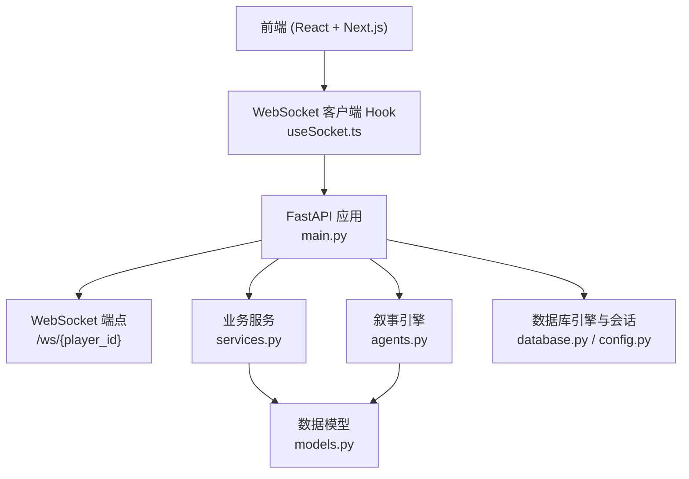
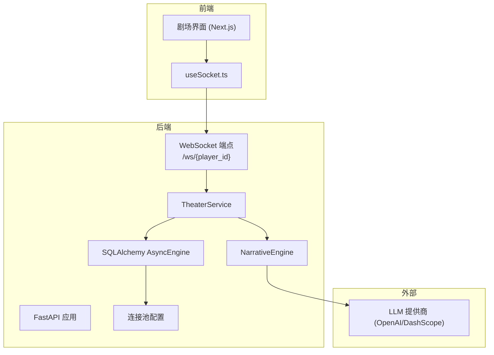
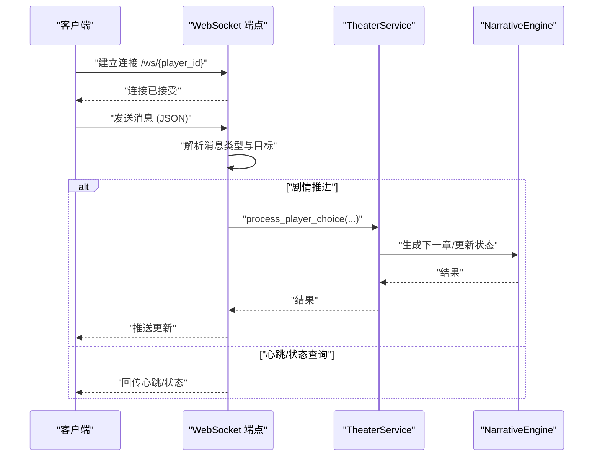
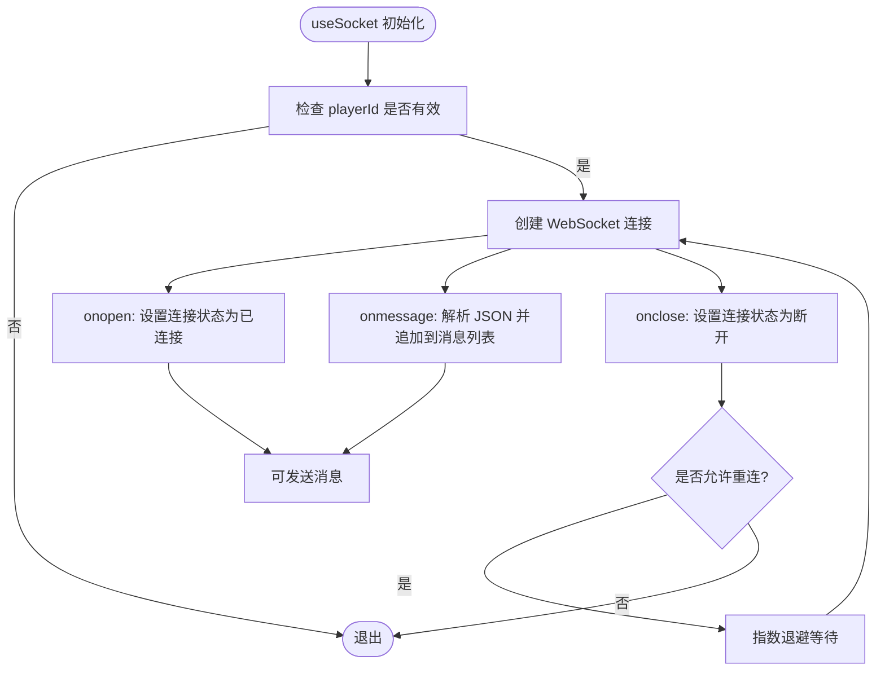
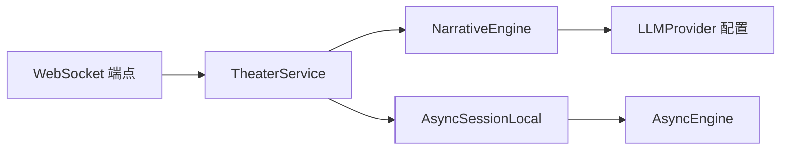

# 实时通信架构

<cite>
**本文引用的文件**
- [backend/main.py](file://backend/main.py)
- [frontend/src/hooks/useSocket.ts](file://frontend/src/hooks/useSocket.ts)
- [backend/services.py](file://backend/services.py)
- [backend/models.py](file://backend/models.py)
- [backend/agents.py](file://backend/agents.py)
- [backend/config.py](file://backend/config.py)
- [backend/database.py](file://backend/database.py)
- [backend/routers/chats.py](file://backend/routers/chats.py)
- [docs/wiki/Architecture.md](file://docs/wiki/Architecture.md)
- [docs/wiki/Backend-Guide.md](file://docs/wiki/Backend-Guide.md)
</cite>

## 目录
1. [引言](#引言)
2. [项目结构](#项目结构)
3. [核心组件](#核心组件)
4. [架构总览](#架构总览)
5. [详细组件分析](#详细组件分析)
6. [依赖分析](#依赖分析)
7. [性能考虑](#性能考虑)
8. [故障排查指南](#故障排查指南)
9. [结论](#结论)
10. [附录](#附录)

## 引言
本文件针对“无限剧情剧场”的实时通信架构进行系统化技术文档梳理，重点覆盖以下方面：
- WebSocket 通信协议设计与实现：连接建立、消息格式、断线重连策略
- 消息序列化方案：JSON 数据结构、二进制传输优化与压缩策略
- 客户端-服务器通信模式：请求-响应、事件驱动、双向数据流
- 并发连接管理、负载均衡与连接池配置
- 消息路由、广播与私有通道
- 通信安全、错误处理与性能监控

当前仓库中 WebSocket 端点已存在，但尚未实现完整的消息编解码、路由与广播机制；本文在不臆造现有代码的前提下，基于现有端点与前后端交互模式，给出可落地的扩展方案与最佳实践。

## 项目结构
从实时通信视角，关键文件分布如下：
- 后端入口与 WebSocket 端点：backend/main.py
- 前端 WebSocket 客户端 Hook：frontend/src/hooks/useSocket.ts
- 业务服务与叙事引擎：backend/services.py、backend/agents.py
- 数据模型与数据库配置：backend/models.py、backend/database.py、backend/config.py
- 聊天流式接口（参考流式传输与消息结构）：backend/routers/chats.py
- 架构与后端指南文档：docs/wiki/Architecture.md、docs/wiki/Backend-Guide.md

图表来源
- [backend/main.py](file://backend/main.py#L157-L169)
- [frontend/src/hooks/useSocket.ts](file://frontend/src/hooks/useSocket.ts#L1-L43)
- [backend/services.py](file://backend/services.py#L1-L66)
- [backend/agents.py](file://backend/agents.py#L1-L196)
- [backend/database.py](file://backend/database.py#L1-L31)
- [backend/config.py](file://backend/config.py#L1-L34)
- [backend/models.py](file://backend/models.py#L1-L122)

章节来源
- [backend/main.py](file://backend/main.py#L1-L173)
- [frontend/src/hooks/useSocket.ts](file://frontend/src/hooks/useSocket.ts#L1-L43)
- [docs/wiki/Architecture.md](file://docs/wiki/Architecture.md#L1-L62)
- [docs/wiki/Backend-Guide.md](file://docs/wiki/Backend-Guide.md#L1-L108)

## 核心组件
- WebSocket 服务端端点：位于 /ws/{player_id}，负责接受文本消息并回显，当前未实现消息解析与路由。
- 前端 WebSocket 客户端 Hook：封装连接生命周期、消息收发与关闭。
- 业务服务 TheaterService：负责玩家创建、世界初始化、章节生成与后续处理。
- 叙事引擎 NarrativeEngine：基于 AgentScope 的多智能体编排，负责章节内容生成。
- 数据模型与数据库：玩家、章节、聊天会话与消息、LLM 提供商等。
- 数据库连接池：基于 SQLAlchemy AsyncEngine 的连接池配置。

章节来源
- [backend/main.py](file://backend/main.py#L157-L169)
- [frontend/src/hooks/useSocket.ts](file://frontend/src/hooks/useSocket.ts#L1-L43)
- [backend/services.py](file://backend/services.py#L1-L66)
- [backend/agents.py](file://backend/agents.py#L1-L196)
- [backend/models.py](file://backend/models.py#L1-L122)
- [backend/database.py](file://backend/database.py#L1-L31)

## 架构总览
下图展示实时通信在整体系统中的位置与交互路径：

图表来源
- [backend/main.py](file://backend/main.py#L157-L169)
- [frontend/src/hooks/useSocket.ts](file://frontend/src/hooks/useSocket.ts#L1-L43)
- [backend/services.py](file://backend/services.py#L1-L66)
- [backend/agents.py](file://backend/agents.py#L1-L196)
- [backend/database.py](file://backend/database.py#L1-L31)

## 详细组件分析

### WebSocket 端点与连接管理
- 连接建立：客户端通过 ws://host/ws/{player_id} 建立连接；后端接受连接后进入循环等待消息。
- 当前实现：仅支持文本帧，收到消息后回显；未做消息解析、鉴权、路由与广播。
- 建议增强：
  - 消息格式：统一为 JSON，包含 type、target、payload、timestamp 等字段。
  - 鉴权：在握手阶段校验 player_id 与令牌。
  - 断线重连：服务端维护每个 player_id 的连接映射，心跳保活，异常断开自动重连。
  - 并发管理：限制单玩家最大连接数，超限拒绝或踢旧连。

图表来源
- [backend/main.py](file://backend/main.py#L157-L169)
- [backend/services.py](file://backend/services.py#L61-L66)
- [backend/agents.py](file://backend/agents.py#L154-L191)

章节来源
- [backend/main.py](file://backend/main.py#L157-L169)

### 前端 WebSocket 客户端 Hook
- 功能：建立连接、监听消息、处理关闭、暴露 sendMessage 方法。
- 当前实现：未做断线重连、未区分消息类型、未持久化历史消息。
- 建议增强：
  - 断线重连：指数退避重连，最多重试次数与超时。
  - 消息去重与顺序保证：基于消息 ID 与序号。
  - UI 层渲染：根据消息类型渲染不同 UI（剧情文本、选项、通知）。

图表来源
- [frontend/src/hooks/useSocket.ts](file://frontend/src/hooks/useSocket.ts#L1-L43)

章节来源
- [frontend/src/hooks/useSocket.ts](file://frontend/src/hooks/useSocket.ts#L1-L43)

### 消息序列化与格式定义
- JSON 数据结构建议：
  - 通用字段：type（事件/命令）、target（玩家/房间/全局）、payload（业务数据）、timestamp、msgId（去重与排序）。
  - 剧情事件：type=story_update，payload 包含章节内容、选项、NPC 状态。
  - 心跳：type=heartbeat，payload={pingTs}。
  - 命令：type=command，payload={cmd: "restart", params: {...}}。
- 二进制传输优化：对于长文本或频繁增量更新，可采用分片与差分编码（如基于上一帧的差异）。
- 压缩策略：gzip/snappy 对大包进行压缩，小包不压缩以降低 CPU 开销。

说明：本节为通用设计建议，非现有实现。

### 客户端-服务器通信模式
- 请求-响应：REST API（如 /players/、/story/init/{player_id}）用于初始化与状态查询。
- 事件驱动：WebSocket 推送剧情更新、系统通知、选项可用性变化。
- 双向数据流：玩家输入通过 WebSocket 上行，服务端实时下发剧情与状态变更。

章节来源
- [backend/main.py](file://backend/main.py#L138-L155)
- [backend/routers/chats.py](file://backend/routers/chats.py#L72-L258)

### 并发连接管理、负载均衡与连接池
- 连接池：SQLAlchemy AsyncEngine 已配置 pool_pre_ping、pool_size、max_overflow，满足高并发读写。
- 负载均衡：多实例部署时，使用反向代理（如 Nginx/Envoy）分发 WebSocket 连接；确保粘性会话或共享状态（Redis）。
- 并发策略：单进程内建议使用 asyncio 事件循环；跨进程需共享状态（Redis）或集中式会话存储。

章节来源
- [backend/database.py](file://backend/database.py#L8-L23)
- [backend/config.py](file://backend/config.py#L18-L19)

### 消息路由、广播与私有通道
- 私有通道：以 player_id 为命名空间，每玩家独立通道。
- 房间/频道：按故事线或副本划分频道，支持组播。
- 广播：系统公告、版本更新、维护通知。
- 路由策略：type 字段决定处理流程；target 字段决定投递范围。

说明：本节为通用设计建议，非现有实现。

### 通信安全
- 认证与授权：握手阶段校验 JWT 或会话令牌；仅允许绑定的 player_id 连接其专属通道。
- 加密：生产环境强制启用 WSS；禁用明文 WS。
- 防刷与风控：速率限制、IP 黑名单、异常行为检测。
- 输入校验：严格校验 JSON 结构与字段类型，防止注入与越权。

说明：本节为通用设计建议，非现有实现。

### 错误处理与性能监控
- 错误处理：捕获网络异常、解析异常、业务异常；向客户端返回标准化错误码与消息。
- 性能监控：埋点记录消息吞吐、延迟、错误率；结合 APM 工具（如 Prometheus/Grafana）可视化。

说明：本节为通用设计建议，非现有实现。

## 依赖分析
- WebSocket 端点依赖 FastAPI 的 WebSocket 类型与事件循环。
- TheaterService 依赖数据库会话与叙事引擎。
- 叙事引擎依赖 AgentScope 与 LLM 提供商配置。
- 数据库层依赖 SQLAlchemy 异步引擎与连接池。

图表来源
- [backend/main.py](file://backend/main.py#L157-L169)
- [backend/services.py](file://backend/services.py#L1-L66)
- [backend/agents.py](file://backend/agents.py#L49-L99)
- [backend/database.py](file://backend/database.py#L19-L23)

章节来源
- [backend/main.py](file://backend/main.py#L1-L173)
- [backend/services.py](file://backend/services.py#L1-L66)
- [backend/agents.py](file://backend/agents.py#L1-L196)
- [backend/database.py](file://backend/database.py#L1-L31)

## 性能考虑
- 连接池与数据库：合理设置 pool_size 与 max_overflow，避免连接饥饿。
- 消息批处理：合并小消息，减少 RTT。
- 增量更新：优先推送差异而非全量数据。
- 背压控制：当客户端处理能力不足时，服务端降速或丢弃低优先级消息。
- 缓存：热点剧情与 NPC 状态放入内存缓存（Redis），减少数据库压力。

说明：本节为通用指导，非现有实现。

## 故障排查指南
- WebSocket 无法连接
  - 检查 CORS 配置与端口可达性。
  - 查看后端日志与 uvicorn access 日志。
- 消息未到达
  - 确认消息 JSON 结构正确，type/target 无误。
  - 检查 player_id 是否匹配，是否被限流或封禁。
- 性能抖动
  - 监控数据库连接池使用率与慢查询。
  - 分析叙事引擎调用耗时与 LLM 调用耗时。

章节来源
- [backend/main.py](file://backend/main.py#L85-L91)
- [backend/database.py](file://backend/database.py#L8-L23)

## 结论
当前项目已具备 WebSocket 端点与基础的前后端交互能力。为进一步支撑“无限剧情剧场”的实时体验，建议在消息编解码、路由与广播、断线重连、安全与监控等方面进行系统化增强。上述建议均以现有代码为依据，结合通用工程实践提出，便于渐进式演进与落地。

## 附录
- API 一览（来自后端指南）
  - 创建玩家：POST /players/
  - 初始化故事：POST /story/init/{player_id}
  - WebSocket：WS /ws/{player_id}

章节来源
- [docs/wiki/Backend-Guide.md](file://docs/wiki/Backend-Guide.md#L83-L101)