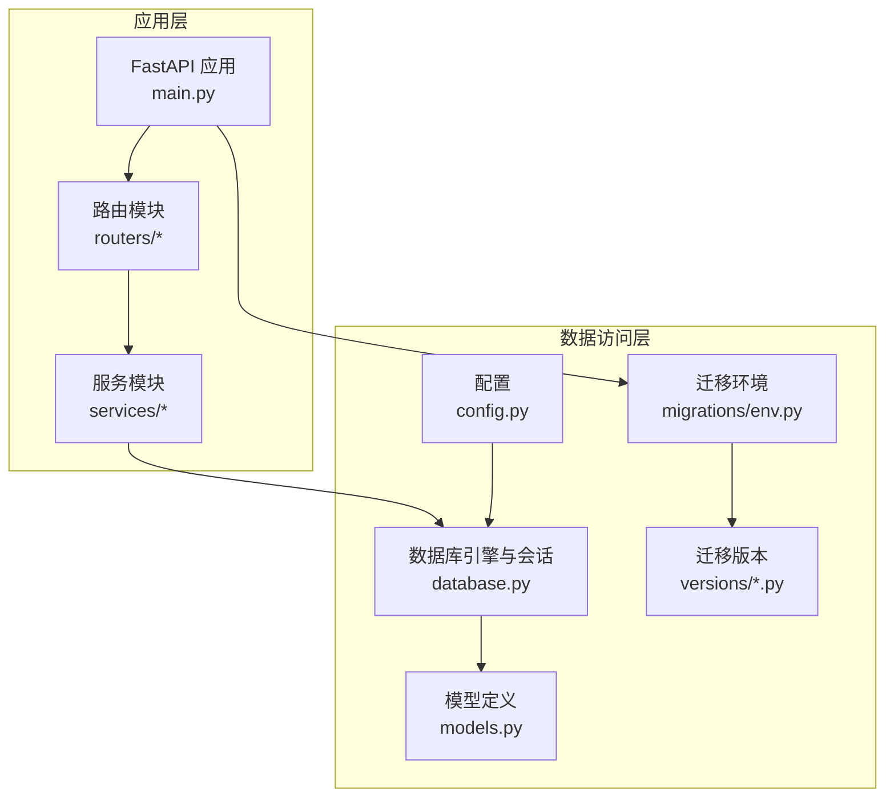
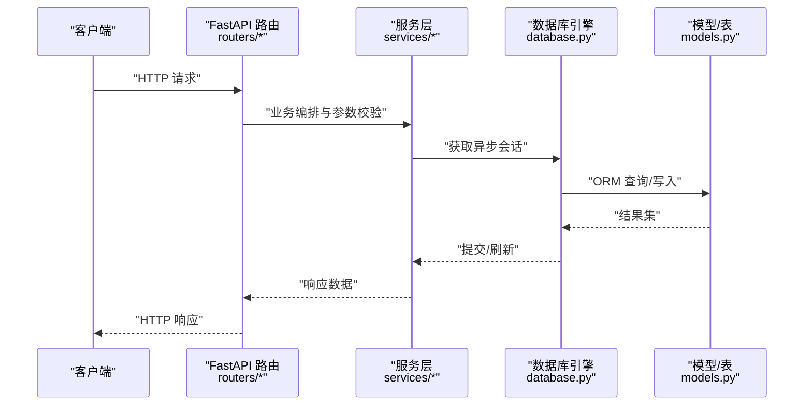
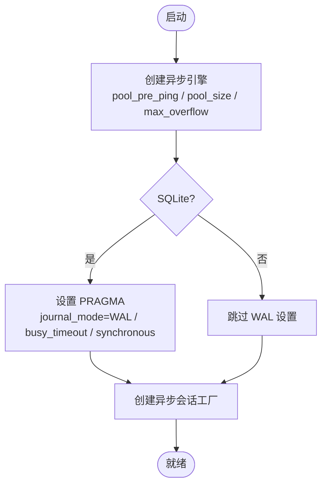
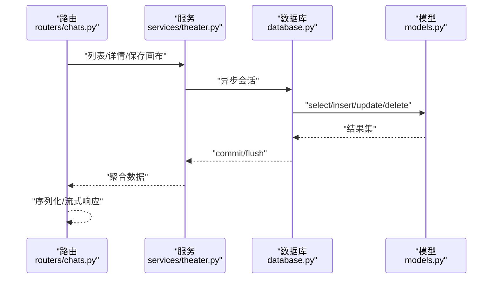
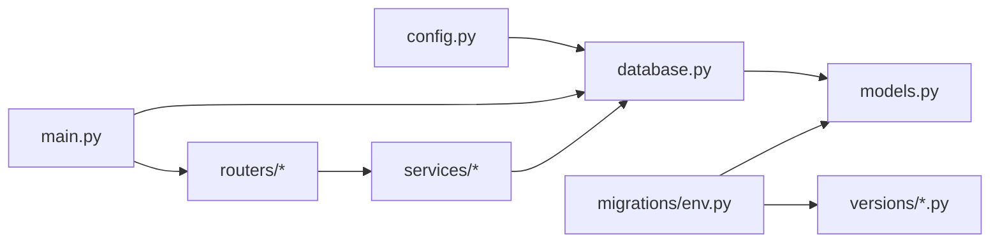

# 性能优化策略

<cite>
**本文引用的文件**
- [database.py](file://backend/database.py)
- [models.py](file://backend/models.py)
- [config.py](file://backend/config.py)
- [main.py](file://backend/main.py)
- [manage_db.py](file://backend/manage_db.py)
- [env.py](file://backend/migrations/env.py)
- [14746eaf1c81_initial.py](file://backend/migrations/versions/14746eaf1c81_initial.py)
- [7459f2d26782_add_video_tasks_and_video_agent_fields.py](file://backend/migrations/versions/7459f2d26782_add_video_tasks_and_video_agent_fields.py)
- [chats.py](file://backend/routers/chats.py)
- [theaters.py](file://backend/routers/theaters.py)
- [theater.py](file://backend/services/theater.py)
- [chat_utils.py](file://backend/services/chat_utils.py)
</cite>

## 目录
1. [简介](#简介)
2. [项目结构](#项目结构)
3. [核心组件](#核心组件)
4. [架构总览](#架构总览)
5. [详细组件分析](#详细组件分析)
6. [依赖分析](#依赖分析)
7. [性能考量](#性能考量)
8. [故障排查指南](#故障排查指南)
9. [结论](#结论)
10. [附录](#附录)

## 简介
本文件面向 Infinite Game 的数据库性能优化，围绕索引设计策略、查询优化技术、连接池与事务管理、并发控制、数据分片与读写分离、缓存策略、监控与瓶颈识别、异步数据库操作实践以及具体 SQL 优化与配置调优建议展开。文档以仓库现有代码为依据，结合数据库引擎、ORM 映射、路由与服务层的调用模式，给出可落地的优化方案。

## 项目结构
后端采用 FastAPI + SQLAlchemy Async + Alembic 迁移的架构。数据库层通过 async 引擎与异步会话提供连接池与并发访问能力；模型层定义了丰富的实体与索引；路由层负责请求处理与业务编排；服务层封装复杂的数据操作；迁移脚本确保数据库结构演进可控。



**图表来源**
- [main.py:110-153](file://backend/main.py#L110-L153)
- [database.py:9-37](file://backend/database.py#L9-L37)
- [models.py:10-503](file://backend/models.py#L10-L503)
- [config.py:7-42](file://backend/config.py#L7-L42)
- [env.py:15-32](file://backend/migrations/env.py#L15-L32)

**章节来源**
- [main.py:110-153](file://backend/main.py#L110-L153)
- [database.py:9-37](file://backend/database.py#L9-L37)
- [models.py:10-503](file://backend/models.py#L10-L503)
- [config.py:7-42](file://backend/config.py#L7-L42)
- [env.py:15-32](file://backend/migrations/env.py#L15-L32)

## 核心组件
- 数据库引擎与连接池
  - 使用异步引擎，开启 pool_pre_ping、设定 pool_size 与 max_overflow，并对 SQLite 提供 WAL、busy_timeout、synchronous 等 PRAGMA 优化。
- ORM 模型与索引
  - 主键统一使用字符串 UUID 并建立索引；大量外键字段与高频查询字段建立索引；部分表显式创建唯一索引。
- 迁移与版本控制
  - Alembic 环境加载配置与模型元数据，支持离线/在线迁移；版本脚本中显式创建索引与唯一约束。
- 路由与服务层
  - 路由层进行权限校验与参数过滤，服务层封装批量写入、聚合查询与分页逻辑，减少 N+1 与重复扫描。

**章节来源**
- [database.py:9-37](file://backend/database.py#L9-L37)
- [models.py:10-503](file://backend/models.py#L10-L503)
- [env.py:15-32](file://backend/migrations/env.py#L15-L32)
- [14746eaf1c81_initial.py:21-52](file://backend/migrations/versions/14746eaf1c81_initial.py#L21-L52)
- [7459f2d26782_add_video_tasks_and_video_agent_fields.py:21-83](file://backend/migrations/versions/7459f2d26782_add_video_tasks_and_video_agent_fields.py#L21-L83)

## 架构总览
下图展示从请求到数据库的典型链路，以及异步会话与连接池的交互。



**图表来源**
- [main.py:110-153](file://backend/main.py#L110-L153)
- [theater.py:13-16](file://backend/services/theater.py#L13-L16)
- [database.py:42-44](file://backend/database.py#L42-L44)
- [models.py:10-503](file://backend/models.py#L10-L503)

## 详细组件分析

### 数据库引擎与连接池配置
- 异步引擎与连接池
  - 开启 pool_pre_ping，提升连接可用性与自动重连能力。
  - 设定 pool_size 与 max_overflow，平衡吞吐与资源占用。
  - SQLite 场景通过事件监听设置 WAL、busy_timeout、synchronous，缓解锁竞争与提升并发读写。
- 会话生命周期
  - 使用 async_sessionmaker，expire_on_commit=False，降低对象过期带来的额外查询。
- 日志与可观测性
  - 应用侧关闭 SQLAlchemy engine/pool 日志噪声，聚焦业务日志。



**图表来源**
- [database.py:9-37](file://backend/database.py#L9-L37)
- [database.py:23-31](file://backend/database.py#L23-L31)

**章节来源**
- [database.py:9-37](file://backend/database.py#L9-L37)
- [database.py:23-31](file://backend/database.py#L23-L31)
- [main.py:22-30](file://backend/main.py#L22-L30)

### 索引设计策略
- 主键索引
  - 所有表主键均为字符串 UUID，默认建立索引，满足 O(1) 定位。
- 唯一索引
  - 对 email、google_id、github_id、name、llm_providers.name 等唯一字段建立唯一索引，保证业务一致性与高效查找。
- 复合索引
  - 高频过滤字段组合（如 user_id + created_at、status + user_id）可考虑复合索引，减少排序与过滤成本。
- 全文索引
  - 当前模型未见显式全文索引；若未来引入大文本检索需求，可在 PostgreSQL 下使用 gin/gist 或向量扩展，在 SQLite 下可考虑 FTS5。
- 索引维护
  - 迁移脚本中显式创建索引与唯一约束，确保结构演进可控。

```mermaid
erDiagram
USERS {
string id PK
string email UK
string google_id UK
string github_id UK
string role IDX
boolean is_active
float credits
}
THEATERS {
string id PK
string user_id FK
string status IDX
datetime created_at
datetime updated_at
}
THEATER_NODES {
string id PK
string theater_id FK
string node_type
float position_x
float position_y
}
THEATER_EDGES {
string id PK
string theater_id FK
string source_node_id FK
string target_node_id FK
}
CHAT_SESSIONS {
string id PK
string user_id FK
string agent_id FK
string theater_id FK
integer total_tokens_used
datetime created_at
datetime updated_at
}
CHAT_MESSAGES {
string id PK
string session_id FK
string role
text content
datetime created_at
}
AGENTS {
string id PK
string name UK
string provider_id FK
string model
string agent_type
float input_credit_per_1m
float output_credit_per_1m
}
LLM_PROVIDERS {
string id PK
string name UK
string provider_type
boolean is_active
boolean is_default
}
VIDEO_TASKS {
string id PK
string user_id FK
string status IDX
string xai_task_id
}
USERS ||--o{ THEATERS : "拥有"
THEATERS ||--o{ THEATER_NODES : "包含"
THEATERS ||--o{ THEATER_EDGES : "包含"
THEATERS ||--o{ CHAT_SESSIONS : "关联"
CHAT_SESSIONS ||--o{ CHAT_MESSAGES : "包含"
LLM_PROVIDERS ||--o{ AGENTS : "提供"
```

**图表来源**
- [models.py:10-503](file://backend/models.py#L10-L503)
- [7459f2d26782_add_video_tasks_and_video_agent_fields.py:29-60](file://backend/migrations/versions/7459f2d26782_add_video_tasks_and_video_agent_fields.py#L29-L60)

**章节来源**
- [models.py:10-503](file://backend/models.py#L10-L503)
- [14746eaf1c81_initial.py:27-51](file://backend/migrations/versions/14746eaf1c81_initial.py#L27-L51)
- [7459f2d26782_add_video_tasks_and_video_agent_fields.py:21-83](file://backend/migrations/versions/7459f2d26782_add_video_tasks_and_video_agent_fields.py#L21-L83)

### 查询优化技术
- 慢查询分析
  - 在应用侧关闭 SQLAlchemy engine/pool 日志噪声，避免干扰；生产环境建议接入数据库慢查询日志与 APM。
- 执行计划分析
  - 使用数据库 EXPLAIN/EXPLAIN QUERY PLAN 分析路由中的复杂查询（如分页、聚合、连接）。
- 查询重写建议
  - 避免 SELECT *，明确投影字段。
  - 使用 exists/count 替代子查询，减少嵌套。
  - 对分页使用基于游标或基于索引的 LIMIT/OFFSET 优化。
  - 合理利用复合索引，避免隐式转换导致索引失效。
- 路由与服务层的查询模式
  - 路由层进行参数过滤与作用域限定，服务层进行批量写入与聚合查询，减少往返次数。



**图表来源**
- [chats.py:48-68](file://backend/routers/chats.py#L48-L68)
- [theater.py:46-60](file://backend/services/theater.py#L46-L60)
- [theater.py:108-228](file://backend/services/theater.py#L108-L228)

**章节来源**
- [chats.py:48-68](file://backend/routers/chats.py#L48-L68)
- [theater.py:46-60](file://backend/services/theater.py#L46-L60)
- [theater.py:108-228](file://backend/services/theater.py#L108-L228)

### 事务管理与并发控制
- 事务边界
  - 服务层在一次业务操作中合并多次写入，减少事务次数；必要时使用 flush/commit 控制提交时机。
- 并发控制
  - 异步会话与连接池天然支持高并发；SQLite 通过 WAL 降低锁冲突；生产环境建议使用 PostgreSQL 并启用连接池上限与超时策略。
- 写放大与批量操作
  - 画布保存采用集合运算分类 create/update/delete，批量执行减少往返与锁竞争。

**章节来源**
- [theater.py:13-16](file://backend/services/theater.py#L13-L16)
- [theater.py:108-228](file://backend/services/theater.py#L108-L228)
- [database.py:9-37](file://backend/database.py#L9-L37)

### 数据分片、读写分离与缓存策略
- 数据分片
  - 建议按 user_id 哈希分片，将用户相关表（users、theaters、chat_sessions、chat_messages）按用户维度拆分，降低热点。
- 读写分离
  - 写库承担写入与强一致场景；读库承载报表与历史查询；通过路由层区分读写端点或中间件分流。
- 缓存策略
  - 读多写少的静态配置（如 llm_providers、subscription_plans）可缓存至 Redis；用户会话与画布快照短期缓存；注意缓存失效与双写一致性。

[本节为概念性指导，不直接分析具体文件]

### 监控指标与瓶颈识别
- 指标建议
  - 数据库层：连接数、等待时间、慢查询数、锁等待、缓冲池命中率。
  - 应用层：请求延迟、错误率、队列长度、会话耗时分布。
- 瓶颈识别
  - 通过慢查询日志定位热点 SQL；结合 EXPLAIN 分析索引使用情况；观察连接池饱和与超时。
- 优化案例
  - 画布保存批量写入减少往返；SQLite WAL 提升并发；索引覆盖减少回表。

[本节为通用指导，不直接分析具体文件]

### 异步数据库操作与最佳实践
- 异步会话
  - 使用 AsyncSession 与异步 ORM，避免阻塞；在路由层注入依赖，确保每个请求独立会话。
- 流式响应
  - 聊天生成使用 SSE 流式返回，降低端到端延迟。
- 超时与重试
  - 连接超时与重试策略在引擎层配置；业务层对幂等操作进行重试。

**章节来源**
- [database.py:42-44](file://backend/database.py#L42-L44)
- [chats.py:175-183](file://backend/routers/chats.py#L175-L183)
- [main.py:50-97](file://backend/main.py#L50-L97)

### SQL 查询优化示例与配置调优建议
- 示例场景
  - 列表分页：确保排序字段建立索引，使用基于索引的分页策略。
  - 关联查询：优先使用 JOIN + WHERE + ORDER BY，避免笛卡尔积。
  - 聚合统计：使用 COUNT/GROUP BY 时，尽量将过滤条件前置，减少中间结果集。
- 配置调优
  - 连接池：pool_size 与 max_overflow 根据 QPS 与平均事务时长调整；生产环境启用连接回收与健康检查。
  - SQLite：WAL + busy_timeout + synchronous 参数已在引擎初始化阶段设置，适合开发与小规模生产。
  - PostgreSQL：启用连接池、查询缓存与统计信息收集，定期分析表与索引使用情况。

**章节来源**
- [database.py:9-37](file://backend/database.py#L9-L37)
- [database.py:23-31](file://backend/database.py#L23-L31)
- [theater.py:62-89](file://backend/services/theater.py#L62-L89)

## 依赖分析
- 组件耦合
  - 路由依赖服务层；服务层依赖数据库会话；数据库会话依赖模型定义；配置驱动引擎创建。
- 外部依赖
  - SQLAlchemy Async、Alembic、FastAPI、Pydantic Settings。
- 循环依赖
  - 代码组织上未发现循环导入；模型与迁移相互独立，通过 Base 元数据关联。



**图表来源**
- [config.py:7-42](file://backend/config.py#L7-L42)
- [database.py:9-37](file://backend/database.py#L9-L37)
- [models.py:10-503](file://backend/models.py#L10-L503)
- [main.py:110-153](file://backend/main.py#L110-L153)
- [env.py:15-32](file://backend/migrations/env.py#L15-L32)

**章节来源**
- [config.py:7-42](file://backend/config.py#L7-L42)
- [database.py:9-37](file://backend/database.py#L9-L37)
- [models.py:10-503](file://backend/models.py#L10-L503)
- [main.py:110-153](file://backend/main.py#L110-L153)
- [env.py:15-32](file://backend/migrations/env.py#L15-L32)

## 性能考量
- 连接池与并发
  - 异步引擎 + 连接池 + SQLite WAL 已具备一定并发能力；生产建议迁移到 PostgreSQL 并启用连接池上限与超时。
- 索引与查询
  - 现有模型已覆盖多数高频字段索引；后续可根据慢查询日志补充复合索引与覆盖索引。
- 写入优化
  - 服务层批量写入与 flush/commit 合理拆分，减少锁持有时间。
- 缓存与分片
  - 建议引入 Redis 缓存热点配置；按用户维度分片降低热点。

[本节为通用指导，不直接分析具体文件]

## 故障排查指南
- 连接失败与迁移异常
  - 应用启动时进行连接重试与迁移失败清理；SQLite 残留临时表会在迁移前清理。
- 日志与可观测性
  - 关闭 SQLAlchemy engine/pool 日志噪声，聚焦业务日志；生产环境接入慢查询与 APM。
- 常见问题
  - SQLite “database is locked”：已通过 WAL 与 busy_timeout 优化；仍需避免长时间事务与大批量串行写入。
  - 索引失效：避免在 WHERE/HAVING 中对索引列进行函数计算或隐式类型转换。

**章节来源**
- [main.py:50-97](file://backend/main.py#L50-L97)
- [env.py:67-77](file://backend/migrations/env.py#L67-L77)
- [main.py:22-30](file://backend/main.py#L22-L30)
- [database.py:23-31](file://backend/database.py#L23-L31)

## 结论
Infinite Game 的数据库层已具备良好的异步与并发基础：异步引擎、连接池、SQLite WAL 优化与完善的模型索引。建议在生产环境迁移到 PostgreSQL，结合连接池与超时策略；持续通过慢查询日志与 EXPLAIN 分析优化热点 SQL；引入 Redis 缓存与按用户分片策略进一步提升吞吐与稳定性。

[本节为总结性内容，不直接分析具体文件]

## 附录
- 运维命令
  - 使用 manage_db.py 管理迁移与种子数据，确保结构演进可控。
- 配置要点
  - DATABASE_URL 默认指向 SQLite，可通过环境变量切换至 PostgreSQL；Redis URL 默认本地地址，生产需独立部署。

**章节来源**
- [manage_db.py:20-76](file://backend/manage_db.py#L20-L76)
- [config.py:15-16](file://backend/config.py#L15-L16)
- [config.py:18-19](file://backend/config.py#L18-L19)