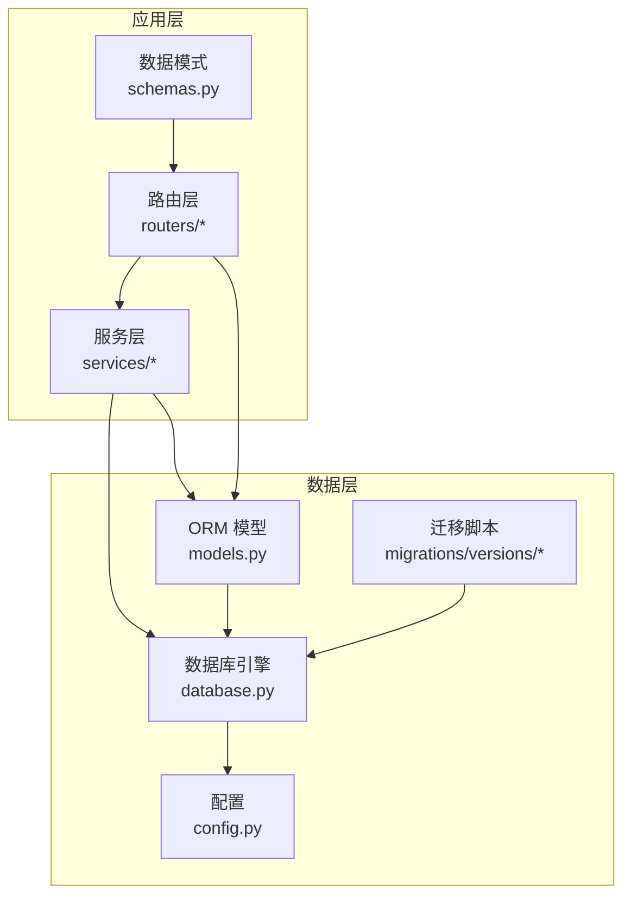
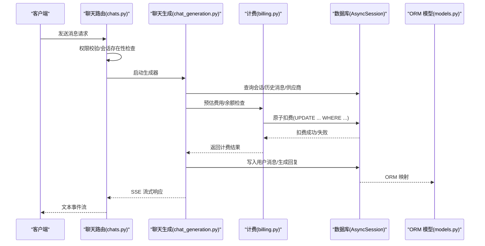
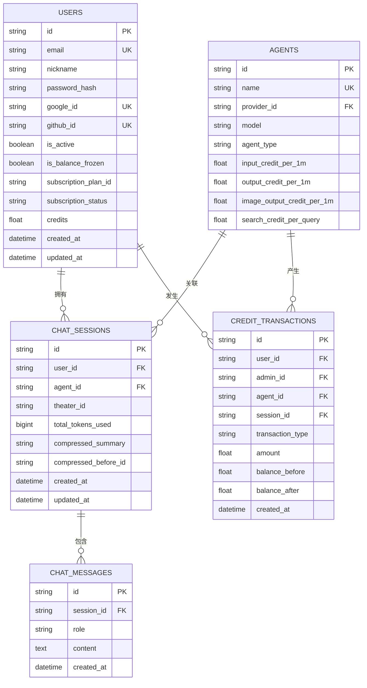
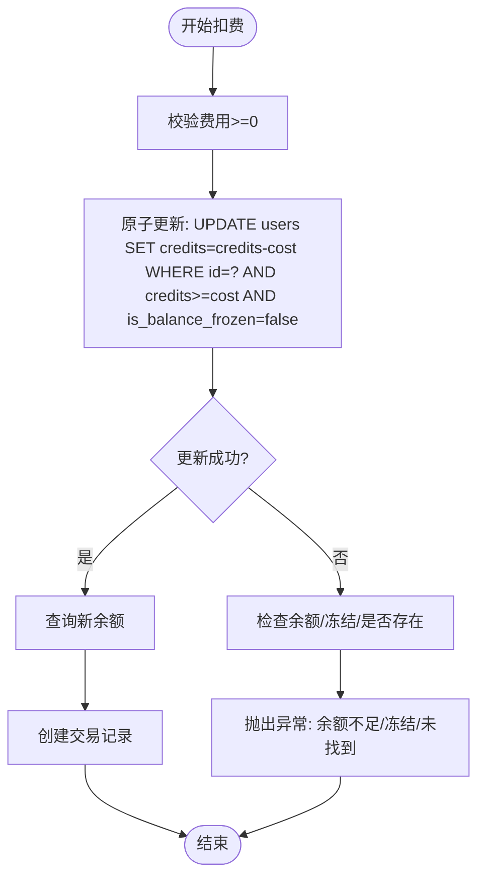
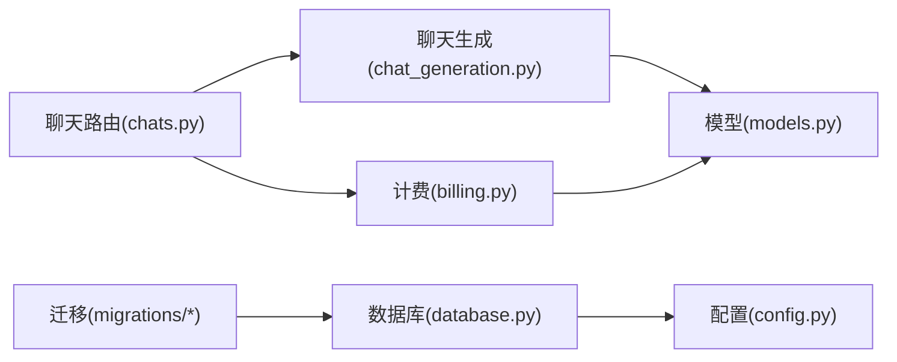

# 数据完整性保障

<cite>
**本文引用的文件**
- [database.py](file://backend/database.py)
- [models.py](file://backend/models.py)
- [schemas.py](file://backend/schemas.py)
- [config.py](file://backend/config.py)
- [billing.py](file://backend/services/billing.py)
- [chats.py](file://backend/routers/chats.py)
- [chat_generation.py](file://backend/services/chat_generation.py)
- [admin.py](file://backend/routers/admin.py)
- [admin_auth.py](file://backend/routers/admin_auth.py)
- [14746eaf1c81_initial.py](file://backend/migrations/versions/14746eaf1c81_initial.py)
- [a3b8c9d0e1f2_convert_ids_to_uuid.py](file://backend/migrations/versions/a3b8c9d0e1f2_convert_ids_to_uuid.py)
- [c74e516c6d87_add_credit_billing_system.py](file://backend/migrations/versions/c74e516c6d87_add_credit_billing_system.py)
- [cc40fa02de06_migrate_credits_to_decimal_and_atomic_.py](file://backend/migrations/versions/cc40fa02de06_migrate_credits_to_decimal_and_atomic_.py)
- [4d66cc052bfb_add_admin_debug_sessions.py](file://backend/migrations/versions/4d66cc052bfb_add_admin_debug_sessions.py)
- [4c1a8970b23d_add_compaction_to_admin_debug_sessions.py](file://backend/migrations/versions/4c1a8970b23d_add_compaction_to_admin_debug_sessions.py)
- [l8m9n0o1p2q3_fix_chat_ids_uuid.py](file://backend/migrations/versions/l8m9n0o1p2q3_fix_chat_ids_uuid.py)
- [BILLING_REVIEW.md](file://backend/docs/BILLING_REVIEW.md)
</cite>

## 目录
1. [简介](#简介)
2. [项目结构](#项目结构)
3. [核心组件](#核心组件)
4. [架构总览](#架构总览)
5. [详细组件分析](#详细组件分析)
6. [依赖分析](#依赖分析)
7. [性能考虑](#性能考虑)
8. [故障排查指南](#故障排查指南)
9. [结论](#结论)
10. [附录](#附录)

## 简介
本文件围绕 KunFlix 的数据完整性保障进行系统化梳理，重点覆盖以下方面：
- 数据库约束机制：主键、外键、唯一、检查、非空约束的设计原则与落地
- 数据验证规则与业务规则实现：Pydantic 校验、服务层校验、会话与计费的业务规则
- 事务处理、回滚机制与并发控制策略：原子扣费、余额冻结、并发竞争条件防护
- 备份策略、恢复流程与灾难恢复计划：基于 Alembic 的迁移与版本演进
- 数据安全、访问控制与审计日志：管理员权限、JWT、登录审计
- 数据清理策略、过期数据处理与存储空间管理：会话与消息的生命周期
- 数据质量监控、异常检测与修复机制：计费精度、并发测试与幂等性

## 项目结构
后端采用 FastAPI + SQLAlchemy Async + Alembic 迁移的架构，数据库层通过 async engine 提供连接池与 SQLite/PostgreSQL 双栈支持；模型定义集中于 models.py，路由集中在 routers 下，计费与业务逻辑集中在 services。

图示来源
- [database.py:1-45](file://backend/database.py#L1-L45)
- [models.py:1-503](file://backend/models.py#L1-L503)
- [schemas.py:1-800](file://backend/schemas.py#L1-L800)
- [config.py:1-43](file://backend/config.py#L1-L43)

章节来源
- [database.py:1-45](file://backend/database.py#L1-L45)
- [models.py:1-503](file://backend/models.py#L1-L503)
- [schemas.py:1-800](file://backend/schemas.py#L1-L800)
- [config.py:1-43](file://backend/config.py#L1-L43)

## 核心组件
- 数据库引擎与连接池：异步引擎、SQLite WAL 优化、连接池参数与自动重连
- ORM 模型：用户、管理员、会话、消息、资产、智能体、计费交易、订阅计划、视频任务等
- Pydantic 模式：输入校验、枚举约束、长度与范围校验
- 计费服务：原子扣费、退款、余额检查、计费映射表
- 路由与鉴权：用户/管理员登录、权限校验、会话与消息管理
- 迁移与版本：UUID 主键迁移、计费系统迁移、调试会话迁移

章节来源
- [database.py:1-45](file://backend/database.py#L1-L45)
- [models.py:1-503](file://backend/models.py#L1-L503)
- [schemas.py:1-800](file://backend/schemas.py#L1-L800)
- [billing.py:1-388](file://backend/services/billing.py#L1-L388)
- [chats.py:1-200](file://backend/routers/chats.py#L1-L200)

## 架构总览
下图展示了数据完整性保障的关键交互：路由层接收请求，服务层执行业务规则与计费，ORM 层通过异步会话持久化，迁移层保证结构演进与约束。

图示来源
- [chats.py:127-183](file://backend/routers/chats.py#L127-L183)
- [chat_generation.py:29-200](file://backend/services/chat_generation.py#L29-L200)
- [billing.py:178-308](file://backend/services/billing.py#L178-L308)

## 详细组件分析

### 数据库约束机制与设计原则
- 主键约束：所有实体主键均为 String(36) UUID，默认自动生成，确保全局唯一性与分布式安全
- 外键约束：大量使用 ForeignKey，如 users.id、agents.id、chat_sessions.id 等，配合 ondelete=CASCADE 实现级联删除
- 唯一约束：email、google_id、github_id、llm_providers.name、agents.name 等字段唯一，防止重复
- 非空约束：credits、agent_type、transaction_type 等关键字段 nullable=False，保证业务必需字段不为空
- 检查约束：通过 Pydantic 字段校验（如长度、范围、枚举）与服务层前置检查实现逻辑约束
- 时间戳：server_default=func.now()/onupdate=func.now() 统一记录创建与更新时间

图示来源
- [models.py:35-73](file://backend/models.py#L35-L73)
- [models.py:210-273](file://backend/models.py#L210-L273)
- [models.py:178-197](file://backend/models.py#L178-L197)
- [models.py:199-209](file://backend/models.py#L199-L209)
- [models.py:281-301](file://backend/models.py#L281-L301)

章节来源
- [models.py:10-45](file://backend/models.py#L10-L45)
- [models.py:210-273](file://backend/models.py#L210-L273)
- [models.py:178-209](file://backend/models.py#L178-L209)
- [models.py:281-301](file://backend/models.py#L281-L301)

### 数据验证规则与业务规则实现
- Pydantic 校验：用户注册/登录、管理员登录、订阅分配、LLM 提供商配置、Agent 创建/更新、视频生成请求等均通过 Pydantic 模式进行字段长度、范围、枚举与必填校验
- 业务规则：
  - 付费智能体：若 agent 的任一计费字段大于 0，则要求用户 credits > 0 才允许发起对话
  - 余额检查：在生成前进行 check_balance_sufficient，避免负余额滥用
  - 会话与消息：scoped_query 限制用户只能访问自身会话，管理员可访问调试会话
  - 工具与技能：工具定义与技能提示注入，确保上下文完整性

章节来源
- [schemas.py:13-57](file://backend/schemas.py#L13-L57)
- [schemas.py:239-357](file://backend/schemas.py#L239-L357)
- [schemas.py:640-694](file://backend/schemas.py#L640-L694)
- [chats.py:154-164](file://backend/routers/chats.py#L154-L164)
- [chat_generation.py:175-200](file://backend/services/chat_generation.py#L175-L200)

### 事务处理、回滚机制与并发控制策略
- 原子扣费：deduct_credits_atomic 使用 UPDATE ... WHERE ... 一次性完成余额检查与扣减，避免竞态条件
- 余额冻结：is_balance_frozen 字段阻止扣费，BalanceFrozenError 异常明确提示
- 退款：refund_credits_atomic 原子增加余额并记录交易
- 会话与消息：路由层在生成前写入用户消息，再进行计费与生成，确保消息与计费的一致性
- 并发测试建议：参考 BILLING_REVIEW.md 的验收测试计划，验证高并发下的正确性与幂等性

图示来源
- [billing.py:178-308](file://backend/services/billing.py#L178-L308)

章节来源
- [billing.py:178-308](file://backend/services/billing.py#L178-L308)
- [BILLING_REVIEW.md:12-28](file://backend/docs/BILLING_REVIEW.md#L12-L28)
- [BILLING_REVIEW.md:159-189](file://backend/docs/BILLING_REVIEW.md#L159-L189)

### 备份策略、恢复流程与灾难恢复计划
- 迁移与版本：Alembic 迁移脚本记录数据库结构演进，支持升级与降级
- 关键迁移：
  - 初始表创建与字段类型修正
  - UUID 主键迁移（玩家、LLM 提供商、智能体、故事章节、会话、消息）
  - 计费系统迁移（新增 credit_transactions 表与字段）
  - 调试会话迁移（新增 admin_debug_sessions/admin_debug_messages）
  - 会话 ID 修复（修复 task_executions/credit_transactions 的 session_id 映射）
- 恢复流程：通过 downgrade 回退到上一版本，结合备份文件与迁移脚本恢复

章节来源
- [14746eaf1c81_initial.py:21-56](file://backend/migrations/versions/14746eaf1c81_initial.py#L21-L56)
- [a3b8c9d0e1f2_convert_ids_to_uuid.py:22-335](file://backend/migrations/versions/a3b8c9d0e1f2_convert_ids_to_uuid.py#L22-L335)
- [c74e516c6d87_add_credit_billing_system.py:21-67](file://backend/migrations/versions/c74e516c6d87_add_credit_billing_system.py#L21-L67)
- [4d66cc052bfb_add_admin_debug_sessions.py:21-68](file://backend/migrations/versions/4d66cc052bfb_add_admin_debug_sessions.py#L21-L68)
- [4c1a8970b23d_add_compaction_to_admin_debug_sessions.py:21-36](file://backend/migrations/versions/4c1a8970b23d_add_compaction_to_admin_debug_sessions.py#L21-L36)
- [l8m9n0o1p2q3_fix_chat_ids_uuid.py:123-148](file://backend/migrations/versions/l8m9n0o1p2q3_fix_chat_ids_uuid.py#L123-L148)

### 数据安全、访问控制与审计日志
- 访问控制：
  - 用户/管理员登录：JWT 令牌签发与刷新，管理员登录记录 last_login_at/last_login_ip
  - 权限校验：require_admin、get_current_active_user_or_admin、scoped_query
- 审计日志：
  - 管理员操作：删除智能体打印审计日志（生产环境建议写入专用审计表）
  - 登录审计：管理员登录记录 IP 与时间

章节来源
- [admin_auth.py:36-90](file://backend/routers/admin_auth.py#L36-L90)
- [admin_auth.py:93-127](file://backend/routers/admin_auth.py#L93-L127)
- [admin.py:146-150](file://backend/routers/admin.py#L146-L150)

### 数据清理策略、过期数据处理与存储空间管理
- 会话与消息清理：路由层提供清空会话消息接口，保留会话本身
- 资源清理：资产表与媒体文件路径分离，便于独立清理
- 订阅与过期：subscription_status 字段跟踪状态，到期后自动失效
- 历史压缩：上下文压缩（compressed_summary/compressed_before_id）降低历史消息体积

章节来源
- [models.py:178-197](file://backend/models.py#L178-L197)
- [models.py:444-471](file://backend/models.py#L444-L471)
- [chats.py:186-200](file://backend/routers/chats.py#L186-L200)

### 数据质量监控、异常检测与修复机制
- 计费精度：建议将 credits/amount 从 Float 迁移为 DECIMAL(18,4)，避免浮点误差累积
- 幂等性：credit_transactions 缺少 session_id 唯一约束，重试可能重复计费，建议补充唯一约束或去重策略
- 并发测试：参考验收测试计划，验证高并发下的余额正确性与交易条目数量
- 修复建议：原子 SQL 更新、运行前余额检查、DECIMAL 迁移、索引优化（created_at）

章节来源
- [BILLING_REVIEW.md:12-28](file://backend/docs/BILLING_REVIEW.md#L12-L28)
- [BILLING_REVIEW.md:159-189](file://backend/docs/BILLING_REVIEW.md#L159-L189)
- [cc40fa02de06_migrate_credits_to_decimal_and_atomic_.py:94-121](file://backend/migrations/versions/cc40fa02de06_migrate_credits_to_decimal_and_atomic_.py#L94-L121)

## 依赖分析
- 路由依赖服务：聊天路由依赖聊天生成服务与计费服务
- 服务依赖模型：计费服务依赖 User/Agent/CreditTransaction 模型
- 引擎依赖配置：数据库引擎依赖配置中的 DATABASE_URL
- 迁移依赖模型：迁移脚本定义表结构与约束

图示来源
- [chats.py:1-200](file://backend/routers/chats.py#L1-L200)
- [chat_generation.py:1-200](file://backend/services/chat_generation.py#L1-L200)
- [billing.py:1-388](file://backend/services/billing.py#L1-L388)
- [database.py:1-45](file://backend/database.py#L1-L45)
- [config.py:1-43](file://backend/config.py#L1-L43)

章节来源
- [chats.py:1-200](file://backend/routers/chats.py#L1-L200)
- [chat_generation.py:1-200](file://backend/services/chat_generation.py#L1-L200)
- [billing.py:1-388](file://backend/services/billing.py#L1-L388)
- [database.py:1-45](file://backend/database.py#L1-L45)
- [config.py:1-43](file://backend/config.py#L1-L43)

## 性能考虑
- 连接池与 SQLite 优化：连接池大小、溢出、WAL 模式、busy_timeout、synchronous 设置
- 索引策略：users.email、credit_transactions.user_id、chat_messages.session_id 等常用查询字段建议建立索引
- 流式响应：SSE 流式输出减少内存占用
- 批量写入：工具执行日志分页查询，避免全表扫描

章节来源
- [database.py:9-37](file://backend/database.py#L9-L37)
- [admin_tools.py:144-179](file://backend/routers/admin_tools.py#L144-L179)

## 故障排查指南
- 余额不足：检查用户 credits 与 is_balance_frozen，确认计费映射与预估费用
- 并发扣费失败：确认原子扣费是否命中 WHERE 条件，排查竞态条件
- 会话消息异常：检查 scoped_query 与 session_id 关联，确认压缩状态字段
- 管理员登录失败：核对邮箱/密码、is_active 状态与登录审计日志

章节来源
- [billing.py:45-84](file://backend/services/billing.py#L45-L84)
- [billing.py:178-308](file://backend/services/billing.py#L178-L308)
- [chats.py:71-83](file://backend/routers/chats.py#L71-L83)
- [admin_auth.py:36-90](file://backend/routers/admin_auth.py#L36-L90)

## 结论
KunFlix 的数据完整性保障通过严格的 ORM 约束、Pydantic 校验、原子计费与迁移演进得到全面覆盖。建议进一步完善计费精度（DECIMAL）、幂等性（唯一约束）、并发测试与审计表，以提升系统的可靠性与可维护性。

## 附录
- 配置项：DATABASE_URL、JWT 参数、Redis URL、AI 模型密钥等
- 迁移清单：初始表、UUID 迁移、计费系统、调试会话、会话 ID 修复
- 文档参考：BILLING_REVIEW.md 的风险矩阵与验收测试计划

章节来源
- [config.py:7-42](file://backend/config.py#L7-L42)
- [14746eaf1c81_initial.py:21-56](file://backend/migrations/versions/14746eaf1c81_initial.py#L21-L56)
- [a3b8c9d0e1f2_convert_ids_to_uuid.py:22-335](file://backend/migrations/versions/a3b8c9d0e1f2_convert_ids_to_uuid.py#L22-L335)
- [c74e516c6d87_add_credit_billing_system.py:21-67](file://backend/migrations/versions/c74e516c6d87_add_credit_billing_system.py#L21-L67)
- [4d66cc052bfb_add_admin_debug_sessions.py:21-68](file://backend/migrations/versions/4d66cc052bfb_add_admin_debug_sessions.py#L21-L68)
- [l8m9n0o1p2q3_fix_chat_ids_uuid.py:123-148](file://backend/migrations/versions/l8m9n0o1p2q3_fix_chat_ids_uuid.py#L123-L148)
- [BILLING_REVIEW.md:146-189](file://backend/docs/BILLING_REVIEW.md#L146-L189)