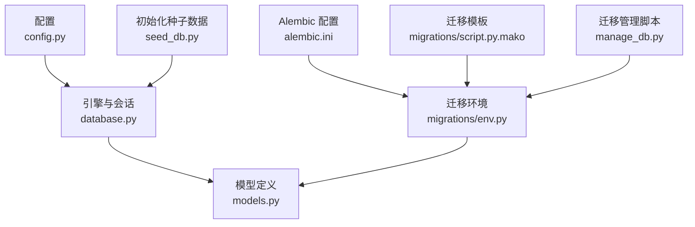
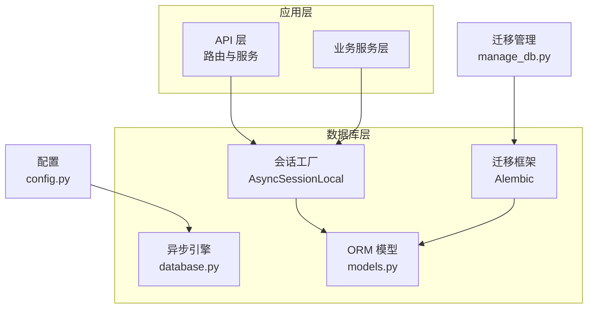
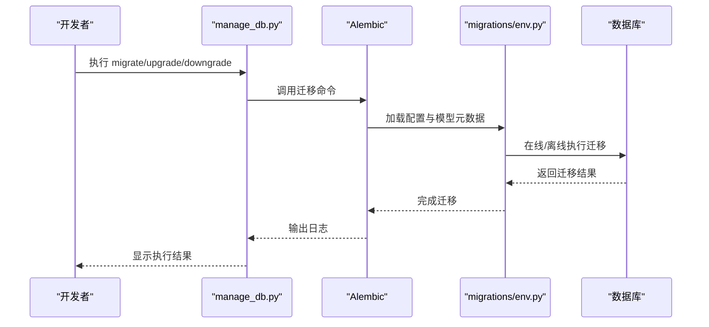
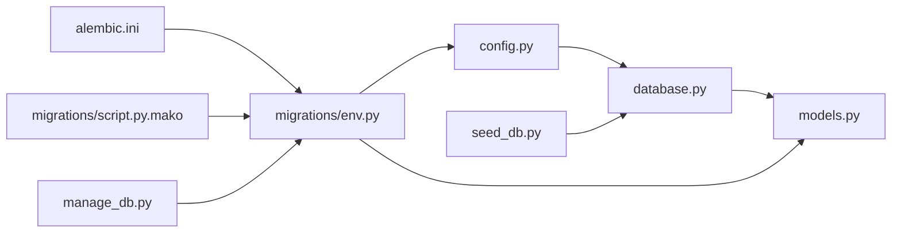

# 数据库设计

<cite>
**本文引用的文件**
- [database.py](file://backend/database.py)
- [models.py](file://backend/models.py)
- [config.py](file://backend/config.py)
- [manage_db.py](file://backend/manage_db.py)
- [alembic.ini](file://backend/alembic.ini)
- [migrations/env.py](file://backend/migrations/env.py)
- [migrations/script.py.mako](file://backend/migrations/script.py.mako)
- [migrations/versions/14746eaf1c81_initial.py](file://backend/migrations/versions/14746eaf1c81_initial.py)
- [migrations/versions/a3b8c9d0e1f2_convert_ids_to_uuid.py](file://backend/migrations/versions/a3b8c9d0e1f2_convert_ids_to_uuid.py)
- [migrations/versions/c74e516c6d87_add_credit_billing_system.py](file://backend/migrations/versions/c74e516c6d87_add_credit_billing_system.py)
- [migrations/versions/d221879c21d9_add_agent_type_and_prompt_templates.py](file://backend/migrations/versions/d221879c21d9_add_agent_type_and_prompt_templates.py)
- [migrations/versions/f1580ee10d5e_add_chat_models.py](file://backend/migrations/versions/f1580ee10d5e_add_chat_models.py)
- [schemas.py](file://backend/schemas.py)
- [seed_db.py](file://backend/seed_db.py)
</cite>

## 目录
1. [简介](#简介)
2. [项目结构](#项目结构)
3. [核心组件](#核心组件)
4. [架构总览](#架构总览)
5. [详细组件分析](#详细组件分析)
6. [依赖分析](#依赖分析)
7. [性能考虑](#性能考虑)
8. [故障排查指南](#故障排查指南)
9. [结论](#结论)
10. [附录](#附录)

## 简介
本文件面向 Infinite Game 数据库设计，围绕基于 SQLAlchemy 的异步 ORM 模型展开，涵盖实体关系模型、字段定义与数据类型选择、数据库迁移策略与 Alembic 版本管理、索引与约束设计、性能优化策略、数据访问模式与事务管理、SQLite 与 PostgreSQL 兼容性、备份与恢复以及监控指标建议。文档同时结合项目中现有的迁移脚本与配置，提供可操作的演进建议与最佳实践。

## 项目结构
数据库相关代码主要集中在 backend 目录，关键文件包括：
- 引擎与会话：database.py
- 模型定义：models.py
- 配置：config.py
- 迁移管理：manage_db.py、alembic.ini、migrations/env.py、migrations/script.py.mako
- 初始数据：seed_db.py
- Pydantic 数据传输对象：schemas.py

图表来源
- [config.py:1-43](file://backend/config.py#L1-L43)
- [database.py:1-45](file://backend/database.py#L1-L45)
- [models.py:1-503](file://backend/models.py#L1-L503)
- [alembic.ini:1-115](file://backend/alembic.ini#L1-L115)
- [migrations/env.py:1-120](file://backend/migrations/env.py#L1-L120)
- [migrations/script.py.mako:1-27](file://backend/migrations/script.py.mako#L1-L27)
- [manage_db.py:1-80](file://backend/manage_db.py#L1-L80)
- [seed_db.py:1-64](file://backend/seed_db.py#L1-L64)

章节来源
- [config.py:1-43](file://backend/config.py#L1-L43)
- [database.py:1-45](file://backend/database.py#L1-L45)
- [models.py:1-503](file://backend/models.py#L1-L503)
- [alembic.ini:1-115](file://backend/alembic.ini#L1-L115)
- [migrations/env.py:1-120](file://backend/migrations/env.py#L1-L120)
- [migrations/script.py.mako:1-27](file://backend/migrations/script.py.mako#L1-L27)
- [manage_db.py:1-80](file://backend/manage_db.py#L1-L80)
- [seed_db.py:1-64](file://backend/seed_db.py#L1-L64)

## 核心组件
- 异步引擎与会话工厂：通过 async engine 与 async sessionmaker 提供连接池、自动重连与线程安全的会话管理；SQLite 专用 PRAGMA 优化以降低“数据库被锁定”风险。
- 模型层：采用 DeclarativeBase，统一主键策略（UUID 字符串）、索引与 JSON 字段，覆盖用户、管理员、剧场、节点、边、资产、LLM 提供商、聊天会话与消息、智能体、积分交易、任务编排、提示词模板、订阅计划、视频任务、工具配置与执行记录等。
- 迁移框架：Alembic 配置与环境脚本，支持离线/在线迁移、批处理模式与临时表清理。
- 数据访问与事务：通过 AsyncSessionLocal 获取会话，结合 Pydantic 模型进行数据校验与序列化。
- 初始化与种子：提供默认 LLM 提供商与管理员账户的初始化脚本。

章节来源
- [database.py:1-45](file://backend/database.py#L1-L45)
- [models.py:1-503](file://backend/models.py#L1-L503)
- [migrations/env.py:1-120](file://backend/migrations/env.py#L1-L120)
- [seed_db.py:1-64](file://backend/seed_db.py#L1-L64)

## 架构总览
下图展示了数据库层在应用中的位置与交互关系：

图表来源
- [database.py:1-45](file://backend/database.py#L1-L45)
- [models.py:1-503](file://backend/models.py#L1-L503)
- [config.py:1-43](file://backend/config.py#L1-L43)
- [manage_db.py:1-80](file://backend/manage_db.py#L1-L80)

## 详细组件分析

### 实体关系模型与字段设计
- 主键策略：统一使用字符串型 UUID（36 字符）作为主键，便于分布式与跨系统引用，避免整型自增带来的冲突与可预测性问题。
- 索引设计：对常用查询字段建立索引（如用户邮箱、管理员邮箱、UUID 主键、会话与消息的关联字段、模板类型、订阅计划等），提升查询性能。
- JSON 字段：广泛使用 JSON/JSONB 字段存储动态配置、元数据与结构化内容，满足多模态与灵活扩展需求。
- 时间戳：统一使用带时区的时间列，并利用 server_default 与 onupdate 自动维护创建与更新时间。
- 外键与级联：在需要删除传播的场景（如剧场节点与边）使用 CASCADE 删除，确保数据一致性。
- 字段类型选择：
  - 浮点型用于积分与费率，避免精度丢失。
  - 大整型用于 token 统计与字节大小。
  - 文本型用于消息与摘要。
  - 布尔型用于开关与状态标志。

章节来源
- [models.py:1-503](file://backend/models.py#L1-L503)

### 数据库迁移策略与版本管理
- 迁移入口：通过 manage_db.py 提供 migrate、upgrade、downgrade、seed 四类命令，封装 Alembic 调用与错误处理。
- Alembic 配置：alembic.ini 指定迁移脚本目录、日志级别与路径前缀；env.py 注入模型元数据与配置，支持离线/在线迁移与批处理模式。
- 模板与脚手架：script.mako 生成迁移骨架，确保每次变更具备明确的 up/down 逻辑。
- 历史迁移示例：
  - 初始版本：创建 LLM 提供商等基础表。
  - UUID 迁移：将玩家、LLM 提供商、智能体等整型主键转换为 UUID，并重建相关表与外键。
  - 聊天模型迁移：新增 chat_sessions 与 chat_messages 表。
  - 积分计费系统：新增 credit_transactions 表与相关字段调整。
  - 提示词模板与智能体类型：新增 prompt_templates 表与 agent_type 字段。

图表来源
- [manage_db.py:1-80](file://backend/manage_db.py#L1-L80)
- [migrations/env.py:1-120](file://backend/migrations/env.py#L1-L120)
- [alembic.ini:1-115](file://backend/alembic.ini#L1-L115)

章节来源
- [manage_db.py:1-80](file://backend/manage_db.py#L1-L80)
- [migrations/env.py:1-120](file://backend/migrations/env.py#L1-L120)
- [migrations/script.py.mako:1-27](file://backend/migrations/script.py.mako#L1-L27)
- [alembic.ini:1-115](file://backend/alembic.ini#L1-L115)
- [migrations/versions/14746eaf1c81_initial.py:1-56](file://backend/migrations/versions/14746eaf1c81_initial.py#L1-L56)
- [migrations/versions/a3b8c9d0e1f2_convert_ids_to_uuid.py:1-335](file://backend/migrations/versions/a3b8c9d0e1f2_convert_ids_to_uuid.py#L1-L335)
- [migrations/versions/f1580ee10d5e_add_chat_models.py:1-63](file://backend/migrations/versions/f1580ee10d5e_add_chat_models.py#L1-L63)
- [migrations/versions/c74e516c6d87_add_credit_billing_system.py:1-67](file://backend/migrations/versions/c74e516c6d87_add_credit_billing_system.py#L1-L67)
- [migrations/versions/d221879c21d9_add_agent_type_and_prompt_templates.py:1-149](file://backend/migrations/versions/d221879c21d9_add_agent_type_and_prompt_templates.py#L1-L149)

### 索引设计与约束规则
- 索引策略：
  - 主键索引：所有表主键均为 UUID，自动建立唯一索引。
  - 唯一索引：用户邮箱、管理员邮箱、LLM 提供商名称等保证唯一性。
  - 普通索引：用户/管理员/会话/消息/任务等常用过滤字段。
- 约束规则：
  - 外键约束：智能体关联提供商、节点与边关联剧场、消息关联会话等。
  - 级联删除：剧场节点与边删除时级联删除子项，确保图结构完整性。
  - 非空与默认值：对关键业务字段设置非空与合理默认值，减少脏数据。
- JSON 字段约束：通过 Pydantic 模型在应用层进行结构校验，数据库层以 JSON 存储。

章节来源
- [models.py:1-503](file://backend/models.py#L1-L503)
- [schemas.py:1-931](file://backend/schemas.py#L1-L931)

### 性能优化策略
- 连接池与自动重连：设置连接池大小与溢出上限，启用 pre_ping 与连接超时，提升高并发下的稳定性。
- SQLite 专项优化：WAL 模式、busy_timeout、synchronous 设置，显著降低锁竞争与“数据库被锁定”错误。
- 查询优化：为高频过滤字段建立索引；避免 N+1 查询，使用 join 或批量加载；对大文本与 JSON 字段按需查询。
- 写入优化：批量插入与事务合并提交；对不必要字段使用默认值，减少写放大。
- 缓存策略：Redis 作为缓存层（配置中已定义），可用于热点数据与会话状态缓存，减轻数据库压力。

章节来源
- [database.py:1-45](file://backend/database.py#L1-L45)
- [config.py:1-43](file://backend/config.py#L1-L43)

### 数据访问模式与事务管理
- 会话生命周期：通过 AsyncSessionLocal 创建异步会话，配合上下文管理器确保资源释放。
- 事务边界：长流程操作（如多表写入）应包裹在单个事务内，失败回滚；读多写少场景可适当放宽隔离级别。
- 读写分离：当前未实现读写分离，建议在高并发读场景引入只读副本或缓存层。
- 并发控制：SQLite 在 WAL 模式下支持并发读写，但复杂事务仍需谨慎；PostgreSQL 默认并发能力更强。

章节来源
- [database.py:42-45](file://backend/database.py#L42-L45)

### SQLite 与 PostgreSQL 兼容性设计
- 连接字符串：config.py 默认使用 sqlite+aiosqlite，可通过注释切换为 PostgreSQL（postgresql+asyncpg）。
- 异步驱动：两者均通过 SQLAlchemy AsyncIO 支持，接口一致。
- SQLite 专属优化：PRAGMA 设置仅在 SQLite 下生效，避免在 PostgreSQL 生效。
- 数据类型差异：JSON/JSONB、时区时间列、索引策略在两种数据库间略有差异，迁移脚本已考虑批处理与兼容性。

章节来源
- [config.py:15-16](file://backend/config.py#L15-L16)
- [database.py:23-31](file://backend/database.py#L23-L31)

### 数据备份与恢复
- 备份策略：
  - SQLite：直接复制数据库文件即可完成物理备份；生产环境建议定期归档。
  - PostgreSQL：使用 pg_dump/pg_restore 或逻辑/物理备份方案。
- 恢复策略：结合 Alembic 迁移，先恢复数据库文件，再执行升级到最新版本。
- 迁移与备份联动：在执行重大迁移前先备份数据库，确保可回滚。

章节来源
- [migrations/env.py:67-77](file://backend/migrations/env.py#L67-L77)

### 监控指标建议
- 数据库层：
  - 连接池利用率、等待时间、超时次数。
  - 查询延迟分布、慢查询统计。
  - 索引命中率、表扫描次数。
- 应用层：
  - 事务成功率与耗时。
  - 缓存命中率与未命中原因。
  - 积分与计费相关指标（余额变动、计费速率）。

## 依赖分析
- 模块耦合：
  - database.py 与 models.py 通过 Base 关联，形成清晰的模型定义与引擎解耦。
  - migrations/env.py 动态导入 models，确保迁移时模型元数据可用。
  - manage_db.py 作为 CLI 入口，封装 Alembic 调用。
- 外部依赖：
  - SQLAlchemy AsyncIO、Alembic、Pydantic（用于数据校验）。
  - Redis（用于缓存，配置中定义）。

图表来源
- [config.py:1-43](file://backend/config.py#L1-L43)
- [database.py:1-45](file://backend/database.py#L1-L45)
- [models.py:1-503](file://backend/models.py#L1-L503)
- [migrations/env.py:1-120](file://backend/migrations/env.py#L1-L120)
- [alembic.ini:1-115](file://backend/alembic.ini#L1-L115)
- [migrations/script.py.mako:1-27](file://backend/migrations/script.py.mako#L1-L27)
- [manage_db.py:1-80](file://backend/manage_db.py#L1-L80)
- [seed_db.py:1-64](file://backend/seed_db.py#L1-L64)

章节来源
- [config.py:1-43](file://backend/config.py#L1-L43)
- [database.py:1-45](file://backend/database.py#L1-L45)
- [models.py:1-503](file://backend/models.py#L1-L503)
- [migrations/env.py:1-120](file://backend/migrations/env.py#L1-L120)
- [alembic.ini:1-115](file://backend/alembic.ini#L1-L115)
- [migrations/script.py.mako:1-27](file://backend/migrations/script.py.mako#L1-L27)
- [manage_db.py:1-80](file://backend/manage_db.py#L1-L80)
- [seed_db.py:1-64](file://backend/seed_db.py#L1-L64)

## 性能考虑
- 连接池与超时：合理设置 pool_size 与 max_overflow，避免连接争用；SQLite 下增加 busy_timeout。
- 索引策略：为高频过滤与 JOIN 字段建立索引；避免过度索引导致写入变慢。
- 查询优化：使用分页、投影字段、条件裁剪；对大 JSON/文本字段按需读取。
- 事务粒度：合并多次写入为单事务，减少提交开销；长事务尽量缩短。
- 缓存：热点数据与会话状态放入 Redis，降低数据库压力。

## 故障排查指南
- “数据库被锁定”（SQLite）：确认 WAL 模式与 busy_timeout 已生效；避免长时间事务与大量并发写入。
- 迁移失败：检查 migrations/env.py 中的临时表清理逻辑；确保 Alembic 配置正确且模型已注册。
- 连接异常：检查 DATABASE_URL、连接超时与池配置；确认 PostgreSQL 服务可达。
- 数据不一致：核对外键与级联规则；在关键流程中使用事务包裹。

章节来源
- [database.py:23-31](file://backend/database.py#L23-L31)
- [migrations/env.py:67-77](file://backend/migrations/env.py#L67-L77)

## 结论
Infinite Game 的数据库设计以 SQLAlchemy 异步 ORM 为核心，结合 Alembic 迁移框架实现了从初始表到复杂业务模型的演进。通过统一的 UUID 主键策略、合理的索引与约束、SQLite/PostgreSQL 兼容性设计以及迁移脚本的规范化，系统具备良好的扩展性与可维护性。建议在生产环境中进一步完善缓存策略、监控体系与备份恢复流程，持续优化查询与事务性能。

## 附录
- 初始化种子：seed_db.py 提供默认 LLM 提供商与管理员账户，便于本地开发与测试。
- 数据传输对象：schemas.py 使用 Pydantic 对输入输出进行严格校验，确保数据质量。

章节来源
- [seed_db.py:1-64](file://backend/seed_db.py#L1-L64)
- [schemas.py:1-931](file://backend/schemas.py#L1-L931)