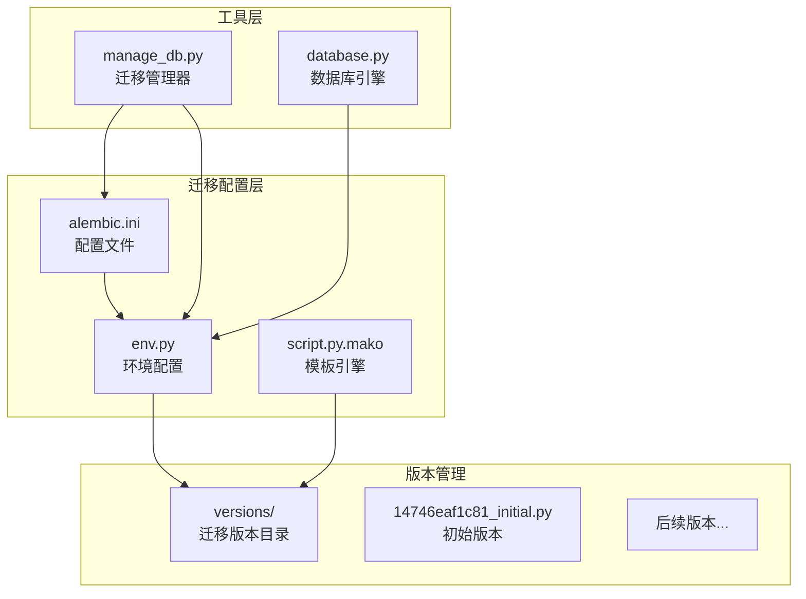
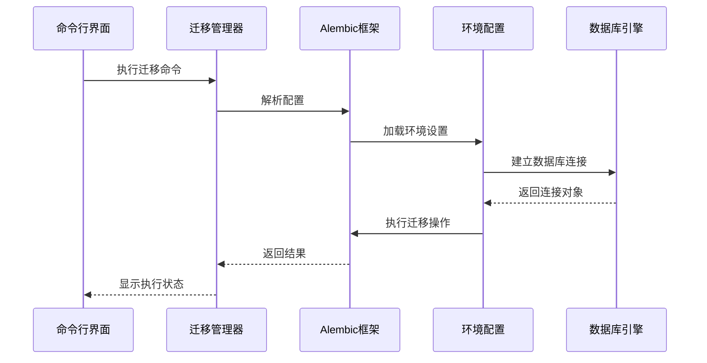
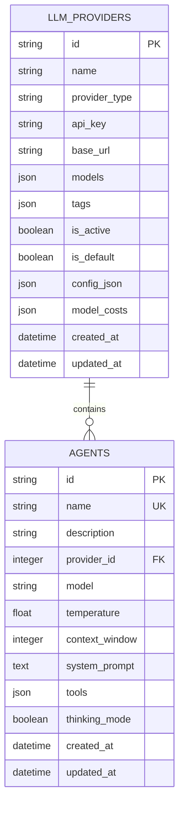
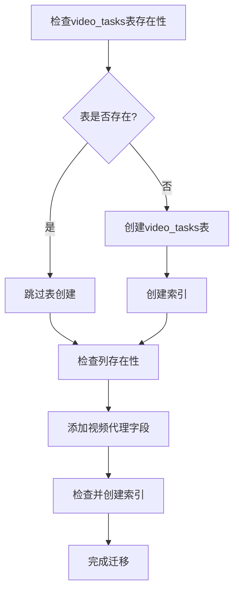
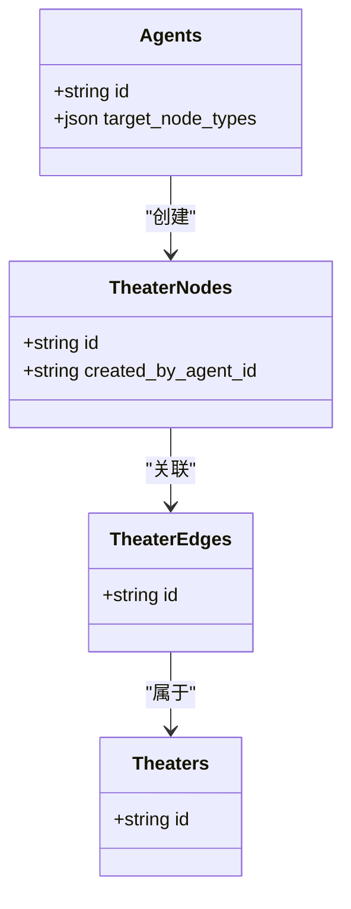
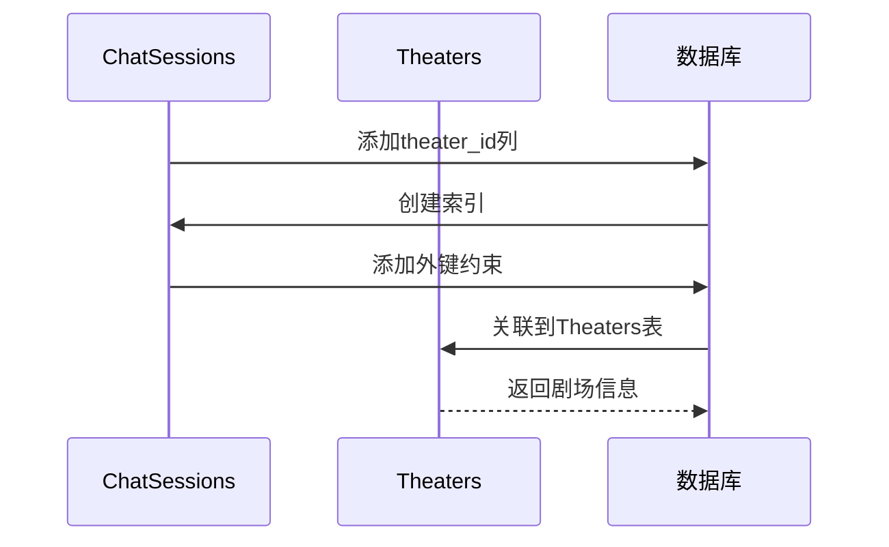
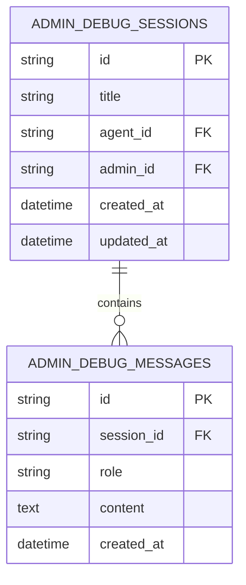
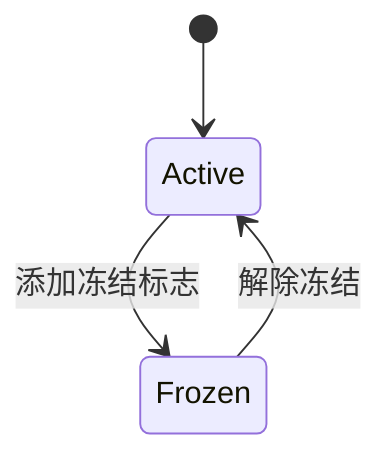
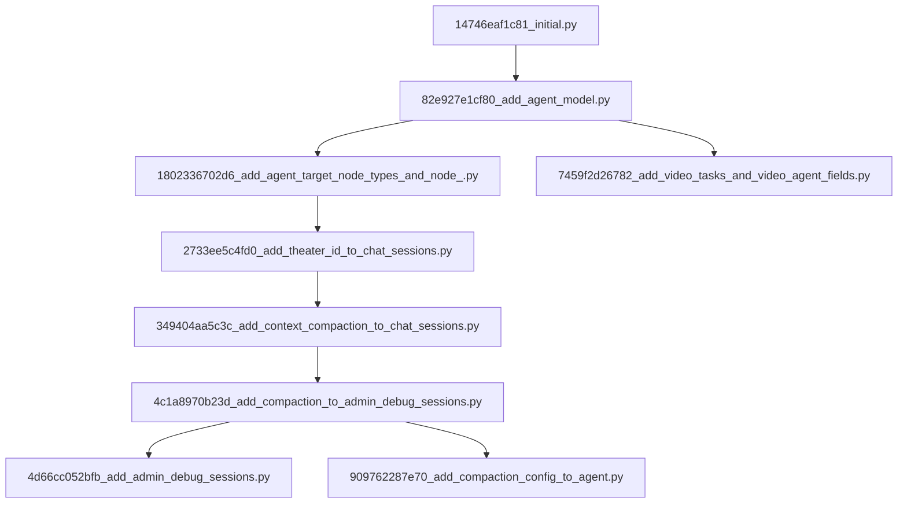
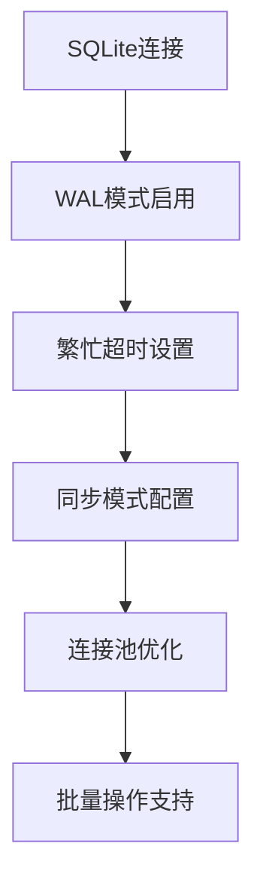

# 数据库迁移管理

<cite>
**本文档引用的文件**
- [backend/migrations/env.py](file://backend/migrations/env.py)
- [backend/migrations/script.py.mako](file://backend/migrations/script.py.mako)
- [backend/alembic.ini](file://backend/alembic.ini)
- [backend/manage_db.py](file://backend/manage_db.py)
- [backend/database.py](file://backend/database.py)
- [backend/migrations/versions/14746eaf1c81_initial.py](file://backend/migrations/versions/14746eaf1c81_initial.py)
- [backend/migrations/versions/82e927e1cf80_add_agent_model.py](file://backend/migrations/versions/82e927e1cf80_add_agent_model.py)
- [backend/migrations/versions/1802336702d6_add_agent_target_node_types_and_node_.py](file://backend/migrations/versions/1802336702d6_add_agent_target_node_types_and_node_.py)
- [backend/migrations/versions/2733ee5c4fd0_add_theater_id_to_chat_sessions.py](file://backend/migrations/versions/2733ee5c4fd0_add_theater_id_to_chat_sessions.py)
- [backend/migrations/versions/349404aa5c3c_add_context_compaction_to_chat_sessions.py](file://backend/migrations/versions/349404aa5c3c_add_context_compaction_to_chat_sessions.py)
- [backend/migrations/versions/4c1a8970b23d_add_compaction_to_admin_debug_sessions.py](file://backend/migrations/versions/4c1a8970b23d_add_compaction_to_admin_debug_sessions.py)
- [backend/migrations/versions/4d66cc052bfb_add_admin_debug_sessions.py](file://backend/migrations/versions/4d66cc052bfb_add_admin_debug_sessions.py)
- [backend/migrations/versions/5f5b1c3da653_add_user_balance_frozen_status.py](file://backend/migrations/versions/5f5b1c3da653_add_user_balance_frozen_status.py)
- [backend/migrations/versions/7459f2d26782_add_video_tasks_and_video_agent_fields.py](file://backend/migrations/versions/7459f2d26782_add_video_tasks_and_video_agent_fields.py)
- [backend/migrations/versions/909762287e70_add_compaction_config_to_agent.py](file://backend/migrations/versions/909762287e70_add_compaction_config_to_agent.py)
</cite>

## 目录
1. [简介](#简介)
2. [项目结构](#项目结构)
3. [核心组件](#核心组件)
4. [架构概览](#架构概览)
5. [详细组件分析](#详细组件分析)
6. [依赖关系分析](#依赖关系分析)
7. [性能考虑](#性能考虑)
8. [故障排除指南](#故障排除指南)
9. [结论](#结论)
10. [附录](#附录)

## 简介

KunFlix项目采用Alembic作为数据库迁移管理框架，实现了从SQLite到PostgreSQL的完整数据库演进策略。该项目通过系统化的迁移脚本管理，确保了数据库结构的版本控制、数据一致性维护和跨平台兼容性。

项目的核心特点包括：
- 异步Alembic配置支持
- 批量操作优化
- 临时表清理机制
- 多数据库平台兼容性
- 完整的迁移历史追踪

## 项目结构

KunFlix的数据库迁移管理采用标准的Alembic目录结构，主要包含以下核心组件：

**图表来源**
- [backend/alembic.ini:1-115](file://backend/alembic.ini#L1-L115)
- [backend/migrations/env.py:1-120](file://backend/migrations/env.py#L1-L120)
- [backend/migrations/script.py.mako:1-27](file://backend/migrations/script.py.mako#L1-L27)

**章节来源**
- [backend/alembic.ini:1-115](file://backend/alembic.ini#L1-L115)
- [backend/migrations/env.py:1-120](file://backend/migrations/env.py#L1-L120)
- [backend/migrations/script.py.mako:1-27](file://backend/migrations/script.py.mako#L1-L27)

## 核心组件

### Alembic配置系统

Alembic配置系统通过多个文件协同工作，实现完整的迁移管理功能：

#### 主配置文件 (alembic.ini)
配置文件定义了迁移脚本的位置、模板格式和日志设置。关键配置包括：
- `script_location`: 迁移脚本根目录
- `version_locations`: 版本位置配置
- `prepend_sys_path`: Python路径前缀
- 日志级别和格式化设置

#### 环境配置 (env.py)
环境配置文件负责：
- 动态导入应用配置和模型
- 设置目标元数据
- 实现离线和在线迁移模式
- 批量操作优化
- 临时表清理机制

#### 模板引擎 (script.py.mako)
Mako模板引擎提供迁移脚本的动态生成能力，支持：
- 自定义模板变量
- 条件生成逻辑
- 扩展性设计

**章节来源**
- [backend/alembic.ini:1-115](file://backend/alembic.ini#L1-L115)
- [backend/migrations/env.py:1-120](file://backend/migrations/env.py#L1-L120)
- [backend/migrations/script.py.mako:1-27](file://backend/migrations/script.py.mako#L1-L27)

### 迁移管理工具

#### 管理脚本 (manage_db.py)
提供命令行接口来管理数据库迁移：
- `migrate`: 基于模型变更自动生成迁移
- `upgrade`: 应用所有待处理的迁移
- `downgrade`: 回滚最后一个迁移
- `seed`: 初始化数据库数据

#### 数据库引擎 (database.py)
异步SQLAlchemy引擎配置：
- 支持SQLite和PostgreSQL
- SQLite优化配置（WAL模式、超时设置）
- 连接池管理和自动重连
- 异步会话管理

**章节来源**
- [backend/manage_db.py:1-80](file://backend/manage_db.py#L1-L80)
- [backend/database.py:1-45](file://backend/database.py#L1-L45)

## 架构概览

KunFlix的数据库迁移架构采用分层设计，确保了系统的可扩展性和维护性：

**图表来源**
- [backend/manage_db.py:20-38](file://backend/manage_db.py#L20-L38)
- [backend/migrations/env.py:89-119](file://backend/migrations/env.py#L89-L119)

### 迁移执行流程

系统支持两种迁移执行模式：

#### 离线模式 (Offline Mode)
适用于静态SQL生成场景，不直接连接数据库。

#### 在线模式 (Online Mode)
通过异步引擎连接数据库，支持批量操作和临时表清理。

**章节来源**
- [backend/migrations/env.py:42-119](file://backend/migrations/env.py#L42-L119)

## 详细组件分析

### 初始版本迁移 (14746eaf1c81_initial.py)

初始版本建立了项目的基础数据库结构，包含以下关键表：

**图表来源**
- [backend/migrations/versions/14746eaf1c81_initial.py:27-43](file://backend/migrations/versions/14746eaf1c81_initial.py#L27-L43)
- [backend/migrations/versions/82e927e1cf80_add_agent_model.py:23-38](file://backend/migrations/versions/82e927e1cf80_add_agent_model.py#L23-L38)

#### 核心特性
- JSON字段支持（模型配置、成本结构）
- 时间戳自动管理
- 外键关系建立
- 索引优化配置

**章节来源**
- [backend/migrations/versions/14746eaf1c81_initial.py:1-56](file://backend/migrations/versions/14746eaf1c81_initial.py#L1-L56)
- [backend/migrations/versions/82e927e1cf80_add_agent_model.py:1-54](file://backend/migrations/versions/82e927e1cf80_add_agent_model.py#L1-L54)

### 视频任务系统 (7459f2d26782_add_video_tasks_and_video_agent_fields.py)

视频功能的引入带来了复杂的表结构变更：

**图表来源**
- [backend/migrations/versions/7459f2d26782_add_video_tasks_and_video_agent_fields.py:23-83](file://backend/migrations/versions/7459f2d26782_add_video_tasks_and_video_agent_fields.py#L23-L83)

#### 关键变更
- 新增视频任务表（video_tasks）
- 代理视频资源配额字段
- 多维度索引优化
- 外键约束管理

**章节来源**
- [backend/migrations/versions/7459f2d26782_add_video_tasks_and_video_agent_fields.py:1-114](file://backend/migrations/versions/7459f2d26782_add_video_tasks_and_video_agent_fields.py#L1-L114)

### 节剧场系统 (1802336702d6_add_agent_target_node_types_and_node_.py)

节剧场功能引入了复杂的关系映射：

**图表来源**
- [backend/migrations/versions/1802336702d6_add_agent_target_node_types_and_node_.py:23-35](file://backend/migrations/versions/1802336702d6_add_agent_target_node_types_and_node_.py#L23-L35)

#### 系统特性
- 节点类型目标配置
- 代理创建关系追踪
- 复杂索引优化
- 外键完整性保证

**章节来源**
- [backend/migrations/versions/1802336702d6_add_agent_target_node_types_and_node_.py:1-57](file://backend/migrations/versions/1802336702d6_add_agent_target_node_types_and_node_.py#L1-L57)

### 聊天会话增强 (2733ee5c4fd0_add_theater_id_to_chat_sessions.py)

聊天功能的剧场集成：

**图表来源**
- [backend/migrations/versions/2733ee5c4fd0_add_theater_id_to_chat_sessions.py:23-26](file://backend/migrations/versions/2733ee5c4fd0_add_theater_id_to_chat_sessions.py#L23-L26)

**章节来源**
- [backend/migrations/versions/2733ee5c4fd0_add_theater_id_to_chat_sessions.py:1-39](file://backend/migrations/versions/2733ee5c4fd0_add_theater_id_to_chat_sessions.py#L1-L39)

### 上下文压缩系统 (349404aa5c3c_add_context_compaction_to_chat_sessions.py)

上下文压缩功能的实现：

**图表来源**
- [backend/migrations/versions/349404aa5c3c_add_context_compaction_to_chat_sessions.py:23-25](file://backend/migrations/versions/349404aa5c3c_add_context_compaction_to_chat_sessions.py#L23-L25)

**章节来源**
- [backend/migrations/versions/349404aa5c3c_add_context_compaction_to_chat_sessions.py:1-37](file://backend/migrations/versions/349404aa5c3c_add_context_compaction_to_chat_sessions.py#L1-L37)

### 管理员调试系统 (4d66cc052bfb_add_admin_debug_sessions.py)

管理员调试功能的完整实现：

**图表来源**
- [backend/migrations/versions/4d66cc052bfb_add_admin_debug_sessions.py:23-47](file://backend/migrations/versions/4d66cc052bfb_add_admin_debug_sessions.py#L23-L47)

**章节来源**
- [backend/migrations/versions/4d66cc052bfb_add_admin_debug_sessions.py:1-69](file://backend/migrations/versions/4d66cc052bfb_add_admin_debug_sessions.py#L1-L69)

### 用户余额冻结 (5f5b1c3da653_add_user_balance_frozen_status.py)

用户余额管理增强：

**图表来源**
- [backend/migrations/versions/5f5b1c3da653_add_user_balance_frozen_status.py:26-27](file://backend/migrations/versions/5f5b1c3da653_add_user_balance_frozen_status.py#L26-L27)

**章节来源**
- [backend/migrations/versions/5f5b1c3da653_add_user_balance_frozen_status.py:1-44](file://backend/migrations/versions/5f5b1c3da653_add_user_balance_frozen_status.py#L1-L44)

### 代理压缩配置 (909762287e70_add_compaction_config_to_agent.py)

代理压缩配置的添加：

**章节来源**
- [backend/migrations/versions/909762287e70_add_compaction_config_to_agent.py:1-35](file://backend/migrations/versions/909762287e70_add_compaction_config_to_agent.py#L1-L35)

## 依赖关系分析

### 迁移版本依赖图

**图表来源**
- [backend/migrations/versions/14746eaf1c81_initial.py:1-56](file://backend/migrations/versions/14746eaf1c81_initial.py#L1-L56)
- [backend/migrations/versions/82e927e1cf80_add_agent_model.py:1-54](file://backend/migrations/versions/82e927e1cf80_add_agent_model.py#L1-L54)
- [backend/migrations/versions/1802336702d6_add_agent_target_node_types_and_node_.py:1-57](file://backend/migrations/versions/1802336702d6_add_agent_target_node_types_and_node_.py#L1-L57)
- [backend/migrations/versions/2733ee5c4fd0_add_theater_id_to_chat_sessions.py:1-39](file://backend/migrations/versions/2733ee5c4fd0_add_theater_id_to_chat_sessions.py#L1-L39)
- [backend/migrations/versions/349404aa5c3c_add_context_compaction_to_chat_sessions.py:1-37](file://backend/migrations/versions/349404aa5c3c_add_context_compaction_to_chat_sessions.py#L1-L37)
- [backend/migrations/versions/4c1a8970b23d_add_compaction_to_admin_debug_sessions.py:1-37](file://backend/migrations/versions/4c1a8970b23d_add_compaction_to_admin_debug_sessions.py#L1-L37)
- [backend/migrations/versions/4d66cc052bfb_add_admin_debug_sessions.py:1-69](file://backend/migrations/versions/4d66cc052bfb_add_admin_debug_sessions.py#L1-L69)
- [backend/migrations/versions/7459f2d26782_add_video_tasks_and_video_agent_fields.py:1-114](file://backend/migrations/versions/7459f2d26782_add_video_tasks_and_video_agent_fields.py#L1-L114)
- [backend/migrations/versions/909762287e70_add_compaction_config_to_agent.py:1-35](file://backend/migrations/versions/909762287e70_add_compaction_config_to_agent.py#L1-L35)

### 组件耦合分析

系统采用松耦合设计，各组件职责明确：
- 配置层：独立于业务逻辑
- 环境层：集中处理数据库连接
- 版本层：模块化迁移脚本
- 工具层：提供命令行接口

**章节来源**
- [backend/migrations/env.py:1-120](file://backend/migrations/env.py#L1-L120)
- [backend/manage_db.py:1-80](file://backend/manage_db.py#L1-L80)

## 性能考虑

### SQLite优化配置

项目针对SQLite数据库进行了专门优化：

**图表来源**
- [backend/database.py:23-31](file://backend/database.py#L23-L31)

### 批量操作优化

Alembic批量操作提供了显著的性能提升：
- 减少单个DDL语句数量
- 优化事务处理
- 支持临时表清理
- 批量索引创建

**章节来源**
- [backend/migrations/env.py:67-87](file://backend/migrations/env.py#L67-L87)
- [backend/database.py:1-45](file://backend/database.py#L1-L45)

## 故障排除指南

### 常见问题及解决方案

#### 迁移执行失败
- 检查数据库连接配置
- 验证Alembic版本兼容性
- 确认权限设置正确

#### 数据库锁定错误
- SQLite WAL模式配置
- 连接超时参数调整
- 批量操作优化

#### 版本冲突处理
- 使用`alembic show`查看当前状态
- 手动解决冲突的迁移脚本
- 谨慎使用downgrade操作

**章节来源**
- [backend/migrations/env.py:67-77](file://backend/migrations/env.py#L67-L77)
- [backend/database.py:23-31](file://backend/database.py#L23-L31)

## 结论

KunFlix的数据库迁移管理系统展现了现代Web应用的数据管理最佳实践。通过Alembic框架的深入集成，项目实现了：

1. **完整的版本控制**：从初始版本到最新版本的完整演进历史
2. **跨平台兼容**：同时支持SQLite和PostgreSQL数据库
3. **性能优化**：批量操作和连接池配置
4. **可维护性**：模块化的迁移脚本和清晰的依赖关系
5. **安全性**：外键约束和数据完整性保证

该系统为类似项目提供了优秀的参考模板，展示了如何在实际生产环境中有效管理数据库演进。

## 附录

### 迁移命令参考

- `python manage_db.py migrate "描述变更"` - 创建新迁移
- `python manage_db.py upgrade` - 应用所有迁移
- `python manage_db.py downgrade` - 回滚上一个迁移
- `python manage_db.py seed` - 初始化数据

### 配置文件说明

- `alembic.ini`: Alembic主配置文件
- `env.py`: 运行环境配置
- `script.py.mako`: 迁移脚本模板
- `manage_db.py`: 迁移管理工具
- `database.py`: 数据库引擎配置