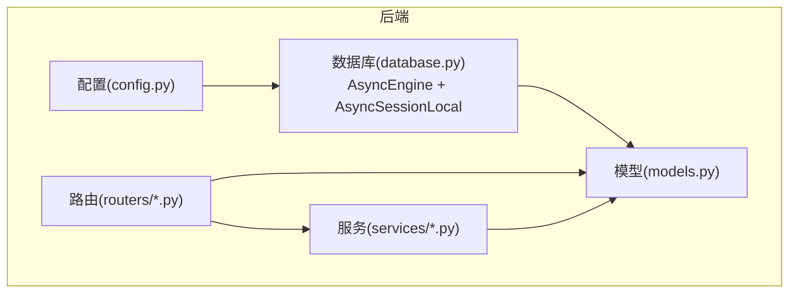
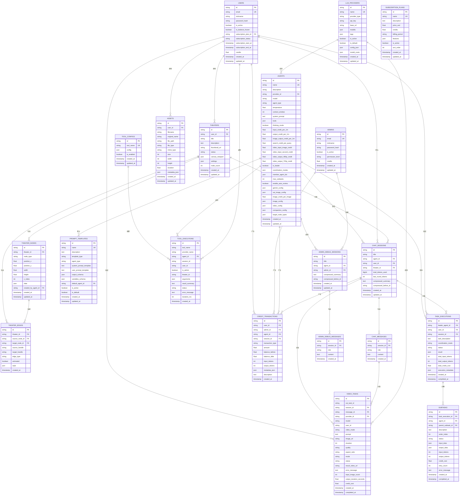
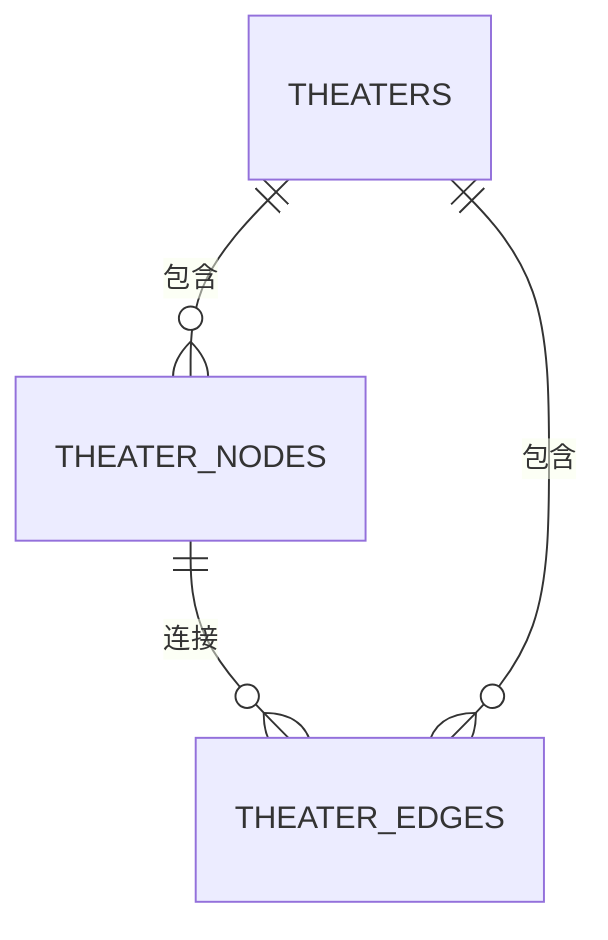
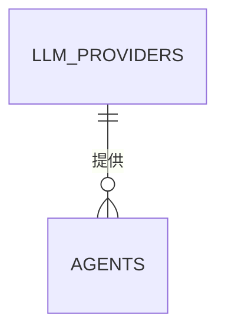
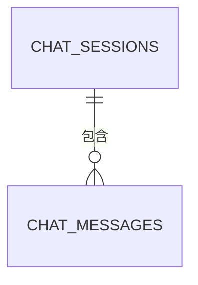
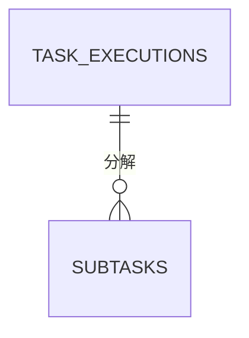
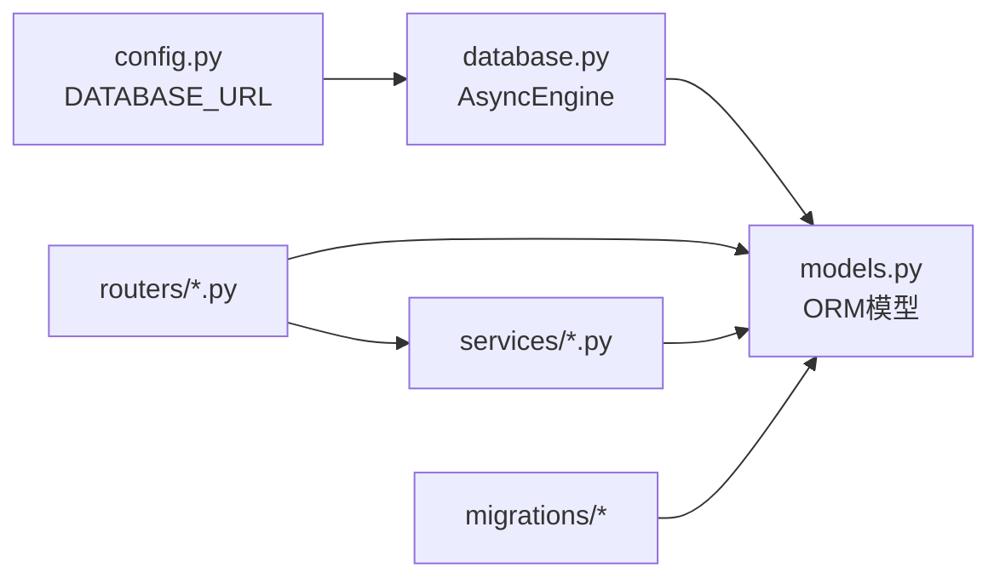

# 数据模型设计

<cite>
**本文引用的文件**
- [models.py](file://backend/models.py)
- [database.py](file://backend/database.py)
- [schemas.py](file://backend/schemas.py)
- [config.py](file://backend/config.py)
- [a3b8c9d0e1f2_convert_ids_to_uuid.py](file://backend/migrations/versions/a3b8c9d0e1f2_convert_ids_to_uuid.py)
- [admin.py](file://backend/routers/admin.py)
- [theaters.py](file://backend/routers/theaters.py)
- [chats.py](file://backend/routers/chats.py)
- [theater.py](file://backend/services/theater.py)
- [chat_generation.py](file://backend/services/chat_generation.py)
</cite>

## 目录
1. [简介](#简介)
2. [项目结构](#项目结构)
3. [核心组件](#核心组件)
4. [架构总览](#架构总览)
5. [详细组件分析](#详细组件分析)
6. [依赖分析](#依赖分析)
7. [性能考量](#性能考量)
8. [故障排查指南](#故障排查指南)
9. [结论](#结论)
10. [附录](#附录)

## 简介
本文件面向Infinite Game项目的数据模型设计，围绕基于SQLAlchemy的ORM模型进行系统化梳理。重点涵盖用户(User)、管理员(Admin)、剧场(Theater)、节点(TheaterNode)、边(TheaterEdge)、资产(Asset)、聊天会话(ChatSession)、聊天消息(ChatMessage)、代理(Agent)、积分交易(CreditTransaction)、任务执行(TaskExecution)、子任务(SubTask)、提示词模板(PromptTemplate)、订阅计划(SubscriptionPlan)、视频任务(VideoTask)、管理员调试会话(AdminDebugSession)、管理员调试消息(AdminDebugMessage)、工具配置(ToolConfig)、工具执行(ToolExecution)等核心实体。文档从字段定义、数据类型选择、主外键关系、索引策略与约束规则入手，解释UUID主键设计、JSON字段的使用场景、时间戳字段的自动管理机制，并给出模型间关联关系图与外键约束说明，同时讨论向后兼容性设计考虑。

## 项目结构
后端采用FastAPI + SQLAlchemy异步ORM架构，数据库通过Alembic进行版本化迁移。模型定义集中在models.py中，数据库引擎与会话工厂在database.py中初始化，配置项在config.py中集中管理；路由层(routers)负责对外暴露REST接口，服务层(services)封装业务逻辑。

图表来源
- [config.py:1-43](file://backend/config.py#L1-L43)
- [database.py:1-45](file://backend/database.py#L1-L45)
- [models.py:1-503](file://backend/models.py#L1-L503)
- [admin.py:1-501](file://backend/routers/admin.py#L1-L501)
- [theaters.py:1-110](file://backend/routers/theaters.py#L1-L110)
- [chats.py:1-232](file://backend/routers/chats.py#L1-L232)
- [theater.py:1-285](file://backend/services/theater.py#L1-L285)
- [chat_generation.py:1-449](file://backend/services/chat_generation.py#L1-L449)

章节来源
- [config.py:1-43](file://backend/config.py#L1-L43)
- [database.py:1-45](file://backend/database.py#L1-L45)

## 核心组件
本节对关键模型进行字段与约束层面的概览，便于快速建立整体认知。

- User/ Admin
  - 主键：String(36)，UUID字符串，默认生成，带唯一索引
  - 关键字段：邮箱唯一索引、昵称、密码哈希、激活状态、角色/权限等级、操作统计、积分余额、登录IP/时间、订阅计划关联、时间戳
  - 约束：邮箱唯一、角色字段保留向后兼容
- Theater
  - 主键：String(36)，UUID字符串
  - 外键：user_id -> users.id，索引
  - JSON字段：canvas_viewport/settings
  - 状态：draft/published/archived
  - 时间戳：created_at/updated_at
- TheaterNode
  - 主键：String(36)，UUID字符串
  - 外键：theater_id -> theaters.id (级联删除)，索引
  - JSON字段：data
  - 外键：created_by_agent_id -> agents.id
  - 时间戳：created_at/updated_at
- TheaterEdge
  - 主键：String(36)，UUID字符串
  - 外键：theater_id/source_node_id/target_node_id -> theaters/theater_nodes.id (级联删除)
  - JSON字段：style
  - 时间戳：created_at
- Asset
  - 主键：String(36)，UUID字符串
  - 外键：user_id -> users.id，索引
  - 文件元数据：原名、路径、类型、MIME、尺寸、宽高、时长、JSON元数据
  - 时间戳：created_at/updated_at
- Agent
  - 主键：String(36)，UUID字符串
  - 外键：provider_id -> llm_providers.id
  - 参数：温度、上下文窗口、系统提示词、工具列表、思考模式
  - 计费：按1M tokens/单位的积分定价
  - 配置：Gemini/xAI统一图像生成配置、视频生成配置、上下文压缩配置、目标节点类型
  - 时间戳：created_at/updated_at
- ChatSession
  - 主键：String(36)，UUID字符串
  - 外键：agent_id -> agents.id；user_id -> users.id；theater_id -> theaters.id
  - 统计：累计token使用量、上一轮token数
  - 压缩：摘要与压缩边界
  - 时间戳：created_at/updated_at
- ChatMessage
  - 主键：String(36)，UUID字符串
  - 外键：session_id -> chat_sessions.id，索引
  - 内容：role/content（多模态内容序列化为JSON）
  - 时间戳：created_at
- CreditTransaction
  - 主键：String(36)，UUID字符串
  - 外键：user_id/admin_id/agent_id/session_id -> users/admins/agents/chat_sessions
  - 交易类型：deduction/recharge/admin_adjust
  - 金额：正负表示充值/扣费
  - 元数据：费率快照等
  - 时间戳：created_at
- TaskExecution/SubTask
  - 主键：String(36)，UUID字符串
  - 外键：leader_agent_id/user_id/session_id -> agents/users/chat_sessions
  - 执行状态：pending/running/completed/failed
  - 结果：JSON
  - 统计：输入/输出tokens、积分消耗、重试次数、错误信息
  - 时间戳：created_at/completed_at
- PromptTemplate
  - 主键：String(36)，UUID字符串
  - 外键：default_agent_id -> agents.id
  - 类型/适用Agent类型、模板内容、输出Schema、变量Schema、激活/默认标记
  - 时间戳：created_at/updated_at
- SubscriptionPlan
  - 主键：String(36)，UUID字符串
  - 价格/积分/周期/特性/排序
  - 时间戳：created_at/updated_at
- VideoTask
  - 主键：String(36)，UUID字符串
  - 外键：session_id/message_id/provider_id -> chat_sessions/chat_messages/llm_providers
  - 用户索引：user_id
  - 视频模式/提示/时长/质量/纵横比/模式
  - 状态：pending/processing/completed/failed
  - 计费：输入图片数/输出秒数/积分消耗
  - 时间戳：created_at/completed_at
- AdminDebugSession/AdminDebugMessage
  - 主键：String(36)，UUID字符串
  - 外键：agent_id/admin_id -> agents/admins
  - 压缩：摘要与压缩边界
  - 时间戳：created_at/updated_at
- ToolConfig/ToolExecution
  - 主键：String(36)，UUID字符串
  - ToolConfig：工具名唯一索引、配置JSON、启用状态
  - ToolExecution：工具名/提供者/Agent/会话/用户/管理员标识/剧场/参数/结果摘要/状态/耗时/时间戳

章节来源
- [models.py:10-503](file://backend/models.py#L10-L503)

## 架构总览
下图展示了核心模型之间的关联关系与外键约束，体现数据流向与一致性保障。

图表来源
- [models.py:10-503](file://backend/models.py#L10-L503)

## 详细组件分析

### 用户(User)与管理员(Admin)
- 设计要点
  - UUID主键：统一ID格式，便于跨系统引用与审计
  - 邮箱唯一索引：保证登录凭证唯一性
  - 激活状态与资金冻结：支持运营管控
  - 订阅计划关联：与SubscriptionPlan建立外键关系
  - 操作统计与积分：记录输入/输出tokens与字符数，以及积分余额
  - 登录信息：记录最近登录时间与IP
  - 时间戳：created_at/updated_at由服务器默认值与更新触发器维护
- 向后兼容
  - 角色字段已废弃，保留以兼容旧版本客户端

章节来源
- [models.py:35-73](file://backend/models.py#L35-L73)
- [models.py:10-33](file://backend/models.py#L10-L33)

### 剧场(Theater)、节点(TheaterNode)、边(TheaterEdge)
- 设计要点
  - 剧场：用户创建的创意项目，支持草稿/发布/归档状态，canvas_viewport与settings为JSON配置
  - 节点：画布元素，支持脚本、角色、故事板、视频等类型，位置、尺寸、层级与业务数据均以JSON存储
  - 边：节点间连接，支持自定义样式与动画
  - 级联删除：节点与边删除时，其关联数据自动清理，保证数据一致性
- 关系图

图表来源
- [models.py:75-130](file://backend/models.py#L75-L130)

章节来源
- [models.py:75-130](file://backend/models.py#L75-L130)
- [theater.py:108-228](file://backend/services/theater.py#L108-L228)

### 资产(Asset)
- 设计要点
  - 用户级媒体资源，跨剧场共享
  - 文件元数据：原名、路径、类型、MIME、尺寸、宽高、时长、JSON元数据
  - 外键：user_id -> users.id，索引加速查询
- 使用场景
  - 图像/视频/音频资源的统一管理与检索

章节来源
- [models.py:131-150](file://backend/models.py#L131-L150)

### 代理(Agent)与提供商(LLMProvider)
- 设计要点
  - Agent：支持文本/图像/多模态/视频等类型，具备温度、上下文窗口、系统提示词、工具列表、思考模式等参数
  - 计费：按1M tokens/单位的积分定价，支持视频输入/输出不同规格计费
  - 配置：Gemini/xAI统一图像生成配置、视频生成配置、上下文压缩配置、目标节点类型
  - LLMProvider：提供者名称唯一，支持多种模型与标签，模型成本以JSON存储
- 关系图

图表来源
- [models.py:152-176](file://backend/models.py#L152-L176)
- [models.py:210-273](file://backend/models.py#L210-L273)

章节来源
- [models.py:152-176](file://backend/models.py#L152-L176)
- [models.py:210-273](file://backend/models.py#L210-L273)

### 聊天会话(ChatSession)与消息(ChatMessage)
- 设计要点
  - ChatSession：标题、关联Agent/用户/剧场，累计token使用量、上一轮token数、上下文压缩摘要与边界
  - ChatMessage：角色与内容（多模态内容序列化为JSON），便于工具调用与技能调用的结构化存储
- 关系图

图表来源
- [models.py:178-209](file://backend/models.py#L178-L209)

章节来源
- [models.py:178-209](file://backend/models.py#L178-L209)
- [chats.py:127-183](file://backend/routers/chats.py#L127-L183)
- [chat_generation.py:29-449](file://backend/services/chat_generation.py#L29-L449)

### 积分交易(CreditTransaction)
- 设计要点
  - 支持用户/管理员/代理/会话维度的积分交易
  - 交易类型：扣费/充值/管理员调整
  - 元数据：费率快照、操作人等
  - 时间戳：created_at
- 使用场景
  - 订阅发放、管理员手动调整、消费扣费

章节来源
- [models.py:281-301](file://backend/models.py#L281-L301)
- [admin.py:141-187](file://backend/routers/admin.py#L141-L187)

### 任务执行(TaskExecution)与子任务(SubTask)
- 设计要点
  - TaskExecution：领导Agent、用户、会话、任务描述、协调模式、状态、结果、统计与元数据
  - SubTask：父任务、Agent、描述、顺序、状态、输入/输出数据、统计与错误信息
- 关系图

图表来源
- [models.py:303-350](file://backend/models.py#L303-L350)

章节来源
- [models.py:303-350](file://backend/models.py#L303-L350)

### 提示词模板(PromptTemplate)
- 设计要点
  - 名称唯一、模板类型与适用Agent类型、系统/用户提示词模板、输出Schema、变量Schema、默认Agent关联、激活/默认标记
  - 时间戳：created_at/updated_at

章节来源
- [models.py:352-387](file://backend/models.py#L352-L387)

### 订阅计划(SubscriptionPlan)
- 设计要点
  - 名称唯一、价格/积分/周期/特性/排序、激活状态
  - 时间戳：created_at/updated_at

章节来源
- [models.py:389-409](file://backend/models.py#L389-L409)

### 视频任务(VideoTask)
- 设计要点
  - 外部任务ID(xai_task_id)、会话/消息/提供商/模型、用户ID索引
  - 视频模式/提示/时长/质量/纵横比/模式
  - 状态：pending/processing/completed/failed
  - 计费：输入图片数/输出秒数/积分消耗
  - 时间戳：created_at/completed_at

章节来源
- [models.py:411-442](file://backend/models.py#L411-L442)

### 管理员调试会话(AdminDebugSession)与消息(AdminDebugMessage)
- 设计要点
  - 与普通用户会话隔离，独立的Agent与管理员关联
  - 支持上下文压缩摘要与边界
  - 时间戳：created_at/updated_at

章节来源
- [models.py:444-471](file://backend/models.py#L444-L471)

### 工具配置(ToolConfig)与工具执行(ToolExecution)
- 设计要点
  - ToolConfig：工具名唯一、配置JSON、启用状态
  - ToolExecution：工具名/提供者/Agent/会话/用户/管理员标识/剧场/参数/结果摘要/状态/耗时/时间戳
  - 时间戳：created_at（带索引）

章节来源
- [models.py:473-503](file://backend/models.py#L473-L503)

## 依赖分析
- 数据库引擎与会话
  - 异步引擎：支持SQLite与PostgreSQL，SQLite启用WAL模式与超时优化
  - 会话工厂：AsyncSessionLocal，expire_on_commit=False
- 迁移与向后兼容
  - 历史迁移：将player/llm_provider/agent等整数主键转换为UUID，确保外键与索引一致性
  - 运行时配置：支持SQLite作为默认开发数据库，可通过环境变量切换至PostgreSQL
- 路由与服务
  - 路由层：admin/theaters/chats等模块直接依赖模型与服务层
  - 服务层：theater.py与chat_generation.py封装复杂业务逻辑，如画布同步、聊天生成、计费与压缩

图表来源
- [config.py:15](file://backend/config.py#L15)
- [database.py:9-37](file://backend/database.py#L9-L37)
- [a3b8c9d0e1f2_convert_ids_to_uuid.py:22-335](file://backend/migrations/versions/a3b8c9d0e1f2_convert_ids_to_uuid.py#L22-L335)

章节来源
- [config.py:1-43](file://backend/config.py#L1-L43)
- [database.py:1-45](file://backend/database.py#L1-L45)
- [a3b8c9d0e1f2_convert_ids_to_uuid.py:1-335](file://backend/migrations/versions/a3b8c9d0e1f2_convert_ids_to_uuid.py#L1-L335)

## 性能考量
- 异步IO与连接池
  - 异步引擎与连接池配置，提升并发吞吐
  - SQLite WAL模式降低锁冲突，提高读写并发
- 索引策略
  - UUID主键默认索引；高频查询字段（如邮箱、用户ID、剧场ID、会话ID、工具名等）建立索引
  - JSON字段不建索引，避免写放大
- 时间戳管理
  - created_at使用服务器默认值，updated_at使用onupdate触发器，减少应用层开销
- 上下文压缩
  - 通过摘要与压缩边界减少LLM上下文长度，降低token消耗与延迟

## 故障排查指南
- 数据库连接问题
  - 检查DATABASE_URL配置，确认SQLite/WAL或PostgreSQL可达
  - SQLite连接超时与并发冲突可通过WAL模式与busy_timeout缓解
- 迁移失败
  - 确认迁移脚本顺序与依赖，UUID转换迁移需先读取旧数据再重建表
- 计费异常
  - 检查CreditTransaction记录与Agent计费配置，核对费率快照与输入/输出tokens
- 会话与消息一致性
  - 清空会话消息后需重置累计token使用量，避免统计偏差

章节来源
- [database.py:23-31](file://backend/database.py#L23-L31)
- [a3b8c9d0e1f2_convert_ids_to_uuid.py:22-335](file://backend/migrations/versions/a3b8c9d0e1f2_convert_ids_to_uuid.py#L22-L335)
- [chats.py:186-211](file://backend/routers/chats.py#L186-L211)

## 结论
本数据模型以UUID为主键统一ID格式，结合JSON字段灵活承载配置与动态内容，配合严格的外键关系与索引策略，支撑起剧场创作、多智能体协作、聊天生成、计费与订阅等核心业务。通过异步ORM与迁移机制，系统在可扩展性、一致性与运维便利性方面取得平衡。建议在生产环境中持续完善索引覆盖与监控告警，确保大规模场景下的稳定性与性能。

## 附录
- 字段类型与约束选择
  - UUID：String(36)，默认生成，主键
  - JSON：用于配置与动态数据，不建索引
  - BigInt：累计token使用量
  - Float：积分余额与计费
  - Boolean：状态与开关
  - DateTime(timezone=True)：时间戳，使用服务器默认值与更新触发器
- 向后兼容性
  - 角色字段废弃保留
  - 历史整数主键迁移至UUID，确保外键与索引一致性
  - Pydantic模型与数据库模型保持字段映射，避免破坏性变更