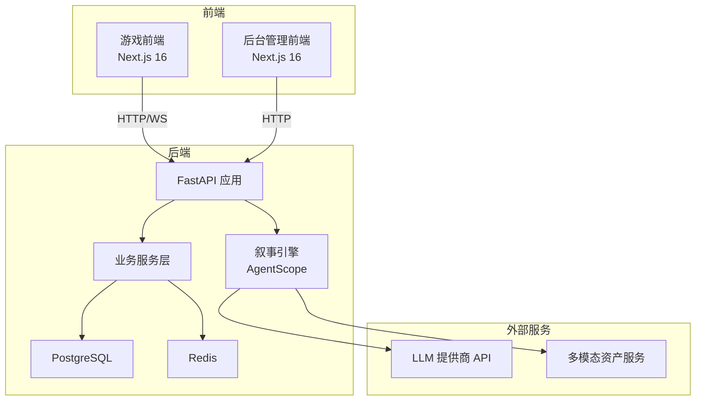
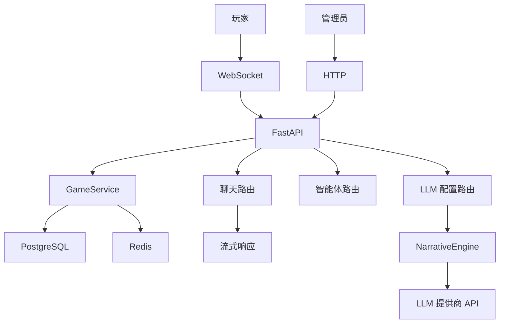
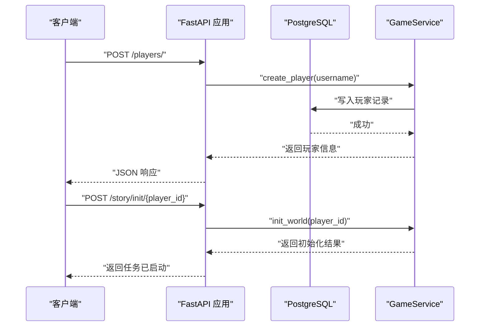
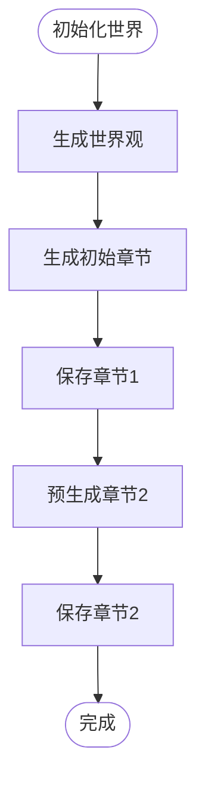
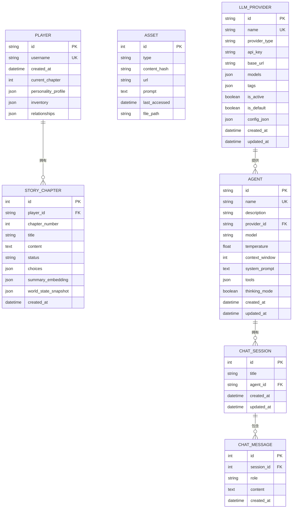
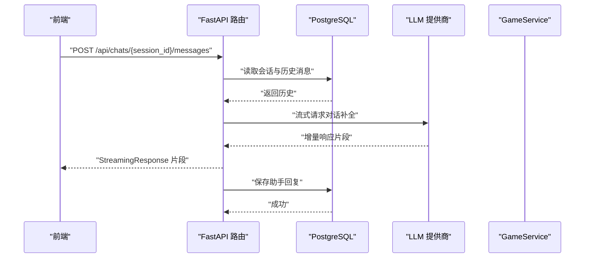
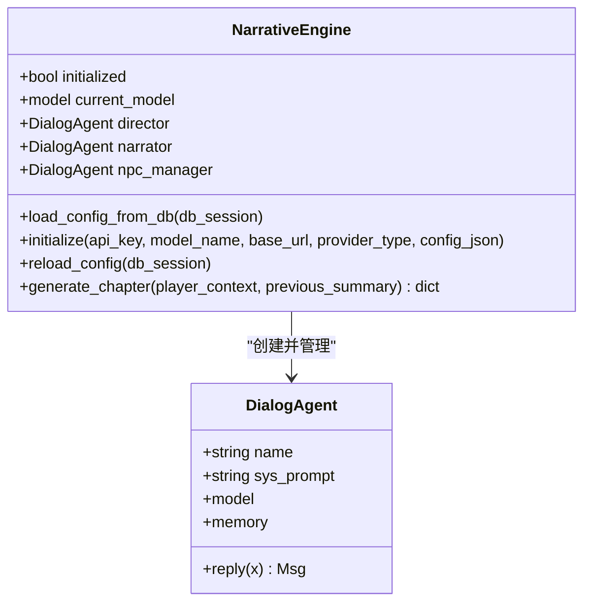
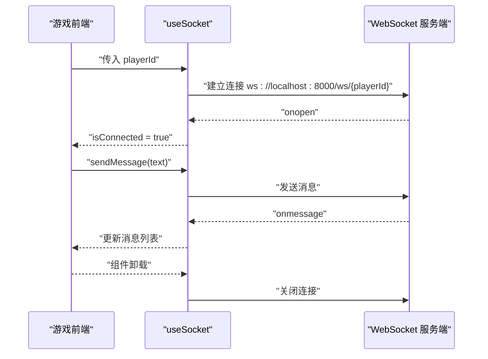
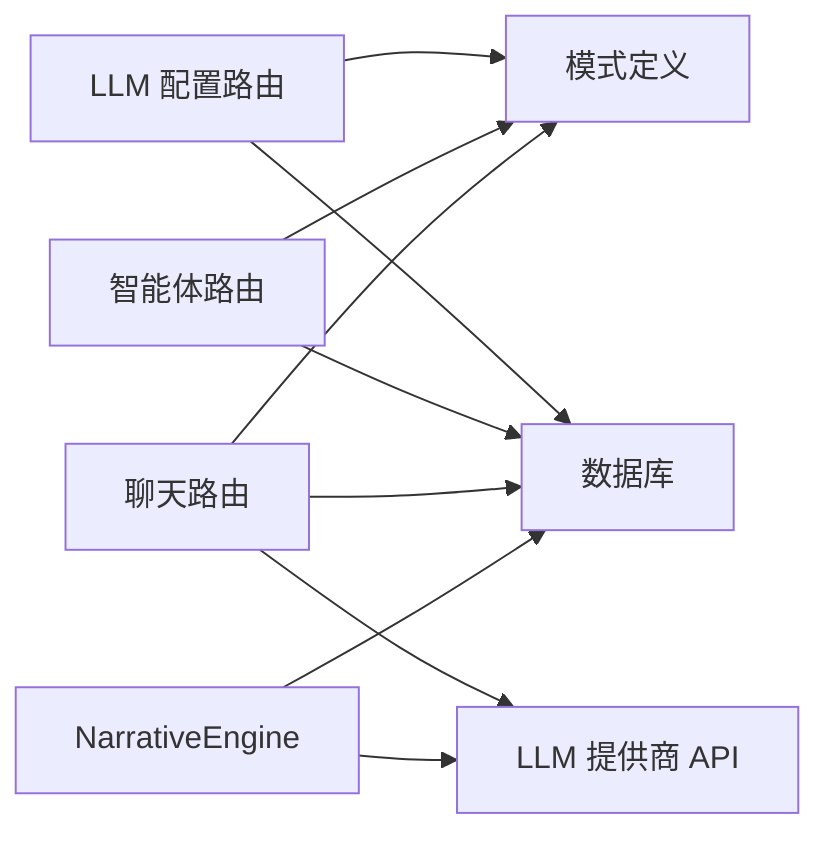

# 整体设计

<cite>
**本文引用的文件**
- [README.md](file://README.md)
- [架构文档](file://docs/wiki/Architecture.md)
- [后端入口 main.py](file://backend/main.py)
- [配置 config.py](file://backend/config.py)
- [数据库与会话 database.py](file://backend/database.py)
- [数据模型 models.py](file://backend/models.py)
- [服务层 services.py](file://backend/services.py)
- [路由：LLM 配置 llm_config.py](file://backend/routers/llm_config.py)
- [路由：智能体 agents.py](file://backend/routers/agents.py)
- [路由：聊天 chats.py](file://backend/routers/chats.py)
- [模式定义 schemas.py](file://backend/schemas.py)
- [叙事引擎 agents.py](file://backend/agents.py)
- [前端布局 layout.tsx](file://frontend/src/app/layout.tsx)
- [WebSocket 客户端钩子 useSocket.ts](file://frontend/src/hooks/useSocket.ts)
- [游戏画布组件 GameCanvas.tsx](file://frontend/src/components/GameCanvas.tsx)
</cite>

## 目录
1. [引言](#引言)
2. [项目结构](#项目结构)
3. [核心组件](#核心组件)
4. [架构总览](#架构总览)
5. [详细组件分析](#详细组件分析)
6. [依赖分析](#依赖分析)
7. [性能考量](#性能考量)
8. [故障排查指南](#故障排查指南)
9. [结论](#结论)
10. [附录](#附录)

## 引言
本项目是一个基于 AgentScope 多智能体框架、Next.js 前端、FastAPI 后端与 PostgreSQL 的“无限剧情游戏”平台。系统以 LLM 驱动的叙事引擎为核心，结合多模态生成能力（图片、语音、音乐），提供可无限延续且逻辑自洽的动态剧情体验。系统采用前后端分离架构，后端通过 FastAPI 提供 REST 与 WebSocket 接口，前端使用 Next.js 16 构建游戏客户端与后台管理界面；同时具备动态 LLM 配置能力与后台管理界面，支持在不重启服务的前提下切换与测试不同 LLM 提供商。

## 项目结构
系统采用“前后端分离 + 微服务风格”的组织方式：
- 后端（Python + FastAPI）：负责业务逻辑、数据持久化、实时通信与外部 LLM 服务对接。
- 前端（Next.js 16）：游戏客户端与后台管理界面，分别运行在不同端口。
- 文档（docs/wiki）：包含架构、后端/前端开发指南、部署与迁移等文档。

图表来源
- [架构文档](file://docs/wiki/Architecture.md#L1-L62)
- [后端入口 main.py](file://backend/main.py#L83-L98)
- [数据库与会话 database.py](file://backend/database.py#L1-L31)
- [配置 config.py](file://backend/config.py#L1-L34)
- [叙事引擎 agents.py](file://backend/agents.py#L43-L196)

章节来源
- [README.md](file://README.md#L34-L51)
- [架构文档](file://docs/wiki/Architecture.md#L1-L62)

## 核心组件
- 后端入口与生命周期管理：负责应用启动、数据库迁移、CORS 配置、路由注册、WebSocket 端点与根路径响应。
- 业务服务层：封装玩家创建、世界初始化、剧情章节生成与一致性校验等核心流程。
- 数据模型与持久化：定义玩家、剧情章节、资产、LLM 提供商、智能体与聊天会话等实体，使用 SQLAlchemy 异步 ORM。
- 路由层：提供 LLM 提供商管理、智能体管理、聊天会话与消息流式响应等接口。
- 叙事引擎：基于 AgentScope 的多智能体编排，负责剧情大纲生成、故事展开与 NPC 关系维护。
- 前端组件：游戏客户端通过 WebSocket 与后端交互，使用 Pixi.js 进行 2D 场景渲染；后台管理前端提供可视化配置界面。

章节来源
- [后端入口 main.py](file://backend/main.py#L45-L82)
- [服务层 services.py](file://backend/services.py#L8-L66)
- [数据模型 models.py](file://backend/models.py#L9-L122)
- [路由：LLM 配置 llm_config.py](file://backend/routers/llm_config.py#L14-L18)
- [路由：智能体 agents.py](file://backend/routers/agents.py#L9-L13)
- [路由：聊天 chats.py](file://backend/routers/chats.py#L16-L20)
- [叙事引擎 agents.py](file://backend/agents.py#L43-L196)
- [前端布局 layout.tsx](file://frontend/src/app/layout.tsx#L1-L35)
- [WebSocket 客户端钩子 useSocket.ts](file://frontend/src/hooks/useSocket.ts#L1-L43)
- [游戏画布组件 GameCanvas.tsx](file://frontend/src/components/GameCanvas.tsx#L1-L50)

## 架构总览
系统采用“前后端分离 + 微服务风格”的架构理念：
- 前端分离：游戏客户端与后台管理前端分别独立开发与部署，共享后端 API。
- 微服务风格：后端以功能模块化组织（LLM 配置、智能体、聊天、管理），通过 FastAPI 路由聚合对外暴露。
- 事件驱动与实时通信：通过 WebSocket 实现实时剧情推送与玩家交互；聊天接口采用流式响应提升交互体验。
- 动态 LLM 配置：支持在后台动态切换与测试不同 LLM 提供商，无需重启服务。
- 扩展性与性能：异步 FastAPI + 异步 SQLAlchemy + 连接池 + Redis 队列，满足高并发与可扩展需求。

图表来源
- [后端入口 main.py](file://backend/main.py#L157-L169)
- [路由：聊天 chats.py](file://backend/routers/chats.py#L72-L258)
- [路由：LLM 配置 llm_config.py](file://backend/routers/llm_config.py#L20-L111)
- [服务层 services.py](file://backend/services.py#L19-L59)
- [数据库与会话 database.py](file://backend/database.py#L1-L31)
- [配置 config.py](file://backend/config.py#L1-L34)

章节来源
- [架构文档](file://docs/wiki/Architecture.md#L1-L62)
- [后端入口 main.py](file://backend/main.py#L83-L98)

## 详细组件分析

### 后端入口与生命周期（FastAPI）
- 生命周期管理：应用启动时尝试连接数据库并执行 Alembic 升级，随后从数据库加载 LLM 配置，保证服务可用性与一致性。
- CORS 配置：允许本地开发环境下的游戏前端与后台管理前端跨域访问。
- 路由注册：统一注册 LLM 配置、智能体、聊天与管理相关路由。
- WebSocket 端点：提供与玩家的实时通信通道，接收输入并回传确认消息（后续可接入叙事引擎处理）。
- 根路径与玩家创建：提供基础健康检查与玩家创建接口，便于前端引导流程。

图表来源
- [后端入口 main.py](file://backend/main.py#L138-L155)
- [服务层 services.py](file://backend/services.py#L12-L17)
- [数据模型 models.py](file://backend/models.py#L9-L23)

章节来源
- [后端入口 main.py](file://backend/main.py#L45-L82)
- [后端入口 main.py](file://backend/main.py#L83-L98)
- [后端入口 main.py](file://backend/main.py#L128-L155)

### 业务服务层（GameService）
- 职责：封装玩家生命周期、世界初始化、章节生成与一致性校验等核心逻辑。
- 世界初始化：调用叙事引擎生成世界观与初始章节，并预生成后续章节，保存到数据库。
- 玩家选择处理：预留接口用于更新玩家状态、一致性校验与触发下一章节生成。

图表来源
- [服务层 services.py](file://backend/services.py#L19-L59)

章节来源
- [服务层 services.py](file://backend/services.py#L8-L66)

### 数据模型与持久化（SQLAlchemy 异步 ORM）
- 实体设计：玩家、剧情章节、资产、LLM 提供商、智能体、聊天会话与消息。
- 关系与索引：通过外键与 JSON 字段支撑复杂剧情图谱与配置；为常用查询字段建立索引。
- 异步会话：使用异步引擎与会话工厂，配合连接池参数提升并发性能。

图表来源
- [数据模型 models.py](file://backend/models.py#L9-L122)

章节来源
- [数据模型 models.py](file://backend/models.py#L1-L122)
- [数据库与会话 database.py](file://backend/database.py#L1-L31)

### 路由层（FastAPI 路由）
- LLM 配置路由：提供提供商的增删改查、连接测试与默认/激活状态切换；支持在运行时触发叙事引擎重新加载配置。
- 智能体路由：提供智能体的创建、查询、更新与删除，严格校验提供商与模型的可用性。
- 聊天路由：创建会话、列出会话、获取消息历史、发送消息并流式返回响应；支持多种 LLM 提供商的流式输出与令牌统计。

图表来源
- [路由：聊天 chats.py](file://backend/routers/chats.py#L72-L258)

章节来源
- [路由：LLM 配置 llm_config.py](file://backend/routers/llm_config.py#L14-L18)
- [路由：LLM 配置 llm_config.py](file://backend/routers/llm_config.py#L112-L138)
- [路由：智能体 agents.py](file://backend/routers/agents.py#L15-L55)
- [路由：聊天 chats.py](file://backend/routers/chats.py#L22-L37)
- [路由：聊天 chats.py](file://backend/routers/chats.py#L72-L258)

### 叙事引擎（AgentScope）
- 组件：Director（导演）、Narrator（旁白）、NPC_Manager（NPC 管理器），均由 DialogAgent 封装。
- 初始化：从数据库加载当前激活的 LLM 提供商，解析模型列表并初始化模型实例；若数据库为空则回退到配置文件。
- 章节生成：先由导演生成大纲，再由旁白展开为完整章节文本，最后由 NPC 管理器更新角色关系，形成闭环。

图表来源
- [叙事引擎 agents.py](file://backend/agents.py#L11-L42)
- [叙事引擎 agents.py](file://backend/agents.py#L43-L196)

章节来源
- [叙事引擎 agents.py](file://backend/agents.py#L43-L196)

### 前端组件与实时通信
- 游戏前端布局：定义全局样式与字体变量，作为 Next.js App Router 的根布局。
- WebSocket 客户端钩子：封装与后端 WebSocket 的连接、消息收发与断开清理，便于在组件中复用。
- 游戏画布组件：使用 Pixi.js 在浏览器端进行 2D 场景渲染，动态导入避免服务端渲染问题。

图表来源
- [WebSocket 客户端钩子 useSocket.ts](file://frontend/src/hooks/useSocket.ts#L8-L33)
- [后端入口 main.py](file://backend/main.py#L157-L169)

章节来源
- [前端布局 layout.tsx](file://frontend/src/app/layout.tsx#L1-L35)
- [WebSocket 客户端钩子 useSocket.ts](file://frontend/src/hooks/useSocket.ts#L1-L43)
- [游戏画布组件 GameCanvas.tsx](file://frontend/src/components/GameCanvas.tsx#L1-L50)

## 依赖分析
- 组件耦合与内聚：路由层仅负责参数校验与调用服务层；服务层封装业务规则并与数据库交互；叙事引擎与 LLM 提供商解耦，通过配置驱动。
- 外部依赖：PostgreSQL 用于结构化数据持久化；Redis 用于任务队列与缓存（未在现有代码中直接使用，但架构文档已规划）；LLM 提供商 API 通过 AgentScope 抽象屏蔽差异。
- 接口契约：Pydantic 模式定义请求/响应结构，确保前后端契约一致；FastAPI 自动生成 OpenAPI 文档。

图表来源
- [模式定义 schemas.py](file://backend/schemas.py#L1-L102)
- [路由：LLM 配置 llm_config.py](file://backend/routers/llm_config.py#L14-L18)
- [路由：智能体 agents.py](file://backend/routers/agents.py#L9-L13)
- [路由：聊天 chats.py](file://backend/routers/chats.py#L16-L20)
- [叙事引擎 agents.py](file://backend/agents.py#L43-L196)

章节来源
- [模式定义 schemas.py](file://backend/schemas.py#L1-L102)
- [路由：LLM 配置 llm_config.py](file://backend/routers/llm_config.py#L14-L18)
- [路由：智能体 agents.py](file://backend/routers/agents.py#L9-L13)
- [路由：聊天 chats.py](file://backend/routers/chats.py#L16-L20)
- [叙事引擎 agents.py](file://backend/agents.py#L43-L196)

## 性能考量
- 异步与连接池：后端使用异步 FastAPI 与 SQLAlchemy 异步引擎，配合连接池参数（大小、溢出、pre_ping）提升并发与稳定性。
- 流式响应：聊天接口采用流式返回，降低首字节延迟，改善用户体验。
- 预生成策略：采用 N+2 章节预生成与后台任务队列（Redis 规划），减少玩家等待时间。
- 缓存与去重：资产表支持按内容哈希去重与访问时间记录，结合缓存策略降低重复生成成本。
- WebSocket：短连接高频交互场景下，建议启用心跳与断线重连策略，避免长时间空闲导致的连接中断。

章节来源
- [数据库与会话 database.py](file://backend/database.py#L8-L23)
- [路由：聊天 chats.py](file://backend/routers/chats.py#L144-L179)
- [架构文档](file://docs/wiki/Architecture.md#L40-L54)

## 故障排查指南
- 启动失败或数据库连接异常：检查数据库 URL 与凭据，确认 Alembic 升级是否成功；查看启动日志中的连接重试与迁移提示。
- WebSocket 无法连接：确认后端 CORS 配置允许前端域名，检查端口与路径；前端 useSocket 钩子中打印的连接/断开日志有助于定位问题。
- LLM 提供商不可用：通过 LLM 配置路由的连接测试接口验证密钥、模型与网关地址；若默认提供商为空，检查配置文件回退逻辑。
- 聊天流式响应中断：检查 LLM 提供商的流式接口兼容性与网络状况；关注日志中的错误信息与令牌统计输出。
- 智能体模型不可用：确认智能体绑定的提供商与模型存在于数据库中，避免因模型不在提供商模型列表而报错。

章节来源
- [后端入口 main.py](file://backend/main.py#L47-L81)
- [后端入口 main.py](file://backend/main.py#L85-L91)
- [路由：LLM 配置 llm_config.py](file://backend/routers/llm_config.py#L20-L111)
- [路由：聊天 chats.py](file://backend/routers/chats.py#L144-L216)
- [路由：智能体 agents.py](file://backend/routers/agents.py#L17-L50)

## 结论
本系统以“前后端分离 + 微服务风格”为基础，结合 FastAPI 的异步能力与 AgentScope 的多智能体编排，实现了可扩展、可配置的无限剧情生成平台。通过动态 LLM 配置、流式响应与预生成策略，系统在保证实时交互体验的同时，兼顾了性能与可维护性。未来可在现有基础上引入 Redis 队列与缓存、增强一致性校验与审计日志，并持续优化多模态资产生成与渲染管线。

## 附录
- 技术栈选型理由：Next.js 16 提供高性能 SSR 与最新 React 特性；FastAPI 适配 LLM 异步调用；AgentScope 便于多智能体协作；PostgreSQL 适合复杂剧情图谱；Pixi.js 用于高质量 2D 渲染。
- 开发与部署：参考 Wiki 中的后端/前端开发指南与部署文档，确保环境变量、数据库与 Redis 正确配置。

章节来源
- [架构文档](file://docs/wiki/Architecture.md#L55-L62)
- [README.md](file://README.md#L14-L33)