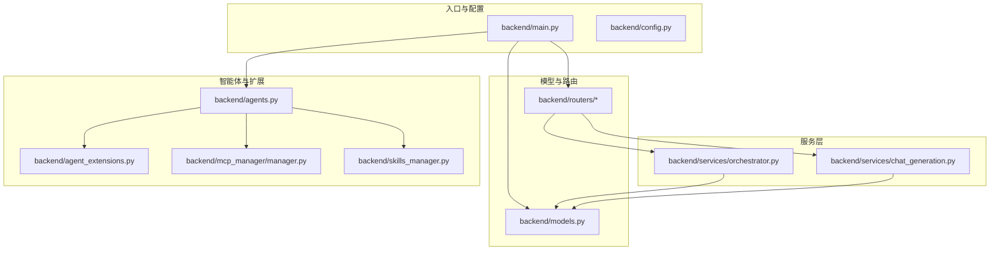
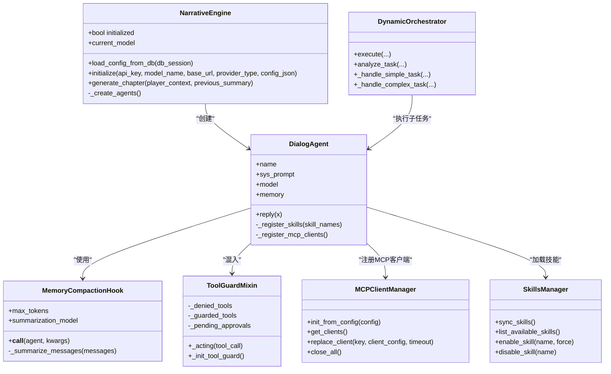
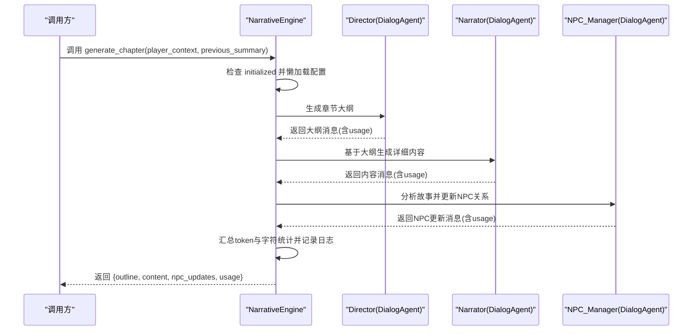
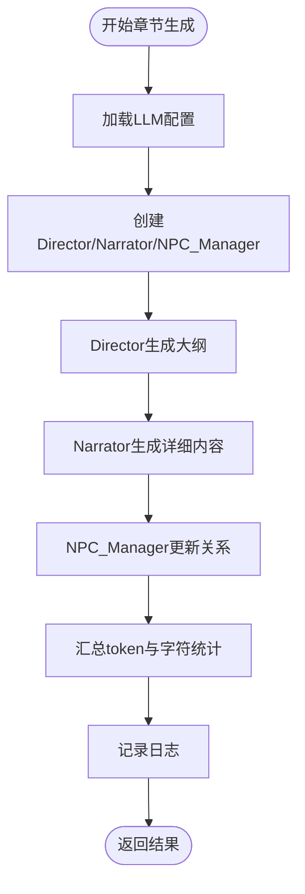
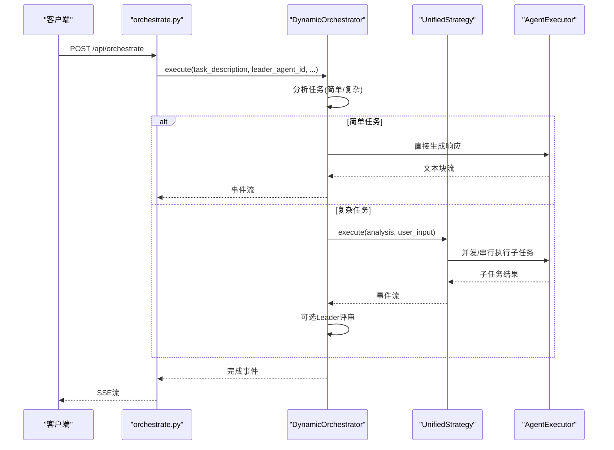
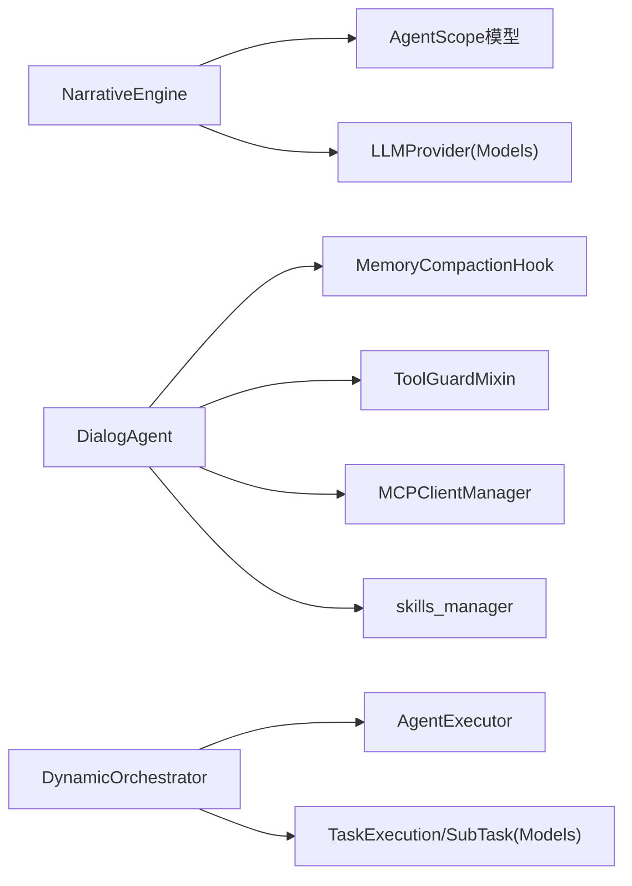

# 叙事引擎

<cite>
**本文引用的文件**
- [backend/main.py](file://backend/main.py)
- [backend/config.py](file://backend/config.py)
- [backend/agents.py](file://backend/agents.py)
- [backend/models.py](file://backend/models.py)
- [backend/schemas.py](file://backend/schemas.py)
- [backend/services/chat_generation.py](file://backend/services/chat_generation.py)
- [backend/services/orchestrator.py](file://backend/services/orchestrator.py)
- [backend/routers/orchestrate.py](file://backend/routers/orchestrate.py)
- [backend/agent_extensions.py](file://backend/agent_extensions.py)
- [backend/mcp_manager/manager.py](file://backend/mcp_manager/manager.py)
- [backend/skills_manager.py](file://backend/skills_manager.py)
</cite>

## 目录
1. [简介](#简介)
2. [项目结构](#项目结构)
3. [核心组件](#核心组件)
4. [架构总览](#架构总览)
5. [详细组件分析](#详细组件分析)
6. [依赖分析](#依赖分析)
7. [性能考虑](#性能考虑)
8. [故障排除指南](#故障排除指南)
9. [结论](#结论)
10. [附录](#附录)

## 简介
本文件面向KunFlix叙事引擎，聚焦于NarrativeEngine类的整体设计与实现，涵盖引擎初始化、配置加载机制、智能体创建流程；LLM提供商标识系统、模型类型映射与配置参数处理；三智能体协作架构（Director、Narrator、NPC_Manager）；章节生成流程、token统计机制与错误处理策略；以及配置管理最佳实践、性能监控与故障排除建议。文档旨在帮助开发者与运营人员理解并高效维护该系统。

## 项目结构
后端采用FastAPI框架，按功能模块组织：路由层(routers)、服务层(services)、模型层(models)、配置(config)与入口(main)。NarrativeEngine位于agents模块，负责故事章节生成与智能体编排；服务层orchestrator提供多智能体编排能力；聊天生成服务chat_generation提供单智能体对话与工具调用循环；数据库模型models定义LLM提供者、智能体、会话与计费等实体。

**图表来源**
- [backend/main.py:1-175](file://backend/main.py#L1-L175)
- [backend/agents.py:176-387](file://backend/agents.py#L176-L387)
- [backend/services/orchestrator.py:1-914](file://backend/services/orchestrator.py#L1-L914)
- [backend/services/chat_generation.py:1-449](file://backend/services/chat_generation.py#L1-L449)
- [backend/models.py:152-273](file://backend/models.py#L152-L273)

**章节来源**
- [backend/main.py:110-154](file://backend/main.py#L110-L154)
- [backend/config.py:7-42](file://backend/config.py#L7-L42)

## 核心组件
- NarrativeEngine：负责加载LLM提供者配置、创建Director/Narrator/NPC_Manager三个智能体，并执行章节生成流程，汇总token与字符统计。
- DialogAgent：基于AgentScope封装的对话智能体，支持工具注册、MCP客户端接入、内存压缩钩子与token统计。
- MemoryCompactionHook：在推理前对对话记忆进行压缩，避免超出上下文窗口。
- ToolGuardMixin：对工具调用进行安全拦截与审批流程（当前阶段为阻断与记录）。
- MCPClientManager：管理MCP客户端生命周期，支持热替换与最小化锁定。
- skills_manager：技能同步与管理，支持内置/定制/激活技能目录。
- DynamicOrchestrator：多智能体编排引擎，统一分析任务并调度子任务执行与评审。

**章节来源**
- [backend/agents.py:176-387](file://backend/agents.py#L176-L387)
- [backend/agents.py:40-175](file://backend/agents.py#L40-L175)
- [backend/agent_extensions.py:81-163](file://backend/agent_extensions.py#L81-L163)
- [backend/mcp_manager/manager.py:28-139](file://backend/mcp_manager/manager.py#L28-L139)
- [backend/skills_manager.py:228-408](file://backend/skills_manager.py#L228-L408)
- [backend/services/orchestrator.py:418-914](file://backend/services/orchestrator.py#L418-L914)

## 架构总览
NarrativeEngine作为叙事引擎的核心，负责：
- 初始化：通过AgentScope初始化当前模型实例，随后创建三个专用智能体。
- 配置加载：从数据库LLMProvider表中加载活动提供者，解析模型列表与额外配置，动态选择模型类型映射。
- 章节生成：Director产出大纲，Narrator生成详细内容，NPC_Manager更新角色关系，最后汇总token与字符统计并记录日志。
- 错误处理：若未初始化，返回占位错误信息；若提供者缺失，引导至后台配置。

**图表来源**
- [backend/agents.py:176-387](file://backend/agents.py#L176-L387)
- [backend/agents.py:40-175](file://backend/agents.py#L40-L175)
- [backend/agent_extensions.py:81-163](file://backend/agent_extensions.py#L81-L163)
- [backend/mcp_manager/manager.py:28-139](file://backend/mcp_manager/manager.py#L28-L139)
- [backend/skills_manager.py:228-408](file://backend/skills_manager.py#L228-L408)
- [backend/services/orchestrator.py:418-914](file://backend/services/orchestrator.py#L418-L914)

## 详细组件分析

### NarrativeEngine 设计与实现
- 初始化与配置加载
  - load_config_from_db：从数据库查询活动LLMProvider，解析models字段（支持字符串或JSON数组），回退到settings中的OPENAI_API_KEY与STORY_GENERATION_MODEL。
  - initialize：根据provider_type映射到具体模型类（OpenAI/Anthropic/DashScope/Gemini/Ollama），并设置base_url（默认映射）。随后重建三个智能体。
- 智能体创建
  - _create_agents：创建Director（剧情大纲）、Narrator（详细内容）、NPC_Manager（角色关系）三个DialogAgent。
- 章节生成流程
  - generate_chapter：按顺序调用三个智能体，收集每个智能体的input/output tokens与字符统计，汇总并记录日志，返回outline/content/npc_updates/usage。
- 错误处理
  - 若未初始化且无法加载配置，返回占位错误信息与空usage。

**图表来源**
- [backend/agents.py:322-383](file://backend/agents.py#L322-L383)

**章节来源**
- [backend/agents.py:182-232](file://backend/agents.py#L182-L232)
- [backend/agents.py:234-297](file://backend/agents.py#L234-L297)
- [backend/agents.py:299-316](file://backend/agents.py#L299-L316)
- [backend/agents.py:322-383](file://backend/agents.py#L322-L383)

### LLM提供商标识系统与模型类型映射
- 提供商标识：LLMProvider表的provider_type字段用于区分不同供应商类型（如openai_chat、dashscope_chat、anthropic等）。
- 模型类型映射：
  - 直接映射：dashscope、gemini、ollama分别对应DashScopeChatModel、GeminiChatModel、OllamaChatModel。
  - 兼容映射：openai/azure/deepseek/vllm/xai映射到OpenAIChatModel；anthropic/minimax映射到AnthropicChatModel。
  - 默认base_url：针对deepseek/minimax/xai提供默认base_url，也可由配置覆盖。
- 配置参数处理：
  - models字段支持字符串或JSON数组，优先取第一个可用模型名。
  - config_json用于传递AgentScope所需的额外配置。

**章节来源**
- [backend/agents.py:244-288](file://backend/agents.py#L244-L288)
- [backend/models.py:152-175](file://backend/models.py#L152-L175)

### 三智能体协作架构
- Director：负责剧情大纲与结构把控，确保一致性与连贯性。
- Narrator：将大纲转化为沉浸式、细节丰富的文本，关注感官与情感。
- NPC_Manager：跟踪玩家与NPC的关系状态，决定反应与互动策略。
- 协作方式：顺序调用，每个智能体独立生成并携带usage元数据，最终统一汇总。

**图表来源**
- [backend/agents.py:309-316](file://backend/agents.py#L309-L316)
- [backend/agents.py:322-383](file://backend/agents.py#L322-L383)

**章节来源**
- [backend/agents.py:300-316](file://backend/agents.py#L300-L316)
- [backend/agents.py:322-383](file://backend/agents.py#L322-L383)

### DialogAgent 实现要点
- 工具与技能：通过Toolkit注册技能，支持从active_skills目录加载；支持MCP客户端注册（按需延迟）。
- 内存压缩：在推理前调用MemoryCompactionHook，估算token并按阈值进行摘要压缩。
- 回复流程：构建消息列表（含system），格式化后调用模型；支持流式响应；从response.usage提取input/output tokens；计算input_chars与output_chars并写入消息元数据。
- 安全拦截：ToolGuardMixin对禁止工具（如shell命令、文件删除）直接拒绝，记录deny消息。

**章节来源**
- [backend/agents.py:40-175](file://backend/agents.py#L40-L175)
- [backend/agent_extensions.py:81-163](file://backend/agent_extensions.py#L81-L163)
- [backend/skills_manager.py:228-408](file://backend/skills_manager.py#L228-L408)
- [backend/mcp_manager/manager.py:52-139](file://backend/mcp_manager/manager.py#L52-L139)

### 配置加载与数据库交互
- 启动阶段：FastAPI lifespan中尝试从数据库加载LLM配置，确保媒体目录存在。
- 数据模型：LLMProvider表包含name/provider_type/api_key/base_url/models/tags/is_active/is_default/config_json/model_costs等字段。
- 回退策略：当数据库无活动提供者时，回退到settings中的OPENAI_API_KEY与STORY_GENERATION_MODEL。

**章节来源**
- [backend/main.py:49-108](file://backend/main.py#L49-L108)
- [backend/models.py:152-175](file://backend/models.py#L152-L175)
- [backend/agents.py:182-232](file://backend/agents.py#L182-L232)

### 多智能体编排（DynamicOrchestrator）
- 任务分析：Leader智能体一次性分析任务，判定为简单或复杂；复杂任务分解为子任务并建立依赖图。
- 执行策略：统一策略（UnifiedStrategy）按依赖层级并发或串行执行子任务，支持并行批处理与单任务流式输出。
- 评审与收尾：可选Leader评审，整合子任务输出形成最终结果；更新TaskExecution与SubTask记录，汇总token与计费。

**图表来源**
- [backend/routers/orchestrate.py:26-70](file://backend/routers/orchestrate.py#L26-L70)
- [backend/services/orchestrator.py:437-595](file://backend/services/orchestrator.py#L437-L595)
- [backend/services/orchestrator.py:231-366](file://backend/services/orchestrator.py#L231-L366)

**章节来源**
- [backend/routers/orchestrate.py:26-183](file://backend/routers/orchestrate.py#L26-L183)
- [backend/services/orchestrator.py:418-914](file://backend/services/orchestrator.py#L418-L914)

### 单智能体对话与工具调用循环（chat_generation）
- 上下文准备：加载历史消息、注入压缩摘要、可选图片注入（编辑模式）。
- 工具与技能：构建工具定义，注入技能索引到system prompt；支持技能门控与动态重建工具集。
- 流式生成：调用stream_completion，逐轮处理tool_calls，追加工具结果到消息；累计generate_image生成数量用于计费。
- 计费与保存：成功后保存assistant消息、更新会话统计、原子扣费、延迟上下文压缩。

**章节来源**
- [backend/services/chat_generation.py:29-449](file://backend/services/chat_generation.py#L29-L449)

## 依赖分析
- 组件耦合
  - NarrativeEngine依赖AgentScope模型类与配置加载（LLMProvider）。
  - DialogAgent依赖MemoryCompactionHook、ToolGuardMixin、MCPClientManager与skills_manager。
  - DynamicOrchestrator依赖AgentExecutor与数据库模型TaskExecution/SubTask。
- 外部依赖
  - AgentScope：模型封装与工具/技能集成。
  - SQLAlchemy：数据库ORM与事务。
  - FastAPI：路由与SSE事件流。

**图表来源**
- [backend/agents.py:176-387](file://backend/agents.py#L176-L387)
- [backend/agent_extensions.py:81-163](file://backend/agent_extensions.py#L81-L163)
- [backend/mcp_manager/manager.py:28-139](file://backend/mcp_manager/manager.py#L28-L139)
- [backend/skills_manager.py:228-408](file://backend/skills_manager.py#L228-L408)
- [backend/services/orchestrator.py:418-914](file://backend/services/orchestrator.py#L418-L914)

**章节来源**
- [backend/agents.py:176-387](file://backend/agents.py#L176-L387)
- [backend/services/orchestrator.py:418-914](file://backend/services/orchestrator.py#L418-L914)

## 性能考虑
- 上下文压缩：MemoryCompactionHook基于字符估算token并在阈值超限时进行摘要压缩，减少后续调用成本。
- 并发执行：DynamicOrchestrator在依赖图同一层级并发执行子任务，降低总耗时。
- 流式输出：SSE事件流与工具调用循环提升用户体验与实时反馈。
- 计费与配额：统一计费策略与余额冻结检查，避免超额使用导致的异常。

[本节为通用指导，无需特定文件引用]

## 故障排除指南
- 未初始化或提供者缺失
  - 现象：generate_chapter返回占位错误信息与usage为0。
  - 排查：确认数据库中存在is_active=True的LLMProvider；或在settings中配置OPENAI_API_KEY与STORY_GENERATION_MODEL。
- 工具调用被拦截
  - 现象：工具被自动拒绝并记录deny消息。
  - 排查：检查ToolGuardMixin的禁止/受保护工具列表，必要时调整安全策略。
- MCP客户端连接失败
  - 现象：注册MCP客户端报错或无法使用。
  - 排查：确认MCPClientConfig配置正确（transport/url/command等），检查网络与权限；使用replace_client进行热替换。
- 编排任务异常
  - 现象：SSE流中出现error事件或任务状态失败。
  - 排查：查看DynamicOrchestrator日志与TaskExecution/子任务记录，定位具体子任务错误并重试。

**章节来源**
- [backend/agents.py:322-333](file://backend/agents.py#L322-L333)
- [backend/agent_extensions.py:19-78](file://backend/agent_extensions.py#L19-L78)
- [backend/mcp_manager/manager.py:57-86](file://backend/mcp_manager/manager.py#L57-L86)
- [backend/services/orchestrator.py:521-533](file://backend/services/orchestrator.py#L521-L533)

## 结论
NarrativeEngine通过清晰的配置加载与智能体创建流程，结合三智能体协作与统一的token统计机制，实现了稳定可控的章节生成能力。配合DynamicOrchestrator的多智能体编排、DialogAgent的安全与工具集成能力，以及完善的日志与计费体系，为KunFlix叙事系统提供了可扩展、可观测、可维护的技术基础。

[本节为总结，无需特定文件引用]

## 附录

### 配置管理最佳实践
- 提供者管理
  - 在后台创建/更新LLMProvider，设置is_active与is_default；确保provider_type与base_url正确。
  - models字段使用JSON数组或字符串，优先保证首个元素有效。
- 模型选择
  - 对于兼容型供应商（openai/azure/deepseek/vllm/xai），保持provider_type一致；对于特定供应商（dashscope/gemini/ollama）使用对应类型。
- 安全与工具
  - 启用ToolGuardMixin的禁止工具清单，按需开放受保护工具。
  - 使用MCPClientManager进行客户端热替换，避免停机维护。
- 技能与工具
  - 通过skills_manager同步内置/定制技能到active_skills，按需启用/禁用；在DialogAgent中按需加载。

**章节来源**
- [backend/models.py:152-175](file://backend/models.py#L152-L175)
- [backend/agents.py:244-288](file://backend/agents.py#L244-L288)
- [backend/agent_extensions.py:19-78](file://backend/agent_extensions.py#L19-L78)
- [backend/mcp_manager/manager.py:52-139](file://backend/mcp_manager/manager.py#L52-L139)
- [backend/skills_manager.py:228-408](file://backend/skills_manager.py#L228-L408)