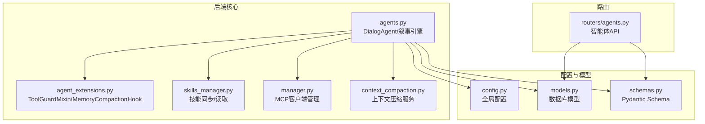
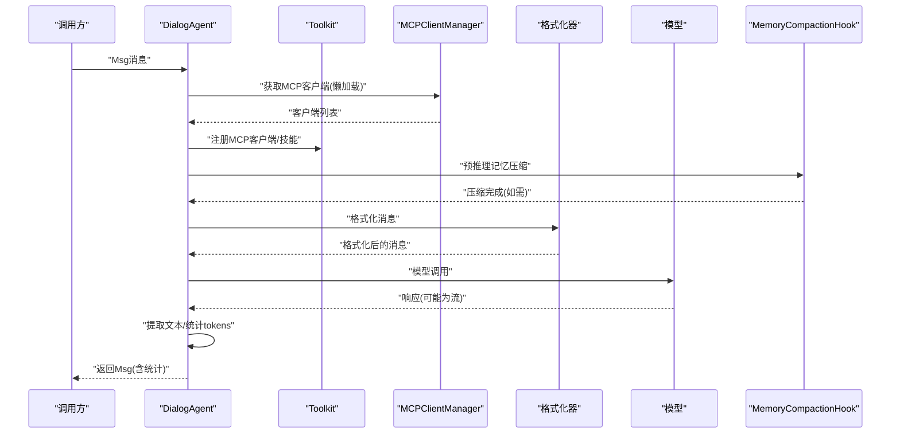
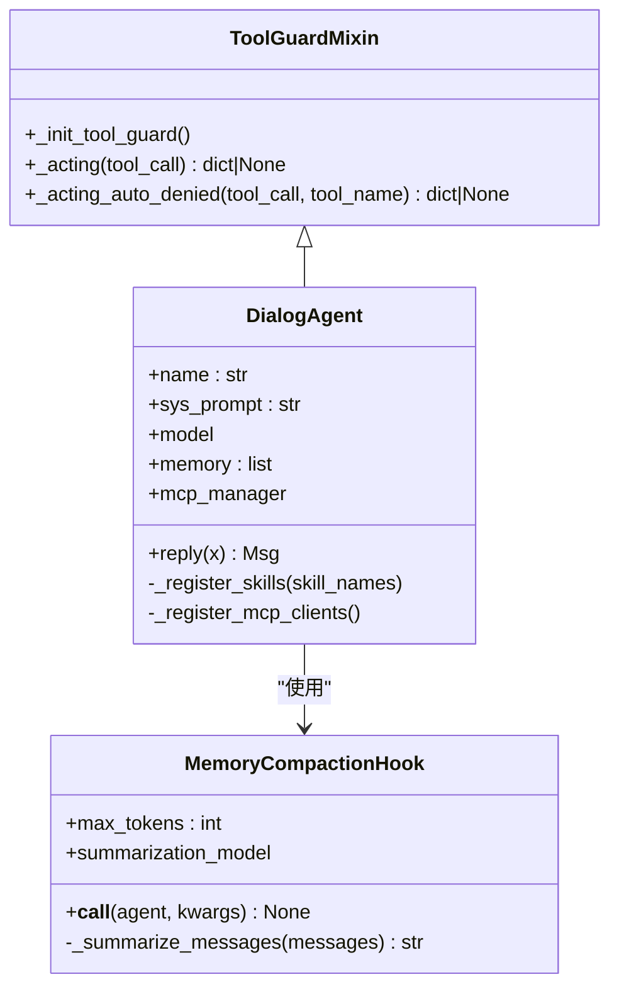
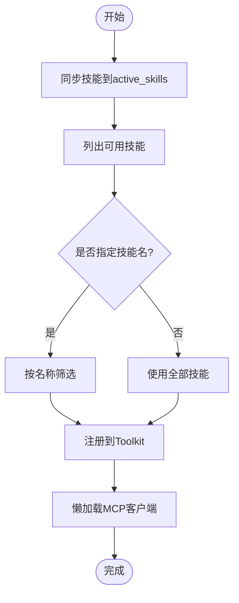
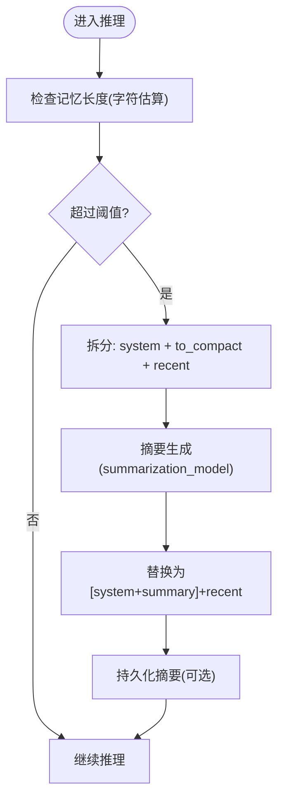
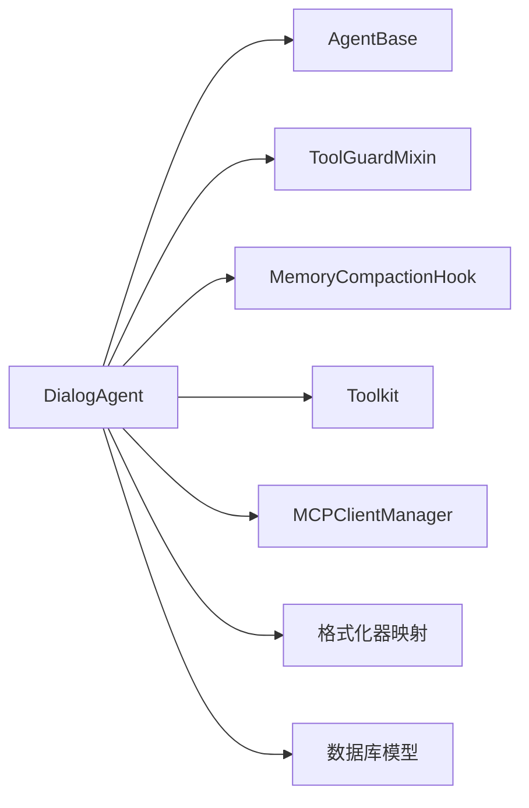

# 对话智能体系统

<cite>
**本文引用的文件**
- [agents.py](file://backend/agents.py)
- [agent_extensions.py](file://backend/agent_extensions.py)
- [skills_manager.py](file://backend/skills_manager.py)
- [manager.py](file://backend/mcp_manager/manager.py)
- [models.py](file://backend/models.py)
- [schemas.py](file://backend/schemas.py)
- [config.py](file://backend/config.py)
- [context_compaction.py](file://backend/services/context_compaction.py)
- [agents.py（后端路由）](file://backend/routers/agents.py)
</cite>

## 目录
1. [简介](#简介)
2. [项目结构](#项目结构)
3. [核心组件](#核心组件)
4. [架构总览](#架构总览)
5. [详细组件分析](#详细组件分析)
6. [依赖关系分析](#依赖关系分析)
7. [性能考量](#性能考量)
8. [故障排查指南](#故障排查指南)
9. [结论](#结论)
10. [附录](#附录)

## 简介
本文件面向Infinite Game对话智能体系统，聚焦DialogAgent类的设计与实现，系统性解析其继承自AgentBase的基础能力、ToolGuardMixin的安全防护机制以及MemoryCompactionHook的记忆压缩功能。文档将详细说明智能体初始化流程、系统提示词配置、消息格式化器映射机制、工具注册过程，并阐述智能体回复机制的完整流程（消息构建、格式化、模型调用、响应提取与记忆管理）。最后提供配置示例、性能优化建议与常见问题解决方案。

## 项目结构
后端采用模块化组织，核心对话智能体位于backend/agents.py，安全与记忆压缩由backend/agent_extensions.py提供，技能管理在backend/skills_manager.py中实现，MCP客户端管理在backend/mcp_manager/manager.py中实现，上下文压缩服务在backend/services/context_compaction.py中实现；数据库模型与Pydantic Schema在backend/models.py与backend/schemas.py中定义；全局配置在backend/config.py中集中管理。

图表来源
- [agents.py:1-388](file://backend/agents.py#L1-L388)
- [agent_extensions.py:1-163](file://backend/agent_extensions.py#L1-L163)
- [skills_manager.py:1-408](file://backend/skills_manager.py#L1-L408)
- [manager.py:1-139](file://backend/mcp_manager/manager.py#L1-L139)
- [context_compaction.py:1-348](file://backend/services/context_compaction.py#L1-L348)
- [models.py:1-503](file://backend/models.py#L1-L503)
- [schemas.py:1-931](file://backend/schemas.py#L1-L931)
- [config.py:1-43](file://backend/config.py#L1-L43)
- [agents.py（后端路由）:1-151](file://backend/routers/agents.py#L1-L151)

章节来源
- [agents.py:1-388](file://backend/agents.py#L1-L388)
- [agent_extensions.py:1-163](file://backend/agent_extensions.py#L1-L163)
- [skills_manager.py:1-408](file://backend/skills_manager.py#L1-L408)
- [manager.py:1-139](file://backend/mcp_manager/manager.py#L1-L139)
- [context_compaction.py:1-348](file://backend/services/context_compaction.py#L1-L348)
- [models.py:1-503](file://backend/models.py#L1-L503)
- [schemas.py:1-931](file://backend/schemas.py#L1-L931)
- [config.py:1-43](file://backend/config.py#L1-L43)
- [agents.py（后端路由）:1-151](file://backend/routers/agents.py#L1-L151)

## 核心组件
- DialogAgent：基于AgentBase扩展，内置格式化器映射、工具注册、MCP客户端注册、记忆压缩钩子与回复流程。
- ToolGuardMixin：对工具调用进行拦截与审批控制（当前阶段为阻断与记录）。
- MemoryCompactionHook：在推理前检查并压缩过长记忆，保留系统提示与近期消息，其余以摘要替代。
- 技能管理：从builtin/customized目录同步至active_skills，按需注册到Toolkit。
- MCP客户端管理：支持HTTP/STDIO传输，热重载与最小阻塞替换。
- 上下文压缩服务：基于令牌估算与阈值决策，生成摘要并持久化。

章节来源
- [agents.py:40-174](file://backend/agents.py#L40-L174)
- [agent_extensions.py:7-163](file://backend/agent_extensions.py#L7-L163)
- [skills_manager.py:180-244](file://backend/skills_manager.py#L180-L244)
- [manager.py:28-139](file://backend/mcp_manager/manager.py#L28-L139)
- [context_compaction.py:70-347](file://backend/services/context_compaction.py#L70-L347)

## 架构总览
DialogAgent通过格式化器将内部消息转换为具体模型所需的输入格式，调用模型完成推理，提取文本内容并更新记忆。在每次推理前，MemoryCompactionHook会评估记忆长度并触发压缩。ToolGuardMixin在工具调用阶段进行拦截与阻断。技能通过Toolkit注册，MCP客户端通过MCPClientManager动态注入。

图表来源
- [agents.py:114-174](file://backend/agents.py#L114-L174)
- [agent_extensions.py:81-163](file://backend/agent_extensions.py#L81-L163)
- [manager.py:52-91](file://backend/mcp_manager/manager.py#L52-L91)

## 详细组件分析

### DialogAgent类设计与初始化
- 继承关系：DialogAgent同时混入ToolGuardMixin与AgentBase，获得基础对话能力与工具安全拦截能力。
- 初始化要点：
  - 接收name、sys_prompt、model、max_tokens、mcp_manager、skill_names等参数。
  - 基于模型类型选择对应格式化器（OpenAI为默认回退）。
  - 初始化ToolGuard（deny/guard列表与待审批状态）。
  - 初始化Toolkit并注册技能（支持按名称筛选）。
  - 初始化MemoryCompactionHook（最大令牌阈值与摘要模型）。
- 回复流程：
  - 懒加载注册MCP客户端（支持热重载）。
  - 追加输入消息到内存。
  - 触发MemoryCompactionHook进行预推理压缩。
  - 构建消息列表（system角色固定为system，助手与用户角色依据消息来源自动判定）。
  - 计算输入字符数，格式化消息，去除非用户角色的name字段（xAI兼容）。
  - 调用模型（支持异步流式响应），聚合块并提取文本。
  - 从响应usage提取input_tokens与output_tokens，构造带统计的Msg并追加到内存。

图表来源
- [agents.py:40-174](file://backend/agents.py#L40-L174)
- [agent_extensions.py:7-163](file://backend/agent_extensions.py#L7-L163)

章节来源
- [agents.py:49-174](file://backend/agents.py#L49-L174)

### 系统提示词与消息格式化器映射
- 系统提示词sys_prompt作为固定system消息参与格式化。
- 格式化器映射：针对不同模型类型（如Gemini、DashScope、Anthropic、Ollama）选择对应格式化器；OpenAI作为默认回退。
- 角色映射：助手消息若来自自身则标记为assistant，否则按原消息role；system消息保持system；其他消息按用户处理。
- 名称清理：对非用户角色消息移除name字段，确保xAI兼容性。

章节来源
- [agents.py:42-47](file://backend/agents.py#L42-L47)
- [agents.py:124-141](file://backend/agents.py#L124-L141)

### 工具注册与MCP客户端注入
- 技能注册：
  - 同步builtin与customized技能到active_skills目录。
  - 支持按名称筛选仅注册指定技能。
  - 通过Toolkit注册技能目录（兼容register_agent_skill）。
- MCP客户端：
  - 通过MCPClientManager获取客户端列表，按需注册到Toolkit。
  - 支持HTTP与STDIO两种传输方式，具备热重载与最小阻塞替换能力。

图表来源
- [skills_manager.py:180-244](file://backend/skills_manager.py#L180-L244)
- [agents.py:85-113](file://backend/agents.py#L85-L113)
- [manager.py:52-91](file://backend/mcp_manager/manager.py#L52-L91)

章节来源
- [skills_manager.py:228-244](file://backend/skills_manager.py#L228-L244)
- [agents.py:85-113](file://backend/agents.py#L85-L113)
- [manager.py:28-139](file://backend/mcp_manager/manager.py#L28-L139)

### 记忆压缩与上下文管理
- 预推理压缩：
  - 估计总令牌（字符估算，1token≈4chars），超过阈值时触发压缩。
  - 保留system消息与最近N条消息，中间历史以摘要替代。
  - 使用summarization_model生成摘要，构造新的system消息承载摘要。
- 上下文压缩服务（会话级）：
  - 基于配置与令牌估算决定是否压缩。
  - 支持工具结果截断、保留比例与摘要阈值。
  - 生成摘要并持久化到会话记录，便于后续续写。

图表来源
- [agent_extensions.py:89-131](file://backend/agent_extensions.py#L89-L131)
- [context_compaction.py:138-347](file://backend/services/context_compaction.py#L138-L347)

章节来源
- [agent_extensions.py:81-163](file://backend/agent_extensions.py#L81-L163)
- [context_compaction.py:70-347](file://backend/services/context_compaction.py#L70-L347)

### 安全防护：ToolGuardMixin
- 工具拦截策略：
  - deny列表：严格禁止（如shell命令、删除文件）。
  - guard列表：记录但不放行（write_file、edit_file等）。
  - 审批逻辑：当前阶段为占位，未来可接入审批消费。
- 异常处理：拦截失败时记录警告并回退到父类行为。

章节来源
- [agent_extensions.py:13-79](file://backend/agent_extensions.py#L13-L79)

### 智能体配置与API
- 智能体Schema定义了名称、描述、提供商、模型、温度、上下文窗口、系统提示词、工具列表、思维模式、定价参数、领导者配置、图像/视频配置、上下文压缩配置与目标节点类型等字段。
- 后端路由提供智能体的创建、查询、更新与删除接口，校验提供商与模型可用性。

章节来源
- [schemas.py:239-357](file://backend/schemas.py#L239-L357)
- [agents.py（后端路由）:16-151](file://backend/routers/agents.py#L16-L151)

## 依赖关系分析
- DialogAgent依赖：
  - AgentBase（对话基类）
  - ToolGuardMixin（工具拦截）
  - MemoryCompactionHook（记忆压缩）
  - Toolkit（工具/技能容器）
  - MCPClientManager（MCP客户端）
  - 格式化器（按模型类型映射）
  - 数据库模型（Agent/LLMProvider等）
- 外部依赖：
  - Agentscope（消息、模型、格式化器、工具）
  - SQLAlchemy（ORM）
  - FastAPI（路由）

图表来源
- [agents.py:1-24](file://backend/agents.py#L1-L24)
- [models.py:210-273](file://backend/models.py#L210-L273)

章节来源
- [agents.py:1-24](file://backend/agents.py#L1-L24)
- [models.py:210-273](file://backend/models.py#L210-L273)

## 性能考量
- 记忆压缩阈值与摘要模型：
  - 合理设置max_tokens与summarization_model，避免频繁压缩带来的额外开销。
  - 在高并发场景下，建议使用更高效的摘要模型或降低摘要频率。
- 工具结果截断：
  - 对tool角色消息进行适度截断，减少上下文长度，提升吞吐。
- 流式响应处理：
  - 对模型返回的异步流进行聚合，避免逐块处理带来的延迟。
- 角色与名称清理：
  - 在格式化阶段移除非用户角色的name字段，减少无效负载。

章节来源
- [context_compaction.py:115-133](file://backend/services/context_compaction.py#L115-L133)
- [agents.py:147-151](file://backend/agents.py#L147-L151)
- [agents.py:139-141](file://backend/agents.py#L139-L141)

## 故障排查指南
- 工具被拦截：
  - 检查ToolGuardMixin的deny/guard列表，确认工具名是否命中。
  - 查看日志中的拦截记录，必要时调整策略。
- MCP客户端注册失败：
  - 确认MCPClientManager配置正确，网络连通性与权限。
  - 查看异常堆栈，定位连接超时或参数错误。
- 记忆压缩未生效：
  - 检查max_tokens阈值与消息长度估算是否合理。
  - 确认summarization_model可用且返回内容可解析。
- 模型调用异常：
  - 检查模型参数与格式化器映射是否匹配。
  - 对流式响应进行异常捕获与回退处理。

章节来源
- [agent_extensions.py:36-56](file://backend/agent_extensions.py#L36-L56)
- [manager.py:63-86](file://backend/mcp_manager/manager.py#L63-L86)
- [agent_extensions.py:105-131](file://backend/agent_extensions.py#L105-L131)
- [agents.py:147-151](file://backend/agents.py#L147-L151)

## 结论
DialogAgent通过清晰的职责划分与可插拔扩展，实现了安全可控、可压缩的记忆管理与灵活的工具/技能体系。配合MCP客户端与上下文压缩服务，系统在长对话与复杂任务中仍能保持稳定与高效。建议在生产环境中结合实际负载调优压缩阈值与摘要模型，并完善工具审批流程以满足更严格的安全部署要求。

## 附录

### 配置示例（字段说明）
- 智能体字段（节选）：
  - name：智能体名称
  - provider_id：提供商ID
  - model：具体模型名
  - temperature：采样温度
  - context_window：上下文窗口大小
  - system_prompt：系统提示词
  - tools：启用工具列表
  - thinking_mode：思维模式开关
  - compaction_config：上下文压缩配置（见下）
- 上下文压缩配置（示例键）：
  - enabled：是否启用
  - provider_id：摘要模型提供商ID
  - model：摘要模型名
  - compact_ratio：压缩比例
  - reserve_ratio：保留比例
  - tool_old_threshold：旧工具结果阈值
  - tool_recent_n：最近N条工具消息
  - tool_recent_threshold：最近工具结果阈值
  - max_summary_tokens：摘要最大token

章节来源
- [schemas.py:239-278](file://backend/schemas.py#L239-L278)
- [models.py:265-266](file://backend/models.py#L265-L266)
- [context_compaction.py:25-35](file://backend/services/context_compaction.py#L25-L35)