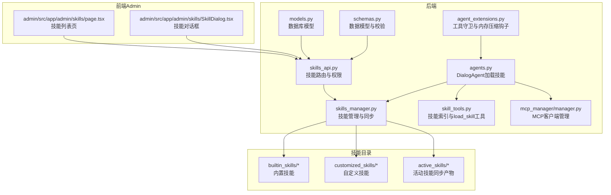
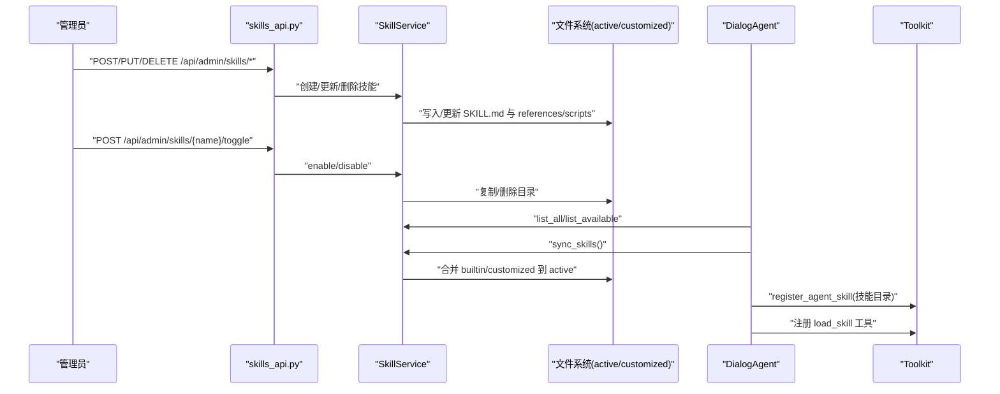
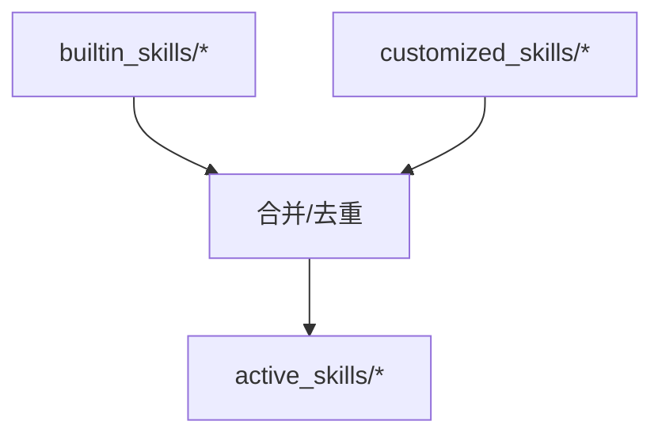
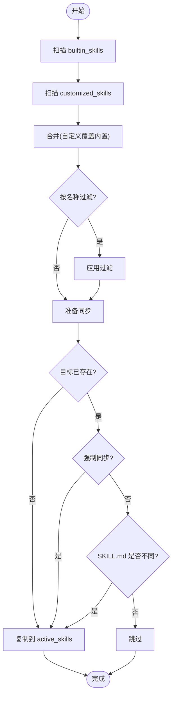
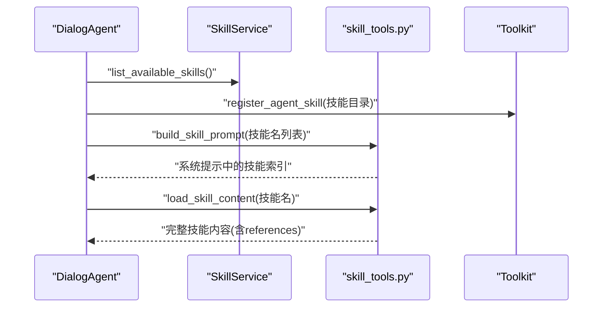
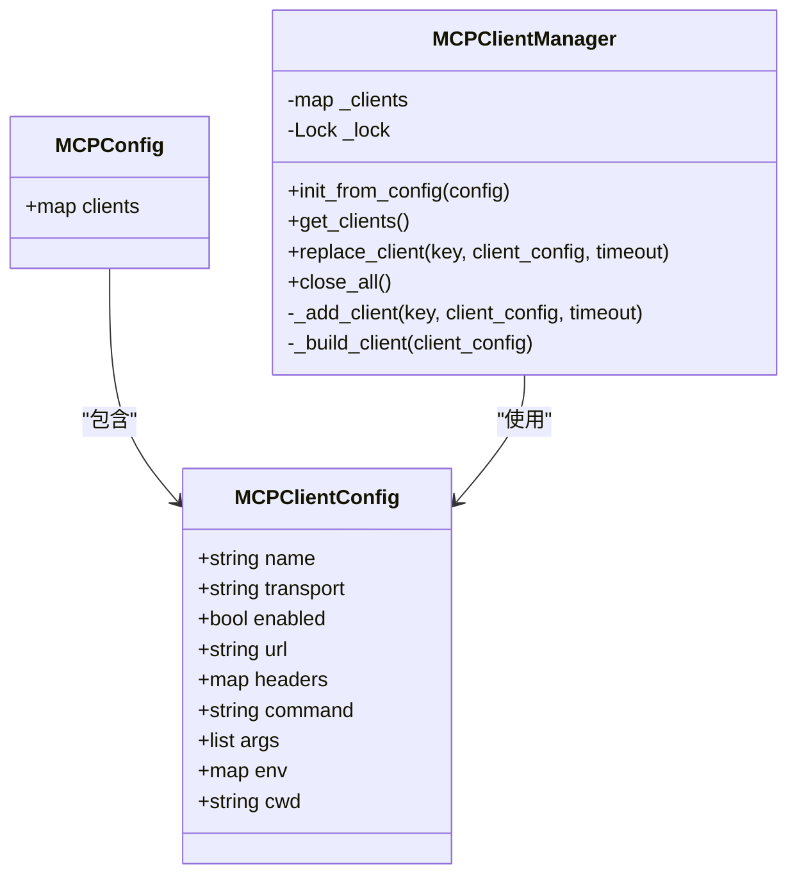
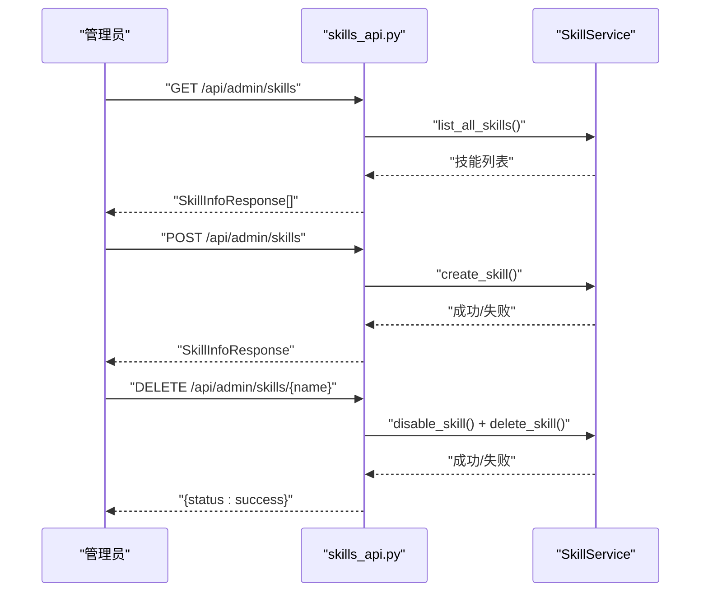
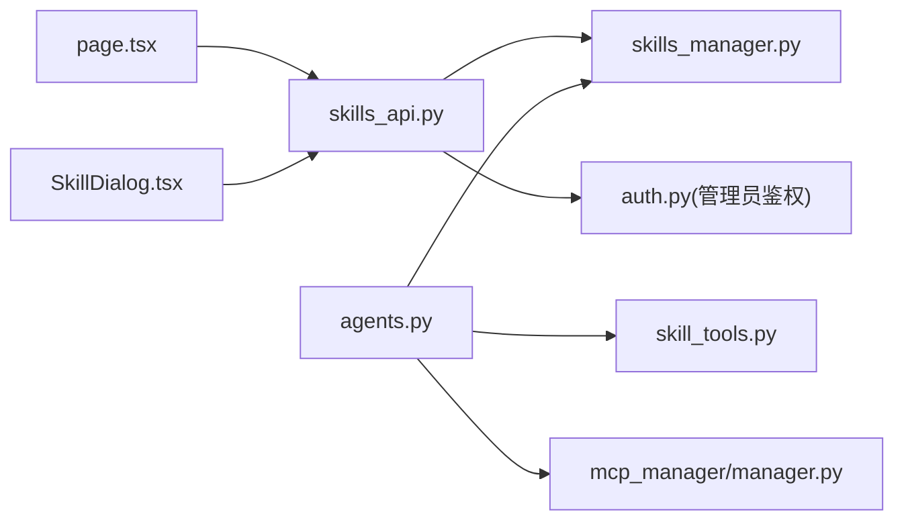

# 技能集成系统

<cite>
**本文引用的文件**
- [skills_manager.py](file://backend/skills_manager.py)
- [schemas.py](file://backend/schemas.py)
- [skills_api.py](file://backend/routers/skills_api.py)
- [skill_tools.py](file://backend/services/skill_tools.py)
- [models.py](file://backend/models.py)
- [agents.py](file://backend/agents.py)
- [manager.py](file://backend/mcp_manager/manager.py)
- [agent_extensions.py](file://backend/agent_extensions.py)
- [page.tsx](file://backend/admin/src/app/admin/skills/page.tsx)
- [SkillDialog.tsx](file://backend/admin/src/app/admin/skills/SkillDialog.tsx)
- [SKILL.md（画布工具）](file://backend/skills/builtin_skills/canvas_tools/SKILL.md)
- [SKILL.md（文件读取）](file://backend/skills/builtin_skills/file_reader/scripts/read.py)
- [SKILL.md（图像工具）](file://backend/skills/builtin_skills/image_tools/SKILL.md)
- [SKILL.md（视频工具）](file://backend/skills/builtin_skills/video_tools/SKILL.md)
</cite>

## 目录
1. [简介](#简介)
2. [项目结构](#项目结构)
3. [核心组件](#核心组件)
4. [架构总览](#架构总览)
5. [详细组件分析](#详细组件分析)
6. [依赖分析](#依赖分析)
7. [性能考虑](#性能考虑)
8. [故障排查指南](#故障排查指南)
9. [结论](#结论)
10. [附录](#附录)

## 简介
本文件面向 KunFlix 的“技能集成系统”，系统化阐述技能目录结构、技能发现与动态加载机制、技能注册与工具包集成、MCP 客户端管理、内置/活动/自定义技能的差异与使用场景、配置与权限控制、安全验证、开发与调试方法、性能优化策略以及扩展最佳实践与兼容性保障。

## 项目结构
技能系统围绕后端 Python 后端与前端 Admin 控制台协同工作，核心由以下模块构成：
- 技能管理与同步：Python 层负责技能目录扫描、版本与元数据解析、同步至活动目录、文件加载校验与安全路径限制。
- 技能服务与路由：FastAPI 路由提供技能的增删改查、启用/禁用、版本提取与响应封装。
- 技能工具构建：在对话层构建轻量技能索引、按需加载完整技能内容，并生成 load_skill 工具定义。
- 智能体与工具包：DialogAgent 在推理前加载活动技能，注册为工具包；MCP 客户端管理器支持热重载与连接恢复。
- 前端 Admin：提供技能列表、创建/编辑/删除、启用/禁用、版本与来源标注等管理界面。

图表来源
- [skills_manager.py:1-408](file://backend/skills_manager.py#L1-L408)
- [skills_api.py:1-207](file://backend/routers/skills_api.py#L1-L207)
- [skill_tools.py:1-130](file://backend/services/skill_tools.py#L1-L130)
- [agents.py:1-388](file://backend/agents.py#L1-L388)
- [manager.py:1-139](file://backend/mcp_manager/manager.py#L1-L139)
- [agent_extensions.py:1-163](file://backend/agent_extensions.py#L1-L163)
- [models.py:1-503](file://backend/models.py#L1-L503)
- [schemas.py:1-931](file://backend/schemas.py#L1-L931)
- [page.tsx:1-185](file://backend/admin/src/app/admin/skills/page.tsx#L1-L185)
- [SkillDialog.tsx:1-235](file://backend/admin/src/app/admin/skills/SkillDialog.tsx#L1-L235)

章节来源
- [skills_manager.py:1-408](file://backend/skills_manager.py#L1-L408)
- [skills_api.py:1-207](file://backend/routers/skills_api.py#L1-L207)
- [skill_tools.py:1-130](file://backend/services/skill_tools.py#L1-L130)
- [agents.py:1-388](file://backend/agents.py#L1-L388)
- [manager.py:1-139](file://backend/mcp_manager/manager.py#L1-L139)
- [agent_extensions.py:1-163](file://backend/agent_extensions.py#L1-L163)
- [models.py:1-503](file://backend/models.py#L1-L503)
- [schemas.py:1-931](file://backend/schemas.py#L1-L931)
- [page.tsx:1-185](file://backend/admin/src/app/admin/skills/page.tsx#L1-L185)
- [SkillDialog.tsx:1-235](file://backend/admin/src/app/admin/skills/SkillDialog.tsx#L1-L235)

## 核心组件
- 技能管理器（SkillService/同步函数）
  - 负责内置与自定义技能的收集、去重、同步至活动目录、启用/禁用、创建/删除、文件安全加载。
  - 提供技能信息结构与版本解析、树形目录构建、文件内容写入等工具函数。
- 技能路由（skills_api.py）
  - 提供管理员权限保护的技能 CRUD 与启停接口，封装前端友好的响应模型。
- 技能工具构建（skill_tools.py）
  - 构建系统提示中的轻量技能索引；按需加载完整 SKILL.md 内容；生成 load_skill 工具定义。
- 智能体加载（agents.py）
  - 在推理前同步并加载活动技能，注册到 Toolkit；支持 MCP 客户端热注册。
- MCP 客户端管理（mcp_manager/manager.py）
  - 支持 HTTP/STDIO 两类传输，提供初始化、替换、关闭与并发安全的锁机制。
- 安全与内存（agent_extensions.py）
  - 工具守卫（禁止危险工具、需要审批的工具）；内存压缩钩子（基于令牌估算的对话历史压缩）。
- 前端 Admin（page.tsx/SkillDialog.tsx）
  - 列表展示、创建/编辑/删除、启用/禁用、版本与来源标注。

章节来源
- [skills_manager.py:19-408](file://backend/skills_manager.py#L19-L408)
- [skills_api.py:22-207](file://backend/routers/skills_api.py#L22-L207)
- [skill_tools.py:24-130](file://backend/services/skill_tools.py#L24-L130)
- [agents.py:85-113](file://backend/agents.py#L85-L113)
- [manager.py:28-139](file://backend/mcp_manager/manager.py#L28-L139)
- [agent_extensions.py:7-163](file://backend/agent_extensions.py#L7-L163)
- [page.tsx:23-185](file://backend/admin/src/app/admin/skills/page.tsx#L23-L185)
- [SkillDialog.tsx:21-235](file://backend/admin/src/app/admin/skills/SkillDialog.tsx#L21-L235)

## 架构总览
技能系统采用“声明式技能 + 动态加载 + 工具包注册”的架构：
- 目录结构
  - builtin_skills：内置技能模板，含 SKILL.md 与可选 scripts/references。
  - customized_skills：自定义技能，管理员可创建/编辑/删除。
  - active_skills：运行时活动技能，由同步逻辑从 builtin/customized 合并而来。
- 发现与同步
  - 通过扫描 SKILL.md 识别技能；frontmatter 解析 name/description/metadata；支持版本号提取。
  - 同步策略：自定义覆盖内置；首次或强制同步直接复制；变更检测触发更新。
- 注册与使用
  - 对话前同步并加载活动技能；构建轻量索引与 load_skill 工具；按需拉取完整技能内容。
- MCP 集成
  - DialogAgent 在每次推理前延迟注册 MCP 客户端，支持热重载与最小阻塞替换。

图表来源
- [skills_api.py:123-207](file://backend/routers/skills_api.py#L123-L207)
- [skills_manager.py:180-301](file://backend/skills_manager.py#L180-L301)
- [agents.py:85-113](file://backend/agents.py#L85-L113)
- [skill_tools.py:103-130](file://backend/services/skill_tools.py#L103-L130)

## 详细组件分析

### 技能目录与分类
- builtin_skills：内置技能集合，包含画布工具、文件读取、图像工具、视频工具等，每个技能以 SKILL.md 作为声明入口。
- customized_skills：管理员创建的自定义技能，具备独立命名空间与覆盖能力。
- active_skills：运行时目录，由同步逻辑生成，优先使用自定义覆盖内置。

图表来源
- [skills_manager.py:69-77](file://backend/skills_manager.py#L69-L77)
- [skills_manager.py:194-225](file://backend/skills_manager.py#L194-L225)

章节来源
- [skills_manager.py:43-63](file://backend/skills_manager.py#L43-L63)
- [SKILL.md（画布工具）:1-141](file://backend/skills/builtin_skills/canvas_tools/SKILL.md#L1-L141)
- [SKILL.md（图像工具）:1-81](file://backend/skills/builtin_skills/image_tools/SKILL.md#L1-L81)
- [SKILL.md（视频工具）:1-104](file://backend/skills/builtin_skills/video_tools/SKILL.md#L1-L104)
- [SKILL.md（文件读取）:1-21](file://backend/skills/builtin_skills/file_reader/scripts/read.py#L1-L21)

### 技能发现与同步机制
- 发现：遍历目录，以存在 SKILL.md 作为技能标志；frontmatter 解析 name/description/metadata。
- 版本：从 metadata.builtin_skill_version 读取；默认 1.0。
- 同步：内置技能集与自定义技能集合并，自定义优先；支持按名称过滤与强制同步；变更检测触发更新。

图表来源
- [skills_manager.py:180-225](file://backend/skills_manager.py#L180-L225)
- [skills_manager.py:145-157](file://backend/skills_manager.py#L145-L157)

章节来源
- [skills_manager.py:107-142](file://backend/skills_manager.py#L107-L142)
- [skills_manager.py:180-225](file://backend/skills_manager.py#L180-L225)

### 技能注册与工具包集成
- DialogAgent 在推理前调用 sync_skills 并列出可用技能，按需注册到 Toolkit。
- skill_tools 构建系统提示中的技能索引（仅名称与描述），并通过 load_skill 工具按需加载完整 SKILL.md 与 references 列表。

图表来源
- [agents.py:85-113](file://backend/agents.py#L85-L113)
- [skill_tools.py:40-97](file://backend/services/skill_tools.py#L40-L97)
- [skill_tools.py:103-130](file://backend/services/skill_tools.py#L103-L130)

章节来源
- [agents.py:85-113](file://backend/agents.py#L85-L113)
- [skill_tools.py:40-97](file://backend/services/skill_tools.py#L40-L97)
- [skill_tools.py:103-130](file://backend/services/skill_tools.py#L103-L130)

### MCP 客户端管理
- 支持 HTTP 与 STDIO 两种传输；初始化、替换、关闭均采用异步锁保证最小阻塞。
- DialogAgent 在每次推理前延迟注册 MCP 客户端，确保热重载与运行时配置变更生效。

图表来源
- [manager.py:10-27](file://backend/mcp_manager/manager.py#L10-L27)
- [manager.py:28-139](file://backend/mcp_manager/manager.py#L28-L139)

章节来源
- [manager.py:28-139](file://backend/mcp_manager/manager.py#L28-L139)
- [agents.py:70-84](file://backend/agents.py#L70-L84)

### 技能 API 与权限控制
- 路由层使用管理员鉴权装饰器，提供技能列表、详情、创建、更新、删除、启停等接口。
- 响应模型包含 id/name/description/version/source/status；前端据此渲染卡片与操作按钮。
- 删除自定义技能时先禁用再删除；内置技能不可删除。

图表来源
- [skills_api.py:123-207](file://backend/routers/skills_api.py#L123-L207)
- [skills_manager.py:271-301](file://backend/skills_manager.py#L271-L301)

章节来源
- [skills_api.py:26-117](file://backend/routers/skills_api.py#L26-L117)
- [skills_api.py:123-207](file://backend/routers/skills_api.py#L123-L207)
- [page.tsx:23-185](file://backend/admin/src/app/admin/skills/page.tsx#L23-L185)
- [SkillDialog.tsx:21-235](file://backend/admin/src/app/admin/skills/SkillDialog.tsx#L21-L235)

### 安全与权限控制
- 路由层：管理员权限校验，防止未授权访问。
- 文件加载：严格限制 load_skill 文件路径前缀与遍历风险，仅允许 references/scripts 下相对路径。
- 工具守卫：内置拒绝危险工具（如 shell 执行、文件写入），对受控工具记录日志并预留审批流程。

章节来源
- [skills_api.py:8](file://backend/routers/skills_api.py#L8)
- [skills_manager.py:370-408](file://backend/skills_manager.py#L370-L408)
- [agent_extensions.py:13-56](file://backend/agent_extensions.py#L13-L56)

### 内置技能、活动技能与自定义技能
- 内置技能（builtin_skills）：系统自带模板，含 SKILL.md 与可选脚本/引用；版本号由 metadata.builtin_skill_version 管理。
- 自定义技能（customized_skills）：管理员创建，可覆盖内置；删除受限（内置不可删）。
- 活动技能（active_skills）：运行时目录，由同步逻辑生成，优先自定义。

使用场景
- 内置技能：稳定、标准化的能力（如画布 CRUD、图像/视频生成）。
- 自定义技能：业务定制、私有流程、第三方集成；可随时启停与迭代。
- 活动技能：推理阶段实际生效的技能集合。

章节来源
- [skills_manager.py:48-62](file://backend/skills_manager.py#L48-L62)
- [skills_manager.py:180-225](file://backend/skills_manager.py#L180-L225)
- [SKILL.md（画布工具）:1-141](file://backend/skills/builtin_skills/canvas_tools/SKILL.md#L1-L141)
- [SKILL.md（图像工具）:1-81](file://backend/skills/builtin_skills/image_tools/SKILL.md#L1-L81)
- [SKILL.md（视频工具）:1-104](file://backend/skills/builtin_skills/video_tools/SKILL.md#L1-L104)

### 技能开发指南
- 编写 SKILL.md：使用 frontmatter 声明 name/description/metadata；正文为技能说明与使用示例。
- 引用与脚本：在 references/scripts 下组织辅助文件与脚本；通过 load_skill 工具可查看引用清单。
- 版本管理：通过 metadata.builtin_skill_version 管理版本；前端显示 v{version}。
- 工具定义：若技能包含可执行脚本，需在 AgentScope 工具层注册对应函数签名。

章节来源
- [skills_manager.py:107-142](file://backend/skills_manager.py#L107-L142)
- [skills_manager.py:304-352](file://backend/skills_manager.py#L304-L352)
- [skill_tools.py:73-97](file://backend/services/skill_tools.py#L73-L97)

### 调试方法
- 后端日志：关注技能同步、文件加载、MCP 客户端连接与替换过程的日志输出。
- 前端交互：通过 Admin 页面刷新、创建/编辑/启停操作观察状态变化与错误提示。
- 工具守卫：当工具被拒绝或需要审批时，可在日志中定位具体工具名与输入参数。

章节来源
- [skills_manager.py:120-141](file://backend/skills_manager.py#L120-L141)
- [manager.py:40-50](file://backend/mcp_manager/manager.py#L40-L50)
- [agent_extensions.py:35-78](file://backend/agent_extensions.py#L35-L78)
- [page.tsx:44-56](file://backend/admin/src/app/admin/skills/page.tsx#L44-L56)

## 依赖分析
- 组件耦合
  - skills_api 依赖 SkillService 与认证模块；SkillService 依赖文件系统与 frontmatter 解析。
  - DialogAgent 依赖 SkillService 与 Toolkit；MCP 客户端管理器独立于对话层。
  - 前端 Admin 通过 axios 调用 /api/admin/skills 接口。
- 外部依赖
  - frontmatter：解析 SKILL.md frontmatter。
  - Agentscope：工具包注册、MCP 客户端、消息格式化。
  - FastAPI：路由与权限装饰器。

图表来源
- [skills_api.py:8-19](file://backend/routers/skills_api.py#L8-L19)
- [agents.py:19-22](file://backend/agents.py#L19-L22)
- [page.tsx:20](file://backend/admin/src/app/admin/skills/page.tsx#L20)
- [SkillDialog.tsx:19](file://backend/admin/src/app/admin/skills/SkillDialog.tsx#L19)

章节来源
- [skills_api.py:8-19](file://backend/routers/skills_api.py#L8-L19)
- [agents.py:19-22](file://backend/agents.py#L19-L22)
- [page.tsx:20](file://backend/admin/src/app/admin/skills/page.tsx#L20)
- [SkillDialog.tsx:19](file://backend/admin/src/app/admin/skills/SkillDialog.tsx#L19)

## 性能考虑
- 轻量索引：系统提示仅包含技能名与描述，避免大文本开销；完整内容按需加载。
- 同步策略：仅在变更或强制时复制，减少 IO；按名称过滤缩小范围。
- 文件加载：严格路径限制与存在性检查，避免无效 IO 与异常。
- 内存压缩：基于令牌估算的对话历史压缩，降低上下文成本。
- MCP 连接：双阶段替换与异步锁，最小化阻塞与抖动。

章节来源
- [skill_tools.py:40-67](file://backend/services/skill_tools.py#L40-L67)
- [skills_manager.py:180-225](file://backend/skills_manager.py#L180-L225)
- [agent_extensions.py:81-163](file://backend/agent_extensions.py#L81-L163)
- [manager.py:57-86](file://backend/mcp_manager/manager.py#L57-L86)

## 故障排查指南
- 技能未出现在列表
  - 检查 SKILL.md 是否存在且 frontmatter 完整；确认已同步至 active_skills。
- 启用/禁用失败
  - 查看后端日志；确认路径存在与权限；检查同步是否成功。
- load_skill 无法加载完整内容
  - 确认 references 目录结构与文件存在；检查路径前缀与遍历限制。
- MCP 客户端连接失败
  - 检查 transport 配置与命令/URL；查看连接超时与重建日志。
- 工具被拦截
  - 检查工具守卫规则；确认工具名是否在拒绝/受控名单中。

章节来源
- [skills_manager.py:120-141](file://backend/skills_manager.py#L120-L141)
- [skills_manager.py:370-408](file://backend/skills_manager.py#L370-L408)
- [manager.py:63-86](file://backend/mcp_manager/manager.py#L63-L86)
- [agent_extensions.py:35-78](file://backend/agent_extensions.py#L35-L78)

## 结论
技能集成系统通过“声明式技能 + 动态加载 + 工具包注册 + MCP 管理”的架构，实现了内置/自定义技能的统一管理与运行时灵活装配。配合前端 Admin 控制台与严格的权限与安全策略，既满足了扩展性与易用性，也兼顾了安全性与稳定性。建议在生产环境中结合版本管理、变更检测与监控告警，持续优化同步与加载性能。

## 附录
- 最佳实践
  - 使用 frontmatter 标准化技能元数据；版本号与变更日志清晰可见。
  - 将脚本与引用文件组织在 references/scripts 下，便于按需加载与审计。
  - 自定义技能尽量遵循内置技能的结构与命名规范，提升一致性。
  - 对高风险工具实施工具守卫与审批流程，逐步放开权限。
- 兼容性保障
  - 保持 SKILL.md 结构稳定；对新增字段采用可选策略。
  - 同步逻辑优先自定义覆盖内置，避免破坏性升级。
  - MCP 客户端支持热重载与最小阻塞替换，降低运维中断风险。