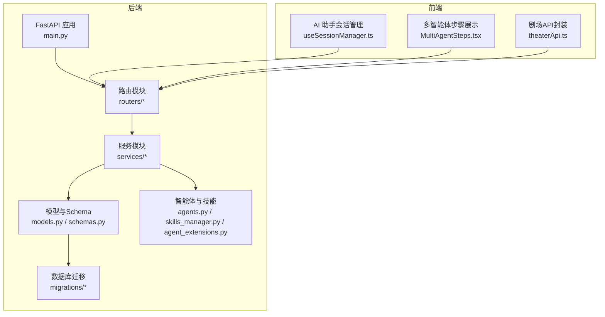
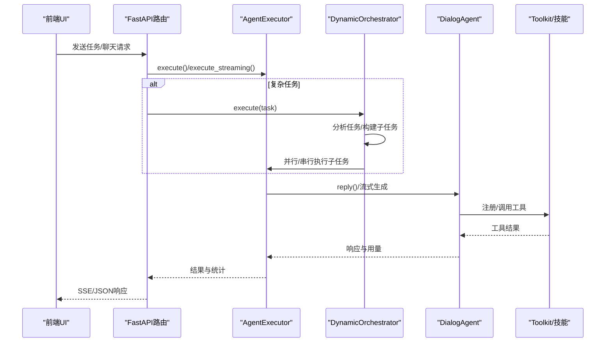
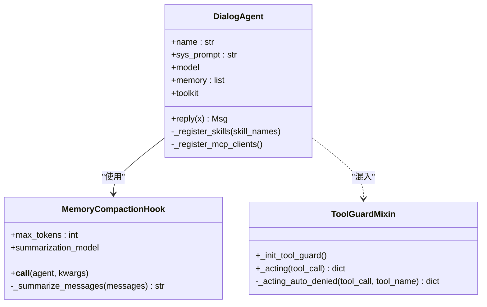
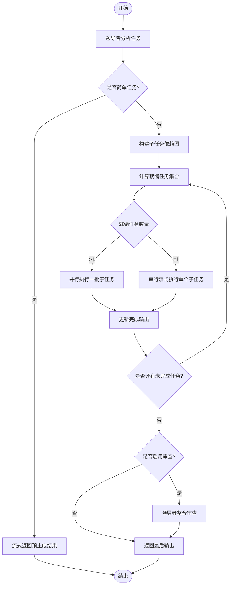
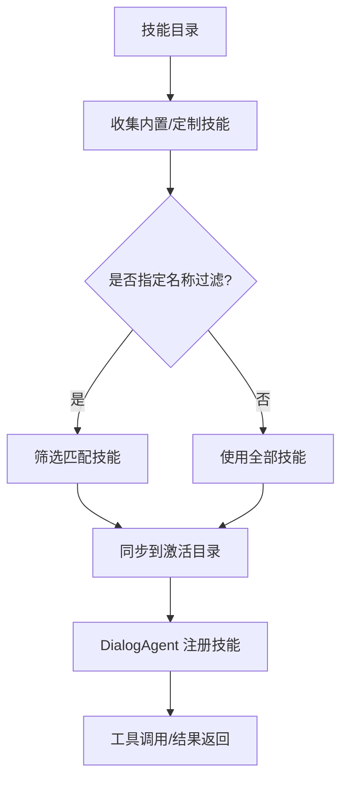
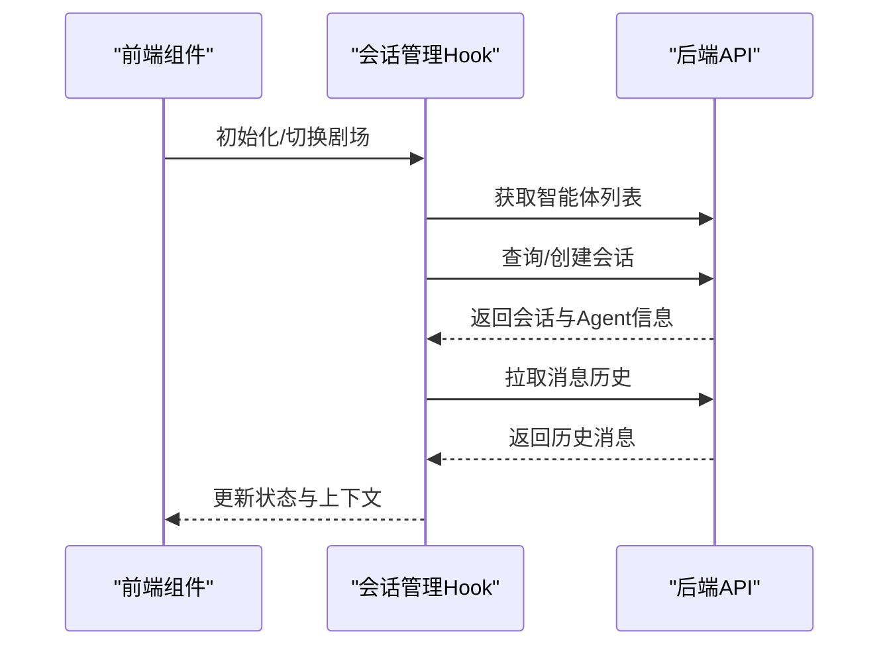
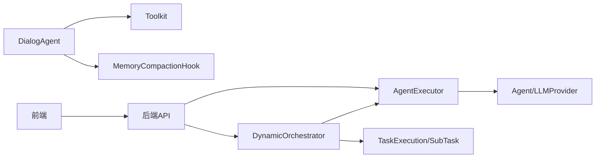
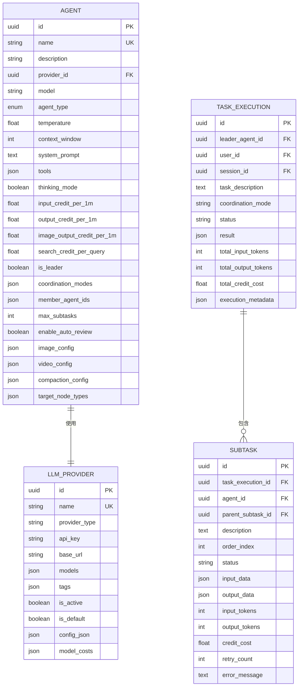

# 智能体架构

<cite>
**本文引用的文件**
- [main.py](file://backend/main.py)
- [agents.py](file://backend/agents.py)
- [agent_extensions.py](file://backend/agent_extensions.py)
- [skills_manager.py](file://backend/skills_manager.py)
- [services/orchestrator.py](file://backend/services/orchestrator.py)
- [services/agent_executor.py](file://backend/services/agent_executor.py)
- [models.py](file://backend/models.py)
- [schemas.py](file://backend/schemas.py)
- [routers/agents.py](file://backend/routers/agents.py)
- [migrations/versions/14746eaf1c81_initial.py](file://backend/migrations/versions/14746eaf1c81_initial.py)
- [frontend/src/components/canvas/MultiAgentSteps.tsx](file://frontend/src/components/canvas/MultiAgentSteps.tsx)
- [frontend/src/components/ai-assistant/hooks/useSessionManager.ts](file://frontend/src/components/ai-assistant/hooks/useSessionManager.ts)
- [frontend/src/lib/theaterApi.ts](file://frontend/src/lib/theaterApi.ts)
</cite>

## 目录
1. [简介](#简介)
2. [项目结构](#项目结构)
3. [核心组件](#核心组件)
4. [架构总览](#架构总览)
5. [详细组件分析](#详细组件分析)
6. [依赖分析](#依赖分析)
7. [性能考虑](#性能考虑)
8. [故障排除指南](#故障排除指南)
9. [结论](#结论)
10. [附录](#附录)

## 简介
本文件面向Infinite Game智能体系统，围绕基于AgentScope的多智能体协作架构进行系统化技术文档编写。重点涵盖：
- 智能体引擎设计与生命周期管理
- 智能体间通信与编排策略
- 技能系统与工具调用机制
- Narrative Engine核心功能与动态能力扩展
- 智能体状态管理、消息传递协议与错误恢复
- 开发指南、性能优化与故障排除

## 项目结构
后端采用FastAPI框架，按职责划分为路由层、服务层、模型层与迁移脚本；前端提供剧场画布与AI助手交互界面。

**图表来源**
- [main.py:110-154](file://backend/main.py#L110-L154)
- [routers/agents.py:1-151](file://backend/routers/agents.py#L1-L151)
- [services/orchestrator.py:418-534](file://backend/services/orchestrator.py#L418-L534)
- [models.py:210-273](file://backend/models.py#L210-L273)
- [schemas.py:239-357](file://backend/schemas.py#L239-L357)
- [frontend/src/components/ai-assistant/hooks/useSessionManager.ts:12-225](file://frontend/src/components/ai-assistant/hooks/useSessionManager.ts#L12-L225)
- [frontend/src/components/canvas/MultiAgentSteps.tsx:28-127](file://frontend/src/components/canvas/MultiAgentSteps.tsx#L28-L127)
- [frontend/src/lib/theaterApi.ts:107-158](file://frontend/src/lib/theaterApi.ts#L107-L158)

**章节来源**
- [main.py:110-175](file://backend/main.py#L110-L175)
- [routers/agents.py:1-151](file://backend/routers/agents.py#L1-L151)
- [models.py:210-273](file://backend/models.py#L210-L273)
- [schemas.py:239-357](file://backend/schemas.py#L239-L357)

## 核心组件
- 智能体引擎与对话代理
  - 基于AgentScope的DialogAgent，封装模型适配、格式化器、工具包与内存压缩钩子。
  - 支持多供应商模型（OpenAI、DashScope、Gemini、Anthropic、Ollama）与统一formatter映射。
- 编排与协作
  - DynamicOrchestrator通过“领导智能体”对任务进行简单/复杂分类，并采用统一策略执行子任务，支持并行与串行混合调度。
- 技能系统与工具调用
  - skills_manager负责内置/定制/激活技能的同步与管理；DialogAgent通过Toolkit注册技能，实现工具调用。
- 前后端交互
  - 后端提供智能体、聊天、编排等API；前端通过会话管理与剧场API完成上下文恢复与可视化展示。

**章节来源**
- [agents.py:40-175](file://backend/agents.py#L40-L175)
- [services/orchestrator.py:418-534](file://backend/services/orchestrator.py#L418-L534)
- [skills_manager.py:180-257](file://backend/skills_manager.py#L180-L257)
- [services/agent_executor.py:63-277](file://backend/services/agent_executor.py#L63-L277)

## 架构总览
系统采用“服务化+事件驱动”的多智能体协作架构：前端发起请求，后端通过AgentExecutor与Orchestrator协调，DialogAgent与技能工具完成具体任务，最终将结果与统计信息回传前端。

**图表来源**
- [services/agent_executor.py:74-208](file://backend/services/agent_executor.py#L74-L208)
- [services/orchestrator.py:437-534](file://backend/services/orchestrator.py#L437-L534)
- [agents.py:114-174](file://backend/agents.py#L114-L174)

## 详细组件分析

### 智能体引擎与生命周期
- 设计要点
  - DialogAgent继承AgentBase，组合模型、格式化器、工具包与内存压缩钩子。
  - 生命周期：初始化（注册技能、MCP客户端）、推理（记忆压缩、格式化、调用模型、提取用量）、结果归档。
- 关键流程
  - 懒加载MCP客户端，支持热重载。
  - 内存压缩钩子在推理前触发，按阈值自动摘要与裁剪。
  - 统一提取响应文本与用量，封装为Msg元数据。

**图表来源**
- [agents.py:40-175](file://backend/agents.py#L40-L175)
- [agent_extensions.py:7-163](file://backend/agent_extensions.py#L7-L163)

**章节来源**
- [agents.py:40-175](file://backend/agents.py#L40-L175)
- [agent_extensions.py:81-163](file://backend/agent_extensions.py#L81-L163)

### 编排与协作策略
- 统一策略（UnifiedStrategy）
  - 构建依赖图，按层级并发/串行执行；支持并行批处理与单任务流式输出。
  - 事件驱动：子任务创建、启动、块、完成、失败等事件通过SSE推送。
- 领导者分析
  - 单次LLM调用对任务进行“简单/复杂”判定与子任务分解，支持可选审查环节。
- 审查与汇总
  - 可选领导者审查，整合子任务输出形成最终结果。

**图表来源**
- [services/orchestrator.py:231-366](file://backend/services/orchestrator.py#L231-L366)
- [services/orchestrator.py:558-596](file://backend/services/orchestrator.py#L558-L596)

**章节来源**
- [services/orchestrator.py:418-534](file://backend/services/orchestrator.py#L418-L534)
- [services/orchestrator.py:661-754](file://backend/services/orchestrator.py#L661-L754)

### 技能系统与工具调用
- 技能管理
  - 同步内置/定制技能至激活目录，去重与差异检测，支持强制覆盖与禁用。
  - 提供技能文件读取与校验，防止路径穿越。
- 工具注册
  - DialogAgent通过Toolkit注册技能目录，支持MCP客户端动态注册。
- 安全守卫
  - ToolGuardMixin对敏感工具（如文件写入、删除）实施拦截与审批流程占位。

**图表来源**
- [skills_manager.py:180-257](file://backend/skills_manager.py#L180-L257)
- [agents.py:85-113](file://backend/agents.py#L85-L113)
- [agent_extensions.py:19-79](file://backend/agent_extensions.py#L19-L79)

**章节来源**
- [skills_manager.py:228-257](file://backend/skills_manager.py#L228-L257)
- [agents.py:85-113](file://backend/agents.py#L85-L113)
- [agent_extensions.py:19-79](file://backend/agent_extensions.py#L19-L79)

### 前后端交互与状态管理
- 会话管理
  - 前端通过useSessionManager加载可用智能体、创建/切换会话、恢复上下文使用统计与消息历史。
- 多智能体步骤展示
  - MultiAgentSteps组件以树形方式展示子任务状态、结果与Token统计，支持展开/折叠。
- 剧场API
  - 封装剧场的增删改查、画布保存与复制等操作，便于前端集成。

**图表来源**
- [frontend/src/components/ai-assistant/hooks/useSessionManager.ts:36-123](file://frontend/src/components/ai-assistant/hooks/useSessionManager.ts#L36-L123)
- [frontend/src/components/canvas/MultiAgentSteps.tsx:28-127](file://frontend/src/components/canvas/MultiAgentSteps.tsx#L28-L127)
- [frontend/src/lib/theaterApi.ts:107-158](file://frontend/src/lib/theaterApi.ts#L107-L158)

**章节来源**
- [frontend/src/components/ai-assistant/hooks/useSessionManager.ts:12-225](file://frontend/src/components/ai-assistant/hooks/useSessionManager.ts#L12-L225)
- [frontend/src/components/canvas/MultiAgentSteps.tsx:28-127](file://frontend/src/components/canvas/MultiAgentSteps.tsx#L28-L127)
- [frontend/src/lib/theaterApi.ts:107-158](file://frontend/src/lib/theaterApi.ts#L107-L158)

## 依赖分析
- 组件耦合
  - AgentExecutor依赖Agent与LLMProvider模型配置，统一抽象不同供应商模型。
  - Orchestrator依赖AgentExecutor与TaskExecution/SubTask持久化记录，实现任务生命周期跟踪。
  - DialogAgent依赖Toolkit与MemoryCompactionHook，实现工具与上下文压缩。
- 外部依赖
  - AgentScope作为智能体框架，提供模型、格式化器与工具包能力。
  - FastAPI/Uvicorn提供Web服务与SSE事件流。
- 数据模型
  - Agent/LLMProvider/TaskExecution/SubTask等模型支撑编排与计费统计。

**图表来源**
- [services/agent_executor.py:63-277](file://backend/services/agent_executor.py#L63-L277)
- [services/orchestrator.py:418-534](file://backend/services/orchestrator.py#L418-L534)
- [models.py:210-350](file://backend/models.py#L210-L350)

**章节来源**
- [services/agent_executor.py:63-277](file://backend/services/agent_executor.py#L63-L277)
- [services/orchestrator.py:418-534](file://backend/services/orchestrator.py#L418-L534)
- [models.py:210-350](file://backend/models.py#L210-L350)

## 性能考虑
- 上下文压缩
  - MemoryCompactionHook基于字符估算与阈值触发摘要，减少长对话开销。
- 并行执行
  - UnifiedStrategy在同层无依赖时并行执行子任务，提升吞吐。
- 流式输出
  - 对单任务执行流式生成，降低首字节延迟。
- 缓存与复用
  - AgentExecutor缓存模型与对话代理实例，避免重复初始化。
- 计费与统计
  - 统一提取input/output tokens与字符数，便于成本控制与审计。

[本节为通用指导，无需特定文件引用]

## 故障排除指南
- 数据库迁移失败
  - 启动阶段自动重试并清理残留临时表后重试；若仍失败，检查Alembic命令与SQLite权限。
- LLM提供商配置
  - 若无活动提供商，NarrativeEngine使用fallback设置；确保提供者类型与base_url正确。
- 工具调用安全
  - ToolGuard对禁止工具直接拦截，记录系统消息；后续可接入审批流程。
- 会话恢复
  - useSessionManager在切换剧场或刷新页面时尝试恢复会话与上下文统计；若失败，检查后端会话接口与Agent配置。

**章节来源**
- [main.py:49-108](file://backend/main.py#L49-L108)
- [agents.py:182-233](file://backend/agents.py#L182-L233)
- [agent_extensions.py:19-79](file://backend/agent_extensions.py#L19-L79)
- [frontend/src/components/ai-assistant/hooks/useSessionManager.ts:165-189](file://frontend/src/components/ai-assistant/hooks/useSessionManager.ts#L165-L189)

## 结论
Infinite Game以AgentScope为核心，构建了可扩展的多智能体协作平台：通过统一的编排策略、灵活的技能系统与工具调用、完善的上下文压缩与流式输出，实现了高效、可观测且易于维护的智能体工作流。配合前后端的会话与剧场能力，系统能够支撑从叙事生成到画布协作的多样化应用场景。

[本节为总结性内容，无需特定文件引用]

## 附录

### 数据模型概览（关键实体）

**图表来源**
- [models.py:210-350](file://backend/models.py#L210-L350)

**章节来源**
- [models.py:210-350](file://backend/models.py#L210-L350)

### API与Schema要点
- 智能体管理
  - 路由提供创建、查询、更新、删除智能体；校验提供商与模型可用性。
- 编排请求
  - 请求体包含任务描述、领导者ID、会话ID、剧场ID与选项；返回SSE事件流。
- 剧场与画布
  - 前端通过theaterApi封装剧场的创建、列表、详情、保存与复制等操作。

**章节来源**
- [routers/agents.py:16-151](file://backend/routers/agents.py#L16-L151)
- [schemas.py:437-484](file://backend/schemas.py#L437-L484)
- [frontend/src/lib/theaterApi.ts:107-158](file://frontend/src/lib/theaterApi.ts#L107-L158)