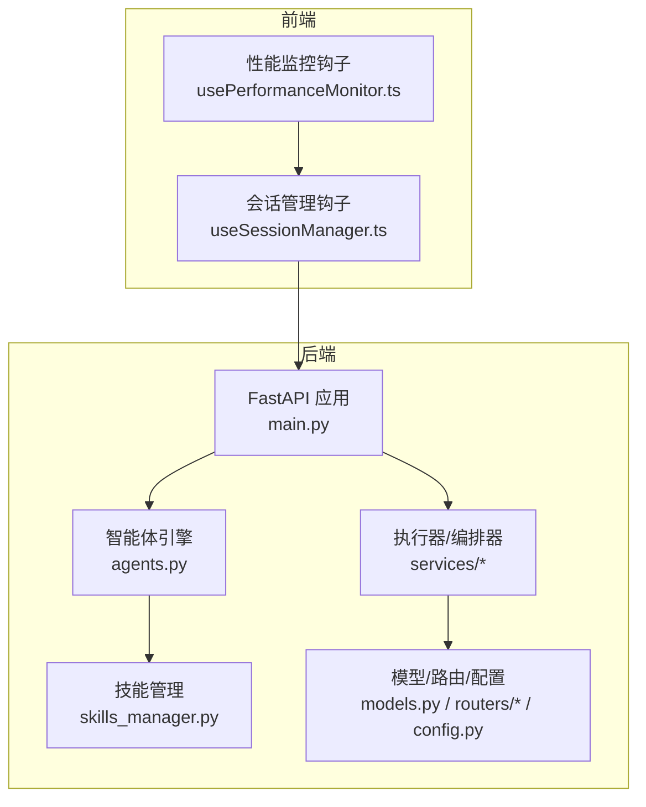
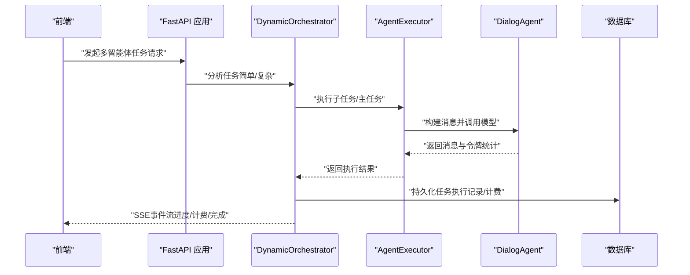
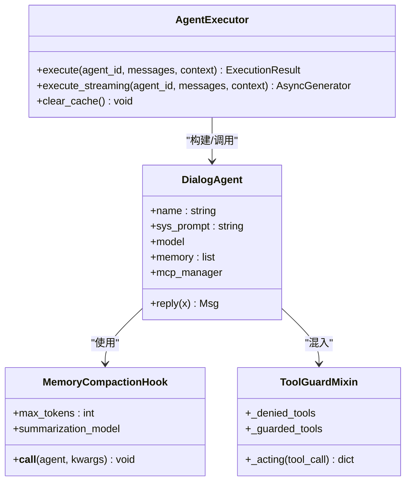
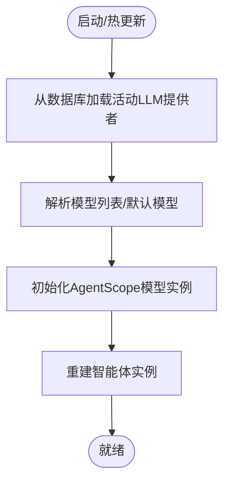
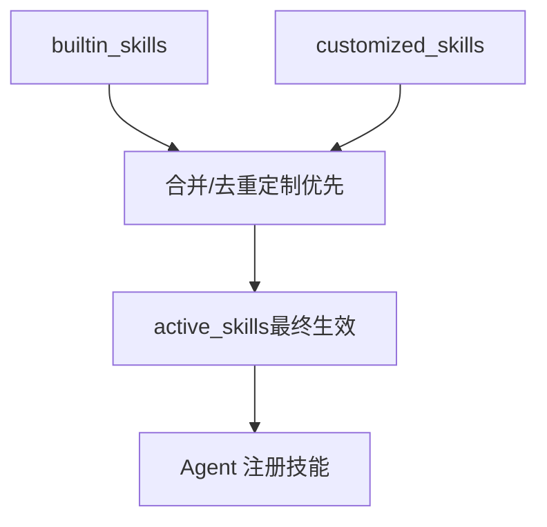
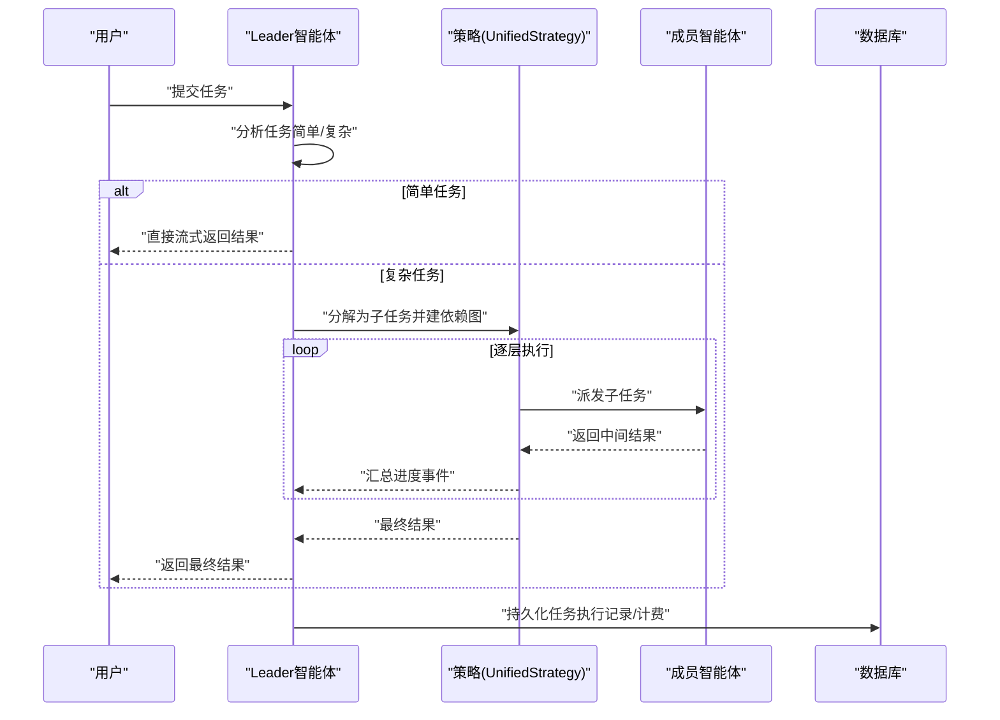
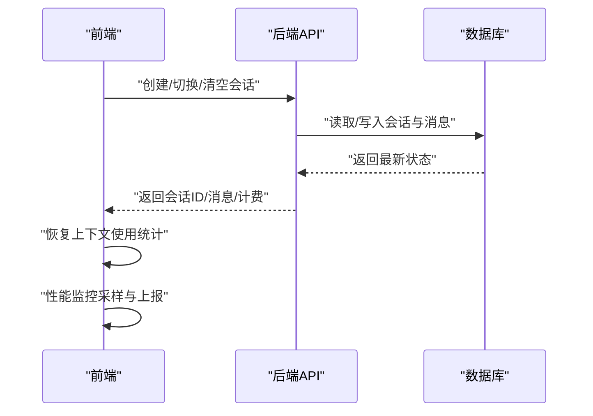
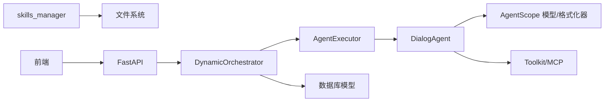

# 智能体生命周期管理

<cite>
**本文引用的文件**
- [main.py](file://backend/main.py)
- [agents.py](file://backend/agents.py)
- [skills_manager.py](file://backend/skills_manager.py)
- [agent_extensions.py](file://backend/agent_extensions.py)
- [services/orchestrator.py](file://backend/services/orchestrator.py)
- [services/chat_multi_agent.py](file://backend/services/chat_multi_agent.py)
- [services/agent_executor.py](file://backend/services/agent_executor.py)
- [models.py](file://backend/models.py)
- [config.py](file://backend/config.py)
- [routers/agents.py](file://backend/routers/agents.py)
- [frontend/src/components/ai-assistant/hooks/useSessionManager.ts](file://frontend/src/components/ai-assistant/hooks/useSessionManager.ts)
- [frontend/src/components/ai-assistant/hooks/usePerformanceMonitor.ts](file://frontend/src/components/ai-assistant/hooks/usePerformanceMonitor.ts)
</cite>

## 目录
1. [简介](#简介)
2. [项目结构](#项目结构)
3. [核心组件](#核心组件)
4. [架构总览](#架构总览)
5. [详细组件分析](#详细组件分析)
6. [依赖分析](#依赖分析)
7. [性能考量](#性能考量)
8. [故障排查指南](#故障排查指南)
9. [结论](#结论)
10. [附录](#附录)

## 简介
本文件围绕KunFlix（KunFlix）平台中的“智能体生命周期管理”主题，系统梳理从智能体创建、初始化、运行到销毁的完整流程；解释状态管理、内存清理与资源释放机制；阐述多智能体间的协调机制、通信协议与同步策略；并覆盖配置热更新、动态能力扩展与版本兼容性管理；最后提供监控指标、性能基准测试与故障恢复策略，以及多智能体协作最佳实践与常见陷阱。

## 项目结构
后端采用FastAPI + SQLAlchemy + AgentScope多智能体框架，前端使用Next.js + Zustand进行状态管理与实时通信。智能体生命周期贯穿后端服务层与前端交互层，形成“配置-执行-反馈-持久化”的闭环。

图表来源
- [main.py:110-175](file://backend/main.py#L110-L175)
- [agents.py:176-388](file://backend/agents.py#L176-L388)
- [skills_manager.py:180-257](file://backend/skills_manager.py#L180-L257)
- [services/orchestrator.py:418-534](file://backend/services/orchestrator.py#L418-L534)
- [models.py:210-273](file://backend/models.py#L210-L273)
- [config.py:7-43](file://backend/config.py#L7-L43)
- [frontend/src/components/ai-assistant/hooks/useSessionManager.ts:12-226](file://frontend/src/components/ai-assistant/hooks/useSessionManager.ts#L12-L226)
- [frontend/src/components/ai-assistant/hooks/usePerformanceMonitor.ts:31-236](file://frontend/src/components/ai-assistant/hooks/usePerformanceMonitor.ts#L31-L236)

章节来源
- [main.py:110-175](file://backend/main.py#L110-L175)
- [models.py:210-273](file://backend/models.py#L210-L273)
- [config.py:7-43](file://backend/config.py#L7-L43)

## 核心组件
- 智能体引擎与生命周期
  - DialogAgent：封装对话型智能体，负责消息格式化、工具注册、回复生成与内存压缩钩子。
  - NarrativeEngine：全局叙事引擎，负责从数据库加载LLM配置、按需初始化Agent实例、统一生成章节内容。
- 执行与编排
  - AgentExecutor：统一执行入口，封装对话型调用、流式输出与令牌统计。
  - DynamicOrchestrator：统一任务分析与多智能体编排，支持简单/复杂任务分流、依赖调度、事件流与计费汇总。
- 技能系统
  - skills_manager：技能同步、启用/禁用、创建/删除、文件安全加载，支持内置/定制/激活目录的去重与覆盖。
- 状态与持久化
  - models：Agent、LLMProvider、ChatSession、ChatMessage、TaskExecution、SubTask等模型，支撑智能体配置、会话上下文、任务执行记录与计费。
- 前端交互
  - useSessionManager：会话创建/切换/清空、上下文使用统计恢复、消息历史加载。
  - usePerformanceMonitor：前端侧性能观测（长任务、LCP/FID/CLS、FPS）。

章节来源
- [agents.py:40-175](file://backend/agents.py#L40-L175)
- [agents.py:176-388](file://backend/agents.py#L176-L388)
- [services/agent_executor.py:63-287](file://backend/services/agent_executor.py#L63-L287)
- [services/orchestrator.py:418-800](file://backend/services/orchestrator.py#L418-L800)
- [skills_manager.py:180-408](file://backend/skills_manager.py#L180-L408)
- [models.py:210-350](file://backend/models.py#L210-L350)
- [frontend/src/components/ai-assistant/hooks/useSessionManager.ts:12-226](file://frontend/src/components/ai-assistant/hooks/useSessionManager.ts#L12-L226)
- [frontend/src/components/ai-assistant/hooks/usePerformanceMonitor.ts:31-236](file://frontend/src/components/ai-assistant/hooks/usePerformanceMonitor.ts#L31-L236)

## 架构总览
智能体生命周期由“配置加载—实例化—执行—编排—持久化—反馈—回收”构成闭环。后端通过FastAPI应用在生命周期中完成数据库连接、迁移与NarrativeEngine初始化；前端通过会话管理钩子建立与后端的交互通道，实现上下文恢复与性能监控。

图表来源
- [services/orchestrator.py:418-534](file://backend/services/orchestrator.py#L418-L534)
- [services/agent_executor.py:74-208](file://backend/services/agent_executor.py#L74-L208)
- [agents.py:114-175](file://backend/agents.py#L114-L175)
- [models.py:303-350](file://backend/models.py#L303-L350)

## 详细组件分析

### 智能体引擎与生命周期（DialogAgent/NarrativeEngine）
- 生命周期阶段
  - 创建：构造函数接收系统提示、模型实例、最大上下文长度、MCP客户端管理器与技能名称列表。
  - 初始化：注册工具包、加载技能、初始化内存压缩钩子。
  - 运行：接收Msg输入，触发内存压缩钩子，格式化消息，调用模型，提取响应与令牌统计，追加到记忆。
  - 销毁：当前实现为进程内对象，随进程退出或缓存清理释放；可通过AgentExecutor缓存清理接口主动回收。
- 状态管理
  - 内存：维护对话记忆列表；通过MemoryCompactionHook在达到阈值时进行摘要压缩。
  - 工具：ToolGuardMixin提供工具拦截与审批占位，保障安全边界。
- 资源释放
  - 缓存：AgentExecutor提供模型与Agent实例缓存，支持clear_cache主动清理。
  - MCP：延迟注册MCP客户端，便于热更新后按需重建。

图表来源
- [agents.py:40-175](file://backend/agents.py#L40-L175)
- [agent_extensions.py:81-163](file://backend/agent_extensions.py#L81-L163)
- [services/agent_executor.py:63-287](file://backend/services/agent_executor.py#L63-L287)

章节来源
- [agents.py:40-175](file://backend/agents.py#L40-L175)
- [agent_extensions.py:81-163](file://backend/agent_extensions.py#L81-L163)
- [services/agent_executor.py:273-277](file://backend/services/agent_executor.py#L273-L277)

### 配置加载与热更新（NarrativeEngine）
- 启动时加载：应用生命周期中从数据库加载活动LLM提供者，解析模型列表，初始化AgentScope模型实例，重建智能体。
- 运行时热更新：通过reload_config触发配置重载，支持在不重启服务的情况下切换模型与供应商。
- 兼容性：支持多种供应商类型（OpenAI兼容、Anthropic兼容、DashScope、Gemini、Ollama），并提供默认base_url映射。

图表来源
- [agents.py:182-321](file://backend/agents.py#L182-L321)

章节来源
- [agents.py:182-321](file://backend/agents.py#L182-L321)

### 技能系统与动态能力扩展（skills_manager）
- 目录结构
  - builtin_skills：内置技能集合
  - customized_skills：定制技能工作区
  - active_skills：激活技能工作区（最终生效）
- 同步策略
  - 同步：内置覆盖定制，支持强制覆盖与差异检测。
  - 启用/禁用：通过SkillService在active_skills中增删。
  - 创建/删除：在customized_skills中创建或删除，影响active_skills。
- 安全与版本
  - 文件加载校验：前缀限制、路径遍历防护、引用/脚本树结构生成。
  - 版本元数据：通过SKILL.md frontmatter中的builtin_skill_version进行版本识别。

图表来源
- [skills_manager.py:180-257](file://backend/skills_manager.py#L180-L257)
- [skills_manager.py:263-408](file://backend/skills_manager.py#L263-L408)

章节来源
- [skills_manager.py:180-257](file://backend/skills_manager.py#L180-L257)
- [skills_manager.py:263-408](file://backend/skills_manager.py#L263-L408)

### 多智能体编排与通信（DynamicOrchestrator）
- 任务分析：Leader智能体一次性分析任务，判定简单/复杂两类路径。
- 复杂任务：构建依赖图，按层级并发或串行执行，支持流式事件推送（SSE）。
- 事件模型：统一事件类型（subtask_*、task_*、billing等），前端通过SSE消费。
- 计费与统计：汇总子任务令牌用量，计算信用消耗，更新会话累计用量。

图表来源
- [services/orchestrator.py:418-534](file://backend/services/orchestrator.py#L418-L534)
- [services/orchestrator.py:558-596](file://backend/services/orchestrator.py#L558-L596)
- [services/orchestrator.py:238-366](file://backend/services/orchestrator.py#L238-L366)

章节来源
- [services/orchestrator.py:418-534](file://backend/services/orchestrator.py#L418-L534)
- [services/orchestrator.py:558-596](file://backend/services/orchestrator.py#L558-L596)
- [services/orchestrator.py:238-366](file://backend/services/orchestrator.py#L238-L366)

### 前端会话管理与性能监控
- 会话管理
  - 自动创建/切换/清空会话，恢复上下文使用统计（累计令牌用量与上下文窗口）。
  - 与后端API对接，加载消息历史，支持剧场（Theater）维度的会话隔离。
- 性能监控
  - 长任务、LCP、FID、CLS、FPS等指标采集与上报。
  - 提供操作级性能测量工具，辅助定位瓶颈。

图表来源
- [frontend/src/components/ai-assistant/hooks/useSessionManager.ts:52-123](file://frontend/src/components/ai-assistant/hooks/useSessionManager.ts#L52-L123)
- [frontend/src/components/ai-assistant/hooks/useSessionManager.ts:165-189](file://frontend/src/components/ai-assistant/hooks/useSessionManager.ts#L165-L189)
- [frontend/src/components/ai-assistant/hooks/usePerformanceMonitor.ts:75-200](file://frontend/src/components/ai-assistant/hooks/usePerformanceMonitor.ts#L75-L200)

章节来源
- [frontend/src/components/ai-assistant/hooks/useSessionManager.ts:52-123](file://frontend/src/components/ai-assistant/hooks/useSessionManager.ts#L52-L123)
- [frontend/src/components/ai-assistant/hooks/useSessionManager.ts:165-189](file://frontend/src/components/ai-assistant/hooks/useSessionManager.ts#L165-L189)
- [frontend/src/components/ai-assistant/hooks/usePerformanceMonitor.ts:75-200](file://frontend/src/components/ai-assistant/hooks/usePerformanceMonitor.ts#L75-L200)

## 依赖分析
- 组件耦合
  - DialogAgent依赖AgentScope模型与格式化器、工具包与MCP客户端管理器。
  - AgentExecutor依赖数据库加载Agent与Provider配置，封装统一执行接口。
  - DynamicOrchestrator依赖AgentExecutor与数据库模型，负责任务分析与事件流。
  - skills_manager独立于AgentScope，通过文件系统与数据库协同。
- 外部依赖
  - AgentScope：多智能体框架与模型抽象。
  - FastAPI/SQLAlchemy：Web框架与ORM。
  - 前端Zustand：轻量状态管理。

图表来源
- [agents.py:40-175](file://backend/agents.py#L40-L175)
- [services/agent_executor.py:63-287](file://backend/services/agent_executor.py#L63-L287)
- [services/orchestrator.py:418-534](file://backend/services/orchestrator.py#L418-L534)
- [skills_manager.py:180-257](file://backend/skills_manager.py#L180-L257)

章节来源
- [agents.py:40-175](file://backend/agents.py#L40-L175)
- [services/agent_executor.py:63-287](file://backend/services/agent_executor.py#L63-L287)
- [services/orchestrator.py:418-534](file://backend/services/orchestrator.py#L418-L534)
- [skills_manager.py:180-257](file://backend/skills_manager.py#L180-L257)

## 性能考量
- 智能体执行
  - 流式输出：AgentExecutor.execute_streaming直接调用底层流式接口，降低首帧延迟。
  - 缓存优化：AgentExecutor缓存模型与Agent实例，减少重复初始化开销。
- 内存与上下文
  - MemoryCompactionHook在达到阈值时进行摘要压缩，避免上下文溢出。
  - ChatSession维护累计令牌用量，结合前端上下文使用统计，指导压缩策略。
- 前端性能
  - usePerformanceMonitor采集长任务、LCP/FID/CLS、FPS，辅助定位UI渲染与交互卡顿。
  - 建议：对大量消息渲染采用虚拟列表、懒加载与增量更新。

章节来源
- [services/agent_executor.py:127-163](file://backend/services/agent_executor.py#L127-L163)
- [agent_extensions.py:81-163](file://backend/agent_extensions.py#L81-L163)
- [frontend/src/components/ai-assistant/hooks/usePerformanceMonitor.ts:75-200](file://frontend/src/components/ai-assistant/hooks/usePerformanceMonitor.ts#L75-L200)

## 故障排查指南
- 启动与数据库
  - 数据库连接失败：应用生命周期中包含重试与迁移失败后的残留表清理逻辑，若仍失败检查环境变量与DB路径。
- LLM配置
  - 无活动提供者：NarrativeEngine初始化时会回退到设置项，若仍失败检查LLMProvider表与配置字段。
- 执行异常
  - 任务失败：DynamicOrchestrator捕获异常并记录错误，前端SSE事件中包含错误信息；检查Agent配置、工具权限与模型可用性。
- 计费与令牌
  - 令牌统计异常：确认ExecutionResult与TaskExecution/ChatSession的令牌字段更新逻辑，核对Provider返回的usage字段。
- 前端会话
  - 上下文统计不正确：useSessionManager在恢复时依赖后端返回的total_tokens_used与context_window，检查API响应与前端状态同步。

章节来源
- [main.py:49-108](file://backend/main.py#L49-L108)
- [agents.py:182-233](file://backend/agents.py#L182-L233)
- [services/orchestrator.py:521-534](file://backend/services/orchestrator.py#L521-L534)
- [frontend/src/components/ai-assistant/hooks/useSessionManager.ts:165-189](file://frontend/src/components/ai-assistant/hooks/useSessionManager.ts#L165-L189)

## 结论
KunFlix的智能体生命周期管理以AgentScope为核心，结合FastAPI与SQLAlchemy实现了从配置加载、智能体实例化、执行与编排、计费与持久化到前端交互与性能监控的完整闭环。通过技能系统的动态扩展、内存压缩钩子与缓存清理机制，系统在保证安全性与稳定性的同时，具备良好的可维护性与可扩展性。建议在生产环境中进一步完善工具审批流程、增强异常恢复与审计日志，并持续优化上下文压缩策略与前端渲染性能。

## 附录
- 最佳实践
  - 配置热更新：通过NarrativeEngine.reload_config实现，避免停机切换。
  - 技能扩展：优先在customized_skills中开发，经验证后再同步至active_skills。
  - 多智能体协作：合理设置Leader与成员Agent的职责边界，避免过度耦合。
- 常见陷阱
  - 忽视上下文窗口：导致频繁截断与重复成本上升。
  - 工具权限滥用：未通过ToolGuard审批的高危工具可能导致安全风险。
  - 缺少前端性能监控：UI卡顿与长任务未及时发现，影响用户体验。