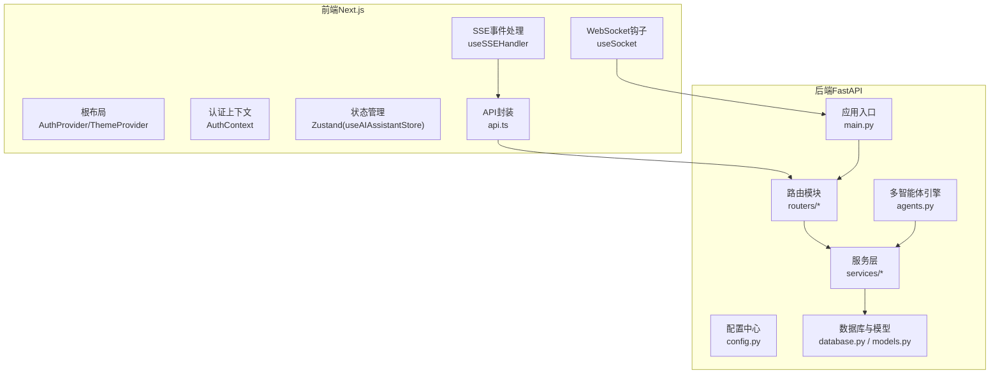
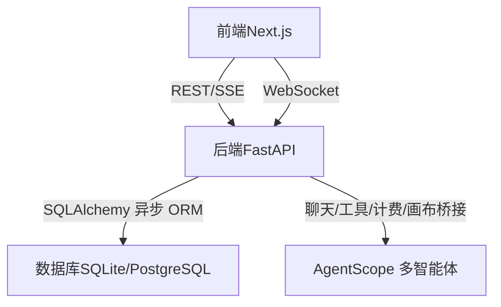
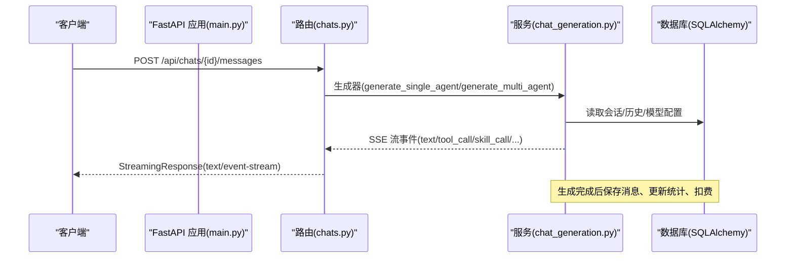
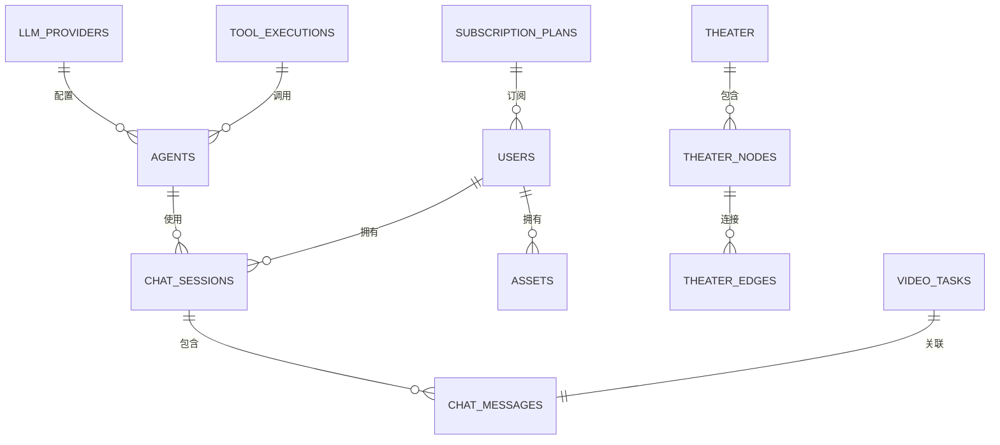
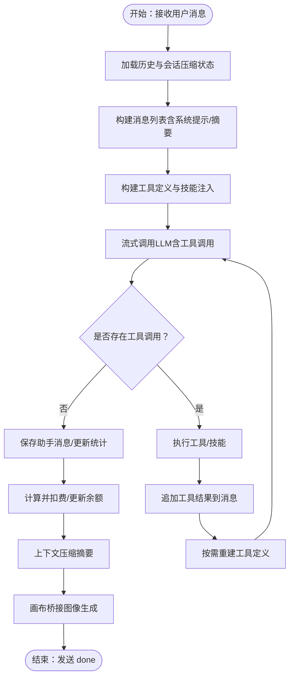
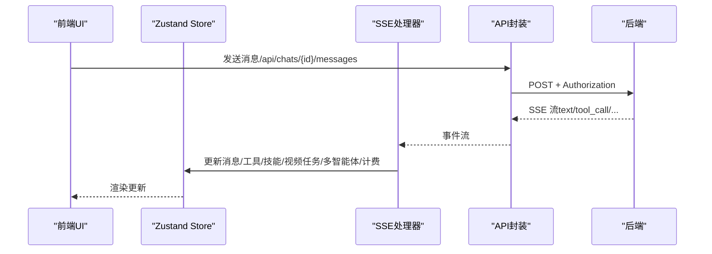
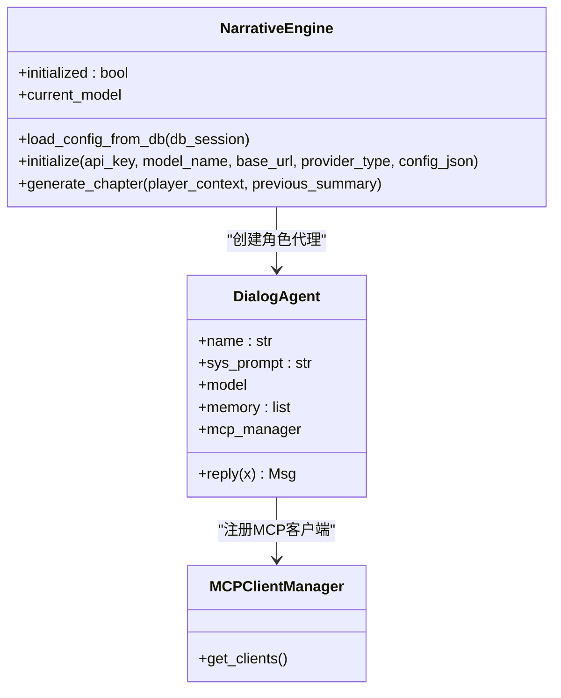
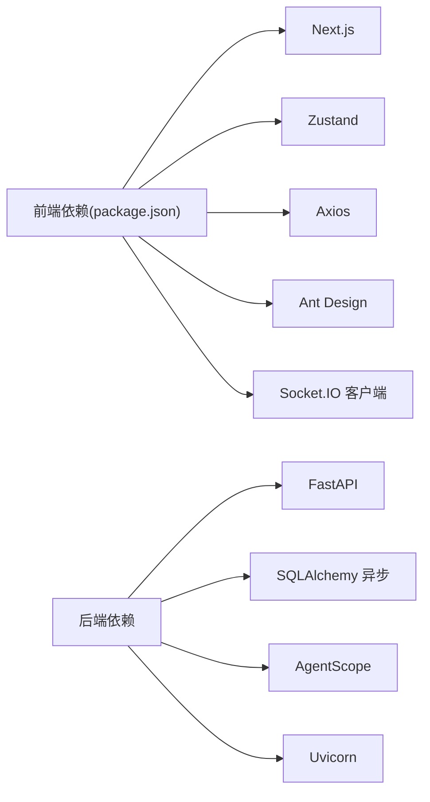

# 系统架构

<cite>
**本文引用的文件**
- [backend/main.py](file://backend/main.py)
- [backend/config.py](file://backend/config.py)
- [backend/database.py](file://backend/database.py)
- [backend/models.py](file://backend/models.py)
- [backend/routers/agents.py](file://backend/routers/agents.py)
- [backend/routers/chats.py](file://backend/routers/chats.py)
- [backend/services/chat_generation.py](file://backend/services/chat_generation.py)
- [backend/services/chat_utils.py](file://backend/services/chat_utils.py)
- [backend/agents.py](file://backend/agents.py)
- [frontend/src/app/layout.tsx](file://frontend/src/app/layout.tsx)
- [frontend/package.json](file://frontend/package.json)
- [frontend/src/context/AuthContext.tsx](file://frontend/src/context/AuthContext.tsx)
- [frontend/src/store/useAIAssistantStore.ts](file://frontend/src/store/useAIAssistantStore.ts)
- [frontend/src/lib/api.ts](file://frontend/src/lib/api.ts)
- [frontend/src/hooks/useSocket.ts](file://frontend/src/hooks/useSocket.ts)
- [frontend/src/components/ai-assistant/hooks/useSSEHandler.ts](file://frontend/src/components/ai-assistant/hooks/useSSEHandler.ts)
</cite>

## 目录
1. [简介](#简介)
2. [项目结构](#项目结构)
3. [核心组件](#核心组件)
4. [架构总览](#架构总览)
5. [详细组件分析](#详细组件分析)
6. [依赖关系分析](#依赖关系分析)
7. [性能考量](#性能考量)
8. [故障排查指南](#故障排查指南)
9. [结论](#结论)
10. [附录](#附录)

## 简介
本系统为“KunFlix”无限叙事剧院平台，采用前后端分离架构：后端基于 FastAPI 构建，提供异步高性能 API；前端基于 Next.js，采用 Zustand 状态管理和 React Context 进行认证与主题管理；实时通信层同时支持 WebSocket 与 Server-Sent Events（SSE）。系统通过 AgentScope 多智能体框架实现多模态与工具调用能力，并结合数据库（SQLite/PostgreSQL + SQLAlchemy 异步 ORM）与中间件设计保障可扩展性与稳定性。

## 项目结构
- 后端（Python/FastAPI）
  - 应用入口与生命周期管理、CORS、路由注册、WebSocket 端点
  - 配置中心（环境变量与运行参数）
  - 数据库与模型（SQLAlchemy 异步 ORM）
  - 路由模块（认证、聊天、智能体、剧场、视频等）
  - 服务层（聊天生成、多智能体编排、计费、画布桥接、工具管理等）
  - AgentScope 多智能体引擎与 MCP 客户端管理
- 前端（Next.js 16）
  - 根布局与全局样式
  - 认证上下文（JWT、自动刷新、401拦截）
  - 状态管理（Zustand + localStorage 持久化）
  - 实时通信（SSE 事件处理、WebSocket 交互）
  - UI 组件（画布、AI 助手面板、资源管理等）

图表来源
- [backend/main.py:110-175](file://backend/main.py#L110-L175)
- [backend/config.py:1-43](file://backend/config.py#L1-L43)
- [backend/database.py:1-45](file://backend/database.py#L1-L45)
- [backend/models.py:1-503](file://backend/models.py#L1-L503)
- [backend/routers/chats.py:1-232](file://backend/routers/chats.py#L1-L232)
- [backend/services/chat_generation.py:1-449](file://backend/services/chat_generation.py#L1-L449)
- [backend/agents.py:1-388](file://backend/agents.py#L1-L388)
- [frontend/src/app/layout.tsx:1-42](file://frontend/src/app/layout.tsx#L1-L42)
- [frontend/src/context/AuthContext.tsx:1-207](file://frontend/src/context/AuthContext.tsx#L1-L207)
- [frontend/src/store/useAIAssistantStore.ts:1-381](file://frontend/src/store/useAIAssistantStore.ts#L1-L381)
- [frontend/src/lib/api.ts:1-84](file://frontend/src/lib/api.ts#L1-L84)
- [frontend/src/hooks/useSocket.ts:1-42](file://frontend/src/hooks/useSocket.ts#L1-L42)
- [frontend/src/components/ai-assistant/hooks/useSSEHandler.ts:1-391](file://frontend/src/components/ai-assistant/hooks/useSSEHandler.ts#L1-L391)

章节来源
- [backend/main.py:110-175](file://backend/main.py#L110-L175)
- [frontend/src/app/layout.tsx:18-42](file://frontend/src/app/layout.tsx#L18-L42)

## 核心组件
- 后端应用与中间件
  - 应用生命周期（数据库连接重试、迁移、NarrativeEngine 初始化）
  - CORS 与调试中间件
  - 路由注册与 WebSocket 端点
- 数据库与模型
  - 异步引擎与连接池配置（SQLite/PostgreSQL）
  - 模型定义（用户、剧场、节点、消息、智能体、订阅、视频任务等）
- 路由与服务
  - 聊天路由（SSE 流式响应）
  - 智能体路由（CRUD 与校验）
  - 服务层（单智能体/多智能体生成、计费、上下文压缩、画布桥接）
- 前端状态与认证
  - AuthContext（登录、登出、令牌刷新、401拦截）
  - Zustand Store（AI 助手面板状态、画布会话、上下文使用统计）
  - API 封装（Axios + Interceptor）
  - 实时通信（SSE 事件解析与 UI 更新、WebSocket 钩子）

章节来源
- [backend/main.py:49-108](file://backend/main.py#L49-L108)
- [backend/database.py:9-37](file://backend/database.py#L9-L37)
- [backend/models.py:10-459](file://backend/models.py#L10-L459)
- [backend/routers/chats.py:127-183](file://backend/routers/chats.py#L127-L183)
- [backend/routers/agents.py:16-151](file://backend/routers/agents.py#L16-L151)
- [backend/services/chat_generation.py:29-449](file://backend/services/chat_generation.py#L29-L449)
- [frontend/src/context/AuthContext.tsx:142-207](file://frontend/src/context/AuthContext.tsx#L142-L207)
- [frontend/src/store/useAIAssistantStore.ts:209-381](file://frontend/src/store/useAIAssistantStore.ts#L209-L381)
- [frontend/src/lib/api.ts:31-84](file://frontend/src/lib/api.ts#L31-L84)

## 架构总览
系统采用“后端 API + 前端渲染”的前后端分离架构，后端提供 REST/SSE/WebSocket 接口，前端通过 Axios 与自定义拦截器进行认证与请求重试，实时事件通过 SSE 与 WebSocket 在 UI 层解码与渲染。

图表来源
- [backend/main.py:161-172](file://backend/main.py#L161-L172)
- [backend/routers/chats.py:175-183](file://backend/routers/chats.py#L175-L183)
- [backend/services/chat_generation.py:175-306](file://backend/services/chat_generation.py#L175-L306)
- [frontend/src/lib/api.ts:31-84](file://frontend/src/lib/api.ts#L31-L84)
- [frontend/src/hooks/useSocket.ts:1-42](file://frontend/src/hooks/useSocket.ts#L1-L42)

## 详细组件分析

### 后端应用与中间件
- 生命周期管理：数据库连接重试、迁移执行、NarrativeEngine 初始化
- CORS 与调试中间件：跨域配置、请求头日志
- 路由注册：认证、管理员、聊天、智能体、剧场、视频、订阅等
- WebSocket：基础回显端点，便于实时通信扩展

图表来源
- [backend/routers/chats.py:127-183](file://backend/routers/chats.py#L127-L183)
- [backend/services/chat_generation.py:29-449](file://backend/services/chat_generation.py#L29-L449)

章节来源
- [backend/main.py:49-108](file://backend/main.py#L49-L108)
- [backend/main.py:130-136](file://backend/main.py#L130-L136)
- [backend/main.py:139-153](file://backend/main.py#L139-L153)
- [backend/main.py:161-172](file://backend/main.py#L161-L172)

### 数据库与模型（SQLAlchemy 异步 ORM）
- 引擎与连接池：SQLite/PostgreSQL 双栈支持，WAL 模式优化，连接池与超时配置
- 模型覆盖：用户、管理员、剧场、节点、边、资产、LLM 提供商、聊天会话/消息、智能体、订阅计划、视频任务、工具执行日志等
- 事务与一致性：异步会话、原子扣费、上下文压缩、画布桥接

图表来源
- [backend/models.py:10-459](file://backend/models.py#L10-L459)

章节来源
- [backend/database.py:9-37](file://backend/database.py#L9-L37)
- [backend/models.py:10-459](file://backend/models.py#L10-L459)

### 聊天与多智能体服务
- 单智能体流式生成：构建消息列表、工具定义、技能注入、工具调用循环、上下文压缩、计费与画布桥接
- 多智能体编排：领导者智能体协调成员、子任务创建与跟踪、聚合结果与统计
- SSE 事件：text、tool_call/skill_call、tool_result/skill_loaded、video_task_created、canvas_updated、context_compacted、billing、done/error

图表来源
- [backend/services/chat_generation.py:29-449](file://backend/services/chat_generation.py#L29-L449)

章节来源
- [backend/services/chat_generation.py:29-449](file://backend/services/chat_generation.py#L29-L449)

### 前端状态管理与认证
- AuthContext：登录/登出、刷新令牌、401拦截与队列重试
- Zustand Store：AI 助手面板状态、画布会话缓存、上下文使用统计、面板尺寸位置、节点附件、多智能体步骤
- API 封装：Axios 实例、请求拦截器附加 Authorization、响应拦截器处理 401 与重试
- SSE 事件处理：解析 event/data 行，更新消息、工具/技能状态、视频任务、多智能体步骤、计费与余额、画布同步、上下文压缩提示
- WebSocket 钩子：建立连接、发送消息、接收消息

图表来源
- [frontend/src/lib/api.ts:31-84](file://frontend/src/lib/api.ts#L31-L84)
- [frontend/src/components/ai-assistant/hooks/useSSEHandler.ts:67-391](file://frontend/src/components/ai-assistant/hooks/useSSEHandler.ts#L67-L391)
- [frontend/src/store/useAIAssistantStore.ts:209-381](file://frontend/src/store/useAIAssistantStore.ts#L209-L381)

章节来源
- [frontend/src/context/AuthContext.tsx:142-207](file://frontend/src/context/AuthContext.tsx#L142-L207)
- [frontend/src/lib/api.ts:31-84](file://frontend/src/lib/api.ts#L31-L84)
- [frontend/src/components/ai-assistant/hooks/useSSEHandler.ts:67-391](file://frontend/src/components/ai-assistant/hooks/useSSEHandler.ts#L67-L391)
- [frontend/src/store/useAIAssistantStore.ts:209-381](file://frontend/src/store/useAIAssistantStore.ts#L209-L381)
- [frontend/src/hooks/useSocket.ts:1-42](file://frontend/src/hooks/useSocket.ts#L1-L42)

### AgentScope 多智能体架构
- 模型适配：根据提供商类型选择模型类（OpenAI/DashScope/Gemini/Anthropic/Ollama）
- 工具与技能：Toolkit 注册、MCP 客户端注册、技能加载与权限控制
- 记忆压缩钩子：在推理前对记忆进行压缩，控制上下文窗口
- 导演/叙述者/NPC 管理员角色：协同生成章节内容与 NPC 状态更新

图表来源
- [backend/agents.py:40-175](file://backend/agents.py#L40-L175)
- [backend/agents.py:176-388](file://backend/agents.py#L176-L388)

章节来源
- [backend/agents.py:40-175](file://backend/agents.py#L40-L175)
- [backend/agents.py:176-388](file://backend/agents.py#L176-L388)

## 依赖关系分析
- 后端依赖
  - FastAPI、SQLAlchemy 异步 ORM、Uvicorn、AgentScope、MCP 管理器
  - 配置中心（Pydantic Settings）、数据库（SQLite/PostgreSQL）
- 前端依赖
  - Next.js、Zustand、Axios、SWR、Ant Design、Socket.IO 客户端
  - TypeScript 类型与 Tailwind CSS

图表来源
- [frontend/package.json:13-94](file://frontend/package.json#L13-L94)
- [backend/main.py:32-44](file://backend/main.py#L32-L44)

章节来源
- [frontend/package.json:13-94](file://frontend/package.json#L13-L94)
- [backend/main.py:32-44](file://backend/main.py#L32-L44)

## 性能考量
- 异步与连接池
  - SQLAlchemy 异步引擎与连接池配置，SQLite WAL 模式降低锁竞争
- SSE 流式传输
  - 服务端逐块推送事件，前端增量渲染，降低内存峰值
- 工具调用与上下文压缩
  - 工具结果预截断、延迟上下文压缩，平衡完整上下文与性能
- 前端虚拟滚动与状态持久化
  - 大消息列表使用虚拟滚动，Zustand 结合 localStorage 减少重载开销
- WebSocket
  - 低延迟场景（如调试/通知）可扩展使用，注意连接管理与重连策略

## 故障排查指南
- 后端
  - 数据库连接失败：检查连接字符串、迁移开关、残留临时表清理
  - SSE 事件异常：确认事件格式（event/data）、流式响应头设置
  - 认证 401：前端拦截器与刷新流程，检查刷新令牌与队列处理
- 前端
  - SSE 解析失败：检查 event/data 行格式、缓冲区拼接与事件去重
  - WebSocket 断开：确认端点路径、CORS、浏览器限制
  - 状态不同步：检查 Zustand 持久化键与过滤策略

章节来源
- [backend/main.py:49-108](file://backend/main.py#L49-L108)
- [backend/services/chat_utils.py:16-18](file://backend/services/chat_utils.py#L16-L18)
- [frontend/src/lib/api.ts:31-84](file://frontend/src/lib/api.ts#L31-L84)
- [frontend/src/components/ai-assistant/hooks/useSSEHandler.ts:56-65](file://frontend/src/components/ai-assistant/hooks/useSSEHandler.ts#L56-L65)
- [frontend/src/hooks/useSocket.ts:8-33](file://frontend/src/hooks/useSocket.ts#L8-L33)

## 结论
本系统通过 FastAPI 的异步能力与 AgentScope 的多智能体编排，结合 Next.js 的现代化前端生态，实现了高性能、可扩展的无限叙事剧院平台。SSE 与 WebSocket 的组合满足了实时交互需求，Zustand 与 React Context 提供了清晰的状态与认证边界。数据库层采用异步 ORM 与 SQLite/PostgreSQL 双栈支持，兼顾开发效率与生产可用性。

## 附录
- 系统边界
  - 后端：API 网关、认证、聊天生成、多智能体编排、计费与画布桥接
  - 前端：用户界面、实时事件渲染、状态持久化、认证与网络拦截
- 集成模式
  - SSE：后端流式事件 → 前端事件解析 → UI 增量渲染
  - WebSocket：前端连接 → 服务端回显/扩展（调试/通知）
  - 数据库：异步 ORM 事务 → 原子计费与上下文压缩
- 技术决策与权衡
  - 异步 ORM：提升并发与吞吐，降低阻塞
  - SSE：天然的服务器推送，适合流式对话
  - Zustand：轻量状态管理，易于持久化与测试
  - AgentScope：统一多模型与工具接入，简化多智能体编排
- 基础设施与可扩展性
  - 建议使用 PostgreSQL 生产环境，SQLite 适合本地开发
  - 前端可部署静态站点，后端容器化（Docker）+ 反向代理（Nginx）
  - 横向扩展：数据库读写分离、缓存（Redis）用于会话与令牌、消息队列用于视频生成任务