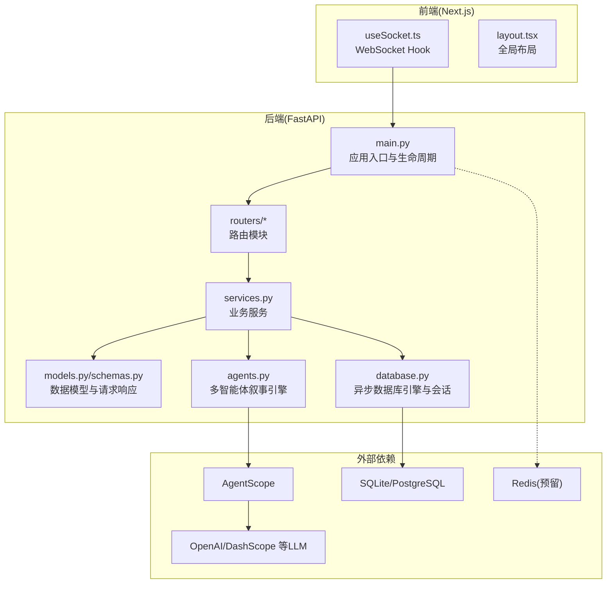
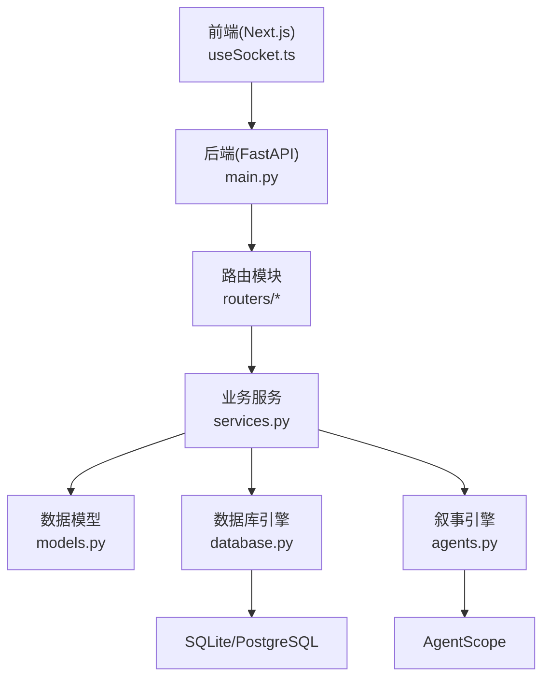
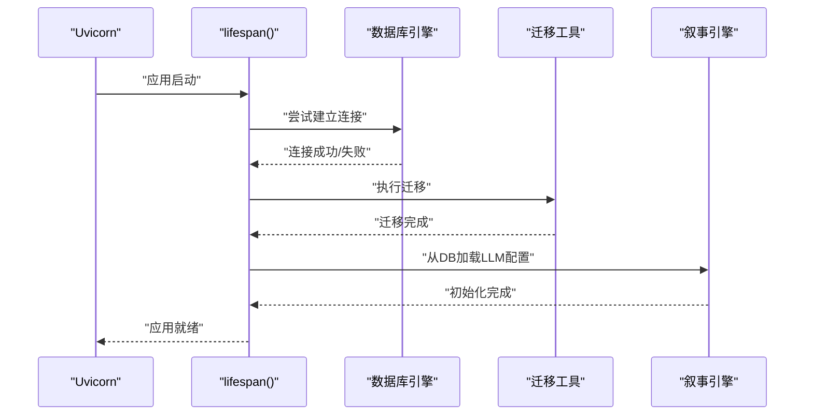
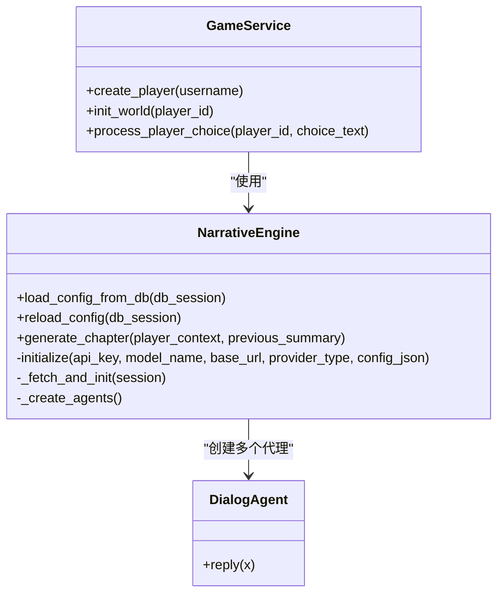
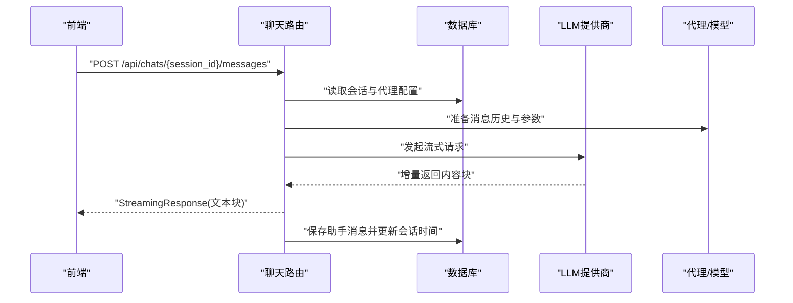
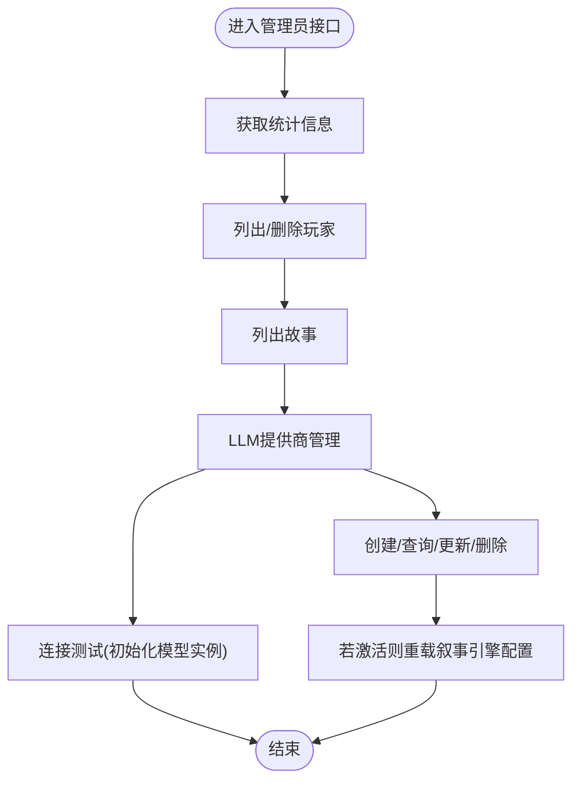
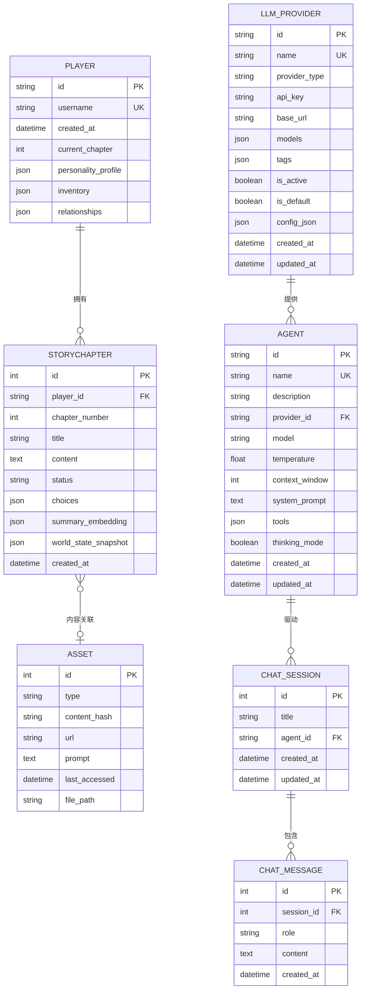
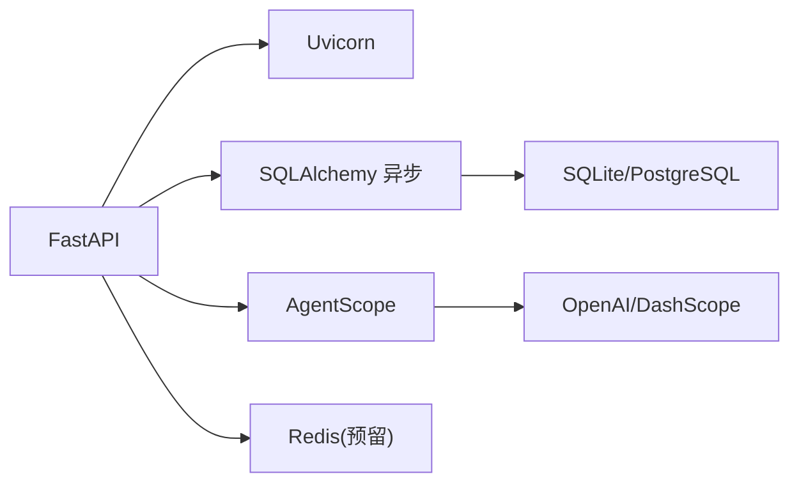

# 系统架构

<cite>
**本文引用的文件**
- [backend/main.py](file://backend/main.py)
- [backend/config.py](file://backend/config.py)
- [backend/database.py](file://backend/database.py)
- [backend/models.py](file://backend/models.py)
- [backend/schemas.py](file://backend/schemas.py)
- [backend/services.py](file://backend/services.py)
- [backend/routers/agents.py](file://backend/routers/agents.py)
- [backend/routers/chats.py](file://backend/routers/chats.py)
- [backend/routers/admin.py](file://backend/routers/admin.py)
- [backend/routers/llm_config.py](file://backend/routers/llm_config.py)
- [backend/agents.py](file://backend/agents.py)
- [backend/requirements.txt](file://backend/requirements.txt)
- [frontend/src/hooks/useSocket.ts](file://frontend/src/hooks/useSocket.ts)
- [frontend/src/app/layout.tsx](file://frontend/src/app/layout.tsx)
</cite>

## 目录
1. [引言](#引言)
2. [项目结构](#项目结构)
3. [核心组件](#核心组件)
4. [架构总览](#架构总览)
5. [详细组件分析](#详细组件分析)
6. [依赖关系分析](#依赖关系分析)
7. [性能考量](#性能考量)
8. [故障排查指南](#故障排查指南)
9. [结论](#结论)
10. [附录](#附录)

## 引言
本文件为“无限剧情游戏系统”的系统架构文档，面向后端FastAPI应用、前端Next.js客户端与后台管理系统的整体设计与实现进行深入解析。重点覆盖以下方面：
- 高层设计与架构模式：采用分层架构与模块化路由，结合异步数据库访问与事件驱动的实时通信。
- 系统边界与组件交互：明确后端API、多智能体叙事引擎、实时通信通道与多模态资产生成的职责边界与协作方式。
- 核心子系统技术实现：多智能体叙事引擎（基于AgentScope）、实时通信系统（WebSocket）、聊天与会话管理、LLM提供商配置与测试。
- 基础设施需求与可扩展性：数据库、缓存、外部模型服务与部署拓扑建议。
- 安全性、监控与灾难恢复：CORS策略、日志分级、错误处理与迁移机制。
- 技术栈与版本兼容性：Python后端与前端依赖清单与版本要求。

## 项目结构
系统采用前后端分离与模块化后端路由的组织方式：
- 后端（FastAPI）：统一入口、生命周期管理、数据库迁移、CORS配置、路由注册与WebSocket端点。
- 路由模块：按功能域拆分，包括管理员接口、智能体管理、聊天与会话、LLM提供商配置。
- 数据层：SQLAlchemy异步ORM模型与会话管理。
- 智能体与叙事引擎：基于AgentScope的多智能体对话代理与章节生成流程。
- 前端（Next.js）：React Hook封装WebSocket通信，页面布局与字体资源。

图表来源
- [backend/main.py](file://backend/main.py#L83-L98)
- [backend/routers/agents.py](file://backend/routers/agents.py#L9-L13)
- [backend/routers/chats.py](file://backend/routers/chats.py#L16-L20)
- [backend/routers/admin.py](file://backend/routers/admin.py#L10-L14)
- [backend/routers/llm_config.py](file://backend/routers/llm_config.py#L14-L18)
- [backend/services.py](file://backend/services.py#L8-L11)
- [backend/models.py](file://backend/models.py#L1-L4)
- [backend/database.py](file://backend/database.py#L1-L3)
- [backend/agents.py](file://backend/agents.py#L43-L196)
- [frontend/src/hooks/useSocket.ts](file://frontend/src/hooks/useSocket.ts#L3-L42)
- [frontend/src/app/layout.tsx](file://frontend/src/app/layout.tsx#L1-L35)

章节来源
- [backend/main.py](file://backend/main.py#L1-L173)
- [backend/routers/agents.py](file://backend/routers/agents.py#L1-L141)
- [backend/routers/chats.py](file://backend/routers/chats.py#L1-L275)
- [backend/routers/admin.py](file://backend/routers/admin.py#L1-L112)
- [backend/routers/llm_config.py](file://backend/routers/llm_config.py#L1-L203)
- [backend/services.py](file://backend/services.py#L1-L66)
- [backend/models.py](file://backend/models.py#L1-L122)
- [backend/database.py](file://backend/database.py#L1-L31)
- [backend/agents.py](file://backend/agents.py#L1-L196)
- [frontend/src/hooks/useSocket.ts](file://frontend/src/hooks/useSocket.ts#L1-L43)
- [frontend/src/app/layout.tsx](file://frontend/src/app/layout.tsx#L1-L35)

## 核心组件
- 应用入口与生命周期：负责日志初始化、数据库连接与迁移、CORS配置、路由注册与WebSocket端点。
- 业务服务：封装玩家创建、世界初始化、章节生成与一致性检查等业务流程。
- 数据模型与会话：定义玩家、章节、资产、LLM提供商、聊天会话与消息等实体及字段。
- 路由模块：提供管理员统计、玩家与故事管理；智能体的增删改查与查询；聊天会话与消息的创建、流式响应与删除；LLM提供商的增删改查与连接测试。
- 多智能体叙事引擎：基于AgentScope的对话代理与章节生成流水线，支持动态加载默认/活跃提供商。
- 实时通信：WebSocket端点用于与前端交互，当前示例中回显消息，后续可接入业务处理。
- 前端Hook：封装WebSocket连接、消息收发与状态管理。

章节来源
- [backend/main.py](file://backend/main.py#L45-L82)
- [backend/services.py](file://backend/services.py#L8-L66)
- [backend/models.py](file://backend/models.py#L9-L122)
- [backend/routers/admin.py](file://backend/routers/admin.py#L16-L31)
- [backend/routers/agents.py](file://backend/routers/agents.py#L15-L55)
- [backend/routers/chats.py](file://backend/routers/chats.py#L72-L258)
- [backend/routers/llm_config.py](file://backend/routers/llm_config.py#L20-L111)
- [backend/agents.py](file://backend/agents.py#L43-L196)
- [frontend/src/hooks/useSocket.ts](file://frontend/src/hooks/useSocket.ts#L3-L42)

## 架构总览
系统采用三层架构与模块化路由：
- 表现层：Next.js前端通过WebSocket与后端交互，展示实时消息与页面内容。
- 控制层：FastAPI路由处理HTTP请求与WebSocket连接，调用业务服务与数据访问层。
- 数据层：SQLAlchemy异步ORM访问SQLite或PostgreSQL，配合Alembic迁移工具维护Schema。

图表来源
- [backend/main.py](file://backend/main.py#L83-L98)
- [backend/routers/chats.py](file://backend/routers/chats.py#L72-L258)
- [backend/services.py](file://backend/services.py#L8-L11)
- [backend/models.py](file://backend/models.py#L1-L4)
- [backend/database.py](file://backend/database.py#L1-L3)
- [backend/agents.py](file://backend/agents.py#L43-L196)
- [frontend/src/hooks/useSocket.ts](file://frontend/src/hooks/useSocket.ts#L3-L42)

## 详细组件分析

### 后端应用入口与生命周期
- 生命周期管理：启动时执行数据库连接与迁移，失败重试多次；从数据库加载LLM配置以初始化叙事引擎。
- CORS配置：允许本地开发环境的前端域名访问。
- 路由注册：挂载管理员、智能体、聊天与LLM配置相关路由。
- WebSocket端点：接受客户端连接，接收文本消息并回显，便于演示实时通信。

图表来源
- [backend/main.py](file://backend/main.py#L45-L82)

章节来源
- [backend/main.py](file://backend/main.py#L45-L98)

### 业务服务与多智能体叙事引擎
- 业务服务：提供玩家创建、世界初始化（章节生成与预生成）、玩家选择处理等。
- 叙事引擎：基于AgentScope的多智能体代理（导演、叙述者、NPC管理者），负责章节大纲生成、正文生成与NPC关系更新；支持从数据库动态加载默认/活跃提供商。

图表来源
- [backend/services.py](file://backend/services.py#L8-L66)
- [backend/agents.py](file://backend/agents.py#L43-L196)

章节来源
- [backend/services.py](file://backend/services.py#L1-L66)
- [backend/agents.py](file://backend/agents.py#L1-L196)

### 聊天与会话管理（含流式响应）
- 会话与消息：创建会话、列出会话、获取会话详情与消息列表、删除会话；保存用户消息。
- 流式响应：根据会话历史与代理参数，调用不同提供商（OpenAI/Azure、DashScope等）的流式接口，逐块返回内容并统计Token用量；最后保存助手消息并更新会话时间戳。

图表来源
- [backend/routers/chats.py](file://backend/routers/chats.py#L72-L258)

章节来源
- [backend/routers/chats.py](file://backend/routers/chats.py#L1-L275)

### 管理员接口与LLM提供商配置
- 管理员统计：统计玩家、故事、资产与提供商数量。
- 玩家与故事管理：分页列出玩家与故事，删除玩家（需注意级联约束）。
- LLM提供商：创建、查询、更新、删除；支持连接测试（初始化AgentScope模型实例并发送测试消息）；设置默认提供商时自动取消其他默认标记并触发配置重载。

图表来源
- [backend/routers/admin.py](file://backend/routers/admin.py#L16-L112)
- [backend/routers/llm_config.py](file://backend/routers/llm_config.py#L20-L111)

章节来源
- [backend/routers/admin.py](file://backend/routers/admin.py#L1-L112)
- [backend/routers/llm_config.py](file://backend/routers/llm_config.py#L1-L203)

### 智能体管理
- 创建智能体：校验名称唯一性、验证提供商存在与模型可用性；保存新智能体。
- 查询与更新：支持分页搜索、名称唯一性校验、提供商与模型有效性检查；更新时同样校验。
- 删除：记录审计日志并删除对象。

章节来源
- [backend/routers/agents.py](file://backend/routers/agents.py#L1-L141)

### 数据模型与关系
- 实体关系：玩家与章节（一对多）、章节与资产（章节内容可关联资产）、智能体与提供商（多对一）、聊天会话与消息（一对多）。
- 字段设计：UUID主键、JSON字段存储动态配置、嵌入向量与快照用于一致性校验、时间戳用于排序与审计。

图表来源
- [backend/models.py](file://backend/models.py#L9-L122)

章节来源
- [backend/models.py](file://backend/models.py#L1-L122)

### 前端WebSocket集成
- Hook封装：建立WebSocket连接、监听消息、关闭清理；提供发送消息方法。
- 使用场景：与后端WebSocket端点对接，接收实时消息并渲染到UI。

章节来源
- [frontend/src/hooks/useSocket.ts](file://frontend/src/hooks/useSocket.ts#L1-L43)

## 依赖关系分析
- 后端依赖：FastAPI、Uvicorn、SQLAlchemy异步、Pydantic/Settings、AgentScope、OpenAI/DashScope等。
- 数据库：SQLite（默认）与PostgreSQL（可选），异步连接池与连接前探测。
- 外部模型服务：OpenAI/Azure、DashScope等，支持流式响应与Token统计。
- 缓存：Redis URL配置预留，当前未在代码中直接使用。

图表来源
- [backend/requirements.txt](file://backend/requirements.txt#L1-L20)
- [backend/config.py](file://backend/config.py#L18-L19)
- [backend/agents.py](file://backend/agents.py#L101-L125)

章节来源
- [backend/requirements.txt](file://backend/requirements.txt#L1-L20)
- [backend/config.py](file://backend/config.py#L1-L34)

## 性能考量
- 异步I/O：使用SQLAlchemy异步引擎与会话，降低阻塞风险。
- 连接池：合理配置连接池大小与溢出连接数，提升并发能力。
- 流式响应：聊天接口采用流式返回，改善用户体验与首字节延迟。
- 日志分级：关闭SQLAlchemy与Uvicorn访问日志噪声，仅保留应用日志，降低IO开销。
- 缓存与去重：资产表提供内容哈希与文件路径，可用于缓存与去重策略。

## 故障排查指南
- 数据库连接失败：启动阶段具备重试机制；检查数据库URL与凭据；确认Alembic迁移已执行。
- LLM提供商不可用：确认提供商处于激活状态且模型列表包含目标模型；通过连接测试接口验证。
- WebSocket异常：检查前端WebSocket地址与后端端口；查看后端WebSocket错误日志。
- Token统计缺失：部分提供商可能不返回usage字段，需在流式响应中判断并记录。

章节来源
- [backend/main.py](file://backend/main.py#L48-L74)
- [backend/routers/llm_config.py](file://backend/routers/llm_config.py#L20-L111)
- [backend/routers/chats.py](file://backend/routers/chats.py#L161-L179)

## 结论
该系统以FastAPI为核心，结合AgentScope多智能体叙事引擎与异步数据库访问，构建了可扩展的无限剧情游戏平台。通过模块化路由与清晰的数据模型，实现了玩家、章节、资产、智能体与聊天会话的完整闭环。WebSocket端点为实时交互提供基础，未来可进一步接入业务处理与多模态资产生成。建议在生产环境中完善鉴权、限流、监控与备份策略，并评估引入Redis缓存与分布式任务队列以提升吞吐与可靠性。

## 附录
- 技术栈与版本兼容性：参考后端依赖清单，确保Python版本与依赖版本满足要求。
- 基础设施建议：本地开发可使用SQLite，生产推荐PostgreSQL；结合Redis作为缓存；按需引入消息队列与对象存储。
- 部署拓扑：单机部署（Nginx反向代理 + Uvicorn + 数据库 + 缓存）；水平扩展可通过容器编排与读写分离实现。

章节来源
- [backend/requirements.txt](file://backend/requirements.txt#L1-L20)
- [backend/config.py](file://backend/config.py#L1-L34)