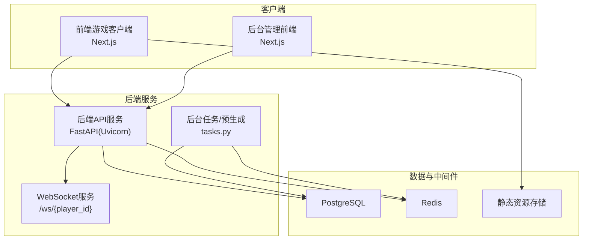
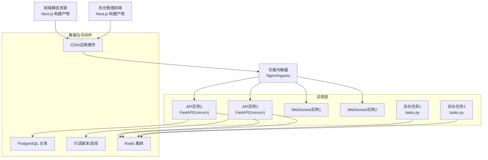
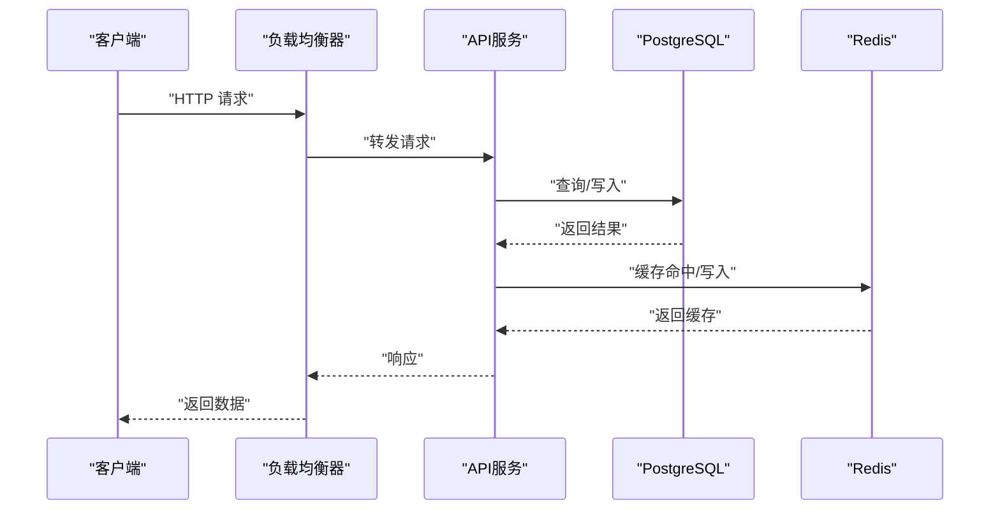
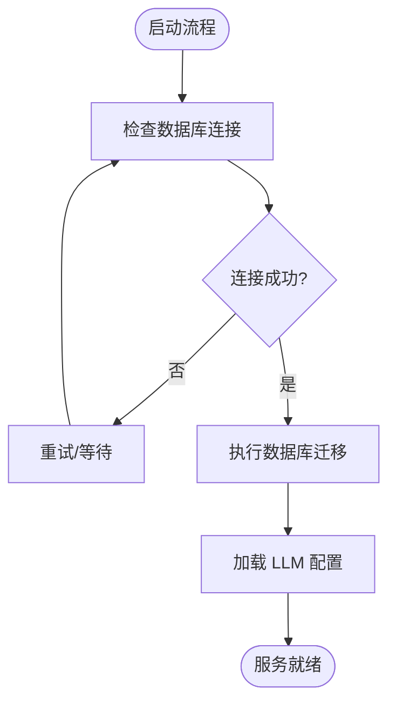
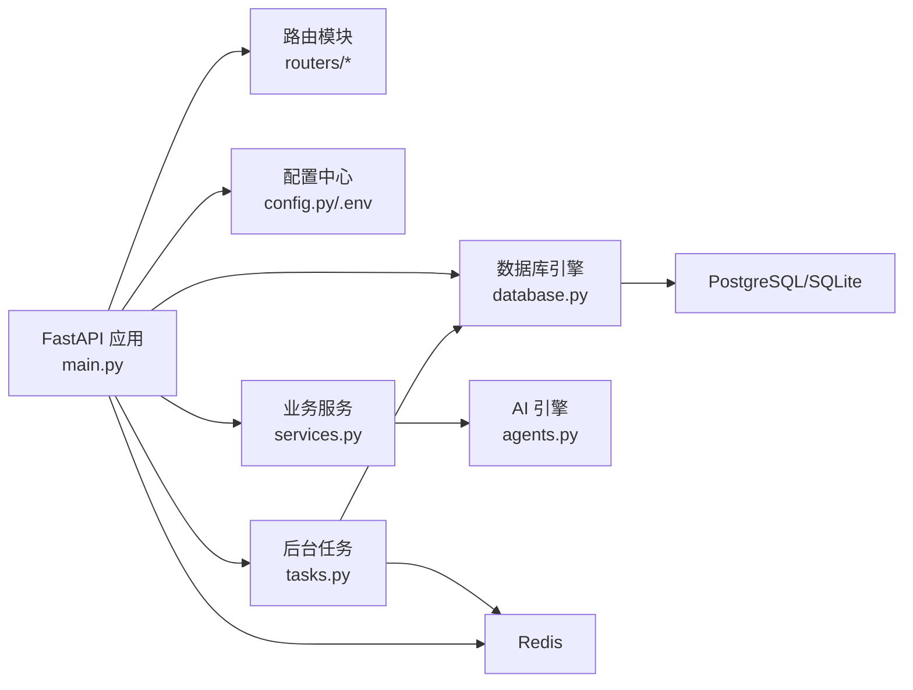

# 部署拓扑

<cite>
**本文引用的文件**
- [README.md](file://README.md)
- [Deployment.md](file://docs/wiki/Deployment.md)
- [main.py](file://backend/main.py)
- [requirements.txt](file://backend/requirements.txt)
- [.env.example](file://backend/.env.example)
- [config.py](file://backend/config.py)
- [database.py](file://backend/database.py)
- [models.py](file://backend/models.py)
- [services.py](file://backend/services.py)
- [tasks.py](file://backend/tasks.py)
- [routers/admin.py](file://backend/routers/admin.py)
- [routers/agents.py](file://backend/routers/agents.py)
- [next.config.ts](file://frontend/next.config.ts)
</cite>

## 目录
1. [简介](#简介)
2. [项目结构](#项目结构)
3. [核心组件](#核心组件)
4. [架构总览](#架构总览)
5. [详细组件分析](#详细组件分析)
6. [依赖关系分析](#依赖关系分析)
7. [性能考虑](#性能考虑)
8. [故障排查指南](#故障排查指南)
9. [结论](#结论)
10. [附录](#附录)

## 简介
本文件面向无限剧情游戏系统的生产环境部署，围绕容器化、负载均衡、服务发现、微服务拆分、数据库与缓存、消息队列、CDN 与边缘优化、监控与日志、高可用与灾备、安全与 CI/CD 流水线进行系统化说明。目标是帮助运维与开发团队在生产环境中稳定、可扩展地交付该系统。

## 项目结构
系统采用前后端分离与后台管理独立部署的微服务架构：
- 后端 API 服务：基于 FastAPI，提供游戏核心接口、聊天与剧情生成、管理员接口等。
- 前端游戏客户端：基于 Next.js，负责游戏画面与交互。
- 后台管理服务：基于 Next.js，提供可视化管理界面。
- 数据层：PostgreSQL 存储结构化数据；Redis 用于缓存与消息队列；SQLite 作为本地开发回退。
- AI 与多智能体：AgentScope 驱动的叙事引擎，结合多种 LLM 提供商。

图表来源
- [main.py](file://backend/main.py#L128-L173)
- [database.py](file://backend/database.py#L1-L31)
- [config.py](file://backend/config.py#L1-L34)
- [routers/admin.py](file://backend/routers/admin.py#L1-L112)
- [routers/agents.py](file://backend/routers/agents.py#L1-L141)
- [services.py](file://backend/services.py#L1-L66)
- [tasks.py](file://backend/tasks.py#L1-L62)

章节来源
- [README.md](file://README.md#L34-L51)
- [Deployment.md](file://docs/wiki/Deployment.md#L1-L65)

## 核心组件
- 后端 API 服务
  - 使用 FastAPI 构建，注册路由模块（管理员、智能体、聊天、LLM 配置），提供 REST 接口与 WebSocket。
  - 生命周期内自动执行数据库迁移，初始化叙事引擎配置。
- 前端游戏客户端
  - Next.js 16，使用 App Router，提供游戏画布与交互。
- 后台管理服务
  - Next.js 16，提供统计、玩家、故事、资产与 LLM 提供商管理接口。
- 数据与缓存
  - PostgreSQL 作为主数据库；SQLite 作为本地开发回退；Redis 用于缓存与消息队列。
- AI 与多智能体
  - 基于 AgentScope 的叙事引擎，支持动态 LLM 提供商切换与配置。

章节来源
- [main.py](file://backend/main.py#L45-L82)
- [requirements.txt](file://backend/requirements.txt#L1-L20)
- [config.py](file://backend/config.py#L7-L34)
- [database.py](file://backend/database.py#L1-L31)
- [models.py](file://backend/models.py#L1-L122)
- [services.py](file://backend/services.py#L1-L66)
- [tasks.py](file://backend/tasks.py#L1-L62)
- [routers/admin.py](file://backend/routers/admin.py#L1-L112)
- [routers/agents.py](file://backend/routers/agents.py#L1-L141)

## 架构总览
生产环境建议采用容器化与云原生部署，结合负载均衡、服务发现与多副本高可用。下图展示生产级部署拓扑与流量路径。

图表来源
- [main.py](file://backend/main.py#L128-L173)
- [database.py](file://backend/database.py#L1-L31)
- [config.py](file://backend/config.py#L11-L19)
- [routers/admin.py](file://backend/routers/admin.py#L1-L112)
- [routers/agents.py](file://backend/routers/agents.py#L1-L141)
- [services.py](file://backend/services.py#L1-L66)
- [tasks.py](file://backend/tasks.py#L1-L62)

## 详细组件分析

### 后端 API 服务（FastAPI）
- 组件职责
  - 提供 REST 接口：管理员统计、玩家与故事查询、智能体 CRUD、LLM 配置等。
  - WebSocket：实时剧情推送与交互。
  - 生命周期：启动时执行数据库迁移，加载 LLM 配置。
- 部署要点
  - 多副本部署，结合健康检查与就绪探针。
  - 使用反向代理（Nginx/Ingress）统一入口，开启 gzip/HTTP/2。
  - CORS 白名单限制，仅允许前端与后台域名访问。
- 性能与可靠性
  - 异步数据库连接池配置，合理设置 pool_size 与溢出连接数。
  - WebSocket 长连接按需扩容，配合水平扩展与会话亲和。

图表来源
- [main.py](file://backend/main.py#L83-L98)
- [database.py](file://backend/database.py#L8-L23)
- [routers/admin.py](file://backend/routers/admin.py#L16-L31)
- [routers/agents.py](file://backend/routers/agents.py#L15-L55)

章节来源
- [main.py](file://backend/main.py#L45-L82)
- [main.py](file://backend/main.py#L83-L98)
- [main.py](file://backend/main.py#L128-L173)
- [database.py](file://backend/database.py#L1-L31)
- [routers/admin.py](file://backend/routers/admin.py#L1-L112)
- [routers/agents.py](file://backend/routers/agents.py#L1-L141)

### 前端静态资源服务（Next.js）
- 组件职责
  - 游戏客户端与后台管理前端的构建产物托管与分发。
- 部署要点
  - 使用 Nginx 或 Ingress 提供静态文件服务，开启压缩与缓存头。
  - 通过 CDN/边缘节点就近分发，降低延迟。
  - 构建产物版本化与缓存失效策略。

章节来源
- [next.config.ts](file://frontend/next.config.ts#L1-L8)

### 后台管理服务（Next.js Admin）
- 组件职责
  - 提供系统监控、玩家管理、LLM 提供商配置等管理能力。
- 部署要点
  - 与后端 API 通过受控网络访问，启用鉴权与审计日志。
  - 与前端静态资源同源或跨域白名单管理。

章节来源
- [routers/admin.py](file://backend/routers/admin.py#L1-L112)

### 数据库集群与缓存层
- 数据库
  - 生产建议使用 PostgreSQL 主从/高可用集群，读写分离，只读副本承载查询。
  - 本地开发可回退到 SQLite，避免对生产环境的影响。
- 缓存与消息队列
  - Redis 集群用于会话、限流、分布式锁与消息队列。
  - 任务队列建议使用 Redis Streams 或专用消息中间件（如 RabbitMQ/Redis Streams）。

图表来源
- [main.py](file://backend/main.py#L45-L82)
- [config.py](file://backend/config.py#L11-L16)
- [database.py](file://backend/database.py#L8-L23)

章节来源
- [config.py](file://backend/config.py#L1-L34)
- [database.py](file://backend/database.py#L1-L31)
- [main.py](file://backend/main.py#L45-L82)

### 消息队列与后台任务
- 任务类型
  - 剧情章节预生成、资产生成（图片/音频）等异步任务。
- 部署策略
  - 使用 Redis Streams 或专用队列服务，多实例消费者水平扩展。
  - 任务幂等与重试策略，失败队列与死信处理。

章节来源
- [tasks.py](file://backend/tasks.py#L1-L62)

### 微服务拆分与独立部署
- 后端 API 服务：独立容器，暴露 REST 与 WebSocket。
- 前端静态资源服务：独立容器/NAS/CDN。
- 后台管理服务：独立容器，与后端通过受控网络访问。
- 数据与中间件：数据库与 Redis 集群独立运维。

章节来源
- [README.md](file://README.md#L30-L33)
- [main.py](file://backend/main.py#L128-L173)

### 负载均衡与服务发现
- 负载均衡
  - 使用 Nginx/Ingress/Traefik/云厂商 ALB，支持健康检查与会话保持。
- 服务发现
  - Kubernetes：Service + Headless Service；云厂商：ELB/ALB + DNS。
- 网络策略
  - 仅开放必要端口，内部网络隔离，启用 mTLS（可选）。

章节来源
- [main.py](file://backend/main.py#L83-L91)

### CDN 与边缘优化
- 静态资源
  - 构建产物缓存与版本化，长缓存策略。
  - CDN 边缘节点就近分发，支持压缩与 HTTPS。
- 动态内容
  - 对热点数据进行边缘缓存（如配置、模板），降低后端压力。

章节来源
- [next.config.ts](file://frontend/next.config.ts#L1-L8)

## 依赖关系分析
后端服务的关键依赖与耦合关系如下：

图表来源
- [main.py](file://backend/main.py#L30-L42)
- [database.py](file://backend/database.py#L1-L31)
- [config.py](file://backend/config.py#L1-L34)
- [services.py](file://backend/services.py#L1-L66)
- [tasks.py](file://backend/tasks.py#L1-L62)

章节来源
- [requirements.txt](file://backend/requirements.txt#L1-L20)
- [models.py](file://backend/models.py#L1-L122)

## 性能考虑
- 数据库
  - 连接池参数调优：pool_size、max_overflow、pre_ping。
  - 读写分离与只读副本，热点表分区与索引优化。
- 缓存
  - 合理设置 TTL，热点数据双写缓存，缓存穿透与击穿防护。
- WebSocket
  - 水平扩展与会话亲和，避免单点拥塞。
- 静态资源
  - CDN 分发、Gzip/Brotli 压缩、HTTP/2 多路复用。
- 任务队列
  - 并发度与重试策略，失败队列与死信处理。

章节来源
- [database.py](file://backend/database.py#L8-L23)
- [config.py](file://backend/config.py#L11-L19)

## 故障排查指南
- 启动阶段
  - 数据库连接失败：检查 DATABASE_URL 与网络连通性。
  - 迁移失败：查看迁移日志，确认 Alembic 版本与权限。
- 运行阶段
  - WebSocket 断开：检查后端日志与端口占用，确认负载均衡健康检查。
  - LLM 配置错误：核对 OPENAI_API_KEY、CLAUDE_API_KEY、GEMINI_API_KEY。
- 常见问题
  - CORS 报错：确认白名单包含前端与后台域名。
  - Redis 连接异常：检查集群状态与网络策略。

章节来源
- [Deployment.md](file://docs/wiki/Deployment.md#L60-L65)
- [.env.example](file://backend/.env.example#L1-L4)
- [main.py](file://backend/main.py#L83-L91)

## 结论
通过容器化与云原生架构，结合负载均衡、服务发现、数据库与缓存集群、消息队列与 CDN 边缘优化，无限剧情游戏系统可在生产环境实现高可用、可扩展与低延迟的用户体验。建议以微服务形式独立部署前端静态资源、后端 API 与后台管理服务，并配套完善的监控、日志与安全体系。

## 附录

### 监控与日志
- 指标采集
  - 应用：请求量、响应时间、错误率、并发连接数、数据库连接池使用率。
  - 基础设施：CPU、内存、磁盘、网络、Redis/PG 连接数。
- 日志
  - 结构化日志（JSON），区分应用日志与访问日志，集中采集与检索。
- 告警
  - 基于阈值与趋势的告警策略，分级处理与通知。

### 安全防护
- 网络
  - 内外网隔离、最小权限网络策略、WAF/DDoS 防护。
- 认证与授权
  - API 访问令牌、CORS 白名单、后台登录保护。
- 数据
  - 敏感字段加密、传输加密、备份与脱敏。

### CI/CD 与滚动更新
- 流水线
  - 代码检出 → 单元测试 → 构建镜像 → 安全扫描 → 发布制品 → 部署。
- 自动化测试
  - 单测、集成测试、端到端测试（可选）。
- 滚动更新
  - 蓝绿/金丝雀发布，配合健康检查与回滚策略。