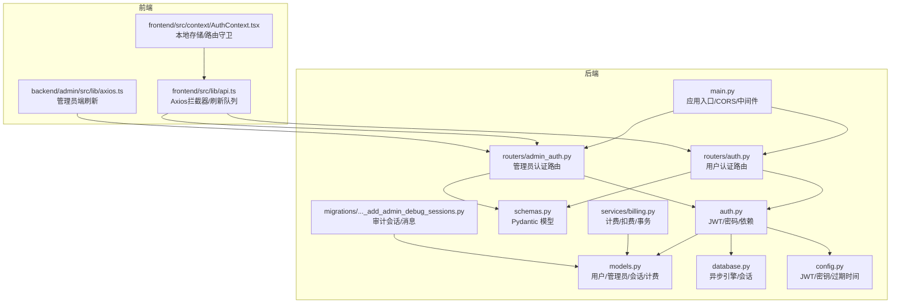
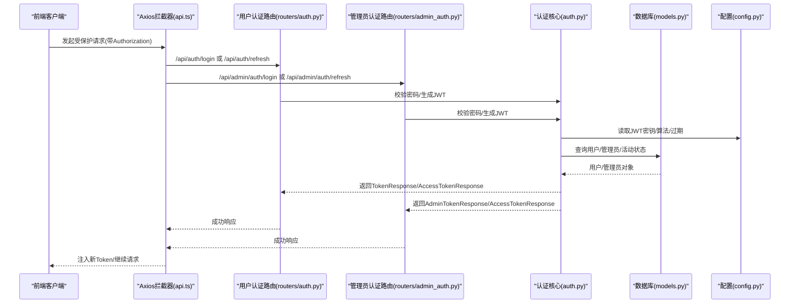
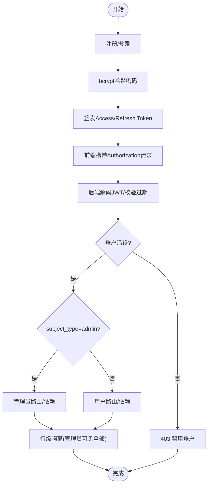
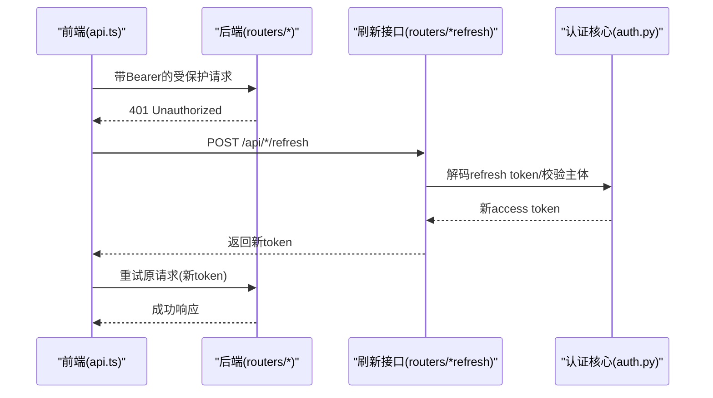
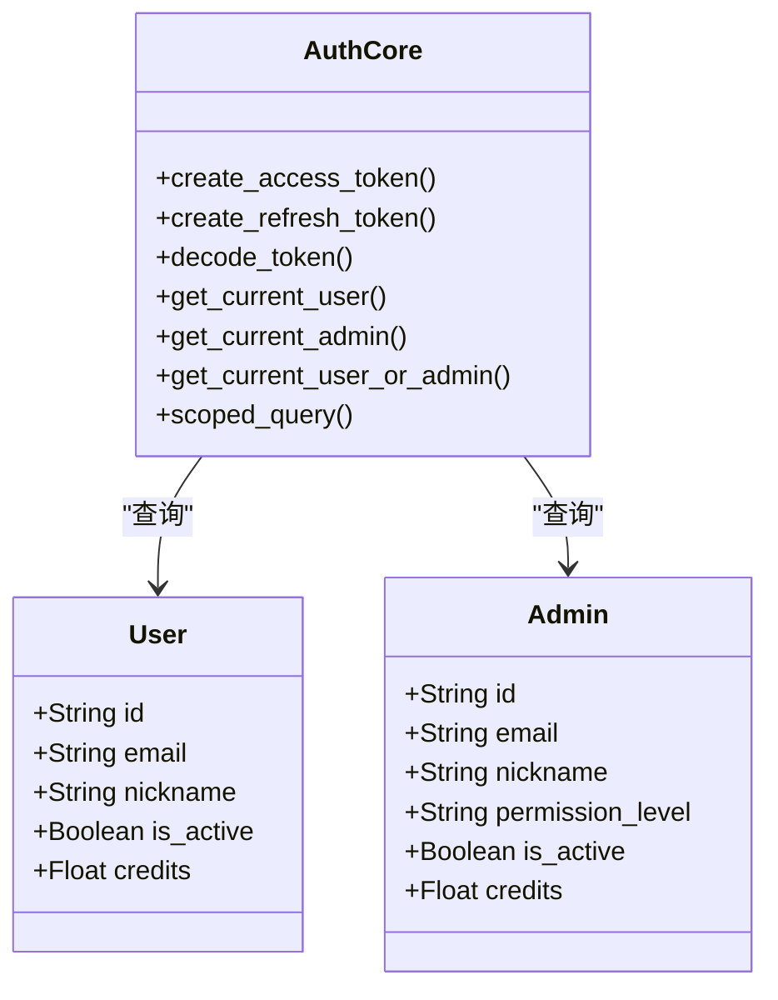
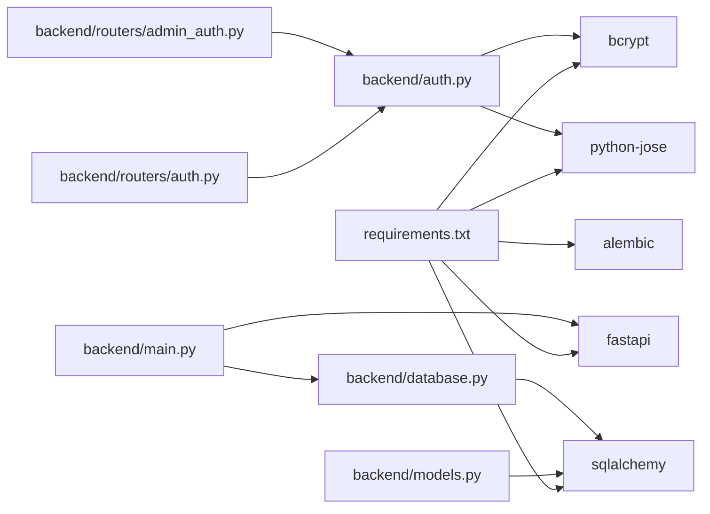

# 安全架构

<cite>
**本文引用的文件**
- [backend/main.py](file://backend/main.py)
- [backend/auth.py](file://backend/auth.py)
- [backend/routers/auth.py](file://backend/routers/auth.py)
- [backend/routers/admin_auth.py](file://backend/routers/admin_auth.py)
- [backend/config.py](file://backend/config.py)
- [backend/models.py](file://backend/models.py)
- [backend/database.py](file://backend/database.py)
- [backend/schemas.py](file://backend/schemas.py)
- [backend/requirements.txt](file://backend/requirements.txt)
- [frontend/src/lib/api.ts](file://frontend/src/lib/api.ts)
- [frontend/src/context/AuthContext.tsx](file://frontend/src/context/AuthContext.tsx)
- [backend/admin/src/lib/axios.ts](file://backend/admin/src/lib/axios.ts)
- [backend/services/billing.py](file://backend/services/billing.py)
- [backend/migrations/versions/4d66cc052bfb_add_admin_debug_sessions.py](file://backend/migrations/versions/4d66cc052bfb_add_admin_debug_sessions.py)
</cite>

## 目录
1. [简介](#简介)
2. [项目结构](#项目结构)
3. [核心组件](#核心组件)
4. [架构总览](#架构总览)
5. [详细组件分析](#详细组件分析)
6. [依赖关系分析](#依赖关系分析)
7. [性能考虑](#性能考虑)
8. [故障排查指南](#故障排查指南)
9. [结论](#结论)
10. [附录](#附录)

## 简介
本文件系统性梳理 Infinite Game 的安全架构，围绕基于 JWT 的认证授权体系、权限控制模型、跨域与传输安全、数据与 API 安全、审计与监控等方面进行深入解析，并给出最佳实践与常见漏洞的防范建议。文档同时兼顾技术深度与可读性，帮助开发者与运维人员快速理解与落地安全策略。

## 项目结构
后端采用 FastAPI + SQLAlchemy Async 架构，前端使用 Next.js。安全相关的关键位置包括：
- 后端入口与中间件：CORS、调试认证中间件
- 认证与授权：用户与管理员双轨 JWT 流程
- 数据模型与会话隔离：用户/管理员表分离与行级隔离
- 前端拦截器：自动刷新与统一鉴权头注入
- 计费与审计：余额冻结、不足提醒、交易记录与调试会话

**图表来源**
- [backend/main.py:110-152](file://backend/main.py#L110-L152)
- [backend/routers/auth.py:30-136](file://backend/routers/auth.py#L30-L136)
- [backend/routers/admin_auth.py:29-136](file://backend/routers/admin_auth.py#L29-L136)
- [backend/auth.py:14-229](file://backend/auth.py#L14-L229)
- [backend/models.py:10-447](file://backend/models.py#L10-L447)
- [backend/database.py:6-31](file://backend/database.py#L6-L31)
- [backend/config.py:7-42](file://backend/config.py#L7-L42)
- [backend/schemas.py:13-111](file://backend/schemas.py#L13-L111)
- [backend/services/billing.py:258-304](file://backend/services/billing.py#L258-L304)
- [backend/migrations/versions/4d66cc052bfb_add_admin_debug_sessions.py:21-52](file://backend/migrations/versions/4d66cc052bfb_add_admin_debug_sessions.py#L21-L52)
- [frontend/src/lib/api.ts:3-84](file://frontend/src/lib/api.ts#L3-L84)
- [frontend/src/context/AuthContext.tsx:1-110](file://frontend/src/context/AuthContext.tsx#L1-L110)
- [backend/admin/src/lib/axios.ts:52-104](file://backend/admin/src/lib/axios.ts#L52-L104)

**章节来源**
- [backend/main.py:110-152](file://backend/main.py#L110-L152)
- [frontend/src/lib/api.ts:3-84](file://frontend/src/lib/api.ts#L3-L84)
- [frontend/src/context/AuthContext.tsx:1-110](file://frontend/src/context/AuthContext.tsx#L1-L110)

## 核心组件
- 应用入口与中间件
  - CORS 策略：允许本地开发源，支持凭据与通配方法/头
  - 调试中间件：记录请求方法、Origin、Authorization 头，便于排障
- 认证与授权
  - 用户认证：注册、登录、刷新、当前用户信息
  - 管理员认证：独立管理员表，独立登录/刷新/信息接口
  - 通用依赖：支持用户/管理员二选一的依赖，配合行级隔离
- 数据模型与会话
  - 用户/管理员表分离，管理员具备独立权限字段
  - 行级隔离：普通用户仅可见自身数据，管理员可见全部
- 前端拦截器
  - 请求头自动附加 Bearer Token
  - 401 时串行刷新队列，避免并发重复刷新
- 计费与审计
  - 余额冻结与不足校验
  - 交易记录与余额变更
  - 管理员调试会话与消息，隔离审计通道

**章节来源**
- [backend/main.py:115-136](file://backend/main.py#L115-L136)
- [backend/routers/auth.py:36-136](file://backend/routers/auth.py#L36-L136)
- [backend/routers/admin_auth.py:36-136](file://backend/routers/admin_auth.py#L36-L136)
- [backend/auth.py:83-229](file://backend/auth.py#L83-L229)
- [backend/models.py:10-73](file://backend/models.py#L10-L73)
- [frontend/src/lib/api.ts:19-81](file://frontend/src/lib/api.ts#L19-L81)
- [backend/services/billing.py:258-304](file://backend/services/billing.py#L258-L304)
- [backend/migrations/versions/4d66cc052bfb_add_admin_debug_sessions.py:21-52](file://backend/migrations/versions/4d66cc052bfb_add_admin_debug_sessions.py#L21-L52)

## 架构总览
下图展示了用户与管理员的认证授权流，以及前端拦截器与后端依赖如何协同工作。

**图表来源**
- [frontend/src/lib/api.ts:8-17](file://frontend/src/lib/api.ts#L8-L17)
- [backend/routers/auth.py:63-136](file://backend/routers/auth.py#L63-L136)
- [backend/routers/admin_auth.py:36-136](file://backend/routers/admin_auth.py#L36-L136)
- [backend/auth.py:19-75](file://backend/auth.py#L19-L75)
- [backend/config.py:26-30](file://backend/config.py#L26-L30)
- [backend/models.py:10-73](file://backend/models.py#L10-L73)

## 详细组件分析

### 认证授权体系（JWT）
- 密码与令牌
  - 密码使用 bcrypt，盐轮数固定；令牌使用 HS256，密钥与算法通过配置管理
  - 访问令牌含 exp、type=access、subject_type（user/admin），刷新令牌含 type=refresh
- 用户认证流程
  - 注册：邮箱唯一性校验，密码哈希入库
  - 登录：邮箱查找用户，校验密码与活跃状态，更新登录元数据，签发 access/refresh
  - 刷新：校验 refresh token 类型与主体，确认用户活跃，签发新的 access token
  - 当前用户：依赖 OAuth2PasswordBearer，解码 JWT 并查询用户
- 管理员认证流程
  - 独立管理员表，登录/刷新/当前信息均走独立路由与依赖
  - 令牌 payload 中 subject_type 为 admin，确保路由与依赖正确识别
- 通用依赖
  - 支持用户或管理员二选一的依赖，依据 subject_type 决定查询 User/Admin
  - 提供行级隔离辅助函数，避免越权访问

**图表来源**
- [backend/auth.py:19-75](file://backend/auth.py#L19-L75)
- [backend/routers/auth.py:36-136](file://backend/routers/auth.py#L36-L136)
- [backend/routers/admin_auth.py:36-136](file://backend/routers/admin_auth.py#L36-L136)
- [backend/auth.py:162-229](file://backend/auth.py#L162-L229)

**章节来源**
- [backend/auth.py:19-75](file://backend/auth.py#L19-L75)
- [backend/routers/auth.py:36-136](file://backend/routers/auth.py#L36-L136)
- [backend/routers/admin_auth.py:36-136](file://backend/routers/admin_auth.py#L36-L136)
- [backend/auth.py:83-229](file://backend/auth.py#L83-L229)

### 会话管理与令牌刷新策略
- 前端拦截器
  - 请求阶段：从本地存储读取 access_token 注入 Authorization
  - 响应阶段：401 且非认证路由时，进入刷新流程；并发请求排队，避免重复刷新
  - 刷新成功：更新本地 access_token 并重试原请求
  - 刷新失败：清空本地存储并跳转登录页
- 管理端拦截器
  - 与用户端类似，但调用管理员刷新接口，跳转管理员登录页
- 后端依赖
  - FastAPI OAuth2PasswordBearer 作为默认依赖，确保路由层统一校验

**图表来源**
- [frontend/src/lib/api.ts:19-81](file://frontend/src/lib/api.ts#L19-L81)
- [backend/routers/auth.py:102-136](file://backend/routers/auth.py#L102-L136)
- [backend/routers/admin_auth.py:93-136](file://backend/routers/admin_auth.py#L93-L136)
- [backend/auth.py:65-75](file://backend/auth.py#L65-L75)

**章节来源**
- [frontend/src/lib/api.ts:19-81](file://frontend/src/lib/api.ts#L19-L81)
- [backend/admin/src/lib/axios.ts:52-104](file://backend/admin/src/lib/axios.ts#L52-L104)
- [backend/routers/auth.py:102-136](file://backend/routers/auth.py#L102-L136)
- [backend/routers/admin_auth.py:93-136](file://backend/routers/admin_auth.py#L93-L136)
- [backend/auth.py:65-75](file://backend/auth.py#L65-L75)

### 权限控制模型（RBAC 与资源访问控制）
- 角色与主体
  - 用户：subject_type=user，角色字段保留兼容
  - 管理员：subject_type=admin，具备权限等级字段
- 路由与依赖
  - get_current_user/get_current_active_user：校验 access token 并确保账户活跃
  - get_current_admin/get_current_active_admin：校验管理员 access token
  - get_current_user_or_admin：根据 subject_type 决定查询 User/Admin
- 行级隔离
  - scoped_query：若主体为管理员则不过滤，否则按 user_id 限制可见范围
- 管理员专用路由
  - 管理员登录/刷新/信息接口独立，避免与用户混淆

**图表来源**
- [backend/models.py:10-73](file://backend/models.py#L10-L73)
- [backend/auth.py:83-229](file://backend/auth.py#L83-L229)

**章节来源**
- [backend/auth.py:119-229](file://backend/auth.py#L119-L229)
- [backend/models.py:10-73](file://backend/models.py#L10-L73)

### 跨域安全配置（CORS、CSRF、XSS）
- CORS
  - 允许本地开发源，支持凭据、通配方法与头
  - 建议生产环境限定具体域名，避免通配符
- CSRF
  - 本项目未见显式 CSRF Token 策略；建议在前端表单提交时引入 SameSite Cookie 与 CSRF Token
- XSS
  - 服务端未对输出内容进行额外转义；建议在渲染层统一进行 HTML/JS 转义，避免直接拼接用户输入
  - 前端侧避免 innerHTML 直接使用不可信数据

**章节来源**
- [backend/main.py:130-136](file://backend/main.py#L130-L136)

### 数据安全保护（密码加密、敏感数据脱敏、传输加密）
- 密码加密
  - bcrypt 哈希，固定轮数；建议定期轮换密钥与升级算法
- 敏感数据脱敏
  - 管理员表中的 API Key 字段当前明文存储，建议加密存储与密钥管理
- 传输加密
  - 建议生产环境强制 HTTPS，TLS 1.2+/1.3；后端未见强制 HTTPS 策略

**章节来源**
- [backend/auth.py:19-24](file://backend/auth.py#L19-L24)
- [backend/models.py:153](file://backend/models.py#L153)

### API 安全防护（频率限制、输入验证、错误信息过滤）
- 输入验证
  - Pydantic 模型提供强类型与字段约束，如邮箱、长度、枚举等
- 错误信息过滤
  - 统一返回 401/403/404 状态码，避免泄露内部细节
- 频率限制
  - 代码中未见速率限制实现；建议在网关或中间件层引入限流策略

**章节来源**
- [backend/schemas.py:13-111](file://backend/schemas.py#L13-L111)
- [backend/routers/auth.py:72-83](file://backend/routers/auth.py#L72-L83)
- [backend/routers/admin_auth.py:50-71](file://backend/routers/admin_auth.py#L50-L71)

### 安全审计与异常监控
- 审计会话
  - 新增管理员调试会话与消息表，支持与普通用户会话隔离
- 异常监控
  - 后端日志配置精细，SQLAlchemy 与 Uvicorn 访问日志分级
  - 建议接入集中化日志与告警平台

**章节来源**
- [backend/migrations/versions/4d66cc052bfb_add_admin_debug_sessions.py:21-52](file://backend/migrations/versions/4d66cc052bfb_add_admin_debug_sessions.py#L21-L52)
- [backend/main.py:15-30](file://backend/main.py#L15-L30)

## 依赖关系分析
- 外部依赖
  - bcrypt、python-jose：密码与 JWT
  - SQLAlchemy Async、Alembic：异步 ORM 与迁移
  - FastAPI、Uvicorn：Web 框架与 ASGI 服务器
- 内部模块耦合
  - auth.py 与 routers/* 通过依赖注入与 Pydantic 模型解耦
  - database.py 与 models.py 通过 Base 与 AsyncSession 解耦

**图表来源**
- [backend/requirements.txt:1-28](file://backend/requirements.txt#L1-L28)
- [backend/auth.py:4-8](file://backend/auth.py#L4-L8)
- [backend/routers/auth.py:8-26](file://backend/routers/auth.py#L8-L26)
- [backend/routers/admin_auth.py:18-25](file://backend/routers/admin_auth.py#L18-L25)
- [backend/database.py:1-3](file://backend/database.py#L1-L3)
- [backend/models.py:2-4](file://backend/models.py#L2-L4)
- [backend/main.py:32-44](file://backend/main.py#L32-L44)

**章节来源**
- [backend/requirements.txt:1-28](file://backend/requirements.txt#L1-L28)
- [backend/auth.py:4-8](file://backend/auth.py#L4-L8)
- [backend/routers/auth.py:8-26](file://backend/routers/auth.py#L8-L26)
- [backend/routers/admin_auth.py:18-25](file://backend/routers/admin_auth.py#L18-L25)
- [backend/database.py:1-3](file://backend/database.py#L1-L3)
- [backend/models.py:2-4](file://backend/models.py#L2-L4)
- [backend/main.py:32-44](file://backend/main.py#L32-L44)

## 性能考虑
- 连接池与重连
  - 异步引擎启用 pool_pre_ping，SQLite 下关闭线程校验
- 日志级别
  - 关闭 SQLAlchemy 与 Uvicorn 访问日志，降低 IO 压力
- 建议
  - 生产环境开启连接池监控与超时配置
  - 对高频端点引入缓存与限流

**章节来源**
- [backend/database.py:8-23](file://backend/database.py#L8-L23)
- [backend/main.py:22-27](file://backend/main.py#L22-L27)

## 故障排查指南
- 401 未授权
  - 检查前端是否正确注入 Authorization 头
  - 校验 access_token 是否过期或被篡改
  - 确认后端 decode_token 是否抛出异常
- 刷新失败
  - 检查 refresh_token 类型与主体是否匹配
  - 确认用户/管理员仍处于活跃状态
- 账户被禁用
  - get_current_active_user/get_current_active_admin 会拒绝非活跃账户
- CORS 问题
  - 确认请求 Origin 是否在 allow_origins 列表
- 余额不足/冻结
  - billing 服务会抛出相应异常，需在前端友好提示

**章节来源**
- [frontend/src/lib/api.ts:31-81](file://frontend/src/lib/api.ts#L31-L81)
- [backend/auth.py:94-113](file://backend/auth.py#L94-L113)
- [backend/routers/auth.py:110-124](file://backend/routers/auth.py#L110-L124)
- [backend/routers/admin_auth.py:106-121](file://backend/routers/admin_auth.py#L106-L121)
- [backend/main.py:130-136](file://backend/main.py#L130-L136)
- [backend/services/billing.py:258-304](file://backend/services/billing.py#L258-L304)

## 结论
Infinite Game 的安全架构以 JWT 为核心，结合用户/管理员双轨认证、行级隔离与前端拦截器刷新机制，形成了较为完整的认证授权闭环。建议在生产环境中补充 CSRF 防护、XSS 转义、HTTPS 强制、速率限制与密钥管理，并完善审计与监控体系，以进一步提升整体安全性与可观测性。

## 附录
- 最佳实践清单
  - 强制 HTTPS 与 TLS 1.2+/1.3
  - 严格 CORS 白名单，避免通配符
  - CSRF Token 与 SameSite Cookie
  - XSS 转义与内容安全策略（CSP）
  - 密钥轮换与 API Key 加密存储
  - 速率限制与熔断降级
  - 审计日志与异常监控告警
- 常见漏洞与对策
  - 令牌泄露：缩短过期时间、启用刷新令牌、严格 CORS
  - 账户劫持：绑定 IP/设备指纹、二次验证
  - 业务滥用：基于用户/管理员维度的速率限制与限额
  - 数据泄露：最小化暴露字段、敏感字段加密