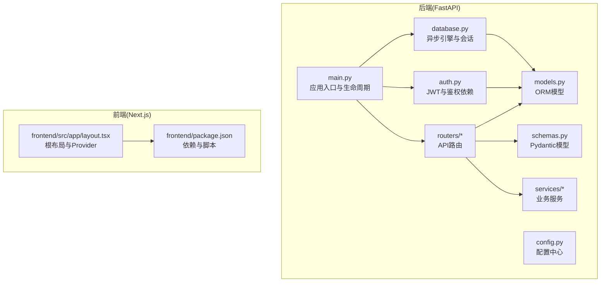
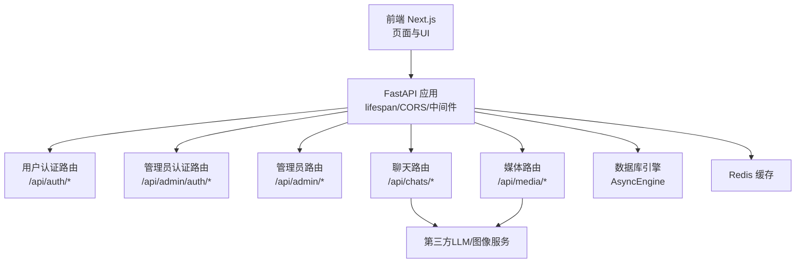
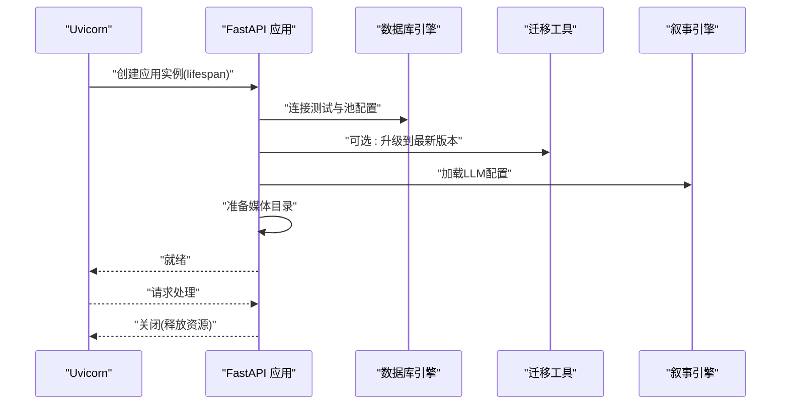
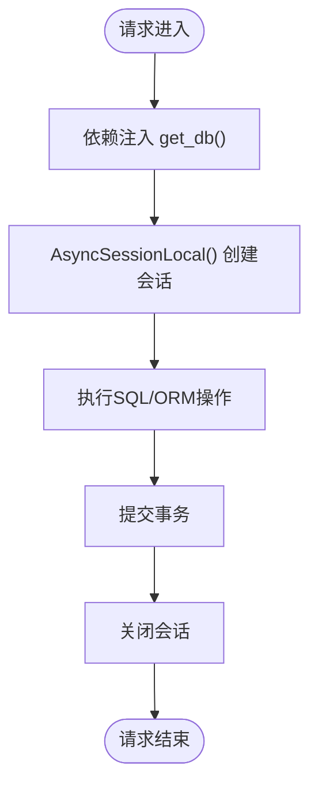
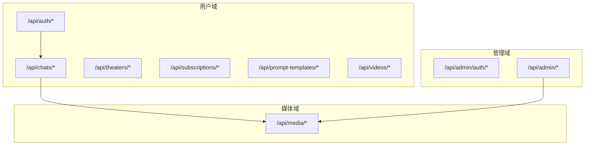
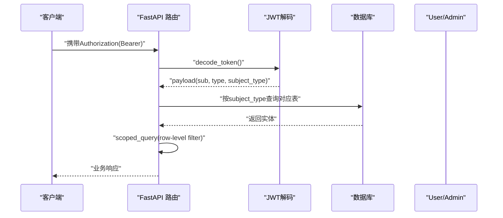
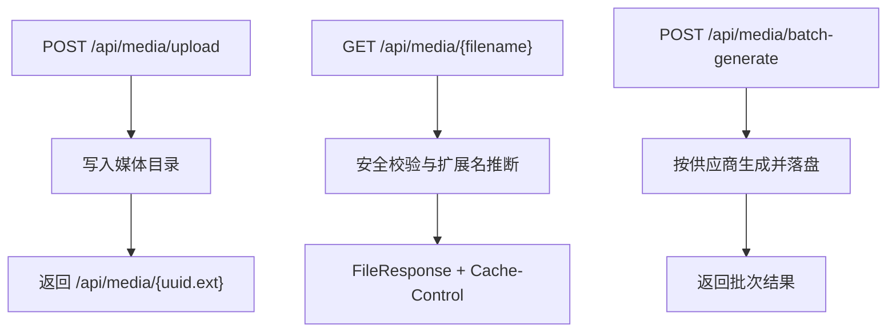
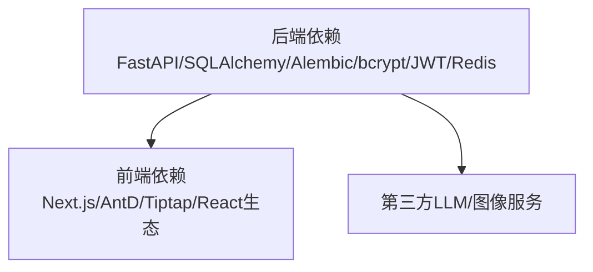

# 应用架构

<cite>
**本文引用的文件**
- [backend/main.py](file://backend/main.py)
- [backend/config.py](file://backend/config.py)
- [backend/database.py](file://backend/database.py)
- [backend/routers/admin.py](file://backend/routers/admin.py)
- [backend/routers/auth.py](file://backend/routers/auth.py)
- [backend/routers/admin_auth.py](file://backend/routers/admin_auth.py)
- [backend/routers/chats.py](file://backend/routers/chats.py)
- [backend/routers/media.py](file://backend/routers/media.py)
- [backend/auth.py](file://backend/auth.py)
- [backend/models.py](file://backend/models.py)
- [backend/schemas.py](file://backend/schemas.py)
- [backend/services/media_utils.py](file://backend/services/media_utils.py)
- [frontend/src/app/layout.tsx](file://frontend/src/app/layout.tsx)
- [frontend/package.json](file://frontend/package.json)
- [backend/requirements.txt](file://backend/requirements.txt)
</cite>

## 目录
1. [简介](#简介)
2. [项目结构](#项目结构)
3. [核心组件](#核心组件)
4. [架构总览](#架构总览)
5. [详细组件分析](#详细组件分析)
6. [依赖分析](#依赖分析)
7. [性能考虑](#性能考虑)
8. [故障排查指南](#故障排查指南)
9. [结论](#结论)
10. [附录](#附录)

## 简介
本文件面向 Infinite Game 的应用架构，系统性阐述前后端分离的整体设计：后端采用 FastAPI 作为 API 网关与业务中枢，前端采用 Next.js 构建用户界面，独立的管理员后台通过独立路由与鉴权体系实现管理功能。文档重点覆盖应用生命周期管理（数据库连接池、异步上下文、启动与关闭流程）、路由组织（用户路由、管理员路由、媒体与聊天路由）、中间件体系（CORS、认证、调试）、静态资源与媒体管理、错误处理策略以及性能监控配置，并以图示与“章节来源”形式定位到具体实现文件。

## 项目结构
- 后端（FastAPI）：集中于 backend 目录，包含路由模块、服务层、模型与数据库配置、认证与鉴权、配置与依赖声明。
- 前端（Next.js）：集中于 frontend 目录，包含页面布局、上下文、UI 组件与工具库。
- 独立管理员后台：通过独立的管理员路由与鉴权依赖实现，与用户路由解耦。

图表来源
- [backend/main.py:110-174](file://backend/main.py#L110-L174)
- [backend/config.py:1-43](file://backend/config.py#L1-L43)
- [backend/database.py:1-31](file://backend/database.py#L1-L31)
- [backend/auth.py:1-229](file://backend/auth.py#L1-L229)
- [backend/models.py:1-447](file://backend/models.py#L1-L447)
- [backend/schemas.py:1-859](file://backend/schemas.py#L1-L859)
- [frontend/src/app/layout.tsx:1-42](file://frontend/src/app/layout.tsx#L1-L42)
- [frontend/package.json:1-92](file://frontend/package.json#L1-L92)

章节来源
- [backend/main.py:110-174](file://backend/main.py#L110-L174)
- [backend/config.py:1-43](file://backend/config.py#L1-L43)
- [backend/database.py:1-31](file://backend/database.py#L1-L31)
- [backend/auth.py:1-229](file://backend/auth.py#L1-L229)
- [backend/models.py:1-447](file://backend/models.py#L1-L447)
- [backend/schemas.py:1-859](file://backend/schemas.py#L1-L859)
- [frontend/src/app/layout.tsx:1-42](file://frontend/src/app/layout.tsx#L1-L42)
- [frontend/package.json:1-92](file://frontend/package.json#L1-L92)

## 核心组件
- 应用入口与生命周期：通过 lifespan 管理数据库连接、迁移与叙事引擎初始化；注册 CORS 与调试中间件；挂载全部路由。
- 配置中心：集中管理数据库、Redis、AI 密钥、JWT、运行选项等。
- 数据库与会话：异步引擎与连接池配置，会话工厂与依赖注入。
- 认证与鉴权：用户与管理员双轨 JWT 体系，通用依赖与行级隔离。
- 路由组织：按领域拆分，用户路由、管理员路由、媒体与聊天路由清晰分层。
- 媒体与静态资源：媒体目录安全访问、上传与批量生成。
- 错误处理与性能监控：统一异常、SSE 事件流、日志与缓存控制。

章节来源
- [backend/main.py:49-108](file://backend/main.py#L49-L108)
- [backend/config.py:7-43](file://backend/config.py#L7-L43)
- [backend/database.py:8-31](file://backend/database.py#L8-L31)
- [backend/auth.py:30-229](file://backend/auth.py#L30-L229)
- [backend/routers/admin.py:19-501](file://backend/routers/admin.py#L19-L501)
- [backend/routers/auth.py:30-136](file://backend/routers/auth.py#L30-L136)
- [backend/routers/admin_auth.py:29-136](file://backend/routers/admin_auth.py#L29-L136)
- [backend/routers/media.py:24-244](file://backend/routers/media.py#L24-L244)

## 架构总览
后端以 FastAPI 为核心，通过异步 ORM 与连接池提供高并发能力；前端 Next.js 通过 HTTP 与 SSE 与后端交互；管理员后台通过独立路由与鉴权保障管理域安全；媒体服务统一管理静态资源与生成物。

图表来源
- [backend/main.py:130-152](file://backend/main.py#L130-L152)
- [backend/routers/auth.py:30-136](file://backend/routers/auth.py#L30-L136)
- [backend/routers/admin_auth.py:29-136](file://backend/routers/admin_auth.py#L29-L136)
- [backend/routers/admin.py:19-501](file://backend/routers/admin.py#L19-L501)
- [backend/routers/chats.py:93-807](file://backend/routers/chats.py#L93-L807)
- [backend/routers/media.py:24-244](file://backend/routers/media.py#L24-L244)
- [backend/database.py:8-31](file://backend/database.py#L8-L31)

## 详细组件分析

### 应用生命周期与启动关闭流程
- 生命周期钩子：在 lifespan 中进行数据库连接重试、迁移（可选）、叙事引擎初始化、媒体目录准备。
- 启动流程：应用启动时加载配置、建立引擎、注册中间件与路由、执行迁移（若开启）。
- 关闭流程：yield 之后的清理逻辑可扩展，当前实现主要保证资源释放与会话回收。

图表来源
- [backend/main.py:49-108](file://backend/main.py#L49-L108)
- [backend/database.py:8-31](file://backend/database.py#L8-L31)
- [backend/config.py:37-37](file://backend/config.py#L37-L37)

章节来源
- [backend/main.py:49-108](file://backend/main.py#L49-L108)
- [backend/database.py:8-31](file://backend/database.py#L8-L31)
- [backend/config.py:37-37](file://backend/config.py#L37-L37)

### 数据库连接池与异步上下文
- 引擎配置：启用 pool_pre_ping、设定 pool_size 与 max_overflow，SQLite 场景设置线程检查参数。
- 会话工厂：AsyncSessionLocal 绑定引擎，expire_on_commit=false 降低刷新开销。
- 依赖注入：get_db 提供异步上下文，确保每个请求内复用同一会话。

图表来源
- [backend/database.py:19-31](file://backend/database.py#L19-L31)
- [backend/database.py:28-31](file://backend/database.py#L28-L31)

章节来源
- [backend/database.py:8-31](file://backend/database.py#L8-L31)

### 中间件体系
- CORS：允许本地开发源，支持凭据、通配方法与头部。
- 调试中间件：记录 Authorization 与 Origin，便于排查鉴权问题。
- 认证中间件：OAuth2PasswordBearer 与 JWT 解析，支持用户与管理员双轨。

图表来源
- [backend/main.py:130-136](file://backend/main.py#L130-L136)
- [backend/main.py:119-128](file://backend/main.py#L119-L128)
- [backend/auth.py:80-114](file://backend/auth.py#L80-L114)

章节来源
- [backend/main.py:119-136](file://backend/main.py#L119-L136)
- [backend/auth.py:80-114](file://backend/auth.py#L80-L114)

### 路由组织结构
- 用户路由：认证、聊天、剧场、订阅、提示词模板、视频等。
- 管理员路由：仪表盘统计、用户与管理员管理、积分与订阅管理、剧场管理等。
- 管理员认证路由：独立登录、刷新与个人信息。
- 媒体路由：安全文件服务、上传与批量图片生成。

图表来源
- [backend/routers/auth.py:30-136](file://backend/routers/auth.py#L30-L136)
- [backend/routers/admin_auth.py:29-136](file://backend/routers/admin_auth.py#L29-L136)
- [backend/routers/admin.py:19-501](file://backend/routers/admin.py#L19-L501)
- [backend/routers/chats.py:93-807](file://backend/routers/chats.py#L93-L807)
- [backend/routers/media.py:24-244](file://backend/routers/media.py#L24-L244)

章节来源
- [backend/routers/auth.py:30-136](file://backend/routers/auth.py#L30-L136)
- [backend/routers/admin_auth.py:29-136](file://backend/routers/admin_auth.py#L29-L136)
- [backend/routers/admin.py:19-501](file://backend/routers/admin.py#L19-L501)
- [backend/routers/chats.py:93-807](file://backend/routers/chats.py#L93-L807)
- [backend/routers/media.py:24-244](file://backend/routers/media.py#L24-L244)

### 认证与鉴权机制
- 用户与管理员双轨：用户使用 subject_type=user，管理员使用 subject_type=admin；刷新令牌需满足类型与主体类型约束。
- 通用依赖：get_current_user_or_admin 根据 subject_type 决定查询 User 或 Admin 表，支持管理员访问用户端点。
- 行级隔离：scoped_query 在非管理员实体上强制 user_id 过滤，管理员实体绕过过滤。

图表来源
- [backend/auth.py:65-229](file://backend/auth.py#L65-L229)

章节来源
- [backend/auth.py:65-229](file://backend/auth.py#L65-L229)

### 媒体与静态资源管理
- 安全访问：/api/media/{filename} 支持带扩展名与纯 UUID 回退查找，严格 MIME 控制与缓存头。
- 上传与生成：/api/media/upload 接受文件并返回可访问 URL；/api/media/batch-generate 支持 Gemini 与 xAI 批量生成。
- 工具库：media_utils 提供内联图片与远程资源保存，统一媒体目录。

图表来源
- [backend/routers/media.py:54-106](file://backend/routers/media.py#L54-L106)
- [backend/routers/media.py:108-139](file://backend/routers/media.py#L108-L139)
- [backend/services/media_utils.py:20-79](file://backend/services/media_utils.py#L20-L79)

章节来源
- [backend/routers/media.py:54-139](file://backend/routers/media.py#L54-L139)
- [backend/services/media_utils.py:20-79](file://backend/services/media_utils.py#L20-L79)

### 错误处理策略
- 统一异常：路由层对不存在实体、权限不足、余额不足等场景抛出 HTTPException。
- SSE 事件：聊天流式响应通过 Server-Sent Events 发送文本块、工具调用、计费与完成事件，失败时发送 error。
- 日志与调试：调试中间件记录请求头与路径，服务层记录生成统计与错误。

章节来源
- [backend/routers/chats.py:29-91](file://backend/routers/chats.py#L29-L91)
- [backend/main.py:119-128](file://backend/main.py#L119-L128)

### 性能监控配置
- 连接池：pool_pre_ping、pool_size 与 max_overflow 控制并发与重连。
- SSE 与长连接：聊天路由使用 StreamingResponse，设置必要的缓存与连接头。
- 日志级别：SQLAlchemy 与 Uvicorn 访问日志降噪，保留应用日志。

章节来源
- [backend/database.py:8-17](file://backend/database.py#L8-L17)
- [backend/main.py:16-30](file://backend/main.py#L16-L30)
- [backend/routers/chats.py:250-258](file://backend/routers/chats.py#L250-L258)

## 依赖分析
- 后端依赖：FastAPI、SQLAlchemy、Alembic、bcrypt、JWKS、Redis、AI SDK 等。
- 前端依赖：Next.js、Ant Design、Tiptap、React 生态、Socket.IO 客户端等。
- 依赖关系：后端通过路由与服务层与前端交互；媒体与聊天路由依赖第三方 LLM/图像服务。

图表来源
- [backend/requirements.txt:1-28](file://backend/requirements.txt#L1-L28)
- [frontend/package.json:13-67](file://frontend/package.json#L13-L67)

章节来源
- [backend/requirements.txt:1-28](file://backend/requirements.txt#L1-L28)
- [frontend/package.json:13-67](file://frontend/package.json#L13-L67)

## 性能考虑
- 异步与连接池：使用异步引擎与连接池提升并发；谨慎设置 pool_size 与 max_overflow，避免资源争用。
- SSE 与事件流：聊天流式响应需注意缓冲与网络稳定性；前端应具备断线重连与事件聚合。
- 缓存与静态资源：媒体文件提供强缓存头，减少重复请求；上传与生成后统一通过 /api/media 访问。
- 日志与监控：SQLAlchemy 与 Uvicorn 访问日志降噪，保留关键业务日志；必要时接入指标采集。

## 故障排查指南
- 启动失败与迁移：lifespan 中包含数据库连接重试与迁移失败后的残留表清理逻辑；检查 RUN_MIGRATIONS 设置与数据库权限。
- 认证问题：调试中间件会记录 Authorization 与 Origin；确认 token 类型与 subject_type 是否匹配。
- 媒体访问：文件名必须符合安全正则；若 LLM 截断扩展名，回退到扩展名探测；检查 MIME 映射与缓存头。
- 聊天流式：关注 SSE 事件类型与错误事件；检查工具调用与画布桥接是否触发。

章节来源
- [backend/main.py:49-108](file://backend/main.py#L49-L108)
- [backend/main.py:119-128](file://backend/main.py#L119-L128)
- [backend/routers/media.py:54-81](file://backend/routers/media.py#L54-L81)
- [backend/routers/chats.py:29-91](file://backend/routers/chats.py#L29-L91)

## 结论
Infinite Game 的应用架构以 FastAPI 为核心，结合异步 ORM、严格的鉴权与路由分层、完善的媒体与聊天服务，构建了前后端分离、可扩展的系统。通过生命周期管理、中间件体系与性能监控配置，系统在开发体验与运行效率之间取得平衡。建议后续在生产环境进一步完善指标采集、限流与可观测性，并持续优化工具链与第三方服务集成。

## 附录
- 前端根布局与 Provider 注入，确保全局上下文可用。
- 后端依赖清单与前端依赖清单，便于环境搭建与升级。

章节来源
- [frontend/src/app/layout.tsx:23-41](file://frontend/src/app/layout.tsx#L23-L41)
- [backend/requirements.txt:1-28](file://backend/requirements.txt#L1-L28)
- [frontend/package.json:13-67](file://frontend/package.json#L13-L67)