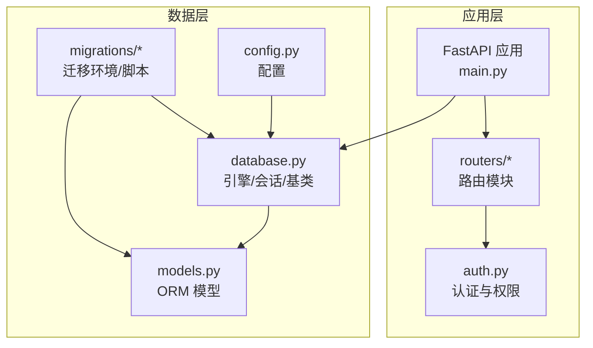
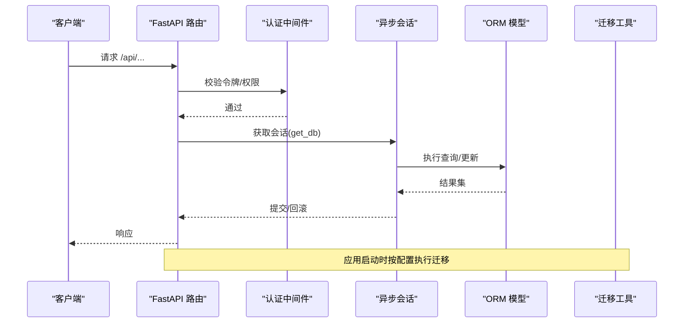
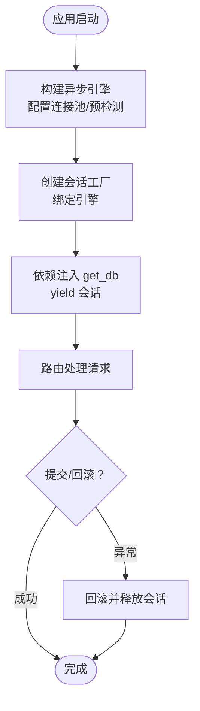
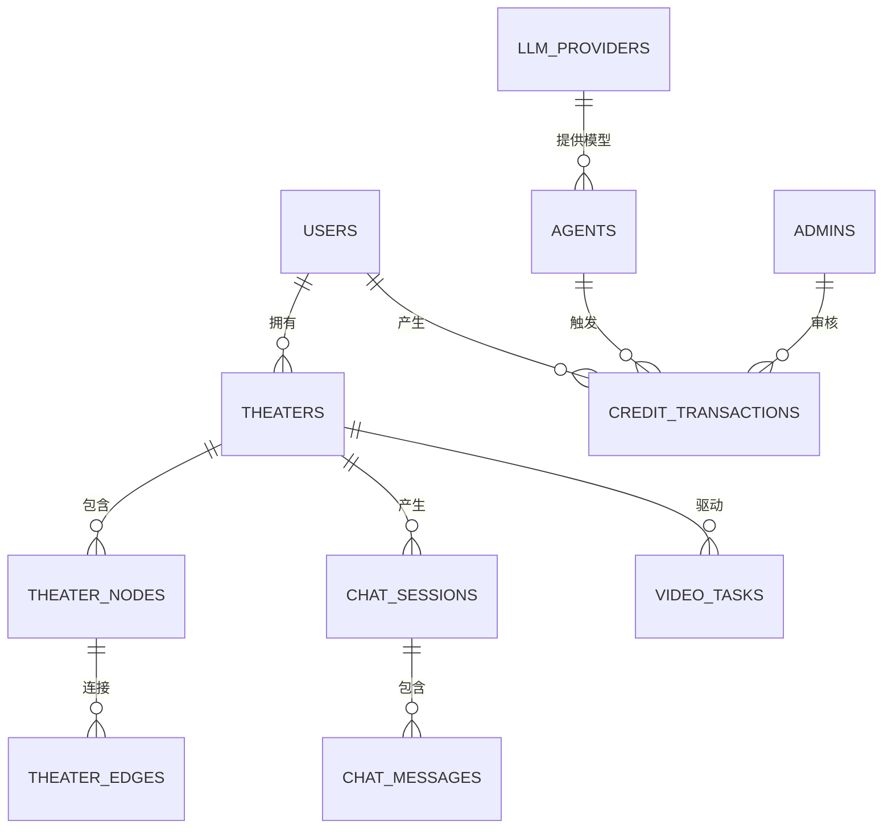
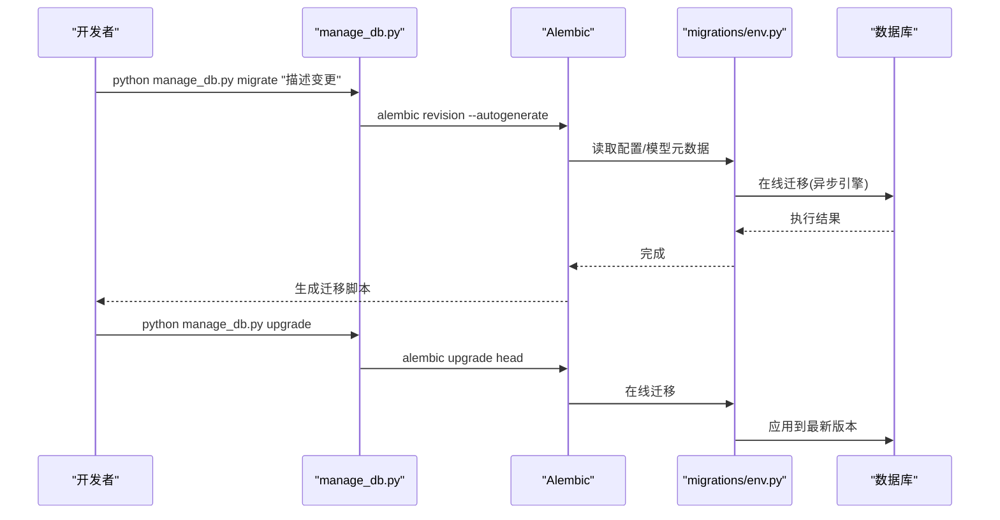
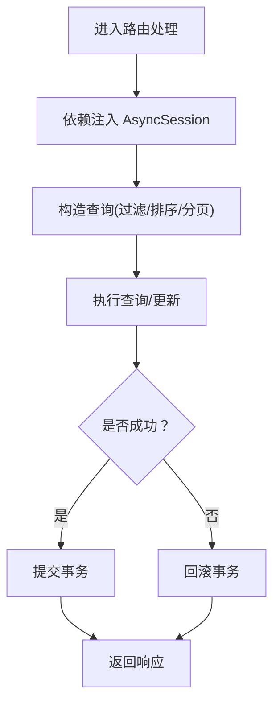
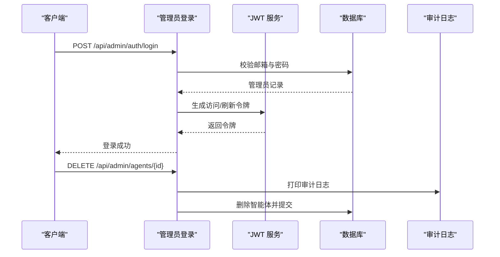
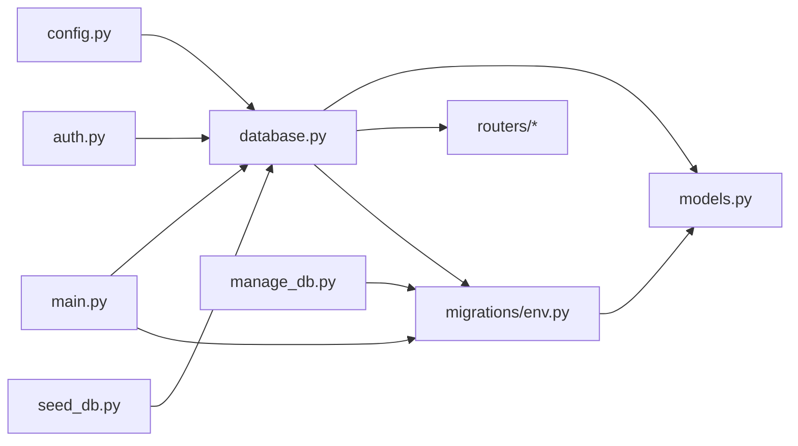

# 数据架构

<cite>
**本文引用的文件**
- [backend/database.py](file://backend/database.py)
- [backend/models.py](file://backend/models.py)
- [backend/config.py](file://backend/config.py)
- [backend/main.py](file://backend/main.py)
- [backend/migrations/env.py](file://backend/migrations/env.py)
- [backend/migrations/script.py.mako](file://backend/migrations/script.py.mako)
- [backend/alembic.ini](file://backend/alembic.ini)
- [backend/manage_db.py](file://backend/manage_db.py)
- [backend/routers/admin.py](file://backend/routers/admin.py)
- [backend/auth.py](file://backend/auth.py)
- [backend/seed_db.py](file://backend/seed_db.py)
</cite>

## 目录
1. [简介](#简介)
2. [项目结构](#项目结构)
3. [核心组件](#核心组件)
4. [架构总览](#架构总览)
5. [组件详解](#组件详解)
6. [依赖关系分析](#依赖关系分析)
7. [性能考量](#性能考量)
8. [故障排查指南](#故障排查指南)
9. [结论](#结论)
10. [附录](#附录)

## 简介
本文件面向 Infinite Game 的数据架构，围绕基于 SQLAlchemy 的 ORM 设计进行系统化说明，覆盖以下主题：
- 异步数据库连接、事务管理与连接池配置
- 数据模型设计原则（实体关系映射、字段约束、索引策略）
- 数据库迁移机制（Alembic 版本控制、迁移脚本管理、回滚策略）
- 数据访问层设计（Repository 模式、CRUD 封装、查询优化）
- 数据安全策略（敏感信息处理、访问控制、审计日志）
- 性能优化建议与监控指标
- 具体模型定义示例与最佳实践

## 项目结构
后端采用 FastAPI + SQLAlchemy Async 的技术栈，数据库相关的关键文件分布如下：
- 配置与连接：config.py、database.py
- 模型定义：models.py
- 应用启动与生命周期：main.py
- 迁移与版本控制：migrations/env.py、migrations/script.py.mako、alembic.ini、manage_db.py
- 访问层与安全：routers/admin.py、auth.py
- 初始化数据：seed_db.py

图表来源
- [backend/main.py:110-152](file://backend/main.py#L110-L152)
- [backend/database.py:1-31](file://backend/database.py#L1-L31)
- [backend/models.py:1-447](file://backend/models.py#L1-L447)
- [backend/migrations/env.py:1-120](file://backend/migrations/env.py#L1-L120)

章节来源
- [backend/main.py:110-152](file://backend/main.py#L110-L152)
- [backend/database.py:1-31](file://backend/database.py#L1-L31)
- [backend/models.py:1-447](file://backend/models.py#L1-L447)
- [backend/migrations/env.py:1-120](file://backend/migrations/env.py#L1-L120)

## 核心组件
- 异步引擎与会话工厂：通过 async_engine 与 async_sessionmaker 构建，启用连接池预检测与 SQLite 特殊参数。
- ORM 基类：统一继承自 DeclarativeBase，便于迁移与元数据注册。
- 模型集合：涵盖用户、管理员、剧场、节点、边、资产、聊天会话与消息、智能体、积分流水、订阅计划、视频任务、调试会话与消息等。
- 迁移环境：支持离线与在线两种迁移模式，自动清理 Alembic 临时表，适配批处理迁移。
- 启动流程：应用启动时尝试连接数据库并按配置执行迁移；提供调试中间件与 CORS 支持。

章节来源
- [backend/database.py:1-31](file://backend/database.py#L1-L31)
- [backend/models.py:1-447](file://backend/models.py#L1-L447)
- [backend/migrations/env.py:67-87](file://backend/migrations/env.py#L67-L87)
- [backend/main.py:49-108](file://backend/main.py#L49-L108)

## 架构总览
下图展示了数据访问层的整体交互：路由层通过依赖注入获取异步会话，调用数据库执行 CRUD；迁移工具在启动阶段或命令行中执行版本控制；配置中心决定数据库 URL 与运行行为。

图表来源
- [backend/routers/admin.py:29-47](file://backend/routers/admin.py#L29-L47)
- [backend/auth.py:83-113](file://backend/auth.py#L83-L113)
- [backend/database.py:28-31](file://backend/database.py#L28-L31)
- [backend/main.py:49-108](file://backend/main.py#L49-L108)

## 组件详解

### 异步数据库连接与会话管理
- 引擎配置要点
  - 使用异步驱动与 echo 控制 SQL 日志输出
  - pool_pre_ping：连接失效自动重连
  - pool_size/max_overflow：连接池容量与溢出上限
  - SQLite 场景设置 check_same_thread=False
- 会话工厂
  - AsyncSessionLocal 绑定引擎，expire_on_commit=False 以避免提交后对象过期
- 依赖注入
  - get_db 提供 FastAPI 依赖，确保每个请求拥有独立会话

图表来源
- [backend/database.py:8-23](file://backend/database.py#L8-L23)
- [backend/database.py:28-31](file://backend/database.py#L28-L31)

章节来源
- [backend/database.py:1-31](file://backend/database.py#L1-L31)

### 数据模型设计原则
- 实体关系映射
  - 多对一/一对多：如 Theater.user_id → User.id；TheaterNode.theater_id → Theater.id；ChatMessage.session_id → ChatSession.id
  - 级联删除：部分外键使用 CASCADE 删除关联节点与边
- 字段约束
  - 主键：统一使用字符串型 UUID（长度 36），并默认生成
  - 唯一性：邮箱、提供商名称、OAuth 标识等
  - 非空：密码哈希、角色、积分余额等关键字段
  - 时间戳：server_default/onupdate 自动维护创建与更新时间
- 索引策略
  - 常用于过滤/连接的列建立索引：如用户邮箱、剧场状态、节点类型、消息会话等
  - JSON 字段用于去重与缓存：资产表 content_hash
- JSON 字段
  - 存储配置、成本、元数据等动态结构，便于扩展

图表来源
- [backend/models.py:35-73](file://backend/models.py#L35-L73)
- [backend/models.py:75-112](file://backend/models.py#L75-L112)
- [backend/models.py:172-194](file://backend/models.py#L172-L194)
- [backend/models.py:196-260](file://backend/models.py#L196-L260)
- [backend/models.py:261-281](file://backend/models.py#L261-L281)
- [backend/models.py:391-422](file://backend/models.py#L391-L422)

章节来源
- [backend/models.py:1-447](file://backend/models.py#L1-L447)

### 数据库迁移机制（Alembic）
- 配置与入口
  - alembic.ini 定义脚本位置、日志级别与路径分隔符
  - env.py 注册模型元数据、读取配置、支持离线/在线迁移
- 在线迁移
  - 使用 async_engine_from_config 构建异步引擎，逐连接执行迁移
  - 清理残留 Alembic 临时表，避免批处理冲突
- 离线迁移
  - 直接使用 URL 与目标元数据生成迁移脚本
- 命令行工具
  - manage_db.py 提供 migrate/upgrade/downgrade/seed 子命令，便于开发与运维

图表来源
- [backend/manage_db.py:20-38](file://backend/manage_db.py#L20-L38)
- [backend/migrations/env.py:39-107](file://backend/migrations/env.py#L39-L107)
- [backend/alembic.ini:1-115](file://backend/alembic.ini#L1-L115)

章节来源
- [backend/migrations/env.py:1-120](file://backend/migrations/env.py#L1-L120)
- [backend/migrations/script.py.mako:1-27](file://backend/migrations/script.py.mako#L1-L27)
- [backend/alembic.ini:1-115](file://backend/alembic.ini#L1-L115)
- [backend/manage_db.py:1-80](file://backend/manage_db.py#L1-L80)

### 数据访问层设计（Repository 模式与 CRUD 封装）
- 依赖注入与会话
  - 路由层通过 Depends(get_db) 获取 AsyncSession，确保事务边界清晰
- 查询封装
  - 使用 select/fetch/聚合函数实现列表、详情、统计等查询
  - 分页与排序：offset/limit/order_by
- 事务与回滚
  - 成功后 commit，异常时自动回滚；必要时显式 rollback
- 审计与隔离
  - scoped_query 对用户与管理员数据进行行级隔离
  - 管理员可绕过过滤，普通用户仅可见自身数据

图表来源
- [backend/routers/admin.py:29-47](file://backend/routers/admin.py#L29-L47)
- [backend/auth.py:221-228](file://backend/auth.py#L221-L228)

章节来源
- [backend/routers/admin.py:1-200](file://backend/routers/admin.py#L1-L200)
- [backend/auth.py:216-228](file://backend/auth.py#L216-L228)

### 数据安全策略
- 敏感信息处理
  - 密码：bcrypt 哈希存储，不保存明文
  - API Key：模型中注释建议加密存储（当前为明文）
- 访问控制
  - JWT：用户与管理员分别签发与校验，角色与主体类型区分
  - 依赖：require_admin/get_current_user/get_current_active_user
- 审计日志
  - 管理员操作（如删除智能体）打印审计日志
  - 积分调整记录 CreditTransaction，包含余额前后值与元数据

图表来源
- [backend/routers/admin.py:138-150](file://backend/routers/admin.py#L138-L150)
- [backend/auth.py:119-210](file://backend/auth.py#L119-L210)
- [backend/models.py:261-281](file://backend/models.py#L261-L281)

章节来源
- [backend/auth.py:1-228](file://backend/auth.py#L1-L228)
- [backend/routers/admin.py:138-150](file://backend/routers/admin.py#L138-L150)
- [backend/models.py:146-170](file://backend/models.py#L146-L170)

### 数据初始化与种子数据
- seed_db.py
  - 默认创建 OpenAI 提供商与超级管理员账户
  - 使用 bcrypt 哈希密码
- 运行方式
  - 通过 manage_db.py seed 子命令执行

章节来源
- [backend/seed_db.py:1-64](file://backend/seed_db.py#L1-L64)
- [backend/manage_db.py:65-74](file://backend/manage_db.py#L65-L74)

## 依赖关系分析
- 组件耦合
  - 路由依赖 get_db，间接依赖 database.py
  - 迁移环境依赖 config.py 与 models.py
  - 应用启动依赖迁移工具与数据库引擎
- 外部依赖
  - SQLAlchemy Async、Alembic、FastAPI、bcrypt、Pydantic Settings

图表来源
- [backend/config.py:1-43](file://backend/config.py#L1-L43)
- [backend/database.py:1-31](file://backend/database.py#L1-L31)
- [backend/models.py:1-447](file://backend/models.py#L1-L447)
- [backend/migrations/env.py:15-32](file://backend/migrations/env.py#L15-L32)
- [backend/main.py:38-44](file://backend/main.py#L38-L44)
- [backend/auth.py:11-12](file://backend/auth.py#L11-L12)
- [backend/seed_db.py:10-11](file://backend/seed_db.py#L10-L11)
- [backend/manage_db.py:26-28](file://backend/manage_db.py#L26-L28)

章节来源
- [backend/config.py:1-43](file://backend/config.py#L1-L43)
- [backend/database.py:1-31](file://backend/database.py#L1-L31)
- [backend/migrations/env.py:15-32](file://backend/migrations/env.py#L15-L32)
- [backend/main.py:38-44](file://backend/main.py#L38-L44)

## 性能考量
- 连接池与并发
  - 合理设置 pool_size 与 max_overflow，避免高并发下的连接争用
  - pool_pre_ping 提升连接稳定性
- 查询优化
  - 为高频过滤/连接列建立索引（如用户邮箱、剧场状态、节点类型）
  - 使用 select 加载必要字段，避免 N+1 查询
  - 分页查询使用 offset/limit，并结合合适的排序键
- 写入优化
  - 批量写入与事务合并，减少往返开销
  - 避免在热路径上执行复杂 JSON 解析
- 缓存与去重
  - 资产表使用 content_hash 去重，降低重复存储
- 监控指标
  - 连接池命中率、平均等待时间、超时次数
  - 查询延迟分位数、慢查询数量
  - 事务失败率与回滚频率

## 故障排查指南
- 迁移失败
  - 现象：迁移报错或残留临时表
  - 处理：启动时自动清理残留表后重试；必要时手动执行 manage_db.py downgrade/upgrade
- 连接失败
  - 现象：启动阶段无法连接数据库
  - 处理：检查 DATABASE_URL、网络与权限；确认 SQLite 文件路径正确
- 权限与审计
  - 现象：管理员操作未记录
  - 处理：确认审计日志打印逻辑与路由权限依赖
- 密码与令牌
  - 现象：登录失败或令牌无效
  - 处理：核对密钥、算法与过期时间；检查 bcrypt 哈希一致性

章节来源
- [backend/main.py:49-108](file://backend/main.py#L49-L108)
- [backend/migrations/env.py:67-87](file://backend/migrations/env.py#L67-L87)
- [backend/auth.py:119-210](file://backend/auth.py#L119-L210)

## 结论
本数据架构以 SQLAlchemy Async 为核心，结合 Alembic 进行版本化管理，配合路由层的依赖注入与权限控制，形成清晰、可演进的数据层。通过合理的索引、连接池与查询优化，以及完善的审计与安全策略，能够支撑从用户到剧场、从聊天到视频生成的多样化业务场景。

## 附录
- 配置项参考
  - DATABASE_URL：数据库连接串（默认 SQLite，可切换 PostgreSQL）
  - RUN_MIGRATIONS：启动时是否自动执行迁移
  - JWT_SECRET_KEY/JWT_ALGORITHM/ACCESS_TOKEN_EXPIRE_MINUTES：认证相关
- 命令行工具
  - manage_db.py migrate/upgrade/downgrade/seed 子命令，便于本地与 CI/CD 流水线集成

章节来源
- [backend/config.py:7-43](file://backend/config.py#L7-L43)
- [backend/manage_db.py:40-77](file://backend/manage_db.py#L40-L77)