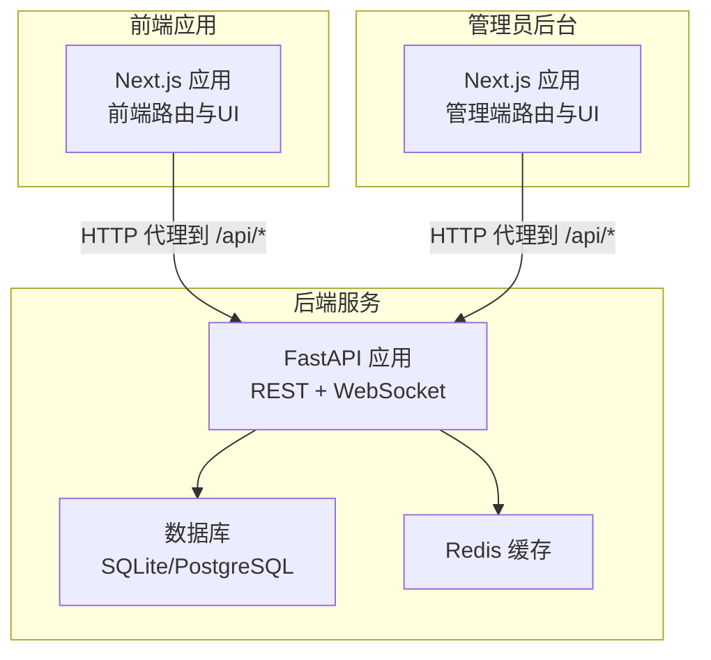
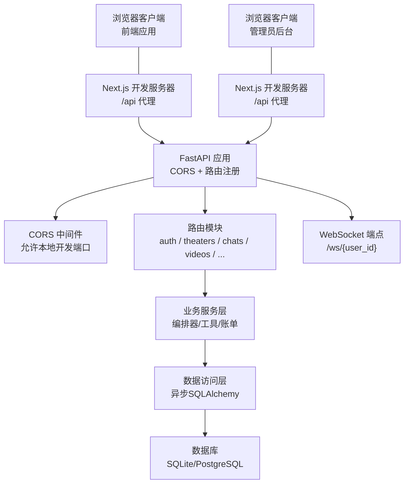
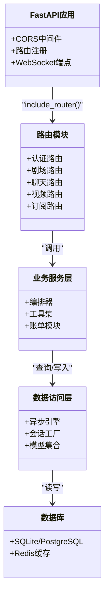
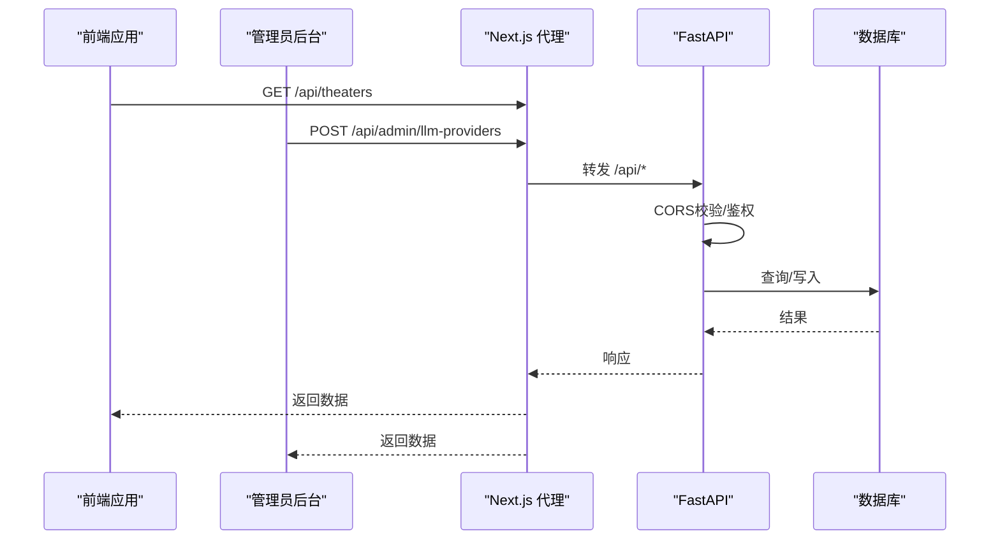
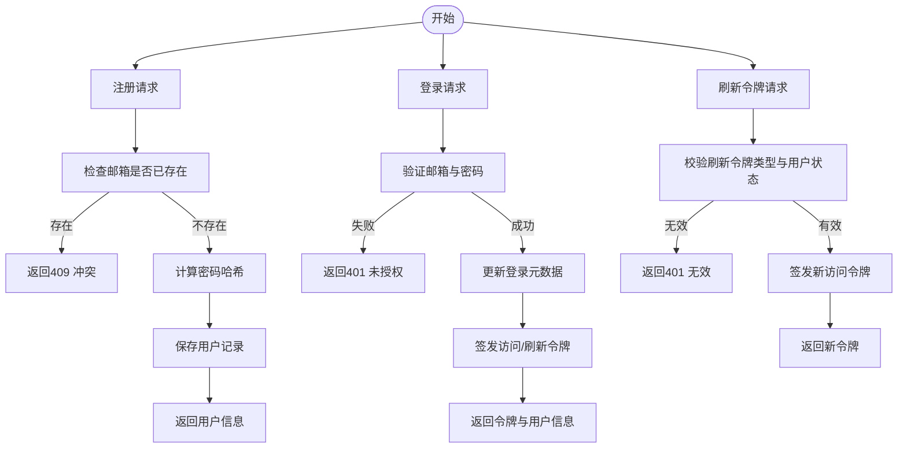
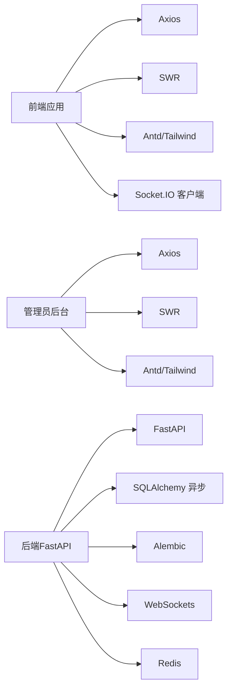

# 系统架构设计

<cite>
**本文档引用的文件**
- [backend/main.py](file://backend/main.py)
- [backend/config.py](file://backend/config.py)
- [backend/database.py](file://backend/database.py)
- [backend/models.py](file://backend/models.py)
- [backend/routers/auth.py](file://backend/routers/auth.py)
- [backend/schemas.py](file://backend/schemas.py)
- [backend/services/orchestrator.py](file://backend/services/orchestrator.py)
- [frontend/package.json](file://frontend/package.json)
- [frontend/src/lib/api.ts](file://frontend/src/lib/api.ts)
- [frontend/next.config.ts](file://frontend/next.config.ts)
- [backend/admin/package.json](file://backend/admin/package.json)
- [backend/admin/next.config.js](file://backend/admin/next.config.js)
- [backend/admin/src/lib/api-utils.ts](file://backend/admin/src/lib/api-utils.ts)
- [backend/requirements.txt](file://backend/requirements.txt)
</cite>

## 目录
1. [引言](#引言)
2. [项目结构](#项目结构)
3. [核心组件](#核心组件)
4. [架构总览](#架构总览)
5. [详细组件分析](#详细组件分析)
6. [依赖分析](#依赖分析)
7. [性能考虑](#性能考虑)
8. [故障排除指南](#故障排除指南)
9. [结论](#结论)
10. [附录](#附录)

## 引言
本系统是一个前后端分离的叙事剧场创作平台，采用FastAPI作为后端服务框架、Next.js作为前端与独立管理员后台的技术栈。系统通过清晰的分层架构实现表现层、业务层与数据层的职责分离，并预留了微服务化扩展能力。本文档从系统边界、组件交互、数据流、跨域与认证、实时通信等方面进行系统性说明，帮助开发者与运维人员快速理解并高效迭代。

## 项目结构
系统由三个主要部分组成：
- 后端服务（FastAPI）：提供REST API与WebSocket接口，负责业务逻辑、数据访问与外部服务集成。
- 前端应用（Next.js）：用户侧界面，支持画布编辑、AI对话、剧场管理等功能。
- 管理员后台（Next.js）：独立的管理端应用，提供管理员登录、资源管理、配置维护等能力。

图表来源
- [frontend/next.config.ts:9-16](file://frontend/next.config.ts#L9-L16)
- [backend/admin/next.config.js:4-11](file://backend/admin/next.config.js#L4-L11)
- [backend/main.py:130-136](file://backend/main.py#L130-L136)
- [backend/config.py:15-19](file://backend/config.py#L15-L19)

章节来源
- [frontend/next.config.ts:1-20](file://frontend/next.config.ts#L1-L20)
- [backend/admin/next.config.js:1-15](file://backend/admin/next.config.js#L1-L15)
- [backend/main.py:130-136](file://backend/main.py#L130-L136)
- [backend/config.py:15-19](file://backend/config.py#L15-L19)

## 核心组件
- 表现层（Presentation Layer）
  - 前端Next.js应用：负责用户交互、画布编辑、AI助手面板、剧场管理等。
  - 管理员Next.js应用：提供管理员登录、资源管理、配置维护、订阅与计费统计等。
- 业务层（Business Layer）
  - FastAPI路由与服务：封装认证、剧场、聊天、视频、订阅、代理执行等业务逻辑。
  - 多智能体编排器：实现多Agent协作策略注册、流水线/计划/讨论模式的动态调度。
- 数据层（Data Layer）
  - 异步SQLAlchemy模型：统一的用户、管理员、剧场、节点、资产、聊天会话等实体。
  - 配置与连接：异步引擎、连接池、环境变量与数据库URL配置。

章节来源
- [backend/routers/auth.py:30-33](file://backend/routers/auth.py#L30-L33)
- [backend/services/orchestrator.py:62-76](file://backend/services/orchestrator.py#L62-L76)
- [backend/models.py:10-73](file://backend/models.py#L10-L73)
- [backend/database.py:8-23](file://backend/database.py#L8-L23)

## 架构总览
系统采用“前端Next.js + 独立管理员后台 + FastAPI后端”的三层架构，通过反向代理实现跨域与统一入口。后端以模块化路由组织功能，业务逻辑集中在服务层，数据持久化通过异步ORM完成。WebSocket用于实时通信，CORS中间件支持跨域请求。

图表来源
- [frontend/next.config.ts:9-16](file://frontend/next.config.ts#L9-L16)
- [backend/admin/next.config.js:4-11](file://backend/admin/next.config.js#L4-L11)
- [backend/main.py:130-136](file://backend/main.py#L130-L136)
- [backend/main.py:160-170](file://backend/main.py#L160-L170)

章节来源
- [backend/main.py:110-174](file://backend/main.py#L110-L174)
- [frontend/next.config.ts:1-20](file://frontend/next.config.ts#L1-L20)
- [backend/admin/next.config.js:1-15](file://backend/admin/next.config.js#L1-L15)

## 详细组件分析

### 分层架构与职责划分
- 表现层
  - 前端应用：使用SWR/Axios进行API调用，拦截器自动注入Authorization头，统一处理401刷新流程。
  - 管理员后台：基于SWR与Axios，提供资源列表、表单校验与批量操作。
- 业务层
  - 路由层：按功能域拆分（认证、剧场、聊天、视频、订阅等），统一前缀/api。
  - 服务层：编排器采用策略注册模式，支持流水线、计划、讨论等协作方式；工具与Billing模块解耦。
- 数据层
  - 异步ORM：统一的Base类、AsyncSessionLocal与连接池配置，支持SQLite与PostgreSQL。
  - 模型：用户/管理员、剧场/节点/边、资产、聊天会话/消息、LLM提供商等。

图表来源
- [backend/main.py:138-152](file://backend/main.py#L138-L152)
- [backend/database.py:8-31](file://backend/database.py#L8-L31)
- [backend/models.py:10-200](file://backend/models.py#L10-L200)

章节来源
- [backend/main.py:138-152](file://backend/main.py#L138-L152)
- [backend/database.py:1-31](file://backend/database.py#L1-L31)
- [backend/models.py:1-200](file://backend/models.py#L1-L200)

### 微服务化思考
- 单体优势：当前为单体应用，便于快速迭代与内聚部署；路由与服务集中，开发效率高。
- 扩展基础：模块化路由与服务层已形成清晰边界；数据库与缓存分离明确；WebSocket与SSE事件机制为后续拆分提供基础。
- 迁移路径：可按功能域拆分为独立服务（如剧场服务、聊天服务、视频服务），通过API网关与消息队列逐步过渡。

章节来源
- [backend/services/orchestrator.py:62-76](file://backend/services/orchestrator.py#L62-L76)
- [backend/main.py:138-152](file://backend/main.py#L138-L152)

### 技术选型决策
- FastAPI vs Django
  - 选择FastAPI：异步I/O与高性能、自动生成OpenAPI文档、Pydantic模型驱动的序列化与校验、WebSocket与SSE原生支持。
  - Django：传统MVC与同步生态成熟，但异步支持较弱，不适合本项目的实时与高并发场景。
- Next.js vs Create React App
  - 选择Next.js：内置路由、API Routes、SSR/SSG、App Router与Server Actions，开发体验与性能更优；管理员后台同样采用Next.js，统一技术栈。
  - CRA：静态打包与路由能力有限，不利于复杂SPA与API路由整合。

章节来源
- [backend/requirements.txt:1-28](file://backend/requirements.txt#L1-L28)
- [frontend/package.json:54-67](file://frontend/package.json#L54-L67)
- [backend/admin/package.json:37-49](file://backend/admin/package.json#L37-L49)

### 系统边界与组件交互
- 边界定义
  - 前端应用边界：用户故事板、角色、脚本节点与画布编辑。
  - 管理员后台边界：管理员登录、LLM提供商管理、提示模板、技能、订阅与计费统计。
  - 后端边界：认证、剧场、聊天、视频、订阅、代理执行与编排。
- 组件交互
  - 前端与管理员后台均通过Next.js的rewrites将/api请求转发至后端FastAPI。
  - 前端Axios拦截器统一注入Authorization头，后端CORS允许本地开发端口。

图表来源
- [frontend/next.config.ts:9-16](file://frontend/next.config.ts#L9-L16)
- [backend/admin/next.config.js:4-11](file://backend/admin/next.config.js#L4-L11)
- [backend/main.py:130-136](file://backend/main.py#L130-L136)

章节来源
- [frontend/next.config.ts:1-20](file://frontend/next.config.ts#L1-L20)
- [backend/admin/next.config.js:1-15](file://backend/admin/next.config.js#L1-L15)
- [backend/main.py:130-136](file://backend/main.py#L130-L136)

### 数据流向与处理逻辑
- 认证流程
  - 注册：邮箱唯一性校验，密码哈希，返回用户信息。
  - 登录：验证凭据，更新登录元数据，签发访问/刷新令牌。
  - 刷新：校验刷新令牌，签发新的访问令牌。
  - 个人中心：基于当前用户上下文返回资料。
- 实时通信
  - WebSocket端点用于双向通信，适用于实时消息与状态推送。
- 权限控制
  - 前端拦截器统一注入Authorization头，后端CORS允许本地开发源，生产环境需结合反向代理与安全策略。

图表来源
- [backend/routers/auth.py:36-99](file://backend/routers/auth.py#L36-L99)
- [backend/routers/auth.py:102-129](file://backend/routers/auth.py#L102-L129)
- [backend/routers/auth.py:132-135](file://backend/routers/auth.py#L132-L135)

章节来源
- [backend/routers/auth.py:1-136](file://backend/routers/auth.py#L1-L136)

### 跨域处理、实时通信与权限控制
- 跨域（CORS）
  - 允许本地开发端口（3000/3001）与凭证传输，满足前后端分离开发需求。
- 实时通信（WebSocket）
  - 提供/ws/{user_id}端点，用于实时消息收发与状态推送。
- 权限控制
  - 前端Axios拦截器自动附加Authorization头；后端Debug中间件用于调试认证头与来源。
  - 管理员后台与前端共享统一的API调用与鉴权策略。

章节来源
- [backend/main.py:130-136](file://backend/main.py#L130-L136)
- [backend/main.py:160-170](file://backend/main.py#L160-L170)
- [frontend/src/lib/api.ts:8-17](file://frontend/src/lib/api.ts#L8-L17)
- [backend/admin/src/lib/api-utils.ts:1-19](file://backend/admin/src/lib/api-utils.ts#L1-L19)

## 依赖分析
- 前端依赖
  - Next.js、React、Axios、SWR、TailwindCSS、Ant Design UI组件等，支撑画布编辑、富文本、实时通信与状态管理。
- 后端依赖
  - FastAPI、Uvicorn、SQLAlchemy异步、Alembic迁移、Redis、WebSockets、Pydantic/Settings等，支撑高性能API与异步数据访问。
- 管理员后台依赖
  - Next.js、Radix UI、Ant Design、Zod、SWR等，提供管理端表单、列表与可视化组件。

图表来源
- [frontend/package.json:13-67](file://frontend/package.json#L13-L67)
- [backend/admin/package.json:11-49](file://backend/admin/package.json#L11-L49)
- [backend/requirements.txt:1-28](file://backend/requirements.txt#L1-L28)

章节来源
- [frontend/package.json:1-92](file://frontend/package.json#L1-L92)
- [backend/admin/package.json:1-73](file://backend/admin/package.json#L1-L73)
- [backend/requirements.txt:1-28](file://backend/requirements.txt#L1-L28)

## 性能考虑
- 异步I/O与连接池
  - 使用异步SQLAlchemy与连接池配置，降低数据库等待时间，提升并发处理能力。
- 缓存策略
  - Redis用于会话与热点数据缓存，减轻数据库压力。
- 前端优化
  - SWR缓存与去重请求，Axios拦截器统一错误处理与重试队列，减少重复网络开销。
- 实时性
  - WebSocket与SSE事件流用于低延迟通信，适合多Agent协作与画布状态同步。

章节来源
- [backend/database.py:8-23](file://backend/database.py#L8-L23)
- [backend/config.py:18-19](file://backend/config.py#L18-L19)
- [frontend/src/lib/api.ts:19-81](file://frontend/src/lib/api.ts#L19-L81)

## 故障排除指南
- 数据库连接失败
  - 后端启动时包含数据库连接重试与迁移失败清理逻辑，若仍失败，检查DATABASE_URL与权限。
- 迁移失败
  - 支持自动清理残留临时表后重试，必要时手动确认迁移状态。
- CORS问题
  - 确认CORS允许的origins包含前端运行地址；生产环境需严格限定来源。
- 认证异常
  - 检查Authorization头是否正确注入；401时触发刷新流程，确保刷新令牌有效。
- WebSocket错误
  - 检查WS端点与客户端连接状态，关注异常捕获与关闭流程。

章节来源
- [backend/main.py:49-108](file://backend/main.py#L49-L108)
- [backend/main.py:130-136](file://backend/main.py#L130-L136)
- [frontend/src/lib/api.ts:31-81](file://frontend/src/lib/api.ts#L31-L81)
- [backend/main.py:160-170](file://backend/main.py#L160-L170)

## 结论
本系统通过前后端分离与清晰的分层架构，实现了叙事剧场创作平台的核心能力。FastAPI提供了高性能与强类型保障，Next.js统一了前端与管理端开发体验。系统在保持单体应用高效率的同时，为未来的微服务化奠定了坚实基础。建议在生产环境中完善CORS白名单、接入反向代理与安全网关，并持续优化数据库索引与缓存策略。

## 附录
- 配置项概览
  - 数据库：支持SQLite与PostgreSQL，异步引擎与连接池配置。
  - 缓存：Redis默认配置，可用于会话与热点数据。
  - 认证：JWT密钥、算法与过期时间配置。
  - 生成设置：故事与图像生成模型默认值。
- 路由前缀
  - 所有API以/api为前缀，前端与管理员后台通过rewrites代理到后端。

章节来源
- [backend/config.py:7-42](file://backend/config.py#L7-L42)
- [backend/database.py:8-23](file://backend/database.py#L8-L23)
- [frontend/next.config.ts:9-16](file://frontend/next.config.ts#L9-L16)
- [backend/admin/next.config.js:4-11](file://backend/admin/next.config.js#L4-L11)