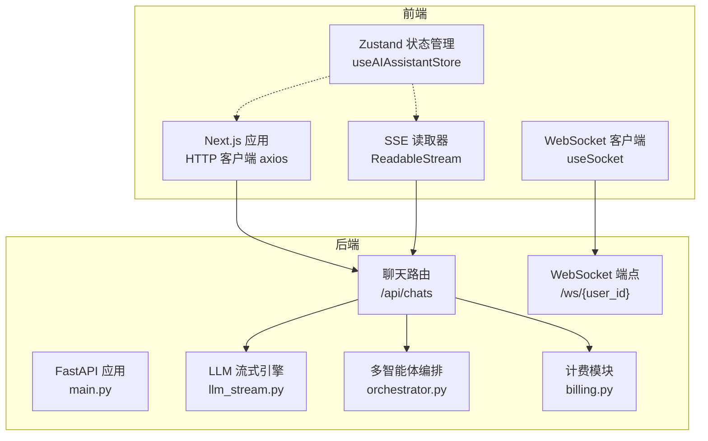
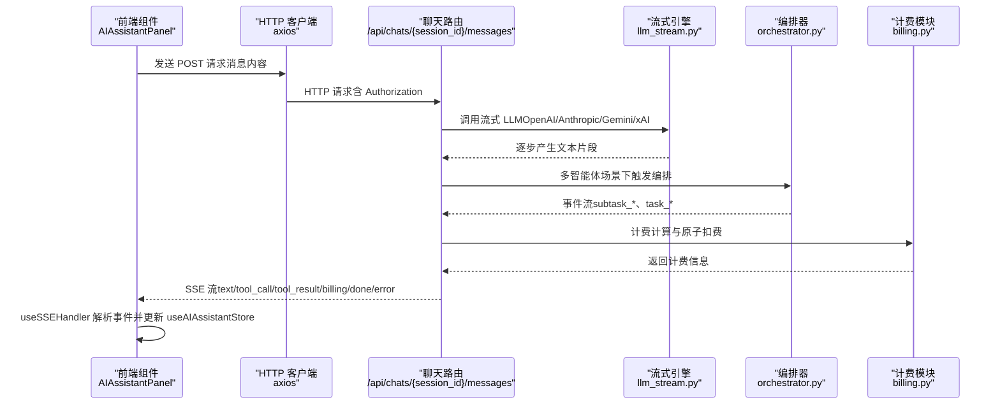
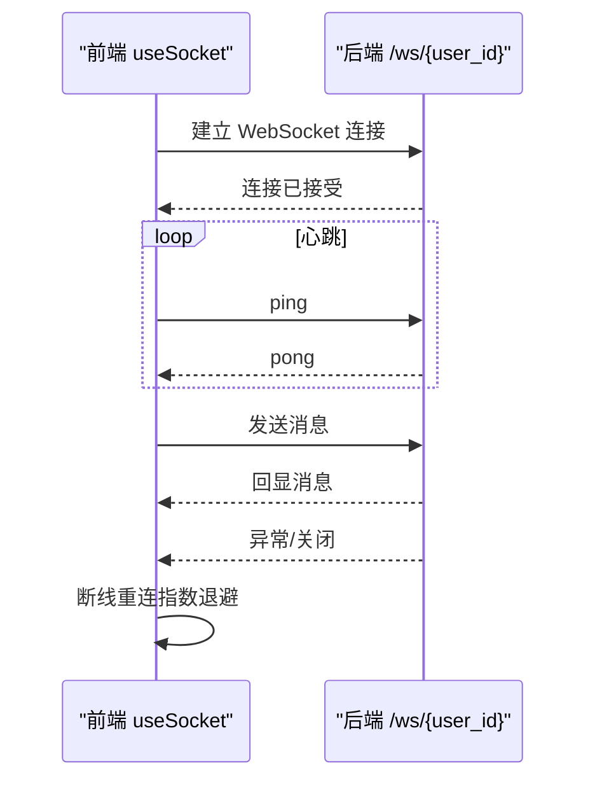
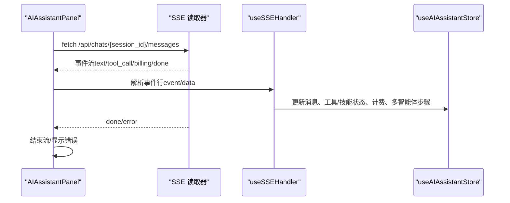
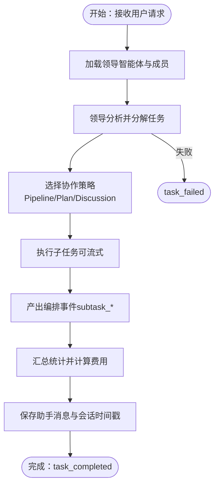
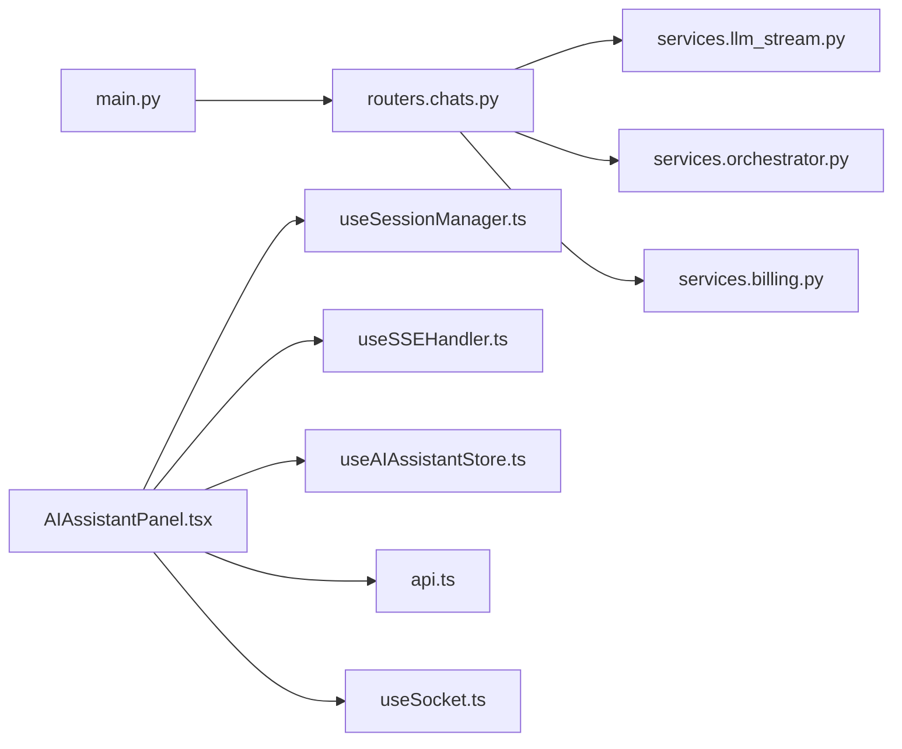

# 通信架构

<cite>
**本文引用的文件**
- [backend/main.py](file://backend/main.py)
- [backend/routers/chats.py](file://backend/routers/chats.py)
- [backend/services/llm_stream.py](file://backend/services/llm_stream.py)
- [backend/services/orchestrator.py](file://backend/services/orchestrator.py)
- [backend/services/billing.py](file://backend/services/billing.py)
- [frontend/src/components/canvas/AIAssistantPanel.tsx](file://frontend/src/components/canvas/AIAssistantPanel.tsx)
- [frontend/src/components/ai-assistant/hooks/useSSEHandler.ts](file://frontend/src/components/ai-assistant/hooks/useSSEHandler.ts)
- [frontend/src/components/ai-assistant/hooks/useSessionManager.ts](file://frontend/src/components/ai-assistant/hooks/useSessionManager.ts)
- [frontend/src/store/useAIAssistantStore.ts](file://frontend/src/store/useAIAssistantStore.ts)
- [frontend/src/lib/api.ts](file://frontend/src/lib/api.ts)
- [frontend/src/hooks/useSocket.ts](file://frontend/src/hooks/useSocket.ts)
- [backend/schemas.py](file://backend/schemas.py)
</cite>

## 目录
1. [简介](#简介)
2. [项目结构](#项目结构)
3. [核心组件](#核心组件)
4. [架构总览](#架构总览)
5. [详细组件分析](#详细组件分析)
6. [依赖关系分析](#依赖关系分析)
7. [性能考虑](#性能考虑)
8. [故障排查指南](#故障排查指南)
9. [结论](#结论)
10. [附录](#附录)

## 简介
本文件系统性梳理 Infinite Game 的通信架构，围绕“多通道通信设计”展开，涵盖：
- RESTful API 设计与实现
- WebSocket 实时通信（连接管理、心跳、断线重连、消息路由）
- Server-Sent Events（SSE）流式通信（事件推送、连接保持、错误恢复）
- 跨组件通信模式（前端状态管理、事件总线、消息队列）
- 通信协议设计、性能优化与并发控制
- 具体实现示例与调试技巧

## 项目结构
后端采用 FastAPI，前端采用 Next.js + React，二者通过 HTTP API 交互；同时后端提供 SSE 流式接口，前端通过 fetch + ReadableStream 读取；WebSocket 在后端提供占位端点，前端提供 WebSocket 客户端 Hook。

图表来源
- [backend/main.py:110-174](file://backend/main.py#L110-L174)
- [backend/routers/chats.py:93-258](file://backend/routers/chats.py#L93-L258)
- [backend/services/llm_stream.py:79-147](file://backend/services/llm_stream.py#L79-L147)
- [backend/services/orchestrator.py:560-673](file://backend/services/orchestrator.py#L560-L673)
- [backend/services/billing.py:178-308](file://backend/services/billing.py#L178-L308)
- [frontend/src/components/canvas/AIAssistantPanel.tsx:114-178](file://frontend/src/components/canvas/AIAssistantPanel.tsx#L114-L178)
- [frontend/src/components/ai-assistant/hooks/useSSEHandler.ts:24-334](file://frontend/src/components/ai-assistant/hooks/useSSEHandler.ts#L24-L334)
- [frontend/src/hooks/useSocket.ts:3-42](file://frontend/src/hooks/useSocket.ts#L3-L42)

章节来源
- [backend/main.py:110-174](file://backend/main.py#L110-L174)
- [backend/routers/chats.py:93-258](file://backend/routers/chats.py#L93-L258)
- [frontend/src/components/canvas/AIAssistantPanel.tsx:114-178](file://frontend/src/components/canvas/AIAssistantPanel.tsx#L114-L178)
- [frontend/src/components/ai-assistant/hooks/useSSEHandler.ts:24-334](file://frontend/src/components/ai-assistant/hooks/useSSEHandler.ts#L24-L334)
- [frontend/src/hooks/useSocket.ts:3-42](file://frontend/src/hooks/useSocket.ts#L3-L42)

## 核心组件
- HTTP RESTful API
  - 路由：/api/chats（会话、消息、流式响应）
  - 客户端：axios（自动注入 Authorization，401 自动刷新）
- SSE 流式通信
  - 后端：/api/chats/{session_id}/messages 返回 StreamingResponse，事件类型包括 text、tool_call、tool_result、billing、done、error 等
  - 前端：AIAssistantPanel 通过 fetch + ReadableStream 逐行解析 event/data，useSSEHandler 根据事件类型更新状态
- WebSocket 实时通信
  - 后端：/ws/{user_id} 占位端点（接受连接、接收文本、回显）
  - 前端：useSocket 封装 WebSocket 连接、发送、断开
- 前端状态管理与事件总线
  - Zustand：useAIAssistantStore 管理消息、会话、面板尺寸与位置
  - 事件总线：useSSEHandler 将事件映射为 UI 状态变更
- 计费与并发控制
  - billing 模块提供原子扣费、退款、余额检查
  - llm_stream 与 orchestrator 通过异步生成器与并发策略保障流式体验

章节来源
- [backend/routers/chats.py:93-258](file://backend/routers/chats.py#L93-L258)
- [backend/services/llm_stream.py:79-147](file://backend/services/llm_stream.py#L79-L147)
- [backend/services/orchestrator.py:560-673](file://backend/services/orchestrator.py#L560-L673)
- [backend/services/billing.py:178-308](file://backend/services/billing.py#L178-L308)
- [frontend/src/components/canvas/AIAssistantPanel.tsx:114-178](file://frontend/src/components/canvas/AIAssistantPanel.tsx#L114-L178)
- [frontend/src/components/ai-assistant/hooks/useSSEHandler.ts:24-334](file://frontend/src/components/ai-assistant/hooks/useSSEHandler.ts#L24-L334)
- [frontend/src/store/useAIAssistantStore.ts:145-273](file://frontend/src/store/useAIAssistantStore.ts#L145-L273)
- [frontend/src/lib/api.ts:31-81](file://frontend/src/lib/api.ts#L31-L81)

## 架构总览
下图展示从前端到后端的关键通信路径与组件交互：

图表来源
- [backend/routers/chats.py:202-258](file://backend/routers/chats.py#L202-L258)
- [backend/services/llm_stream.py:79-147](file://backend/services/llm_stream.py#L79-L147)
- [backend/services/orchestrator.py:560-673](file://backend/services/orchestrator.py#L560-L673)
- [backend/services/billing.py:310-350](file://backend/services/billing.py#L310-L350)
- [frontend/src/components/canvas/AIAssistantPanel.tsx:114-178](file://frontend/src/components/canvas/AIAssistantPanel.tsx#L114-L178)
- [frontend/src/components/ai-assistant/hooks/useSSEHandler.ts:63-327](file://frontend/src/components/ai-assistant/hooks/useSSEHandler.ts#L63-L327)

## 详细组件分析

### RESTful API 设计与实现
- 路由组织
  - /api/chats：会话创建、列表、详情、消息增删、消息列表
  - /api/chats/{session_id}/messages：发送消息并返回 SSE 流
- 响应与状态码
  - 成功：200/201/204
  - 资源不存在：404
  - 权限不足/未认证：401/403
  - 业务错误（如积分不足）：402
  - 请求过于频繁：429
- 错误响应格式
  - 前端 axios 拦截器对 401 进行令牌刷新与重试队列处理
- 认证与授权
  - axios 自动附加 Authorization: Bearer token
  - 后端中间件与依赖注入确保访问范围与权限校验

章节来源
- [backend/routers/chats.py:100-200](file://backend/routers/chats.py#L100-L200)
- [backend/routers/chats.py:202-258](file://backend/routers/chats.py#L202-L258)
- [frontend/src/lib/api.ts:31-81](file://frontend/src/lib/api.ts#L31-L81)
- [backend/schemas.py:13-57](file://backend/schemas.py#L13-L57)

### WebSocket 实时通信
- 后端端点
  - /ws/{user_id}：占位实现，接受连接、循环读取文本并回显，异常时关闭连接
- 前端客户端
  - useSocket：基于浏览器 WebSocket API，负责连接生命周期、消息收发、断开清理
- 连接管理建议
  - 心跳：建议在应用层发送 ping/pong（例如每 20-30 秒），后端在收到 ping 时回 pong
  - 断线重连：指数退避 + 最大重试次数；区分网络错误与业务错误
  - 消息路由：按房间/会话维度路由，避免广播风暴
  - 并发控制：限制每个会话的并发连接数，避免资源耗尽

图表来源
- [backend/main.py:160-171](file://backend/main.py#L160-L171)
- [frontend/src/hooks/useSocket.ts:3-42](file://frontend/src/hooks/useSocket.ts#L3-L42)

章节来源
- [backend/main.py:160-171](file://backend/main.py#L160-L171)
- [frontend/src/hooks/useSocket.ts:3-42](file://frontend/src/hooks/useSocket.ts#L3-L42)

### Server-Sent Events（SSE）流式通信
- 后端实现
  - /api/chats/{session_id}/messages 返回 StreamingResponse，媒体类型为 text/event-stream
  - 事件类型：text（增量文本）、tool_call/tool_result（工具调用开始/完成）、skill_call/skill_loaded（技能加载）、billing（计费信息）、canvas_updated（画布更新）、done/error（结束/错误）
  - 事件格式：每行 event: 与 data:，以空行分隔
- 前端实现
  - AIAssistantPanel：通过 fetch 获取 ReadableStream，逐行解析事件与数据
  - useSSEHandler：根据事件类型更新消息、工具/技能调用状态、多智能体步骤、计费信息与画布同步
  - useSessionManager：负责会话创建、Agent 切换、消息历史加载
- 连接保持与错误恢复
  - 连接保持：服务端设置 Cache-Control: no-cache、Connection: keep-alive、X-Accel-Buffering: no
  - 错误恢复：done 事件表示流结束；error 事件用于前端显示错误；前端在中断时可发起重试或提示用户

图表来源
- [backend/routers/chats.py:250-258](file://backend/routers/chats.py#L250-L258)
- [frontend/src/components/canvas/AIAssistantPanel.tsx:143-168](file://frontend/src/components/canvas/AIAssistantPanel.tsx#L143-L168)
- [frontend/src/components/ai-assistant/hooks/useSSEHandler.ts:52-327](file://frontend/src/components/ai-assistant/hooks/useSSEHandler.ts#L52-L327)
- [frontend/src/store/useAIAssistantStore.ts:145-273](file://frontend/src/store/useAIAssistantStore.ts#L145-L273)

章节来源
- [backend/routers/chats.py:250-258](file://backend/routers/chats.py#L250-L258)
- [frontend/src/components/canvas/AIAssistantPanel.tsx:143-168](file://frontend/src/components/canvas/AIAssistantPanel.tsx#L143-L168)
- [frontend/src/components/ai-assistant/hooks/useSSEHandler.ts:52-327](file://frontend/src/components/ai-assistant/hooks/useSSEHandler.ts#L52-L327)
- [frontend/src/store/useAIAssistantStore.ts:145-273](file://frontend/src/store/useAIAssistantStore.ts#L145-L273)

### 多智能体协作与事件编排
- 动态编排器（DynamicOrchestrator）
  - 根据领导智能体配置的任务分解策略（Pipeline/Plan/Discussion）选择具体协作模式
  - 事件流：task_start、task_decomposed、subtask_*、task_completed/task_failed、review_* 等
- 事件到 SSE 的映射
  - orchestrator.py 的 OrchestrationEvent.to_sse() 将事件转换为 SSE 文本
  - chats 路由在多智能体模式下直接 yield 事件，无需额外封装
- 计费与统计
  - 在任务完成后汇总 token、图像生成数量、搜索次数等，计算总费用并进行原子扣费

图表来源
- [backend/services/orchestrator.py:560-673](file://backend/services/orchestrator.py#L560-L673)
- [backend/routers/chats.py:261-344](file://backend/routers/chats.py#L261-L344)
- [backend/services/billing.py:310-350](file://backend/services/billing.py#L310-L350)

章节来源
- [backend/services/orchestrator.py:560-673](file://backend/services/orchestrator.py#L560-L673)
- [backend/routers/chats.py:261-344](file://backend/routers/chats.py#L261-L344)
- [backend/services/billing.py:310-350](file://backend/services/billing.py#L310-L350)

### 跨组件通信模式
- 前端状态管理（Zustand）
  - useAIAssistantStore：集中管理消息、会话、Agent、面板尺寸与位置、画布会话缓存
  - 通过 actions 更新状态，避免深层 props 传递
- 事件总线（SSE）
  - useSSEHandler 将后端事件映射为 UI 状态变更，实现“事件驱动”的组件更新
- 消息队列（概念性）
  - 建议在复杂场景引入消息队列（如 Redis/RabbitMQ）进行跨服务解耦与削峰填谷
  - 当前项目以内存异步生成器为主，适合单实例部署

章节来源
- [frontend/src/store/useAIAssistantStore.ts:145-273](file://frontend/src/store/useAIAssistantStore.ts#L145-L273)
- [frontend/src/components/ai-assistant/hooks/useSSEHandler.ts:63-327](file://frontend/src/components/ai-assistant/hooks/useSSEHandler.ts#L63-L327)

### 通信协议设计与并发控制
- 协议设计
  - SSE：事件/数据键值对，事件名小写，数据为 JSON 字符串
  - WebSocket：文本帧承载消息，建议扩展为 JSON 结构（含 type/payload）
- 并发控制
  - 流式生成器：llm_stream 与 orchestrator 使用 async for 控制并发与背压
  - 原子操作：billing 模块使用 UPDATE ... WHERE ... 保证余额一致性
  - 请求取消：AIAssistantPanel 使用 AbortController 取消上一次请求

章节来源
- [backend/services/llm_stream.py:79-147](file://backend/services/llm_stream.py#L79-L147)
- [backend/services/orchestrator.py:163-248](file://backend/services/orchestrator.py#L163-L248)
- [backend/services/billing.py:178-308](file://backend/services/billing.py#L178-L308)
- [frontend/src/components/canvas/AIAssistantPanel.tsx:107-110](file://frontend/src/components/canvas/AIAssistantPanel.tsx#L107-L110)

## 依赖关系分析
- 后端依赖链
  - main.py：注册路由、CORS、WebSocket 端点
  - routers.chats：HTTP 路由、SSE 生成器、消息持久化
  - services.llm_stream：供应商适配（OpenAI/Anthropic/Gemini/xAI）
  - services.orchestrator：多智能体编排与事件流
  - services.billing：计费与余额原子操作
- 前端依赖链
  - AIAssistantPanel：发起 HTTP 请求、消费 SSE、管理会话
  - useSSEHandler：事件解析与状态更新
  - useSessionManager：会话生命周期管理
  - useAIAssistantStore：全局状态
  - useSocket：WebSocket 客户端

图表来源
- [backend/main.py:138-152](file://backend/main.py#L138-L152)
- [backend/routers/chats.py:93-258](file://backend/routers/chats.py#L93-L258)
- [backend/services/llm_stream.py:79-147](file://backend/services/llm_stream.py#L79-L147)
- [backend/services/orchestrator.py:560-673](file://backend/services/orchestrator.py#L560-L673)
- [backend/services/billing.py:178-308](file://backend/services/billing.py#L178-L308)
- [frontend/src/components/canvas/AIAssistantPanel.tsx:114-178](file://frontend/src/components/canvas/AIAssistantPanel.tsx#L114-L178)
- [frontend/src/components/ai-assistant/hooks/useSSEHandler.ts:24-334](file://frontend/src/components/ai-assistant/hooks/useSSEHandler.ts#L24-L334)
- [frontend/src/components/ai-assistant/hooks/useSessionManager.ts:12-178](file://frontend/src/components/ai-assistant/hooks/useSessionManager.ts#L12-L178)
- [frontend/src/store/useAIAssistantStore.ts:145-273](file://frontend/src/store/useAIAssistantStore.ts#L145-L273)
- [frontend/src/lib/api.ts:31-81](file://frontend/src/lib/api.ts#L31-L81)
- [frontend/src/hooks/useSocket.ts:3-42](file://frontend/src/hooks/useSocket.ts#L3-L42)

章节来源
- [backend/main.py:138-152](file://backend/main.py#L138-L152)
- [backend/routers/chats.py:93-258](file://backend/routers/chats.py#L93-L258)
- [frontend/src/components/canvas/AIAssistantPanel.tsx:114-178](file://frontend/src/components/canvas/AIAssistantPanel.tsx#L114-L178)

## 性能考虑
- 流式传输
  - SSE：后端设置 no-cache 与 keep-alive，前端按行解析，降低延迟
  - LLM 流式：llm_stream 按块增量返回，避免一次性缓冲
- 并发与背压
  - orchestrator 的异步生成器与 asyncio.gather 控制并行度
  - 前端使用 AbortController 及时取消过期请求
- 计费与一致性
  - 原子扣费避免竞态导致的透支
- 前端渲染
  - Zustand 精细化状态切片，减少不必要的重渲染

[本节为通用指导，无需特定文件引用]

## 故障排查指南
- SSE 无法接收事件
  - 检查后端响应头：Cache-Control、Connection、X-Accel-Buffering
  - 检查前端解析逻辑：是否正确识别 event/data 行与空行分隔
  - 参考：[backend/routers/chats.py:250-258](file://backend/routers/chats.py#L250-L258)，[frontend/src/components/canvas/AIAssistantPanel.tsx:143-168](file://frontend/src/components/canvas/AIAssistantPanel.tsx#L143-L168)
- 401 未授权与令牌刷新
  - axios 拦截器自动处理 401，队列等待与重试
  - 参考：[frontend/src/lib/api.ts:31-81](file://frontend/src/lib/api.ts#L31-L81)
- 积分不足
  - 后端在发送消息前进行余额检查；前端收到 402 时提示充值
  - 参考：[backend/routers/chats.py:236-239](file://backend/routers/chats.py#L236-L239)，[frontend/src/components/canvas/AIAssistantPanel.tsx:133-141](file://frontend/src/components/canvas/AIAssistantPanel.tsx#L133-L141)
- WebSocket 连接异常
  - 检查 /ws/{user_id} 是否可达；确认前端 useSocket 的连接地址与断开回调
  - 参考：[backend/main.py:160-171](file://backend/main.py#L160-L171)，[frontend/src/hooks/useSocket.ts:3-42](file://frontend/src/hooks/useSocket.ts#L3-L42)
- 多智能体事件缺失
  - 确认领导智能体配置与成员 Agent 列表；检查 orchestrator 的策略选择与事件生成
  - 参考：[backend/services/orchestrator.py:560-673](file://backend/services/orchestrator.py#L560-L673)，[backend/routers/chats.py:261-344](file://backend/routers/chats.py#L261-L344)

章节来源
- [backend/routers/chats.py:236-239](file://backend/routers/chats.py#L236-L239)
- [backend/routers/chats.py:250-258](file://backend/routers/chats.py#L250-L258)
- [frontend/src/components/canvas/AIAssistantPanel.tsx:133-141](file://frontend/src/components/canvas/AIAssistantPanel.tsx#L133-L141)
- [frontend/src/lib/api.ts:31-81](file://frontend/src/lib/api.ts#L31-L81)
- [backend/main.py:160-171](file://backend/main.py#L160-L171)
- [frontend/src/hooks/useSocket.ts:3-42](file://frontend/src/hooks/useSocket.ts#L3-L42)
- [backend/services/orchestrator.py:560-673](file://backend/services/orchestrator.py#L560-L673)

## 结论
Infinite Game 的通信架构以 FastAPI 为核心，结合 SSE 流式传输与 RESTful API，实现了低延迟、可观测的多智能体协作体验；前端通过 Zustand 与事件总线实现清晰的状态管理与组件解耦。WebSocket 端点作为占位实现，为后续实时互动（如多用户协作、画布共享）预留空间。建议在生产环境中完善 WebSocket 心跳与断线重连、引入消息队列与限流策略，并持续优化计费与并发控制以提升稳定性与吞吐能力。

[本节为总结性内容，无需特定文件引用]

## 附录
- 关键实现示例路径
  - SSE 事件解析与状态更新：[frontend/src/components/ai-assistant/hooks/useSSEHandler.ts:52-327](file://frontend/src/components/ai-assistant/hooks/useSSEHandler.ts#L52-L327)
  - 发送消息并消费 SSE：[frontend/src/components/canvas/AIAssistantPanel.tsx:114-178](file://frontend/src/components/canvas/AIAssistantPanel.tsx#L114-L178)
  - 会话管理与 Agent 切换：[frontend/src/components/ai-assistant/hooks/useSessionManager.ts:49-131](file://frontend/src/components/ai-assistant/hooks/useSessionManager.ts#L49-L131)
  - 原子扣费与余额检查：[backend/services/billing.py:178-308](file://backend/services/billing.py#L178-L308)
  - LLM 流式供应商适配：[backend/services/llm_stream.py:79-147](file://backend/services/llm_stream.py#L79-L147)
  - 多智能体编排事件流：[backend/services/orchestrator.py:560-673](file://backend/services/orchestrator.py#L560-L673)

[本节为补充说明，无需特定文件引用]