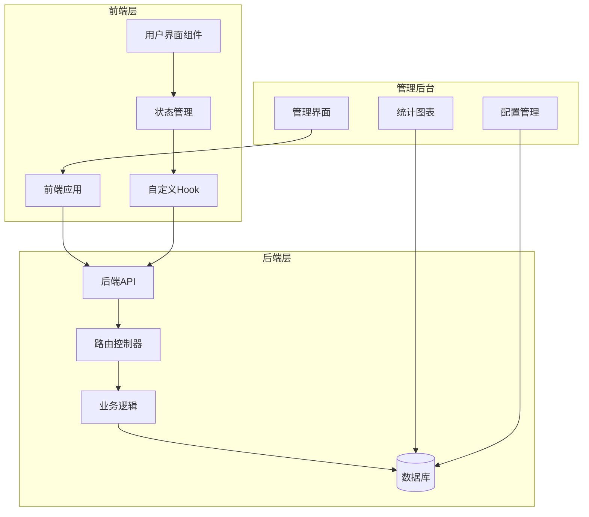
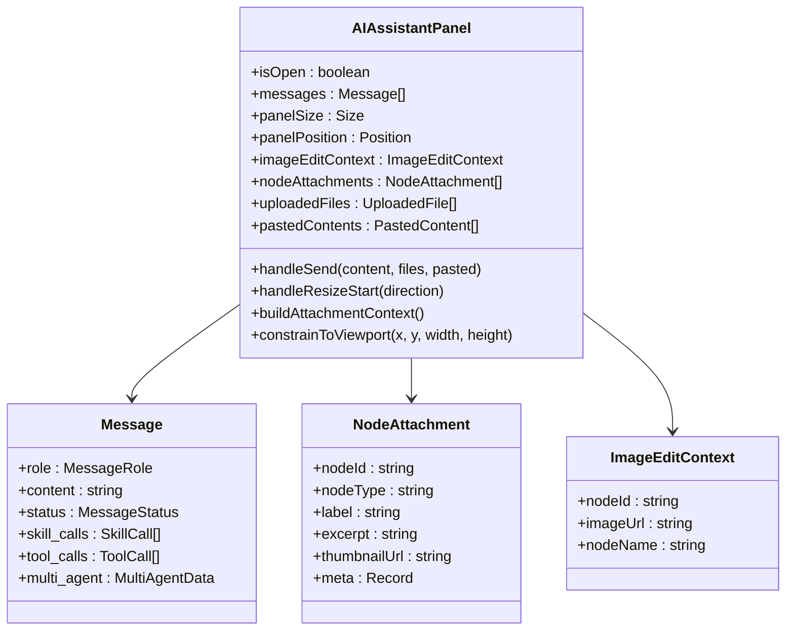
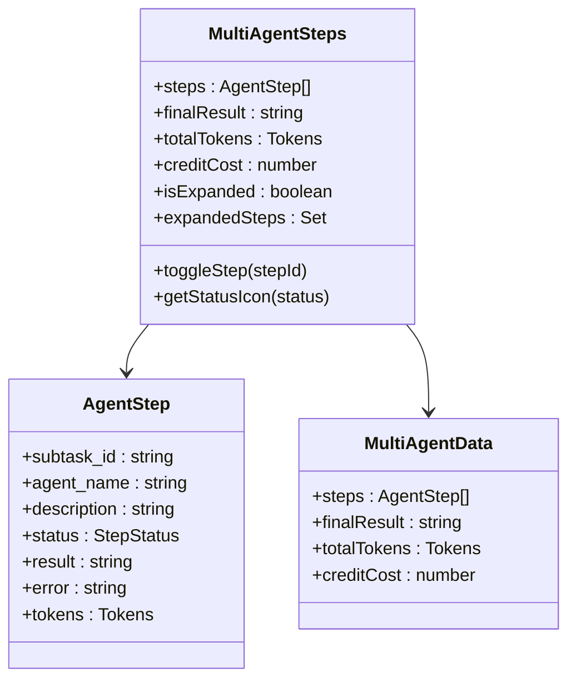
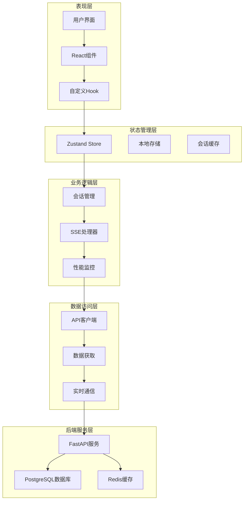
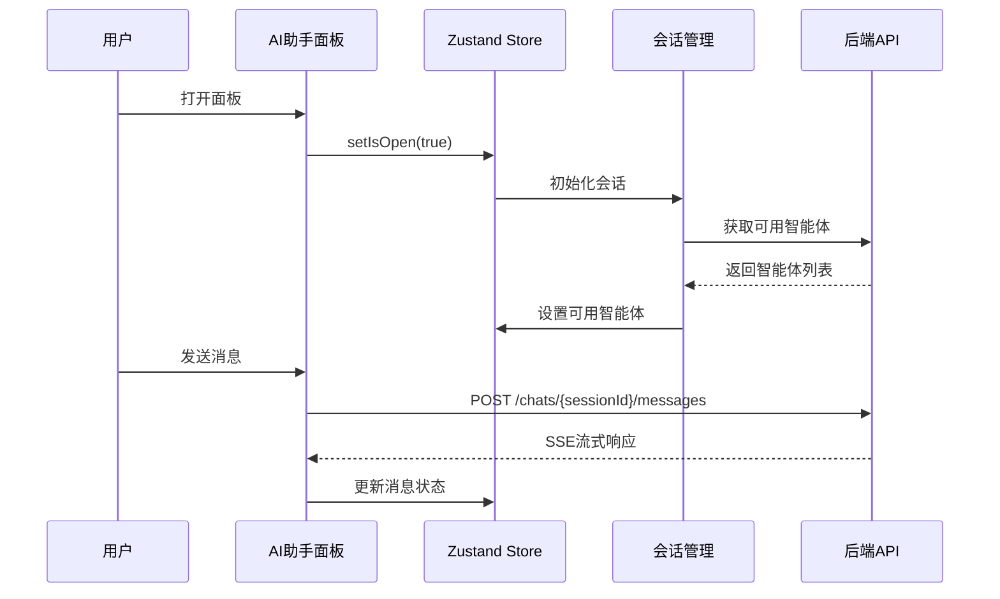
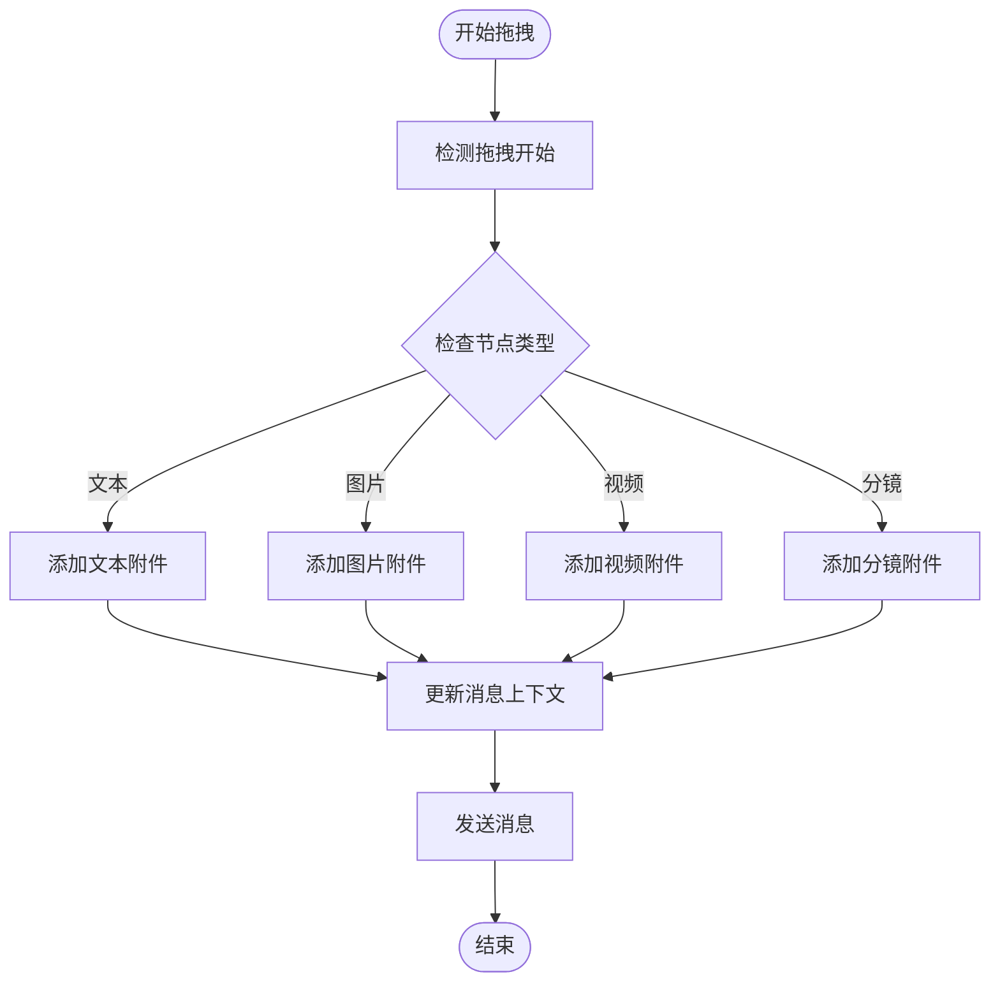
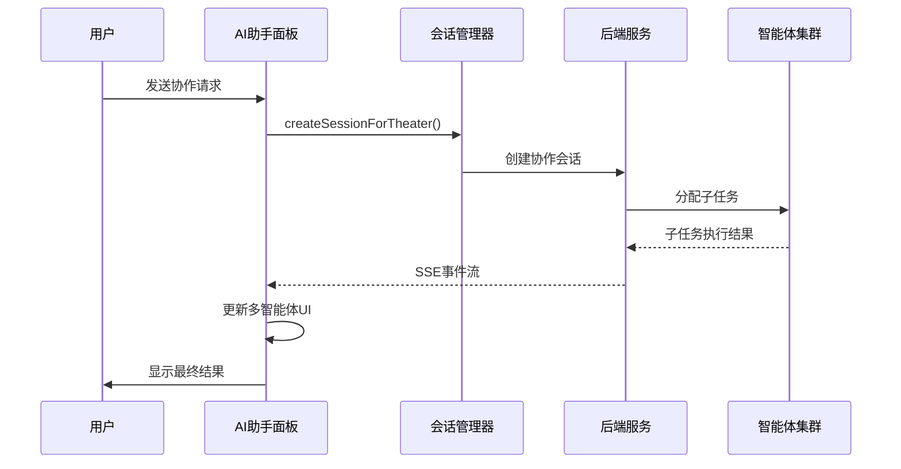
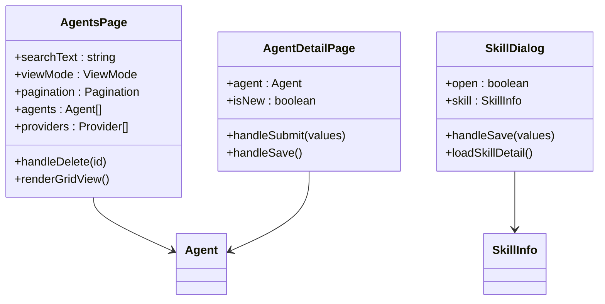
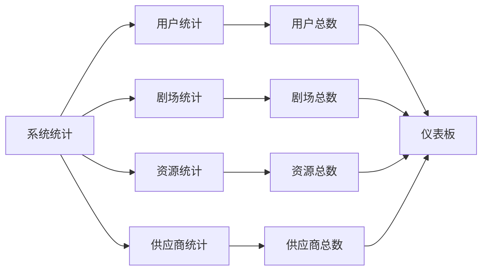
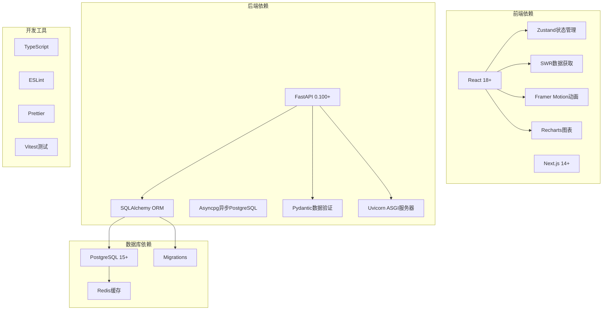

# 计划面板设计指南

<cite>
**本文档引用的文件**
- [AIAssistantPanel.tsx](file://frontend/src/components/canvas/AIAssistantPanel.tsx)
- [MultiAgentSteps.tsx](file://frontend/src/components/canvas/MultiAgentSteps.tsx)
- [useAIAssistantStore.ts](file://frontend/src/store/useAIAssistantStore.ts)
- [useSessionManager.ts](file://frontend/src/components/ai-assistant/hooks/useSessionManager.ts)
- [useSSEHandler.ts](file://frontend/src/components/ai-assistant/hooks/useSSEHandler.ts)
- [ScriptNode.tsx](file://frontend/src/components/canvas/ScriptNode.tsx)
- [theaterApi.ts](file://frontend/src/lib/theaterApi.ts)
- [admin.ts](file://backend/routers/admin.py)
- [page.tsx](file://backend/admin/src/app/admin/page.tsx)
- [page.tsx](file://backend/admin/src/app/admin/agents/page.tsx)
- [page.tsx](file://backend/admin/src/app/admin/agents/[id]/page.tsx)
- [page.tsx](file://backend/admin/src/app/admin/skills/page.tsx)
- [SkillDialog.tsx](file://backend/admin/src/app/admin/skills/SkillDialog.tsx)
</cite>

## 目录
1. [简介](#简介)
2. [项目结构](#项目结构)
3. [核心组件](#核心组件)
4. [架构概览](#架构概览)
5. [详细组件分析](#详细组件分析)
6. [依赖关系分析](#依赖关系分析)
7. [性能考虑](#性能考虑)
8. [故障排除指南](#故障排除指南)
9. [结论](#结论)

## 简介

计划面板设计指南旨在为无限游戏项目中的AI助手面板提供全面的设计规范和实现指导。该系统集成了智能体管理、多智能体协作、画布交互和实时通信等功能，为用户提供直观高效的创作体验。

系统采用前后端分离架构，前端使用Next.js和React构建现代化的用户界面，后端基于FastAPI提供RESTful API服务。核心功能包括AI对话面板、多智能体协作、画布节点管理和技能系统集成。

## 项目结构

项目采用模块化的双端架构设计，主要分为以下层次：

**图表来源**
- [AIAssistantPanel.tsx:1-633](file://frontend/src/components/canvas/AIAssistantPanel.tsx#L1-L633)
- [admin.ts:1-501](file://backend/routers/admin.py#L1-L501)

**章节来源**
- [AIAssistantPanel.tsx:1-633](file://frontend/src/components/canvas/AIAssistantPanel.tsx#L1-L633)
- [page.tsx:1-109](file://backend/admin/src/app/admin/page.tsx#L1-L109)

## 核心组件

### AI助手面板组件

AI助手面板是整个系统的核心交互组件，提供了完整的对话体验和多智能体协作功能。

**图表来源**
- [AIAssistantPanel.tsx:51-633](file://frontend/src/components/canvas/AIAssistantPanel.tsx#L51-L633)
- [useAIAssistantStore.ts:50-121](file://frontend/src/store/useAIAssistantStore.ts#L50-L121)

### 多智能体协作组件

多智能体协作组件提供了复杂的任务分解和执行跟踪功能：

**图表来源**
- [MultiAgentSteps.tsx:7-26](file://frontend/src/components/canvas/MultiAgentSteps.tsx#L7-L26)
- [useAIAssistantStore.ts:21-38](file://frontend/src/store/useAIAssistantStore.ts#L21-L38)

**章节来源**
- [AIAssistantPanel.tsx:1-633](file://frontend/src/components/canvas/AIAssistantPanel.tsx#L1-L633)
- [MultiAgentSteps.tsx:1-128](file://frontend/src/components/canvas/MultiAgentSteps.tsx#L1-L128)

## 架构概览

系统采用分层架构设计，实现了清晰的关注点分离：

**图表来源**
- [useSessionManager.ts:12-225](file://frontend/src/components/ai-assistant/hooks/useSessionManager.ts#L12-L225)
- [useSSEHandler.ts:25-390](file://frontend/src/components/ai-assistant/hooks/useSSEHandler.ts#L25-L390)
- [admin.ts:1-501](file://backend/routers/admin.py#L1-L501)

## 详细组件分析

### AI助手面板详细分析

AI助手面板是一个复杂的交互组件，集成了多种功能特性：

#### 面板状态管理

面板使用Zustand进行状态管理，支持多画布会话切换和持久化存储：

**图表来源**
- [AIAssistantPanel.tsx:208-317](file://frontend/src/components/canvas/AIAssistantPanel.tsx#L208-L317)
- [useSessionManager.ts:52-123](file://frontend/src/components/ai-assistant/hooks/useSessionManager.ts#L52-L123)

#### 附件拖拽功能

面板支持从画布拖拽节点附件到AI面板：

**图表来源**
- [AIAssistantPanel.tsx:36-49](file://frontend/src/components/canvas/AIAssistantPanel.tsx#L36-L49)
- [useAIAssistantStore.ts:88-96](file://frontend/src/store/useAIAssistantStore.ts#L88-L96)

#### 多智能体协作流程

系统支持复杂的多智能体协作模式：

**图表来源**
- [useSessionManager.ts:52-123](file://frontend/src/components/ai-assistant/hooks/useSessionManager.ts#L52-L123)
- [useSSEHandler.ts:184-277](file://frontend/src/components/ai-assistant/hooks/useSSEHandler.ts#L184-L277)

**章节来源**
- [AIAssistantPanel.tsx:1-633](file://frontend/src/components/canvas/AIAssistantPanel.tsx#L1-L633)
- [useAIAssistantStore.ts:1-449](file://frontend/src/store/useAIAssistantStore.ts#L1-L449)
- [useSessionManager.ts:1-226](file://frontend/src/components/ai-assistant/hooks/useSessionManager.ts#L1-L226)
- [useSSEHandler.ts:1-391](file://frontend/src/components/ai-assistant/hooks/useSSEHandler.ts#L1-L391)

### 管理后台组件分析

管理后台提供了完整的系统管理功能：

#### 智能体管理界面

智能体管理界面支持列表和网格两种视图模式：

**图表来源**
- [page.tsx:48-315](file://backend/admin/src/app/admin/agents/page.tsx#L48-L315)
- [page.tsx:19-118](file://backend/admin/src/app/admin/agents/[id]/page.tsx#L19-L118)
- [SkillDialog.tsx:44-235](file://backend/admin/src/app/admin/skills/SkillDialog.tsx#L44-L235)

#### 系统统计面板

管理后台包含完整的系统统计功能：

**图表来源**
- [page.tsx:18-23](file://backend/admin/src/app/admin/page.tsx#L18-L23)
- [admin.ts:29-47](file://backend/routers/admin.py#L29-L47)

**章节来源**
- [page.tsx:1-315](file://backend/admin/src/app/admin/agents/page.tsx#L1-L315)
- [page.tsx:1-149](file://backend/admin/src/app/admin/agents/[id]/page.tsx#L1-L149)
- [page.tsx:1-185](file://backend/admin/src/app/admin/skills/page.tsx#L1-L185)
- [SkillDialog.tsx:1-235](file://backend/admin/src/app/admin/skills/SkillDialog.tsx#L1-L235)

## 依赖关系分析

系统各组件之间的依赖关系如下：

**图表来源**
- [AIAssistantPanel.tsx:1-20](file://frontend/src/components/canvas/AIAssistantPanel.tsx#L1-L20)
- [admin.ts:1-17](file://backend/routers/admin.py#L1-L17)

**章节来源**
- [AIAssistantPanel.tsx:1-633](file://frontend/src/components/canvas/AIAssistantPanel.tsx#L1-L633)
- [admin.ts:1-501](file://backend/routers/admin.py#L1-L501)

## 性能考虑

系统在设计时充分考虑了性能优化：

### 前端性能优化

1. **虚拟滚动优化**
   - 使用虚拟列表渲染大量消息
   - 可配置的overscan数量减少重绘
   - 智能滚动行为控制

2. **状态管理优化**
   - 局部状态更新避免全量重渲染
   - 持久化存储减少初始化时间
   - 会话缓存提升切换效率

3. **资源加载优化**
   - 懒加载非关键组件
   - 图片和视频预加载策略
   - 内存泄漏防护

### 后端性能优化

1. **数据库查询优化**
   - 分页查询避免全表扫描
   - 连接池管理
   - 索引优化

2. **API性能优化**
   - 异步处理长耗时任务
   - 缓存策略
   - 请求限流

## 故障排除指南

### 常见问题诊断

#### 会话初始化失败

**症状**: 打开AI面板时无法创建或加载会话

**排查步骤**:
1. 检查网络连接状态
2. 验证用户认证状态
3. 查看浏览器控制台错误
4. 检查后端API响应

**解决方案**:
- 确认用户已登录
- 检查代理配置
- 验证API端点可达性

#### SSE连接中断

**症状**: 实时消息流中断

**排查步骤**:
1. 检查防火墙设置
2. 验证WebSocket支持
3. 查看网络超时日志

**解决方案**:
- 配置反向代理支持WebSocket
- 调整超时参数
- 实现自动重连机制

#### 性能问题

**症状**: 页面响应缓慢

**排查步骤**:
1. 检查内存使用情况
2. 分析组件渲染次数
3. 监控API响应时间

**解决方案**:
- 实施组件懒加载
- 优化状态更新
- 添加缓存策略

**章节来源**
- [useSessionManager.ts:192-212](file://frontend/src/components/ai-assistant/hooks/useSessionManager.ts#L192-L212)
- [useSSEHandler.ts:365-383](file://frontend/src/components/ai-assistant/hooks/useSSEHandler.ts#L365-L383)

## 结论

计划面板设计指南为无限游戏项目的AI助手系统提供了完整的技术规范和实现指导。系统通过模块化设计、状态管理和性能优化，实现了高效稳定的用户体验。

关键设计要点包括：
- 清晰的组件职责分离
- 强大的状态管理机制
- 灵活的多智能体协作模式
- 完善的管理后台功能
- 全面的性能优化策略

该设计为未来的功能扩展和技术演进奠定了坚实基础，能够满足复杂创作场景的需求。