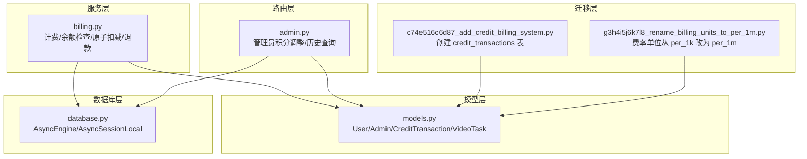
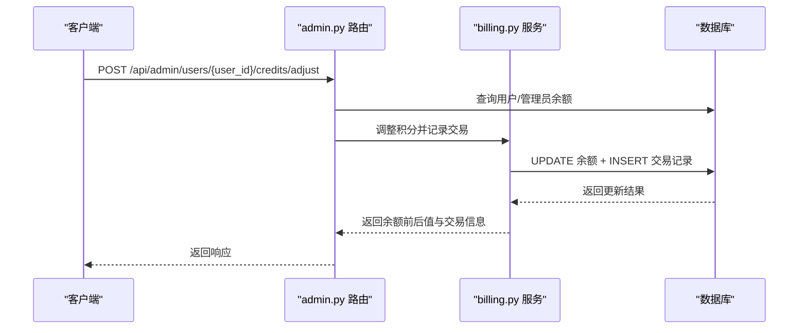
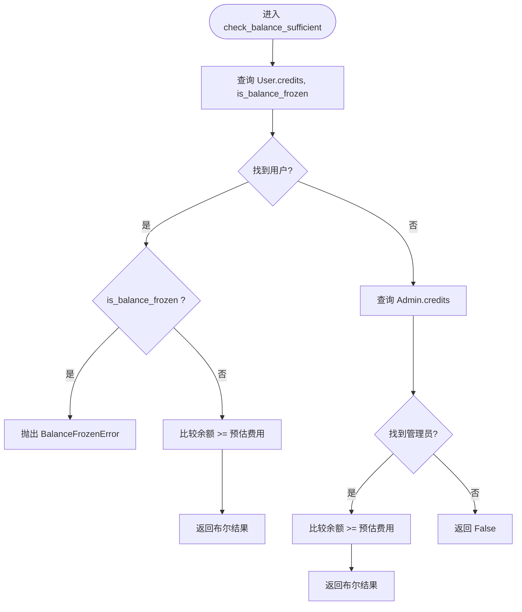
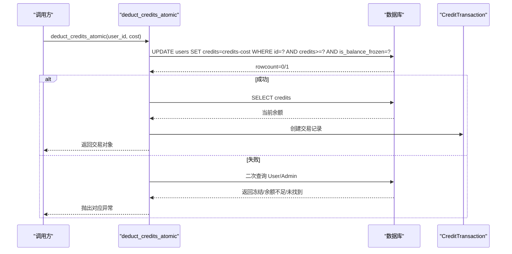
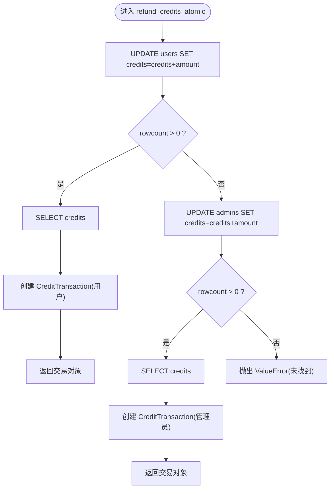
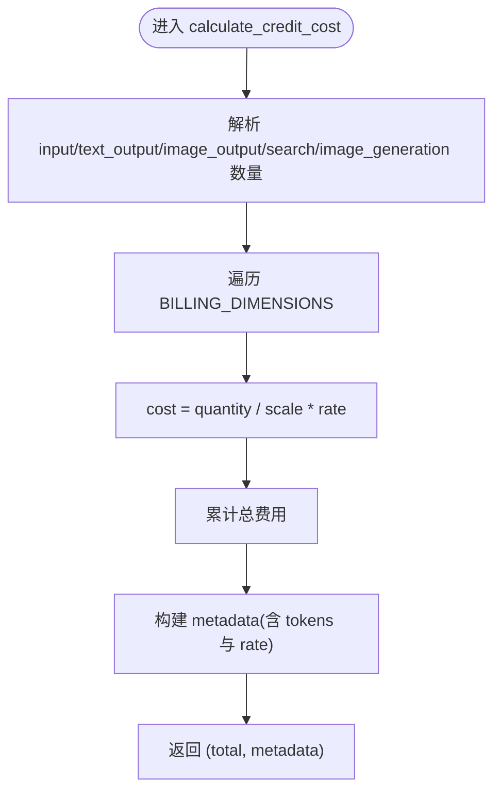
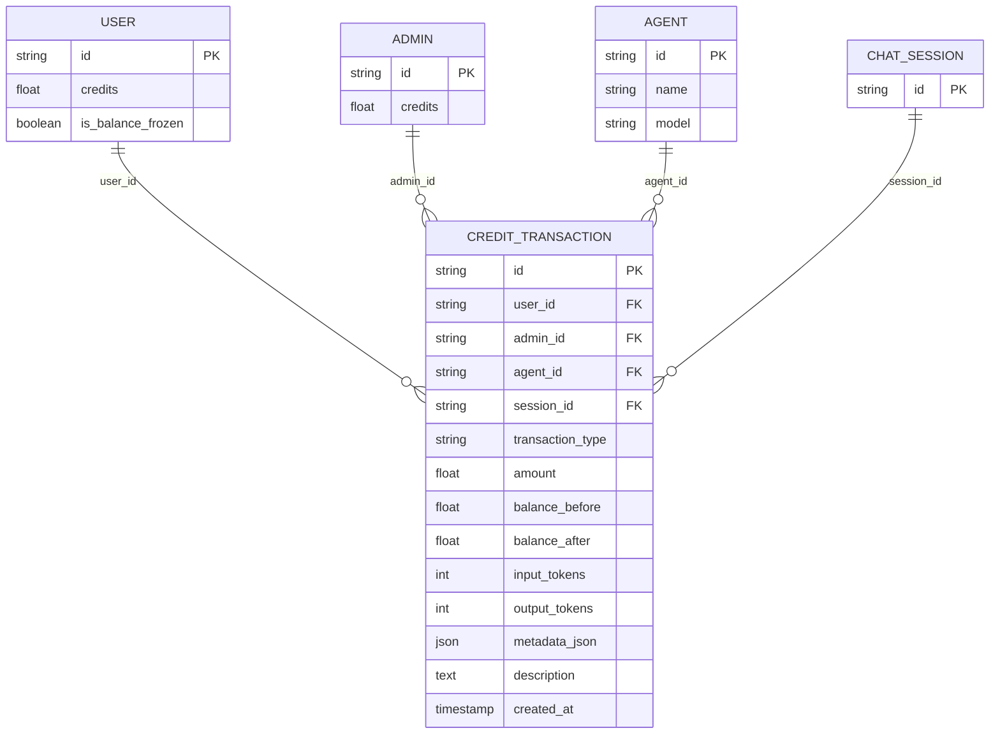
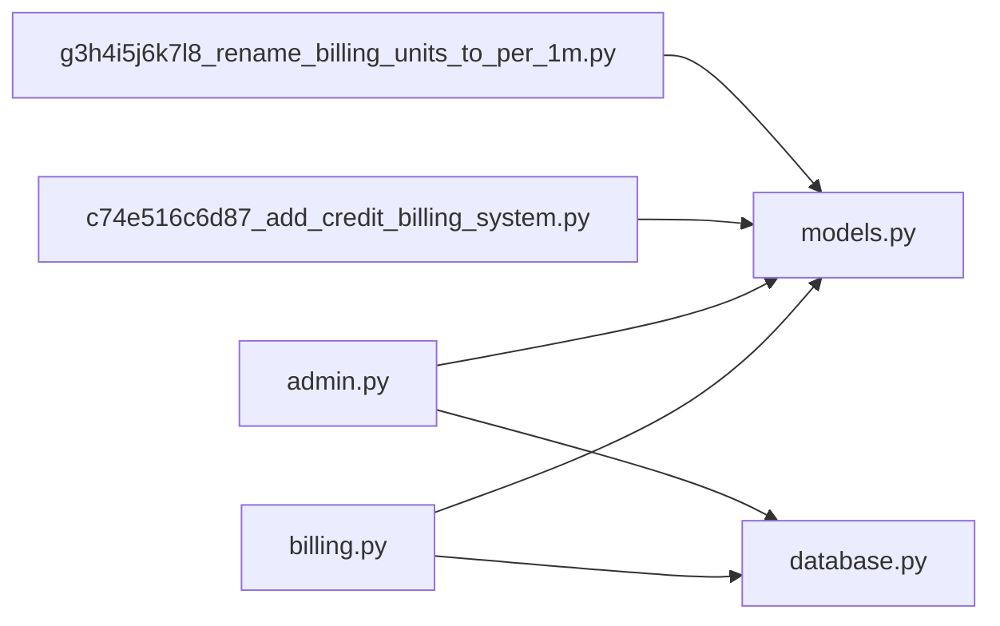

# 积分管理系统

<cite>
**本文档引用的文件**
- [billing.py](file://backend/services/billing.py)
- [models.py](file://backend/models.py)
- [database.py](file://backend/database.py)
- [admin.py](file://backend/routers/admin.py)
- [c74e516c6d87_add_credit_billing_system.py](file://backend/migrations/versions/c74e516c6d87_add_credit_billing_system.py)
- [g3h4i5j6k7l8_rename_billing_units_to_per_1m.py](file://backend/migrations/versions/g3h4i5j6k7l8_rename_billing_units_to_per_1m.py)
</cite>

## 目录
1. [简介](#简介)
2. [项目结构](#项目结构)
3. [核心组件](#核心组件)
4. [架构概览](#架构概览)
5. [详细组件分析](#详细组件分析)
6. [依赖关系分析](#依赖关系分析)
7. [性能考虑](#性能考虑)
8. [故障排查指南](#故障排查指南)
9. [结论](#结论)

## 简介
本文件面向积分管理系统，围绕以下目标进行深入文档化：
- 积分余额检查机制：check_balance_sufficient 的实现原理与并发安全保证
- 积分扣减与退还的原子性操作：deduct_credits_atomic 与 refund_credits_atomic 的事务处理逻辑
- 积分计算算法：calculate_credit_cost 与 calculate_video_credit_cost 的计费策略
- 积分冻结机制与异常处理：InsufficientCreditsError 与 BalanceFrozenError 的使用场景
- 积分交易记录的创建与管理：CreditTransaction 模型的字段定义与数据流转
- 性能优化策略与并发控制方案

## 项目结构
积分系统主要由以下模块构成：
- 服务层：billing.py 提供计费、余额检查、原子扣减与退款等核心逻辑
- 模型层：models.py 定义 User、Admin、CreditTransaction 等数据模型
- 数据库层：database.py 提供异步数据库引擎与会话工厂
- 路由层：admin.py 提供管理员端积分调整与历史查询接口
- 迁移层：Alembic 迁移脚本定义 CreditTransaction 表与 Agent 费率字段变更

图表来源
- [billing.py:1-388](file://backend/services/billing.py#L1-L388)
- [models.py:1-447](file://backend/models.py#L1-L447)
- [database.py:1-31](file://backend/database.py#L1-L31)
- [admin.py:1-501](file://backend/routers/admin.py#L1-L501)
- [c74e516c6d87_add_credit_billing_system.py:1-67](file://backend/migrations/versions/c74e516c6d87_add_credit_billing_system.py#L1-L67)
- [g3h4i5j6k7l8_rename_billing_units_to_per_1m.py:1-42](file://backend/migrations/versions/g3h4i5j6k7l8_rename_billing_units_to_per_1m.py#L1-L42)

章节来源
- [billing.py:1-388](file://backend/services/billing.py#L1-L388)
- [models.py:1-447](file://backend/models.py#L1-L447)
- [database.py:1-31](file://backend/database.py#L1-L31)
- [admin.py:1-501](file://backend/routers/admin.py#L1-L501)
- [c74e516c6d87_add_credit_billing_system.py:1-67](file://backend/migrations/versions/c74e516c6d87_add_credit_billing_system.py#L1-L67)
- [g3h4i5j6k7l8_rename_billing_units_to_per_1m.py:1-42](file://backend/migrations/versions/g3h4i5j6k7l8_rename_billing_units_to_per_1m.py#L1-L42)

## 核心组件
- 余额检查：check_balance_sufficient 在数据库层面执行原子性检查，同时验证 is_balance_frozen 冻结状态
- 原子扣减：deduct_credits_atomic 使用 UPDATE ... WHERE ... 条件更新，结合行计数判断与二次查询定位失败原因
- 原子退款：refund_credits_atomic 同样使用条件更新，支持用户与管理员两种主体
- 计费算法：calculate_credit_cost 与 calculate_video_credit_cost 采用映射表驱动，避免分支判断，提升可维护性
- 异常体系：InsufficientCreditsError 与 BalanceFrozenError 明确区分“余额不足”和“账户冻结”
- 交易记录：CreditTransaction 模型记录每次积分变动的上下文与明细

章节来源
- [billing.py:45-84](file://backend/services/billing.py#L45-L84)
- [billing.py:178-308](file://backend/services/billing.py#L178-L308)
- [billing.py:86-176](file://backend/services/billing.py#L86-L176)
- [billing.py:310-350](file://backend/services/billing.py#L310-L350)
- [billing.py:353-387](file://backend/services/billing.py#L353-L387)
- [models.py:261-281](file://backend/models.py#L261-L281)

## 架构概览
积分系统遵循“服务层-模型层-数据库层”的清晰分层，服务层通过 SQLAlchemy 异步会话与数据库交互，确保在高并发下的原子性与一致性；管理员端通过路由提供积分调整与历史查询能力。

图表来源
- [admin.py:141-187](file://backend/routers/admin.py#L141-L187)
- [billing.py:86-176](file://backend/services/billing.py#L86-L176)

## 详细组件分析

### 余额检查机制：check_balance_sufficient
- 功能概述
  - 原子性检查用户当前可用余额是否大于等于预估费用
  - 同时检查 is_balance_frozen 冻结状态，若冻结则抛出 BalanceFrozenError
  - 支持用户与管理员双重主体查询
- 并发安全保证
  - 通过一次 SELECT 查询余额与冻结状态，随后在扣减流程中再次使用条件更新确保一致性
  - 若冻结状态在检查后发生变更，原子更新仍会阻止不一致的扣减
- 失败路径
  - 未找到用户/管理员主体时返回 False
  - 冻结状态下直接抛出 BalanceFrozenError

图表来源
- [billing.py:45-84](file://backend/services/billing.py#L45-L84)

章节来源
- [billing.py:45-84](file://backend/services/billing.py#L45-L84)

### 原子扣减：deduct_credits_atomic
- 功能概述
  - 使用 UPDATE ... WHERE 条件更新实现原子扣减
  - 同时写入 CreditTransaction 记录，包含 balance_before/balance_after、amount、transaction_type 等
- 并发安全保证
  - UPDATE 语句在数据库层进行条件判断，rowcount=0 表示未发生更新，从而识别余额不足或冻结
  - 通过二次查询定位具体失败原因（冻结/余额不足/未找到主体）
- 错误处理
  - InsufficientCreditsError：余额不足
  - BalanceFrozenError：账户冻结
  - ValueError：用户/管理员不存在
  - 其他未知原因抛出通用异常

图表来源
- [billing.py:178-308](file://backend/services/billing.py#L178-L308)

章节来源
- [billing.py:178-308](file://backend/services/billing.py#L178-L308)

### 原子退款：refund_credits_atomic
- 功能概述
  - 原子性增加用户或管理员的积分余额
  - 支持用户与管理员两种主体，自动识别并写入相应列
  - 创建 CreditTransaction 记录，amount 为正值
- 并发安全保证
  - 与扣减相同，使用条件更新与行计数判断
  - 二次查询用于定位失败原因（未找到主体）

图表来源
- [billing.py:86-176](file://backend/services/billing.py#L86-L176)

章节来源
- [billing.py:86-176](file://backend/services/billing.py#L86-L176)

### 计费算法：calculate_credit_cost 与 calculate_video_credit_cost
- calculate_credit_cost
  - 维度映射表：input/text_output/image_output/search/image_generation
  - 每维按 scale=1_000_000 计费（每百万 tokens），避免小数精度问题
  - 兼容无模态拆分的场景，自动推导 text_output_tokens
  - 返回总费用与明细字典（包含 tokens 数量与对应费率）
- calculate_video_credit_cost
  - 视频质量映射：480p/720p 对应不同输出维度
  - 维度映射表：video_input_image、video_input_second、video_output_480p、video_output_720p
  - 费率来自 provider.model_costs[model] 字典
  - 返回总费用与明细字典（包含数量与费率）

图表来源
- [billing.py:310-350](file://backend/services/billing.py#L310-L350)

章节来源
- [billing.py:12-35](file://backend/services/billing.py#L12-L35)
- [billing.py:310-350](file://backend/services/billing.py#L310-L350)
- [billing.py:353-387](file://backend/services/billing.py#L353-L387)

### 异常处理与冻结机制
- InsufficientCreditsError：当 UPDATE 未影响任何行且二次查询发现余额不足时抛出
- BalanceFrozenError：当检查阶段发现 is_balance_frozen 为真时抛出
- 冻结状态字段：User.is_balance_frozen 控制是否允许扣减
- 管理员主体：管理员余额变更通过 Admin 表处理，不影响冻结状态

章节来源
- [billing.py:37-43](file://backend/services/billing.py#L37-L43)
- [billing.py:258-287](file://backend/services/billing.py#L258-L287)
- [models.py:52-65](file://backend/models.py#L52-L65)

### 交易记录模型：CreditTransaction
- 字段定义
  - 主键 id 与外键 user_id/admin_id/agent_id/session_id
  - transaction_type：deduction/recharge/admin_adjust
  - amount：负数表示支出，正数表示收入
  - balance_before/balance_after：余额快照
  - input_tokens/output_tokens：用于审计与对账
  - metadata_json：计费明细快照
  - description：描述信息
  - created_at：时间戳
- 数据流转
  - 扣减/退款成功后创建交易记录，确保审计可追溯
  - 管理员手动调整也记录为 admin_adjust/recharge

图表来源
- [models.py:261-281](file://backend/models.py#L261-L281)

章节来源
- [models.py:261-281](file://backend/models.py#L261-L281)

### 管理员端积分管理与历史查询
- 调整用户积分：POST /api/admin/users/{user_id}/credits/adjust
  - 支持充值（正数）与管理员调整（负数）
  - 自动记录 CreditTransaction，transaction_type 为 recharge 或 admin_adjust
- 获取用户积分历史：GET /api/admin/users/{user_id}/credits/history
  - 按时间倒序返回交易记录

章节来源
- [admin.py:141-187](file://backend/routers/admin.py#L141-L187)
- [admin.py:190-214](file://backend/routers/admin.py#L190-L214)

## 依赖关系分析
- 服务层依赖
  - billing.py 依赖 models.User、models.Admin、models.CreditTransaction 以及 SQLAlchemy 异步会话
  - 通过 Alembic 迁移脚本建立 CreditTransaction 表结构
- 数据库层
  - database.py 提供异步引擎与会话工厂，启用连接池与自动重连
- 路由层
  - admin.py 通过依赖注入获取 AsyncSession，调用服务层完成积分调整与历史查询

图表来源
- [billing.py:1-10](file://backend/services/billing.py#L1-L10)
- [models.py:1-447](file://backend/models.py#L1-L447)
- [database.py:1-31](file://backend/database.py#L1-L31)
- [admin.py:1-17](file://backend/routers/admin.py#L1-L17)
- [c74e516c6d87_add_credit_billing_system.py:1-67](file://backend/migrations/versions/c74e516c6d87_add_credit_billing_system.py#L1-L67)
- [g3h4i5j6k7l8_rename_billing_units_to_per_1m.py:1-42](file://backend/migrations/versions/g3h4i5j6k7l8_rename_billing_units_to_per_1m.py#L1-L42)

章节来源
- [billing.py:1-10](file://backend/services/billing.py#L1-L10)
- [models.py:1-447](file://backend/models.py#L1-L447)
- [database.py:1-31](file://backend/database.py#L1-L31)
- [admin.py:1-17](file://backend/routers/admin.py#L1-L17)
- [c74e516c6d87_add_credit_billing_system.py:1-67](file://backend/migrations/versions/c74e516c6d87_add_credit_billing_system.py#L1-L67)
- [g3h4i5j6k7l8_rename_billing_units_to_per_1m.py:1-42](file://backend/migrations/versions/g3h4i5j6k7l8_rename_billing_units_to_per_1m.py#L1-L42)

## 性能考虑
- 数据库层
  - 异步引擎与连接池：database.py 设置 pool_size 与 max_overflow，提升并发吞吐
  - 自动重连：pool_pre_ping 减少断线导致的失败
- 服务层
  - 原子更新：UPDATE ... WHERE 条件更新避免锁竞争与死锁风险
  - 映射表驱动计费：减少分支判断，提高计算效率与可维护性
- 事务边界
  - 扣减/退款与交易记录在同一事务内提交，确保一致性
- 索引建议
  - credit_transactions.user_id 建议保持索引，便于历史查询
- 监控与日志
  - 对 InsufficientCreditsError 进行告警，辅助容量规划与风控策略

[本节为通用性能指导，无需特定文件来源]

## 故障排查指南
- 余额不足
  - 现象：抛出 InsufficientCreditsError
  - 排查：确认用户余额与 is_balance_frozen 状态；检查预估费用是否正确
- 账户冻结
  - 现象：抛出 BalanceFrozenError
  - 排查：检查 User.is_balance_frozen 字段；必要时解冻后重试
- 未找到用户/管理员
  - 现象：抛出 ValueError
  - 排查：确认 user_id/admin_id 是否有效；核对主体是否存在
- 退款失败
  - 现象：refund_credits_atomic 未更新任何行
  - 排查：确认主体类型与余额；检查数据库权限与连接状态
- 计费异常
  - 现象：calculate_credit_cost 或 calculate_video_credit_cost 结果异常
  - 排查：核对 Agent 费率字段与 provider.model_costs；确认输入数量与质量参数

章节来源
- [billing.py:258-287](file://backend/services/billing.py#L258-L287)
- [billing.py:37-43](file://backend/services/billing.py#L37-L43)
- [admin.py:141-187](file://backend/routers/admin.py#L141-L187)

## 结论
积分管理系统通过原子更新与严格的异常处理，确保在高并发场景下的数据一致性与可审计性。映射表驱动的计费算法提升了可维护性与扩展性；CreditTransaction 模型为运营与财务审计提供了完整证据链。配合数据库连接池与事务边界设计，系统具备良好的性能与稳定性基础。