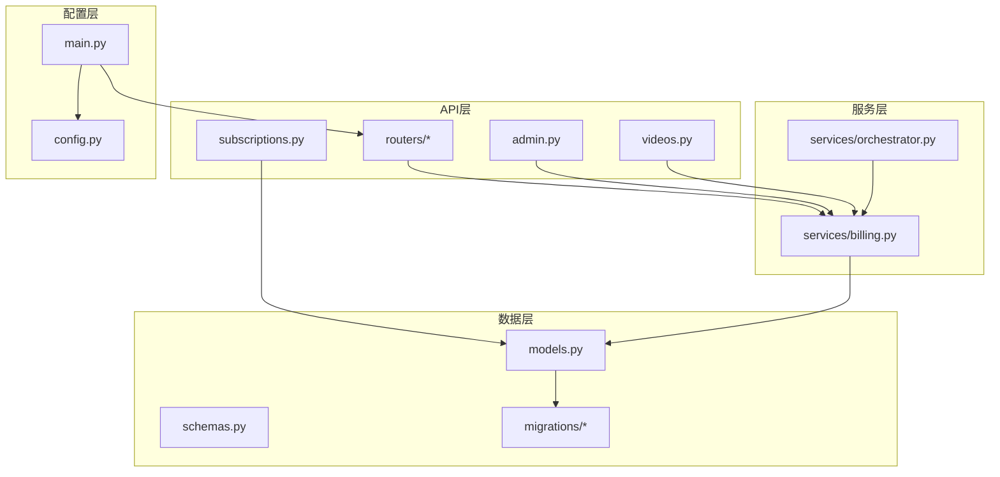
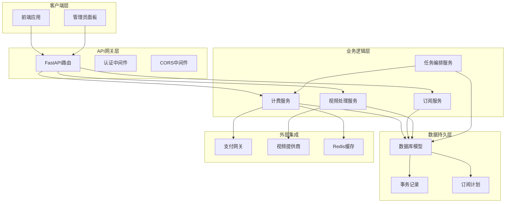
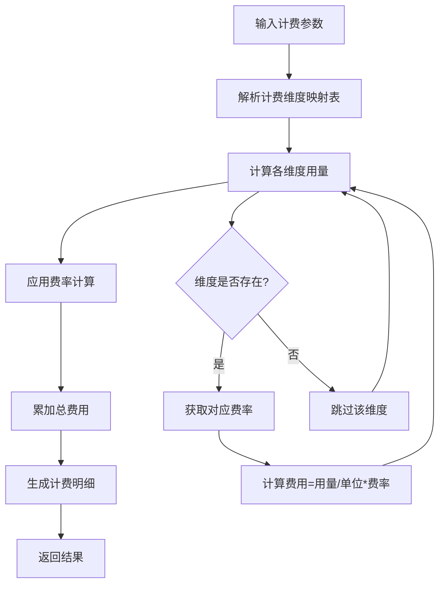
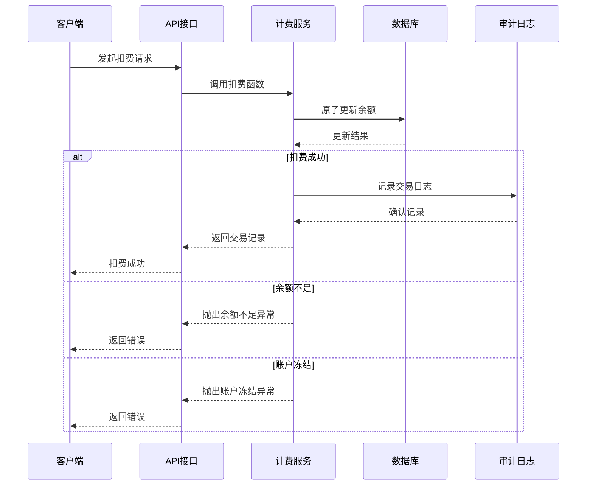
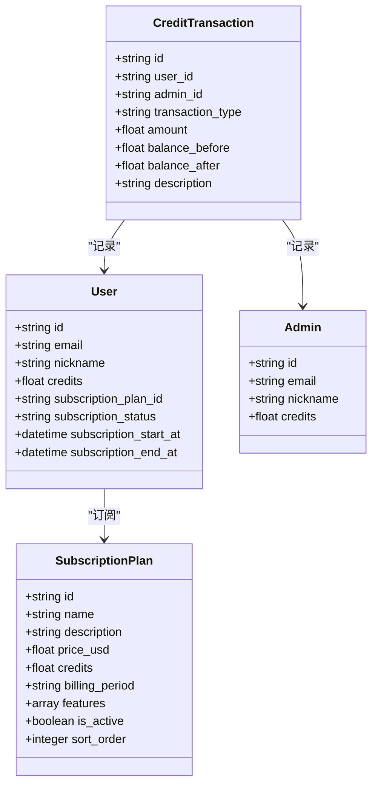
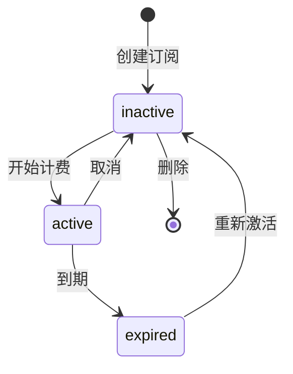
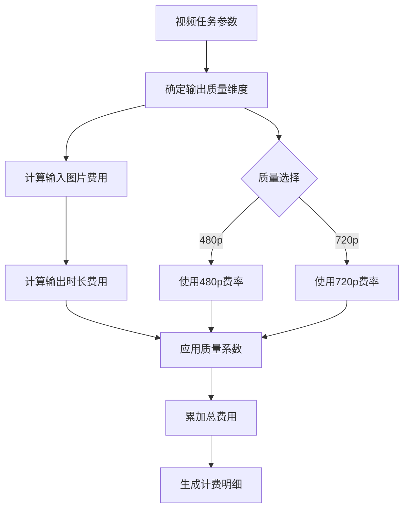
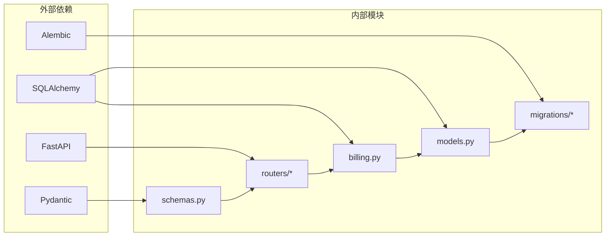

# 计费和订阅系统

<cite>
**本文档引用的文件**
- [billing.py](file://backend/services/billing.py)
- [models.py](file://backend/models.py)
- [schemas.py](file://backend/schemas.py)
- [subscriptions.py](file://backend/routers/subscriptions.py)
- [admin.py](file://backend/routers/admin.py)
- [videos.py](file://backend/routers/videos.py)
- [orchestrator.py](file://backend/services/orchestrator.py)
- [c74e516c6d87_add_credit_billing_system.py](file://backend/migrations/versions/c74e516c6d87_add_credit_billing_system.py)
- [h4i5j6k7l8m9_add_model_costs_and_subscriptions.py](file://backend/migrations/versions/h4i5j6k7l8m9_add_model_costs_and_subscriptions.py)
- [main.py](file://backend/main.py)
- [config.py](file://backend/config.py)
</cite>

## 目录
1. [简介](#简介)
2. [项目结构](#项目结构)
3. [核心组件](#核心组件)
4. [架构概览](#架构概览)
5. [详细组件分析](#详细组件分析)
6. [依赖关系分析](#依赖关系分析)
7. [性能考虑](#性能考虑)
8. [故障排除指南](#故障排除指南)
9. [结论](#结论)

## 简介

本系统是一个基于积分的计费和订阅管理系统，支持多种计费模式和订阅策略。系统采用映射表驱动的计费算法，提供原子化的积分扣费和退款机制，支持按使用量计费、包月订阅和一次性付费等多种模式。

系统的核心特点包括：
- 多维度积分计费系统
- 原子化交易处理
- 灵活的订阅管理
- 实时余额监控
- 完整的财务审计

## 项目结构

后端采用FastAPI框架，主要分为以下几个层次：

**图表来源**
- [main.py:138-152](file://backend/main.py#L138-L152)
- [billing.py:1-388](file://backend/services/billing.py#L1-L388)
- [models.py:1-447](file://backend/models.py#L1-L447)

**章节来源**
- [main.py:110-152](file://backend/main.py#L110-L152)
- [config.py:1-43](file://backend/config.py#L1-L43)

## 核心组件

### 积分计费引擎

系统实现了基于映射表驱动的计费算法，支持多种计费维度：

| 计费维度 | 说明 | 计费单位 |
|---------|------|----------|
| input | 输入tokens计费 | 每1,000,000 tokens |
| text_output | 文本输出tokens计费 | 每1,000,000 tokens |
| image_output | 图像输出tokens计费 | 每1,000,000 tokens |
| search | 搜索查询计费 | 每次查询 |
| image_generation | 图像生成计费 | 每张图片 |

### 订阅管理系统

支持灵活的订阅计划配置，包括：
- 包月、年付、终身订阅模式
- 自定义套餐内容和价格
- 自动积分发放机制
- 订阅状态跟踪

### 视频计费模块

针对视频生成任务的特殊计费需求：
- 支持480p和720p两种输出质量
- 按输入图片数量和输出时长计费
- 动态费率映射机制

**章节来源**
- [billing.py:12-387](file://backend/services/billing.py#L12-L387)
- [models.py:369-388](file://backend/models.py#L369-L388)
- [schemas.py:481-512](file://backend/schemas.py#L481-L512)

## 架构概览

系统采用分层架构设计，确保职责分离和代码可维护性：

**图表来源**
- [main.py:130-152](file://backend/main.py#L130-L152)
- [billing.py:1-388](file://backend/services/billing.py#L1-L388)
- [models.py:1-447](file://backend/models.py#L1-L447)

## 详细组件分析

### 积分计费服务

#### 核心计费算法

系统使用映射表驱动的方式实现计费算法，避免了复杂的if-else分支：

**图表来源**
- [billing.py:310-350](file://backend/services/billing.py#L310-L350)

#### 原子化扣费机制

系统实现了严格的原子化扣费机制，确保数据一致性：

**图表来源**
- [billing.py:178-308](file://backend/services/billing.py#L178-L308)

**章节来源**
- [billing.py:45-308](file://backend/services/billing.py#L45-L308)

### 订阅管理服务

#### 订阅计划配置

系统提供了完整的订阅计划管理功能：

**图表来源**
- [models.py:369-447](file://backend/models.py#L369-L447)
- [schemas.py:481-512](file://backend/schemas.py#L481-L512)

#### 订阅状态管理

订阅状态采用简单明了的状态机设计：

**章节来源**
- [models.py:54-58](file://backend/models.py#L54-L58)
- [admin.py:220-301](file://backend/routers/admin.py#L220-L301)

### 视频计费模块

#### 视频计费算法

视频任务的计费采用专门的算法，支持不同的输出质量：

**图表来源**
- [billing.py:353-387](file://backend/services/billing.py#L353-L387)

**章节来源**
- [billing.py:22-387](file://backend/services/billing.py#L22-L387)

### 财务审计系统

#### 交易记录管理

系统完整记录所有财务交易，提供透明的审计能力：

| 交易类型 | 说明 | 金额变化 |
|---------|------|----------|
| consumption | 消费扣费 | 负数 |
| recharge | 充值 | 正数 |
| refund | 退款 | 正数 |
| admin_adjust | 管理员调整 | 根据类型 |

**章节来源**
- [models.py:261-281](file://backend/models.py#L261-L281)
- [billing.py:86-176](file://backend/services/billing.py#L86-L176)

## 依赖关系分析

系统采用清晰的依赖关系设计，确保模块间的松耦合：

**图表来源**
- [billing.py:4-8](file://backend/services/billing.py#L4-L8)
- [models.py:1-4](file://backend/models.py#L1-L4)
- [schemas.py:1-3](file://backend/schemas.py#L1-L3)

**章节来源**
- [billing.py:1-10](file://backend/services/billing.py#L1-L10)
- [models.py:1-4](file://backend/models.py#L1-L4)

## 性能考虑

### 数据库优化

系统采用了多项数据库优化策略：

1. **索引优化**：为常用查询字段建立索引
2. **批量操作**：支持批量查询和更新
3. **连接池管理**：合理配置数据库连接池
4. **事务优化**：最小化事务持有时间

### 缓存策略

- **Redis缓存**：用于热点数据缓存
- **查询结果缓存**：减少重复查询
- **配置缓存**：缓存费率配置

### 并发处理

- **原子操作**：使用数据库原子更新确保数据一致性
- **锁机制**：避免竞态条件
- **异步处理**：提高系统响应速度

## 故障排除指南

### 常见问题及解决方案

#### 余额不足错误

当用户尝试进行消费但余额不足时，系统会抛出`InsufficientCreditsError`异常。解决方案：
1. 检查用户当前余额
2. 确认计费计算是否正确
3. 考虑为用户提供充值选项

#### 账户冻结问题

如果用户账户被冻结，系统会抛出`BalanceFrozenError`异常。处理步骤：
1. 检查账户状态
2. 确认冻结原因
3. 解冻后重试操作

#### 计费计算异常

如果计费计算出现异常，建议：
1. 验证输入参数
2. 检查费率配置
3. 查看详细的计费明细

**章节来源**
- [billing.py:37-43](file://backend/services/billing.py#L37-L43)
- [billing.py:258-287](file://backend/services/billing.py#L258-L287)

## 结论

本计费和订阅系统通过精心设计的架构和算法，提供了完整而高效的积分管理解决方案。系统的主要优势包括：

1. **灵活性**：支持多种计费模式和订阅策略
2. **可靠性**：原子化操作确保数据一致性
3. **可扩展性**：模块化设计便于功能扩展
4. **可观测性**：完整的审计日志系统
5. **易用性**：简洁的API接口和管理界面

系统为后续的功能扩展奠定了良好的基础，包括支付集成、高级订阅管理、财务报表等功能都可以在此基础上进行开发。