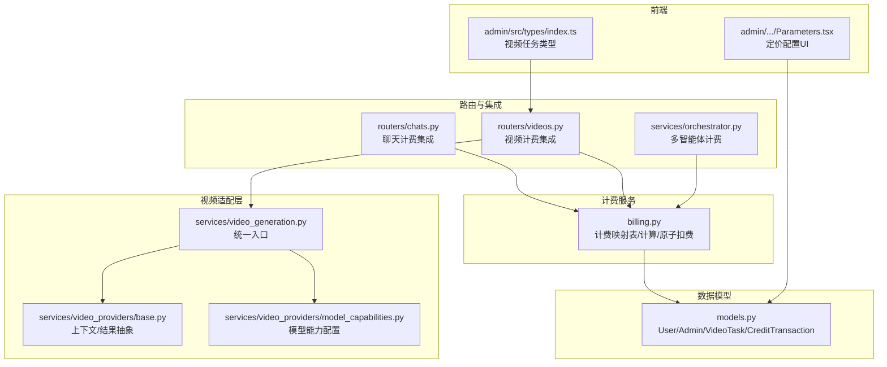
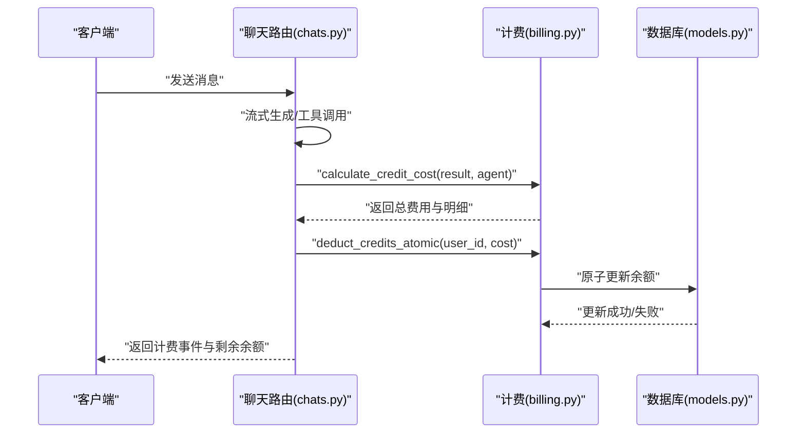
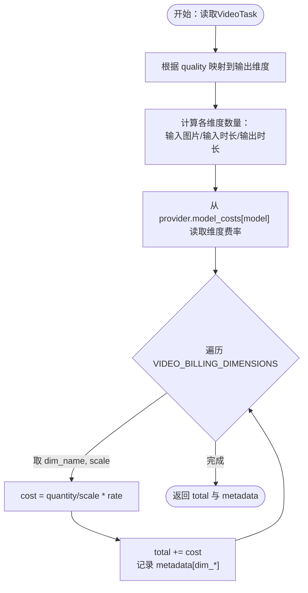
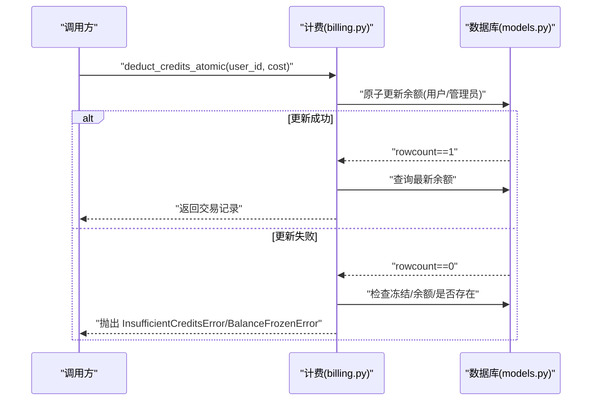
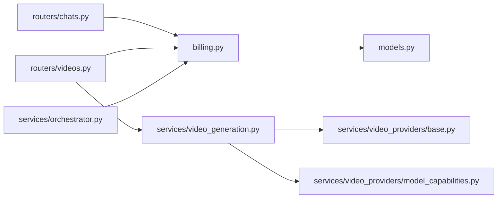

# 计费策略设计

<cite>
**本文引用的文件**
- [billing.py](file://backend/services/billing.py)
- [models.py](file://backend/models.py)
- [chats.py](file://backend/routers/chats.py)
- [orchestrator.py](file://backend/services/orchestrator.py)
- [videos.py](file://backend/routers/videos.py)
- [video_generation.py](file://backend/services/video_generation.py)
- [base.py](file://backend/services/video_providers/base.py)
- [model_capabilities.py](file://backend/services/video_providers/model_capabilities.py)
- [BILLING_REVIEW.md](file://backend/docs/BILLING_REVIEW.md)
- [Parameters.tsx](file://backend/admin/src/components/admin/agents/AgentForm/Parameters.tsx)
- [index.ts](file://backend/admin/src/types/index.ts)
</cite>

## 目录
1. [简介](#简介)
2. [项目结构](#项目结构)
3. [核心组件](#核心组件)
4. [架构总览](#架构总览)
5. [详细组件分析](#详细组件分析)
6. [依赖关系分析](#依赖关系分析)
7. [性能考虑](#性能考虑)
8. [故障排查指南](#故障排查指南)
9. [结论](#结论)
10. [附录](#附录)

## 简介
本文件面向计费策略设计，系统化阐述多维度计费映射表的设计理念与实现，涵盖按使用量计费（token、图像生成、搜索查询）、视频计费（质量等级映射与输出时长计费）、动态扩展方案、精度控制与浮点数处理、性能优化与缓存机制，以及错误处理与异常应对策略。文档同时结合后端计费实现与前端定价配置界面，给出可落地的工程实践建议。

## 项目结构
计费策略相关的核心代码分布在以下模块：
- 计费服务：backend/services/billing.py（计费映射表、计算与扣费原子化逻辑）
- 数据模型：backend/models.py（用户/管理员/视频任务/计费交易等）
- 路由与集成：backend/routers/chats.py（聊天计费）、backend/routers/videos.py（视频计费）
- 多智能体编排：backend/services/orchestrator.py（子任务计费）
- 视频适配层：backend/services/video_generation.py、backend/services/video_providers/base.py、backend/services/video_providers/model_capabilities.py
- 文档与评审：backend/docs/BILLING_REVIEW.md
- 前端定价配置：backend/admin/src/components/admin/agents/AgentForm/Parameters.tsx、backend/admin/src/types/index.ts



图表来源
- [billing.py:12-387](file://backend/services/billing.py#L12-L387)
- [models.py:10-447](file://backend/models.py#L10-L447)
- [chats.py:20-762](file://backend/routers/chats.py#L20-L762)
- [videos.py:18-232](file://backend/routers/videos.py#L18-L232)
- [orchestrator.py:18-154](file://backend/services/orchestrator.py#L18-L154)
- [video_generation.py:44-160](file://backend/services/video_generation.py#L44-L160)
- [base.py:15-114](file://backend/services/video_providers/base.py#L15-L114)
- [model_capabilities.py:22-223](file://backend/services/video_providers/model_capabilities.py#L22-L223)
- [Parameters.tsx:106-923](file://backend/admin/src/components/admin/agents/AgentForm/Parameters.tsx#L106-L923)
- [index.ts:236-281](file://backend/admin/src/types/index.ts#L236-L281)

章节来源
- [billing.py:12-387](file://backend/services/billing.py#L12-L387)
- [models.py:10-447](file://backend/models.py#L10-L447)
- [chats.py:20-762](file://backend/routers/chats.py#L20-L762)
- [videos.py:18-232](file://backend/routers/videos.py#L18-L232)
- [orchestrator.py:18-154](file://backend/services/orchestrator.py#L18-L154)
- [video_generation.py:44-160](file://backend/services/video_generation.py#L44-L160)
- [base.py:15-114](file://backend/services/video_providers/base.py#L15-L114)
- [model_capabilities.py:22-223](file://backend/services/video_providers/model_capabilities.py#L22-L223)
- [Parameters.tsx:106-923](file://backend/admin/src/components/admin/agents/AgentForm/Parameters.tsx#L106-L923)
- [index.ts:236-281](file://backend/admin/src/types/index.ts#L236-L281)

## 核心组件
- 计费维度映射表（BILLING_DIMENSIONS）：定义token类与查询类计费维度，统一通过映射表驱动计算，避免分支判断。
- 视频计费维度映射表（VIDEO_BILLING_DIMENSIONS）：定义视频输入图片/输入时长/输出时长等维度，配合质量映射进行计费。
- 质量映射（QUALITY_BILLING_FIELD）：将分辨率映射到具体输出维度，确保不同质量按对应维度计费。
- 计费计算函数：
  - calculate_credit_cost：兼容流式与非流式结果，按维度累加计费。
  - calculate_video_credit_cost：根据任务质量与输入输出参数，按维度与费率计算视频费用。
- 原子扣费与退款：
  - deduct_credits_atomic：使用数据库原子更新，避免并发丢失；失败时抛出余额不足或冻结异常。
  - refund_credits_atomic：原子增加余额并记录交易。
- 检查余额：check_balance_sufficient：运行前检查余额与冻结状态，提升用户体验。
- 数据模型支撑：User/Admin/VideoTask/CreditTransaction，承载余额、计费交易与视频任务计费字段。

章节来源
- [billing.py:12-387](file://backend/services/billing.py#L12-L387)
- [models.py:10-447](file://backend/models.py#L10-L447)

## 架构总览
计费策略采用“映射表驱动 + 原子化数据库操作”的架构，贯穿聊天与视频两大场景：
- 聊天计费：在生成成功后，根据结果统计与Agent费率计算积分消耗，再进行原子扣费与交易记录。
- 视频计费：在任务完成后，根据模型费率字典与任务参数计算积分消耗，再进行原子扣费与交易记录。
- 多智能体计费：子任务完成后分别计算并累加计费，最终汇总到任务执行记录。



图表来源
- [chats.py:664-734](file://backend/routers/chats.py#L664-L734)
- [billing.py:310-350](file://backend/services/billing.py#L310-L350)
- [billing.py:178-308](file://backend/services/billing.py#L178-L308)
- [models.py:35-73](file://backend/models.py#L35-L73)

章节来源
- [chats.py:664-734](file://backend/routers/chats.py#L664-L734)
- [billing.py:310-350](file://backend/services/billing.py#L310-L350)
- [billing.py:178-308](file://backend/services/billing.py#L178-L308)
- [models.py:35-73](file://backend/models.py#L35-L73)

## 详细组件分析

### 多维度计费映射表与扩展机制
- BILLING_DIMENSIONS：定义维度名称到（费率字段, scale）的映射，scale=1_000_000表示按每百万token计费，scale=1表示按次计费。
- 扩展机制：
  - 新增维度：在映射表中添加键值对，字段名与scale按需设定。
  - 新增Agent费率字段：在Agent模型中新增对应字段，前端表单Parameters.tsx同步新增表单项。
  - 计算逻辑：遍历映射表，读取对应字段与数量，按公式 quantity/scale * rate 累加。
- 兼容性：对无模态拆分的输出，自动回退为文本输出计费，保证向后兼容。

```mermaid
flowchart TD
Start(["开始：读取结果统计"]) --> Init["初始化 total=0, metadata={}"]
Init --> Loop{"遍历 BILLING_DIMENSIONS"}
Loop --> |取 dim_name, (field, scale)| Read["读取 quantity=结果中对应字段<br/>读取 rate=Agent中对应字段"]
Read --> Calc["cost = quantity / scale * rate"]
Calc --> Acc["total += cost<br/>metadata[dim_*] 写入数量/费率"]
Acc --> Loop
Loop --> |完成| End(["返回 total 与 metadata"])
```

图表来源
- [billing.py:310-350](file://backend/services/billing.py#L310-L350)

章节来源
- [billing.py:12-350](file://backend/services/billing.py#L12-L350)
- [Parameters.tsx:106-117](file://backend/admin/src/components/admin/agents/AgentForm/Parameters.tsx#L106-L117)

### 按使用量计费：token、图像生成与搜索查询
- Token计费：
  - 输入token：按输入token计费，scale=1_000_000。
  - 文本输出token：按文本输出token计费，scale=1_000_000。
  - 图像输出token：按图像输出token计费，scale=1_000_000（适用于支持Token计费的图像模型）。
- 图像生成计费（xAI）：按生成张数计费，scale=1。
- 搜索查询计费：按查询次数计费，scale=1。
- 计算流程：读取各维度数量与Agent费率，按公式累加，生成明细（维度token数与对应费率）。

章节来源
- [billing.py:14-20](file://backend/services/billing.py#L14-L20)
- [billing.py:310-350](file://backend/services/billing.py#L310-L350)

### 视频计费：质量等级映射与输出时长计费
- VIDEO_BILLING_DIMENSIONS：定义视频输入图片、输入时长、输出480p/720p等维度，scale=1。
- QUALITY_BILLING_FIELD：将质量字符串映射到具体输出维度，避免分支判断。
- 计算流程：
  - 根据任务质量确定输出维度（480p或720p）。
  - 计算各维度的数量：输入图片数、输入时长（编辑模式）、输出时长（按选定质量）。
  - 从provider.model_costs[model]读取维度费率，按公式累加得到总费用。
  - 生成明细（各维度数量与费率）。



图表来源
- [billing.py:353-387](file://backend/services/billing.py#L353-L387)
- [videos.py:201-213](file://backend/routers/videos.py#L201-L213)
- [base.py:15-47](file://backend/services/video_providers/base.py#L15-L47)
- [model_capabilities.py:22-223](file://backend/services/video_providers/model_capabilities.py#L22-L223)

章节来源
- [billing.py:22-35](file://backend/services/billing.py#L22-L35)
- [billing.py:353-387](file://backend/services/billing.py#L353-L387)
- [videos.py:201-213](file://backend/routers/videos.py#L201-L213)
- [base.py:15-47](file://backend/services/video_providers/base.py#L15-L47)
- [model_capabilities.py:22-223](file://backend/services/video_providers/model_capabilities.py#L22-L223)

### 原子扣费与退款：并发安全与幂等性
- 原子扣费（deduct_credits_atomic）：
  - 使用数据库UPDATE ... WHERE ...确保并发安全，避免余额竞争条件。
  - 失败时区分余额不足、冻结、用户不存在等情况，抛出对应异常。
- 原子退款（refund_credits_atomic）：
  - 同样使用原子UPDATE，先尝试User表，再回退到Admin表。
  - 记录CreditTransaction，包含余额前后值与元数据。
- 运行前检查（check_balance_sufficient）：
  - 在执行前检查余额与冻结状态，避免不必要的资源消耗。



图表来源
- [billing.py:178-308](file://backend/services/billing.py#L178-L308)
- [models.py:35-73](file://backend/models.py#L35-L73)

章节来源
- [billing.py:45-84](file://backend/services/billing.py#L45-L84)
- [billing.py:178-308](file://backend/services/billing.py#L178-L308)
- [models.py:261-281](file://backend/models.py#L261-L281)

### 多智能体计费集成
- 子任务完成后分别计算计费并写入SubTask记录。
- 最终在任务完成后汇总计费到TaskExecution记录，确保多智能体场景下的计费完整性。

章节来源
- [orchestrator.py:128-162](file://backend/services/orchestrator.py#L128-L162)
- [orchestrator.py:163-248](file://backend/services/orchestrator.py#L163-L248)

### 前端定价配置与视频任务类型
- 前端Agent定价表单Parameters.tsx：定义所有计费维度的表单项与默认步进，支持批量生成张数等配置。
- 视频任务类型定义index.ts：统一视频任务响应结构，便于前端展示与交互。

章节来源
- [Parameters.tsx:106-117](file://backend/admin/src/components/admin/agents/AgentForm/Parameters.tsx#L106-L117)
- [index.ts:236-281](file://backend/admin/src/types/index.ts#L236-L281)

## 依赖关系分析
- billing.py依赖models.py中的User/Admin/VideoTask/CreditTransaction，用于余额查询、原子更新与交易记录。
- 路由chats.py与videos.py在生成完成后调用billing.py进行计费与扣费。
- orchestrator.py在子任务完成后调用billing.py进行计费。
- 视频路由videos.py依赖video_generation.py与video_providers/*进行供应商适配与能力配置。



图表来源
- [billing.py:8-10](file://backend/services/billing.py#L8-L10)
- [models.py:10-447](file://backend/models.py#L10-L447)
- [chats.py:20-22](file://backend/routers/chats.py#L20-L22)
- [videos.py:18-18](file://backend/routers/videos.py#L18-L18)
- [orchestrator.py:18-20](file://backend/services/orchestrator.py#L18-L20)
- [video_generation.py:25-33](file://backend/services/video_generation.py#L25-L33)
- [base.py:15-47](file://backend/services/video_providers/base.py#L15-L47)
- [model_capabilities.py:22-40](file://backend/services/video_providers/model_capabilities.py#L22-L40)

章节来源
- [billing.py:8-10](file://backend/services/billing.py#L8-L10)
- [models.py:10-447](file://backend/models.py#L10-L447)
- [chats.py:20-22](file://backend/routers/chats.py#L20-L22)
- [videos.py:18-18](file://backend/routers/videos.py#L18-L18)
- [orchestrator.py:18-20](file://backend/services/orchestrator.py#L18-L20)
- [video_generation.py:25-33](file://backend/services/video_generation.py#L25-L33)
- [base.py:15-47](file://backend/services/video_providers/base.py#L15-L47)
- [model_capabilities.py:22-40](file://backend/services/video_providers/model_capabilities.py#L22-L40)

## 性能考虑
- 映射表驱动：通过字典映射替代大量if-else，降低分支开销，提升可维护性。
- 原子数据库操作：使用UPDATE ... WHERE避免竞态条件，减少重试与回滚成本。
- 流式生成与计费：聊天计费在生成成功后一次性扣费，避免流式过程中的多次IO。
- 视频计费延迟：视频计费在任务完成后进行，减少实时依赖，提高吞吐。
- 前端定价配置：统一的表单字段与默认步进，减少前端分支判断与渲染开销。

[本节为通用性能讨论，不直接分析具体文件]

## 故障排查指南
- 余额不足：
  - 现象：抛出InsufficientCreditsError。
  - 排查：确认用户余额、冻结状态与预估费用；必要时在路由层增加check_balance_sufficient。
- 余额冻结：
  - 现象：抛出BalanceFrozenError。
  - 排查：检查User.is_balance_frozen字段；管理员账户同理。
- 并发丢失：
  - 现象：余额更新异常或交易记录不一致。
  - 排查：确认使用deduct_credits_atomic的原子更新；避免Python侧“读-改-写”。
- 浮点精度误差：
  - 现象：长期运行后余额出现细微偏差。
  - 排查：参考文档建议将credits迁移到DECIMAL或使用整数微积分单位。
- 视频计费异常：
  - 现象：视频完成但计费失败或未扣费。
  - 排查：确认provider.model_costs配置正确、任务完成状态与输出时长已写入。

章节来源
- [billing.py:45-84](file://backend/services/billing.py#L45-L84)
- [billing.py:178-308](file://backend/services/billing.py#L178-L308)
- [BILLING_REVIEW.md:13-25](file://backend/docs/BILLING_REVIEW.md#L13-L25)

## 结论
本计费策略通过映射表驱动与原子化数据库操作，实现了对token、图像生成、搜索查询与视频生成的统一计费框架。结合前端定价配置与多智能体计费集成，既保证了灵活性与可扩展性，又兼顾了并发安全与性能。建议后续按评审文档推进DECIMAL迁移、原子扣费部署与免费配额机制，进一步完善计费体系。

[本节为总结性内容，不直接分析具体文件]

## 附录

### 计费维度与费率字段对照
- 文本/图像/搜索维度：见BILLING_DIMENSIONS映射表。
- 视频维度：见VIDEO_BILLING_DIMENSIONS映射表。
- 前端定价表单项：见Parameters.tsx中的COST_DIMENSIONS。

章节来源
- [billing.py:14-29](file://backend/services/billing.py#L14-L29)
- [Parameters.tsx:106-117](file://backend/admin/src/components/admin/agents/AgentForm/Parameters.tsx#L106-L117)