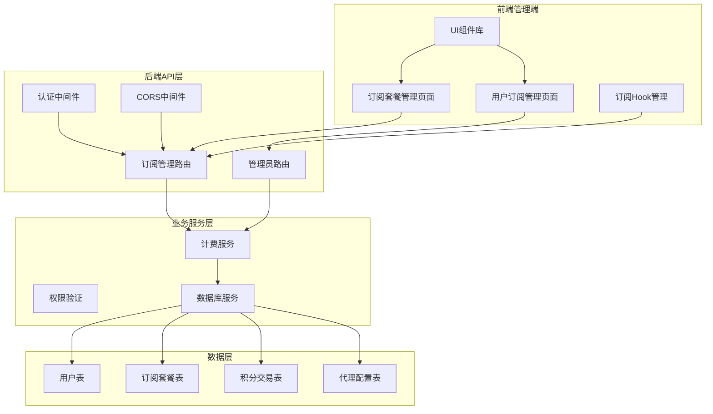
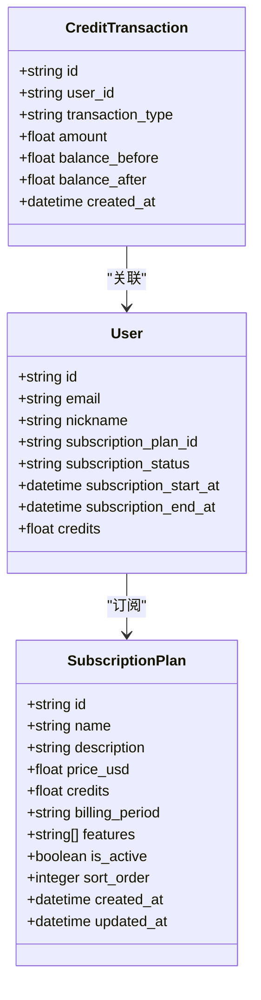
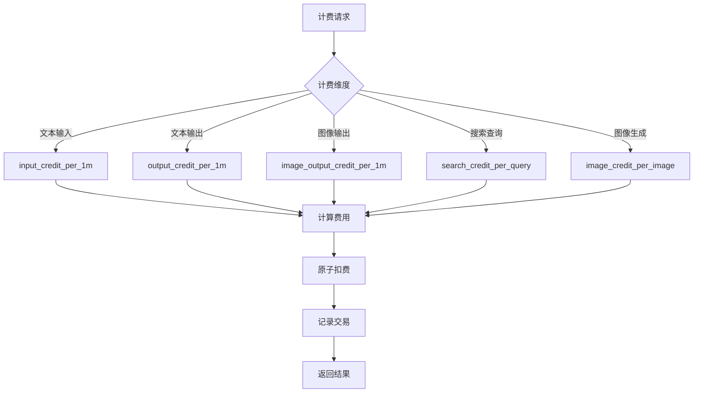
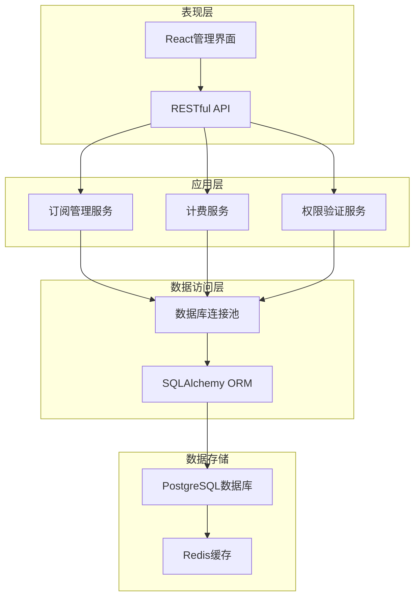
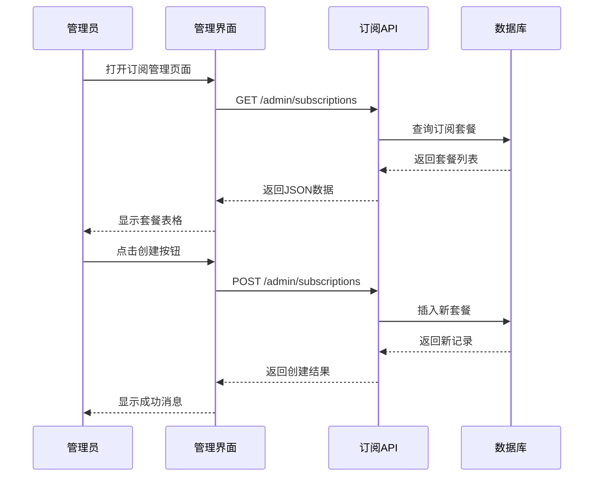
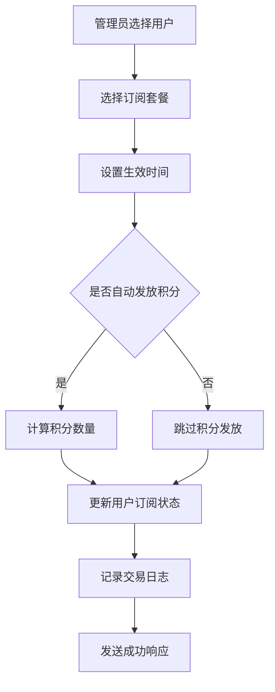
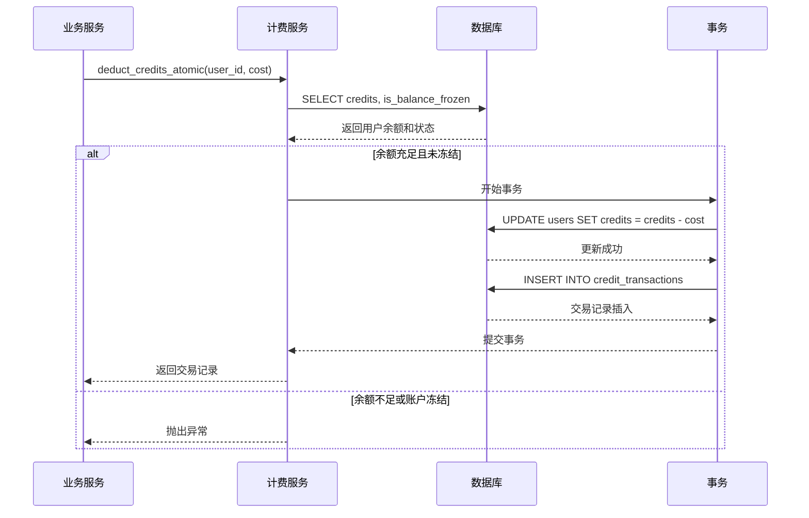
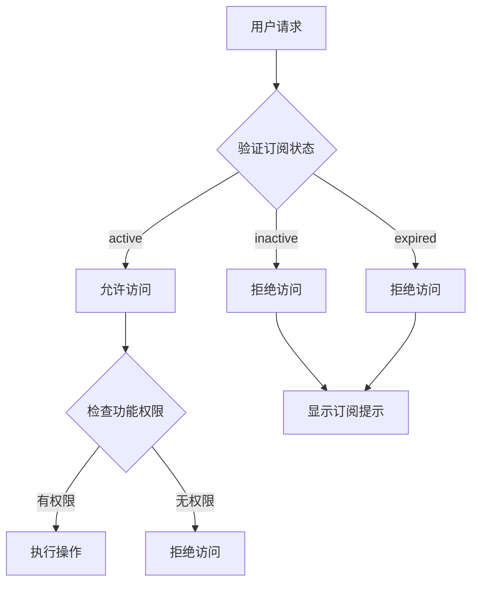
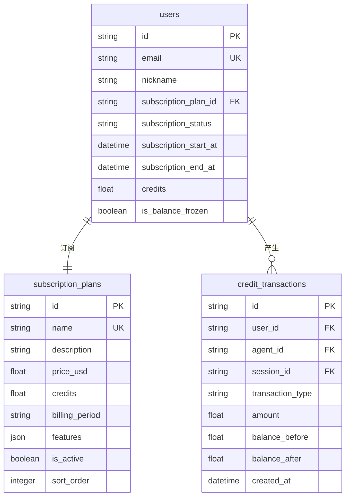
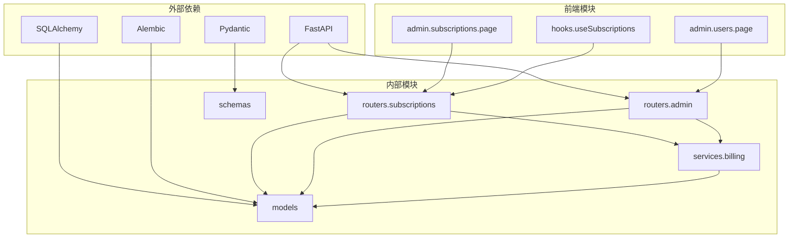

# 订阅管理系统

<cite>
**本文档引用的文件**
- [subscriptions.py](file://backend/routers/subscriptions.py)
- [admin.py](file://backend/routers/admin.py)
- [models.py](file://backend/models.py)
- [schemas.py](file://backend/schemas.py)
- [billing.py](file://backend/services/billing.py)
- [page.tsx](file://backend/admin/src/app/admin/subscriptions/page.tsx)
- [useSubscriptions.ts](file://backend/admin/src/hooks/useSubscriptions.ts)
- [users/page.tsx](file://backend/admin/src/app/admin/users/page.tsx)
- [main.py](file://backend/main.py)
- [c74e516c6d87_add_credit_billing_system.py](file://backend/migrations/versions/c74e516c6d87_add_credit_billing_system.py)
</cite>

## 目录
1. [简介](#简介)
2. [项目结构](#项目结构)
3. [核心组件](#核心组件)
4. [架构概览](#架构概览)
5. [详细组件分析](#详细组件分析)
6. [依赖关系分析](#依赖关系分析)
7. [性能考虑](#性能考虑)
8. [故障排除指南](#故障排除指南)
9. [结论](#结论)
10. [附录](#附录)

## 简介

订阅管理系统是基于FastAPI和React构建的完整订阅管理解决方案，采用积分制计费模式。系统支持多种订阅类型（月付、年付、终身），提供完整的订阅生命周期管理，包括创建、激活、过期、暂停和取消。

系统的核心特色包括：
- **积分制计费**：所有服务以积分形式计费，支持灵活的定价策略
- **自动化订阅管理**：支持自动续费和订阅状态跟踪
- **精细化权限控制**：基于订阅状态的功能访问限制
- **实时计费监控**：通过SSE实时推送计费状态
- **完整的管理界面**：提供直观的订阅套餐管理和用户订阅分配功能

## 项目结构

订阅管理系统采用前后端分离架构，主要由以下模块组成：



**图表来源**
- [main.py:138-152](file://backend/main.py#L138-L152)
- [subscriptions.py:14-18](file://backend/routers/subscriptions.py#L14-L18)
- [admin.py:19-23](file://backend/routers/admin.py#L19-L23)

**章节来源**
- [main.py:138-152](file://backend/main.py#L138-L152)
- [subscriptions.py:14-18](file://backend/routers/subscriptions.py#L14-L18)
- [admin.py:19-23](file://backend/routers/admin.py#L19-L23)

## 核心组件

### 订阅套餐模型

订阅套餐是系统的核心实体，定义了用户可以购买的服务包：



**图表来源**
- [models.py:369-389](file://backend/models.py#L369-L389)
- [models.py:35-73](file://backend/models.py#L35-L73)
- [models.py:261-281](file://backend/models.py#L261-L281)

### 计费系统架构

系统采用映射表驱动的计费架构，避免复杂的条件判断：



**图表来源**
- [billing.py:12-30](file://backend/services/billing.py#L12-L30)
- [billing.py:310-351](file://backend/services/billing.py#L310-L351)

**章节来源**
- [models.py:369-389](file://backend/models.py#L369-L389)
- [billing.py:12-30](file://backend/services/billing.py#L12-L30)
- [billing.py:310-351](file://backend/services/billing.py#L310-L351)

## 架构概览

订阅管理系统采用分层架构设计，确保代码的可维护性和扩展性：



**图表来源**
- [main.py:38-44](file://backend/main.py#L38-L44)
- [subscriptions.py:1-119](file://backend/routers/subscriptions.py#L1-L119)
- [admin.py:1-501](file://backend/routers/admin.py#L1-L501)

系统的关键特性包括：
- **异步处理**：使用FastAPI的异步特性处理高并发请求
- **中间件支持**：CORS和认证中间件确保安全性
- **数据库迁移**：使用Alembic进行数据库版本管理
- **错误处理**：完善的异常处理和错误响应机制

**章节来源**
- [main.py:38-44](file://backend/main.py#L38-L44)
- [subscriptions.py:1-119](file://backend/routers/subscriptions.py#L1-L119)
- [admin.py:1-501](file://backend/routers/admin.py#L1-L501)

## 详细组件分析

### 订阅套餐管理

订阅套餐管理提供了完整的CRUD操作和业务逻辑：

#### API接口设计

| 方法 | 路径 | 功能 | 请求体 | 响应 |
|------|------|------|--------|------|
| POST | `/api/admin/subscriptions` | 创建订阅套餐 | SubscriptionPlanCreate | SubscriptionPlanResponse |
| GET | `/api/admin/subscriptions` | 获取订阅套餐列表 | - | List[SubscriptionPlanResponse] |
| GET | `/api/admin/subscriptions/{plan_id}` | 获取单个订阅套餐 | - | SubscriptionPlanResponse |
| PUT | `/api/admin/subscriptions/{plan_id}` | 更新订阅套餐 | SubscriptionPlanUpdate | SubscriptionPlanResponse |
| DELETE | `/api/admin/subscriptions/{plan_id}` | 删除订阅套餐 | - | JSON |

#### 前端管理界面



**图表来源**
- [page.tsx:87-189](file://backend/admin/src/app/admin/subscriptions/page.tsx#L87-L189)
- [useSubscriptions.ts:8-16](file://backend/admin/src/hooks/useSubscriptions.ts#L8-L16)

**章节来源**
- [subscriptions.py:21-119](file://backend/routers/subscriptions.py#L21-L119)
- [page.tsx:87-189](file://backend/admin/src/app/admin/subscriptions/page.tsx#L87-L189)
- [useSubscriptions.ts:8-16](file://backend/admin/src/hooks/useSubscriptions.ts#L8-L16)

### 用户订阅管理

用户订阅管理功能允许管理员为用户分配订阅套餐：

#### 订阅分配流程



**图表来源**
- [admin.py:220-279](file://backend/routers/admin.py#L220-L279)
- [users/page.tsx:173-195](file://backend/admin/src/app/admin/users/page.tsx#L173-L195)

#### 订阅状态管理

系统支持三种订阅状态：
- **active**：订阅生效中
- **inactive**：未订阅状态  
- **expired**：订阅已过期

**章节来源**
- [admin.py:220-279](file://backend/routers/admin.py#L220-L279)
- [users/page.tsx:173-195](file://backend/admin/src/app/admin/users/page.tsx#L173-L195)

### 计费系统实现

计费系统采用映射表驱动的设计模式，支持多种计费维度：

#### 计费维度映射

| 维度名称 | Agent字段 | 缩放因子 | 说明 |
|----------|-----------|----------|------|
| input | input_credit_per_1m | 1,000,000 | 文本输入计费（按1M令牌） |
| text_output | output_credit_per_1m | 1,000,000 | 文本输出计费（按1M令牌） |
| image_output | image_output_credit_per_1m | 1,000,000 | 图像输出计费（按1M令牌） |
| search | search_credit_per_query | 1 | 搜索查询计费（每次） |
| image_generation | image_credit_per_image | 1 | 图像生成计费（每张） |

#### 原子扣费机制



**图表来源**
- [billing.py:178-308](file://backend/services/billing.py#L178-L308)

**章节来源**
- [billing.py:12-30](file://backend/services/billing.py#L12-L30)
- [billing.py:178-308](file://backend/services/billing.py#L178-L308)

### 权限控制系统

系统实现了多层次的权限控制机制：

#### 订阅权限验证



**图表来源**
- [models.py:54-68](file://backend/models.py#L54-L68)

#### 管理员权限控制

管理员系统支持不同级别的权限：
- **admin**：普通管理员权限
- **super_admin**：超级管理员权限

**章节来源**
- [models.py:54-68](file://backend/models.py#L54-L68)

### 数据库设计

系统采用关系型数据库设计，支持完整的订阅管理功能：

#### 核心表结构



**图表来源**
- [models.py:35-73](file://backend/models.py#L35-L73)
- [models.py:369-389](file://backend/models.py#L369-L389)
- [models.py:261-281](file://backend/models.py#L261-L281)

**章节来源**
- [models.py:35-73](file://backend/models.py#L35-L73)
- [models.py:369-389](file://backend/models.py#L369-L389)
- [models.py:261-281](file://backend/models.py#L261-L281)

## 依赖关系分析

订阅管理系统的依赖关系清晰明确，遵循单一职责原则：



**图表来源**
- [main.py:41-44](file://backend/main.py#L41-L44)
- [subscriptions.py:1-12](file://backend/routers/subscriptions.py#L1-L12)
- [admin.py:7-17](file://backend/routers/admin.py#L7-L17)

**章节来源**
- [main.py:41-44](file://backend/main.py#L41-L44)
- [subscriptions.py:1-12](file://backend/routers/subscriptions.py#L1-L12)
- [admin.py:7-17](file://backend/routers/admin.py#L7-L17)

## 性能考虑

系统在设计时充分考虑了性能优化：

### 数据库优化
- **索引优化**：对常用查询字段建立索引
- **连接池**：使用异步连接池提高数据库访问效率
- **批量操作**：支持批量数据处理

### 缓存策略
- **API缓存**：使用SWR实现客户端缓存
- **会话缓存**：Redis缓存用户会话信息
- **配置缓存**：缓存订阅配置信息

### 异步处理
- **异步API**：所有API接口支持异步处理
- **后台任务**：支持定时任务和后台处理
- **流式响应**：SSE支持实时数据推送

## 故障排除指南

### 常见问题及解决方案

#### 订阅创建失败
**问题**：创建订阅套餐时报错
**可能原因**：
- 套餐名称重复
- 价格或积分设置为负数
- 计费周期参数错误

**解决方法**：
1. 检查套餐名称唯一性
2. 验证数值参数的有效性
3. 确认计费周期枚举值正确

#### 用户订阅分配失败
**问题**：为用户分配订阅时报错
**可能原因**：
- 用户不存在
- 套餐不存在
- 数据库连接异常

**解决方法**：
1. 验证用户ID有效性
2. 检查套餐ID存在性
3. 查看数据库连接状态

#### 计费扣费异常
**问题**：积分扣费失败
**可能原因**：
- 余额不足
- 账户被冻结
- 并发冲突

**解决方法**：
1. 检查用户余额
2. 验证账户状态
3. 实现重试机制

**章节来源**
- [subscriptions.py:27-31](file://backend/routers/subscriptions.py#L27-L31)
- [admin.py:231-238](file://backend/routers/admin.py#L231-L238)
- [billing.py:258-287](file://backend/services/billing.py#L258-L287)

## 结论

订阅管理系统是一个功能完整、架构清晰的现代化订阅管理解决方案。系统的主要优势包括：

### 技术优势
- **模块化设计**：清晰的分层架构便于维护和扩展
- **异步处理**：高性能的异步API设计
- **类型安全**：完整的TypeScript和Pydantic类型定义
- **数据库友好**：支持多种数据库后端

### 业务优势
- **灵活的计费模式**：支持多种计费维度和周期
- **完整的生命周期管理**：从创建到取消的全生命周期支持
- **精细的权限控制**：基于订阅状态的功能访问控制
- **实时监控**：SSE实时推送计费状态

### 扩展性
系统设计充分考虑了未来的扩展需求，支持：
- 新的计费维度添加
- 多种订阅类型的扩展
- 集成第三方支付网关
- 定制化的权限控制

## 附录

### API接口规范

#### 订阅套餐管理API

| 接口 | 方法 | 路径 | 权限 | 描述 |
|------|------|------|------|------|
| 创建套餐 | POST | `/api/admin/subscriptions` | admin | 创建新的订阅套餐 |
| 获取套餐列表 | GET | `/api/admin/subscriptions` | admin | 获取所有订阅套餐 |
| 获取套餐详情 | GET | `/api/admin/subscriptions/{plan_id}` | admin | 获取单个套餐详情 |
| 更新套餐 | PUT | `/api/admin/subscriptions/{plan_id}` | admin | 更新订阅套餐信息 |
| 删除套餐 | DELETE | `/api/admin/subscriptions/{plan_id}` | admin | 删除订阅套餐 |

#### 用户订阅管理API

| 接口 | 方法 | 路径 | 权限 | 描述 |
|------|------|------|------|------|
| 分配订阅 | PUT | `/api/admin/users/{user_id}/subscription` | admin | 为用户分配订阅套餐 |
| 取消订阅 | DELETE | `/api/admin/users/{user_id}/subscription` | admin | 取消用户的订阅 |

### 数据模型说明

#### 订阅套餐字段说明

| 字段名 | 类型 | 必填 | 默认值 | 说明 |
|--------|------|------|--------|------|
| name | string | 是 | - | 套餐名称 |
| description | string | 否 | - | 套餐描述 |
| price_usd | float | 是 | - | 价格（美元） |
| credits | float | 是 | - | 包含积分数量 |
| billing_period | enum | 是 | monthly | 计费周期 |
| features | array | 否 | [] | 套餐特性列表 |
| is_active | boolean | 否 | true | 是否启用 |
| sort_order | integer | 否 | 0 | 排序权重 |

### 前端集成指南

#### React Hook使用

```typescript
// 获取订阅套餐列表
const { plans, isLoading, isError, mutate } = useSubscriptions();

// 创建新套餐
const { createPlan } = useCreatePlan();

// 更新套餐
const { updatePlan } = useUpdatePlan();

// 删除套餐
const { deletePlan } = useDeletePlan();
```

#### 管理界面集成

前端管理界面提供了完整的订阅管理功能：
- 实时数据展示
- 表单验证和错误处理
- 操作确认对话框
- 成功/失败消息提示

**章节来源**
- [page.tsx:87-189](file://backend/admin/src/app/admin/subscriptions/page.tsx#L87-L189)
- [useSubscriptions.ts:8-38](file://backend/admin/src/hooks/useSubscriptions.ts#L8-L38)