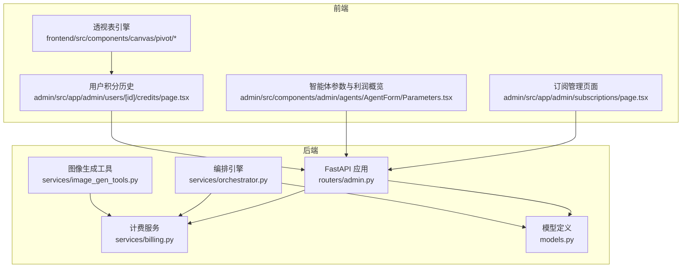
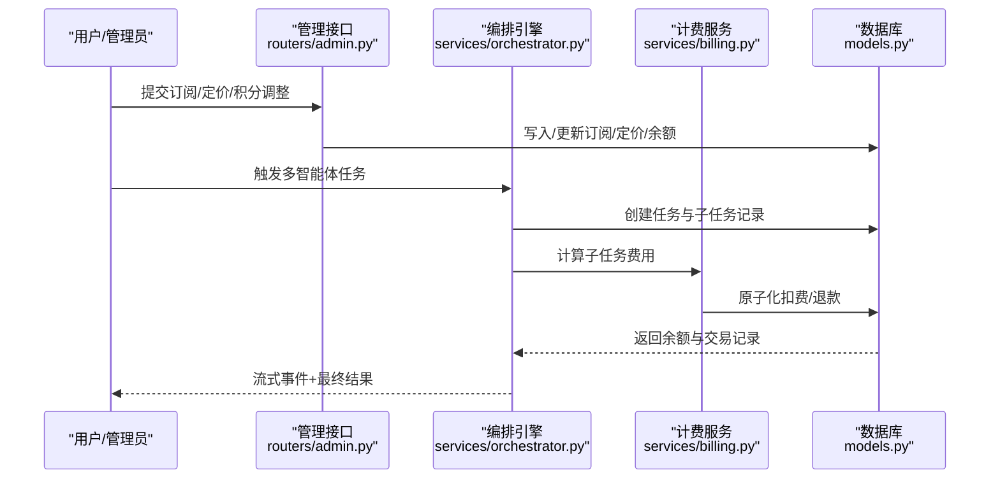
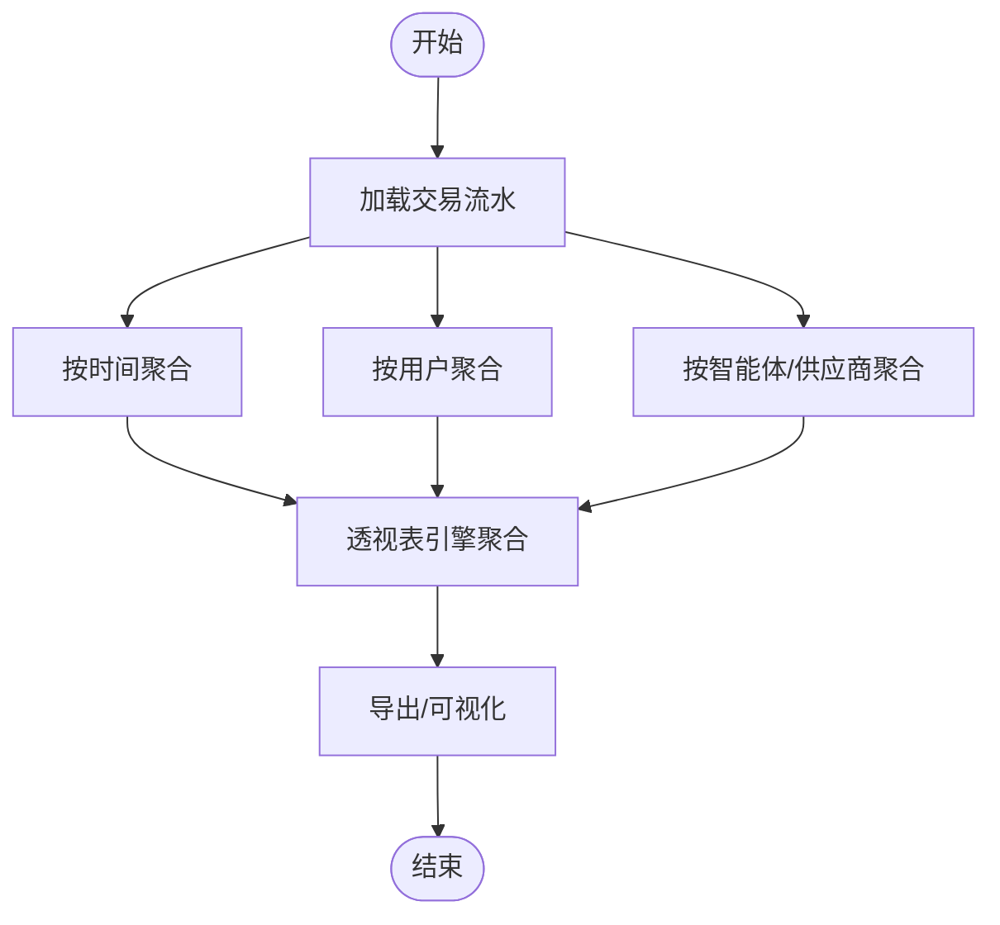
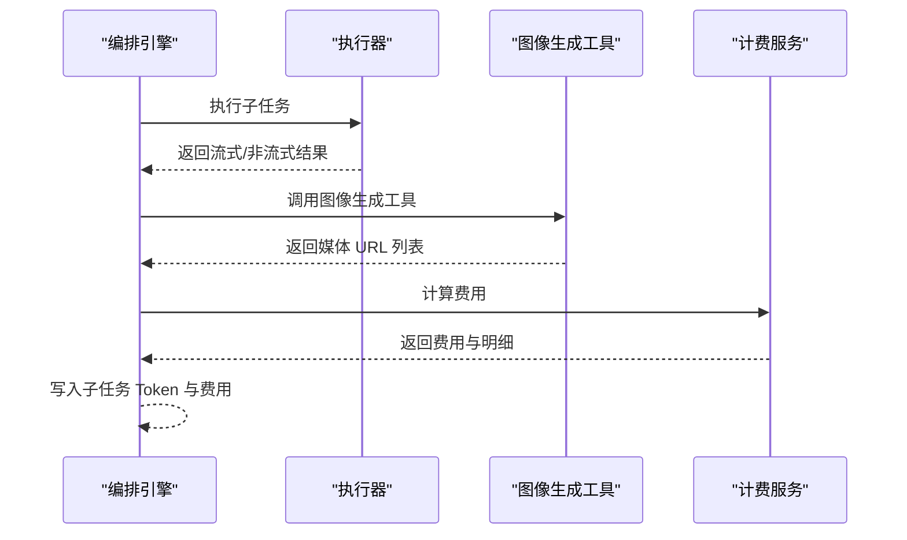
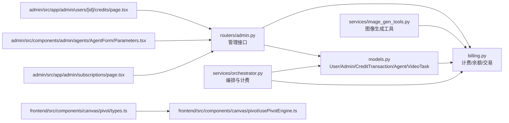

# 财务报表系统

<cite>
**本文引用的文件**
- [billing.py](file://backend/services/billing.py)
- [models.py](file://backend/models.py)
- [admin.py](file://backend/routers/admin.py)
- [schemas.py](file://backend/schemas.py)
- [orchestrator.py](file://backend/services/orchestrator.py)
- [image_gen_tools.py](file://backend/services/image_gen_tools.py)
- [page.tsx](file://backend/admin/src/app/admin/subscriptions/page.tsx)
- [Parameters.tsx](file://backend/admin/src/components/admin/agents/AgentForm/Parameters.tsx)
- [page.tsx](file://backend/admin/src/app/admin/users/[id]/credits/page.tsx)
- [types.ts](file://frontend/src/components/canvas/pivot/types.ts)
- [usePivotEngine.ts](file://frontend/src/components/canvas/pivot/usePivotEngine.ts)
- [c74e516c6d87_add_credit_billing_system.py](file://backend/migrations/versions/c74e516c6d87_add_credit_billing_system.py)
- [f2a3b4c5d6e7_add_image_search_billing.py](file://backend/migrations/versions/f2a3b4c5d6e7_add_image_search_billing.py)
</cite>

## 目录
1. [简介](#简介)
2. [项目结构](#项目结构)
3. [核心组件](#核心组件)
4. [架构总览](#架构总览)
5. [详细组件分析](#详细组件分析)
6. [依赖关系分析](#依赖关系分析)
7. [性能考量](#性能考量)
8. [故障排查指南](#故障排查指南)
9. [结论](#结论)
10. [附录](#附录)

## 简介
本文件面向“财务报表系统”，围绕收入统计、使用量分析、财务报告生成、用户消费行为分析、成本核算与利润分析、可视化与导出、审计与合规、以及财务数据安全与访问控制进行系统化说明。系统采用“积分”作为统一计量单位，结合多维度计费模型与原子化交易记录，支撑对时间、用户、产品（智能体/供应商）三个维度的收入与成本统计，并提供订阅套餐与定价策略的可视化管理。

## 项目结构
后端采用 FastAPI + SQLAlchemy 异步 ORM，前端采用 Next.js + SWR，财务相关能力主要集中在以下模块：
- 计费与交易：billing.py、models.py、routers/admin.py
- 多智能体编排与计费：services/orchestrator.py
- 图像生成工具链：services/image_gen_tools.py
- 前端财务报表与订阅管理：admin 页面与 Pivot 表格引擎

图表来源
- [admin.py:1-501](file://backend/routers/admin.py#L1-L501)
- [billing.py:1-388](file://backend/services/billing.py#L1-L388)
- [orchestrator.py:1-899](file://backend/services/orchestrator.py#L1-L899)
- [models.py:1-447](file://backend/models.py#L1-L447)
- [image_gen_tools.py:1-195](file://backend/services/image_gen_tools.py#L1-L195)
- [page.tsx:1-522](file://backend/admin/src/app/admin/subscriptions/page.tsx#L1-L522)
- [Parameters.tsx:900-961](file://backend/admin/src/components/admin/agents/AgentForm/Parameters.tsx#L900-L961)
- [page.tsx:1-120](file://backend/admin/src/app/admin/users/[id]/credits/page.tsx#L1-L120)
- [types.ts:1-27](file://frontend/src/components/canvas/pivot/types.ts#L1-L27)
- [usePivotEngine.ts:1-97](file://frontend/src/components/canvas/pivot/usePivotEngine.ts#L1-L97)

章节来源
- [admin.py:1-501](file://backend/routers/admin.py#L1-L501)
- [billing.py:1-388](file://backend/services/billing.py#L1-L388)
- [models.py:1-447](file://backend/models.py#L1-L447)

## 核心组件
- 计费与余额管理
  - 多维度计费映射表：输入/文本输出/图像输出/搜索/图像生成/视频输入/视频输出等维度，按规模（如每百万 tokens 或每单位）计价。
  - 原子化扣费与退款：通过 UPDATE ... WHERE ... 并发安全校验，失败时抛出余额不足或冻结异常；成功后写入交易流水。
  - 余额与冻结：用户与管理员均具备积分余额字段，支持冻结状态与手动调整。
- 交易流水与订阅
  - 交易记录包含类型（扣费/充值/管理员调整）、金额、余额前后值、Token 统计、元数据与描述。
  - 订阅套餐：价格、积分包、计费周期、特性列表、排序与启用状态；支持自动发放积分与利润计算。
- 多智能体编排与计费
  - 编排策略（流水线/计划/讨论）在子任务执行完成后计算积分费用并写入记录。
  - 支持流式与非流式两种执行路径，统一回填 Token 统计与费用。
- 前端财务报表与分析
  - 订阅页面：实时计算单价、基准成本与利润率，辅助定价策略制定。
  - 智能体参数页面：按维度展示 API 成本与建议积分定价，显示利润概览。
  - 用户积分历史：按时间维度查看交易明细与 Token 统计。
  - Pivot 引擎：前端侧透视表聚合（求和/计数/平均/最大/最小），支持列/行/值与筛选排序。

章节来源
- [billing.py:12-388](file://backend/services/billing.py#L12-L388)
- [models.py:261-281](file://backend/models.py#L261-L281)
- [schemas.py:397-413](file://backend/schemas.py#L397-L413)
- [orchestrator.py:128-248](file://backend/services/orchestrator.py#L128-L248)
- [page.tsx:120-124](file://backend/admin/src/app/admin/subscriptions/page.tsx#L120-L124)
- [Parameters.tsx:925-954](file://backend/admin/src/components/admin/agents/AgentForm/Parameters.tsx#L925-L954)
- [page.tsx:23-28](file://backend/admin/src/app/admin/users/[id]/credits/page.tsx#L23-L28)
- [types.ts:1-27](file://frontend/src/components/canvas/pivot/types.ts#L1-L27)
- [usePivotEngine.ts:34-97](file://frontend/src/components/canvas/pivot/usePivotEngine.ts#L34-L97)

## 架构总览
系统围绕“积分”统一计量，通过“计费服务”对接“编排引擎/工具链”，在业务流程结束后完成费用计算与原子化记账，最终沉淀到“交易流水”与“订阅管理”。前端通过管理后台与 Pivot 引擎实现多维分析与可视化。

图表来源
- [admin.py:141-188](file://backend/routers/admin.py#L141-L188)
- [orchestrator.py:570-673](file://backend/services/orchestrator.py#L570-L673)
- [billing.py:178-308](file://backend/services/billing.py#L178-L308)
- [models.py:261-281](file://backend/models.py#L261-L281)

## 详细组件分析

### 收入统计与多维度分析
- 时间维度
  - 交易流水按创建时间倒序展示，支持分页与筛选；前端 Pivot 引擎可按日期聚合（日/周/月）进行收入汇总。
  - 订阅发放与到期可按周期统计（月/年/终身）。
- 用户维度
  - 用户积分余额与历史明细，支持按用户维度聚合消费总额、Token 使用量与计费次数。
- 产品维度（智能体/供应商）
  - 智能体维度：按输入/文本输出/图像输出/搜索/图像生成等维度的费率与使用量统计，结合利润概览。
  - 供应商维度：视频计费基于供应商模型成本字典按维度计价，支持按供应商/模型维度汇总。

图表来源
- [page.tsx:34-38](file://backend/admin/src/app/admin/users/[id]/credits/page.tsx#L34-L38)
- [types.ts:1-27](file://frontend/src/components/canvas/pivot/types.ts#L1-L27)
- [usePivotEngine.ts:34-97](file://frontend/src/components/canvas/pivot/usePivotEngine.ts#L34-L97)

章节来源
- [page.tsx:30-118](file://backend/admin/src/app/admin/users/[id]/credits/page.tsx#L30-L118)
- [Parameters.tsx:925-954](file://backend/admin/src/components/admin/agents/AgentForm/Parameters.tsx#L925-L954)
- [billing.py:12-388](file://backend/services/billing.py#L12-L388)

### 使用量分析：API 调用次数、Token 消耗与媒体生成量
- API 调用次数
  - 通过子任务记录中的状态与错误信息统计调用次数与成功率。
- Token 消耗
  - 子任务记录保存 input_tokens 与 output_tokens；编排引擎在流式/非流式路径均回填统计。
- 媒体生成量
  - 图像生成工具链支持批量生成与跨供应商派发，生成结果与 URL 由工具链返回，可用于媒体资产统计。

图表来源
- [orchestrator.py:128-248](file://backend/services/orchestrator.py#L128-L248)
- [image_gen_tools.py:138-195](file://backend/services/image_gen_tools.py#L138-L195)
- [billing.py:310-350](file://backend/services/billing.py#L310-L350)

章节来源
- [orchestrator.py:128-248](file://backend/services/orchestrator.py#L128-L248)
- [image_gen_tools.py:138-195](file://backend/services/image_gen_tools.py#L138-L195)

### 财务报告生成：月报/季报/年报
- 报告周期
  - 通过前端 Pivot 引擎按自然月/季度/年进行聚合，支持按用户、智能体、供应商等维度汇总。
- 数据来源
  - 交易流水（含 input_tokens/output_tokens）、订阅发放、视频任务计费、图像生成计费。
- 汇总指标
  - 收入（积分转换美元）、成本（API 成本）、毛利、利润率、活跃用户数、调用次数、Token 消耗量、媒体生成量。

章节来源
- [page.tsx:229-232](file://backend/admin/src/app/admin/subscriptions/page.tsx#L229-L232)
- [Parameters.tsx:933-934](file://backend/admin/src/components/admin/agents/AgentForm/Parameters.tsx#L933-L934)
- [usePivotEngine.ts:34-97](file://frontend/src/components/canvas/pivot/usePivotEngine.ts#L34-L97)

### 用户消费行为分析：趋势、偏好与价值分类
- 消费趋势
  - 按日/周/月趋势图展示用户消费与 Token 使用变化。
- 消费偏好
  - 按智能体类型（文本/图像/视频）与供应商维度分析偏好分布。
- 价值分类
  - 基于月度/季度 ARPU、消费频次与客单价进行用户分层（高价值/中价值/低价值）。

章节来源
- [page.tsx:83-113](file://backend/admin/src/app/admin/users/[id]/credits/page.tsx#L83-L113)
- [Parameters.tsx:925-954](file://backend/admin/src/components/admin/agents/AgentForm/Parameters.tsx#L925-L954)

### 成本核算与利润分析
- 成本构成
  - API 成本：按供应商模型成本字典与维度费率计算。
  - 人工与运营：管理后台的人工充值/调整计入成本。
- 利润分析
  - 收入 = 积分 × 0.01 美元；成本 = API 成本；利润 = 收入 − 成本；利润率 = 利润/成本。
  - 智能体参数页面提供按维度的利润概览与建议积分定价。

章节来源
- [page.tsx:120-124](file://backend/admin/src/app/admin/subscriptions/page.tsx#L120-L124)
- [Parameters.tsx:933-947](file://backend/admin/src/components/admin/agents/AgentForm/Parameters.tsx#L933-L947)
- [billing.py:353-387](file://backend/services/billing.py#L353-L387)

### 财务数据可视化与导出
- 可视化
  - 管理后台使用 Recharts 展示系统概览与趋势；Pivot 引擎支持前端侧透视表聚合与渲染。
- 导出
  - 交易流水与 Pivot 结果支持导出为表格/报表格式（前端可扩展）。

章节来源
- [page.tsx:75-108](file://backend/admin/src/app/admin/page.tsx#L75-L108)
- [types.ts:1-27](file://frontend/src/components/canvas/pivot/types.ts#L1-L27)
- [usePivotEngine.ts:34-97](file://frontend/src/components/canvas/pivot/usePivotEngine.ts#L34-L97)

### 审计与合规保障
- 交易审计
  - 交易记录包含类型、金额、余额前后值、Token 统计、元数据与描述，便于审计追溯。
- 访问控制
  - 管理员登录与权限控制，关键操作（充值/调整/删除）均有审计日志输出。
- 数据完整性
  - 原子化扣费/退款保证并发安全，失败明确抛出异常。

章节来源
- [schemas.py:397-413](file://backend/schemas.py#L397-L413)
- [admin.py:141-188](file://backend/routers/admin.py#L141-L188)
- [billing.py:178-308](file://backend/services/billing.py#L178-L308)

### 财务数据安全与访问控制
- 身份认证与授权
  - 管理端接口均依赖管理员鉴权装饰器，防止未授权访问。
- 敏感字段保护
  - 供应商 API Key 在模型中以明文存储（注释建议加密），生产环境应加强密钥管理。
- 日志与监控
  - 关键操作（余额调整、订阅发放、计费失败）记录日志，便于问题定位与合规审计。

章节来源
- [models.py:146-169](file://backend/models.py#L146-L169)
- [admin.py:1-23](file://backend/routers/admin.py#L1-L23)

## 依赖关系分析

图表来源
- [models.py:1-447](file://backend/models.py#L1-L447)
- [billing.py:1-388](file://backend/services/billing.py#L1-L388)
- [admin.py:1-501](file://backend/routers/admin.py#L1-L501)
- [orchestrator.py:1-899](file://backend/services/orchestrator.py#L1-L899)
- [image_gen_tools.py:1-195](file://backend/services/image_gen_tools.py#L1-L195)
- [page.tsx:1-522](file://backend/admin/src/app/admin/subscriptions/page.tsx#L1-L522)
- [Parameters.tsx:900-961](file://backend/admin/src/components/admin/agents/AgentForm/Parameters.tsx#L900-L961)
- [page.tsx:1-120](file://backend/admin/src/app/admin/users/[id]/credits/page.tsx#L1-L120)
- [types.ts:1-27](file://frontend/src/components/canvas/pivot/types.ts#L1-L27)
- [usePivotEngine.ts:1-97](file://frontend/src/components/canvas/pivot/usePivotEngine.ts#L1-L97)

章节来源
- [models.py:1-447](file://backend/models.py#L1-L447)
- [billing.py:1-388](file://backend/services/billing.py#L1-L388)
- [admin.py:1-501](file://backend/routers/admin.py#L1-L501)

## 性能考量
- 原子化计费
  - 通过 UPDATE ... WHERE 并发校验减少锁竞争，失败快速返回，避免脏数据。
- 异步与流式
  - 编排引擎支持流式输出，降低前端等待时间；批量生成工具链支持并发控制。
- 前端透视表
  - 使用 Worker 与轻量聚合逻辑，避免主线程阻塞；合理设置聚合字段与筛选条件。

## 故障排查指南
- 余额不足/冻结
  - 现象：扣费失败并抛出异常；检查用户余额与冻结状态。
  - 处理：充值积分或解冻账户后重试。
- 计费失败
  - 现象：交易记录未产生或计费异常。
  - 处理：检查智能体费率、供应商模型成本与维度映射。
- 订阅发放失败
  - 现象：用户未收到积分或状态异常。
  - 处理：核对套餐配置、发放开关与交易记录。

章节来源
- [billing.py:45-84](file://backend/services/billing.py#L45-L84)
- [billing.py:178-308](file://backend/services/billing.py#L178-L308)
- [admin.py:220-279](file://backend/routers/admin.py#L220-L279)

## 结论
本系统以“积分”为核心计量单位，结合多维度计费与原子化交易记录，实现了对时间、用户、产品三个维度的全面财务统计与分析。通过管理后台与前端 Pivot 引擎，能够高效生成月报/季报/年报，并支持用户消费行为分析与利润核算。建议在生产环境中强化密钥加密与审计日志，完善自动化报表与导出能力，持续优化计费映射表与前端聚合性能。

## 附录
- 数据库迁移
  - 积分计费系统初始化与字段扩展。
  - 图像/搜索计费字段迁移。

章节来源
- [c74e516c6d87_add_credit_billing_system.py:21-67](file://backend/migrations/versions/c74e516c6d87_add_credit_billing_system.py#L21-L67)
- [f2a3b4c5d6e7_add_image_search_billing.py:21-34](file://backend/migrations/versions/f2a3b4c5d6e7_add_image_search_billing.py#L21-L34)