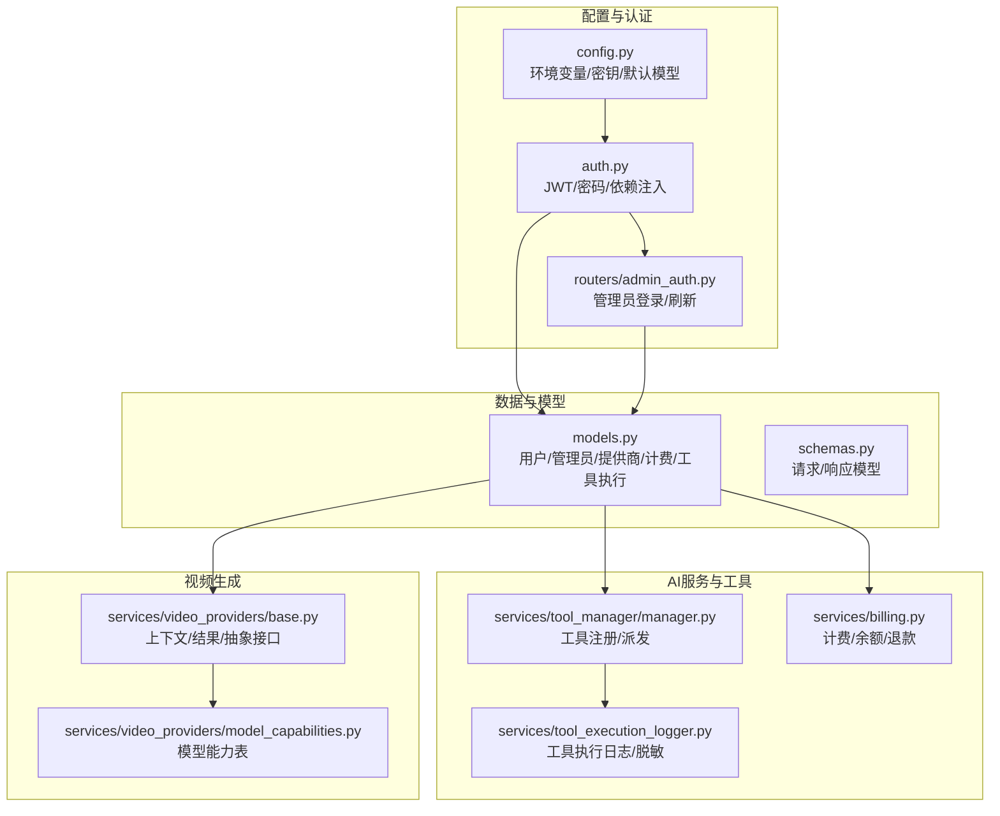
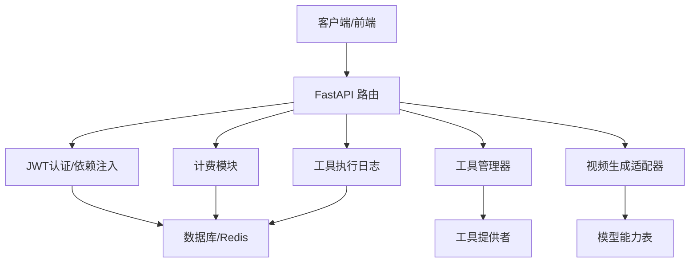
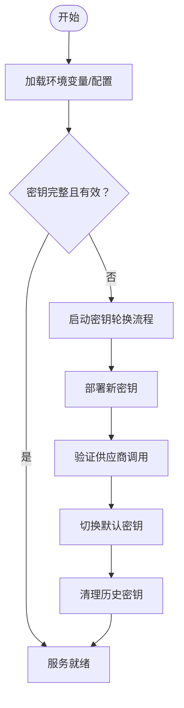
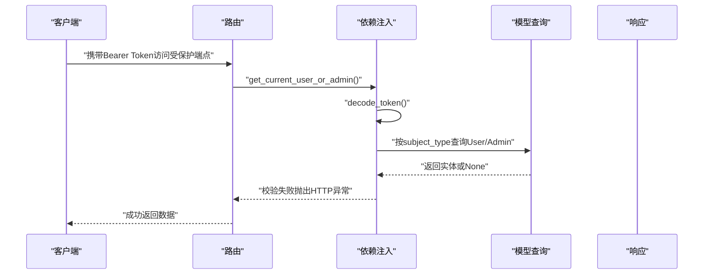
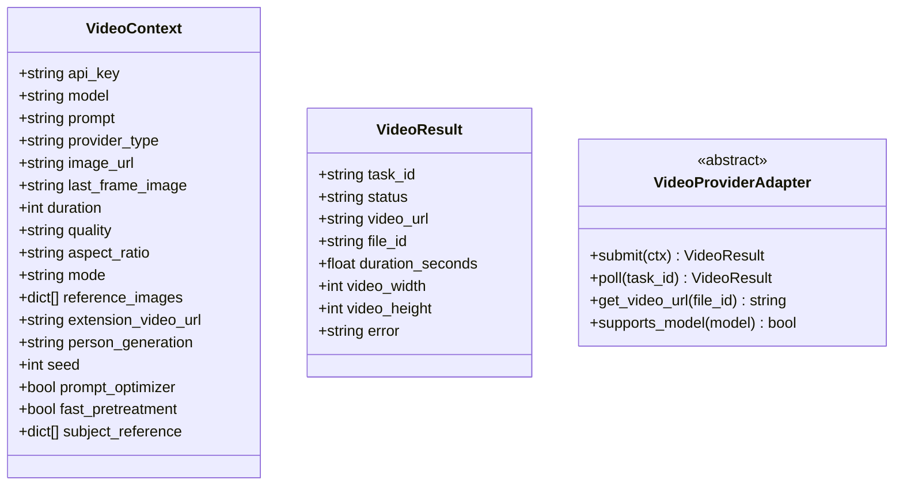
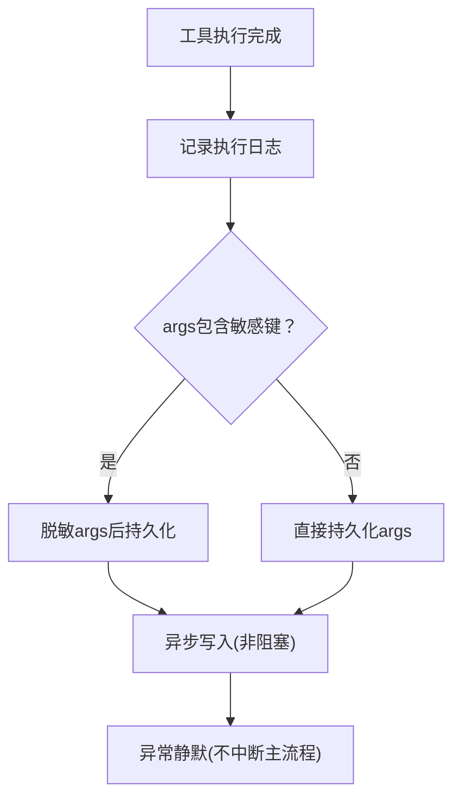
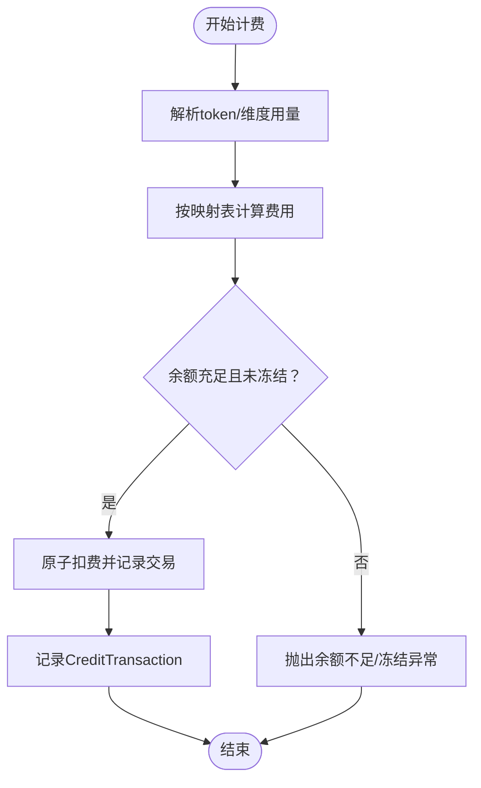
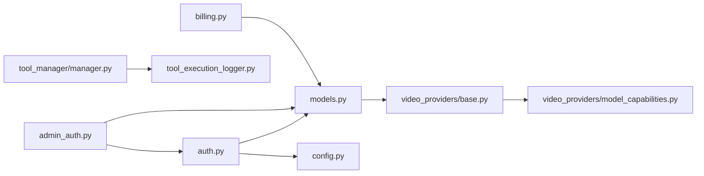

# AI服务安全

<cite>
**本文引用的文件**
- [config.py](file://backend/config.py)
- [auth.py](file://backend/auth.py)
- [admin_auth.py](file://backend/routers/admin_auth.py)
- [models.py](file://backend/models.py)
- [schemas.py](file://backend/schemas.py)
- [tool_execution_logger.py](file://backend/services/tool_execution_logger.py)
- [manager.py](file://backend/services/tool_manager/manager.py)
- [base.py](file://backend/services/video_providers/base.py)
- [model_capabilities.py](file://backend/services/video_providers/model_capabilities.py)
- [billing.py](file://backend/services/billing.py)
</cite>

## 目录
1. [简介](#简介)
2. [项目结构](#项目结构)
3. [核心组件](#核心组件)
4. [架构总览](#架构总览)
5. [详细组件分析](#详细组件分析)
6. [依赖分析](#依赖分析)
7. [性能考虑](#性能考虑)
8. [故障排查指南](#故障排查指南)
9. [结论](#结论)
10. [附录](#附录)

## 简介
本文件面向KunFlix的AI服务安全配置，聚焦以下目标：
- AI服务密钥的安全管理：环境变量配置、密钥轮换策略、访问控制清单
- API调用鉴权机制：请求签名验证、IP白名单限制
- AI生成内容安全：恶意内容检测与合规性检查建议
- 第三方AI服务集成安全：服务端到服务端认证与数据加密
- 工具调用安全审计：执行日志记录与异常行为监控
- API配额管理与滥用防护：余额冻结、计费与限额策略

本文件严格依据仓库现有代码进行分析与说明，不臆造不存在的功能。

## 项目结构
后端采用FastAPI + SQLAlchemy异步架构，AI服务相关的关键模块分布如下：
- 配置层：集中于配置类与环境变量加载
- 认证与授权：用户/管理员双轨JWT认证与依赖注入
- 数据模型：用户、管理员、提供商、会话、计费等
- 工具与视频生成：工具注册与调度、视频生成适配器与能力表
- 安全审计：工具执行日志记录与敏感信息脱敏
- 计费与配额：原子化扣费、余额冻结与退款

**图表来源**
- [config.py:1-43](file://backend/config.py#L1-L43)
- [auth.py:1-229](file://backend/auth.py#L1-L229)
- [admin_auth.py:1-136](file://backend/routers/admin_auth.py#L1-L136)
- [models.py:1-503](file://backend/models.py#L1-L503)
- [schemas.py:1-931](file://backend/schemas.py#L1-L931)
- [manager.py:1-108](file://backend/services/tool_manager/manager.py#L1-L108)
- [tool_execution_logger.py:1-89](file://backend/services/tool_execution_logger.py#L1-L89)
- [base.py:1-121](file://backend/services/video_providers/base.py#L1-L121)
- [model_capabilities.py:1-477](file://backend/services/video_providers/model_capabilities.py#L1-L477)
- [billing.py:1-388](file://backend/services/billing.py#L1-L388)

**章节来源**
- [config.py:1-43](file://backend/config.py#L1-L43)
- [auth.py:1-229](file://backend/auth.py#L1-L229)
- [admin_auth.py:1-136](file://backend/routers/admin_auth.py#L1-L136)
- [models.py:1-503](file://backend/models.py#L1-L503)
- [schemas.py:1-931](file://backend/schemas.py#L1-L931)
- [manager.py:1-108](file://backend/services/tool_manager/manager.py#L1-L108)
- [tool_execution_logger.py:1-89](file://backend/services/tool_execution_logger.py#L1-L89)
- [base.py:1-121](file://backend/services/video_providers/base.py#L1-L121)
- [model_capabilities.py:1-477](file://backend/services/video_providers/model_capabilities.py#L1-L477)
- [billing.py:1-388](file://backend/services/billing.py#L1-L388)

## 核心组件
- 配置与密钥管理
  - 环境变量加载：通过配置类加载数据库、Redis、AI提供商密钥、JWT密钥与算法等
  - 密钥存储：AI提供商密钥以明文形式存储于数据库（建议加密存储）
- 认证与授权
  - 用户/管理员双轨JWT：支持访问令牌与刷新令牌，依赖注入自动校验
  - 管理员独立表与登录流程：独立的管理员表与登录/刷新接口
- 工具与视频生成
  - 工具注册与派发：集中式工具管理器，按名称O(1)派发
  - 视频生成适配器：统一上下文/结果抽象，屏蔽供应商差异
- 安全审计
  - 工具执行日志：非阻塞异步写入，敏感参数脱敏
- 计费与配额
  - 原子化扣费与退款：并发安全，余额冻结保护
  - 多维度计费：文本/图像/搜索/视频等维度映射表

**章节来源**
- [config.py:1-43](file://backend/config.py#L1-L43)
- [auth.py:1-229](file://backend/auth.py#L1-L229)
- [admin_auth.py:1-136](file://backend/routers/admin_auth.py#L1-L136)
- [models.py:152-176](file://backend/models.py#L152-L176)
- [manager.py:1-108](file://backend/services/tool_manager/manager.py#L1-L108)
- [tool_execution_logger.py:1-89](file://backend/services/tool_execution_logger.py#L1-L89)
- [base.py:1-121](file://backend/services/video_providers/base.py#L1-L121)
- [billing.py:1-388](file://backend/services/billing.py#L1-L388)

## 架构总览
下图展示了AI服务安全的关键交互：认证与授权、密钥与配置、工具与视频生成、计费与审计。

**图表来源**
- [auth.py:1-229](file://backend/auth.py#L1-L229)
- [models.py:1-503](file://backend/models.py#L1-L503)
- [manager.py:1-108](file://backend/services/tool_manager/manager.py#L1-L108)
- [base.py:1-121](file://backend/services/video_providers/base.py#L1-L121)
- [model_capabilities.py:1-477](file://backend/services/video_providers/model_capabilities.py#L1-L477)
- [billing.py:1-388](file://backend/services/billing.py#L1-L388)
- [tool_execution_logger.py:1-89](file://backend/services/tool_execution_logger.py#L1-L89)

## 详细组件分析

### 配置与密钥安全管理
- 环境变量配置
  - 数据库URL、Redis连接、AI提供商密钥（OpenAI/Claude/Gemini）、JWT密钥与算法、默认模型等均来自配置类
  - 建议生产环境使用强随机密钥，避免默认值；数据库URL可切换至PostgreSQL
- 密钥轮换策略
  - 当前密钥存储于配置类与数据库（LLMProvider.api_key明文），建议引入密钥轮换流程：
    - 新增密钥后，先在配置与数据库中并存一段时间
    - 切换默认密钥，验证各供应商调用正常
    - 清理历史密钥与过期记录
- 访问控制清单
  - 建议在网关/反向代理层实施IP白名单与速率限制
  - 对管理员端点（如/llm_config、/tools/logs）单独白名单与MFA

**图表来源**
- [config.py:1-43](file://backend/config.py#L1-L43)
- [models.py:152-176](file://backend/models.py#L152-L176)

**章节来源**
- [config.py:1-43](file://backend/config.py#L1-L43)
- [models.py:152-176](file://backend/models.py#L152-L176)

### API鉴权机制与请求签名
- JWT鉴权
  - 用户与管理员分别使用独立依赖注入，访问令牌payload包含主体ID、角色与类型
  - 刷新令牌流程对管理员与用户分别校验
- 请求签名验证
  - 仓库未实现请求签名验证（如HMAC），建议在网关层或边缘代理实现
- IP白名单限制
  - 仓库未实现IP白名单，建议在反向代理或WAF层配置

**图表来源**
- [auth.py:83-210](file://backend/auth.py#L83-L210)
- [models.py:10-32](file://backend/models.py#L10-L32)
- [models.py:35-73](file://backend/models.py#L35-L73)

**章节来源**
- [auth.py:1-229](file://backend/auth.py#L1-L229)
- [admin_auth.py:1-136](file://backend/routers/admin_auth.py#L1-L136)

### AI生成内容安全过滤
- 恶意内容检测
  - 仓库未实现内置内容过滤或合规检查
  - 建议在工具层或供应商调用前增加内容审核（如第三方审核服务或本地规则）
- 合规性检查
  - 建议在生成前对提示词与输出进行合规扫描，结合黑名单/白名单策略

[本节为概念性建议，不直接分析具体文件]

### 第三方AI服务集成安全
- 服务端到服务端认证
  - 供应商密钥存储于数据库（明文），建议改为加密存储并在应用内缓存密钥
  - 建议在供应商侧启用API密钥最小权限与IP白名单
- 数据加密
  - 建议对敏感字段（如api_key）在传输与存储层面启用TLS与加密
- 视频生成适配器
  - 统一上下文/结果抽象，便于在不同供应商间切换与增强安全策略

**图表来源**
- [base.py:15-121](file://backend/services/video_providers/base.py#L15-L121)

**章节来源**
- [base.py:1-121](file://backend/services/video_providers/base.py#L1-L121)
- [model_capabilities.py:1-477](file://backend/services/video_providers/model_capabilities.py#L1-L477)

### 工具调用安全审计
- 日志记录
  - 工具执行日志异步写入，失败静默，不影响主流程
  - 敏感参数键集合（如api_key、secret、token、password）会被脱敏
- 异常行为监控
  - 建议结合日志与指标（耗时、错误率、超时）建立告警
  - 对高风险工具（如文件读取、画布操作）增加二次确认与审计

**图表来源**
- [tool_execution_logger.py:39-89](file://backend/services/tool_execution_logger.py#L39-L89)

**章节来源**
- [tool_execution_logger.py:1-89](file://backend/services/tool_execution_logger.py#L1-L89)
- [manager.py:87-91](file://backend/services/tool_manager/manager.py#L87-L91)

### API配额管理与滥用防护
- 余额与冻结
  - 扣费与退款均为原子操作，余额冻结保护防止透支
- 计费维度
  - 文本输入/输出、图像输出、搜索、图像生成等维度映射表
  - 视频计费按输入图片/秒与输出分辨率映射
- 滥用防护建议
  - 在网关层实施速率限制与配额阈值
  - 对高成本工具/模型设置单次上限与日累计上限

**图表来源**
- [billing.py:310-388](file://backend/services/billing.py#L310-L388)
- [billing.py:178-309](file://backend/services/billing.py#L178-L309)

**章节来源**
- [billing.py:1-388](file://backend/services/billing.py#L1-L388)
- [models.py:281-301](file://backend/models.py#L281-L301)

## 依赖分析
- 组件耦合
  - 认证依赖模型层（User/Admin）与配置层（JWT密钥）
  - 工具管理器依赖工具提供者与上下文，日志模块独立但与工具上下文耦合
  - 计费模块依赖用户/管理员模型与CreditTransaction模型
  - 视频生成适配器依赖能力表与上下文
- 外部依赖
  - 数据库（SQLite/PostgreSQL）、Redis、第三方AI供应商API
- 循环依赖
  - 认证模块中为避免循环导入使用延迟导入

**图表来源**
- [auth.py:1-229](file://backend/auth.py#L1-L229)
- [admin_auth.py:1-136](file://backend/routers/admin_auth.py#L1-L136)
- [models.py:1-503](file://backend/models.py#L1-L503)
- [manager.py:1-108](file://backend/services/tool_manager/manager.py#L1-L108)
- [tool_execution_logger.py:1-89](file://backend/services/tool_execution_logger.py#L1-L89)
- [base.py:1-121](file://backend/services/video_providers/base.py#L1-L121)
- [model_capabilities.py:1-477](file://backend/services/video_providers/model_capabilities.py#L1-L477)
- [billing.py:1-388](file://backend/services/billing.py#L1-L388)

**章节来源**
- [auth.py:1-229](file://backend/auth.py#L1-L229)
- [admin_auth.py:1-136](file://backend/routers/admin_auth.py#L1-L136)
- [models.py:1-503](file://backend/models.py#L1-L503)
- [manager.py:1-108](file://backend/services/tool_manager/manager.py#L1-L108)
- [tool_execution_logger.py:1-89](file://backend/services/tool_execution_logger.py#L1-L89)
- [base.py:1-121](file://backend/services/video_providers/base.py#L1-L121)
- [model_capabilities.py:1-477](file://backend/services/video_providers/model_capabilities.py#L1-L477)
- [billing.py:1-388](file://backend/services/billing.py#L1-L388)

## 性能考虑
- 非阻塞日志：工具执行日志采用异步任务写入，失败静默，降低对主流程影响
- 原子化计费：数据库UPDATE条件确保并发安全，减少锁竞争
- 依赖注入：JWT解码与实体查询在中间件层完成，避免重复逻辑

[本节为一般性指导，不直接分析具体文件]

## 故障排查指南
- 认证失败
  - 检查Token是否过期、算法与密钥是否匹配
  - 管理员登录失败可能因账户禁用或IP限制（建议在网关层实现）
- 余额不足/冻结
  - 核对用户/管理员余额与冻结状态
  - 查看CreditTransaction记录核对扣费明细
- 工具执行异常
  - 检查工具执行日志中的脱敏参数与错误信息
  - 关注高耗时工具与频繁调用的异常行为
- 视频生成问题
  - 核对模型能力表与供应商支持情况
  - 检查上下文参数（时长、分辨率、参考图数量等）

**章节来源**
- [auth.py:65-113](file://backend/auth.py#L65-L113)
- [billing.py:45-84](file://backend/services/billing.py#L45-L84)
- [billing.py:178-309](file://backend/services/billing.py#L178-L309)
- [tool_execution_logger.py:44-89](file://backend/services/tool_execution_logger.py#L44-L89)
- [model_capabilities.py:461-477](file://backend/services/video_providers/model_capabilities.py#L461-L477)

## 结论
本项目在认证、计费与审计方面具备清晰的模块化设计，但在以下方面仍有改进空间：
- 密钥存储加密与轮换流程
- 请求签名验证与IP白名单
- 内容安全过滤与合规检查
- 第三方供应商的最小权限与加密传输
- 网关层的速率限制与滥用防护

建议尽快补齐上述安全能力，以满足生产环境的安全要求。

## 附录
- 配置项要点
  - 数据库URL、Redis URL、AI提供商密钥、JWT密钥与算法、默认模型
- 审计字段
  - 工具执行日志包含工具名、提供者名、参数摘要、结果摘要、状态、耗时等

**章节来源**
- [config.py:1-43](file://backend/config.py#L1-L43)
- [tool_execution_logger.py:44-89](file://backend/services/tool_execution_logger.py#L44-L89)