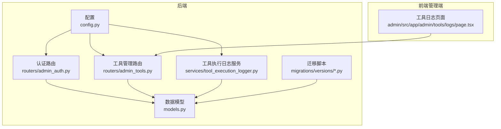
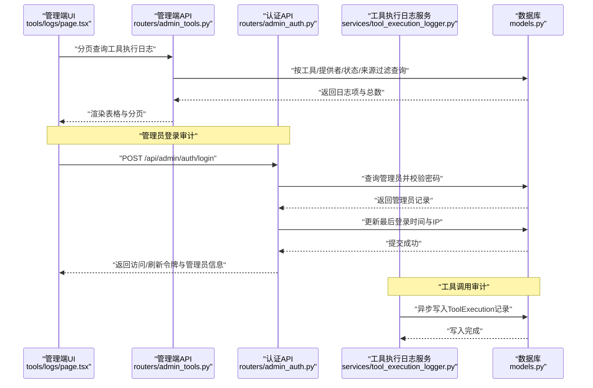
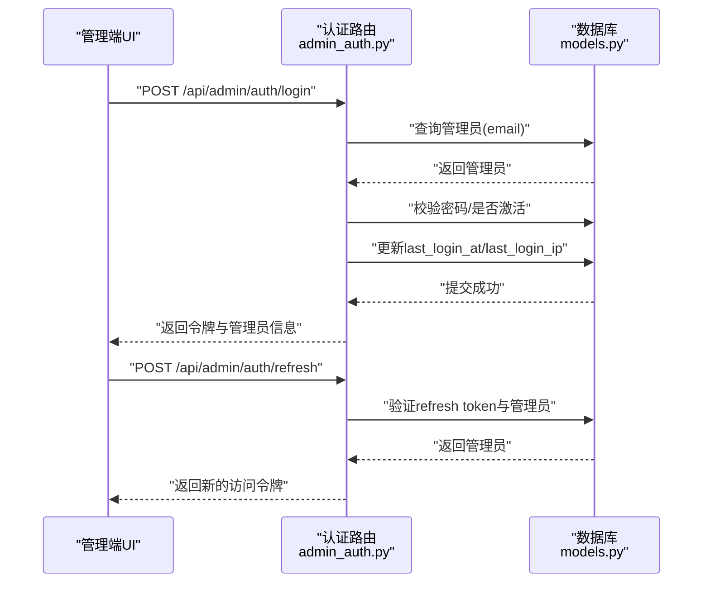
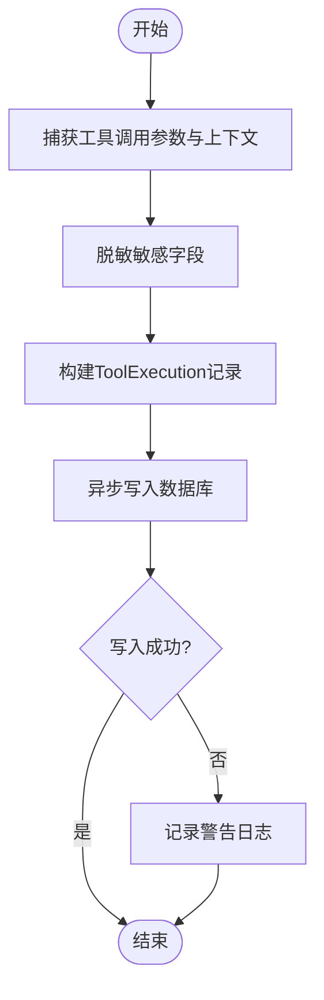
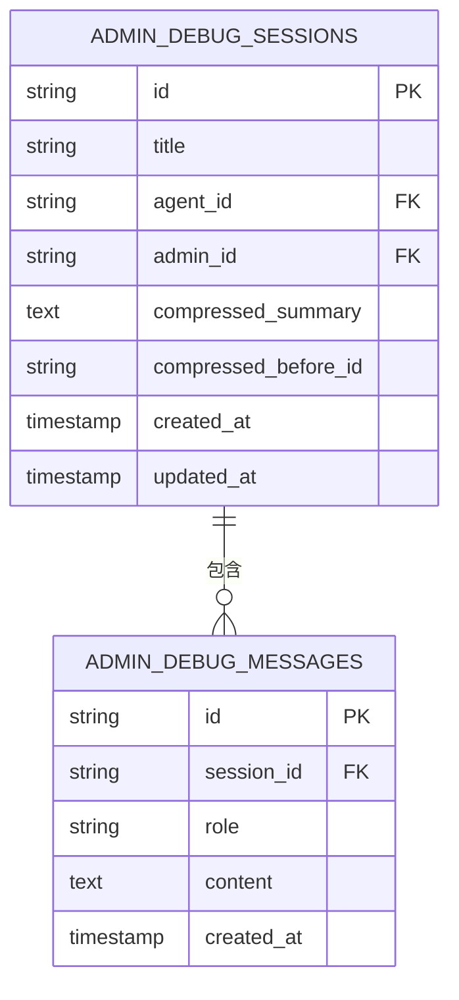
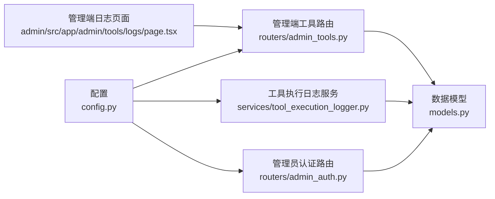

# 安全审计与监控

<cite>
**本文引用的文件**
- [backend/config.py](file://backend/config.py)
- [backend/models.py](file://backend/models.py)
- [backend/schemas.py](file://backend/schemas.py)
- [backend/routers/admin_auth.py](file://backend/routers/admin_auth.py)
- [backend/routers/admin_tools.py](file://backend/routers/admin_tools.py)
- [backend/services/tool_execution_logger.py](file://backend/services/tool_execution_logger.py)
- [backend/admin/src/app/admin/tools/logs/page.tsx](file://backend/admin/src/app/admin/tools/logs/page.tsx)
- [backend/migrations/versions/4d66cc052bfb_add_admin_debug_sessions.py](file://backend/migrations/versions/4d66cc052bfb_add_admin_debug_sessions.py)
- [backend/migrations/versions/4c1a8970b23d_add_compaction_to_admin_debug_sessions.py](file://backend/migrations/versions/4c1a8970b23d_add_compaction_to_admin_debug_sessions.py)
- [backend/migrations/versions/909762287e70_add_compaction_config_to_agent.py](file://backend/migrations/versions/909762287e70_add_compaction_config_to_agent.py)
- [backend/migrations/versions/r6s7t8u9v0w1_add_agent_video_config.py](file://backend/migrations/versions/r6s7t8u9v0w1_add_agent_video_config.py)
</cite>

## 目录
1. [简介](#简介)
2. [项目结构](#项目结构)
3. [核心组件](#核心组件)
4. [架构总览](#架构总览)
5. [详细组件分析](#详细组件分析)
6. [依赖分析](#依赖分析)
7. [性能考虑](#性能考虑)
8. [故障排查指南](#故障排查指南)
9. [结论](#结论)
10. [附录](#附录)

## 简介
本文件面向KunFlix项目的“安全审计与监控”主题，基于现有代码库中的认证、工具执行日志、调试会话与数据库模型，构建一套可落地的审计与监控配置方案。内容涵盖：
- 安全日志配置：登录尝试、API调用、数据访问、管理员操作
- 违规行为检测机制：异常登录模式、频繁失败的API调用、可疑的数据访问模式
- 实时监控配置：关键指标监控、告警阈值、通知机制
- 日志分析与报告：安全事件关联分析、趋势预测
- 合规性报告：GDPR、CCPA等法规要求的审计证据收集
- 安全事件响应流程与取证工具集成建议

## 项目结构
后端采用FastAPI + SQLAlchemy + 异步数据库访问；前端为Next.js管理端。与安全审计密切相关的模块包括：
- 认证与鉴权：管理员登录路由、令牌刷新、当前管理员信息
- 工具执行日志：非阻塞写入、敏感字段脱敏、状态与耗时记录
- 数据模型：审计与监控所需的实体（管理员、工具执行、调试会话等）
- 管理端页面：工具执行日志的可视化与过滤

图示来源
- [backend/config.py:1-43](file://backend/config.py#L1-L43)
- [backend/routers/admin_auth.py:1-136](file://backend/routers/admin_auth.py#L1-L136)
- [backend/routers/admin_tools.py:1-273](file://backend/routers/admin_tools.py#L1-L273)
- [backend/services/tool_execution_logger.py:1-89](file://backend/services/tool_execution_logger.py#L1-L89)
- [backend/models.py:1-503](file://backend/models.py#L1-L503)
- [backend/admin/src/app/admin/tools/logs/page.tsx:1-185](file://backend/admin/src/app/admin/tools/logs/page.tsx#L1-L185)

章节来源
- [backend/config.py:1-43](file://backend/config.py#L1-L43)
- [backend/routers/admin_auth.py:1-136](file://backend/routers/admin_auth.py#L1-L136)
- [backend/routers/admin_tools.py:1-273](file://backend/routers/admin_tools.py#L1-L273)
- [backend/services/tool_execution_logger.py:1-89](file://backend/services/tool_execution_logger.py#L1-L89)
- [backend/models.py:1-503](file://backend/models.py#L1-L503)
- [backend/admin/src/app/admin/tools/logs/page.tsx:1-185](file://backend/admin/src/app/admin/tools/logs/page.tsx#L1-L185)

## 核心组件
- 管理员认证与审计
  - 登录尝试记录：IP、邮箱、成功/失败、时间戳
  - 登录成功后更新最近登录时间与IP
  - 刷新令牌校验与管理员有效性检查
- 工具执行日志
  - 非阻塞异步写入，避免影响主流程
  - 敏感字段脱敏（如密钥、口令）
  - 记录工具名、提供者、状态、耗时、来源（管理员/用户）、结果摘要与错误信息
- 数据模型支撑
  - 管理员表：邮箱、昵称、激活状态、最后登录时间/IP
  - 工具执行表：工具名、提供者、会话/用户/管理员/剧场关联、参数快照、结果摘要、状态、错误、耗时、创建时间
  - 管理员调试会话与消息：与普通会话隔离，支持上下文压缩字段
- 管理端日志页面
  - 分页、过滤（状态、工具名、管理员/用户来源）
  - 刷新与加载状态反馈

章节来源
- [backend/routers/admin_auth.py:36-90](file://backend/routers/admin_auth.py#L36-L90)
- [backend/services/tool_execution_logger.py:39-89](file://backend/services/tool_execution_logger.py#L39-L89)
- [backend/models.py:10-32](file://backend/models.py#L10-L32)
- [backend/models.py:485-503](file://backend/models.py#L485-L503)
- [backend/models.py:444-471](file://backend/models.py#L444-L471)
- [backend/admin/src/app/admin/tools/logs/page.tsx:25-185](file://backend/admin/src/app/admin/tools/logs/page.tsx#L25-L185)

## 架构总览
下图展示了从管理端到后端API、日志服务与数据库的整体交互，以及审计与监控的关键落点。

图示来源
- [backend/admin/src/app/admin/tools/logs/page.tsx:25-185](file://backend/admin/src/app/admin/tools/logs/page.tsx#L25-L185)
- [backend/routers/admin_tools.py:135-187](file://backend/routers/admin_tools.py#L135-L187)
- [backend/routers/admin_auth.py:36-90](file://backend/routers/admin_auth.py#L36-L90)
- [backend/services/tool_execution_logger.py:44-89](file://backend/services/tool_execution_logger.py#L44-L89)
- [backend/models.py:485-503](file://backend/models.py#L485-L503)

## 详细组件分析

### 管理员登录与审计
- 登录入口：/api/admin/auth/login
  - 记录邮箱与客户端IP
  - 校验管理员是否存在、密码正确、账户有效
  - 成功后更新last_login_at与last_login_ip
- 刷新令牌：/api/admin/auth/refresh
  - 校验refresh token类型与管理员有效性
  - 重新签发访问令牌
- 当前管理员信息：/api/admin/auth/me
  - 返回当前管理员基本信息

图示来源
- [backend/routers/admin_auth.py:36-136](file://backend/routers/admin_auth.py#L36-L136)
- [backend/models.py:10-32](file://backend/models.py#L10-L32)

章节来源
- [backend/routers/admin_auth.py:36-136](file://backend/routers/admin_auth.py#L36-L136)
- [backend/models.py:10-32](file://backend/models.py#L10-L32)

### 工具执行日志与审计
- 写入策略
  - 非阻塞：使用异步任务调度写入
  - 失败静默：捕获异常并记录警告，不中断主流程
- 数据脱敏
  - 过滤参数快照中的敏感键（如api_key、secret、token、password）
- 记录字段
  - 工具名、提供者名、Agent/会话/用户/管理员/剧场ID
  - 参数快照、结果摘要、状态(success/error)、错误信息、耗时(ms)
  - 创建时间
- 管理端查询
  - 支持按工具名、提供者、状态、Agent ID过滤
  - 分页与总数统计
  - 展示来源（管理员/用户）、耗时、结果摘要

图示来源
- [backend/services/tool_execution_logger.py:39-89](file://backend/services/tool_execution_logger.py#L39-L89)
- [backend/models.py:485-503](file://backend/models.py#L485-L503)
- [backend/routers/admin_tools.py:135-187](file://backend/routers/admin_tools.py#L135-L187)
- [backend/admin/src/app/admin/tools/logs/page.tsx:25-185](file://backend/admin/src/app/admin/tools/logs/page.tsx#L25-L185)

章节来源
- [backend/services/tool_execution_logger.py:39-89](file://backend/services/tool_execution_logger.py#L39-L89)
- [backend/models.py:485-503](file://backend/models.py#L485-L503)
- [backend/routers/admin_tools.py:74-187](file://backend/routers/admin_tools.py#L74-L187)
- [backend/admin/src/app/admin/tools/logs/page.tsx:25-185](file://backend/admin/src/app/admin/tools/logs/page.tsx#L25-L185)

### 管理员调试会话与消息
- 表结构
  - admin_debug_sessions：标题、Agent/管理员关联、上下文压缩字段
  - admin_debug_messages：与会话关联的消息
- 用途
  - 与普通用户会话隔离，便于审计与复盘
  - 支持上下文压缩字段，便于追踪历史摘要

图示来源
- [backend/models.py:444-471](file://backend/models.py#L444-L471)
- [backend/migrations/versions/4d66cc052bfb_add_admin_debug_sessions.py:23-50](file://backend/migrations/versions/4d66cc052bfb_add_admin_debug_sessions.py#L23-L50)

章节来源
- [backend/models.py:444-471](file://backend/models.py#L444-L471)
- [backend/migrations/versions/4d66cc052bfb_add_admin_debug_sessions.py:21-68](file://backend/migrations/versions/4d66cc052bfb_add_admin_debug_sessions.py#L21-L68)
- [backend/migrations/versions/4c1a8970b23d_add_compaction_to_admin_debug_sessions.py:21-36](file://backend/migrations/versions/4c1a8970b23d_add_compaction_to_admin_debug_sessions.py#L21-L36)
- [backend/migrations/versions/909762287e70_add_compaction_config_to_agent.py:21-34](file://backend/migrations/versions/909762287e70_add_compaction_config_to_agent.py#L21-L34)
- [backend/migrations/versions/r6s7t8u9v0w1_add_agent_video_config.py:21-28](file://backend/migrations/versions/r6s7t8u9v0w1_add_agent_video_config.py#L21-L28)

## 依赖分析
- 组件耦合
  - 管理端日志页面依赖管理端工具路由提供的分页与过滤接口
  - 工具执行日志服务依赖数据库会话与模型定义
  - 认证路由依赖数据库模型与配置（令牌过期时间等）
- 外部依赖
  - 配置中心：环境变量驱动的数据库URL、Redis、AI密钥、JWT密钥与算法、访问令牌过期分钟数
  - 数据库：SQLite/PostgreSQL（通过SQLAlchemy异步驱动）

图示来源
- [backend/admin/src/app/admin/tools/logs/page.tsx:25-185](file://backend/admin/src/app/admin/tools/logs/page.tsx#L25-L185)
- [backend/routers/admin_tools.py:1-273](file://backend/routers/admin_tools.py#L1-L273)
- [backend/services/tool_execution_logger.py:1-89](file://backend/services/tool_execution_logger.py#L1-L89)
- [backend/routers/admin_auth.py:1-136](file://backend/routers/admin_auth.py#L1-L136)
- [backend/config.py:1-43](file://backend/config.py#L1-L43)

章节来源
- [backend/config.py:1-43](file://backend/config.py#L1-L43)
- [backend/routers/admin_tools.py:1-273](file://backend/routers/admin_tools.py#L1-L273)
- [backend/services/tool_execution_logger.py:1-89](file://backend/services/tool_execution_logger.py#L1-L89)
- [backend/routers/admin_auth.py:1-136](file://backend/routers/admin_auth.py#L1-L136)
- [backend/admin/src/app/admin/tools/logs/page.tsx:1-185](file://backend/admin/src/app/admin/tools/logs/page.tsx#L1-L185)

## 性能考虑
- 工具执行日志写入采用异步任务，避免阻塞主流程
- 日志查询支持分页与索引列过滤，减少数据库压力
- 建议对高频查询增加数据库索引（如ToolExecution的工具名、状态、创建时间）
- 对日志表进行定期归档与清理，防止无限增长

## 故障排查指南
- 登录失败
  - 检查管理员是否存在、密码是否正确、账户是否激活
  - 核对last_login_at与last_login_ip是否更新
- 工具执行日志缺失
  - 确认异步写入任务是否被调度
  - 检查日志服务异常警告
  - 核对参数快照是否被脱敏导致关键字段为空
- 查询无结果
  - 确认过滤条件（工具名、提供者、状态、Agent ID）是否正确
  - 检查分页skip/limit与总数统计

章节来源
- [backend/routers/admin_auth.py:50-80](file://backend/routers/admin_auth.py#L50-L80)
- [backend/services/tool_execution_logger.py:73-75](file://backend/services/tool_execution_logger.py#L73-L75)
- [backend/routers/admin_tools.py:135-187](file://backend/routers/admin_tools.py#L135-L187)

## 结论
本方案以现有代码为基础，建立了管理员登录审计、工具执行日志、调试会话与管理端可视化的闭环。通过非阻塞日志写入、参数脱敏与分页查询，兼顾了性能与可观测性。后续可在现有基础上扩展实时监控、违规检测与合规报告自动化能力。

## 附录

### 安全审计日志配置清单
- 登录尝试
  - 记录：邮箱、客户端IP、时间戳、成功/失败
  - 更新：last_login_at、last_login_ip
- API调用
  - 记录：工具名、提供者、Agent/会话/用户/管理员/剧场ID、状态、耗时、结果摘要、错误信息
  - 脱敏：api_key、secret、token、password
- 数据访问
  - 通过分页查询与过滤实现最小化暴露
  - 管理端仅开放必要字段与统计
- 管理员操作
  - 调试会话与消息独立表，支持上下文压缩字段

章节来源
- [backend/routers/admin_auth.py:43-80](file://backend/routers/admin_auth.py#L43-L80)
- [backend/services/tool_execution_logger.py:39-89](file://backend/services/tool_execution_logger.py#L39-L89)
- [backend/models.py:485-503](file://backend/models.py#L485-L503)
- [backend/models.py:444-471](file://backend/models.py#L444-L471)

### 违规行为检测机制
- 异常登录模式
  - IP变更频繁、短时间内多次失败
  - 建议在认证层增加IP与邮箱维度的失败计数与封禁策略
- 频繁失败的API调用
  - 统计工具错误率与平均耗时，设定阈值触发告警
- 可疑的数据访问模式
  - 对高价值资源的异常访问频率与范围进行监控

章节来源
- [backend/routers/admin_auth.py:50-64](file://backend/routers/admin_auth.py#L50-L64)
- [backend/routers/admin_tools.py:74-128](file://backend/routers/admin_tools.py#L74-L128)

### 实时监控与告警
- 关键指标
  - 登录失败率、工具错误率、平均耗时、并发执行数
- 告警阈值
  - 错误率超过X%、耗时超过Y ms、失败登录超过Z次
- 通知机制
  - 邮件/IM推送至安全运营团队

[本节为通用实践建议，无需具体文件引用]

### 日志分析与报告
- 安全事件关联分析
  - 将登录失败与随后的工具错误进行时间窗口关联
- 趋势预测
  - 基于历史日志统计，预测峰值与异常波动
- 合规性报告
  - GDPR：数据主体访问、删除、限制处理请求的审计轨迹
  - CCPA：销售信息披露、删除请求的审计证据

[本节为通用实践建议，无需具体文件引用]

### 安全事件响应流程与取证
- 响应流程
  - 发现告警 → 快速评估 → 隔离风险 → 恢复服务 → 根因分析 → 报告与改进
- 取证工具集成
  - 日志聚合与可视化（如ELK/Graylog）
  - 审计日志导出与归档

[本节为通用实践建议，无需具体文件引用]