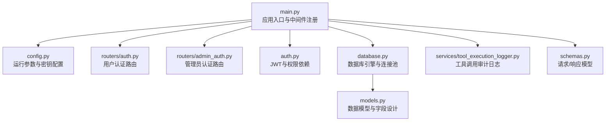
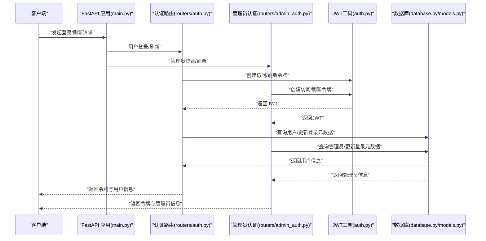
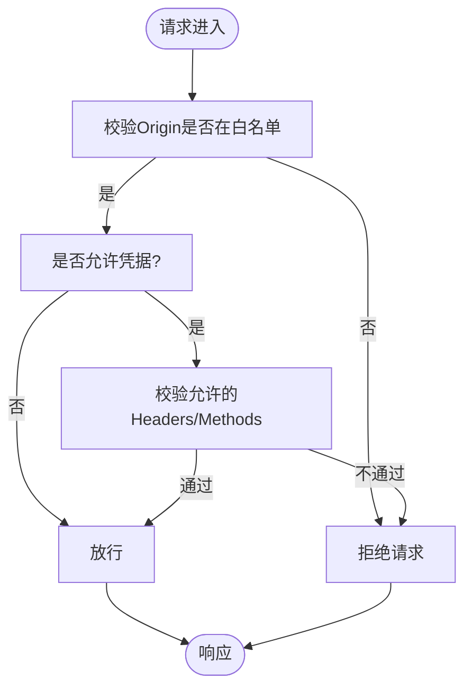
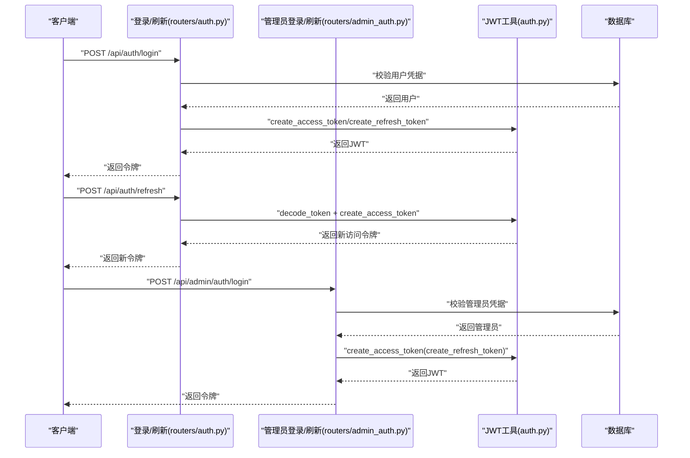
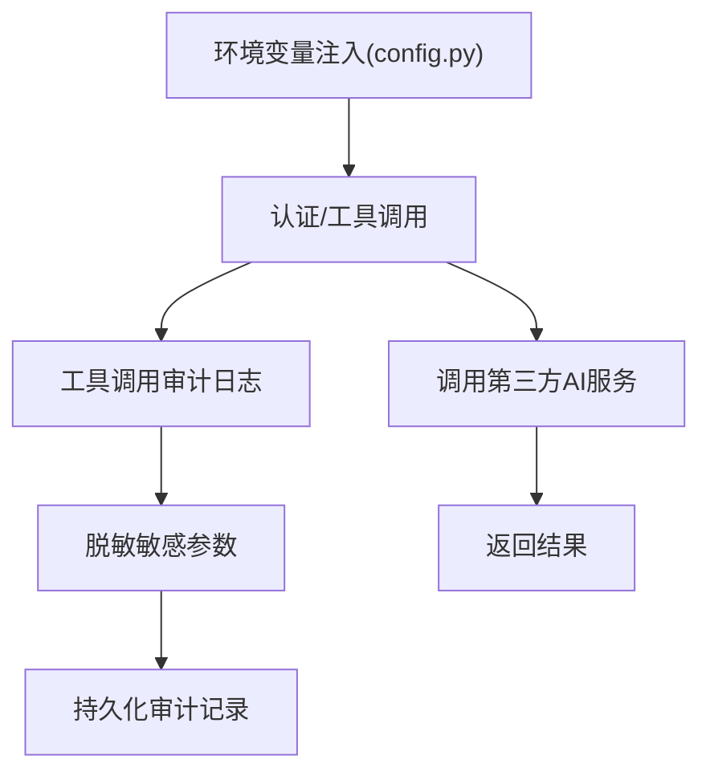
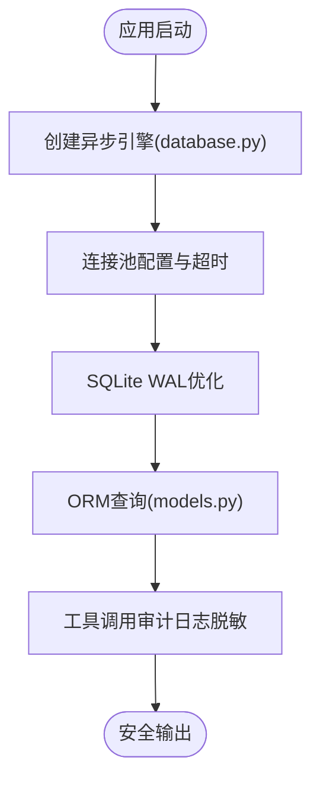
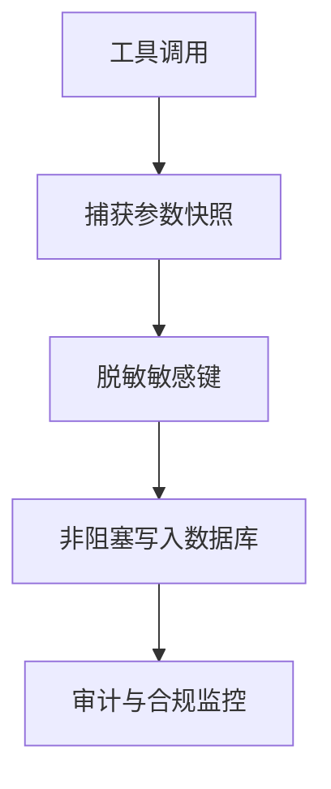
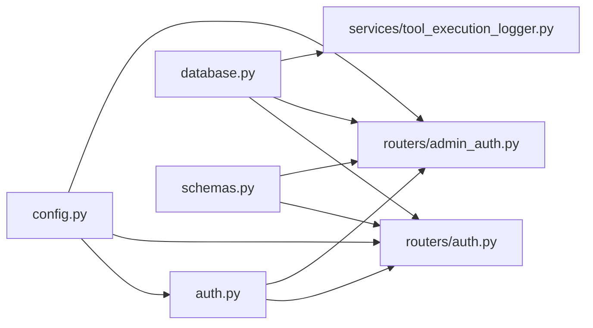

# 安全配置

<cite>
**本文引用的文件**
- [backend/config.py](file://backend/config.py)
- [backend/main.py](file://backend/main.py)
- [backend/auth.py](file://backend/auth.py)
- [backend/routers/auth.py](file://backend/routers/auth.py)
- [backend/routers/admin_auth.py](file://backend/routers/admin_auth.py)
- [backend/database.py](file://backend/database.py)
- [backend/models.py](file://backend/models.py)
- [backend/schemas.py](file://backend/schemas.py)
- [backend/services/tool_execution_logger.py](file://backend/services/tool_execution_logger.py)
- [backend/requirements.txt](file://backend/requirements.txt)
</cite>

## 目录
1. [简介](#简介)
2. [项目结构](#项目结构)
3. [核心组件](#核心组件)
4. [架构总览](#架构总览)
5. [详细组件分析](#详细组件分析)
6. [依赖关系分析](#依赖关系分析)
7. [性能考虑](#性能考虑)
8. [故障排查指南](#故障排查指南)
9. [结论](#结论)
10. [附录](#附录)

## 简介
本文件面向Infinite Game项目的后端安全配置，聚焦以下方面：
- HTTPS与传输层安全：建议在生产环境启用TLS终止与证书管理
- API访问频率限制：建议引入速率限制中间件或网关限流
- CORS策略：当前已配置，需结合生产域名与来源进行加固
- JWT令牌管理：过期时间、刷新机制与权限验证流程
- AI服务密钥管理：环境变量配置、密钥轮换与最小暴露面
- 数据库安全：连接加密、SQL注入防护与敏感数据脱敏
- 网络安全：防火墙、DDoS与IP白名单建议
- 安全审计与违规检测：日志记录与敏感信息脱敏

## 项目结构
后端采用FastAPI + SQLAlchemy异步ORM，安全相关配置主要集中在配置模块、认证路由与中间件中。

**图示来源**
- [backend/main.py:110-153](file://backend/main.py#L110-L153)
- [backend/config.py:7-42](file://backend/config.py#L7-L42)
- [backend/routers/auth.py:30-33](file://backend/routers/auth.py#L30-L33)
- [backend/routers/admin_auth.py:29-33](file://backend/routers/admin_auth.py#L29-L33)
- [backend/auth.py:83-113](file://backend/auth.py#L83-L113)
- [backend/database.py:9-19](file://backend/database.py#L9-L19)
- [backend/models.py:10-33](file://backend/models.py#L10-L33)
- [backend/services/tool_execution_logger.py:39-88](file://backend/services/tool_execution_logger.py#L39-L88)
- [backend/schemas.py:13-28](file://backend/schemas.py#L13-L28)

**章节来源**
- [backend/main.py:110-153](file://backend/main.py#L110-L153)
- [backend/config.py:7-42](file://backend/config.py#L7-L42)

## 核心组件
- 配置中心：集中管理数据库URL、Redis、AI密钥、JWT参数与系统开关
- 认证与授权：用户与管理员双轨认证，JWT访问/刷新令牌，权限依赖校验
- CORS中间件：跨域来源白名单与凭证允许
- 数据库引擎：连接池、SQLite WAL优化与超时控制
- 工具调用审计：非阻塞记录工具调用，自动脱敏敏感参数

**章节来源**
- [backend/config.py:22-30](file://backend/config.py#L22-L30)
- [backend/auth.py:30-62](file://backend/auth.py#L30-L62)
- [backend/main.py:130-136](file://backend/main.py#L130-L136)
- [backend/database.py:9-19](file://backend/database.py#L9-L19)
- [backend/services/tool_execution_logger.py:39-88](file://backend/services/tool_execution_logger.py#L39-L88)

## 架构总览
下图展示了认证与授权的关键交互流程，以及CORS与数据库连接在整体中的位置。

**图示来源**
- [backend/main.py:139-153](file://backend/main.py#L139-L153)
- [backend/routers/auth.py:63-99](file://backend/routers/auth.py#L63-L99)
- [backend/routers/admin_auth.py:36-90](file://backend/routers/admin_auth.py#L36-L90)
- [backend/auth.py:30-62](file://backend/auth.py#L30-L62)
- [backend/database.py:42-44](file://backend/database.py#L42-L44)
- [backend/models.py:35-73](file://backend/models.py#L35-L73)
- [backend/models.py:10-33](file://backend/models.py#L10-L33)

## 详细组件分析

### HTTPS与证书配置
- 当前未见显式的HTTPS服务器配置与证书加载逻辑
- 建议在生产环境中通过反向代理（Nginx/Traefik/Caddy）启用TLS终止，并配置强密码套件与安全头部
- 证书轮换应自动化，配合ACME客户端与监控告警

[本节为概念性建议，不直接分析具体文件]

### API访问频率限制
- 当前未见内置的速率限制中间件
- 建议在网关或应用层引入限流策略（如每IP每分钟请求数、令牌桶算法）
- 对认证接口与关键写操作实施更严格限制

[本节为概念性建议，不直接分析具体文件]

### CORS策略设置
- 已在应用启动时注册CORSMiddleware，允许本地开发来源并允许凭据
- 生产环境应明确列出可信域名，关闭通配符来源，限制方法与头

**图示来源**
- [backend/main.py:130-136](file://backend/main.py#L130-L136)

**章节来源**
- [backend/main.py:130-136](file://backend/main.py#L130-L136)

### JWT令牌管理配置
- 密钥与算法：使用对称密钥与哈希算法，建议使用强随机密钥并在生产环境以环境变量注入
- 过期时间：访问令牌与刷新令牌分别配置，建议短期访问令牌与较长有效期刷新令牌
- 刷新机制：管理员与用户分别提供刷新端点，解码刷新令牌并校验主体类型
- 权限验证：依赖注入解析JWT，区分用户与管理员角色，校验账户活跃状态

**图示来源**
- [backend/routers/auth.py:63-99](file://backend/routers/auth.py#L63-L99)
- [backend/routers/auth.py:102-129](file://backend/routers/auth.py#L102-L129)
- [backend/routers/admin_auth.py:36-90](file://backend/routers/admin_auth.py#L36-L90)
- [backend/routers/admin_auth.py:93-127](file://backend/routers/admin_auth.py#L93-L127)
- [backend/auth.py:30-62](file://backend/auth.py#L30-L62)
- [backend/auth.py:83-113](file://backend/auth.py#L83-L113)
- [backend/auth.py:119-151](file://backend/auth.py#L119-L151)

**章节来源**
- [backend/config.py:26-30](file://backend/config.py#L26-L30)
- [backend/auth.py:30-62](file://backend/auth.py#L30-L62)
- [backend/routers/auth.py:63-99](file://backend/routers/auth.py#L63-L99)
- [backend/routers/admin_auth.py:36-90](file://backend/routers/admin_auth.py#L36-L90)

### AI服务密钥安全管理
- 密钥来源：通过配置模块的环境变量注入（OpenAI、Claude、Gemini）
- 建议：
  - 使用环境变量或密钥管理服务（如Vault/KMS）注入
  - 实施密钥轮换流程与版本化管理
  - 在工具调用日志中自动脱敏敏感参数（已在审计日志中实现）

**图示来源**
- [backend/config.py:21-25](file://backend/config.py#L21-L25)
- [backend/services/tool_execution_logger.py:39-88](file://backend/services/tool_execution_logger.py#L39-L88)

**章节来源**
- [backend/config.py:21-25](file://backend/config.py#L21-L25)
- [backend/services/tool_execution_logger.py:39-88](file://backend/services/tool_execution_logger.py#L39-L88)

### 数据库安全配置
- 连接加密：PostgreSQL/MySQL等可通过URL参数启用TLS；SQLite默认不加密，建议生产使用远程数据库
- 连接池与超时：合理设置连接池大小与超时，启用pre_ping提升健壮性
- SQLite优化：WAL模式、busy_timeout与同步策略平衡性能与可靠性
- SQL注入防护：使用ORM查询（SQLAlchemy）与参数化查询，避免原生SQL拼接
- 敏感数据脱敏：审计日志中对敏感键进行脱敏处理

**图示来源**
- [backend/database.py:9-19](file://backend/database.py#L9-L19)
- [backend/database.py:23-31](file://backend/database.py#L23-L31)
- [backend/models.py:35-73](file://backend/models.py#L35-L73)
- [backend/services/tool_execution_logger.py:39-88](file://backend/services/tool_execution_logger.py#L39-L88)

**章节来源**
- [backend/database.py:9-19](file://backend/database.py#L9-L19)
- [backend/database.py:23-31](file://backend/database.py#L23-L31)
- [backend/models.py:35-73](file://backend/models.py#L35-L73)
- [backend/services/tool_execution_logger.py:39-88](file://backend/services/tool_execution_logger.py#L39-L88)

### 网络安全配置
- 防火墙：仅开放必要端口（如8000），内网访问数据库与缓存
- DDoS防护：建议在网关层启用速率限制、IP信誉与WAF规则
- IP白名单：对管理端口与敏感接口实施IP白名单与多因素认证

[本节为概念性建议，不直接分析具体文件]

### 安全审计日志与违规检测
- 工具调用审计：非阻塞异步记录，失败静默，避免影响主流程
- 敏感信息脱敏：自动过滤api_key、secret、token、password等键
- 建议：增加异常行为检测（异常登录时间/IP、高频调用、异常参数模式）

**图示来源**
- [backend/services/tool_execution_logger.py:39-88](file://backend/services/tool_execution_logger.py#L39-L88)

**章节来源**
- [backend/services/tool_execution_logger.py:39-88](file://backend/services/tool_execution_logger.py#L39-L88)

## 依赖关系分析
- 认证与授权依赖配置模块提供的JWT参数与数据库依赖注入
- 路由器依赖认证工具与数据库会话
- 审计日志依赖数据库会话与工具上下文

**图示来源**
- [backend/config.py:7-42](file://backend/config.py#L7-L42)
- [backend/auth.py:11-12](file://backend/auth.py#L11-L12)
- [backend/routers/auth.py:16-18](file://backend/routers/auth.py#L16-L18)
- [backend/routers/admin_auth.py:25](file://backend/routers/admin_auth.py#L25)
- [backend/database.py:42-44](file://backend/database.py#L42-L44)
- [backend/services/tool_execution_logger.py:13-14](file://backend/services/tool_execution_logger.py#L13-L14)
- [backend/schemas.py:13-28](file://backend/schemas.py#L13-L28)

**章节来源**
- [backend/config.py:7-42](file://backend/config.py#L7-L42)
- [backend/auth.py:11-12](file://backend/auth.py#L11-L12)
- [backend/routers/auth.py:16-18](file://backend/routers/auth.py#L16-L18)
- [backend/routers/admin_auth.py:25](file://backend/routers/admin_auth.py#L25)
- [backend/database.py:42-44](file://backend/database.py#L42-L44)
- [backend/services/tool_execution_logger.py:13-14](file://backend/services/tool_execution_logger.py#L13-L14)
- [backend/schemas.py:13-28](file://backend/schemas.py#L13-L28)

## 性能考虑
- 连接池与超时：合理设置pool_size与max_overflow，避免连接耗尽
- SQLite WAL：提升并发读写能力，降低锁竞争
- 异步I/O：利用异步数据库引擎与非阻塞审计日志
- 缓存：Redis用于会话与临时数据，注意序列化与过期策略

[本节为一般性建议，不直接分析具体文件]

## 故障排查指南
- 登录失败：检查用户是否存在、密码校验、账户是否激活
- 令牌无效：确认JWT密钥一致、算法匹配、过期时间合理
- 数据库连接失败：查看连接URL、驱动安装、网络可达性与超时设置
- 审计记录缺失：确认非阻塞写入未抛出异常，数据库表结构正确

**章节来源**
- [backend/routers/auth.py:78-83](file://backend/routers/auth.py#L78-L83)
- [backend/routers/admin_auth.py:50-71](file://backend/routers/admin_auth.py#L50-L71)
- [backend/auth.py:65-74](file://backend/auth.py#L65-L74)
- [backend/database.py:9-19](file://backend/database.py#L9-L19)
- [backend/services/tool_execution_logger.py:73-74](file://backend/services/tool_execution_logger.py#L73-L74)

## 结论
本项目在认证与审计方面具备良好基础，建议在生产环境中补充：
- HTTPS与证书管理、速率限制与WAF
- CORS白名单收敛、数据库连接加密
- AI密钥的密管与轮换、敏感数据脱敏
- 网络防火墙与IP白名单策略
- 审计日志的合规与异常检测增强

[本节为总结性内容，不直接分析具体文件]

## 附录
- 依赖清单与安全相关库：bcrypt、python-jose、alembic、psycopg2-binary等

**章节来源**
- [backend/requirements.txt:1-29](file://backend/requirements.txt#L1-L29)